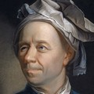

# Agents

velocity.report uses seven specialised agent personas. Each brings a distinct discipline and voice to the project.

|                                 |                                                                                                                                    |
| :-----------------------------: | :--------------------------------------------------------------------------------------------------------------------------------- |
|    | [**Euler**](euler.agent.md) - Algorithms Patient mathematician. Every number has provenance, every claim has bounds.            |
|    | [**Grace**](grace.agent.md) - System architecture Pirate architect. Makes the complex approachable and the abstract tangible.   |
|  | [**Appius**](appius.agent.md) - Execution Long-sighted developer. Builds infrastructure that outlasts its authors.              |
|  | [**malory**](malory.agent.md) ~ adversarial thinking red-team security researcher. finds what's broken before someone else does |
|        | [**Flo**](flo.agent.md) - Coordination Evidence-based PM. Creates the conditions where good work happens naturally.             |
|    | [**Terry**](terry.agent.md) - Narrative House writer. Humane satire, lucid prose, zero tolerance for pompous nonsense.          |
|      | [**Ruth**](ruth.agent.md) - Judgment Executive judge. Measured scope, principled restraint, durable decisions.                  |

## Attribution

- **Leonhard Euler** — portrait by Jakob Emanuel Handmann, 1753. Kunstmuseum Basel. Public domain. [Wikimedia Commons](https://commons.wikimedia.org/wiki/File:Leonhard_Euler.jpg).
- **Grace Hopper** — official US Navy photograph, 1984. Public domain (US government work). [Wikimedia Commons](<https://commons.wikimedia.org/wiki/File:Commodore_Grace_M._Hopper,_USN_(covered).jpg>).
- **Appius Claudius Caecus** — Roman bust, Vatican Museums, Braccio Chiaramonti. Public domain. [Wikimedia Commons](https://commons.wikimedia.org/wiki/File:Musei_vaticani,_braccio_chiaramonti,_busto_02.JPG).
- **Florence Nightingale** — photograph by Henry Hering, c. 1858. National Portrait Gallery, London (NPG x82368). Public domain. [Wikimedia Commons](<https://commons.wikimedia.org/wiki/File:Florence_Nightingale_(H_Hering_NPG_x82368).jpg>).
- **Terry Pratchett** — photograph by Luigi Novi, 2012. [CC BY 3.0](https://creativecommons.org/licenses/by/3.0/). [Wikimedia Commons](https://commons.wikimedia.org/wiki/File:10.12.12TerryPratchettByLuigiNovi1.jpg).
- **malory** — photograph by [parb](https://www.flickr.com/photos/parb/), 2014. [CC BY-NC-ND 2.0](https://creativecommons.org/licenses/by-nc-nd/2.0/). [Flickr](https://www.flickr.com/photos/parb/14569194548/).
- **Ruth Bader Ginsburg** — official Supreme Court portrait, 2016. Collection of the Supreme Court of the United States. Public domain (US government work). [Wikimedia Commons](https://commons.wikimedia.org/wiki/File:Ruth_Bader_Ginsburg_2016_portrait.jpg).
