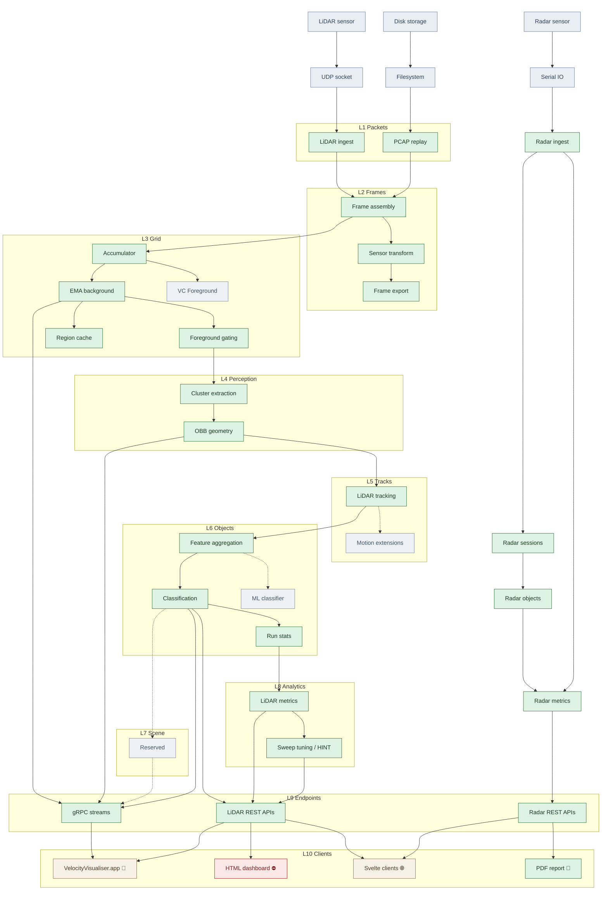

```
____ ____ ____ _  _ _ ___ ____ ____ ___ _  _ ____ ____
|__| |__/ |    |__| |  |  |___ |     |  |  | |__/ |___
|  | |  \ |___ |  | |  |  |___ |___  |  |__| |  \ |___
```

This document describes the system architecture, component relationships, data flow,
and integration points for the velocity.report traffic monitoring system.

For canonical numeric constants (ports, tuning defaults, and hard-coded thresholds),
see [MAGIC_NUMBERS.md](MAGIC_NUMBERS.md).

### How to read this document

- **Perception / ML engineers:** Start with [Perception pipeline](#perception-pipeline) and [Data & evaluation](#data--evaluation), then [Component status](#component-status) for the layer table.
- **Deploying the system:** Start with [Deployment architecture](#deployment-architecture), then [Quick start](README.md#quick-start).
- **Contributing code:** Start with [Components](#components) and [Integration points](#integration-points).

## Table of contents

- [System overview](#system-overview)
- [Sensor hardware](#sensor-hardware)
- [Architecture diagram](#architecture-diagram)
- [Components](#components)
- [Perception pipeline](#perception-pipeline)
- [Data flow](#data-flow)
- [Technology stack](#technology-stack)
- [Integration points](#integration-points)
- [Data & evaluation](#data--evaluation)
- [Deployment architecture](#deployment-architecture)
- [Security & privacy](#security--privacy)
- [Component status](#component-status)
- [Roadmap](#roadmap)
- [Mathematical references](#mathematical-references)

## System overview

**velocity.report** is a privacy-preserving traffic monitoring platform.
The core product is radar-based speed measurement:
a Doppler radar sensor captures vehicle speeds, the Go server stores and aggregates the data,
and produces professional reports ready for a city engineer's desk or a planning committee hearing.
PDF generation runs through the native Go + XeLaTeX pipeline. No cameras,
no licence plates, no personally identifiable information: by architecture, not by policy.

The LiDAR pipeline extends the picture.
Where radar sees a vehicle's speed through a narrow field of view, LiDAR sees the full scene:
every object's shape, trajectory, and classification across the entire road.
A car that enters at 25 mph, slows for a pedestrian,
and exits at 35 mph is one speed reading to radar but a complete behavioural record to LiDAR.
The perception stack (DBSCAN clustering, Kalman-filtered tracking,
rule-based classification) runs on the same Raspberry Pi,
processing 70,000 points per frame at 10 Hz with no cloud dependency.

The two sensors are complementary. Radar provides Doppler-accurate speed.
LiDAR provides geometry, object identity, and track continuity.
Fusing them is the [v1.0 goal](docs/plans/lidar-l7-scene-plan.md).

| Component            | Language            | Purpose                                                            |
| -------------------- | ------------------- | ------------------------------------------------------------------ |
| **Go server**        | Go                  | Sensor data collection, SQLite storage, HTTP + gRPC API            |
| **PDF reports**      | Go + XeLaTeX        | Professional speed reports with charts, statistics, and formatting |
| **Web frontend**     | Svelte + TypeScript | Real-time data visualisation and interactive dashboards            |
| **macOS visualiser** | Swift + Metal       | Native 3D LiDAR point cloud viewer with tracking and replay        |

### Design principles

- **Privacy First**: No licence plates, no video, no PII
- **Simplicity**: SQLite as the only database, minimal dependencies
- **Offline-First**: Works without internet connectivity
- **Modular**: Each component operates independently
- **Well-Tested**: Comprehensive test coverage across all components

## Sensor hardware

| Sensor | Model                 | Measurement    | Interface           | Key Specifications                                                                        |
| ------ | --------------------- | -------------- | ------------------- | ----------------------------------------------------------------------------------------- |
| Radar  | OmniPreSense OPS243-A | Doppler speed  | USB-Serial (RS-232) | K-band (24 GHz), ±0.1 mph accuracy, FFT-based, configurable speed/magnitude thresholds    |
| LiDAR  | Hesai Pandar40P       | 3D point cloud | Ethernet/UDP (PoE)  | 40 beams, 100 m range, 10-20 Hz rotation, 0.2° azimuth resolution, ~700,000 points/second |

Radar delivers Doppler-accurate speed through a narrow field of view.
LiDAR delivers full-scene geometry: shape, trajectory, and classification across the entire road.
The two sensors run independently today;
sensor fusion via cross-sensor track handoff is the [v1.0 goal](docs/plans/lidar-l7-scene-plan.md).

For detailed sensor specifications, wiring, and calibration:
see [.github/knowledge/hardware.md](.github/knowledge/hardware.md).

## Architecture diagram

### Data Flow

```
Radar (USB-serial) ──┐
                     ├──► Go server (SQLite) ──► HTTP API (:8080) ────► Web frontend (Svelte)
LiDAR (UDP/Ethernet)─┘         │                        │          └──► Go PDF pipeline (internal/report)
                               │                        └─────────────► /docs/ (offline docs)
                               ├───────────────► LiDAR HTTP (:8081)
                               └───────────────► gRPC (:50051) ───────► macOS visualiser (Swift/Metal)
```

### Physical deployment

Core runtime on Raspberry Pi:

- Go service (`velocity-report.service`)
- SQLite database (`sensor_data.db`)
- Transit worker (background sessionisation)

#### Network configuration

| Surface                | Endpoint             | Purpose                                        |
| ---------------------- | -------------------- | ---------------------------------------------- |
| LiDAR listener         | `192.168.100.151/24` | Receives LiDAR UDP packets                     |
| LiDAR sensor source    | `192.168.100.202`    | Sensor IP sending UDP packets                  |
| Local LAN              | via DHCP             | Serves HTTP API and gRPC to local clients      |
| HTTP API               | `0.0.0.0:8080`       | Radar stats, config, commands, and report APIs |
| gRPC visualiser stream | `0.0.0.0:50051`      | `VisualiserService` frame streaming            |

#### Key paths and runtime artefacts

| Item                    | Path                                      | Notes                       |
| ----------------------- | ----------------------------------------- | --------------------------- |
| Service binary          | `/usr/local/bin/velocity-report`          | systemd-managed executable  |
| Service data directory  | `/var/lib/velocity-report/`               | Persistent local data       |
| SQLite database         | `/var/lib/velocity-report/sensor_data.db` | Primary datastore           |
| Radar device            | `/dev/ttyUSB0`                            | OPS243 serial input         |
| Go server code          | `cmd/`, `internal/`                       | Sensor ingest, API, workers |
| Report pipeline         | `internal/report/`                        | In-process PDF generation   |
| Web client source       | `web/`                                    | Svelte/TypeScript frontend  |
| macOS visualiser source | `tools/visualiser-macos/`                 | Swift/Metal gRPC client     |

### LiDAR layer map (L1-L10)

#### Segmented concept status chart

This is the primary visual breakdown for the layer model. Green nodes show
implemented components; grey nodes mark planned extensions with no runtime
code yet. L7 remains an explicit empty slot so the canonical L1-L10 stack
stays visually fixed.



## Components

### Go server

**Location**: `/cmd/`, `/internal/`

**Purpose**: Real-time data collection, storage, and API server

**Key Modules**:

- **[cmd/radar/](cmd/radar)** - Main server entry point
  - Sensor data collection (radar/LiDAR)
  - HTTP API server
  - Background task scheduler
  - Systemd service integration

- **[internal/api/](internal/api)** - HTTP API endpoints
  - `/api/radar_stats` - Statistical summaries and rollups
  - `/api/config` - Configuration retrieval
  - `/command` - Send radar commands
  - RESTful design with JSON responses

- **[internal/radar/](internal/radar)** - Radar sensor integration
  - Serial port communication
  - Data parsing and validation
  - Error handling and retry logic

- **[internal/lidar/](internal/lidar)** - LiDAR sensor integration
  - UDP packet listener and decoder (Hesai Pandar40P)
  - `FrameBuilder` accumulates complete 360° rotations with sequence checks
  - `BackgroundManager` maintains EMA grid (40 rings × 1800 azimuth bins)
  - Persists `lidar_bg_snapshot` rows and emits `frame_stats` into `system_events`
  - Tooling for ASC export, pose transforms, and background tuning APIs

- **[internal/lidar/sweep/](internal/lidar/sweep)** - Parameter sweep and tuning
  - `Runner`: runs combinatorial parameter sweeps (manual mode)
  - `AutoTuner`: iterative bounds-narrowing with proxy or ground truth scoring (auto mode)
  - `HINTTuner`: human-involved numerical tuning: creates reference runs, waits for human track labelling, then sweeps with ground truth scores (hint mode)

- **[internal/monitoring/](internal/monitoring)** - System monitoring
  - Health checks
  - Performance metrics
  - Error logging

- **[internal/units/](internal/units)** - Unit conversion
  - Speed conversions (MPH ↔ KPH)
  - Distance conversions
  - Timezone handling

**Runtime**: Deployed as systemd service on Raspberry Pi (ARM64 Linux)

**Communication**:

- **Input**:
  - Radar: Serial port data (/dev/ttyUSB0, USB connection)
  - LiDAR: Network/UDP packets (Ethernet connection, verified with LidarView/CloudCompare)
- **Output**:
  - HTTP API (JSON over port 8080, HTTPS via nginx on port 443)
  - SQLite database writes

### Go PDF report pipeline

**Location**: `internal/report/`

**Purpose**: Generate professional PDF reports from sensor data directly in Go.
Invoked via `POST /api/generate_report` or `velocity-report pdf --config cfg.json`.

**Key Packages**:

- **`internal/report/`** — `Generate()` orchestrator: DB queries, chart rendering, TeX assembly, xelatex compilation
- **`internal/report/chart/`** — Direct SVG generation for time-series, histogram, and comparison charts
- **`internal/report/tex/`** — `text/template`-based LaTeX assembly with embedded `.tex` templates

**Runtime**: In-process within the Go server; no subprocess or Python interpreter

**Communication**:

- **Input**: `report.Config` struct (populated by API handler from HTTP request)
- **Output**: PDF + ZIP sources archive via `report.Result{PDFPath, ZIPPath}`

**Dependencies** (external binaries):

- `xelatex` — TeX compilation (vendored minimal TeX Live tree in `/opt/velocity-report/texlive`)
- `rsvg-convert` — SVG → PDF conversion for chart figures (`librsvg2-bin`)

### Web frontend

**Location**: `/web/`

**Purpose**: Real-time data visualisation and interactive dashboards

**Key Technologies**:

- **Svelte** - Reactive UI framework
- **TypeScript** - Type-safe development
- **Vite** - Build tool and dev server
- **pnpm** - Package management

**Features**:

- Real-time chart updates
- Interactive data filtering
- Responsive design
- REST API integration

**Runtime**: Development server (Vite) or static build

**Communication**:

- **Input**: Go Server HTTP API (JSON)
- **Output**: HTML/CSS/JS served to browser

### macOS visualiser (swift/Metal)

**Location**: `/tools/visualiser-macos/`

**Purpose**:
Real-time 3D visualisation of LiDAR point clouds, object tracking, and debug overlays for M1+ Macs

**Technology Stack**:

- Swift 5.9+ with SwiftUI (macOS 14+)
- Metal for GPU-accelerated rendering
- grpc-swift for streaming communication
- XCTest for testing

**Completed Features (M0 + M1)**:

- ✅ SwiftUI app shell with window management
- ✅ Metal point cloud renderer (10,000+ points at 30fps)
- ✅ Instanced box renderer for tracks (AABB)
- ✅ Trail renderer with fading polylines
- ✅ gRPC client connecting to localhost:50051
- ✅ 3D camera controls (orbit, pan, zoom)
- ✅ Mouse/trackpad gesture support
- ✅ Pause/Play/Seek/SetRate playback controls
- ✅ Frame-by-frame navigation (step forward/back)
- ✅ Timeline scrubber with frame timestamps
- ✅ Playback rate adjustment (0.5x - 64x)
- ✅ Overlay toggles (show/hide tracks, trails, boxes)
- ✅ Deterministic replay of `.vrlog` recordings

**Go Backend** ([internal/lidar/l9endpoints/](internal/lidar/l9endpoints)):

- `grpc_server.go` - gRPC streaming server implementing VisualiserService
- `replay.go` - ReplayServer for streaming `.vrlog` files with seek/rate control
- `recorder/` - Record live frames to `.vrlog` format
- `synthetic.go` - Synthetic data generator for testing
- `adapter.go` - Convert pipeline data to FrameBundle proto
- `model.go` - Canonical FrameBundle data structures

**Swift Client**: [tools/visualiser-macos/VelocityVisualiser/](tools/visualiser-macos/VelocityVisualiser)

- `App/` - Application entry point and global state
- `gRPC/` - gRPC client wrapper and proto decoding
- `Rendering/` - Metal shaders and render pipeline
- `UI/` - SwiftUI views (playback controls, overlays, inspector)
- `Models/` - Swift data models (Track, Cluster, PointCloud)

**Command-Line Tools**:

- [cmd/tools/visualiser-server](cmd/tools/visualiser-server) - Multi-mode server (synthetic/replay/live)
- [cmd/tools/gen-vrlog](cmd/tools/gen-vrlog) - Generate sample `.vrlog` recordings

**Protocol Buffer Schema**: [proto/velocity_visualiser/v1/visualiser.proto](proto/velocity_visualiser/v1/visualiser.proto)

```protobuf
service VisualiserService {
  rpc StreamFrames(StreamRequest) returns (stream FrameBundle);
  rpc Pause(PauseRequest) returns (PlaybackStatus);
  rpc Play(PlayRequest) returns (PlaybackStatus);
  rpc Seek(SeekRequest) returns (PlaybackStatus);
  rpc SetRate(SetRateRequest) returns (PlaybackStatus);
  rpc SetOverlayModes(OverlayModeRequest) returns (OverlayModeResponse);
  rpc GetCapabilities(CapabilitiesRequest) returns (CapabilitiesResponse);
  rpc StartRecording(RecordingRequest) returns (RecordingStatus);
  rpc StopRecording(RecordingRequest) returns (RecordingStatus);
}
```

**Communication**:

- **Input**: gRPC streaming (localhost:50051)
- **Output**: User interactions, label annotations (planned)

**See**: [tools/visualiser-macos/README.md](tools/visualiser-macos/README.md) and
[docs/ui/](docs/ui/)

### Database layer

**Location**: `./sensor_data.db`, managed by [internal/db/](internal/db) <!-- link-ignore -->

**Database**: SQLite (via `modernc.org/sqlite v1.50.0`)

**Schema Design**:

The database uses a **JSON-first approach** with generated columns for performance.
Raw sensor events are stored as JSON,
with frequently-queried fields extracted to indexed columns automatically.

**Example - `radar_data` table**:

```sql
CREATE TABLE radar_data (
    write_timestamp DOUBLE DEFAULT (UNIXEPOCH('subsec')),
    raw_event JSON NOT NULL,
    -- Generated columns (automatically extracted from JSON)
    uptime DOUBLE AS (JSON_EXTRACT(raw_event, '$.uptime')) STORED,
    magnitude DOUBLE AS (JSON_EXTRACT(raw_event, '$.magnitude')) STORED,
    speed DOUBLE AS (JSON_EXTRACT(raw_event, '$.speed')) STORED
);
```

When a sensor reading arrives, the Go server stores the entire event as JSON in `raw_event`,
and SQLite automatically populates the generated columns. This provides:

- **Flexibility**: Complete event data preserved for future analysis
- **Performance**: Fast indexed queries on common fields (speed, timestamp)
- **Schema evolution**: New fields can be added without migration

**Key Tables**:

- `radar_data` - Raw radar readings (JSON events with speed/magnitude)
- `radar_objects` - Classified transits from radar's onboard classifier
- `radar_data_transits` - Sessionized transits built by transit worker from `radar_data`
- `radar_transit_links` - Many-to-many links between transits and raw radar_data
- `lidar_bg_snapshot` - LiDAR background grid for motion detection (40×1800 range-image)
- `lidar_objects` - Track-extracted transits from LiDAR processing [PLANNED]
- `radar_commands` / `radar_command_log` - Command history and execution logs
- `site` - Site metadata (location, speed limits)
- `site_config_periods` - Time-based sensor configuration (cosine error angle history)

**Transit Sources** (3 independent object detection pipelines):

1. **radar_objects**: Hardware classifier in OPS243 radar sensor
2. **radar_data_transits**: Software sessionization of raw radar_data points
3. **lidar_objects**: Software tracking from LiDAR point clouds [PLANNED]

These three sources will be compared for initial reporting, with eventual goal of:

- FFT-based radar processing for improved object segmentation
- Sensor fusion using LiDAR data to assist radar object detection

**Key Features**:

- High-precision timestamps (DOUBLE for subsecond accuracy via `UNIXEPOCH('subsec')`)
- Sessionization via `radar_data_transits` (avoids expensive CTEs in queries)
- LiDAR background modeling for change detection (grid stored as BLOB)
- WAL mode enabled for concurrent readers/writers
- Indexes on timestamp columns for fast time-range queries
- Time-based site configuration via `site_config_periods` (Type 6 Slowly Changing Dimension)

**Site Configuration Periods**:

The `site_config_periods` table implements a Type 6 SCD pattern for tracking sensor configuration
changes over time. Key aspects:

- **Cosine error correction**: Radar mounted at an angle measures lower speeds than actual. Each period stores the mounting angle for automatic correction.
- **Non-overlapping periods**: Database triggers enforce that periods for the same site cannot overlap.
- **Active period tracking**: One period per site is marked `is_active = 1` for new data collection.
- **Retroactive corrections**: Changing a period's angle automatically affects all reports querying that time range.
- **Comparison report accuracy**: When comparing periods with different configurations, each period's data is corrected independently.

**Migrations**: Located in `/internal/db/migrations/`, managed by Go server

**Access Patterns**:

- **Go Server**: Read/Write
  - Real-time inserts to `radar_data` (raw radar events)
  - Hardware classifier → `radar_objects`
  - Transit worker → sessionize `radar_data` → `radar_data_transits`
  - LiDAR background grid → `lidar_bg_snapshot`
  - [PLANNED] LiDAR tracking → `lidar_objects`
- **Web Frontend**: Read-only (via HTTP API)
  - Real-time dashboard showing all 3 transit sources

## Perception pipeline

The LiDAR perception stack runs layers L3 through L6 on every 10 Hz frame:
background subtraction, clustering, tracking, and classification.
Each layer is a separate Go package under [internal/lidar/](internal/lidar),
with its own parameters, tests, and maths reference. The pipeline aims to process
~70,000 points per frame on a Raspberry Pi 4 with no cloud dependency.

### L3: background model

The background model separates static scene (road surface, buildings,
vegetation) from moving objects.
It maintains a 40 × 3,600 polar grid (one row per LiDAR beam,
one column per 0.1° azimuth bin) where each cell tracks an exponentially weighted moving average of
range values and a Welford online variance estimate.

Cells are classified into three adaptive region types: **stable** (pavement, walls:
low variance, tight foreground threshold), **variable** (parked cars, street furniture:
moderate variance, relaxed threshold), and **volatile** (trees, reflective surfaces:
high variance, wide threshold).
The classification adapts per cell,
so a parking space that empties mid-session reclassifies automatically.
A point counts as foreground when its range deviates from the cell's background mean by more than a
threshold scaled to the cell's region type.

The grid settles over a configurable number of frames.
Until a cell has seen enough observations,
it remains unsettled and does not contribute to foreground extraction,
which prevents the first vehicle through the scene from becoming part of the background.

### L4: clustering and geometry

Foreground points are grouped into spatial clusters using DBSCAN with a grid-accelerated spatial
index. The index maps each point to a cell via a Szudzik pairing function on signed grid
coordinates, making neighbourhood queries O(1) per point instead of O(n).
Clusters are filtered by size, aspect ratio, and point count to reject noise and scene artefacts.

Each cluster gets an oriented bounding box (OBB) fitted via 2D PCA on its ground-plane projection.
PCA alone is ambiguous (the eigenvectors can flip 180° or swap axes between frames),
so the pipeline applies heading disambiguation guards:
aspect-ratio locking for near-square clusters,
90° jump rejection against the previous frame's heading,
and EMA temporal smoothing (α = 0.08) to absorb jitter without lagging real turns.

Ground-plane points within each cluster are removed using a local height threshold relative to the
cluster's lowest points.

### L5: multi-object tracking

Tracking follows the predict–associate–update loop.
Each track maintains a constant-velocity Kalman filter with state vector `[X, Y, VX, VY]` and a 4 ×
4 covariance matrix.
The motion model assumes constant velocity between frames,
simple enough to run at 10 Hz on constrained hardware,
accurate enough for urban traffic where vehicles rarely accelerate hard between 100 ms frames.

Association uses the Hungarian algorithm (Kuhn–Munkres) with Mahalanobis distance as the cost
metric. Three gating guards reject implausible assignments before they reach the solver:
a Euclidean position jump limit (5 m), an implied speed limit (30 m/s),
and a Mahalanobis distance² threshold (36).
Unmatched detections spawn tentative tracks;
unmatched tracks enter a coasting window where the Kalman prediction runs without measurement
updates.

Track lifecycle:
a new track is **tentative** until it accumulates 4 consecutive hits, then **confirmed**.
A confirmed track tolerates up to 15 consecutive misses (coasting through brief occlusions) before
deletion. Tentative tracks are deleted after 3 misses.
Covariance inflates progressively during coasting,
so a coasted track's association gate widens naturally:
it accepts a returning detection at greater distance but with lower confidence.

### L6: classification

Each confirmed track is classified using a rule-based system (v1.2) that evaluates spatial and
kinematic features: bounding box dimensions, aspect ratio, speed, point count, and height profile.
The classifier assigns one of eight object types:
car, truck, bus, pedestrian, cyclist, motorcyclist, bird, and dynamic (unclassified moving object),
with confidence levels at three tiers: high (0.85), medium (0.70), and low (0.50).

The rule set uses threshold ranges derived from measured vehicle dimensions and typical urban
speeds. Truck and motorcyclist labels are currently display-only:
visible in the visualiser and VRLOG replay but not selectable in the labelling UI,
pending wider validation data.
The `ClassDynamic` label catches moving objects that do not match any specific profile,
useful for flagging edge cases rather than forcing a wrong classification.

The classification is deliberately rule-based rather than learned.
With single-digit labelled sessions, a trained classifier would overfit;
the rule set is transparent, tuneable,
and correct enough to structure the data for future ML work when the ground truth corpus is larger.

## Data flow

### Real-time data collection

```
Radar (Serial):
1. OPS243 radar → USB-Serial (/dev/ttyUSB0)
2. internal/radar/ reader parses JSON speed/magnitude payloads
3. INSERT raw packets into `radar_data`; hardware detections → `radar_objects`

LiDAR (Network/UDP):
1. Hesai P40 → Ethernet/UDP (192.168.100.202 → 192.168.100.151 listener)
2. Packet decoder reconstructs blocks → `FrameBuilder` completes 360° rotations
3. `BackgroundManager` updates EMA background grid (40 × 1800 cells)
4. Persist snapshots → INSERT/UPSERT `lidar_bg_snapshot`
5. Emit frame statistics and performance metrics → `system_events`
6. [Optional] Stream FrameBundle → gRPC visualiser clients (port 50051)

Transit Worker (Background Process):
1. Query recent radar_data points → Sessionisation algorithm
2. Group readings into vehicle transits (time-gap based)
3. INSERT/UPDATE radar_data_transits
4. Link raw data → INSERT INTO radar_transit_links

Three Transit Sources:
• radar_objects        (radar hardware classifier)
• radar_data_transits  (software sessionisation)
• lidar_objects        (LiDAR tracking) [PLANNED]
```

### PDF report generation

```
1. User → POST /api/generate_report (or: velocity-report pdf config.json)
2. Go server → internal/report/report.go → Direct SQLite query
3. internal/report/chart/*.go → SVG charts → rsvg-convert → PDF charts
4. internal/report/tex/render.go → text/template → .tex file
5. os/exec → xelatex → .pdf output
6. archive/zip → .zip archive (tex + SVGs + PDF)
```

### Web visualisation

```
1. User → Open browser → Vite dev server (or static build)
2. Frontend → Fetch /api/radar_stats → Go Server
3. Go Server → Query SQLite → Return JSON
4. Frontend → Parse JSON → Render Svelte components
5. Frontend → Display charts/tables → Browser DOM
```

### macOS LiDAR visualisation

```
Live Mode:
1. LiDAR sensor → UDP packets → Go Server → FrameBuilder
2. FrameBuilder → Tracker → Adapter → FrameBundle proto
3. gRPC Server (port 50051) → StreamFrames RPC → Swift client
4. Swift client → Decode proto → Metal renderer
5. User ← 3D point clouds + tracks + trails

Replay Mode:
1. User → Select .vrlog file → Go ReplayServer
2. ReplayServer → Read frames from disk → gRPC stream
3. User → Pause/Play/Seek/SetRate → Control RPCs
4. ReplayServer → Adjust playback → Stream at selected rate
5. Swift client → Render frames → Frame-by-frame navigation

Synthetic Mode (Testing):
1. Go SyntheticGenerator → Generate rotating points + moving boxes
2. gRPC Server → StreamFrames → Swift client
3. Swift client → Render synthetic data → Validate pipeline
```

## Technology stack

### Go server

| Component  | Technology                    | Version | Purpose                 |
| ---------- | ----------------------------- | ------- | ----------------------- |
| Language   | Go                            | 1.26+   | High-performance server |
| Database   | SQLite (`modernc.org/sqlite`) | v1.50.0 | Data storage            |
| HTTP       | net/http (stdlib)             | -       | API server              |
| gRPC       | google.golang.org/grpc        | 1.81+   | Visualiser streaming    |
| Protobuf   | google.golang.org/proto       | 1.36+   | Data serialisation      |
| Serial     | go.bug.st/serial              | 1.6+    | Sensor communication    |
| Deployment | systemd                       | -       | Service management      |
| Build      | Make                          | -       | Build automation        |

### Web frontend

| Component       | Technology | Version | Purpose               |
| --------------- | ---------- | ------- | --------------------- |
| Framework       | Svelte     | 5.x     | Reactive UI           |
| Language        | TypeScript | 6.x     | Type safety           |
| Build Tool      | Vite       | 8.x     | Dev server & bundling |
| Package Manager | pnpm       | 10.x    | Dependency management |
| Linting         | ESLint     | 10.x    | Code quality          |

### macOS visualiser

| Component     | Technology | Version  | Purpose              |
| ------------- | ---------- | -------- | -------------------- |
| Language      | Swift      | 5.9+     | Native macOS app     |
| UI Framework  | SwiftUI    | macOS 14 | Declarative UI       |
| GPU Rendering | Metal      | 3.x      | 3D point clouds      |
| gRPC Client   | grpc-swift | 1.23+    | Server communication |
| Testing       | XCTest     | -        | Unit tests           |
| Build         | Xcode      | 15+      | IDE & build system   |

## Integration points

### Go server ↔ SQLite

**Interface**: Go database/sql with SQLite driver

**Operations**:

- INSERT `radar_data` (real-time writes with JSON events)
- INSERT `radar_objects` (classified detections)
- Background sessionisation: query `radar_data` → insert/update `radar_data_transits`
- LiDAR background modelling: update `lidar_bg_snapshot`
- SELECT for API queries (read optimised with generated columns)

**Performance Considerations**:

- JSON storage with generated columns for fast indexed queries
- Indexes on timestamp columns (`transit_start_unix`, `transit_end_unix`)
- Batched inserts for high-frequency sensors
- WAL mode for concurrent reads during writes
- Subsecond timestamp precision (DOUBLE type)

### Go server ↔ Go PDF report pipeline

**Interface**: HTTP REST API (JSON)

**Endpoints**:

```
GET /api/radar_stats?start=<unix>&end=<unix>&group=<15m|1h|24h>&source=<radar_objects|radar_data_transits>
Response: {
  "metrics": [
    {
      "start_time": "2025-01-01T00:00:00Z",
      "count": 1234,
      "max_speed": 45.2,
      "p50_speed": 28.5,
      "p85_speed": 32.1,
      "p98_speed": 38.4
    },
    ...
  ],
  "histogram": {
    "0.00": 10,
    "5.00": 25,
    ...
  }
}

**Percentile policy**: `p50_speed`, `p85_speed`, and `p98_speed` are
**aggregate** percentiles computed over a population of vehicle max speeds
within each time bucket. Speed percentiles are never computed on a single
track's observations. The core high-speed metric is **p98**: the speed
exceeded by only 2% of observed vehicles, which requires at least 50
observations to be statistically meaningful.

GET /api/config
Response: {
  "units": "mph",
  "timezone": "America/Los_Angeles"
}

GET /events
Response: [
  {
    "uptime": 12345.67,
    "magnitude": 3456,
    "speed": 28.5,
    "direction": "inbound",
    "raw_json": "{...}"
  },
  ...
]
```

**Query Parameters**:

- `start`, `end`: Unix timestamps (seconds)
- `group`: Time bucket size (`15m`, `30m`, `1h`, `2h`, `3h`, `4h`, `6h`, `8h`, `12h`, `24h`, `all`, `2d`, `3d`, `7d`, `14d`, `28d`)
- `source`: Data source (`radar_objects` or `radar_data_transits`)
- `model_version`: Transit model version (when using `radar_data_transits`)
- `min_speed`: Minimum speed filter (in display units)
- `units`: Override units (`mph`, `kph`, `mps`)
- `timezone`: Override timezone
- `compute_histogram`: Enable histogram computation (`true`/`false`)
- `hist_bucket_size`: Histogram bucket size
- `hist_max`: Histogram maximum value

**Error Handling**:

- HTTP 200: Success
- HTTP 400: Invalid parameters
- HTTP 405: Method not allowed
- HTTP 500: Server error
- Python client retries with exponential backoff

### Go server ↔ web frontend

**Interface**: HTTP REST API (JSON) + Static file serving

**Same API as Python**, plus:

- Static file serving for Svelte build (`/app/*`)
- SPA routing with fallback to `index.html`
- Favicon serving
- Root redirect to `/app/`

### Go server ↔ macOS visualiser

**Interface**: gRPC streaming over protobuf (port 50051)

**Protocol**: `velocity_visualiser.v1.VisualiserService`

**Streaming RPC**:

```protobuf
// Server-streaming: continuous frame delivery
rpc StreamFrames(StreamRequest) returns (stream FrameBundle);
```

**Control RPCs** (replay mode):

```protobuf
rpc Pause(PauseRequest) returns (PlaybackStatus);
rpc Play(PlayRequest) returns (PlaybackStatus);
rpc Seek(SeekRequest) returns (PlaybackStatus);   // Seek to frame index
rpc SetRate(SetRateRequest) returns (PlaybackStatus);  // 0.5x - 64x
rpc GetCapabilities(CapabilitiesRequest) returns (CapabilitiesResponse);
```

**Recording RPCs** (live mode):

```protobuf
rpc StartRecording(RecordingRequest) returns (RecordingStatus);
rpc StopRecording(RecordingRequest) returns (RecordingStatus);
```

**FrameBundle Contents**:

- `frame_id` - Unique frame identifier
- `timestamp` - Frame timestamp (nanoseconds)
- `point_cloud` - XYZ points with intensity (up to 70,000 per frame)
- `tracks` - Active tracked objects with bounding boxes
- `clusters` - Raw cluster data (optional)
- `playback_info` - Current frame index, total frames, rate, paused state

**Server Modes**:

- **Live**: Stream real-time LiDAR data, record to `.vrlog`
- **Replay**: Stream recorded `.vrlog` files with playback control
- **Synthetic**: Generate test data for development

**Performance**:

- Frame rate: 10-20 Hz (configurable)
- Points per frame: Up to 70,000
- Tracks per frame: Up to 200
- Latency: < 50ms end-to-end

## Data & evaluation

### VRLOG recording format

LiDAR sessions are recorded in the VRLOG format (v0.5),
a seekable binary container for point clouds, tracks, and metadata.
A recording is a directory containing chunked data files and a binary index.

Each index entry is 24 bytes:
an 8-byte frame ID, an 8-byte nanosecond timestamp, a 4-byte chunk ID,
and a 4-byte offset within the chunk.
The index is sorted by frame ID, enabling binary search for random access:
the visualiser can seek to any frame in a multi-hour recording without scanning the data files.
Chunks rotate at 1,000 frames or 150 MB, whichever comes first.

VRLOG recordings are the primary unit of reproducible work.
Every parameter sweep, every labelling session, and every evaluation run operates on a VRLOG file,
so results are deterministic and reviewable.

### Track labelling and ground truth

The labelling workflow produces ground truth for parameter evaluation.
A human reviewer watches a VRLOG replay in the macOS visualiser or Svelte frontend,
marks each track as correctly detected, fragmented, false positive, or missed,
and annotates the object type.
Labels are stored alongside the recording and versioned with the run that produced them.

The label vocabulary distinguishes selectable labels (what a reviewer can assign) from display
labels (what the classifier can output).
This separation lets the classifier report fine-grained types like truck and motorcyclist without
requiring reviewers to distinguish them reliably at LiDAR resolution,
an honest acknowledgement that some categories are easier to classify than to label.

### HINT parameter tuner

HINT (Human-Involved Numerical Tuning) closes the loop between perception quality and parameter
selection. The workflow:

1. **Reference run**: process a VRLOG recording with current parameters to produce tracks.
2. **Label**: a human labels the tracks (correct, fragmented, false positive, missed).
3. **Sweep**: the tuner replays the same recording across a grid of parameter combinations, scoring each against the labelled ground truth.
4. **Select**: the combination with the best composite score becomes the new parameter set.

The scoring function is a weighted linear combination of detection quality metrics:
acceptance rate, track fragmentation, false positive rate, heading jitter, speed jitter,
and foreground capture ratio, among others.
Weights are configurable;
the defaults penalise fragmentation heavily (a vehicle that splits into three tracks is worse than
one that is slightly misaligned) and reward detection rate.

HINT is not automated optimisation: the human labelling step is deliberate.
At the current data scale,
a reviewer who watches the replay catches failure modes that no metric captures:
a track that technically scores well but visually drifts through a wall,
or a cluster that fragments because the parameters are tuned for a different scene geometry.
The human stays in the loop until the ground truth corpus is large enough to trust automated
evaluation.

## Deployment architecture

### Production environment (Raspberry Pi)

```
┌────────────────────────────────────────────────┐
│         Raspberry Pi 4 (ARM64, Linux)          │
│                                                │
│  ┌──────────────────────────────────────────┐  │
│  │  systemd (velocity-report.service)       │  │
│  │  ↓                                       │  │
│  │  /usr/local/bin/velocity-report          │  │
│  │  --db-path /var/lib/velocity-report/...  │  │
│  │  (Go Server Binary)                      │  │
│  │                                          │  │
│  │  Configuration:                          │  │
│  │  • --listen :8080                        │  │
│  │  • --db-path (explicit SQLite location)  │  │
│  │  • WorkingDirectory=/var/lib/velocity... │  │
│  └──────────────────────────────────────────┘  │
│                                                │
│  ┌──────────────────────────────────────────┐  │
│  │  SQLite Database                         │  │
│  │  /var/lib/velocity-report/sensor_data.db │  │
│  └──────────────────────────────────────────┘  │
│                                                │
│  Sensor Connections:                           │
│  • /dev/ttyUSB0 (Radar - Serial)               │
│  • Network/UDP (LiDAR - Ethernet)              │
└────────────────────────────────────────────────┘
```

**Service Management**:

```sh
sudo systemctl status velocity-report.service
sudo systemctl restart velocity-report.service
sudo journalctl -u velocity-report.service -f
```

### Development environment

```
Developer Machine (macOS/Linux/Windows)

Go Development:
• ./app-local -dev (local build)
• Mock sensors or test data

Web Development:
• pnpm dev (Vite dev server)
• http://localhost:5173
• Hot module reloading
```

## Security & privacy

### Privacy guarantees

✅ **No licence plate recognition**

- Sensors measure speed only, no cameras

✅ **No video recording**

- Pure time-series data (timestamp + speed)

✅ **No personally identifiable information**

- No tracking of individual vehicles
- Aggregate statistics only

✅ **Local storage**

- All data stored locally on device
- No cloud uploads unless explicitly configured

### Security considerations

**API Access**:

- Currently no authentication (local network only)
- **TODO**: Add API key authentication for production deployments

**Database**:

- File permissions restrict access to service user
- No sensitive data stored (speed + timestamp only)

**Network**:

- Designed for local network operation
- Can be exposed via reverse proxy if needed
- HTTPS support via reverse proxy (nginx, caddy)

**Updates**:

- Manual deployment process
- Systemd service restart required
- **TODO**: Add automatic update mechanism

## Component status

### What ships today

| Capability                        | Status       | Component    |
| --------------------------------- | ------------ | ------------ |
| Radar vehicle detection (OPS243A) | Production   | Go server    |
| Real-time speed dashboard         | Production   | Svelte web   |
| Professional PDF reports          | Production   | Go + XeLaTeX |
| Comparison reports (before/after) | Production   | Go + XeLaTeX |
| Site configuration (SCD Type 6)   | Production   | Go + SQLite  |
| LiDAR background subtraction      | Experimental | Go server    |
| LiDAR foreground tracking         | Experimental | Go server    |
| Adaptive region segmentation      | Experimental | Go server    |
| Parameter sweep / auto-tune       | Experimental | Go server    |
| PCAP analysis mode                | Experimental | Go server    |
| macOS 3D visualiser (Metal)       | Experimental | Swift app    |
| Track labelling + VRLOG replay    | Experimental | Swift + Go   |

### LiDAR pipeline layers

The perception pipeline is organised as ten layers (L1–L10),
each a distinct Go package under [internal/lidar/](internal/lidar).
Layers L1–L6 form a complete stack from raw UDP frames to classified objects:
DBSCAN clustering, Kalman-filtered tracking with Hungarian assignment,
and rule-based classification, all tuneable and inspectable end to end.

| Layer | Package         | Capability                                                                      | Status         |
| ----- | --------------- | ------------------------------------------------------------------------------- | -------------- |
| L1    | `l1packets/`    | Sensor ingest (Hesai Pandar40P UDP, PCAP replay)                                | ✅ Implemented |
| L2    | `l2frames/`     | Frame assembly, rotation geometry, coordinate transforms                        | ✅ Implemented |
| L3    | `l3grid/`       | Background/foreground separation (EMA grid, Welford variance, adaptive regions) | ✅ Implemented |
| L4    | `l4perception/` | DBSCAN clustering, oriented bounding boxes via PCA, ground-plane removal        | ✅ Implemented |
| L5    | `l5tracks/`     | Kalman-filtered multi-object tracking, Hungarian assignment, occlusion coasting | ✅ Implemented |
| L6    | `l6objects/`    | Rule-based classification (8 object types), feature extraction                  | ✅ Implemented |
| L7    | `l7scene/`      | Persistent world model, multi-sensor fusion                                     | Planned (v1.0) |
| L8    | `l8analytics/`  | Run statistics, track labelling, sweep evaluation                               | ✅ Implemented |
| L9    | `l9endpoints/`  | gRPC frame streaming, HTTP API, chart rendering                                 | ✅ Implemented |
| L10   | Clients         | macOS visualiser (Metal), Svelte frontend                                       | ✅ Implemented |

Canonical layer reference:
[LIDAR_ARCHITECTURE.md](docs/lidar/architecture/LIDAR_ARCHITECTURE.md)

### LiDAR capability roadmap

| Capability                                               | Status         | Target | Plan                                                               |
| -------------------------------------------------------- | -------------- | ------ | ------------------------------------------------------------------ |
| Analysis run infrastructure (versioned runs, comparison) | ✅ Implemented | v0.5.0 | [plan](docs/plans/lidar-analysis-run-infrastructure-plan.md)       |
| Tracking upgrades (Hungarian, OBB, ground removal)       | ✅ Implemented | v0.5.0 | -                                                                  |
| Adaptive regions & HINT parameter tuner                  | ✅ Implemented | v0.5.0 | [plan](docs/plans/lidar-sweep-hint-mode-plan.md)                   |
| Track labelling (backend, API, Svelte + macOS UI)        | Experimental   | v0.5.2 | [plan](docs/plans/lidar-track-labelling-auto-aware-tuning-plan.md) |
| ML classifier benchmarking (optional research lane)      | Deferred       | v2.0   | [plan](docs/plans/lidar-ml-classifier-training-plan.md)            |
| Automated hyperparameter search                          | Planned        | v2.0   | [plan](docs/plans/lidar-parameter-tuning-optimisation-plan.md)     |
| Production LiDAR deployment                              | Planned        | -      | -                                                                  |

## Performance characteristics

### Go server

- **Throughput**: 1000+ readings/second (tested)
- **Memory**: ~50MB typical, ~100MB peak
- **CPU**: <5% on Raspberry Pi 4 (idle), <20% during aggregation
- **Storage**: ~1MB per 10,000 readings (compressed)

### Go PDF report pipeline

- **Execution Time**:
  - DB queries + SVG chart rendering: <2 seconds
  - XeLaTeX compilation (two passes): 3-8 seconds (depends on table size)
  - Total end-to-end: 5-10 seconds
- **Memory**: ~30MB peak (no Python interpreter or matplotlib overhead)
- **Disk**: ~1MB per PDF, ~5MB temp files during generation

### Web frontend

- **Bundle Size**: ~150KB (gzipped)
- **Load Time**: <1 second (local network)
- **API Latency**: <100ms typical
- **Rendering**: 60fps on modern browsers

## Roadmap

Development is tracked in the [backlog](docs/BACKLOG.md), organised by version.
The versions most relevant to system architecture:

| Version | Theme                  | Key Capabilities                                                                                             |
| ------- | ---------------------- | ------------------------------------------------------------------------------------------------------------ |
| v0.5.2  | Data Contracts         | Track speed metric redesign, metric registry, data structure remediation, replay case terminology            |
| v0.5.3  | Replay Stabilisation   | VRLOG timestamp index, SSE backpressure, visualiser debug overlays, dynamic background segmentation          |
| v0.5.4  | Product Polish         | Serial port configuration UI, frontend theme compliance, metrics consolidation                               |
| v0.6.0  | Deployment & Packaging | Raspberry Pi image pipeline, single `velocity-report` binary, one-line installer, geometry-coherent tracking |
| v0.7.0  | United Frontend        | Svelte migration (retire Go-embedded dashboards), ECharts → LayerChart, track labelling UI in Swift          |
| v1.0    | Scene Layer            | L7 persistent world model, multi-sensor fusion (radar + LiDAR cross-sensor track handoff)                    |
| v2.0    | ML & Automation        | ML classifier benchmarking, automated hyperparameter search, velocity-coherent foreground extraction         |

The project ships incrementally.
Each version has a design document per work item; the backlog links to all of them.

## Mathematical references

The perception algorithms are documented in standalone mathematical references
under [data/maths/](data/maths). Each document covers the theory, parameter choices,
and implementation mapping for one pipeline stage.

| Document                                                                          | Pipeline Layer | Content                                                                                    |
| --------------------------------------------------------------------------------- | -------------- | ------------------------------------------------------------------------------------------ |
| [background-grid-settling-maths.md](data/maths/background-grid-settling-maths.md) | L3 Grid        | EMA/EWA update equations, settling state machine, freeze logic                             |
| [ground-plane-maths.md](data/maths/ground-plane-maths.md)                         | L3–L4          | Tile-based ground plane estimation, confidence scoring, curvature handling                 |
| [clustering-maths.md](data/maths/clustering-maths.md)                             | L4 Perception  | DBSCAN parameters, OBB via PCA, geometry extraction                                        |
| [tracking-maths.md](data/maths/tracking-maths.md)                                 | L5 Tracks      | Constant-velocity Kalman filter, Mahalanobis gating, Hungarian assignment, track stability |
| [classification-maths.md](data/maths/classification-maths.md)                     | L6 Objects     | Rule-based classifier thresholds, feature definitions                                      |
| [pipeline-review-open-questions.md](data/maths/pipeline-review-open-questions.md) | L1–L6          | Cross-layer dependency audit, open design questions                                        |

The parameter configuration reference ([config/CONFIG.md](config/CONFIG.md#config-to-maths-cross-reference)) maps every
leaf path in `tuning.defaults.json` to the mathematical document that explains it.

Key references from the literature: Kalman (1960), Munkres (1957), Ester et al.
DBSCAN (1996), Bewley et al. SORT (2016), Weng et al. AB3DMOT (2020).
Full citations in [references.bib](data/maths/references.bib).

## Contributing

See [CONTRIBUTING.md](CONTRIBUTING.md) for development workflows, testing requirements,
and contribution guidelines.

## License

Apache License 2.0 - See [LICENSE](LICENSE) for details.
