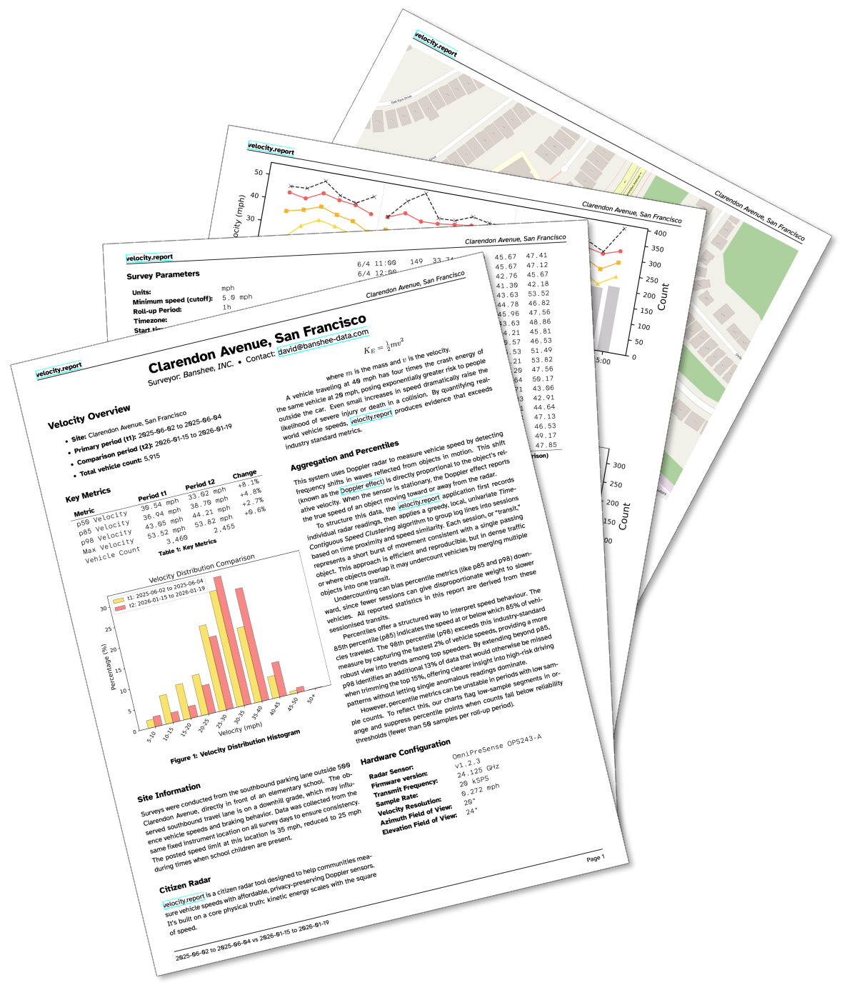
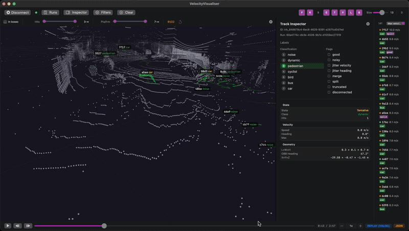

# velocity.report

**Measure velocity, not identity**

<div align="center">

[](https://github.com/banshee-data/velocity.report/actions/workflows/go-ci.yml)
[](https://codecov.io/gh/banshee-data/velocity.report)
[](https://sonarcloud.io/summary/new_code?id=banshee-data_velocity.report)
[](LICENSE)
[](https://github.com/banshee-data/velocity.report/commits/main)
[](TENETS.md)
[](https://discord.gg/XXh6jXVFkt)
[](https://github.com/banshee-data/velocity.report/releases/latest)
[](https://banshee-data.com/velocity.reports/2026-01-19_velocity.report_Clarendon-Avenue-San-Francisco.pdf)

</div>

Street-level speed measurement for neighbourhood change-makers, researchers, and anyone learning what LiDAR can tell you about how traffic actually behaves. Privacy-preserving radar and LiDAR sensors collect evidence so communities can make the case for safer streets; without cameras, licence plates, or any personally identifiable information.

- 📊 Professional PDF reports ready for city hall
- 🔒 No video, no plates, no personally identifiable information
- 📡 Radar speed measurement and LiDAR object tracking (working toward [sensor fusion](docs/plans/lidar-l7-scene-plan.md), combining both sensors)
- 🏠 Runs locally in your neighbourhood, offline-first
- 🔒 Open source and auditable, because trust should be verifiable

```
                                ░░░░░░                                  ░░░░░░
   ░░░░░    ░░░░░░░░░░░    ░░░░░ :::. ░░░░░░░░░░    ░░░░░░░░░░░    ░░░░░ :::.
  ░▒▒▒▒▒░░░░▒▒▒▒▒▒▒▒▒▒▒░░░░▒▒▒▒▒ .:.  ▒▒▒▒▒▒▒▒▒▒░░░░▒▒▒▒▒▒▒▒▒▒▒░░░░▒▒▒▒▒ .:.
░░▒▓▓▓▓▓▒▒▒▒▓▓▓▓▓▓▓▓▓▓▓▒▒▒▒ .::.::: : ▓▓▓▓▓▓▓▓▓▓▒▒▒▒▓▓▓▓▓▓▓▓▓▓▓▒▒▒▒ .::.:.: :
▒▒▓.  . ▓▓▓▓████ ... . ▓▓▓▓ :....:::::. ▓▓▓.  . ▓▓▓▓████ ... . ▓▓▓▓ :.::..::::
▓▓█ ..::████████ :.::: ████ :: :  : . ::▓▓▓ ..::████████ :.::: ████ :: :: : ::
:.: : ::████:.:: : ::: ████ .: : .  ... :.: ::::████:.:: : ::: ████ .::: .:::.
.::  .  .   ::.:    .  .          .     .::  .  .   ::.: ::::  .          .
    .     .       .
                         ▄▀▀▀▀▀▀▄
                       ▄▄█▄▄▄  ▄▄▌
                         ▌▐▀▀▀█  ▌
▀▀▀▀▀▀█████▀▀▀▀▀▀▀▀▀█▀▀█▀▐▀  ▄▄▀▀█▀▀▀▀▀▀▀█▀▀██▀▀▀▀▀▀▀▀▀▀▀▀▀▀▀▀▀▀▀▀▀▀▀▀▀▀▀▀▀▀▀▀
▄▄▄▀▀▀░░ ░ ░ ░▒▓▄▄▀ ▄▄▀▀ ▄▓▀▀▀  ░▐▌       ▀▀▄▄▀▀▄▄▓▒ ▒   ░ ░    ░  ░   ░  ░
 ░ ░░ ░ ░ ▒ ▄▄▀▀▄▄▀▀▄▄▄▄▓░   ░▄  ░█           ▀▀▄▄▀▀▄▄  ▒ ░   ░   ░   ░ ░    ░
  ░  ░ ▒▄▄▀▀▄▄▀▀   ▀▄▀█░ ▄▄▀█▀░░ ░█               ▀▀▄▄▀▀▄▄   ▒ ░    ░      ░
░░ ▒▄▄▀▀▄▄▀▀       █▀▀▓▀▀▌  ▐▌░ ░░▒▌                  ▀▀▄▄▀▀▄▄   ░ ░   ░  ░  ░
▄▄▀▀▄▄▀▀           ▓  ▓  ▌  █▀▀▀▀▀▀█                      ▀▀▄▄▀▀▄▄  ▒░ ▒
▄▄▀▀               ▓▀▀▓▀▀▌ ▐▌░  ░  ▐▌                         ▀▀▄▄▀▀▄▄   ░ ▒
                   ▓__▓__▌ █░  █▄░ ▐▌                             ▀▀▄▄▀▀▄▄   ░
                   ▓  ▓  ▌ █░ ▐▌ █░ █                                 ▀▀▄▄▀▀▄▄
▄▄▄  ▄▄▄▄▄▄  ▄▄▄▄  ▓  ▓  ▌▒▒▒▒▒  ▒▒▒▒   ▄▄▄▄▄  ▄▄▄▄   ▄▄▄▄▄  ▄▄▄▄▄  ▄▄▄▄▄▄▄  ▄
█▀ ▄█████▀ ▄████▀  ▄████   ████   ████  ██████  ▀███▄  ▀████▄ ▀████▄ ▀██████▄
 ▄█████▀  ▄████▀  ▄████▀  ▄████   █████  ██████  ▀███▄  ▀████▄  █████▄ ▀██████
█████▀  ▄█████   ▄████▀   █████   █████   ██████   ████▄  █████  ▀█████▄ ▀████
████▀  ▄█████   ▄█████    ████▀   ▀████▄   ██████   ████▄  ▀████▄  ▀█████  ▀██
██▀  ▄█████▀   ▄█████    ▄████     █████    ██████   ▀████▄ ▀█████  ▀█████▄  ▀
▀   ▄█████▀   ▄█████▀    █████     ██████    ██████   ▀████▄  █████▄  ▀█████▄
```

## Why velocity.report?

Communities trying to make their streets safer face a familiar problem: everyone has an opinion about how fast cars go, but nobody has evidence. Council meetings run on anecdote. Speed surveys cost thousands and arrive months late. Meanwhile, someone's child is still crossing that road while motorists zip by.

velocity.report exists to close the gap between _feeling unsafe_ and _proving it_.

The radar measures vehicle speeds. No cameras, no licence plates, no surveillance infrastructure that a neighbourhood should never have to build in order to be heard. The data stays on a local device in someone's house. The reports are professional enough for a planning committee.

Evidence over opinion. Privacy over convenience. Community ownership over cloud dependency.

## Who It's For

- **Neighbourhood groups** measuring speed on their street, with evidence instead of guesswork
- **Community advocates** building a case for traffic calming, with data strong enough for a formal submission
- **Academics and researchers** studying street-level vehicle behaviour with raw LiDAR point clouds, multi-object tracking, and replayable datasets
- **Perception and robotics engineers** exploring a transparent LiDAR pipeline: DBSCAN clustering, Kalman-filtered tracking, and rule-based classification; all tuneable and documented from raw UDP frames to classified tracks
- **Before-and-after studies** showing whether traffic calming interventions actually work

## Privacy

The system records vehicle speed data. That is all it records. No cameras, no licence plates, no video, no personally identifiable information, by design, not by policy. The point is to measure traffic, not to start building a private surveillance habit.

The data stays on a local device. Reports are generated locally. If PII reaches a log, a response body, or an export, the system has failed.

See [TENETS.md](TENETS.md) for the full set of non-negotiable principles.

### In Practice: Clarendon Avenue School Zone

Clarendon Avenue runs past an elementary school in San Francisco. The city designated it a high injury road years ago. Parents were worried about how fast cars were going and whether the city's planned improvements would actually help.

When the city announced a quick-build project to repave Clarendon, the Banshee team deployed a radar sensor and ran a baseline speed survey in June 2025. The results went to the city engineering team at their October planning meeting for the quick-build. The city repaved in December 2025. Banshee ran a second survey in January 2026. The data showed what parents feared: speeds had climbed after repaving, not fallen. A road improvement, paid for to make the street safer, had made the school run more dangerous.

The team generated comparison reports from both periods and [presented the findings at a San Francisco City Hall street safety hearing](https://www.youtube.com/watch?v=ZTJOI5gYZM4) in January 2026. The [full PDF is available at banshee-data.com](https://banshee-data.com/velocity.reports/2026-01-19_velocity.report_Clarendon-Avenue-San-Francisco.pdf).

| Metric        | Period 1  | Period 2  | Change |
| ------------- | --------- | --------- | ------ |
| P50 speed     | 30.54 mph | 33.02 mph | +8.1%  |
| P85 speed     | 36.94 mph | 38.70 mph | +4.8%  |
| P98 speed     | 43.05 mph | 44.21 mph | +2.7%  |
| Max speed     | 53.52 mph | 53.82 mph | +0.6%  |
| Vehicle count | 3,460     | 2,455     |        |

<div align="center">
  
  <br>
  <em>Clarendon Avenue school zone survey: speed distributions, percentile statistics, and period-over-period comparison</em>
</div>

## What's Included

| Component            | Language            | What it does                                                                                                                                                      |
| -------------------- | ------------------- | ----------------------------------------------------------------------------------------------------------------------------------------------------------------- |
| **Go server**        | Go                  | Collects radar speed data and LiDAR point clouds independently, stores both in SQLite, serves the API. → [cmd/](cmd/), [internal/](internal/)                     |
| **PDF generator**    | Python + LaTeX      | Turns speed data into professional reports with charts, statistics, and proper formatting. → [tools/pdf-generator/](tools/pdf-generator/README.md)                |
| **Web frontend**     | Svelte + TypeScript | Data visualisation and interactive charts for recorded speed data. → [web/](web/README.md)                                                                        |
| **macOS visualiser** | Swift + Metal       | Native 3D LiDAR point cloud viewer with object tracking, replay, and debug overlays. Apple Silicon. → [tools/visualiser-macos/](tools/visualiser-macos/README.md) |

## Quick Start

Requires Go 1.25+, Node.js 18+, and pnpm. See [CONTRIBUTING.md](CONTRIBUTING.md) for full prerequisites.

```sh
git clone git@github.com:banshee-data/velocity.report.git
cd velocity.report
make build-web
make build-radar-local
```

The build produces `velocity-report-local`. Start it without a connected sensor:

```sh
./velocity-report-local --disable-radar --listen :8080
```

The server creates a new SQLite database if one does not exist. Open [localhost:8080](http://localhost:8080) to see the dashboard. Use `--db-path` to point at an existing database elsewhere.

## Architecture

```
   ┌──────────────────┐     ┌──────────────────────────┐     ┌──────────────────┐
   │     Sensors      │────►│  velocity.report Server  │◄───►│ SQLite Database  │
   │ (Radar / LiDAR)  │     │        (Go)              │     │ (sensor_data.db) │
   └──────────────────┘     └──────────────────────────┘     └──────────────────┘
                                  │              │
                       HTTPS :443 │              │ gRPC :50051
                    (nginx proxy) │              │
                   ┌──────────────┴─┐            │
                   │                │            │
                   ▼                ▼            ▼
        ┌──────────────┐ ┌───────────────┐ ┌─────────────────────┐
        │ Web Frontend │ │ PDF Generator │ │  VelocityVisualiser │
        │   (Svelte)   │ │  (Python/TeX) │ │ (macOS/Metal, gRPC) │
        └──────────────┘ └───────────────┘ └─────────────────────┘
```

The web frontend and PDF generator connect over HTTP (:8080). The macOS visualiser uses gRPC (:50051) for streaming point cloud data. For the full architecture see [ARCHITECTURE.md](ARCHITECTURE.md). Sensor fusion plans live in [VISION.md](docs/VISION.md).

## Development & Contributing

Every commit should pass:

```sh
make format    # auto-fix all formatting
make lint      # check all formatting
make test      # run all test suites
```

Start with a small issue and read the nearby code before changing anything broad. It is the fastest route to understanding the project and the slowest route to producing an exciting new class of bug.

See [CONTRIBUTING.md](CONTRIBUTING.md) for prerequisites, dev environment setup, coding standards, and pull request workflow. All make targets are documented in [COMMANDS.md](COMMANDS.md).

## Deployment

The Go server runs as a systemd service on Raspberry Pi. See [public_html/src/guides/setup.md](public_html/src/guides/setup.md) for the complete setup guide.

## Vision: Sensor Fusion

The LiDAR pipeline already runs a full perception stack: DBSCAN spatial clustering, Kalman-filtered multi-object tracking with state and covariance estimation, and rule-based classification across eight object types (car, truck, bus, pedestrian, cyclist, motorcyclist, bird, and general dynamic). Radar provides independent Doppler-accurate speed. Today, both run in parallel.

The next stage fuses them into a single scene model: cross-sensor track handoff using Mahalanobis-distance gating, Bayesian evidence accumulation for persistent geometry, and canonical object refinement via streaming statistics. A lorry clipping a corner at 35 mph tells a different story to a bicycle at the same speed; the evidence is only useful if the system captures both.

The full plan is in [docs/plans/lidar-l7-scene-plan.md](docs/plans/lidar-l7-scene-plan.md) and [VISION.md](docs/VISION.md).

<div align="center">
  
  <br>
  <em>LiDAR point cloud visualiser: real-time multi-object tracking with bounding boxes and velocity vectors</em>
</div>

### macOS LiDAR visualiser

Native Metal renderer for live and recorded LiDAR data, with 96% bandwidth reduction through background caching and foreground-only streaming. Requires macOS 14+ and Apple Silicon.

```sh
make dev-mac
```

Open the LiDAR Dashboard at [localhost:8081](http://localhost:8081) to replay captured point cloud data (.pcap files). See [tools/visualiser-macos/README.md](tools/visualiser-macos/README.md) for controls and camera navigation.

## Project Documents

- 🔭 [VISION.md](docs/VISION.md): where the project is heading
- 🎨 [DESIGN.md](docs/ui/DESIGN.md): visual design language
- ❓ [QUESTIONS.md](data/QUESTIONS.md): open research questions
- 🧭 [DECISIONS.md](docs/DECISIONS.md): why things are the way they are
- 🏗️ [ARCHITECTURE.md](ARCHITECTURE.md): system design, data flow, and component relationships
- 🧱 [COMMANDS.md](COMMANDS.md): every make target, catalogued
- 🌲 [MATRIX.md](data/structures/MATRIX.md): test and validation surface coverage
- 📋 [BACKLOG.md](docs/BACKLOG.md): prioritised work queue
- 🪵 [CHANGELOG.md](CHANGELOG.md): what changed and when
- 📓 [DEVLOG.md](docs/DEVLOG.md): engineering journal
- 🛠️ [TROUBLESHOOTING.md](TROUBLESHOOTING.md): when things go wrong, start here
- 🤝 [CODE_OF_CONDUCT.md](CODE_OF_CONDUCT.md): how we treat each other

## Community

[](https://discord.gg/XXh6jXVFkt)

Join the Discord to discuss the project, get help, and help make streets safer.

## Licence

Apache License 2.0. See [LICENSE](LICENSE).
