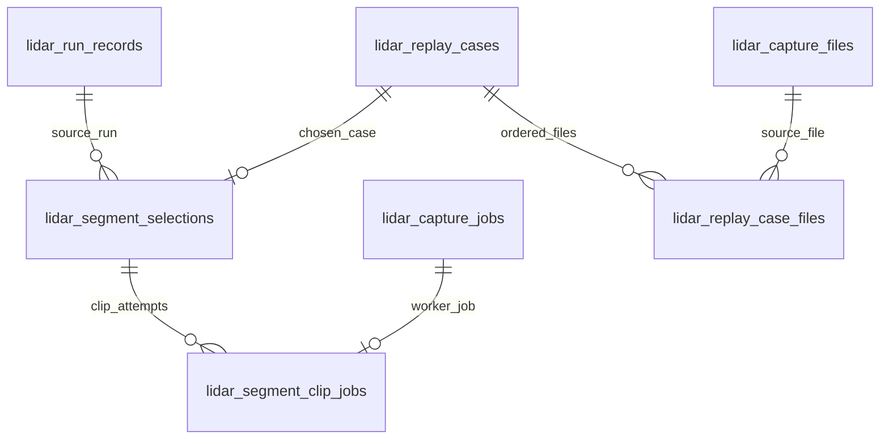

# SQLite data model review: annotation segments and capture provenance

The [schema ERD](SCHEMA.svg) shows the foreign keys that SQLite knows about. This review records the relationships it cannot draw, and the constraints the segment, job, and capture tables were missing. The source is the generated [schema snapshot](../../internal/db/schema.sql), checked against the segment handlers and capture store. The repository has no tracked `schema.db`; `schema.sql` is the current schema snapshot. Any change to it starts with a migration and `make schema-sync`.

The snapshot contains **44 tables and 602 fields** (including generated fields). The [surface matrix](MATRIX.md) inventories them. Its `?` marks show where a consumer trace remains open; schema membership alone does not prove that a column is populated or shown to a user.

## Status

The review raised ten findings about segments, jobs, and captures, and four about the wider schema. [Migration 55](../../internal/db/migrations/000055_lidar_segment_constraints.up.sql) answers the six that concern the segment tables, and the clip-job half of a seventh. The rest waited on decisions about identity and time, taken on September 28, 2026, aligned on September 29 with the [platform vocabulary plan](../../docs/plans/platform-vocabulary-and-data-model-plan.md), and [recorded below](#decisions-on-the-remaining-findings). [Migration 57](../../internal/db/migrations/000057_lidar_capture_job_period_checks.up.sql) holds the two rules that needed nothing more: the capture queue's job kinds, and motion periods that agree with their bounds. None of the findings is a fault in data today: the [audits](#what-the-audit-found) found no contradiction that a constraint would have refused.

| Finding                                                                                  | Priority | Status                                                                     |
| ---------------------------------------------------------------------------------------- | -------- | -------------------------------------------------------------------------- |
| [1. A selection's run has no foreign key](#findings-resolved-by-migration-55)            | 1        | Resolved                                                                   |
| [2. A clip job names a replay case of its own](#findings-resolved-by-migration-55)       | 1        | Resolved                                                                   |
| [3. Role and finder are not checked together](#findings-resolved-by-migration-55)        | 1        | Resolved                                                                   |
| [4. Selection JSON is unvalidated and duplicated](#findings-resolved-by-migration-55)    | 1        | Resolved                                                                   |
| [5. The held-out guard reads every selection](#findings-resolved-by-migration-55)        | 1        | Resolved; the guard moves to the capture digest (Items 3, 6)               |
| [6. A clip job borrows the queue's session column](#decisions-on-the-remaining-findings) | 2        | Resolved: migration 57 holds two kinds until one job queue                 |
| [7. A pack is an absolute path, and `''` means none](#findings-resolved-by-migration-55) | 2        | Resolved                                                                   |
| [8. A replay case repeats its first file](#decisions-on-the-remaining-findings)          | 2        | Decided: case files name the digest; `pcap_file` goes in v0.6.7            |
| [9. Session keys are unconstrained](#decisions-on-the-remaining-findings)                | 2        | Resolved: notes until v0.6.7 drops them                                    |
| [10. Capture extents permit contradictions](#decisions-on-the-remaining-findings)        | 3        | Decided: earliest and latest beside first and last (backlog); periods held |
| [Wider schema watchlist](#wider-schema-watchlist)                                        | 2 to 3   | Two audits on the backlog; two items in the vocabulary plan                |

## The segment relationships

Five of these lines are foreign keys, and the ERD draws them. The `source_file` line is still an _intended_ relationship: `lidar_replay_case_files.capture_file_id` is plain text, as are the capture index's `session_id` references, and the ERD correctly leaves them out. It is a picture of enforced structure, not a promise that every similarly named column joins safely. By the [decisions below](#decisions-on-the-remaining-findings), a case file will name its capture by digest, and session references stay notes until they are dropped.

A clip job reaches its replay case through its selection. It has no replay case column of its own, so it cannot replay one case and show another segment's status.

## Findings resolved by migration 55

| #   | What was wrong                                                                                                                                                                                        | What holds now                                                                                                                                                                                                                                                                                                                                                                                                                                                    |
| --- | ----------------------------------------------------------------------------------------------------------------------------------------------------------------------------------------------------- | ----------------------------------------------------------------------------------------------------------------------------------------------------------------------------------------------------------------------------------------------------------------------------------------------------------------------------------------------------------------------------------------------------------------------------------------------------------------- |
| 1   | `lidar_segment_selections.run_id` had no foreign key. Deleting the run left a selection that named a run which no longer existed, with nothing to say it had gone.                                    | `run_id` references `lidar_run_records` and is cleared when the run is deleted. The selection, its replay case, and its pack outlive the run. `source` keeps the identity the segment ID was computed from, and `run_id` must equal it while the run exists. Deleting a run is never refused because a segment was chosen from it.                                                                                                                                |
| 2   | `lidar_segment_clip_jobs` held its own `replay_case_id` beside the selection's. Each was a valid foreign key and nothing made them the same case.                                                     | The column is gone. The worker reads the replay case from the job's selection.                                                                                                                                                                                                                                                                                                                                                                                    |
| 3   | `role` checked only its own vocabulary and `finder` checked nothing, so a held-out row could name `leader_changes`. The finder version was inside `window_json`.                                      | `finder` is checked against the catalogue, and a held-out window may only come from `following`, `exposure`, or `random`. `finder_version` is a column. A Go test fails when `segments.Finders` or `segments.Allowed` disagrees with the schema, in either direction.                                                                                                                                                                                             |
| 4   | `parameters_json` and `window_json` were unchecked text, and `role`, `finder`, the segment ID, and the window were stored a second time as columns with nothing to make the two agree.                | Both documents must be JSON objects. `source`, `role`, `finder`, `finder_version`, `capture`, `window_start_ns`, and `window_end_ns` are generated from `window_json`, so they cannot disagree with it. `segment_id` must equal the document's `id`. `document_version` names the contract the documents follow.                                                                                                                                                  |
| 5   | The held-out guard ran `json_extract` over every selection to find a random window for a capture.                                                                                                     | The guard is a lookup on `(role, finder, capture)`. A test reads the query plan and fails if it scans.                                                                                                                                                                                                                                                                                                                                                            |
| 7   | `pack_dir` was an absolute path, `''` meant "no pack", and the worker wrote the pack before the row. A process that stopped between the two left a pack that no job named, and cut it again on retry. | `pack_dir` is relative to the annotation packs directory and is null until the pack exists. `pack_digest` says which pack it is, and the two are set together. A retry adopts a whole pack that an earlier attempt finished and removes what an attempt left unfinished. It never removes a whole pack, which may hold a person's review, and where a job left two it links the one that holds annotations. A failed or cancelled attempt leaves nothing on disk. |

### What the application still checks

The constraints catch a divergent write. They do not replace the checks that give an operator a clear answer:

- `segments.Allowed` refuses a finder for a role before anything is ranked, and the API says why.
- The case endpoint checks that indexed captures cover the whole window.
- The clip worker compares the chosen window with its replay case before it replays anything.
- The pack's `segment.json` remains the record of how the window was chosen, and `annotations.json` the record of human review. Neither is copied into SQLite to show review state.

### Selectors, since migration 56

Windows are now chosen by selectors defined in
[config/segment-selectors.defaults.json](../../config/segment-selectors.defaults.json). Migration
000056 adds `selector_json`, the selector as it ran, as a column rather than rebuilding the table.
Its `CHECK` ties the selector to the row's `finder` and refuses a held-out window whose selector
the code did not find eligible; it reads the flag with `IS 1`, since `= 1` would give `NULL` for
a missing flag and a `CHECK` accepts `NULL`. A trigger requires the column on every new row and
another refuses erasing it; rows chosen before selectors keep `NULL`. A Go test fails when the
`CHECK` and `Selector.HeldOut` disagree, in either direction.

### Rows written before the migration

The two segment tables first appeared in migration 54 and no release has carried them. A database that ran migration 54 keeps every row:

- A row that satisfies the new rules is copied.
- A row whose `finder` column was left empty is repaired from its document. The case endpoint wrote such rows when a request named no finder.
- A pack link is cleared, not converted: the old path was absolute and the digest is not known to SQL. When the server starts it finds the pack again by its job's name and records it.
- Any other row is kept whole in `lidar_migration_rejects` with the reason it was set aside. Its replay case is not touched.

Rolling the migration back restores every selection and every clip link, including the ones that were set aside.

## Decisions on the remaining findings

Findings 5, 6, 8, 9 and 10 waited on four questions. They were decided on September 28, 2026,
and are entered in the [decisions register](../../docs/DECISIONS.md) as D-27. On September 29 they
were aligned with the
[platform vocabulary plan](../../docs/plans/platform-vocabulary-and-data-model-plan.md), which
renames the capture index, the job queue and the replay case, and gives captures a content
digest; the decisions below follow it.

| Question                                         | Decision                                                                        | State                          |
| ------------------------------------------------ | ------------------------------------------------------------------------------- | ------------------------------ |
| What identifies a capture (5, 8, 9)              | The SHA-256 of its whole file, computed by the probe                            | Vocabulary plan, Items 3 and 6 |
| How a replay case names its session (9)          | As a note, never a foreign key, until Item 18 drops it                          | Done; a test holds it          |
| How the probe records a clock stepping back (10) | Earliest and latest packet beside first and last, and a count of backward steps | Backlog, v0.5.4                |
| Whether motion passes get a subject table (6)    | No; migration 57 holds today's two kinds until one job queue                    | Done                           |

### A capture is its content, not its path

Every capture ID was a hash of paths: `root_id` of the root's path, `capture_file_id` of the root
and the relative path, and `session_id` of the root and the session's first file. Moving a root
changed all of them, and the held-out guard compares the capture path a window records. The
scanner already stores a `content_tag` for each file: SHA-256 of its size and its first and last
MiB. The probe reads every byte of a capture to find its extent.

The [second audit](#second-audit-september-28-2026) showed what path identity costs. The
development database indexes 407 files under 217 tags, and each of the 190 shared tags is one file
reached by two paths: 189 through a root configured inside another (`/Volumes/lidar/lidar/s2`
inside `/Volumes/lidar/lidar`), and one through a symlink. Each of those captures has two
identities by path and one by content. No two different files share a tag.

**Decision:** a capture is identified by the SHA-256 of its whole file, which the probe computes
on the pass that already reads every byte. A path says where a capture was found, not which
capture it is. This is the capture digest of the vocabulary plan (V1, Item 3) and the content
identity of the [worker pool plan](../../docs/plans/lidar-worker-pool-and-results-hub-plan.md), so
captures, clips, packs, exports and workers share one digest. The content tag stays the scan's
cheap check that a file has not changed. It was first chosen as the identity because it needs no
whole read, but the probe's read makes that saving small, and two identities would cost more.

- The held-out guard looks for a random window by digest, so a copy, a second volume or a link
  cannot earn a capture a second random window. Once the selection folds into the clip (Item 6),
  the clip needs a `capture_id` generated from its selection document for the guard's index.
- A case's files name their captures by digest (`capture_id`, Item 6). `capture_file_id`, which no
  case file sets today, goes in v0.6.7, and so does `lidar_replay_cases.pcap_file` (Item 18).
- A capture that has not been probed has no digest yet; a clip names it by its relative path
  until the probe links it.
- Rows that share a digest are one capture found twice. The plan keeps the path-derived row key
  until v0.6.7, so it has to say whether such rows merge or become locations of one capture before
  the digest becomes the key.

### A replay case notes where it was cut from

A case's `session_id` and `source_period_id` say which session and motion period it was cut from.
Re-deriving a root's sessions replaces them and drops their motion periods, which come back only
when a motion pass runs again. In the development database, 24 of 31 replay cases name a period
that no longer exists, and no motion period exists at all.

**Decision:** both columns are notes, never foreign keys. A case's own ordered files and window
are the authority, so a re-derive can lose a note's target but never the case.
`TestACaseOutlivesTheSessionItWasCutFrom` in `internal/lidar/storage/sqlite` re-derives under a
case and fails if either column becomes a key. Both columns stay notes until the vocabulary plan
drops them in v0.6.7 (Item 18), and the test goes with them.

### A capture's clock may step backwards

The probe records the time of the first and last packet in file order, by the clock of the host
that captured them. A clock stepped backwards would store a first time after the last, and a
`CHECK` would turn that capture into a scan failure. A Raspberry Pi has no real-time clock, and
NTP steps its clock at boot. No probed capture shows one yet.

**Decision:** the probe keeps `first_packet_ns` and `last_packet_ns` in file order, because replay
counts a window's start from the first packet in file order and the vocabulary plan derives a
clip's bounds from it. Beside them it adds `earliest_packet_ns`, `latest_packet_ns` and
`backward_steps`, the number of steps back larger than a threshold, so a small reordering passes.
A capture with such a step stays indexed and flagged, stays out of capture sequences until
someone looks, and closes a part of a survey's capture export. The extent checks then follow:
earliest ≤ latest, a packet count of zero or more, and bounds on every `ok` probe. The digest of
Item 3 is computed on the same pass.

Motion periods needed no decision. Migration 57 requires `end_ns` ≥ `start_ns` and
`duration_ns` = `end_ns` − `start_ns`. `start_secs` and `end_secs` count from the first frame the
motion pass analysed, which the row does not hold, so they stay unchecked.

### The capture queue's kinds

`lidar_capture_jobs` holds two kinds of work: `motion_pass`, which names its session in
`session_id`, and `vrlog_record`, a clip job that names its segment through
`lidar_segment_clip_jobs`. The vocabulary plan turns this table into one `jobs` queue for both
sensors: `subject_kind` and `subject_id` for every job and the clip kind rewritten as `pack` in
v0.5.8 (Item 3), `radar_track_build` in v0.5.10 (Item 9), and the distributed worker's kinds in
v0.5.11 (Item 11).

**Decision:** motion passes get no subject table of their own; the vocabulary plan's subject
columns will name every job's subject. Until then migration 57 refuses a job of any other kind,
and a clip job that names a session. For a motion pass `session_id` stays a note: sessions are
re-derived, and a key would either block a re-derive or drop the job's session. Each migration
that renames or adds a kind (Items 3, 9 and 11) replaces migration 57's kind triggers first.

The triggers look only at new writes. A clip job that an interrupted enqueue left without its
link, before migration 55, still names its segment in `session_id`, and the worker can still move
it between states.

## What the audit found

The review's first step was to measure before constraining. These counts are from a development database of 3.6 GB, read without writing to it. It is at schema version 46, so it holds the capture and replay tables and none of the segment tables.

| Question                                                       | Count        |
| -------------------------------------------------------------- | ------------ |
| Replay cases                                                   | 31           |
| Ordered replay case files                                      | 117          |
| Replay cases whose first ordered file differs from `pcap_file` | 0            |
| Replay case files that name a `capture_file_id`                | 0            |
| Replay cases that name a source period which does not exist    | 24           |
| Capture files, of which probed                                 | 407, 112     |
| Capture files whose session does not exist                     | 0            |
| Probed captures with `first_packet_ns > last_packet_ns`        | 0            |
| Probed captures with missing bounds or no packets              | 0            |
| Unprobed captures that have bounds                             | 0            |
| Capture jobs                                                   | 0            |
| Completed runs since August 2026, of which stored observations | 67, 0        |
| Segment selections and clip jobs                               | table absent |

The last two rows shaped the segment work. No database has segment rows to lose. And a run made by replay stores no track observations, so the finders read a replayed run from its recording.

One database is one sample. It shows that the constraints in migration 55 refuse nothing that exists, and that the deferred ones are questions of design, not of cleaning data. It does not show what another deployment holds.

### Second audit, September 28, 2026

The same database, now at schema version 56, was read from an APFS clone before the remaining
findings were decided.

| Question                                                    | Count      |
| ----------------------------------------------------------- | ---------- |
| Capture files, distinct content tags                        | 407, 217   |
| Shared tags that are one file reached by two paths          | 190 of 190 |
| of which through a root nested inside another root          | 189        |
| of which through a symlink                                  | 1          |
| Replay cases that name a source period which does not exist | 24 of 31   |
| Replay cases that name a session which does not exist       | 0          |
| Motion periods                                              | 0          |
| Capture jobs                                                | 0          |
| Probed captures with `first_packet_ns > last_packet_ns`     | 0 of 112   |

Migration 57 refuses nothing this database holds: it has no capture jobs and no motion periods.

## Wider schema watchlist

These are separate from the segment delivery. They surfaced while comparing every table's declared keys in the refreshed ERD, and need a data and lifecycle audit before a migration is designed. The [platform vocabulary plan](../../docs/plans/platform-vocabulary-and-data-model-plan.md) settles two of them: one `sites` table for both sensors replaces the two meanings of `site_id` (Item 14, v0.6.6), and `radar_objects`, renamed `radar_detections`, gains `detection_id` (Item 17, v0.6.7). It leaves the estimate tables' parent key to this watchlist and treats those tables as a rebuildable catalogue of a vrlog's analysis stream (V34), which is where that audit starts. The audits of the estimate links and the timestamp units are on the backlog for v0.5.8.

| Priority | Observed shape                                                                                                                                                                                                                                                                                         | Direction to investigate                                                                                                                                                                                                                                                                                              |
| -------- | ------------------------------------------------------------------------------------------------------------------------------------------------------------------------------------------------------------------------------------------------------------------------------------------------------ | --------------------------------------------------------------------------------------------------------------------------------------------------------------------------------------------------------------------------------------------------------------------------------------------------------------------- |
| 2        | `lidar_scenes.site_id` is an integer reference to `site(id)`, while `lidar_replay_cases.site_id` is text referencing `lidar_sites(site_id)`. The same column name denotes two different site identities.                                                                                               | Name each relationship for its actual domain, or define a deliberate mapping between radar/report sites and LiDAR geographic sites. First inventory API payloads and joins that assume one meaning of `site_id`.                                                                                                      |
| 2        | `lidar_track_estimates.observation_id`, `lidar_track_residuals.estimate_id`, and `lidar_track_estimate_revisions.revises_estimate_id` have no foreign keys. `lidar_track_solid_bodies` repeats the estimate's identity and state columns under the same `estimate_id` without an enforced parent link. | Establish whether these evidence rows are independently imported snapshots or children of the observation/estimate chain. If they are children, validate orphans and state disagreements, then add references or a shared parent identity. Preserve valid out-of-order imports with transactional or deferred checks. |
| 3        | `radar_objects` has no declared primary key; consumers that need an event identity would have to rely on the implicit SQLite rowid or the raw JSON.                                                                                                                                                    | Introduce a stable event key before a feature depends on row identity. Decide whether the source offers a natural ID or an explicit surrogate key is needed, and deduplicate historical events before enforcing uniqueness.                                                                                           |
| 3        | Timestamp columns span nanoseconds (`*_ns`, `*_nanos`), floating Unix seconds (`radar_data_transits.*_unix`, `radar_data.write_timestamp`), integer run times (`lidar_run_records.created_at`), and SQLite `DATETIME` text (`site_reports.created_at`).                                                | Specify unit and UTC semantics per persisted column in the schema reference. Use unit-bearing names and typed conversion at API boundaries for new columns; change old columns only with a consumer-by-consumer compatibility plan.                                                                                   |

## Constraint probe

The review began by loading the schema of migration 54 into an in-memory SQLite database with foreign keys enabled. It accepted a selection with a missing run, a held-out `leader_changes` window, and malformed JSON. It also accepted a clip job linked to a different, otherwise valid replay case. `PRAGMA foreign_key_check` returned no violations, because each declared foreign key was satisfied, and the held-out guard's query plan was a scan of `lidar_segment_selections`.

The same probe against the current schema is now a test. Each of those writes is refused, one rule at a time, and the guard's plan names its index: see `segment_store_test.go` in `internal/lidar/storage/sqlite` and `migration_055_test.go` in `internal/db`.

## Suggested order for what remains

1. Add the probe's earliest and latest packet and its backward steps, then the extent checks of finding 10 (backlog, v0.5.4).
2. Key captures, the held-out guard and clip files on the capture digest with the vocabulary plan's Items 3 and 6 (findings 5, 8 and 9).
3. Retire `pcap_file`, `capture_file_id` and the case notes with Item 18 (v0.6.7).
4. Audit the estimate links and the timestamp units; the site and radar detection items follow the vocabulary plan.

Keep `internal/db/schema.sql` generated from migrations, regenerate [SCHEMA.svg](SCHEMA.svg) after each schema change, and extend [MATRIX.md](MATRIX.md) when a new field becomes a real consumer contract.
