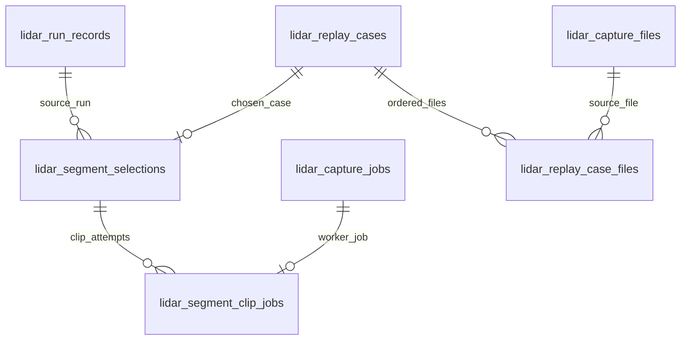

# SQLite data model review: annotation segments and capture provenance

The [schema ERD](SCHEMA.svg) shows the foreign keys that SQLite knows about. This review records the relationships it cannot draw, and the constraints worth adding before more annotation packs depend on them. The source is the generated [schema snapshot](../../internal/db/schema.sql), especially [migration 54](../../internal/db/migrations/000054_lidar_segments.up.sql), checked against the segment handlers and capture store. The repository has no tracked `schema.db`; `schema.sql` is the current schema snapshot. Any change to it starts with a migration and `make schema-sync`.

The snapshot contains **43 tables and 588 fields** (including generated fields). The [surface matrix](MATRIX.md) now inventories them. Its `?` marks show where a consumer trace remains open; schema membership alone does not prove that a column is populated or shown to a user. This review is a modelling exercise, not a migration or an audit of data in deployed databases.

## The segment relationship we need

Several lines here are _intended_ relationships, not current foreign keys. In particular, `lidar_segment_selections.run_id`, `lidar_replay_case_files.capture_file_id`, and the capture index's `session_id` references are plain text. The ERD correctly leaves those lines out. It is a picture of enforced structure, not a promise that every similarly named column joins safely.

## Findings and proposed evolution

| Priority | Current shape and risk                                                                                                                                                                                                                                                                                                                                     | Proposed schema direction                                                                                                                                                                                                                                               | Migration and behaviour to settle                                                                                                                                                                                                                                                                                           |
| -------- | ---------------------------------------------------------------------------------------------------------------------------------------------------------------------------------------------------------------------------------------------------------------------------------------------------------------------------------------------------------- | ----------------------------------------------------------------------------------------------------------------------------------------------------------------------------------------------------------------------------------------------------------------------- | --------------------------------------------------------------------------------------------------------------------------------------------------------------------------------------------------------------------------------------------------------------------------------------------------------------------------- |
| 1        | `lidar_segment_selections.run_id` has no foreign key. The run deletion endpoint can remove the evidence run and leave a selection whose finder result can no longer be reproduced.                                                                                                                                                                         | Reference `lidar_run_records(run_id)` and choose a deliberate deletion policy. For reviewed packs, a tombstoned or retained provenance record is safer than silent cascade.                                                                                             | Count orphan selections before rebuilding this SQLite table. Decide whether deleting a run should be refused while a segment uses it, or whether the segment records a durable source snapshot independent of that run.                                                                                                     |
| 1        | `lidar_segment_clip_jobs.segment_id` and `.replay_case_id` each have a valid foreign key, but nothing requires them to describe the **same** selection. A job can replay another case while displaying this segment's status.                                                                                                                              | Prefer removing the duplicate `.replay_case_id` and resolving it through the selection. If the value must remain for job recovery, enforce a composite reference to a unique `(segment_id, replay_case_id)` pair.                                                       | Compare existing job links with selections, repair mismatches, then rebuild. Keep multiple job attempts per segment: `job_id` is the key, and the page deliberately chooses the latest queued job.                                                                                                                          |
| 1        | `lidar_segment_selections.role` checks only its vocabulary. A held-out row may still say `leader_changes`, although the Go finder excludes failure-seeking choices. `finder` itself has no vocabulary check.                                                                                                                                               | Enforce the allowed role/finder combinations in the table, or reference a versioned finder catalogue. Store finder version explicitly; today it is buried in `window_json`.                                                                                             | Check historical rows against `segments.Allowed` before adding a constraint. A fixed `CHECK` needs a new migration whenever the finder catalogue changes. The Go check still matters for clear API errors.                                                                                                                  |
| 1        | `parameters_json` and `window_json` are unvalidated text. The held-out guard reads `json_extract(window_json, '$.capture')`; a malformed matching row can turn a case request into a server error. `role`, `finder`, segment ID, capture and window bounds are also duplicated inside the JSON, with no agreement constraint.                              | Add `json_valid` checks and explicit, indexed selection facts: capture identity, start/end capture nanoseconds, finder version, and immutable source identity. Keep JSON for the scored explanation and reproducibility parameters, with a versioned document contract. | Validate old JSON and cross-check duplicated values before rebuilding. Record whether a historical selection names an indexed capture or an external evidence source. Changing the segment ID algorithm would require an explicit ID version and compatibility reader.                                                      |
| 1        | The held-out random-before-traffic guard scans `lidar_segment_selections` using `json_extract` on each candidate row, with no supporting index or durable capture key. Its query is based on capture path text, which may change when roots move.                                                                                                          | Use `capture_file_id` (or another stable capture identity) on the selection and index `(role, finder, capture_file_id)`. If normalisation is postponed, use a tested expression index on the JSON capture field.                                                        | Backfill from `window_json` and the capture index, checking ambiguous paths. Preserve the rule that held-out windows come from traffic or random sampling, never tracker failure. The random requirement is an operator policy, so define its scope per capture and site before making it a uniqueness or count constraint. |
| 2        | `lidar_capture_jobs.session_id` carries a segment ID for a `vrlog_record` job; the same column denotes a capture session for other kinds. Neither it nor `root_id` has a foreign key. The job kind supplies a meaning the column name does not.                                                                                                            | Split typed job subjects into subtype tables, or add an explicit `subject_kind` and `subject_id` with kind-specific constraints and links. The existing `lidar_segment_clip_jobs` is already a useful subtype.                                                          | Backfill by `kind`, then have the queue and cancellation paths read the new link. Avoid adding a session foreign key to the current overloaded column.                                                                                                                                                                      |
| 2        | `lidar_segment_clip_jobs.pack_dir` uses `''` as “no pack”. It stores a filesystem location as its sole artifact reference. The worker writes the pack before updating the row, so an update failure leaves a pack on disk without a successful job link.                                                                                                   | Make artifact presence nullable, store a path relative to the configured pack root plus manifest digest, and reconcile completed files with jobs on restart. Keep review content in the pack sidecar.                                                                   | Scan pack directories for matching `segment.json` and digest, recover or quarantine unlinked outputs, then migrate paths. Do not copy proposal or reviewed truth into SQLite merely to display review state.                                                                                                                |
| 2        | `lidar_replay_cases.pcap_file` repeats the first member of `lidar_replay_case_files.pcap_file`; the latter's optional `capture_file_id` has no foreign key. `SetCaseFiles` keeps the paths in step in one transaction, but the schema cannot enforce agreement for another writer. The index ID is deliberately advisory because the index can be rebuilt. | Keep the ordered file table authoritative and the single path as a compatibility projection until readers move. Decide whether capture IDs can become durable before adding a foreign key; otherwise record advisory provenance explicitly.                             | Audit cases whose first ordered file differs from `pcap_file`, and distinguish external paths from indexed captures. Preserve the valid case when its index row is rebuilt.                                                                                                                                                 |
| 2        | `lidar_capture_files.session_id` and replay-case `session_id`/`source_period_id` are not constrained, while sessions are re-derived from the capture index. A strict foreign key without changing that lifecycle would make a normal re-derive fail or erase provenance.                                                                                   | Separate durable capture identity from mutable session grouping. If sessions remain replaceable, carry a derivation version and refresh dependants transactionally; then add references where ownership is stable.                                                      | Measure how often session IDs change on re-probe. Preserve labels and case provenance across re-derivation before enforcing new keys.                                                                                                                                                                                       |
| 3        | Capture extent and count fields permit contradictions: `first_packet_ns > last_packet_ns`, negative packet counts, and an `ok` probe with missing bounds. `lidar_capture_motion_periods` also stores duration and second/frame offsets beside nanosecond bounds.                                                                                           | Add checks for non-negative counts, ordered bounds, and valid probe-state combinations. Derive duplicate duration and offsets where feasible, or check them against a documented rounding tolerance.                                                                    | Audit old scans, especially empty captures and failed probes; those need a legitimate representation before constraints can be tightened.                                                                                                                                                                                   |

## Wider schema watchlist

These are separate from the segment delivery. They surfaced while comparing every table's declared keys in the refreshed ERD, and need a data and lifecycle audit before a migration is designed.

| Priority | Observed shape                                                                                                                                                                                                                                                                                         | Direction to investigate                                                                                                                                                                                                                                                                                              |
| -------- | ------------------------------------------------------------------------------------------------------------------------------------------------------------------------------------------------------------------------------------------------------------------------------------------------------ | --------------------------------------------------------------------------------------------------------------------------------------------------------------------------------------------------------------------------------------------------------------------------------------------------------------------- |
| 2        | `lidar_scenes.site_id` is an integer reference to `site(id)`, while `lidar_replay_cases.site_id` is text referencing `lidar_sites(site_id)`. The same column name denotes two different site identities.                                                                                               | Name each relationship for its actual domain, or define a deliberate mapping between radar/report sites and LiDAR geographic sites. First inventory API payloads and joins that assume one meaning of `site_id`.                                                                                                      |
| 2        | `lidar_track_estimates.observation_id`, `lidar_track_residuals.estimate_id`, and `lidar_track_estimate_revisions.revises_estimate_id` have no foreign keys. `lidar_track_solid_bodies` repeats the estimate's identity and state columns under the same `estimate_id` without an enforced parent link. | Establish whether these evidence rows are independently imported snapshots or children of the observation/estimate chain. If they are children, validate orphans and state disagreements, then add references or a shared parent identity. Preserve valid out-of-order imports with transactional or deferred checks. |
| 3        | `radar_objects` has no declared primary key; consumers that need an event identity would have to rely on the implicit SQLite rowid or the raw JSON.                                                                                                                                                    | Introduce a stable event key before a feature depends on row identity. Decide whether the source offers a natural ID or an explicit surrogate key is needed, and deduplicate historical events before enforcing uniqueness.                                                                                           |
| 3        | Timestamp columns span nanoseconds (`*_ns`, `*_nanos`), floating Unix seconds (`radar_data_transits.*_unix`, `radar_data.write_timestamp`), integer run times (`lidar_run_records.created_at`), and SQLite `DATETIME` text (`site_reports.created_at`).                                                | Specify unit and UTC semantics per persisted column in the schema reference. Use unit-bearing names and typed conversion at API boundaries for new columns; change old columns only with a consumer-by-consumer compatibility plan.                                                                                   |

## Constraint probe

I loaded `schema.sql` into a fresh in-memory SQLite database with foreign keys enabled. It accepted a selection with a missing run, held-out `leader_changes`, and malformed JSON. It also accepted a clip job linked to a different, otherwise valid replay case. `PRAGMA foreign_key_check` still returned no violations: each declared foreign key was satisfied. `EXPLAIN QUERY PLAN` for the held-out random guard reported a scan of `lidar_segment_selections`. These are schema guarantees we currently lack, not proof that production data contain such rows.

The application has useful defences already: `segments.Allowed` restricts finder roles, the case endpoint checks indexed capture coverage, and the clip worker compares the chosen window with its replay case before writing a pack. Those checks should stay. Database constraints would catch divergent writes and future code paths earlier, while the pack's `segment.json` and `annotations.json` remain the source for selection evidence and human review respectively.

## Suggested order

1. Measure orphan and disagreement counts in a copy of a real database, including job links, JSON validity, case-file order, and capture identity. Do not infer migration safety from the fresh schema alone.
2. Add the selection constraints and a stable capture key in a migration. Backfill and validate before switching the held-out guard to the indexed key.
3. Rebuild the clip-job table to remove or constrain duplicate case identity, then make artifact recovery explicit.
4. Evolve capture sessions and general jobs after their ownership rules are settled; their current IDs have intentionally different lifecycles.

Keep `internal/db/schema.sql` generated from migrations, regenerate [SCHEMA.svg](SCHEMA.svg) after each schema change, and extend [MATRIX.md](MATRIX.md) when a new field becomes a real consumer contract.
