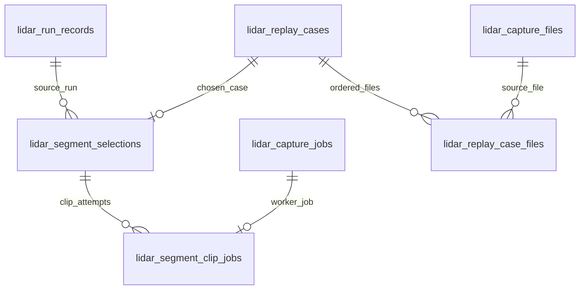

# SQLite data model review: annotation segments and capture provenance

The [schema ERD](SCHEMA.svg) shows the foreign keys that SQLite knows about. This review records the relationships it cannot draw, and the constraints the segment, job, and capture tables were missing. The source is the generated [schema snapshot](../../internal/db/schema.sql), checked against the segment handlers and capture store. The repository has no tracked `schema.db`; `schema.sql` is the current schema snapshot. Any change to it starts with a migration and `make schema-sync`.

The snapshot contains **44 tables and 601 fields** (including generated fields). The [surface matrix](MATRIX.md) inventories them. Its `?` marks show where a consumer trace remains open; schema membership alone does not prove that a column is populated or shown to a user.

## Status

The review raised ten findings about segments, jobs, and captures, and four about the wider schema. [Migration 55](../../internal/db/migrations/000055_lidar_segment_constraints.up.sql) answers the six that concern the segment tables, and the clip-job half of a seventh. The rest wait on a decision about how long a capture, a session, or a site keeps its identity. None of them is a fault in data today: the [audit](#what-the-audit-found) found no contradiction that a constraint would have refused.

| Finding                                                                                  | Priority | Status                                       |
| ---------------------------------------------------------------------------------------- | -------- | -------------------------------------------- |
| [1. A selection's run has no foreign key](#findings-resolved-by-migration-55)            | 1        | Resolved                                     |
| [2. A clip job names a replay case of its own](#findings-resolved-by-migration-55)       | 1        | Resolved                                     |
| [3. Role and finder are not checked together](#findings-resolved-by-migration-55)        | 1        | Resolved                                     |
| [4. Selection JSON is unvalidated and duplicated](#findings-resolved-by-migration-55)    | 1        | Resolved                                     |
| [5. The held-out guard reads every selection](#findings-resolved-by-migration-55)        | 1        | Resolved; capture identity is still a path   |
| [6. A clip job borrows the queue's session column](#findings-that-wait-on-a-decision)    | 2        | Resolved for clip jobs; open for the queue   |
| [7. A pack is an absolute path, and `''` means none](#findings-resolved-by-migration-55) | 2        | Resolved                                     |
| [8. A replay case repeats its first file](#findings-that-wait-on-a-decision)             | 2        | Deferred: no disagreement in data            |
| [9. Session keys are unconstrained](#findings-that-wait-on-a-decision)                   | 2        | Deferred: 24 cases name a lost period        |
| [10. Capture extents permit contradictions](#findings-that-wait-on-a-decision)           | 3        | Deferred: needs a decision on backwards time |
| [Wider schema watchlist](#wider-schema-watchlist)                                        | 2 to 3   | Deferred                                     |

## The segment relationships

The first four lines are foreign keys, and the ERD draws them. The last two are still _intended_ relationships: `lidar_replay_case_files.capture_file_id` and the capture index's `session_id` references are plain text. The ERD correctly leaves those lines out. It is a picture of enforced structure, not a promise that every similarly named column joins safely.

A clip job reaches its replay case through its selection. It has no replay case column of its own, so it cannot replay one case and show another segment's status.

## Findings resolved by migration 55

| #   | What was wrong                                                                                                                                                                                        | What holds now                                                                                                                                                                                                                                                                                                                                                                                                                                                    |
| --- | ----------------------------------------------------------------------------------------------------------------------------------------------------------------------------------------------------- | ----------------------------------------------------------------------------------------------------------------------------------------------------------------------------------------------------------------------------------------------------------------------------------------------------------------------------------------------------------------------------------------------------------------------------------------------------------------- |
| 1   | `lidar_segment_selections.run_id` had no foreign key. Deleting the run left a selection that named a run which no longer existed, with nothing to say it had gone.                                    | `run_id` references `lidar_run_records` and is cleared when the run is deleted. The selection, its replay case, and its pack outlive the run. `source` keeps the identity the segment ID was computed from, and `run_id` must equal it while the run exists. Deleting a run is never refused because a segment was chosen from it.                                                                                                                                |
| 2   | `lidar_segment_clip_jobs` held its own `replay_case_id` beside the selection's. Each was a valid foreign key and nothing made them the same case.                                                     | The column is gone. The worker reads the replay case from the job's selection.                                                                                                                                                                                                                                                                                                                                                                                    |
| 3   | `role` checked only its own vocabulary and `finder` checked nothing, so a held-out row could name `leader_changes`. The finder version was inside `window_json`.                                      | `finder` is checked against the catalogue, and a held-out window may only come from `following`, `exposure`, or `random`. `finder_version` is a column. A Go test fails when `segments.Finders` or `segments.Allowed` disagrees with the schema, in either direction.                                                                                                                                                                                             |
| 4   | `parameters_json` and `window_json` were unchecked text, and `role`, `finder`, the segment ID, and the window were stored a second time as columns with nothing to make the two agree.                | Both documents must be JSON objects. `source`, `role`, `finder`, `finder_version`, `capture`, `window_start_ns`, and `window_end_ns` are generated from `window_json`, so they cannot disagree with it. `segment_id` must equal the document's `id`. `document_version` names the contract the documents follow.                                                                                                                                                  |
| 5   | The held-out guard ran `json_extract` over every selection to find a random window for a capture.                                                                                                     | The guard is a lookup on `(role, finder, capture)`. A test reads the query plan and fails if it scans.                                                                                                                                                                                                                                                                                                                                                            |
| 7   | `pack_dir` was an absolute path, `''` meant "no pack", and the worker wrote the pack before the row. A process that stopped between the two left a pack that no job named, and cut it again on retry. | `pack_dir` is relative to the annotation packs directory and is null until the pack exists. `pack_digest` says which pack it is, and the two are set together. A retry adopts a whole pack that an earlier attempt finished and removes what an attempt left unfinished. It never removes a whole pack, which may hold a person's review, and where a job left two it links the one that holds annotations. A failed or cancelled attempt leaves nothing on disk. |

### What the application still checks

The constraints catch a divergent write. They do not replace the checks that give an operator a clear answer:

- `segments.Allowed` refuses a finder for a role before anything is ranked, and the API says why.
- The case endpoint checks that indexed captures cover the whole window.
- The clip worker compares the chosen window with its replay case before it replays anything.
- The pack's `segment.json` remains the record of how the window was chosen, and `annotations.json` the record of human review. Neither is copied into SQLite to show review state.

### Selectors, since migration 56

Windows are now chosen by selectors defined in
[config/segment-selectors.defaults.json](../../config/segment-selectors.defaults.json). Migration
000056 adds `selector_json`, the selector as it ran, as a column rather than rebuilding the table.
Its `CHECK` ties the selector to the row's `finder` and refuses a held-out window whose selector
the code did not find eligible; it reads the flag with `IS 1`, since `= 1` would give `NULL` for
a missing flag and a `CHECK` accepts `NULL`. A trigger requires the column on every new row and
another refuses erasing it; rows chosen before selectors keep `NULL`. A Go test fails when the
`CHECK` and `Selector.HeldOut` disagree, in either direction.

### Rows written before the migration

The two segment tables first appeared in migration 54 and no release has carried them. A database that ran migration 54 keeps every row:

- A row that satisfies the new rules is copied.
- A row whose `finder` column was left empty is repaired from its document. The case endpoint wrote such rows when a request named no finder.
- A pack link is cleared, not converted: the old path was absolute and the digest is not known to SQL. When the server starts it finds the pack again by its job's name and records it.
- Any other row is kept whole in `lidar_migration_rejects` with the reason it was set aside. Its replay case is not touched.

Rolling the migration back restores every selection and every clip link, including the ones that were set aside.

## Findings that wait on a decision

| #   | Current shape and risk                                                                                                                                                                                                                                        | What is needed before a migration                                                                                                                                                                                                                                             |
| --- | ------------------------------------------------------------------------------------------------------------------------------------------------------------------------------------------------------------------------------------------------------------- | ----------------------------------------------------------------------------------------------------------------------------------------------------------------------------------------------------------------------------------------------------------------------------- |
| 5   | The guard compares capture paths. A capture index ID is derived from its root's path, so it changes when the root moves, exactly as the path does. After a move the guard asks for a random window again, which is the safe direction to fail in.             | A capture identity that survives a move. Finding 9 is the same question for sessions, and should be answered once.                                                                                                                                                            |
| 6   | `lidar_capture_jobs.session_id` named a segment for a clip job and a capture session for every other kind. A clip job now leaves it empty and names its segment through the link table. Neither `session_id` nor `root_id` has a foreign key for other kinds. | Whether other job kinds get subject tables of their own, as clip jobs have. Do not add a session foreign key to the column while sessions are re-derived (finding 9).                                                                                                         |
| 8   | `lidar_replay_cases.pcap_file` repeats the first row of `lidar_replay_case_files`. `SetCaseFiles` keeps them in step in one transaction, and the schema cannot enforce it for another writer. `capture_file_id` has no foreign key.                           | Move readers to the ordered file table, then drop the single path. The audit found no case where the two disagree, and no case file that names a `capture_file_id` at all, so the advisory column can be dropped or made durable without losing anything.                     |
| 9   | `lidar_capture_files.session_id` and a replay case's `session_id` and `source_period_id` are unconstrained, and sessions are re-derived from the capture index. A strict foreign key would make a normal re-derive fail or erase provenance.                  | Separate a capture's durable identity from its mutable session grouping. The audit found 24 of 31 replay cases naming a source period that no longer exists: the orphans a foreign key would have refused are already the normal state.                                       |
| 10  | Capture extent fields permit `first_packet_ns > last_packet_ns`, a negative packet count, and an `ok` probe with missing bounds. Motion periods store a duration and second offsets beside their nanosecond bounds.                                           | A decision on captures whose clock steps backwards. The probe records the first and last packet in file order, so such a capture would store a first time after its last. A `CHECK` would turn that capture into a scan failure. The audit found none among 112 probed files. |

## What the audit found

The review's first step was to measure before constraining. These counts are from a development database of 3.6 GB, read without writing to it. It is at schema version 46, so it holds the capture and replay tables and none of the segment tables.

| Question                                                       | Count        |
| -------------------------------------------------------------- | ------------ |
| Replay cases                                                   | 31           |
| Ordered replay case files                                      | 117          |
| Replay cases whose first ordered file differs from `pcap_file` | 0            |
| Replay case files that name a `capture_file_id`                | 0            |
| Replay cases that name a source period which does not exist    | 24           |
| Capture files, of which probed                                 | 407, 112     |
| Capture files whose session does not exist                     | 0            |
| Probed captures with `first_packet_ns > last_packet_ns`        | 0            |
| Probed captures with missing bounds or no packets              | 0            |
| Unprobed captures that have bounds                             | 0            |
| Capture jobs                                                   | 0            |
| Completed runs since August 2026, of which stored observations | 67, 0        |
| Segment selections and clip jobs                               | table absent |

The last two rows shaped the segment work. No database has segment rows to lose. And a run made by replay stores no track observations, so the finders read a replayed run from its recording.

One database is one sample. It shows that the constraints in migration 55 refuse nothing that exists, and that the deferred ones are questions of design, not of cleaning data. It does not show what another deployment holds.

## Wider schema watchlist

These are separate from the segment delivery. They surfaced while comparing every table's declared keys in the refreshed ERD, and need a data and lifecycle audit before a migration is designed.

| Priority | Observed shape                                                                                                                                                                                                                                                                                         | Direction to investigate                                                                                                                                                                                                                                                                                              |
| -------- | ------------------------------------------------------------------------------------------------------------------------------------------------------------------------------------------------------------------------------------------------------------------------------------------------------ | --------------------------------------------------------------------------------------------------------------------------------------------------------------------------------------------------------------------------------------------------------------------------------------------------------------------- |
| 2        | `lidar_scenes.site_id` is an integer reference to `site(id)`, while `lidar_replay_cases.site_id` is text referencing `lidar_sites(site_id)`. The same column name denotes two different site identities.                                                                                               | Name each relationship for its actual domain, or define a deliberate mapping between radar/report sites and LiDAR geographic sites. First inventory API payloads and joins that assume one meaning of `site_id`.                                                                                                      |
| 2        | `lidar_track_estimates.observation_id`, `lidar_track_residuals.estimate_id`, and `lidar_track_estimate_revisions.revises_estimate_id` have no foreign keys. `lidar_track_solid_bodies` repeats the estimate's identity and state columns under the same `estimate_id` without an enforced parent link. | Establish whether these evidence rows are independently imported snapshots or children of the observation/estimate chain. If they are children, validate orphans and state disagreements, then add references or a shared parent identity. Preserve valid out-of-order imports with transactional or deferred checks. |
| 3        | `radar_objects` has no declared primary key; consumers that need an event identity would have to rely on the implicit SQLite rowid or the raw JSON.                                                                                                                                                    | Introduce a stable event key before a feature depends on row identity. Decide whether the source offers a natural ID or an explicit surrogate key is needed, and deduplicate historical events before enforcing uniqueness.                                                                                           |
| 3        | Timestamp columns span nanoseconds (`*_ns`, `*_nanos`), floating Unix seconds (`radar_data_transits.*_unix`, `radar_data.write_timestamp`), integer run times (`lidar_run_records.created_at`), and SQLite `DATETIME` text (`site_reports.created_at`).                                                | Specify unit and UTC semantics per persisted column in the schema reference. Use unit-bearing names and typed conversion at API boundaries for new columns; change old columns only with a consumer-by-consumer compatibility plan.                                                                                   |

## Constraint probe

The review began by loading the schema of migration 54 into an in-memory SQLite database with foreign keys enabled. It accepted a selection with a missing run, a held-out `leader_changes` window, and malformed JSON. It also accepted a clip job linked to a different, otherwise valid replay case. `PRAGMA foreign_key_check` returned no violations, because each declared foreign key was satisfied, and the held-out guard's query plan was a scan of `lidar_segment_selections`.

The same probe against the current schema is now a test. Each of those writes is refused, one rule at a time, and the guard's plan names its index: see `segment_store_test.go` in `internal/lidar/storage/sqlite` and `migration_055_test.go` in `internal/db`.

## Suggested order for what remains

1. Decide what a capture's durable identity is. Findings 5 and 9 both wait on it, and finding 8's advisory column can then be given a meaning or removed.
2. Decide how a capture whose clock steps backwards is recorded, then add the extent checks of finding 10.
3. Give other job kinds a subject table if they need one, and only then consider keys on the queue's own columns.
4. Take the watchlist one table at a time, each with its own audit.

Keep `internal/db/schema.sql` generated from migrations, regenerate [SCHEMA.svg](SCHEMA.svg) after each schema change, and extend [MATRIX.md](MATRIX.md) when a new field becomes a real consumer contract.
