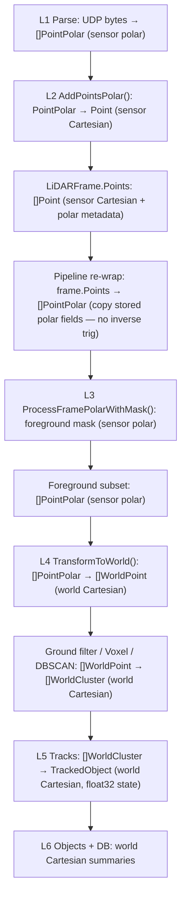
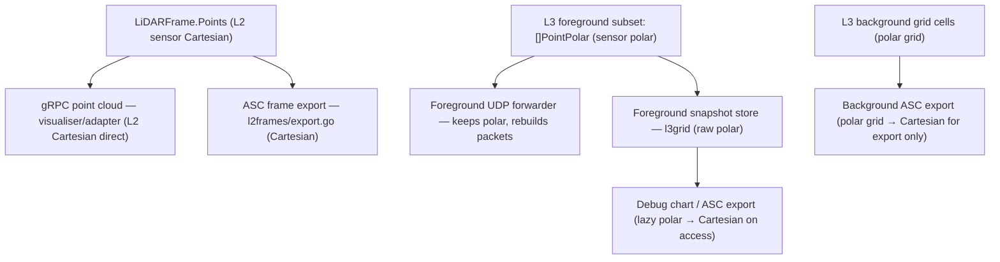

# LiDAR Coordinate Flow Audit

**Scope:** exact runtime movement of LiDAR data between polar, sensor Cartesian, and world Cartesian forms
**Index:** LiDAR architecture → coordinate systems → audits. See [docs/lidar/architecture/README.md](./README.md) for the full list.

## Executive Conclusion

The live LiDAR tracking path does contain a representation bounce:

`polar -> sensor Cartesian -> polar -> world Cartesian`

But the middle `Cartesian -> polar` step is not a numeric inverse transform from XYZ back to angles/range.
The code preserves the original `Distance`, `Azimuth`, and `Elevation` inside each L2 point, then re-materialises
`PointPolar` by copying those stored values.

So the current critical chain has:

- `2` forward `polar -> Cartesian` projections on foreground points
- `0` computed `Cartesian -> polar` inverse projections
- `0` `world -> polar` projections

This means the current design has redundant coordinate work and extra conceptual complexity, but not a meaningful
floating-point accuracy penalty from repeated back-and-forth inversion.

## Canonical Coordinate Forms

| Form            | Struct(s)                                     | Package(s)                                                                           | Meaning                                                                                                                                                              |
| --------------- | --------------------------------------------- | ------------------------------------------------------------------------------------ | -------------------------------------------------------------------------------------------------------------------------------------------------------------------- |
| Packet polar    | `PointPolar`                                  | `internal/lidar/l1packets/parse`, `internal/lidar/l4perception`                      | Sensor-local spherical-style point: channel, azimuth, elevation, distance, plus intensity and packet/time hints (timestamp, block/UDP sequencing, raw block azimuth) |
| Frame Cartesian | `Point`, `LiDARFrame.Points`                  | `internal/lidar/l2frames`                                                            | Sensor-local Cartesian point cloud with original polar metadata still attached                                                                                       |
| World Cartesian | `WorldPoint`, `WorldCluster`, `TrackedObject` | `internal/lidar/l4perception`, `internal/lidar/l5tracks`, `internal/lidar/l6objects` | Cartesian geometry used for clustering, tracking, persistence                                                                                                        |

## Critical Path Flowchart

## Branch Flowchart

These are not all part of the tracking-critical chain.

## Critical Chain Matrix

| Step                         | Module / file                                                  | Input form             | Output form                   | Critical tracking chain | Transform performed                            | Accuracy note                                              |
| ---------------------------- | -------------------------------------------------------------- | ---------------------- | ----------------------------- | ----------------------- | ---------------------------------------------- | ---------------------------------------------------------- |
| Packet parse                 | `internal/lidar/l1packets/parse/extract.go`                    | UDP bytes              | `[]PointPolar`                | Yes                     | No Cartesian math yet                          | Source form is polar                                       |
| Frame ingest                 | `internal/lidar/l2frames/frame_builder.go` `AddPointsPolar()`  | `[]PointPolar`         | `[]Point` inside `LiDARFrame` | Yes                     | `polar -> sensor Cartesian`                    | First trig projection                                      |
| Frame storage                | `internal/lidar/l2frames/frame_builder.go` `LiDARFrame.Points` | `Point`                | `Point`                       | Yes                     | None                                           | Original polar metadata is retained in each `Point`        |
| Pipeline re-wrap             | `internal/lidar/pipeline/tracking_pipeline.go`                 | `frame.Points []Point` | `[]PointPolar`                | Yes                     | No inverse trig; just copy stored polar fields | No extra numeric loss here                                 |
| Foreground extraction        | `internal/lidar/l3grid/foreground.go`                          | `[]PointPolar`         | `mask []bool`                 | Yes                     | None                                           | Pure polar classification                                  |
| Foreground subset            | `internal/lidar/l3grid` helper via pipeline                    | `[]PointPolar + mask`  | `foreground []PointPolar`     | Yes                     | None                                           | Still polar                                                |
| World transform              | `internal/lidar/l4perception/cluster.go` `TransformToWorld()`  | `[]PointPolar`         | `[]WorldPoint`                | Yes                     | `polar -> sensor Cartesian -> world Cartesian` | Second trig projection; currently identity pose by default |
| Ground filter                | `internal/lidar/l4perception/ground.go`                        | `[]WorldPoint`         | `[]WorldPoint`                | Yes                     | None                                           | Operates in Cartesian                                      |
| Voxel / DBSCAN               | `internal/lidar/l4perception/voxel.go`, `cluster.go`           | `[]WorldPoint`         | `[]WorldCluster`              | Yes                     | None                                           | Cluster summaries narrow to `float32`                      |
| Tracking                     | `internal/lidar/l5tracks/tracking.go`                          | `[]WorldCluster`       | `TrackedObject`               | Yes                     | None                                           | Track state stored as `float32`                            |
| Classification / persistence | `internal/lidar/l6objects`, `storage/sqlite`, pipeline         | tracks / clusters      | DB rows, labels               | Yes                     | None                                           | World-frame outputs only                                   |

## Side-Branch Matrix

| Branch                           | Module / file                                                                                                | Input form                           | Output form         | In critical chain | Transform performed            | Note                                                                                           |
| -------------------------------- | ------------------------------------------------------------------------------------------------------------ | ------------------------------------ | ------------------- | ----------------- | ------------------------------ | ---------------------------------------------------------------------------------------------- |
| gRPC point cloud                 | `internal/lidar/visualiser/adapter.go`                                                                       | `frame.Points []Point`               | point cloud arrays  | No                | None                           | Uses L2 Cartesian directly                                                                     |
| LidarView UDP foreground forward | `internal/lidar/visualiser/lidarview_adapter.go`, `internal/lidar/l1packets/network/foreground_forwarder.go` | foreground `[]PointPolar`            | rebuilt UDP packets | No                | No Cartesian math              | Preserves packet-like polar path                                                               |
| Foreground debug snapshot        | `internal/lidar/l3grid/foreground_snapshot.go`                                                               | foreground/background `[]PointPolar` | lazy projected XYZ  | No                | Polar -> Cartesian on access   | Debug-only projection                                                                          |
| Background ASC export            | `internal/lidar/l3grid/background_export.go`                                                                 | polar grid cells                     | ASC XYZ points      | No                | Polar grid -> Cartesian        | Export-only projection                                                                         |
| Frame ASC export                 | `internal/lidar/l2frames/export.go`                                                                          | Cartesian points                     | ASC XYZ points      | No                | Conditional polar -> Cartesian | Reprojects XYZ from stored polar when Z is all zero; otherwise uses existing L2 frame geometry |

## Exact Transform Count

### Foreground point that reaches tracking

1. Parsed in polar at L1
2. Projected once to sensor Cartesian at L2 for `LiDARFrame.Points`
3. Re-used as polar at pipeline entry by copying stored metadata, not by recomputing from XYZ
4. Projected again to world Cartesian at L4 for clustering/tracking

Net result:

- two forward projections
- zero inverse projections

### Background point that does not reach tracking

1. Parsed in polar at L1
2. Projected once to sensor Cartesian at L2 for frame storage / visualisation / frame export
3. Re-used as polar at pipeline entry by copying stored metadata
4. Classified in L3 and dropped from the tracking path

Net result:

- one forward projection in the critical runtime path
- optional later export/debug projections off the critical path

## Accuracy Audit

### 1. Is there a lossy flip-flop in the critical chain?

No, not in the usual sense.

The system does **not** compute:

- `XYZ -> azimuth/elevation/range`
- `world XYZ -> polar`

The pipeline's polar re-wrap copies the original polar fields already stored on each L2 `Point`.
That avoids the usual inverse-trig loss and branch-cut problems.

### 2. Are we paying for repeated forward projections?

Yes.

Foreground points that survive L3 are projected from polar to Cartesian twice:

- once in L2 `AddPointsPolar()`
- once again in L4 `TransformToWorld()`

This is redundant compute, but it is not iterative degradation. Both projections start from the same
preserved polar source values.

### 3. Is the floating-point penalty meaningful?

No, not relative to sensor quantisation or scene noise.

Reasons:

- Point geometry in L1, L2, and L4 uses `float64`
- the sensor's raw distance resolution is `0.004 m`
- repeated forward trig from the same `float64` inputs introduces rounding far below millimetre scale

Order-of-magnitude comparison at `200 m` range:

| Quantity                          | Approximate scale |
| --------------------------------- | ----------------- |
| Sensor distance quantisation      | `4e-3 m`          |
| `float32` position ulp near 200 m | about `2.4e-5 m`  |
| `float64` position ulp near 200 m | about `4e-14 m`   |

In practical terms, the duplicated L2 and L4 projections are a CPU / design issue, not an accuracy issue.

### 4. Where does precision narrow later?

There is a real type narrowing later in the pipeline:

- `WorldCluster` summary fields use `float32`
- `TrackedObject` state uses `float32`

That is downstream of per-point clustering input. It affects summaries and tracking state, not the L3 mask path.
At street-monitoring ranges this remains well below the raw LiDAR range quantisation, so it is not the dominant
source of geometric error.

### 5. Main risk today

The main risk is semantic and architectural, not numeric:

- the critical path does more representation churn than necessary
- the same point may exist as both L2 sensor Cartesian and L3/L4 polar-derived geometry
- future pose work could make the boundary harder to reason about if both forms continue to be recomputed ad hoc

## Accuracy Verdict

| Concern                                                            | Verdict                                       |
| ------------------------------------------------------------------ | --------------------------------------------- |
| Multiple inverse/forward flip-flops causing cumulative point drift | No                                            |
| Redundant forward trig projections in critical chain               | Yes                                           |
| Material geometry loss from current double projection              | No                                            |
| CPU / allocation overhead from duplicated representation work      | Yes                                           |
| Later float32 summary / track state narrowing                      | Yes, but minor relative to LiDAR quantisation |

## What To Change If The Goal Is "One Projection"

If the design goal is exactly one `polar -> Cartesian` projection for tracked points, the cleanest options are:

1. Make `LiDARFrame` carry polar as its primary runtime representation and project to Cartesian only for consumers that need XYZ.
2. Store both polar and Cartesian once at L2, then have L3 consume the stored polar slice instead of rebuilding it from `frame.Points`.
3. Move the first Cartesian projection out of `AddPointsPolar()` and make L2 frame assembly representation-neutral until a consumer requests XYZ.

The current implementation already preserves enough metadata to avoid numeric harm; the remaining win is simplification
and avoiding duplicated forward trig in the hot path.

### Adopted direction (✅ Implemented)

Option 2 was implemented:

- `LiDARFrame` stores both `PolarPoints []PointPolar` and `Points []Point`, populated once by `AddPointsPolar()`
- L3 consumes `frame.PolarPoints` directly — no per-frame polar rebuild in the pipeline callback
- the former `frame.Points -> []PointPolar` re-wrap step in `tracking_pipeline.go` has been deleted

See [lidar-l2-dual-representation-plan.md](../../plans/lidar-l2-dual-representation-plan.md) for the full plan.

## Important Caveats

### Coordinate-frame semantic caveat

The visualiser frame bundle is currently labelled as site / `ENU` by default, while the runtime transform often uses
identity pose (`sensor frame = world frame`). That is a semantic-labelling issue, not a floating-point issue.

### Axis-comment caveat

Some comments say `X=forward, Y=right`, but the implemented transform and tests correspond to:

- `X = right`
- `Y = forward`
- `Z = up`

This should be treated as a documentation hygiene issue, not evidence of a hidden numeric transform.
