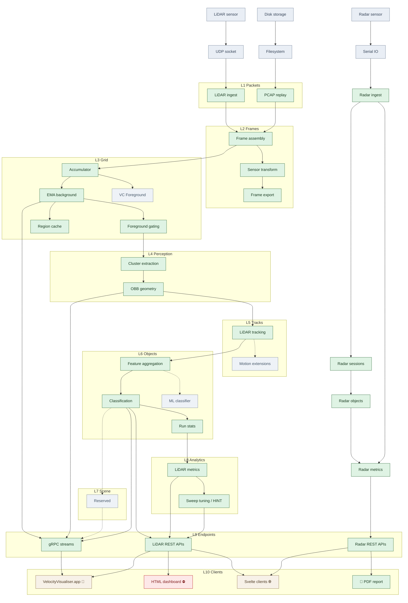

# LiDAR Architecture

- **Status:** Canonical reference; layer numbers are locked for codebase stability.

This is the canonical reference for the ten-layer LiDAR data processing model used throughout velocity.report, defining the scope, data forms, and stability guarantees for layers L1 through L10.

## Purpose

A single authoritative layer model for LiDAR data processing in velocity.report. The model defines ten layers: six implemented sensor layers (L1–L6), one planned scene layer (L7), and three implemented consumption layers (L8–L10) whose package boundaries are now largely settled. Layer numbers are permanent identifiers: once assigned, a layer number never changes meaning, even if the implementation evolves over years.

The design draws on established LiDAR/AV processing pipeline literature (see [§ Algorithm heritage](#algorithm-heritage-and-literature-alignment)) but is deliberately practical rather than academic. OSI is only a reference point; these layers match real code packages and real data flow.

## Stability guarantee

**Layer numbers L1–L10 are frozen.** Future capabilities extend existing layers or occupy reserved slots: they never renumber established layers. This ensures package names (`l1packets/`, `l2frames/`, … `l7scene/`) remain stable across years of evolution.

## The ten layers

| Layer | Label          | Tier        | Scope                                                           | Go package              | Status         |
| ----- | -------------- | ----------- | --------------------------------------------------------------- | ----------------------- | -------------- |
| L1    | **Packets**    | Sensor      | Sensor-wire transport and capture                               | `l1packets`             | ✅ Implemented |
| L2    | **Frames**     | Sensor      | Time-coherent frame assembly and geometry exports               | `l2frames`              | ✅ Implemented |
| L3    | **Grid**       | Sensor      | Background/foreground separation state                          | `l3grid`                | ✅ Implemented |
| L4    | **Perception** | Sensor      | Per-frame object primitives and measurements                    | `l4perception`          | ✅ Implemented |
| L5    | **Tracks**     | Sensor      | Multi-frame identity and motion continuity                      | `l5tracks`              | ✅ Implemented |
| L6    | **Objects**    | Sensor      | Semantic object interpretation and dataset mapping              | `l6objects`             | ✅ Implemented |
| L7    | **Scene**      | Scene       | Persistent canonical world model with multi-sensor fusion       | `l7scene`               | 💭 Planning    |
| L8    | **Analytics**  | Consumption | Canonical traffic metrics, run comparison, scoring              | `l8analytics`           | ✅ Implemented |
| L9    | **Endpoints**  | Consumption | Server-side payload shaping, gRPC streams, and report APIs      | `server`, `l9endpoints` | ✅ Implemented |
| L10   | **Clients**    | Consumption | Downstream rendering consumers (Svelte, Swift, Go PDF pipeline) | –                       | ✅ Implemented |

## Segmented concept status chart

This is the primary visual breakdown for the layer model. Green nodes show
implemented components; grey nodes mark planned extensions with no runtime
code yet. L7 remains an explicit empty slot so the canonical L1-L10 stack
stays visually fixed.



**Reading notes**

- **Polar vs Cartesian paths.** The LiDAR tracking path stays in polar
  coordinates through L3 (Accumulator → EMA background → Foreground gating)
  and only moves into world Cartesian at L4ad (Cluster extraction). The
  earlier sensor-space transform in L2b (Sensor transform) is a
  frame/export side path: `AddPointsPolar()` materialises XYZ for
  `LiDARFrame`, ASC, and LidarView use, and the tracking path then
  reconstructs polar points before `ProcessFramePolarWithMask()`.
- **Region cache and settling.** L3d (Region cache) belongs to settling
  control rather than a separate post-grid stage. During warmup, `l3grid`
  can attempt an early region restore from the database after roughly
  10 frames; when settling completes naturally, it identifies regions and
  persists a linked grid-and-region snapshot for later restore.
- **VC Foreground (L3f).** A planned extension that uses
  velocity-consistent foreground extraction within the grid layer, fed
  from the accumulator (L3a). Currently a grey/planned node with no
  runtime code.
- **Radar path.** The radar path now has its own object stage: L1a (Radar
  ingest) → L5a (Radar sessions) → L6f (Radar objects) → L8a (Radar
  metrics). L5a sessionises raw `radar_data` into
  `radar_data_transits` via the transit worker; L6f derives transit-level
  speed, direction, and event metadata; L8a computes histograms,
  percentiles, and report rollups. L8a feeds L9a (Radar REST APIs) which
  serves L10a (Go PDF pipeline) and L10b (Svelte clients).
- **LiDAR tracking (L5bg).** The combined block covers the full tracker:
  L5b/L5d together form the 4-state constant-velocity Kalman tracker
  (predict before association, update after); L5c is Hungarian
  assignment; L5e detects merge/split coherence anomalies; L5f manages
  the birth/confirm/coast/delete lifecycle; L5g computes velocity-trail
  quality metrics. L5h (Motion extensions) is reserved for future
  motion-model upgrades beyond the CV baseline (CA / CTRV / IMM).
- **ML classifier (L6e).** A planned research lane for learned
  classification to complement or replace the current rule-based
  classifier (L6b). Dashed edge from L6a (Feature aggregation) indicates
  the intended data flow.
- **L8 Analytics structure.** The chart splits L8 into two visual groups:
  L8sub contains LiDAR-side analytics (L8b LiDAR metrics → L8c Sweep
  tuning / HINT), while L8a (Radar metrics) sits alongside for the radar
  path. Both feed into L9 endpoints.
- **L9 fan-out.** L9b (LiDAR REST APIs) serves three clients: L10b
  (Svelte clients), L10c (VelocityVisualiser.app), and L10d (HTML
  dashboard ⛔). L9c (gRPC streams) serves L10c exclusively for real-time
  3D visualisation. L9a (Radar REST APIs) serves L10a (Go PDF pipeline) and
  L10b (Svelte clients).
- **L10 clients.** All four L10 nodes are implemented applications:
  L10a is the Go PDF pipeline (`internal/report/` — native SVG charts, `text/template` LaTeX, xelatex),
  L10b is a Svelte 5 web app,
  L10c is a native macOS Metal visualiser with gRPC streaming, and L10d
  is a legacy Go-embedded HTML dashboard marked deprecated (⛔).

**Legend**

- Green: implemented
- Grey: reserved layer slot with no runtime implementation yet
- Blue-grey: OS + hardware shown for ingress context only
- Beige: downstream client surfaces (implemented in Go, Svelte, or Swift)
- Red: deprecated; scheduled for removal or replacement
- Solid arrows: implemented code
- Dashed arrows: reference links for future work

## Layered concept and literature status

The ten-layer table above shows where layers live. The concept chart shows
which ideas within those layers are active. This table makes the
paper/concept mapping explicit. The final column points to the nearest
internal design note, maths specification, or implementation plan for that
block.

> **Chart simplification:** In both the concept chart and this table,
> L4a–L4d are shown as a single "Cluster extraction" row (L4ad), and
> L5b–L5g as a single "LiDAR tracking" row (L5bg). Each combined row
> covers the full algorithmic spread of its constituent blocks. Table
> concept names match the chart node labels exactly (e.g. "Accumulator"
> not "Polar grid accumulation").

| Block | Concept                       | Standard                                                                                                                                                                                                                                                                                                                                                                               | Code                                                                                                 | ❓  | Spec / plan                                                                                                                                                              |
| ----- | ----------------------------- | -------------------------------------------------------------------------------------------------------------------------------------------------------------------------------------------------------------------------------------------------------------------------------------------------------------------------------------------------------------------------------------- | ---------------------------------------------------------------------------------------------------- | --- | ------------------------------------------------------------------------------------------------------------------------------------------------------------------------ |
| L1a   | Radar ingest                  | Serial sensor ingest and telemetry logging patterns                                                                                                                                                                                                                                                                                                                                    | [serialmux/](../../../internal/serialmux/)                                                           | ✅  | [Radar serial spec](../../radar/architecture/serial-configuration-ui.md)                                                                                                 |
| L1b   | LiDAR ingest                  | Velodyne HDL convention, ROS `velodyne`, Autoware `nebula`                                                                                                                                                                                                                                                                                                                             | [l1packets/network/listener.go](../../../internal/lidar/l1packets/network/listener.go)               | ✅  | [LiDAR network design](network-configuration.md)                                                                                                                         |
| L1c   | PCAP replay                   | libpcap / tcpdump capture and replay tooling                                                                                                                                                                                                                                                                                                                                           | [l1packets/network/pcap.go](../../../internal/lidar/l1packets/network/pcap.go)                       | ✅  | [PCAP analysis mode](../operations/pcap-analysis-mode.md)                                                                                                                |
| L2a   | Frame assembly                | RangeNet++, SemanticKITTI temporal framing                                                                                                                                                                                                                                                                                                                                             | [l2frames/frame_builder.go](../../../internal/lidar/l2frames/frame_builder.go)                       | ✅  | [Pipeline reference](lidar-pipeline-reference.md)                                                                                                                        |
| L2b   | Sensor transform              | Standard LiDAR spherical-to-Cartesian geometry                                                                                                                                                                                                                                                                                                                                         | [l2frames/geometry.go](../../../internal/lidar/l2frames/geometry.go)                                 | ✅  | [AV range-image design](av-range-image-format-alignment.md)                                                                                                              |
| L2c   | Frame export (LidarView, ASC) | ASC and point-cloud export conventions                                                                                                                                                                                                                                                                                                                                                 | [l2frames/export.go](../../../internal/lidar/l2frames/export.go)                                     | ✅  | [AV range-image design](av-range-image-format-alignment.md)                                                                                                              |
| L3a   | Accumulator                   | Range-image / occupancy-style spatial binning                                                                                                                                                                                                                                                                                                                                          | [l3grid/background.go](../../../internal/lidar/l3grid/background.go)                                 | ✅  | [Background-grid maths](../../../data/maths/background-grid-settling-maths.md)                                                                                           |
| L3b   | EMA background                | Stauffer-Grimson adaptive background lineage                                                                                                                                                                                                                                                                                                                                           | [l3grid/background.go](../../../internal/lidar/l3grid/background.go)                                 | ✅  | [Background-grid maths](../../../data/maths/background-grid-settling-maths.md)                                                                                           |
| L3c   | Foreground gating             | Background subtraction and neighbour-confirmation heuristics                                                                                                                                                                                                                                                                                                                           | [l3grid/foreground.go](../../../internal/lidar/l3grid/foreground.go)                                 | ✅  | [Background-grid maths](../../../data/maths/background-grid-settling-maths.md)                                                                                           |
| L3d   | Region cache                  | Persistent background snapshots and scene-signature restore                                                                                                                                                                                                                                                                                                                            | [l3grid/background_persistence.go](../../../internal/lidar/l3grid/background_persistence.go)         | ✅  | [Background-grid maths](../../../data/maths/background-grid-settling-maths.md)                                                                                           |
| L3f   | VC Foreground                 | Doppler/velocity-consistent foreground extraction                                                                                                                                                                                                                                                                                                                                      | -                                                                                                    | 💭  | [Velocity-coherent FG plan](../../plans/lidar-velocity-coherent-foreground-extraction-plan.md)                                                                           |
| L4ad  | Cluster extraction            | **a.** Rigid transforms and homogeneous pose geometry <br> **b.** Ground-plane removal via vertical band gating <br> **c.** PCL `VoxelGrid` downsampling family <br> **d.** DBSCAN with spatial index; auto-subsample above cap                                                                                                                                                        | [l4perception/](../../../internal/lidar/l4perception/)                                               | ✅  | [Foreground-tracking design](foreground-tracking.md), [Ground-plane extraction](ground-plane-extraction.md), [Clustering maths](../../../data/maths/clustering-maths.md) |
| L4e   | OBB geometry                  | PCA / OBB fitting; embedded in DBSCAN output builder                                                                                                                                                                                                                                                                                                                                   | [l4perception/obb.go](../../../internal/lidar/l4perception/obb.go)                                   | ✅  | [Clustering maths](../../../data/maths/clustering-maths.md)                                                                                                              |
| L5a   | Radar sessions                | Temporal event segmentation and transit/session building                                                                                                                                                                                                                                                                                                                               | [db/transit_worker.go](../../../internal/db/transit_worker.go)                                       | ✅  | [Transit deduplication](../../radar/architecture/transit-deduplication.md)                                                                                               |
| L5bg  | LiDAR tracking                | **b.** CV predict: X′ = FX, P′ = FPFᵀ + Q <br> **c.** Kuhn Hungarian on Mahalanobis cost matrix <br> **d.** Measurement update with velocity and OBB heading smoothing <br> **e.** Merge/split coherence flags on cluster area deviation <br> **f.** SORT-style birth / confirm / coast / delete lifecycle <br> **g.** Velocity-trail alignment, jitter, capture ratios, fragmentation | [l5tracks/](../../../internal/lidar/l5tracks/)                                                       | ✅  | [Tracking maths](../../../data/maths/tracking-maths.md)                                                                                                                  |
| L5h   | Motion extensions             | CA / CTRV / IMM multi-model tracking literature                                                                                                                                                                                                                                                                                                                                        | -                                                                                                    | 💭  | [Bodies-in-motion plan](../../plans/lidar-bodies-in-motion-plan.md)                                                                                                      |
| L6a   | Feature aggregation           | Classical feature engineering for traffic objects                                                                                                                                                                                                                                                                                                                                      | [l6objects/features.go](../../../internal/lidar/l6objects/features.go)                               | ✅  | [Classification maths](../../../data/maths/classification-maths.md)                                                                                                      |
| L6b   | Classification                | Local heuristic classifier; KITTI / SemanticKITTI mapping lineage                                                                                                                                                                                                                                                                                                                      | [l6objects/classification.go](../../../internal/lidar/l6objects/classification.go)                   | ✅  | [Classification maths](../../../data/maths/classification-maths.md)                                                                                                      |
| L6c   | Run stats                     | Experiment and run summarisation patterns                                                                                                                                                                                                                                                                                                                                              | [storage/sqlite/analysis_run.go](../../../internal/lidar/storage/sqlite/analysis_run.go)             | ✅  | [Analysis-run infrastructure](../../plans/lidar-analysis-run-infrastructure-plan.md)                                                                                     |
| L6e   | ML classifier                 | Learned classification research lane; KITTI/nuScenes training pipeline                                                                                                                                                                                                                                                                                                                 | -                                                                                                    | 💭  | [ML classifier plan](../../plans/lidar-ml-classifier-training-plan.md)                                                                                                   |
| L6f   | Radar objects                 | Transit-level speed, direction, and event metadata from sessionised radar data                                                                                                                                                                                                                                                                                                         | [db/transit_controller.go](../../../internal/db/transit_controller.go)                               | ✅  | [Transit deduplication](../../radar/architecture/transit-deduplication.md)                                                                                               |
| L7a   | Reserved                      | HD-map, scene accumulation, OSM prior literature                                                                                                                                                                                                                                                                                                                                       | -                                                                                                    | 💭  | [L7 scene plan](../../plans/lidar-l7-scene-plan.md)                                                                                                                      |
| L8a   | Radar metrics                 | Traffic histograms, percentiles, report rollups                                                                                                                                                                                                                                                                                                                                        | [db/db.go](../../../internal/db/db.go)                                                               | 🔄  | [Speed-percentile plan](../../plans/speed-percentile-aggregation-alignment-plan.md)                                                                                      |
| L8b   | LiDAR metrics                 | Traffic engineering reporting and nearest-rank percentiles                                                                                                                                                                                                                                                                                                                             | [server/chart_api.go](../../../internal/lidar/server/chart_api.go)                                   | 🔄  | [Speed-percentile plan](../../plans/speed-percentile-aggregation-alignment-plan.md)                                                                                      |
| L8c   | Sweep tuning / HINT           | Parameter sweeps and experiment evaluation                                                                                                                                                                                                                                                                                                                                             | [sweep/hint.go](../../../internal/lidar/sweep/hint.go)                                               | 🔄  | [Tuning optimisation plan](../../plans/lidar-parameter-tuning-optimisation-plan.md)                                                                                      |
| L9a   | Radar REST APIs               | REST / JSON reporting surfaces                                                                                                                                                                                                                                                                                                                                                         | [api/server.go](../../../internal/api/server.go)                                                     | 🔄  | [Radar networking design](../../radar/architecture/networking.md)                                                                                                        |
| L9b   | LiDAR REST APIs               | REST / JSON dashboard, replay, scene, and track APIs                                                                                                                                                                                                                                                                                                                                   | [server/](../../../internal/lidar/server/)                                                           | 🔄  | [L8-L10 refactor plan](../../plans/lidar-l8-analytics-l9-endpoints-l10-clients-plan.md)                                                                                  |
| L9c   | gRPC streams                  | gRPC streaming with frame codec, overlay preferences, and replay                                                                                                                                                                                                                                                                                                                       | [l9endpoints/grpc_server.go](../../../internal/lidar/l9endpoints/grpc_server.go)                     | 🔄  | [Visualiser proto plan](../../plans/lidar-visualiser-proto-contract-and-debug-overlay-fixes-plan.md)                                                                     |
| L10a  | PDF report (Go)               | Native Go PDF pipeline: direct DB query, SVG charts, `text/template` LaTeX, xelatex                                                                                                                                                                                                                                                                                                    | [internal/report/](../../../internal/report/)                                                        | ✅  | [PDF reporting](../../platform/operations/pdf-reporting.md)                                                                                                              |
| L10b  | Svelte clients                | Svelte 5 dashboard with site management, radar reports, and LiDAR run views                                                                                                                                                                                                                                                                                                            | [web/](../../../web/)                                                                                | 🔄  | [Frontend consolidation plan](../../plans/web-frontend-consolidation-plan.md)                                                                                            |
| L10c  | VelocityVisualiser.app        | Native macOS Metal 3D point-cloud visualisation with gRPC streaming client                                                                                                                                                                                                                                                                                                             | [tools/visualiser-macos/](../../../tools/visualiser-macos/)                                          | 🔄  | [Visualiser proto plan](../../plans/lidar-visualiser-proto-contract-and-debug-overlay-fixes-plan.md)                                                                     |
| L10d  | HTML dashboard                | Legacy Go-embedded LiDAR dashboard served by `server/` from assets embedded under `l9endpoints/l10clients/html/`                                                                                                                                                                                                                                                                       | [l10clients/html/dashboard.html](../../../internal/lidar/l9endpoints/l10clients/html/dashboard.html) | ⛔  | [L8-L10 refactor plan](../../plans/lidar-l8-analytics-l9-endpoints-l10-clients-plan.md)                                                                                  |

### Design rationale for ten layers

L1–L6 cover the single-sensor, single-frame-to-object pipeline that is standard in LiDAR processing literature. L7 introduces the critical missing concept: a **persistent world model** that accumulates evidence across frames, tracks, and sensors. L8–L10 handle what happens _after_ the processing pipeline produces results; analysis, server-side formatting, and client rendering.

The decision to place Scene at L7 (rather than above Analytics) reflects data flow: analytics (L8) needs the scene model to contextualise metrics (e.g. "speed at this road segment"), and endpoints (L9) render both scene geometry and analytics results.

## Artefact placement in this model

- Sensor packets → **L1 Packets**
- Frames and Cartesian representations → **L2 Frames**
- Background/foreground grid → **L3 Grid**
- Clusters and observations → **L4 Perception**
- Ground plane surface model → **L4 Perception** (planned; current production uses `HeightBandFilter` band gating)
- Per-frame vector geometry extraction → **L4 Perception** (polygon features for ground, structures, volumes; see [vector-scene-map.md](vector-scene-map.md))
- Tracks → **L5 Tracks**
- Objects/classes → **L6 Objects**
- Canonical scene model (accumulated geometry, priors, multi-sensor merge) → **L7 Scene**
- OSM priors and external map data → **L7 Scene** (ingested as prior features, refined by observation)
- Run statistics, comparisons, percentiles → **L8 Analytics**
- gRPC streams, chart data, dashboard payloads → **L9 Endpoints**
- Browser, native app, PDF → **L10 Clients**
- VRLOG recordings span **L2–L6** (frame bundles, perception outputs, tracks, objects)
- LidarView exports primarily sit at **L2** (frame/geometry view)

## Visualiser

The macOS VelocityVisualiser renders each layer simultaneously in a single 3D Metal view, making the full pipeline visible at a glance. The screenshot below (kirk0.pcapng at 0:35) shows L3 foreground extraction, L4 DBSCAN clustering, and L5 track promotion all active at once:


### What each colour represents

| Visual element         | Colour                 | Layer         | Meaning                                                                                                                                                                                                                                    |
| ---------------------- | ---------------------- | ------------- | ------------------------------------------------------------------------------------------------------------------------------------------------------------------------------------------------------------------------------------------ |
| Background points      | **Grey-blue**          | L3 Grid       | Points classified as static scenery by the background model. The EMA-based grid learns per-cell range baselines; points within the closeness threshold are suppressed from further processing.                                             |
| Foreground points      | **Green**              | L3 Grid       | Points that diverge from the learned background: potential moving objects. These are the _only_ points passed to DBSCAN.                                                                                                                   |
| Ground points          | **Brown/tan**          | L4 Perception | Points classified as ground surface by the height-band filter (default band: −2.8 m to +1.5 m relative to sensor).                                                                                                                         |
| Cluster boxes          | **Cyan**               | L4 Perception | DBSCAN cluster bounding boxes. Each cyan box is a single-frame spatial grouping of foreground points (ε = 0.8 m, minPts = 5 by default). These are _observations_: no identity or history yet. Oriented (OBB) when PCA provides a heading. |
| Cluster heading arrows | **Cyan**               | L4 Perception | PCA-derived heading from the cluster's oriented bounding box. Only rendered when OBB data is present.                                                                                                                                      |
| Tentative track boxes  | **Yellow**             | L5 Tracks     | A DBSCAN cluster that has been associated with a Kalman-filtered track but has not yet reached the `hits_to_confirm` threshold (default: 4 consecutive observations). The tracker is _watching_ this object but has not committed to it.   |
| Confirmed track boxes  | **Green**              | L5 Tracks     | A track that has accumulated enough consistent observations to be confirmed. These are the high-confidence moving objects: vehicles, pedestrians, cyclists. The Kalman filter provides smoothed position and velocity.                     |
| Deleted track boxes    | **Red**                | L5 Tracks     | A track that has exceeded `max_misses` (tentative) or `max_misses_confirmed` without a matching observation. Fades out over the grace period.                                                                                              |
| Trail lines            | **Green** (fading)     | L5 Tracks     | Historical position polyline for confirmed tracks. Alpha fades linearly from transparent (oldest) to opaque (newest), showing the track's recent trajectory.                                                                               |
| Heading arrows         | **Track state colour** | L5 Tracks     | Velocity-derived heading for tracks (green for confirmed, yellow for tentative). Prefers Kalman velocity heading over PCA/OBB heading.                                                                                                     |
| Track ID labels        | **White**              | L5 Tracks     | Short hex identifier (e.g. `4269`, `7cc0`) projected to screen coordinates above each track box.                                                                                                                                           |
| Class labels           | **Yellow**             | L6 Objects    | Classification label (e.g. `car`, `pedestrian`) shown below the track ID once the classifier has enough observations.                                                                                                                      |

### Pipeline flow

The per-block breakdown for each layer lives in [§ Layered concept and literature status](#layered-concept-and-literature-status). The current single-sensor implementation flow is shown in the simplified diagram below.

### Simplified single-sensor flow (current implementation)

The current single-sensor, single-frame pipeline:

```
L1  UDP packets arrive from sensor (or PCAP replay)
     │
L2  Frame assembly: 40-ring polar points → time-coherent LiDARFrame
     │
L3  Background grid: each point tested against per-cell EMA baseline
     │  ├─ within threshold → grey-blue background point (suppressed)
     │  └─ outside threshold → green foreground point (passed on)
     │
L4  Height-band filter → voxel downsampling → DBSCAN clustering
     │  └─ each cluster → cyan box with OBB heading
     │
L5  Hungarian assignment: clusters matched to existing Kalman tracks
     │  ├─ matched + below hits_to_confirm → yellow tentative box
     │  ├─ matched + above hits_to_confirm → green confirmed box
     │  ├─ unmatched cluster → new tentative track (yellow)
     │  └─ unmatched track → increment miss counter (→ red/deleted)
     │
L6  Classification: confirmed tracks accumulate features → class label
```

### Background settling and the 30-second warmup

When a new data source starts (live sensor or PCAP replay), the L3 background grid must _settle_ before foreground extraction begins. During the settling period (default: **100 frames AND 30 seconds**, whichever is longer):

- All points are used to seed per-cell EMA range baselines
- The foreground mask is **suppressed**: no points reach DBSCAN
- The visualiser shows only grey-blue background points (no cyan/yellow/green boxes)

After settling completes, the grid identifies _regions_ and persists both grid cells and region data to SQLite. On subsequent replays of the same PCAP file, the grid restores from the database in ~10 frames, skipping the 30-second warmup entirely.

### Toggle buttons in the toolbar

The visualiser toolbar provides single-key toggles for each visual layer:

| Button | Key | Controls                                 |
| ------ | --- | ---------------------------------------- |
| **F**  | F   | Foreground points (green)                |
| **K**  | K   | Background points (grey-blue)            |
| **B**  | B   | Bounding boxes (all track/cluster boxes) |
| **C**  | C   | Cluster boxes (cyan, L4)                 |
| **T**  | T   | Track boxes (yellow/green/red, L5)       |
| **V**  | V   | Velocity vectors / heading arrows        |
| **L**  | L   | Labels (track ID + class)                |
| **G**  | G   | Ground grid overlay                      |

## Cross-cutting packages

Layer-specific Go packages (`l1packets/` through `l9endpoints/`) are listed in the [ten-layer summary table](#the-ten-layers). The following packages cut across layer boundaries:

| Package           | Purpose                                                                                                                                                                   |
| ----------------- | ------------------------------------------------------------------------------------------------------------------------------------------------------------------------- |
| `pipeline/`       | Orchestration (stage interfaces)                                                                                                                                          |
| `storage/sqlite/` | DB repositories (scene, track, evaluation, sweep, analysis run stores). `lidar_run_tracks` is an L8 snapshot of L5 `lidar_tracks`: see `track_measurement_sql.go` for DRY |
| `adapters/`       | Transport and IO boundaries                                                                                                                                               |
| `server/`         | HTTP server, API handlers, data source management (REST counterpart to L9's gRPC)                                                                                         |
| `sweep/`          | Parameter sweep and auto-tuning                                                                                                                                           |

Backward-compatible type aliases remain in the parent [internal/lidar/](../../../internal/lidar) package so existing callers continue to work.

## Documentation map

Documentation for the LiDAR subsystem lives under [docs/lidar/](..).

| Folder             | Scope                                                             |
| ------------------ | ----------------------------------------------------------------- |
| `architecture/`    | System design and layer specifications (including this document)  |
| `operations/`      | Runtime operations: data source switching, auto-tuning, debugging |
| `troubleshooting/` | Resolved investigation notes for reference                        |

### Quick links

| Topic                   | Document                                                                                               |
| ----------------------- | ------------------------------------------------------------------------------------------------------ |
| Pipeline component map  | [lidar-pipeline-reference.md](lidar-pipeline-reference.md)                                             |
| Tracking implementation | [foreground-tracking.md](foreground-tracking.md)                                                       |
| Packet format           | [HESAI_PACKET_FORMAT.md](../../../data/structures/HESAI_PACKET_FORMAT.md)                              |
| Auto-tuning             | [auto-tuning.md](../operations/auto-tuning.md)                                                         |
| Track labelling         | [track-labelling-ui-implementation.md](../operations/track-labelling-ui-implementation.md)             |
| macOS visualiser        | [architecture.md](../../ui/visualiser/architecture.md)                                                 |
| API contracts           | [api-contracts.md](../../ui/visualiser/api-contracts.md)                                               |
| Data science plan       | [platform-data-science-metrics-first-plan.md](../../plans/platform-data-science-metrics-first-plan.md) |
| Backlog                 | [BACKLOG.md](../../BACKLOG.md)                                                                         |

### Architecture documents

#### Current (active)

| Document                                                                                           | Scope                                                                          |
| -------------------------------------------------------------------------------------------------- | ------------------------------------------------------------------------------ |
| [lidar-layer-alignment-refactor-review.md](lidar-layer-alignment-refactor-review.md)               | Layer alignment review: completed migration, complexity analysis, file splits  |
| [lidar-logging-stream-split-and-rubric-design.md](lidar-logging-stream-split-and-rubric-design.md) | Complete: all 55 Debugf sites migrated to explicit ops/diag/trace streams      |
| [foreground-tracking.md](foreground-tracking.md)                                                   | Foreground extraction and tracking pipeline design                             |
| [lidar-background-grid-standards.md](lidar-background-grid-standards.md)                           | Background grid format comparison with industry standards                      |
| [HESAI_PACKET_FORMAT.md](../../../data/structures/HESAI_PACKET_FORMAT.md)                          | Hesai Pandar40P UDP packet format reference (moved to data/structures/)        |
| [lidar-pipeline-reference.md](lidar-pipeline-reference.md)                                         | Component inventory, data-flow diagram, deployment topology                    |
| [network-configuration.md](network-configuration.md)                                               | Network interface selection, diagnostics, and hot-reload plan for UDP listener |
| [multi-model-ingestion-and-configuration.md](multi-model-ingestion-and-configuration.md)           | Proposed path for supporting 3–10 LiDAR models with distinct packet formats    |

#### Historical (completed designs)

| Document                                                                                                         | Status                                                          |
| ---------------------------------------------------------------------------------------------------------------- | --------------------------------------------------------------- |
| [arena-go-deprecation-and-layered-type-layout-design.md](arena-go-deprecation-and-layered-type-layout-design.md) | ✅ Complete: arena.go removed, types migrated to layer packages |

#### Future / research

| Document                                                                                                                                 | Scope                                        |
| ---------------------------------------------------------------------------------------------------------------------------------------- | -------------------------------------------- |
| [av-range-image-format-alignment.md](av-range-image-format-alignment.md)                                                                 | AV dual-return range image format (deferred) |
| [../../plans/lidar-architecture-dynamic-algorithm-selection-plan.md](../../plans/lidar-architecture-dynamic-algorithm-selection-plan.md) | Runtime algorithm switching (deferred)       |

### Layer dependency rule

Each layer package may only import from lower-numbered layers: never upward or sideways. For example: L2 may import L1 (for return types); L3 may import L1–L2; L4 may import L1–L3; and so on. Cross-cutting packages (`pipeline/`, `storage/`, `adapters/`) are exempt.

**Former violations (✅ resolved):** L1–L3 files previously imported `PointPolar`, `Point`, and `SphericalToCartesian` from L4. These sensor-frame primitives now live canonically in L2 (`l2frames/types.go`), with backward-compatible aliases in L4.

### Implementation status

The layer alignment migration is **complete** (items 1–12, 14 in [the review doc](lidar-layer-alignment-refactor-review.md)). Remaining:

- **Item 13**: Frontend decomposition (tracksStore, runsStore, missedRegionStore); see [BACKLOG.md](../../BACKLOG.md)

Post-migration file sizes:

| File                               | Lines | Notes                                                   |
| ---------------------------------- | ----- | ------------------------------------------------------- |
| `l3grid/background.go`             | 1,628 | Core grid processing (split from 2,610)                 |
| `l3grid/background_persistence.go` | 450   | Snapshot serialisation, DB restore/persist              |
| `l3grid/background_export.go`      | 350   | Heatmaps, ASC export, region debug info                 |
| `l3grid/background_drift.go`       | 245   | M3.5 sensor movement and drift detection                |
| `server/server.go`                 | 423   | Server struct, config, lifecycle, legacy asset wiring   |
| `server/datasource_handlers.go`    | 823   | UDP/PCAP data source management                         |
| `server/playback_handlers.go`      | 612   | PCAP/VRLOG playback controls                            |
| `storage/sqlite/analysis_run.go`   | 381   | Run storage plus compatibility aliases to `l8analytics` |
| `l6objects/comparison.go`          | 21    | Compatibility aliases to `l8analytics` comparison types |

Further size/complexity reduction opportunities remain documented in the [review doc's "Further Opportunities" section](lidar-layer-alignment-refactor-review.md#further-opportunities-to-reduce-size-and-complexity), with the remaining L8-L10 work now centred on legacy dashboard retirement and endpoint cleanup rather than package migration.

---

## Algorithm heritage and literature alignment

Each layer's algorithms align with established research in LiDAR processing, 3D object detection, and multi-object tracking. This section maps velocity.report's implementation choices to the relevant literature, providing both justification and pointers for future contributors.

Use the references above as the fast visual index:

- the **ten-layer table** answers where a capability belongs;
- the **concept chart** answers which bodies of work are implemented, partial,
  planned, proposed, or merely contextual.

The full bibliography in BibTeX format is at [data/maths/references.bib](../../../data/maths/references.bib). Each entry key matches the citation style used in this document (e.g. `Ester1996`, `Kalman1960`).

### L1 packets: sensor transport

**Our approach:** Raw UDP packet capture from Hesai Pandar40P; PCAP file replay for offline analysis.

**Literature context:** Sensor-specific packet formats are proprietary but follow the pattern established by Velodyne's original HDL-64E protocol specification. The general approach of treating raw sensor data as an opaque transport layer; separate from frame assembly; is standard in the Hesai ROS 2 driver architecture and Autoware's `nebula` multi-vendor driver.

| Reference                           | Relevance                                                                                    |
| ----------------------------------- | -------------------------------------------------------------------------------------------- |
| Velodyne HDL-64E User Manual (2007) | Established the UDP point-return packet convention used by most spinning LiDAR manufacturers |
| Hesai Pandar40P User Manual v4.02   | Our specific sensor protocol: dual-return UDP at 10 Hz rotation                              |
| Hesai ROS 2 driver (2022)           | Canonical Hesai L1 driver; demonstrates the packet-driver / pointcloud-assembly split        |
| Autoware `nebula` driver (2023)     | Modern multi-vendor L1 abstraction supporting Hesai, Velodyne, Ouster, Robosense             |

### L2 frames: point cloud assembly

**Our approach:** Assemble a complete 360° rotation into a time-coherent `LiDARFrame`; convert from polar (ring, azimuth, range) to Cartesian (x, y, z) coordinates. Export to ASC/LidarView formats.

**Literature context:** Frame assembly from individual laser returns is a solved problem but involves timing correction (motion compensation) for moving platforms. velocity.report's fixed-mount sensor simplifies this; no ego-motion compensation required.

| Reference                                                     | Relevance                                                                                                            |
| ------------------------------------------------------------- | -------------------------------------------------------------------------------------------------------------------- |
| Range image representation (Milioto et al., 2019: RangeNet++) | Treating a LiDAR rotation as a 2D range image (rings × azimuth); our polar frame is equivalent                       |
| Behley et al. (2019): **SemanticKITTI** (arXiv:1904.01416)    | Defined the standard for sequential LiDAR frame datasets; our frame-level data follows the same temporal conventions |
| VTK structured grid formats                                   | Our ASC/VTK export pathway follows ParaView interchange conventions                                                  |

### L3 grid: background/foreground separation

**Our approach:** Exponential Moving Average (EMA) per polar-grid cell (40 rings × 1800 azimuth bins = 72,000 cells). Each cell tracks mean range and spread. Foreground points are those deviating beyond a distance-adaptive threshold from the learned baseline. Neighbour confirmation voting reduces noise. Settling period: 100 frames + 30 seconds.

**Literature context:** Background subtraction in point clouds parallels the well-studied problem in video surveillance. Our approach is most closely related to Gaussian Mixture Model (GMM) background subtraction, but simplified to a single-component EMA because the sensor is stationary and the scene is predominantly static.

| Reference                                                                            | Relevance                                                                                                                       |
| ------------------------------------------------------------------------------------ | ------------------------------------------------------------------------------------------------------------------------------- |
| Stauffer & Grimson (1999): Adaptive background mixture models for real-time tracking | Foundation for statistical background models; our single-component EMA is a simplified variant                                  |
| Sack & Burgard (2004): Background subtraction for mobile robots                      | Extended GMM to range data; validates the EMA-on-range approach for static scenes                                               |
| Pomerleau et al. (2014): Long-term 3D map maintenance                                | Dynamic point removal from accumulated maps; related to our background settling and drift correction                            |
| Hornung et al. (2013): **OctoMap** (doi:10.1007/s10514-012-9321-0)                   | Probabilistic 3D occupancy mapping; our polar grid is a sensor-native alternative that avoids Cartesian discretisation overhead |

**Design choice:** Polar-frame EMA over OctoMap/TSDF for background; lower latency, no pose dependence, and the sensor-centric grid naturally matches the measurement geometry. See [lidar-background-grid-standards.md](lidar-background-grid-standards.md) for the full comparison.

### L4 perception: clustering and ground extraction

**Our approach:** Height-band ground removal, voxel downsampling, DBSCAN clustering (ε = 0.8 m, minPts = 5), PCA-based oriented bounding boxes (OBB). Ground surface modelled as tiled planes, evolving toward vector polygons.

**Literature context:** DBSCAN is the standard baseline for unsupervised LiDAR clustering in traffic scenarios. It appears in virtually every classical LiDAR pipeline (pre-deep-learning). Our ground removal via height-band filter is a simplified variant of the RANSAC-based approaches common in the literature.

| Reference                                                                                | Relevance                                                                                                                                          |
| ---------------------------------------------------------------------------------------- | -------------------------------------------------------------------------------------------------------------------------------------------------- |
| Ester et al. (1996): **DBSCAN** (KDD-96)                                                 | The original density-based clustering algorithm; our implementation follows the standard formulation with spatial indexing                         |
| Rusu & Cousins (2011): **Point Cloud Library (PCL)**                                     | PCL's Euclidean cluster extraction is DBSCAN-equivalent; our voxel grid + DBSCAN mirrors PCL's `VoxelGrid` → `EuclideanClusterExtraction` pipeline |
| Bogoslavskyi & Stachniss (2017): Fast range-image-based segmentation (IROS 2017)         | Efficient alternative to DBSCAN using range-image connectivity; future optimisation path                                                           |
| Zermas et al. (2017): Fast segmentation of 3D point clouds for ground vehicles (IEEE IV) | Ground plane extraction via line fitting in polar slices; informs our height-band approach                                                         |
| Patchwork (Lim et al., 2021): Ground segmentation (RA-L 2021)                            | Concentric zone model for ground estimation; more robust than our height-band filter but more complex; future upgrade path                         |
| Jolliffe (2002): **PCA** (Principal Component Analysis)                                  | OBB fitting from eigenvectors of point covariance; standard approach used in our L4 heading estimation                                             |

**Vector scene map (L4 → L7):** Per-frame polygon extraction (ground, structure, volume features) begins at L4 but the accumulated, persistent scene model lives at L7. See [vector-scene-map.md](vector-scene-map.md) for the full specification.

### L5 tracks: multi-object tracking

**Our approach:** 3D Kalman filter for state prediction; Hungarian (Munkres) algorithm for detection-to-track assignment; `hits_to_confirm` promotion policy (tentative → confirmed → deleted lifecycle).

**Literature context:** This is the standard "tracking-by-detection" paradigm. Our implementation closely follows the AB3DMOT baseline, which demonstrated that a simple Kalman + Hungarian pipeline achieves competitive MOT performance at very high frame rates.

| Reference                                                                 | Relevance                                                                                                                                |
| ------------------------------------------------------------------------- | ---------------------------------------------------------------------------------------------------------------------------------------- |
| Kalman (1960): A New Approach to Linear Filtering and Prediction Problems | Foundation of our state estimator; predict-update cycle for position and velocity                                                        |
| Kuhn (1955): The Hungarian method for the assignment problem              | Optimal O(n³) assignment of detections to tracks; our `hungarian.go` implementation                                                      |
| Weng et al. (2020): **AB3DMOT** (arXiv:2008.08063)                        | 3D Kalman + Hungarian baseline for LiDAR MOT at 207 Hz; validates our architectural choice                                               |
| Yin et al. (2021): **CenterPoint** (arXiv:2006.11275, CVPR 2021)          | Centre-based 3D detection + tracking; greedy closest-point matching as a simpler alternative to Hungarian; potential future optimisation |
| Bewley et al. (2016): **SORT** (arXiv:1602.00763)                         | Simple Online Realtime Tracking; 2D Kalman + Hungarian that AB3DMOT extends to 3D                                                        |
| Bernardin & Stiefelhagen (2008): CLEAR MOT metrics                        | Standard MOT evaluation metrics (MOTA, MOTP); used in our L8 Analytics run comparisons                                                   |

**Design choice:** Classical Kalman + Hungarian over learned trackers (e.g. transformer-based); deterministic, real-time on Raspberry Pi hardware, and fully interpretable. The architecture supports future drop-in replacement of the tracker implementation without changing layer boundaries.

### L3f velocity-coherent foreground (planned)

**Our approach (planned):** Track-assisted foreground promotion in L3; points classified as background by the EMA gate but near the threshold are promoted if they fall within a predicted track's spatial covariance envelope. This feeds a two-stage L4 clustering engine that uses Mahalanobis-gated velocity coherence to split spatially merged candidates with incompatible motion vectors.

**Literature context:** The concept of using upstream state-estimator predictions to resolve borderline detection decisions is a form of "track-before-detect" philosophy; the complementary direction to standard tracking-by-detection. The specific formulation (covariance-gated soft promotion rather than hard re-classification) aligns with Bayesian multi-target tracking principles.

| Reference                                                     | Relevance                                                                                                                                                    |
| ------------------------------------------------------------- | ------------------------------------------------------------------------------------------------------------------------------------------------------------ |
| Bar-Shalom & Fortmann (1988): _Tracking and Data Association_ | Bayesian framework for decision-making under detection uncertainty; theoretical basis for covariance-gated promotion                                         |
| Weng et al. (2020): AB3DMOT                                   | Demonstrates that tight L4→L5 feedback (detection quality → tracker health) is the dominant factor in MOT performance, motivating our L3→L5 forward coupling |

**Design and implementation plan:** [Velocity-coherent foreground plan](../../plans/lidar-velocity-coherent-foreground-extraction-plan.md). Full maths specification: [Velocity-coherent foreground maths](../../../data/maths/proposals/20260220-velocity-coherent-foreground-extraction.md).

### L5h motion extensions (planned)

**Our approach (planned):** Three motion-model engines in priority order: (1) `cv_kf_v1`; constant-velocity (CV) Kalman filter (current default); (2) `imm_cv_ca_v2`; Interacting Multiple Model with CV and constant-acceleration (CA) sub-filters; (3) `imm_cv_ca_rts_eval_v2`; adds Rauch-Tung-Striebel (RTS) offline smoother for evaluation. CTRV (constant turn-rate and velocity) with an Unscented Kalman Filter is planned for curve negotiation.

**Literature context:** The IMM algorithm is the standard approach when a single motion model is insufficient; it runs $M$ filters in parallel and blends their outputs by probability. For road vehicles, CV + CA covers straight segments and braking/accelerating; adding CTRV covers turns. The UKF handles CTRV's nonlinear state equations without linearisation artefacts.

| Reference                                                                          | Relevance                                                                                                    |
| ---------------------------------------------------------------------------------- | ------------------------------------------------------------------------------------------------------------ |
| Blom & Bar-Shalom (1988): The interacting multiple model algorithm                 | Foundational IMM paper; defines the mode-probability blending equations our `imm_cv_ca_v2` engine follows    |
| Bar-Shalom & Fortmann (1988): _Tracking and Data Association_                      | Chapter 11 covers multiple motion models and the theoretical basis for model switching                       |
| Julier & Uhlmann (1997): A new extension of the Kalman filter to nonlinear systems | UKF sigma-point propagation; recommended over EKF for CTRV due to simpler Jacobian-free implementation       |
| Rauch et al. (1965): Maximum likelihood estimates of linear dynamic systems        | RTS fixed-interval smoother; used in the `rts_eval` engine variant for offline trajectory quality assessment |
| Weng et al. (2020): AB3DMOT                                                        | Provides the benchmarking baseline against which motion-model improvements are measured                      |

**Design plan:** [Bodies-in-motion plan](../../plans/lidar-bodies-in-motion-plan.md).

### L6 objects: semantic classification

**Our approach:** Rule-based feature accumulation from confirmed tracks; classification by dimensional/kinematic heuristics (size, speed profile, aspect ratio). Local classes: `car`, `pedestrian`, `cyclist`, `bird`, `other`. AV taxonomy mapping as an export concern (see [classification-maths.md §11](../../../data/maths/classification-maths.md) for the three-way mapping).

**Literature context:** Our current classifier is heuristic rather than learned, occupying the same architectural slot as deep-learning detectors (PointPillars, CenterPoint) but with deterministic rules suited to our privacy-first, edge-compute constraints.

| Reference                                                          | Relevance                                                                                                                                                      |
| ------------------------------------------------------------------ | -------------------------------------------------------------------------------------------------------------------------------------------------------------- |
| Lang et al. (2019): **PointPillars** (arXiv:1812.05784, CVPR 2019) | Fast pillar-based 3D detection at 62 Hz; represents the learned-detection alternative to our L4+L6 heuristic pipeline                                          |
| nuScenes detection taxonomy (Caesar et al., 2020)                  | 23-class AV taxonomy; our L6 maps local classes to this (and Waymo 4-class) for evaluation compatibility                                                       |
| KITTI 3D Object Detection Benchmark (Geiger et al., 2012)          | Standard evaluation benchmark; our L8 Analytics run-comparison metrics derive from KITTI conventions                                                           |
| Behley et al. (2019): SemanticKITTI                                | 19 eval-class point-level semantic segmentation benchmark; see [classification-maths.md §11](../../../data/maths/classification-maths.md) for the full mapping |
| Mei et al. (2022): Waymo Panoptic                                  | 22 semantic classes; source of the "28 semantic categories" count in earlier docs                                                                              |
| Fong et al. (2021): Panoptic nuScenes                              | 32-class (16 things + 16 stuff) LiDAR panoptic segmentation and tracking benchmark                                                                             |

### L6e ML classifier (planned)

**Our approach (planned):** A learned classifier to complement or replace the rule-based L6b classifier. The 13-feature vector (height, length, width, speed percentiles, observation count, duration) already used by the rule-based classifier is designed to be export-compatible with standard ML frameworks. Training would use KITTI- or nuScenes-format labelled data generated from VRLOG recordings.

**Literature context:** The architectural slot we occupy (features from tracked clusters → class label) is equivalent to the "object proposal → classification" stage in detector pipelines. Our heuristic classifier is an interpretable baseline; learned classifiers improve on recall for ambiguous object types (cyclists vs. pedestrians at low speed, motorcyclists vs. cyclists at medium speed) at the cost of requiring labelled training data.

| Reference                           | Relevance                                                                                                                                                 |
| ----------------------------------- | --------------------------------------------------------------------------------------------------------------------------------------------------------- |
| Lang et al. (2019): PointPillars    | Point-pillar feature extraction as an alternative feature representation; could replace our hand-crafted 13 features                                      |
| Geiger et al. (2012): KITTI         | Training and evaluation benchmark; our classification rules were calibrated against KITTI class definitions                                               |
| Caesar et al. (2020): nuScenes      | 23-class taxonomy and large-scale labelled dataset; primary target for future learned classifier training                                                 |
| Behley et al. (2019): SemanticKITTI | 19 eval-class point-level semantic segmentation; see [classification-maths.md §11](../../../data/maths/classification-maths.md) for the three-way mapping |

**Design plan:** [ML classifier plan](../../plans/lidar-ml-classifier-training-plan.md).

---

## L7 scene: architectural role

L7 introduces a **persistent, evidence-accumulated world model** that transcends individual frames, tracks, and sensors. It is the boundary between the per-sensor real-time pipeline (L1–L6) and the consumption layers (L8–L10).

**Scope:** Static geometry (ground polygons, structures, volumes), dynamic canonical objects (merged tracks → refined vehicle/pedestrian models), external priors (OSM, GeoJSON), and multi-position sensor fusion into a single coherent scene.

**Key relationships:**

- L4 produces per-frame observations → L7 accumulates them into persistent geometry
- L5 tracks are ephemeral (one sensor, one visibility window) → L7 canonical objects are persistent across time and sensors
- L8 Analytics needs the scene model to contextualise metrics (e.g. "speed on this road segment")

**Design and implementation plan:** See [lidar-l7-scene-plan.md](../../plans/lidar-l7-scene-plan.md). Vector feature specification in [vector-scene-map.md](vector-scene-map.md).

---

## Multi-position sensor architecture

When multiple sensors are deployed at **different mounting positions** (e.g. opposite corners of an intersection), each runs an independent L1–L6 pipeline in its own sensor-local coordinate frame. L7 is where these independent pipelines merge into a single canonical scene — it owns the unified coordinate frame, cross-sensor track handoff, and canonical object identity.

This section covers multi-position. Multi-modality (combining different sensor types such as radar and LiDAR) is a separate, unsettled concern — see [§ Multi-modality: radar + LiDAR](#multi-modality-radar--lidar) below.

| Layer        | Single-sensor (today)               | Multi-sensor (future)                                                                               |
| ------------ | ----------------------------------- | --------------------------------------------------------------------------------------------------- |
| L1–L6        | One pipeline instance per sensor    | Parallel instances, each in sensor-local coordinates                                                |
| **L7 Scene** | **Single-sensor accumulated scene** | **Merged scene: cross-sensor track association, unified coordinate frame, fused canonical objects** |
| L8–L10       | Single pipeline                     | Operate on the merged L7 scene                                                                      |

**Design details:** Cross-sensor track handoff, association strategies, and multi-modality considerations are documented in the [L7 Scene plan](../../plans/lidar-l7-scene-plan.md#2-multi-sensor-architecture).

---

## Long-term layer designation stability

### Frozen designations

The following layer numbers and names are **permanently assigned**. Implementation status will evolve, but the number-to-concept mapping never changes.

| Number | Name       | Concept (permanent)                  | Earliest code | Notes                                           |
| ------ | ---------- | ------------------------------------ | ------------- | ----------------------------------------------- |
| L1     | Packets    | Sensor transport, wire-level capture | v0.1.0        | One instance per physical sensor                |
| L2     | Frames     | Time-coherent point assembly         | v0.1.0        | Sensor-local coordinates                        |
| L3     | Grid       | Background/foreground separation     | v0.1.0        | Sensor-local polar grid                         |
| L4     | Perception | Single-frame geometric primitives    | v0.4.0        | Clusters, ground tiles, OBBs                    |
| L5     | Tracks     | Multi-frame identity continuity      | v0.4.0        | Kalman + Hungarian per sensor                   |
| L6     | Objects    | Semantic classification              | v0.4.0        | Per-track class labels                          |
| L7     | Scene      | Persistent canonical world model     | Planned       | Multi-frame, multi-sensor, priors               |
| L8     | Analytics  | Traffic metrics and evaluation       | v0.4.0        | `l8analytics/` + `server/`; run comparison, IoU |
| L9     | Endpoints  | Server-side payload shaping          | v0.1.0        | `l9endpoints/` gRPC; `server/` REST             |
| L10    | Clients    | Downstream renderers                 | v0.1.0        | Web frontend shipped with first release         |

### Rules for future evolution

1. **Never renumber.** L7 is Scene forever. If a concept is retired, the layer number becomes "deprecated" rather than reassigned.

2. **Extend, don't insert.** If a new processing stage is needed between existing layers, it is modelled as a sub-stage (e.g. L4a, L4b) or absorbed into the adjacent layer: never by renumbering L5+ upward.

3. **Layer scope may broaden.** L4 Perception started as "DBSCAN clustering" and now includes ground removal (height band filter) with planned ground plane extraction and vector geometry. This is broadening within the same concept (per-frame geometric primitives), not a layer change.

4. **Package names track layer numbers.** `l7scene/`, `l8analytics/`, `l9endpoints/`: the numeric prefix ensures filesystem ordering matches the data flow.

5. **Cross-cutting packages remain unnumbered.** `pipeline/`, `storage/`, `adapters/`, `sweep/`, and transport-facing parts of `server/` serve multiple layers and carry no layer number.

### Potential future expansions (reserved concepts, no layer assigned)

These capabilities might emerge in the future. They would extend existing layers or occupy new advisory sub-layers, never displace L1–L10:

| Concept                                            | Likely home   | Rationale                                                                                                |
| -------------------------------------------------- | ------------- | -------------------------------------------------------------------------------------------------------- |
| Deep-learning detector (PointPillars, CenterPoint) | L4 or L6      | Replaces heuristic clustering/classification; same architectural slot                                    |
| SLAM / ego-motion (mobile sensor)                  | L2–L3         | Frame motion compensation and grid update in ego-moving frame                                            |
| Radar speed annotation                             | L5, L6, or L7 | See [§ Multi-modality: radar + LiDAR](#multi-modality-radar--lidar) — open tradeoff with current sensors |
| Predictive trajectory (motion forecasting)         | L5 or L7      | Extends track state with predicted future positions                                                      |
| Multi-intersection corridor analytics              | L8            | Aggregation across multiple L7 scene instances                                                           |
| Federated learning (edge-to-cloud)                 | L8            | Model updates from distributed deployments; no raw data leaves the edge                                  |
| Real-time alerting / notification                  | L9            | Threshold-triggered events pushed to clients                                                             |

#### Multi-position vs multi-modality

The "Multi-sensor architecture" section above describes **multi-position** fusion: spatially separated sensors with different coordinate frames whose independently tracked objects must be merged into a single canonical scene at L7. That concern is settled — only L7 holds the persistent world model, the unified coordinate frame, and the authority to assign canonical object identity across sensors.

Multi-modality — combining different sensor _types_ (radar + LiDAR) — is a separate, unsettled question. It does not require L7 unless the sensors are also spatially separated. The two concerns are independent:

| Concern        | What varies                  | Core problem                                           | Settled? |
| -------------- | ---------------------------- | ------------------------------------------------------ | -------- |
| Multi-position | Mounting location, FOV angle | Coordinate transform, track handoff, re-identification | Yes: L7  |
| Multi-modality | Sensor physics, data format  | Bridging incompatible measurement types                | No       |

A deployment could have both (e.g. two sensor clusters, each containing co-located radar+LiDAR, on opposite sides of an intersection). Multi-position fusion at L7 merges the two clusters; multi-modality fusion within each cluster is a separate, lower-layer concern.

#### Multi-modality: radar + LiDAR

The OPS243-A radar is a Doppler-only sensor. Its output per frame is a set of FFT-derived speed bins — "something in my beam is moving at $v$ m/s" — with signal magnitude. It produces no spatial coordinates: no range, no azimuth, no elevation, no point cloud.

The radar and LiDAR operate in fundamentally different domains:

| Property             | Hesai Pandar40P (LiDAR)                    | OPS243-A (Radar)                                |
| -------------------- | ------------------------------------------ | ----------------------------------------------- |
| Output per frame     | ~70K points with $(r, \theta, \phi, I)$    | Speed bins with $(v, \text{magnitude})$         |
| Spatial resolution   | 0.2° azimuth, 40 elevation rings           | ~20°×24° beam cone, no angular discrimination   |
| Velocity information | None (derived by L5 track differentiation) | Direct Doppler measurement, beam-aggregate      |
| Data transport       | UDP packets (L1), frame assembly (L2)      | Serial JSON, separate ingest path               |
| Clock source         | Sensor PTP/internal                        | Sensor uptime counter                           |
| Pipeline             | L1–L6 LiDAR perception pipeline            | `internal/radar/` → `radar_data` table directly |

**Layer tradeoffs with the current sensor footprint (OPS243-A + Pandar40P):**

| Layer | Status     | Tradeoffs                                                                                                                                                                                                                               |
| ----- | ---------- | --------------------------------------------------------------------------------------------------------------------------------------------------------------------------------------------------------------------------------------- |
| L4    | Not viable | L4 requires spatially resolved measurements suitable for geometric clustering. OPS243-A provides no range/azimuth/elevation, so no common measurement space exists for point-level fusion.                                              |
| L5    | Candidate  | Pros: uses existing Kalman track state and gating machinery; can improve early-track speed estimates quickly. Cons: beam-to-track ambiguity when multiple objects are inside the radar cone; tighter coupling to L5 tracking internals. |
| L6    | Candidate  | Pros: keeps speed evidence close to semantic feature aggregation and classification confidence handling. Cons: depends on still-evolving L6 shape and contracts; risks coupling fusion placement to classifier refactors.               |
| L7    | Candidate  | Pros: can use scene context, persistent identity, and cross-sensor history to disambiguate assignments. Cons: higher implementation complexity, added latency, and potential overreach for single-site deployments.                     |

**Open decision: L5 vs L6 vs L7.**

- L4 is ruled out with current hardware.
- L5, L6, and L7 are all defensible depending on where association confidence, semantic feature aggregation, and scene context are best handled.
- The unsettled L6 classification shape is a dependency: if L6 remains thin over L5, L5 fusion is simpler; if L6 grows into richer feature aggregation, the L5↔L6↔L7 interface should be decided alongside L6 data contracts.
- Keep this decision open until beam-ambiguity measurements and end-to-end error analysis are available (see [QUESTIONS.md Q10](../../../data/QUESTIONS.md)).

The inverse-variance weighted fusion formula applies regardless of placement:

$$v_{\text{fused}} = \frac{\sigma_{\text{doppler}}^{-2} \cdot v_{\text{doppler}} + \sigma_{\text{kalman}}^{-2} \cdot v_{\text{kalman}}}{\sigma_{\text{doppler}}^{-2} + \sigma_{\text{kalman}}^{-2}}$$

Key unresolved evidence:

- How robust beam-to-track association is when multiple objects occupy the radar beam cone simultaneously
- How much speed-error reduction radar contributes over Kalman-only estimates in the first N frames of a track
- Whether L6 feature-level integration or L7 scene-level context materially outperforms track-level gating on real capture runs

---

## AV compatibility note

This ten-layer model keeps traffic monitoring practical while preserving a clean upgrade path. AV taxonomy compatibility remains an **L6 Objects** concern (see [classification-maths.md §11](../../../data/maths/classification-maths.md) for the three-way SemanticKITTI/Waymo/nuScenes mapping). HD-map-style scene reconstruction is an **L7 Scene** concern. Neither imposes AV-scale complexity on the real-time L1–L5 pipeline.

The layer boundaries are intentionally aligned with common AV pipeline decompositions (sensor → detection → tracking → prediction → planning) but stop before planning/control since velocity.report is an observation system, not a vehicle control system.

---

## References (consolidated)

> The full bibliography in BibTeX format is maintained at
> [data/maths/references.bib](../../../data/maths/references.bib).
> BibTeX citation keys follow the `LastnameYYYY` convention used
> throughout this document.

### Foundational algorithms

| Key             | Description                                 | Layers |
| --------------- | ------------------------------------------- | ------ |
| Ester1996       | DBSCAN density-based clustering             | L4     |
| Kalman1960      | Linear filtering and prediction             | L5     |
| Kuhn1955        | Hungarian assignment method                 | L5     |
| Munkres1957     | Assignment and transportation algorithms    | L5     |
| Jolliffe2002    | Principal Component Analysis (2nd ed.)      | L4     |
| Stauffer1999    | Adaptive background mixture models          | L3     |
| Welford1962     | Online variance (corrected sums of squares) | L3     |
| Mahalanobis1936 | Generalised distance in statistics          | L5     |
| Fischler1981    | RANSAC model fitting                        | L4, L7 |

### LiDAR processing and detection

| Key              | Description                                    | Layers |
| ---------------- | ---------------------------------------------- | ------ |
| Lang2019         | PointPillars fast point-cloud encoder          | L4     |
| Milioto2019      | RangeNet++ LiDAR semantic segmentation         | L2, L4 |
| Bogoslavskyi2017 | Fast range-image segmentation for sparse scans | L2, L4 |
| Zermas2017       | Fast 3D point-cloud segmentation               | L4     |
| Lim2021          | Patchwork concentric-zone ground segmentation  | L4     |
| Lim2022Patchwork | Patchwork++ robust ground segmentation         | L4     |
| Rusu2011         | Point Cloud Library (PCL) framework            | L4     |
| Campello2013     | HDBSCAN hierarchical density clustering        | L4     |

### Tracking

| Key           | Description                               | Layers |
| ------------- | ----------------------------------------- | ------ |
| Bewley2016    | SORT: simple online real-time tracking    | L5     |
| Weng2020      | AB3DMOT baseline 3D multi-object tracking | L5     |
| Yin2021       | Centre-based 3D detection and tracking    | L5     |
| Bernardin2008 | CLEAR MOT evaluation metrics              | L5, L8 |

### Advanced motion models and smoothers (planned: L5h)

| Key            | Description                         | Layers |
| -------------- | ----------------------------------- | ------ |
| BarShalom1988a | Tracking and data association       | L5     |
| Blom1988       | IMM algorithm for switching models  | L5     |
| Julier1997     | UKF extension to nonlinear systems  | L5     |
| Rauch1965      | RTS smoother for offline evaluation | L5, L8 |

### Scene understanding and mapping

| Key            | Description                                     | Layers |
| -------------- | ----------------------------------------------- | ------ |
| Behley2019     | SemanticKITTI LiDAR scene understanding         | L6, L7 |
| Hornung2013    | OctoMap probabilistic 3D mapping                | L7     |
| Pomerleau2014  | Long-term 3D map maintenance                    | L7     |
| Pannen2020     | Keeping HD maps up to date                      | L7     |
| Liu2020HDMap   | HD map construction survey                      | L7     |
| Li2022HDMap    | HDMapNet online HD map framework                | L7     |
| Caesar2020     | nuScenes multimodal driving dataset             | L6, L7 |
| Geiger2012     | KITTI autonomous driving benchmark              | L5, L6 |
| Schonemann1966 | Orthogonal Procrustes (rigid alignment via SVD) | L7     |

### Trajectory prediction and scene-constrained motion (L7 planned)

| Key          | Description                                       | Layers |
| ------------ | ------------------------------------------------- | ------ |
| Lefevre2014  | Motion prediction and risk assessment survey      | L7     |
| Scholler2020 | Constant velocity model for pedestrian motion     | L5, L7 |
| Salzmann2020 | Trajectron++ trajectory forecasting               | L7     |
| Liang2020    | Lane graph representations for motion forecasting | L7     |

### Multi-sensor fusion

| Key                | Description                                      | Layers |
| ------------------ | ------------------------------------------------ | ------ |
| BarShalom2011      | Tracking and data fusion                         | L5, L7 |
| Dames2017          | Decentralised PHD filter for multi-robot targets | L7     |
| Kim2017Cooperative | Cooperative multi-robot target observation       | L7     |
| Reid1979           | MHT algorithm for multiple target tracking       | L5     |
| Sack2004           | Line extraction from range data                  | L4, L7 |

### Standards and datasets

| Key                  | Description                                     | Layers |
| -------------------- | ----------------------------------------------- | ------ |
| VelodyneHDL64E       | Velodyne HDL-64E manual (UDP packet convention) | L1     |
| HesaiPandar40P       | Hesai Pandar40P user manual                     | L1     |
| HesaiROS2            | Hesai ROS2 driver reference                     | L1     |
| OSMSimple3DBuildings | OpenStreetMap Simple 3D Buildings (S3DB)        | L7     |
| CityJSON             | CityJSON specification v1.1                     | L7     |
