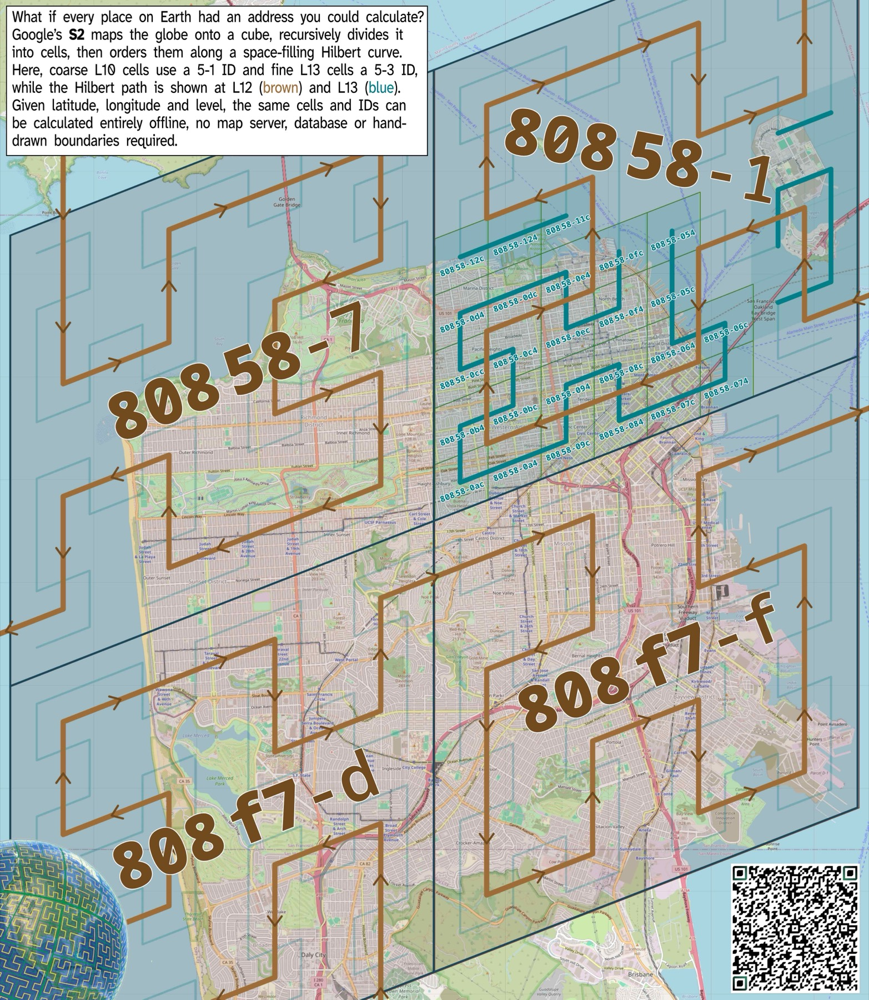

# S2 geographic indexing: style guide

- **Status:** Style guide; normative for how S2 levels, tokens, and displays are used
- **Scope:** Which S2 levels we use, how tokens are written and displayed, and where each form may appear
- **Not in scope:** Changes to any existing mechanism. Implementation sequencing and the cross-artefact tagging contract live in [s2-geographic-indexing-plan](../../plans/s2-geographic-indexing-plan.md)
- **Related:** [Geometry-prior service](geometry-prior-service.md), [ground plane extraction](ground-plane-extraction.md), [GPS ethernet parsing](gps-ethernet-parsing.md)
- **S2 reference:** [S2 Cells developer guide](https://s2geometry.io/devguide/s2cell_hierarchy)

## The S2 world over San Francisco

[](s2-10-sf.jpg)

Read this first. Every convention in this guide is visible in one picture.

- The four large brown labels are **L10 cells** in family display: `80858-1`,
  `80858-7`, `808f7-d`, `808f7-f`. That is the **5+1** form.
- The small blue labels inside `80858-1` are **L13 cells**: `80858-12c`,
  `80858-0e4`, `80858-054` and their neighbours. That is the **5+3** form.
- The brown path is the Hilbert curve at L12; the blue path is L13. Cell
  numbering follows that path, which is why neighbouring cells have adjacent
  IDs and why a parent is never a text prefix operation.
- San Francisco spans **four** L10 cells and two different five-character
  families, `80858` and `808f7`. A single city is not one cell, and the family
  prefix is not a region.

The image is generated by [`tools/s2-hilbert`](../../../tools/s2-hilbert/README.md).

## Quick reference

|                 | L10, coarse                                  | L13, fine                                            |
| --------------- | -------------------------------------------- | ---------------------------------------------------- |
| Canonical token | `808581`, 6 hex chars                        | `80858004`, 8 hex chars                              |
| Family display  | `80858-1`, **5+1**                           | `80858-004`, **5+3**                                 |
| Derived by      | `Parent(10)` from the L13 CellID             | Calculated from the WGS84 position                   |
| Used for        | Filesystem paths, filenames, coarse browsing | Database index, aggregation, joins, interoperability |
| Machine field   | `s2_l10_token`                               | `s2_l13_token`                                       |

| Do                                               | Do not                                                |
| ------------------------------------------------ | ----------------------------------------------------- |
| Store the canonical token                        | Store the family display                              |
| Write `80858-1` in prose, logs, CLI and UI       | Write `80858-1` in a filename, key, or API value      |
| Get a parent with `cell.Parent(level)`           | Get a parent by truncating text                       |
| Name fields for level and representation         | Name fields for character counts                      |
| Keep the WGS84 fix as the authoritative position | Treat an S2 cell as an identity for a site or session |

The hyphen is presentation only. Removing it recovers the canonical token.

## Levels

velocity.report uses Google S2 Geometry for geographic partitioning, at two
fixed levels:

```text
WGS84 position
        │
        ▼
     S2 L13
fine geographic partition
database / analytics / interoperability
        │
        ▼ Parent(10)
     S2 L10
coarse geographic partition
filesystem / coarse browsing
```

The raw WGS84 fix remains the authoritative physical position measurement at
the sensor and geometry boundary. S2 indexes that measurement; it does not
reduce the precision of captured or exported geometry.

S2 L13 is the canonical fine partition for database indexing, aggregation,
joins, lookups, and external dataset interoperability. L13 was chosen in part
for deliberate interoperability with published S2 L13 datasets and
methodologies used by Waymo and Valgo HumanBaselines. That is an
interoperability choice, not a claim that Waymo defines an industry standard.

S2 L10 is the canonical coarse partition for filesystem layout, filenames,
path prefixes, and human-oriented regional browsing. Code should calculate L13
from the WGS84 position and derive L10 from that CellID. It must not independently
persist competing calculations of the two levels.

## How S2 positions and numbers cells

The official [S2 Cells developer
guide](https://s2geometry.io/devguide/s2cell_hierarchy) is the normative
background for the hierarchy and CellID concepts summarised here.

### From a WGS84 position to a spherical cell

S2 starts with the six faces of a cube, projects them onto the unit sphere, and
recursively divides every cell into four children. Level 0 therefore has six
face cells; level 30 contains the leaf cells. On the sphere, each cell is a
quadrilateral bounded by four geodesic edges rather than an axis-aligned map
rectangle.

The conceptual positioning pipeline is:

```text
WGS84 position
    → point on the unit sphere
    → one of six cube faces
    → position within that face
    → leaf-cell position in the face grid
    → S2 CellID at the requested level
```

The intermediate face-grid systems are implementation details owned by S2.
Application code should give the library a WGS84-derived spherical point and
request the required level; it should not reproduce the cube projection or
Hilbert traversal.

The original WGS84 fix can lie anywhere inside the selected cell. The CellID
represents the centre position of that cell along the S2 curve, so converting a
fix to L13 intentionally yields a regional index rather than another encoding
of the precise measurement.

### Hilbert ordering, position, and level

Within each cube face, S2 uses a Hilbert space-filling curve. The six face
curves are rotated and reflected as necessary and joined into one continuous
loop over the sphere. Each subdivision selects one of four children in curve
order, contributing two hierarchy/address bits. This ordering gives useful
locality for indexes and ordered scans: CellIDs that are numerically close
identify cells that are geographically close. The converse is not guaranteed,
particularly across face, cell, or curve boundaries, so numeric or lexical
token distance must never be used as a geographic distance test.

At level `L`, the 64-bit CellID has this conceptual structure:

```text
[3-bit face] [2-bit child] repeated L times [1 marker bit] [zero padding]
```

The face and child bits locate the cell along the S2 curve. The lowest set bit
is the level marker: its position identifies the subdivision level and makes
cell centres at different levels distinct. Moving to a parent changes the
level marker and preserves the appropriate face/Hilbert address bits. This is
why hierarchy belongs to `CellID.Parent(level)`, containment, and child
operations, not token slicing.

For velocity.report this means:

- L13 identifies the fine region containing the WGS84 measurement; it does not
  replace or round that measurement.
- L10 is the S2 parent region containing that L13 cell, obtained with
  `Parent(10)`.
- Sorted CellIDs may improve storage locality, but nearest-cell and distance
  queries must use S2 spatial operations.
- A canonical hexadecimal token serialises the CellID; it is not a readable
  sequence of cube-face or child selections.

### Historical artefact: superseded coordinate-string addressing

Earlier plans proposed truncating or rounding latitude/longitude into
geographic IDs, database buckets, and path names. That approach is retained
here only as a record of the rejected design. From this decision onward, active
plans must use canonical S2 L13 for fine geographic identity and derive L10
with `Parent(10)` for coarse grouping. They must not repeat the legacy terms,
fields, flags, filenames, or precision-based partition design.

Every new plan that introduces geographic identity, persistence, lookup, or
filesystem layout must cite this decision and use S2. WGS84 may appear in an
active plan only as a precise measurement or geometry reference, never as a
parallel identifier or partition scheme.

## Geographic cells are not operational identities

An S2 cell is an orthogonal geographic index. It is not a site, intersection,
road, sensor, deployment, or survey session:

```text
geographic cell ≠ physical site ≠ sensor deployment ≠ survey/session
```

One L13 cell can contain several roads and intersections, sensors in different
positions or directions, repeated deployments, and many survey sessions.
Existing or future identifiers for those entities must remain distinct from
the S2 CellID.

## CellID, canonical token, and family display

These terms describe different things:

```text
S2 hierarchy
    determined by CellID operations such as Parent()

canonical token
    standard S2 serialisation of the 64-bit CellID as hexadecimal,
    with trailing zeroes removed

family display
    velocity.report human-readable presentation of a canonical token,
    with one hyphen at the configured family boundary

scan cue
    non-text UI spacing inside the rendered family prefix; visual only

family prefix
    a visual aid for a specified level relationship; not an S2 CellID
```

These are the normative names in prose, UI specifications, and future
implementation symbols. They describe purpose rather than character counts.
The family display and scan cue are derived presentation, never additional
stored fields or identifiers.

Machine fields include both the S2 level and representation: use
`s2_l13_token` for the fine token and, only where materialising the derived
coarse value is necessary, `s2_l10_token`. Presentation APIs use
`family_display` and `scan_cue`. Names must describe purpose and S2 level,
never character counts or visual segment lengths.

For the selected levels, canonical tokens have these lengths:

| Level | Canonical token length | Example    |
| ----- | ---------------------- | ---------- |
| L10   | 6 hexadecimal chars    | `808581`   |
| L13   | 8 hexadecimal chars    | `80858004` |

The primary velocity.report family display groups the selected L10/L13 family
with one hyphen:

```text
L10 canonical:  808581
L10 family display:  80858-1

L13 canonical:       80858004
L13 family display:  80858-004

family prefix:  80858
```

`80858` is not an L10 ID, and one such family can contain several L10 cells.
The sample pair is a real parent/child relationship, but it illustrates the
family display rather than a calculation technique: the L13 cell's L10 parent
still comes only from `Parent(10)`. The hyphen is presentation only; removing
it recovers the canonical token. Only the canonical token is an identifier.
Family displays may appear in logs, UI, and other human-facing text, but not as
database keys, S2 interoperability values, or machine-readable filenames.

### Scan-cued UI rendering

The UI may make the family prefix easier to scan by inserting a small visual
gap after its first three hexadecimal characters. This is the **scan cue**. It
does not create another token format or another identifier. The gap should be
narrower than an ordinary word space: enough to guide the eye without looking
like a second delimiter.

| Name                             | L10 example           | L13 example             |
| -------------------------------- | --------------------- | ----------------------- |
| Canonical token                  | `808581`              | `80858004`              |
| Family display                   | `80858-1`             | `80858-004`             |
| Scan-cued rendering illustration | `808[visual gap]58-1` | `808[visual gap]58-004` |
| Selected or copied text          | `80858-1`             | `80858-004`             |

The bracketed wording above documents where pixels separate; it is not literal
UI text. Implement the scan cue with layout or styling outside the text value.
Do not insert a regular space, non-breaking space, thin space, hair space, or
any other Unicode character. The scan cue must contribute no character to
selection, clipboard data, accessibility names, search values, input, logs, or
serialised output. Human-facing text exposes the family display without the
cue; machine serialisation exposes the canonical token. A plain-text display
fallback therefore remains `80858-1` or `80858-004`.

Human input may accept either the canonical token or the family display, then
remove the single presentation hyphen and validate the canonical token. It must
never persist the family display, and the scan cue can never occur in input.

The scan cue is standardised only for the primary L10/L13 family display. It
has no S2 hierarchy meaning and must not be applied blindly to diagnostics for
other levels.

## The five-character prefix is specific to L10 → L13

An S2 level `L` contributes:

```text
3 face bits + 2 × L hierarchy/address bits
```

Only complete hexadecimal nibbles wholly inside shared hierarchy bits are a
guaranteed lexical prefix. The level-marker bit may occupy part of the final
nibble of a canonical token.

| Level | Hierarchy bits | Complete shared bits | Own-level prefix chars |
| ----- | -------------- | -------------------- | ---------------------- |
| L8    | 3 + 2×8 = 19   | 16                   | 4                      |
| L10   | 3 + 2×10 = 23  | 20                   | 5                      |

Consequently, the guaranteed common prefixes for the relationships relevant to
this design are:

| Relationship | Guaranteed common prefix |
| ------------ | ------------------------ |
| L8 → L10     | 4 hexadecimal characters |
| L8 → L13     | 4 hexadecimal characters |
| L10 → L13    | 5 hexadecimal characters |

The five-character family is useful because velocity.report deliberately pairs
L10 with L13. It is not a general property of S2 tokens. A family-display
formatter for other levels must be level- and context-aware rather than
inserting a hyphen after five characters. For example:

```text
canonical L8:       80859
L8 family display:  8085-9

canonical L10:       808581
L10 family display:  80858-1

canonical L13:       80858004
L13 family display:  80858-004    # actual descendant of 808581
```

## Canonical tokens are not lexical hierarchy paths

The token contains Hilbert-curve hierarchy/address bits and a level-marker bit.
Computing a parent is therefore not equivalent to truncating hexadecimal text.
Real L10 cells can have these L8 parents:

```text
L10 family display   L8 parent family display
80858-1           →  8085-9
80858-7           →  8085-9

808f7-d           →  808f-7
808f7-f           →  808f-7
```

The second pair happens to resemble lexical truncation; the first does not.
Both follow S2 semantics.

Future hierarchy code must never determine a parent by truncating a token,
extracting a prefix, adding or removing hexadecimal characters, or manipulating
the family display. It must operate on an S2 CellID. In Go, that operation is
`parent := cell.Parent(level)`.

Formatting or parsing a hyphen is allowed only at the presentation boundary.
It must not participate in hierarchy, containment, joins, or partition lookup.

## Persistence and filesystem rules

- Persist canonical L13 where a geographic index is required, alongside the
  precise WGS84 position where the physical measurement is required.
- Derive the L10 parent from L13 using CellID semantics.
- Prefer canonical L10 tokens for coarse filesystem directories and canonical
  L13 tokens for fine files or records beneath them. The level must be explicit
  in the surrounding schema or path contract.
- Use family displays only in human-facing output. A UI may add the non-text
  scan cue, but logs and CLI output remain plain family-display text.
- Do not turn shortened WGS84 values into identifiers or directory names.

## Implementation

This guide is deliberately silent on how any of it gets built. The cross-artefact
tagging contract, the `pcap-split` and VRLOG changes, the database columns, and
the ordered implementation sequence live in
[s2-geographic-indexing-plan](../../plans/s2-geographic-indexing-plan.md).

Nothing in this guide asks for an existing mechanism to change. It fixes the
vocabulary and the formatting so that when those mechanisms are built, they are
built consistently.
