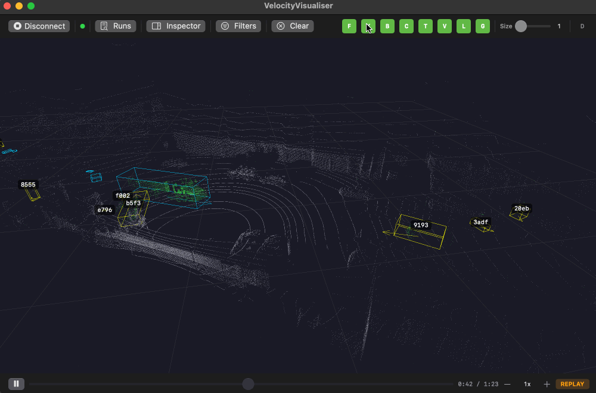

# LiDAR Data Layer Model (Six Layers)

## Purpose

A single concise layer model for LiDAR data in velocity.report. OSI is only a reference point; this model uses six practical layers that match current implementation and future AV compatibility work.

## The six layers

| Layer        | Label      | Scope                                              | Typical forms                                                                                                          |
| ------------ | ---------- | -------------------------------------------------- | ---------------------------------------------------------------------------------------------------------------------- |
| L1 (lowest)  | Packets    | Sensor-wire transport and capture                  | Hesai UDP payloads, PCAP packets                                                                                       |
| L2           | Frames     | Time-coherent frame assembly and geometry exports  | `PointPolar`, `LiDARFrame`, Cartesian points, ASC/LidarView export feed                                                |
| L3           | Grid       | Background/foreground separation state             | `BackgroundGrid`, ring/azimuth bins, foreground mask                                                                   |
| L4           | Perception | Per-frame object primitives and measurements       | Clusters and observations (`WorldCluster`, `TrackObservation`), ground plane surface model (`GroundSurface` interface) |
| L5           | Tracks     | Multi-frame identity and motion continuity         | `TrackedObject`, `TrackSet`                                                                                            |
| L6 (highest) | Objects    | Semantic object interpretation and dataset mapping | Local classes (`car`, `pedestrian`, `bird`, `other`) and AV taxonomy mapping                                           |

## Artefact placement in this model

- Sensor packets → **L1 Packets**
- Frames and Cartesian representations → **L2 Frames**
- Background/foreground grid → **L3 Grid**
- Clusters and observations → **L4 Perception**
- Ground plane surface model → **L4 Perception** (non-point-based `GroundSurface` interface)
- Vector scene map → **L4 Perception** (polygon features for ground, structures, volumes; derived from ground plane; see `vector-scene-map.md`)
- Tracks → **L5 Tracks**
- Objects/classes → **L6 Objects**
- VRLOG recordings span **L2-L5** (frame bundles, perception outputs, tracks)
- LidarView exports primarily sit at **L2** (frame/geometry view)

## Visualiser

The macOS VelocityVisualiser renders each layer simultaneously in a single 3D Metal view, making the full pipeline visible at a glance. The screenshot below (kirk0.pcapng at 0:35) shows L3 foreground extraction, L4 DBSCAN clustering, and L5 track promotion all active at once:



### What each colour represents

| Visual element         | Colour                 | Layer         | Meaning                                                                                                                                                                                                                                     |
| ---------------------- | ---------------------- | ------------- | ------------------------------------------------------------------------------------------------------------------------------------------------------------------------------------------------------------------------------------------- |
| Background points      | **Grey-blue**          | L3 Grid       | Points classified as static scenery by the background model. The EMA-based grid learns per-cell range baselines; points within the closeness threshold are suppressed from further processing.                                              |
| Foreground points      | **Green**              | L3 Grid       | Points that diverge from the learned background — potential moving objects. These are the _only_ points passed to DBSCAN.                                                                                                                   |
| Ground points          | **Brown/tan**          | L4 Perception | Points classified as ground surface by the height-band filter (default band: −2.8 m to +1.5 m relative to sensor).                                                                                                                          |
| Cluster boxes          | **Cyan**               | L4 Perception | DBSCAN cluster bounding boxes. Each cyan box is a single-frame spatial grouping of foreground points (ε = 0.8 m, minPts = 5 by default). These are _observations_ — no identity or history yet. Oriented (OBB) when PCA provides a heading. |
| Cluster heading arrows | **Cyan**               | L4 Perception | PCA-derived heading from the cluster's oriented bounding box. Only rendered when OBB data is present.                                                                                                                                       |
| Tentative track boxes  | **Yellow**             | L5 Tracks     | A DBSCAN cluster that has been associated with a Kalman-filtered track but has not yet reached the `hits_to_confirm` threshold (default: 4 consecutive observations). The tracker is _watching_ this object but has not committed to it.    |
| Confirmed track boxes  | **Green**              | L5 Tracks     | A track that has accumulated enough consistent observations to be confirmed. These are the high-confidence moving objects — vehicles, pedestrians, cyclists. The Kalman filter provides smoothed position and velocity.                     |
| Deleted track boxes    | **Red**                | L5 Tracks     | A track that has exceeded `max_misses` (tentative) or `max_misses_confirmed` without a matching observation. Fades out over the grace period.                                                                                               |
| Trail lines            | **Green** (fading)     | L5 Tracks     | Historical position polyline for confirmed tracks. Alpha fades linearly from transparent (oldest) to opaque (newest), showing the track's recent trajectory.                                                                                |
| Heading arrows         | **Track state colour** | L5 Tracks     | Velocity-derived heading for tracks (green for confirmed, yellow for tentative). Prefers Kalman velocity heading over PCA/OBB heading.                                                                                                      |
| Track ID labels        | **White**              | L5 Tracks     | Short hex identifier (e.g. `4269`, `7cc0`) projected to screen coordinates above each track box.                                                                                                                                            |
| Class labels           | **Yellow**             | L6 Objects    | Classification label (e.g. `car`, `pedestrian`) shown below the track ID once the classifier has enough observations.                                                                                                                       |

### Pipeline flow — from grey points to green boxes

The processing pipeline runs once per LiDAR frame (~10 Hz for Hesai Pandar40P):

```
L1  UDP packets arrive from sensor (or PCAP replay)
     │
L2  Frame assembly: 40-ring polar points → time-coherent LiDARFrame
     │
L3  Background grid: each point tested against per-cell EMA baseline
     │  ├─ within threshold → grey-blue background point (suppressed)
     │  └─ outside threshold → green foreground point (passed on)
     │
L4  Height-band filter → voxel downsampling → DBSCAN clustering
     │  └─ each cluster → cyan box with OBB heading
     │
L5  Hungarian assignment: clusters matched to existing Kalman tracks
     │  ├─ matched + below hits_to_confirm → yellow tentative box
     │  ├─ matched + above hits_to_confirm → green confirmed box
     │  ├─ unmatched cluster → new tentative track (yellow)
     │  └─ unmatched track → increment miss counter (→ red/deleted)
     │
L6  Classification: confirmed tracks accumulate features → class label
```

### Background settling and the 30-second warmup

When a new data source starts (live sensor or PCAP replay), the L3 background grid must _settle_ before foreground extraction begins. During the settling period (default: **100 frames AND 30 seconds**, whichever is longer):

- All points are used to seed per-cell EMA range baselines
- The foreground mask is **suppressed** — no points reach DBSCAN
- The visualiser shows only grey-blue background points (no cyan/yellow/green boxes)

After settling completes, the grid identifies _regions_ and persists both grid cells and region data to SQLite. On subsequent replays of the same PCAP file, the grid restores from the database in ~10 frames, skipping the 30-second warmup entirely.

### Toggle buttons in the toolbar

The visualiser toolbar provides single-key toggles for each visual layer:

| Button | Key | Controls                                 |
| ------ | --- | ---------------------------------------- |
| **F**  | F   | Foreground points (green)                |
| **K**  | K   | Background points (grey-blue)            |
| **B**  | B   | Bounding boxes (all track/cluster boxes) |
| **C**  | C   | Cluster boxes (cyan, L4)                 |
| **T**  | T   | Track boxes (yellow/green/red, L5)       |
| **V**  | V   | Velocity vectors / heading arrows        |
| **L**  | L   | Labels (track ID + class)                |
| **G**  | G   | Ground grid overlay                      |

## Current repository alignment

| Layer         | Canonical package              | Key files                                                                                                                 |
| ------------- | ------------------------------ | ------------------------------------------------------------------------------------------------------------------------- |
| L1 Packets    | `internal/lidar/l1packets/`    | Facade over `network/` (UDP/PCAP) and `parse/` (Pandar40P)                                                                |
| L2 Frames     | `internal/lidar/l2frames/`     | `frame_builder.go`, `export.go`, `geometry.go`                                                                            |
| L3 Grid       | `internal/lidar/l3grid/`       | `background.go`, `background_persistence.go`, `background_export.go`, `background_drift.go`, `foreground.go`, `config.go` |
| L4 Perception | `internal/lidar/l4perception/` | `cluster.go`, `dbscan_clusterer.go`, `ground.go`, `voxel.go`, `obb.go`, ground plane (planned)                            |
| L5 Tracks     | `internal/lidar/l5tracks/`     | `tracking.go`, `hungarian.go`, `tracker_interface.go`                                                                     |
| L6 Objects    | `internal/lidar/l6objects/`    | `classification.go`, `features.go`, `quality.go`, `comparison.go`                                                         |

Cross-cutting packages:

| Package                          | Purpose                                                                |
| -------------------------------- | ---------------------------------------------------------------------- |
| `internal/lidar/pipeline/`       | Orchestration (stage interfaces)                                       |
| `internal/lidar/storage/sqlite/` | DB repositories (scene, track, evaluation, sweep, analysis run stores) |
| `internal/lidar/adapters/`       | Transport and IO boundaries                                            |

Backward-compatible type aliases remain in the parent `internal/lidar/` package so existing callers continue to work.

## AV compatibility note

This six-layer model keeps traffic monitoring simple while preserving a clean upgrade path: AV 28-class compatibility is treated as an **L6 Objects** concern, without forcing AV complexity into packet/frame/grid/tracking layers.
