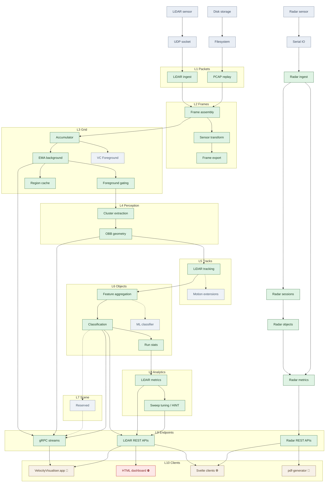
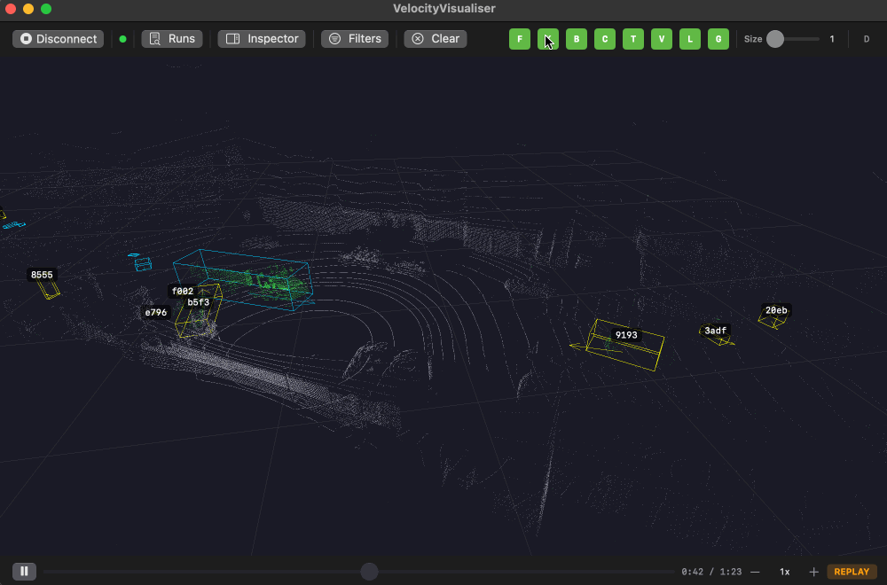

# LiDAR Data Layer Model (Ten Layers)

**Status:** Canonical reference — layer numbers are locked for codebase stability from v0.5.0 onwards.
**Last updated:** 2026-03-11

## Purpose

A single authoritative layer model for LiDAR data processing in velocity.report. The model defines ten layers — six implemented (L1–L6), one planned (L7), and three structurally present but being formalised (L8–L10). Layer numbers are permanent identifiers: once assigned, a layer number never changes meaning, even if the implementation evolves over years.

The design draws on established LiDAR/AV processing pipeline literature (see [§ Algorithm heritage](#algorithm-heritage-and-literature-alignment)) but is deliberately practical rather than academic. OSI is only a reference point; these layers match real code packages and real data flow.

## Stability guarantee

**Layer numbers L1–L10 are frozen from v0.5.0.** Future capabilities extend existing layers or occupy reserved slots — they never renumber established layers. This ensures package names (`l1packets/`, `l2frames/`, … `l7scene/`) remain stable across years of evolution.

## The ten layers

| Layer | Label          | Scope                                                                                    | Typical forms                                                                             | Status         |
| ----- | -------------- | ---------------------------------------------------------------------------------------- | ----------------------------------------------------------------------------------------- | -------------- |
| L1    | **Packets**    | Sensor-wire transport and capture                                                        | Hesai UDP payloads, PCAP packets, radar serial frames                                     | ✅ Implemented |
| L2    | **Frames**     | Time-coherent frame assembly and geometry exports                                        | `PointPolar`, `LiDARFrame`, Cartesian points, ASC/LidarView export                        | ✅ Implemented |
| L3    | **Grid**       | Background/foreground separation state                                                   | `BackgroundGrid`, ring/azimuth bins, foreground mask                                      | ✅ Implemented |
| L4    | **Perception** | Per-frame object primitives and measurements                                             | `WorldCluster`, `TrackObservation`, ground plane (`GroundSurface`), vector scene geometry | ✅ Implemented |
| L5    | **Tracks**     | Multi-frame identity and motion continuity                                               | `TrackedObject`, `TrackSet`                                                               | ✅ Implemented |
| L6    | **Objects**    | Semantic object interpretation and dataset mapping                                       | Local classes (`car`, `pedestrian`, `bird`, `other`), AV taxonomy mapping                 | ✅ Implemented |
| L7    | **Scene**      | Persistent canonical world model — accumulated geometry, priors, and multi-sensor fusion | `SceneFeature`, `CanonicalObject`, vector polygons, OSM priors, multi-sensor merged scene | 📋 Planned     |
| L8    | **Analytics**  | Canonical traffic metrics, run comparison, scoring                                       | `RunStatistics`, speed percentiles, temporal IoU, parameter diffs                         | ✅ Implemented |
| L9    | **Endpoints**  | Server-side payload shaping, gRPC streams, dashboards, and report APIs                   | gRPC `FrameUpdate`, chart view-models, report/download payloads                           | ✅ Implemented |
| L10   | **Clients**    | Downstream rendering consumers (Python, Svelte, Swift; deprecated Go-embedded dashboard) | Browser (Svelte), native app (Swift/VeloVis), PDF generator (Python)                      | ✅ Implemented |

## Canonical L1-L10 Stack Reference

The table above is the canonical L1-L10 stack reference. This section remains
as the stable anchor for summaries that refer to the locked layer ordering.
The concept chart below is the primary visual reference.

## Segmented Concept Status Chart

This is the primary visual breakdown for the layer model. Green nodes show
implemented components; grey nodes mark planned extensions with no runtime
code yet. L7 remains an explicit empty slot so the canonical L1-L10 stack
stays visually fixed.


```mermaid
flowchart TB
    classDef implemented fill:#dff3e4,stroke:#2f6b3b,color:#183a1f;
    classDef partial fill:#fff2cc,stroke:#9a6b16,color:#4d3600;
    classDef client fill:#f7f1e8,stroke:#8b6f47,color:#4e3b24;
    classDef gap fill:#eef2f7,stroke:#7b8794,color:#425466;
    classDef infra fill:#e9eef5,stroke:#6b7c93,color:#334155;
    classDef deprecated fill:#fde8e8,stroke:#b91c1c,color:#7f1d1d;

    subgraph P0_sensors[" "]
        direction LR
        P0c["LiDAR sensor"]
        P0b["Disk storage"]
    end

    P0a["Radar sensor"]

    subgraph P0_io[" "]
        direction LR
        P0f["UDP socket"]
        P0e["Filesystem"]
    end

    P0d["Serial IO"]

    subgraph L1sub["L1 Packets"]
        direction LR
        L1b["LiDAR ingest"]
        L1c["PCAP replay"]
    end

    subgraph L1[" "]
        direction LR
        L1sub
        L1a["Radar ingest"]
    end

    subgraph L2["L2 Frames"]
        direction TB
        L2a["Frame assembly"]
        L2b["Sensor transform"]
        L2c["Frame export"]
    end

    subgraph L3["L3 Grid"]
        direction LR
        L3a["Accumulator"]
        L3b["EMA background"]
        L3c["Foreground gating"]
        L3d["Region cache"]
        L3f["VC Foreground"]
    end

    subgraph L4["L4 Perception"]
        direction TB
        L4ad["Cluster extraction"]
        L4e["OBB geometry"]
    end

    subgraph L5[" "]
        L5a["Radar sessions"]
        L5sub
    end


    subgraph L5sub["L5 Tracks"]
        direction TB
        L5bg["LiDAR tracking"]
        L5h["Motion extensions"]
    end

    subgraph L6["L6 Objects"]
        direction LR
        L6a["Feature aggregation"]
        L6b["Classification"]
        L6c["Run stats"]
        L6e["ML classifier"]
    end

    L6f["Radar objects"]

    subgraph L7["L7 Scene"]
        direction TB
        L7a["Reserved"]
    end

    subgraph L8sub["L8 Analytics"]
        L8b["LiDAR metrics"]
        L8c["Sweep tuning / HINT"]
    end

    subgraph L8[" "]
        direction LR
        L8sub
        L8a["Radar metrics"]
    end

    subgraph L9["L9 Endpoints"]
        direction LR
        L9c["gRPC streams"]
        L9b["LiDAR REST APIs"]
        L9a["Radar REST APIs"]
    end

    subgraph L10["L10 Clients"]
        direction LR
        L10c["VelocityVisualiser.app "]
        L10d["HTML dashboard ⛔"]
        L10b["Svelte clients 🌐"]
        L10a["pdf-generator 🐍"]
    end

    %% ── P0 sensor → IO ──────────────────────────────────
    P0c --> P0f
    P0b --> P0e
    P0a --> P0d
    P0f --> L1b
    P0e --> L1c
    P0d --> L1a

    %% ── L1→L2 main LiDAR path ─────────────────────────
    L1b --> L2a
    L1c --> L2a
    L2a --> L2b
    L2a --> L3a
    L2b --> L2c

    %% ── Radar path (right column) ──────────────────────
    L1a --> L5a
    L5a --> L6f
    L6f --> L8a
    L1a --> L8a

    %% ── L3→L4→L5→L6 LiDAR pipeline ────────────────────
    L3a --> L3b
    L3a --> L3f
    L3b --> L3c
    L3b --> L3d
    L3c --> L4ad
    L4ad --> L4e
    L3b --> L9c
    L4e --> L9c
    L4e --> L5bg
    L7a -.-> L9c
    L6c --> L8b
    L8b --> L8c
    L6b --> L9c
    L6b --> L9b
    L6a --> L6b
    L6b --> L6c
    L6a -.-> L6e
    L6b -.-> L7a
    L5bg --> L6a
    L5bg -.-> L5h

    %% ── L6→L8 stats path ──────────────────────────────

    %% ── Skip edges and endpoints to L9 ─────────────────
    L8b --> L9b
    L8c --> L9b
    L8a --> L9a

    %% ── L9→L10 clients ───────────────────────
    L9c --> L10c
    L9b --> L10c
    L9b --> L10d
    L9b --> L10b
    L9a --> L10b
    L9a --> L10a

    style P0_sensors fill:none,stroke:none,color:transparent
    style P0_io fill:none,stroke:none,color:transparent
    style L1 fill:none,stroke:none,color:transparent
    style L5 fill:none,stroke:none,color:transparent
    style L8 fill:none,stroke:none,color:transparent

    class P0a,P0b,P0c,P0d,P0e,P0f infra;
    class L1a,L1b,L1c,L2a,L2b,L2c,L3a,L3b,L3c,L3d,L4ad,L4e,L5a,L5bg,L6a,L6b,L6c,L6f,L8a,L8b,L8c,L9a,L9b,L9c implemented;
    class L3f,L5h,L6e,L7a gap;
    class L10a,L10b,L10c client;
    class L10d deprecated;
```

**Reading notes**

- **Polar vs Cartesian paths.** The LiDAR tracking path stays in polar
  coordinates through L3 (Accumulator → EMA background → Foreground gating)
  and only moves into world Cartesian at L4ad (Cluster extraction). The
  earlier sensor-space transform in L2b (Sensor transform) is a
  frame/export side path: `AddPointsPolar()` materialises XYZ for
  `LiDARFrame`, ASC, and LidarView use, and the tracking path then
  reconstructs polar points before `ProcessFramePolarWithMask()`.
- **Region cache and settling.** L3d (Region cache) belongs to settling
  control rather than a separate post-grid stage. During warmup, `l3grid`
  can attempt an early region restore from the database after roughly
  10 frames; when settling completes naturally, it identifies regions and
  persists a linked grid-and-region snapshot for later restore.
- **VC Foreground (L3f).** A planned extension that uses
  velocity-consistent foreground extraction within the grid layer, fed
  from the accumulator (L3a). Currently a grey/planned node with no
  runtime code.
- **Radar path.** The radar path now has its own object stage: L1a (Radar
  ingest) → L5a (Radar sessions) → L6f (Radar objects) → L8a (Radar
  metrics). L5a sessionises raw `radar_data` into
  `radar_data_transits` via the transit worker; L6f derives transit-level
  speed, direction, and event metadata; L8a computes histograms,
  percentiles, and report rollups. L8a feeds L9a (Radar REST APIs) which
  serves L10a (pdf-generator) and L10b (Svelte clients).
- **LiDAR tracking (L5bg).** The combined block covers the full tracker:
  L5b/L5d together form the 4-state constant-velocity Kalman tracker
  (predict before association, update after); L5c is Hungarian
  assignment; L5e detects merge/split coherence anomalies; L5f manages
  the birth/confirm/coast/delete lifecycle; L5g computes velocity-trail
  quality metrics. L5h (Motion extensions) is reserved for future
  motion-model upgrades beyond the CV baseline (CA / CTRV / IMM).
- **ML classifier (L6e).** A planned research lane for learned
  classification to complement or replace the current rule-based
  classifier (L6b). Dashed edge from L6a (Feature aggregation) indicates
  the intended data flow.
- **L8 Analytics structure.** The chart splits L8 into two visual groups:
  L8sub contains LiDAR-side analytics (L8b LiDAR metrics → L8c Sweep
  tuning / HINT), while L8a (Radar metrics) sits alongside for the radar
  path. Both feed into L9 endpoints.
- **L9 fan-out.** L9b (LiDAR REST APIs) serves three clients: L10b
  (Svelte clients), L10c (VelocityVisualiser.app), and L10d (HTML
  dashboard ⛔). L9c (gRPC streams) serves L10c exclusively for real-time
  3D visualisation. L9a (Radar REST APIs) serves L10a (pdf-generator) and
  L10b (Svelte clients).
- **L10 clients.** All four L10 nodes are implemented applications:
  L10a is a Python PyLaTeX PDF generator, L10b is a Svelte 5 web app,
  L10c is a native macOS Metal visualiser with gRPC streaming, and L10d
  is a legacy Go-embedded HTML dashboard marked deprecated (⛔).

**Legend**

- Green: implemented
- Grey: reserved layer slot with no runtime implementation yet
- Blue-grey: OS + hardware shown for ingress context only
- Beige: downstream client surfaces (implemented in Python, Svelte, or Swift)
- Red: deprecated — scheduled for removal or replacement
- Solid arrows: implemented code
- Dashed arrows: reference links for future work

## Layered Concept and Literature Status

The ten-layer table above shows where layers live. The concept chart shows
which ideas within those layers are active. This table makes the
paper/concept mapping explicit. The final column points to the nearest
internal design note, maths specification, or implementation plan for that
block.

> **Chart simplification:** In both the concept chart and this table,
> L4a–L4d are shown as a single "Cluster extraction" row (L4ad), and
> L5b–L5g as a single "LiDAR tracking" row (L5bg). Each combined row
> covers the full algorithmic spread of its constituent blocks. Table
> concept names match the chart node labels exactly (e.g. "Accumulator"
> not "Polar grid accumulation").

| Block | Concept                       | Standard                                                                                                                                                                                                                                                                                                                                                                               | Code                                                                                         | ?   | Spec / plan                                                                                                                                                      |
| ----- | ----------------------------- | -------------------------------------------------------------------------------------------------------------------------------------------------------------------------------------------------------------------------------------------------------------------------------------------------------------------------------------------------------------------------------------- | -------------------------------------------------------------------------------------------- | --- | ---------------------------------------------------------------------------------------------------------------------------------------------------------------- |
| L1a   | Radar ingest                  | Serial sensor ingest and telemetry logging patterns                                                                                                                                                                                                                                                                                                                                    | [serialmux/](../../../internal/serialmux/)                                                   | ✅  | [Radar serial spec](../../radar/architecture/serial-configuration-ui.md)                                                                                         |
| L1b   | LiDAR ingest                  | Velodyne HDL convention, ROS `velodyne`, Autoware `nebula`                                                                                                                                                                                                                                                                                                                             | [l1packets/network/listener.go](../../../internal/lidar/l1packets/network/listener.go)       | ✅  | [LiDAR network design](network-configuration.md)                                                                                                                 |
| L1c   | PCAP replay                   | libpcap / tcpdump capture and replay tooling                                                                                                                                                                                                                                                                                                                                           | [l1packets/network/pcap.go](../../../internal/lidar/l1packets/network/pcap.go)               | ✅  | [Sidecar overview](lidar-sidecar-overview.md)                                                                                                                    |
| L2a   | Frame assembly                | RangeNet++, SemanticKITTI temporal framing                                                                                                                                                                                                                                                                                                                                             | [l2frames/frame_builder.go](../../../internal/lidar/l2frames/frame_builder.go)               | ✅  | [Pipeline reference](lidar-pipeline-reference.md)                                                                                                                |
| L2b   | Sensor transform              | Standard LiDAR spherical-to-Cartesian geometry                                                                                                                                                                                                                                                                                                                                         | [l2frames/geometry.go](../../../internal/lidar/l2frames/geometry.go)                         | ✅  | [AV range-image design](av-range-image-format-alignment.md)                                                                                                      |
| L2c   | Frame export (LidarView, ASC) | ASC and point-cloud export conventions                                                                                                                                                                                                                                                                                                                                                 | [l2frames/export.go](../../../internal/lidar/l2frames/export.go)                             | ✅  | [AV range-image design](av-range-image-format-alignment.md)                                                                                                      |
| L3a   | Accumulator                   | Range-image / occupancy-style spatial binning                                                                                                                                                                                                                                                                                                                                          | [l3grid/background.go](../../../internal/lidar/l3grid/background.go)                         | ✅  | [Background-grid maths](../../../data/math/background-grid-settling-maths.md)                                                                                           |
| L3b   | EMA background                | Stauffer-Grimson adaptive background lineage                                                                                                                                                                                                                                                                                                                                           | [l3grid/background.go](../../../internal/lidar/l3grid/background.go)                         | ✅  | [Background-grid maths](../../../data/math/background-grid-settling-maths.md)                                                                                           |
| L3c   | Foreground gating             | Background subtraction and neighbour-confirmation heuristics                                                                                                                                                                                                                                                                                                                           | [l3grid/foreground.go](../../../internal/lidar/l3grid/foreground.go)                         | ✅  | [Background-grid maths](../../../data/math/background-grid-settling-maths.md)                                                                                           |
| L3d   | Region cache                  | Persistent background snapshots and scene-signature restore                                                                                                                                                                                                                                                                                                                            | [l3grid/background_persistence.go](../../../internal/lidar/l3grid/background_persistence.go) | ✅  | [Sidecar overview](lidar-sidecar-overview.md)                                                                                                                    |
| L3f   | VC Foreground                 | Doppler/velocity-consistent foreground extraction                                                                                                                                                                                                                                                                                                                                      | —                                                                                            | 📋  | [Velocity-coherent FG plan](../../plans/lidar-velocity-coherent-foreground-extraction-plan.md)                                                                   |
| L4ad  | Cluster extraction            | **a.** Rigid transforms and homogeneous pose geometry <br> **b.** Ground-plane removal via vertical band gating <br> **c.** PCL `VoxelGrid` downsampling family <br> **d.** DBSCAN with spatial index; auto-subsample above cap                                                                                                                                                        | [l4perception/](../../../internal/lidar/l4perception/)                                       | ✅  | [Foreground-tracking design](foreground-tracking.md), [Ground-plane extraction](ground-plane-extraction.md), [Clustering maths](../../../data/math/clustering-maths.md) |
| L4e   | OBB geometry                  | PCA / OBB fitting; embedded in DBSCAN output builder                                                                                                                                                                                                                                                                                                                                   | [l4perception/obb.go](../../../internal/lidar/l4perception/obb.go)                           | ✅  | [Clustering maths](../../../data/math/clustering-maths.md)                                                                                                              |
| L5a   | Radar sessions                | Temporal event segmentation and transit/session building                                                                                                                                                                                                                                                                                                                               | [db/transit_worker.go](../../../internal/db/transit_worker.go)                               | ✅  | [Transit deduplication](../../radar/architecture/transit-deduplication.md)                                                                                       |
| L5bg  | LiDAR tracking                | **b.** CV predict: X′ = FX, P′ = FPFᵀ + Q <br> **c.** Kuhn Hungarian on Mahalanobis cost matrix <br> **d.** Measurement update with velocity and OBB heading smoothing <br> **e.** Merge/split coherence flags on cluster area deviation <br> **f.** SORT-style birth / confirm / coast / delete lifecycle <br> **g.** Velocity-trail alignment, jitter, capture ratios, fragmentation | [l5tracks/](../../../internal/lidar/l5tracks/)                                               | ✅  | [Tracking maths](../../../data/math/tracking-maths.md)                                                                                                                  |
| L5h   | Motion extensions             | CA / CTRV / IMM multi-model tracking literature                                                                                                                                                                                                                                                                                                                                        | —                                                                                            | 📋  | [Bodies-in-motion plan](../../plans/lidar-bodies-in-motion-plan.md)                                                                                              |
| L6a   | Feature aggregation           | Classical feature engineering for traffic objects                                                                                                                                                                                                                                                                                                                                      | [l6objects/features.go](../../../internal/lidar/l6objects/features.go)                       | ✅  | [Classification maths](../../../data/math/classification-maths.md)                                                                                                      |
| L6b   | Classification                | Local heuristic classifier; KITTI / SemanticKITTI mapping lineage                                                                                                                                                                                                                                                                                                                      | [l6objects/classification.go](../../../internal/lidar/l6objects/classification.go)           | ✅  | [Classification maths](../../../data/math/classification-maths.md)                                                                                                      |
| L6c   | Run stats                     | Experiment and run summarisation patterns                                                                                                                                                                                                                                                                                                                                              | [storage/sqlite/analysis_run.go](../../../internal/lidar/storage/sqlite/analysis_run.go)     | ✅  | [Analysis-run infrastructure](../../plans/lidar-analysis-run-infrastructure-plan.md)                                                                             |
| L6e   | ML classifier                 | Learned classification research lane; KITTI/nuScenes training pipeline                                                                                                                                                                                                                                                                                                                 | —                                                                                            | 📋  | [ML classifier plan](../../plans/lidar-ml-classifier-training-plan.md)                                                                                           |
| L6f   | Radar objects                 | Transit-level speed, direction, and event metadata from sessionised radar data                                                                                                                                                                                                                                                                                                         | [db/transit_controller.go](../../../internal/db/transit_controller.go)                       | ✅  | [Transit deduplication](../../radar/architecture/transit-deduplication.md)                                                                                       |
| L7a   | Reserved                      | HD-map, scene accumulation, OSM prior literature                                                                                                                                                                                                                                                                                                                                       | —                                                                                            | 📋  | [L7 scene plan](../../plans/lidar-l7-scene-plan.md)                                                                                                              |
| L8a   | Radar metrics                 | Traffic histograms, percentiles, report rollups                                                                                                                                                                                                                                                                                                                                        | [db/db.go](../../../internal/db/db.go)                                                       | ✅  | [Speed-percentile plan](../../plans/speed-percentile-aggregation-alignment-plan.md)                                                                              |
| L8b   | LiDAR metrics                 | Traffic engineering reporting and nearest-rank percentiles                                                                                                                                                                                                                                                                                                                             | [monitor/chart_api.go](../../../internal/lidar/monitor/chart_api.go)                         | ✅  | [Speed-percentile plan](../../plans/speed-percentile-aggregation-alignment-plan.md)                                                                              |
| L8c   | Sweep tuning / HINT           | Parameter sweeps and experiment evaluation                                                                                                                                                                                                                                                                                                                                             | [sweep/hint.go](../../../internal/lidar/sweep/hint.go)                                       | ✅  | [Tuning optimisation plan](../../plans/lidar-parameter-tuning-optimisation-plan.md)                                                                              |
| L9a   | Radar REST APIs               | REST / JSON reporting surfaces                                                                                                                                                                                                                                                                                                                                                         | [api/server.go](../../../internal/api/server.go)                                             | ✅  | [Radar networking design](../../radar/architecture/networking.md)                                                                                                |
| L9b   | LiDAR REST APIs               | REST / JSON dashboard, replay, scene, and track APIs                                                                                                                                                                                                                                                                                                                                   | [monitor/](../../../internal/lidar/monitor/)                                                 | ✅  | [L8-L10 refactor plan](../../plans/lidar-l8-analytics-l9-endpoints-l10-clients-plan.md)                                                                          |
| L9c   | gRPC streams                  | gRPC streaming with frame codec, overlay preferences, and replay                                                                                                                                                                                                                                                                                                                       | [visualiser/grpc_server.go](../../../internal/lidar/visualiser/grpc_server.go)               | ✅  | [Visualiser proto plan](../../plans/lidar-visualiser-proto-contract-and-debug-overlay-fixes-plan.md)                                                             |
| L10a  | pdf-generator                 | PyLaTeX report generation with charts, maps, and statistical tables                                                                                                                                                                                                                                                                                                                    | [tools/pdf-generator/](../../../tools/pdf-generator/)                                        | ✅  | [PDF migration plan](../../plans/pdf-go-chart-migration-plan.md)                                                                                                 |
| L10b  | Svelte clients                | Svelte 5 dashboard with site management, radar reports, and LiDAR run views                                                                                                                                                                                                                                                                                                            | [web/](../../../web/)                                                                        | ✅  | [Frontend consolidation plan](../../plans/web-frontend-consolidation-plan.md)                                                                                    |
| L10c  | VelocityVisualiser.app        | Native macOS Metal 3D point-cloud visualisation with gRPC streaming client                                                                                                                                                                                                                                                                                                             | [tools/visualiser-macos/](../../../tools/visualiser-macos/)                                  | ✅  | [Visualiser proto plan](../../plans/lidar-visualiser-proto-contract-and-debug-overlay-fixes-plan.md)                                                             |
| L10d  | HTML dashboard                | Legacy Go-embedded LiDAR monitoring dashboard (`internal/lidar/monitor/`)                                                                                                                                                                                                                                                                                                              | [monitor/html/dashboard.html](../../../internal/lidar/monitor/html/dashboard.html)           | ⛔  | [L8-L10 refactor plan](../../plans/lidar-l8-analytics-l9-endpoints-l10-clients-plan.md)                                                                          |

### Design rationale for ten layers

L1–L6 cover the single-sensor, single-frame-to-object pipeline that is standard in LiDAR processing literature. L7 introduces the critical missing concept: a **persistent world model** that accumulates evidence across frames, tracks, and sensors. L8–L10 handle what happens _after_ the processing pipeline produces results — analysis, server-side formatting, and client rendering.

The decision to place Scene at L7 (rather than above Analytics) reflects data flow: analytics (L8) needs the scene model to contextualise metrics (e.g. "speed at this road segment"), and endpoints (L9) render both scene geometry and analytics results.

## Artefact placement in this model

- Sensor packets → **L1 Packets**
- Frames and Cartesian representations → **L2 Frames**
- Background/foreground grid → **L3 Grid**
- Clusters and observations → **L4 Perception**
- Ground plane surface model → **L4 Perception** (non-point-based `GroundSurface` interface)
- Per-frame vector geometry extraction → **L4 Perception** (polygon features for ground, structures, volumes; see [vector-scene-map.md](vector-scene-map.md))
- Tracks → **L5 Tracks**
- Objects/classes → **L6 Objects**
- Canonical scene model (accumulated geometry, priors, multi-sensor merge) → **L7 Scene**
- OSM priors and external map data → **L7 Scene** (ingested as prior features, refined by observation)
- Run statistics, comparisons, percentiles → **L8 Analytics**
- gRPC streams, chart data, dashboard payloads → **L9 Endpoints**
- Browser, native app, PDF → **L10 Clients**
- VRLOG recordings span **L2–L6** (frame bundles, perception outputs, tracks, objects)
- LidarView exports primarily sit at **L2** (frame/geometry view)

## Visualiser

The macOS VelocityVisualiser renders each layer simultaneously in a single 3D Metal view, making the full pipeline visible at a glance. The screenshot below (kirk0.pcapng at 0:35) shows L3 foreground extraction, L4 DBSCAN clustering, and L5 track promotion all active at once:



### What each colour represents

| Visual element         | Colour                 | Layer         | Meaning                                                                                                                                                                                                                                     |
| ---------------------- | ---------------------- | ------------- | ------------------------------------------------------------------------------------------------------------------------------------------------------------------------------------------------------------------------------------------- |
| Background points      | **Grey-blue**          | L3 Grid       | Points classified as static scenery by the background model. The EMA-based grid learns per-cell range baselines; points within the closeness threshold are suppressed from further processing.                                              |
| Foreground points      | **Green**              | L3 Grid       | Points that diverge from the learned background — potential moving objects. These are the _only_ points passed to DBSCAN.                                                                                                                   |
| Ground points          | **Brown/tan**          | L4 Perception | Points classified as ground surface by the height-band filter (default band: −2.8 m to +1.5 m relative to sensor).                                                                                                                          |
| Cluster boxes          | **Cyan**               | L4 Perception | DBSCAN cluster bounding boxes. Each cyan box is a single-frame spatial grouping of foreground points (ε = 0.8 m, minPts = 5 by default). These are _observations_ — no identity or history yet. Oriented (OBB) when PCA provides a heading. |
| Cluster heading arrows | **Cyan**               | L4 Perception | PCA-derived heading from the cluster's oriented bounding box. Only rendered when OBB data is present.                                                                                                                                       |
| Tentative track boxes  | **Yellow**             | L5 Tracks     | A DBSCAN cluster that has been associated with a Kalman-filtered track but has not yet reached the `hits_to_confirm` threshold (default: 4 consecutive observations). The tracker is _watching_ this object but has not committed to it.    |
| Confirmed track boxes  | **Green**              | L5 Tracks     | A track that has accumulated enough consistent observations to be confirmed. These are the high-confidence moving objects — vehicles, pedestrians, cyclists. The Kalman filter provides smoothed position and velocity.                     |
| Deleted track boxes    | **Red**                | L5 Tracks     | A track that has exceeded `max_misses` (tentative) or `max_misses_confirmed` without a matching observation. Fades out over the grace period.                                                                                               |
| Trail lines            | **Green** (fading)     | L5 Tracks     | Historical position polyline for confirmed tracks. Alpha fades linearly from transparent (oldest) to opaque (newest), showing the track's recent trajectory.                                                                                |
| Heading arrows         | **Track state colour** | L5 Tracks     | Velocity-derived heading for tracks (green for confirmed, yellow for tentative). Prefers Kalman velocity heading over PCA/OBB heading.                                                                                                      |
| Track ID labels        | **White**              | L5 Tracks     | Short hex identifier (e.g. `4269`, `7cc0`) projected to screen coordinates above each track box.                                                                                                                                            |
| Class labels           | **Yellow**             | L6 Objects    | Classification label (e.g. `car`, `pedestrian`) shown below the track ID once the classifier has enough observations.                                                                                                                       |

### Pipeline flow — full ten-layer data flow

The core processing pipeline runs once per LiDAR frame (~10 Hz for Hesai Pandar40P). L7–L10 operate at lower frequencies or on-demand.

```
═══════════════════════════════════════════════════════════════════════════
 SENSOR TIER (per-sensor, real-time, ~10 Hz)
═══════════════════════════════════════════════════════════════════════════

L1  Packets ─── UDP payloads arrive from sensor (or PCAP replay)
 │               Hesai Pandar40P: 40-ring returns, ~700K pts/sec
 │               Radar: serial frames (OmniPreSense OPS243-C)
 │               Future: additional LiDAR/radar on separate ports
 │
L2  Frames ──── Frame assembly: polar points → time-coherent LiDARFrame
 │               40 rings × 1800 azimuth bins → single rotation
 │               Polar → Cartesian coordinate transform
 │               Timestamp alignment, frame sequencing
 │
L3  Grid ────── Background model: per-cell EMA range baseline
 │               Each point tested against learned background
 │  ├── within threshold ──→ background point (suppressed)
 │  └── outside threshold ─→ foreground point (passed on)
 │               Settling: 100 frames + 30s warmup before extraction
 │               Region identification, persistence to SQLite
 │
L4  Perception  Ground removal → voxel downsampling → DBSCAN clustering
 │               Each cluster → OBB with PCA heading
 │               Ground plane tiling → vector polygon extraction
 │               Per-frame, single-sensor observations only
 │
L5  Tracks ──── Hungarian assignment: clusters → Kalman-filtered tracks
 │  ├── matched + hits < threshold ──→ tentative track
 │  ├── matched + hits ≥ threshold ──→ confirmed track
 │  ├── unmatched cluster ───────────→ new tentative track
 │  └── unmatched track ─────────────→ miss counter → deletion
 │               Track lifecycle: tentative → confirmed → deleted
 │               Smoothed position, velocity, heading
 │
L6  Objects ─── Classification: feature accumulation → class label
                 car │ pedestrian │ cyclist │ bird │ other
                 AV taxonomy mapping (28-class compatibility)
                 Per-track quality scoring

═══════════════════════════════════════════════════════════════════════════
 SCENE TIER (multi-frame, multi-sensor, persistent)
═══════════════════════════════════════════════════════════════════════════

L7  Scene ───── Canonical world model
 │               Static geometry: ground polygons, structures, volumes
 │               Dynamic objects: canonical vehicles (merged tracks)
 │               Evidence accumulation across frames and sensors
 │               OSM/map priors: S3DB buildings, road geometry
 │               Multi-sensor fusion: unified coordinate frame
 │               Uncertainty bounds, edit history, provenance

═══════════════════════════════════════════════════════════════════════════
 CONSUMPTION TIER (on-demand, variable frequency)
═══════════════════════════════════════════════════════════════════════════

L8  Analytics ─ Traffic metrics, run comparison, scoring
 │               Speed percentiles, volume counts, temporal IoU
 │               Scene-contextualised statistics ("speed on Main St")
 │               Parameter sweep evaluation, run diffing
 │
L9  Endpoints ─ Server-side payload shaping
 │               gRPC FrameUpdate stream to VelocityVisualiser
 │               ECharts data, chart view-models, debug overlays
 │               Dashboard API responses
 │
L10 Clients ─── Downstream renderers (no Go package)
                 Browser: Svelte web frontend
                 Native: Swift/Metal VelocityVisualiser
                 Reports: Python PDF generator
```

### Simplified single-sensor flow (current implementation)

The current single-sensor, single-frame pipeline:

```
L1  UDP packets arrive from sensor (or PCAP replay)
     │
L2  Frame assembly: 40-ring polar points → time-coherent LiDARFrame
     │
L3  Background grid: each point tested against per-cell EMA baseline
     │  ├─ within threshold → grey-blue background point (suppressed)
     │  └─ outside threshold → green foreground point (passed on)
     │
L4  Height-band filter → voxel downsampling → DBSCAN clustering
     │  └─ each cluster → cyan box with OBB heading
     │
L5  Hungarian assignment: clusters matched to existing Kalman tracks
     │  ├─ matched + below hits_to_confirm → yellow tentative box
     │  ├─ matched + above hits_to_confirm → green confirmed box
     │  ├─ unmatched cluster → new tentative track (yellow)
     │  └─ unmatched track → increment miss counter (→ red/deleted)
     │
L6  Classification: confirmed tracks accumulate features → class label
```

### Background settling and the 30-second warmup

When a new data source starts (live sensor or PCAP replay), the L3 background grid must _settle_ before foreground extraction begins. During the settling period (default: **100 frames AND 30 seconds**, whichever is longer):

- All points are used to seed per-cell EMA range baselines
- The foreground mask is **suppressed** — no points reach DBSCAN
- The visualiser shows only grey-blue background points (no cyan/yellow/green boxes)

After settling completes, the grid identifies _regions_ and persists both grid cells and region data to SQLite. On subsequent replays of the same PCAP file, the grid restores from the database in ~10 frames, skipping the 30-second warmup entirely.

### Toggle buttons in the toolbar

The visualiser toolbar provides single-key toggles for each visual layer:

| Button | Key | Controls                                 |
| ------ | --- | ---------------------------------------- |
| **F**  | F   | Foreground points (green)                |
| **K**  | K   | Background points (grey-blue)            |
| **B**  | B   | Bounding boxes (all track/cluster boxes) |
| **C**  | C   | Cluster boxes (cyan, L4)                 |
| **T**  | T   | Track boxes (yellow/green/red, L5)       |
| **V**  | V   | Velocity vectors / heading arrows        |
| **L**  | L   | Labels (track ID + class)                |
| **G**  | G   | Ground grid overlay                      |

## Current repository alignment

| Layer         | Canonical package              | Key files                                                                                                                                                   | Status |
| ------------- | ------------------------------ | ----------------------------------------------------------------------------------------------------------------------------------------------------------- | ------ |
| L1 Packets    | `internal/lidar/l1packets/`    | Facade over `network/` (UDP/PCAP) and `parse/` (Pandar40P)                                                                                                  | ✅     |
| L2 Frames     | `internal/lidar/l2frames/`     | `frame_builder.go`, `types.go`, `export.go`, `geometry.go`                                                                                                  | ✅     |
| L3 Grid       | `internal/lidar/l3grid/`       | `background.go`, `background_persistence.go`, `background_export.go`, `background_drift.go`, `foreground.go`, `config.go`                                   | ✅     |
| L4 Perception | `internal/lidar/l4perception/` | `cluster.go`, `dbscan_clusterer.go`, `ground.go`, `voxel.go`, `obb.go`, ground plane (planned)                                                              | ✅     |
| L5 Tracks     | `internal/lidar/l5tracks/`     | `tracking.go`, `hungarian.go`, `tracker_interface.go`                                                                                                       | ✅     |
| L6 Objects    | `internal/lidar/l6objects/`    | `classification.go`, `features.go`, `quality.go`, `comparison.go`                                                                                           | ✅     |
| L7 Scene      | `internal/lidar/l7scene/`      | _To be created_ — canonical scene model, priors ingestion, multi-sensor merge                                                                               | 📋     |
| L8 Analytics  | `internal/lidar/l8analytics/`  | _Canonical package to be created — existing analytics logic currently in `l6objects/quality.go`, `storage/sqlite/analysis_run*.go`, `monitor/scene_api.go`_ | 🔄     |
| L9 Endpoints  | `internal/lidar/l9endpoints/`  | _Rename from `internal/lidar/visualiser/`_ — `adapter.go`, `frame_codec.go`, `grpc_server.go`, `publisher.go`                                               | 🔄     |
| L10 Clients   | _(no Go package)_              | `web/` (Svelte), `tools/visualiser-macos/` (Swift), `tools/pdf-generator/` (Python)                                                                         | 📄     |

Cross-cutting packages:

| Package                          | Purpose                                                                      |
| -------------------------------- | ---------------------------------------------------------------------------- |
| `internal/lidar/pipeline/`       | Orchestration (stage interfaces)                                             |
| `internal/lidar/storage/sqlite/` | DB repositories (scene, track, evaluation, sweep, analysis run stores)       |
| `internal/lidar/adapters/`       | Transport and IO boundaries                                                  |
| `internal/lidar/monitor/`        | Infrastructure monitoring (to be decomposed: analytics → L8, endpoints → L9) |
| `internal/lidar/sweep/`          | Parameter sweep and auto-tuning                                              |

Backward-compatible type aliases remain in the parent `internal/lidar/` package so existing callers continue to work.

### Layer dependency rule

Each layer package may only import from lower-numbered layers — never upward or sideways. For example: L2 may import L1 (for return types); L3 may import L1–L2; L4 may import L1–L3; and so on. Cross-cutting packages (`pipeline/`, `storage/`, `adapters/`) are exempt.

**Former violations (✅ resolved):** L1–L3 files previously imported `PointPolar`, `Point`, and `SphericalToCartesian` from L4. These sensor-frame primitives now live canonically in L2 (`l2frames/types.go`), with backward-compatible aliases in L4. See [lidar-layer-dependency-hygiene-plan.md](../../plans/lidar-layer-dependency-hygiene-plan.md).

---

## Algorithm heritage and literature alignment

Each layer's algorithms align with established research in LiDAR processing, 3D object detection, and multi-object tracking. This section maps velocity.report's implementation choices to the relevant literature, providing both justification and pointers for future contributors.

Use the references above as the fast visual index:

- the **ten-layer table** answers where a capability belongs;
- the **concept chart** answers which bodies of work are implemented, partial,
  planned, proposed, or merely contextual.

The full bibliography in BibTeX format is at [docs/references.bib](../../references.bib). Each entry key matches the citation style used in this document (e.g. `Ester1996`, `Kalman1960`).

### L1 Packets — sensor transport

**Our approach:** Raw UDP packet capture from Hesai Pandar40P; PCAP file replay for offline analysis.

**Literature context:** Sensor-specific packet formats are proprietary but follow the pattern established by Velodyne's original HDL-64E protocol specification. The general approach of treating raw sensor data as an opaque transport layer — separate from frame assembly — is standard in the Hesai ROS 2 driver architecture and Autoware's `nebula` multi-vendor driver.

| Reference                           | Relevance                                                                                    |
| ----------------------------------- | -------------------------------------------------------------------------------------------- |
| Velodyne HDL-64E User Manual (2007) | Established the UDP point-return packet convention used by most spinning LiDAR manufacturers |
| Hesai Pandar40P User Manual v4.02   | Our specific sensor protocol — dual-return UDP at 10 Hz rotation                             |
| Hesai ROS 2 driver (2022)           | Canonical Hesai L1 driver; demonstrates the packet-driver / pointcloud-assembly split        |
| Autoware `nebula` driver (2023)     | Modern multi-vendor L1 abstraction supporting Hesai, Velodyne, Ouster, Robosense             |

### L2 Frames — point cloud assembly

**Our approach:** Assemble a complete 360° rotation into a time-coherent `LiDARFrame`; convert from polar (ring, azimuth, range) to Cartesian (x, y, z) coordinates. Export to ASC/LidarView formats.

**Literature context:** Frame assembly from individual laser returns is a solved problem but involves timing correction (motion compensation) for moving platforms. velocity.report's fixed-mount sensor simplifies this — no ego-motion compensation required.

| Reference                                                      | Relevance                                                                                                            |
| -------------------------------------------------------------- | -------------------------------------------------------------------------------------------------------------------- |
| Range image representation (Milioto et al., 2019 — RangeNet++) | Treating a LiDAR rotation as a 2D range image (rings × azimuth); our polar frame is equivalent                       |
| Behley et al. (2019) — **SemanticKITTI** (arXiv:1904.01416)    | Defined the standard for sequential LiDAR frame datasets; our frame-level data follows the same temporal conventions |
| VTK structured grid formats                                    | Our ASC/VTK export pathway follows ParaView interchange conventions                                                  |

### L3 Grid — background/foreground separation

**Our approach:** Exponential Moving Average (EMA) per polar-grid cell (40 rings × 1800 azimuth bins = 72,000 cells). Each cell tracks mean range and spread. Foreground points are those deviating beyond a distance-adaptive threshold from the learned baseline. Neighbour confirmation voting reduces noise. Settling period: 100 frames + 30 seconds.

**Literature context:** Background subtraction in point clouds parallels the well-studied problem in video surveillance. Our approach is most closely related to Gaussian Mixture Model (GMM) background subtraction, but simplified to a single-component EMA because the sensor is stationary and the scene is predominantly static.

| Reference                                                                             | Relevance                                                                                                                       |
| ------------------------------------------------------------------------------------- | ------------------------------------------------------------------------------------------------------------------------------- |
| Stauffer & Grimson (1999) — Adaptive background mixture models for real-time tracking | Foundation for statistical background models; our single-component EMA is a simplified variant                                  |
| Sack & Burgard (2004) — Background subtraction for mobile robots                      | Extended GMM to range data; validates the EMA-on-range approach for static scenes                                               |
| Pomerleau et al. (2014) — Long-term 3D map maintenance                                | Dynamic point removal from accumulated maps; related to our background settling and drift correction                            |
| Hornung et al. (2013) — **OctoMap** (doi:10.1007/s10514-012-9321-0)                   | Probabilistic 3D occupancy mapping; our polar grid is a sensor-native alternative that avoids Cartesian discretisation overhead |

**Design choice:** Polar-frame EMA over OctoMap/TSDF for background — lower latency, no pose dependence, and the sensor-centric grid naturally matches the measurement geometry. See [lidar-background-grid-standards.md](lidar-background-grid-standards.md) for the full comparison.

### L4 Perception — clustering and ground extraction

**Our approach:** Height-band ground removal, voxel downsampling, DBSCAN clustering (ε = 0.8 m, minPts = 5), PCA-based oriented bounding boxes (OBB). Ground surface modelled as tiled planes, evolving toward vector polygons.

**Literature context:** DBSCAN is the standard baseline for unsupervised LiDAR clustering in traffic scenarios. It appears in virtually every classical LiDAR pipeline (pre-deep-learning). Our ground removal via height-band filter is a simplified variant of the RANSAC-based approaches common in the literature.

| Reference                                                                                 | Relevance                                                                                                                                          |
| ----------------------------------------------------------------------------------------- | -------------------------------------------------------------------------------------------------------------------------------------------------- |
| Ester et al. (1996) — **DBSCAN** (KDD-96)                                                 | The original density-based clustering algorithm; our implementation follows the standard formulation with spatial indexing                         |
| Rusu & Cousins (2011) — **Point Cloud Library (PCL)**                                     | PCL's Euclidean cluster extraction is DBSCAN-equivalent; our voxel grid + DBSCAN mirrors PCL's `VoxelGrid` → `EuclideanClusterExtraction` pipeline |
| Bogoslavskyi & Stachniss (2017) — Fast range-image-based segmentation (IROS 2017)         | Efficient alternative to DBSCAN using range-image connectivity; future optimisation path                                                           |
| Zermas et al. (2017) — Fast segmentation of 3D point clouds for ground vehicles (IEEE IV) | Ground plane extraction via line fitting in polar slices; informs our height-band approach                                                         |
| Patchwork (Lim et al., 2021) — Ground segmentation (RA-L 2021)                            | Concentric zone model for ground estimation; more robust than our height-band filter but more complex; future upgrade path                         |
| Jolliffe (2002) — **PCA** (Principal Component Analysis)                                  | OBB fitting from eigenvectors of point covariance; standard approach used in our L4 heading estimation                                             |

**Vector scene map (L4 → L7):** Per-frame polygon extraction (ground, structure, volume features) begins at L4 but the accumulated, persistent scene model lives at L7. See [vector-scene-map.md](vector-scene-map.md) for the full specification.

### L5 Tracks — multi-object tracking

**Our approach:** 3D Kalman filter for state prediction; Hungarian (Munkres) algorithm for detection-to-track assignment; `hits_to_confirm` promotion policy (tentative → confirmed → deleted lifecycle).

**Literature context:** This is the standard "tracking-by-detection" paradigm. Our implementation closely follows the AB3DMOT baseline, which demonstrated that a simple Kalman + Hungarian pipeline achieves competitive MOT performance at very high frame rates.

| Reference                                                                  | Relevance                                                                                                                                 |
| -------------------------------------------------------------------------- | ----------------------------------------------------------------------------------------------------------------------------------------- |
| Kalman (1960) — A New Approach to Linear Filtering and Prediction Problems | Foundation of our state estimator; predict-update cycle for position and velocity                                                         |
| Kuhn (1955) — The Hungarian method for the assignment problem              | Optimal O(n³) assignment of detections to tracks; our `hungarian.go` implementation                                                       |
| Weng et al. (2020) — **AB3DMOT** (arXiv:2008.08063)                        | 3D Kalman + Hungarian baseline for LiDAR MOT at 207 Hz; validates our architectural choice                                                |
| Yin et al. (2021) — **CenterPoint** (arXiv:2006.11275, CVPR 2021)          | Centre-based 3D detection + tracking; greedy closest-point matching as a simpler alternative to Hungarian — potential future optimisation |
| Bewley et al. (2016) — **SORT** (arXiv:1602.00763)                         | Simple Online Realtime Tracking; 2D Kalman + Hungarian that AB3DMOT extends to 3D                                                         |
| Bernardin & Stiefelhagen (2008) — CLEAR MOT metrics                        | Standard MOT evaluation metrics (MOTA, MOTP); used in our L8 Analytics run comparisons                                                    |

**Design choice:** Classical Kalman + Hungarian over learned trackers (e.g. transformer-based) — deterministic, real-time on Raspberry Pi hardware, and fully interpretable. The architecture supports future drop-in replacement of the tracker implementation without changing layer boundaries.

### L3f Velocity-Coherent Foreground (planned)

**Our approach (planned):** Track-assisted foreground promotion in L3 — points classified as background by the EMA gate but near the threshold are promoted if they fall within a predicted track's spatial covariance envelope. This feeds a two-stage L4 clustering engine that uses Mahalanobis-gated velocity coherence to split spatially merged candidates with incompatible motion vectors.

**Literature context:** The concept of using upstream state-estimator predictions to resolve borderline detection decisions is a form of "track-before-detect" philosophy — the complementary direction to standard tracking-by-detection. The specific formulation (covariance-gated soft promotion rather than hard re-classification) aligns with Bayesian multi-target tracking principles.

| Reference                                                      | Relevance                                                                                                                                                    |
| -------------------------------------------------------------- | ------------------------------------------------------------------------------------------------------------------------------------------------------------ |
| Bar-Shalom & Fortmann (1988) — _Tracking and Data Association_ | Bayesian framework for decision-making under detection uncertainty; theoretical basis for covariance-gated promotion                                         |
| Weng et al. (2020) — AB3DMOT                                   | Demonstrates that tight L4→L5 feedback (detection quality → tracker health) is the dominant factor in MOT performance, motivating our L3→L5 forward coupling |

**Design and implementation plan:** [Velocity-coherent foreground plan](../../plans/lidar-velocity-coherent-foreground-extraction-plan.md). Full maths specification: [Velocity-coherent foreground maths](../../../data/math/proposals/20260220-velocity-coherent-foreground-extraction.md).

### L5h Motion Extensions (planned)

**Our approach (planned):** Three motion-model engines in priority order: (1) `cv_kf_v1` — constant-velocity (CV) Kalman filter (current default); (2) `imm_cv_ca_v2` — Interacting Multiple Model with CV and constant-acceleration (CA) sub-filters; (3) `imm_cv_ca_rts_eval_v2` — adds Rauch-Tung-Striebel (RTS) offline smoother for evaluation. CTRV (constant turn-rate and velocity) with an Unscented Kalman Filter is planned for curve negotiation.

**Literature context:** The IMM algorithm is the standard approach when a single motion model is insufficient — it runs $M$ filters in parallel and blends their outputs by probability. For road vehicles, CV + CA covers straight segments and braking/accelerating; adding CTRV covers turns. The UKF handles CTRV's nonlinear state equations without linearisation artefacts.

| Reference                                                                           | Relevance                                                                                                    |
| ----------------------------------------------------------------------------------- | ------------------------------------------------------------------------------------------------------------ |
| Blom & Bar-Shalom (1988) — The interacting multiple model algorithm                 | Foundational IMM paper; defines the mode-probability blending equations our `imm_cv_ca_v2` engine follows    |
| Bar-Shalom & Fortmann (1988) — _Tracking and Data Association_                      | Chapter 11 covers multiple motion models and the theoretical basis for model switching                       |
| Julier & Uhlmann (1997) — A new extension of the Kalman filter to nonlinear systems | UKF sigma-point propagation; recommended over EKF for CTRV due to simpler Jacobian-free implementation       |
| Rauch et al. (1965) — Maximum likelihood estimates of linear dynamic systems        | RTS fixed-interval smoother; used in the `rts_eval` engine variant for offline trajectory quality assessment |
| Weng et al. (2020) — AB3DMOT                                                        | Provides the benchmarking baseline against which motion-model improvements are measured                      |

**Design plan:** [Bodies-in-motion plan](../../plans/lidar-bodies-in-motion-plan.md).

### L6 Objects — semantic classification

**Our approach:** Rule-based feature accumulation from confirmed tracks; classification by dimensional/kinematic heuristics (size, speed profile, aspect ratio). Local classes: `car`, `pedestrian`, `cyclist`, `bird`, `other`. AV 28-class taxonomy mapping as an export concern.

**Literature context:** Our current classifier is heuristic rather than learned, occupying the same architectural slot as deep-learning detectors (PointPillars, CenterPoint) but with deterministic rules suited to our privacy-first, edge-compute constraints.

| Reference                                                           | Relevance                                                                                                             |
| ------------------------------------------------------------------- | --------------------------------------------------------------------------------------------------------------------- |
| Lang et al. (2019) — **PointPillars** (arXiv:1812.05784, CVPR 2019) | Fast pillar-based 3D detection at 62 Hz; represents the learned-detection alternative to our L4+L6 heuristic pipeline |
| nuScenes detection taxonomy (Caesar et al., 2020)                   | 23-class AV taxonomy; our L6 maps local classes to this (and Waymo 4-class) for evaluation compatibility              |
| KITTI 3D Object Detection Benchmark (Geiger et al., 2012)           | Standard evaluation benchmark; our L8 Analytics run-comparison metrics derive from KITTI conventions                  |
| Behley et al. (2019) — SemanticKITTI                                | 28-class point-wise semantic labels; our AV compatibility mapping targets this taxonomy                               |

### L6e ML Classifier (planned)

**Our approach (planned):** A learned classifier to complement or replace the rule-based L6b classifier. The 13-feature vector (height, length, width, speed percentiles, observation count, duration) already used by the rule-based classifier is designed to be export-compatible with standard ML frameworks. Training would use KITTI- or nuScenes-format labelled data generated from VRLOG recordings.

**Literature context:** The architectural slot we occupy (features from tracked clusters → class label) is equivalent to the "object proposal → classification" stage in detector pipelines. Our heuristic classifier is an interpretable baseline; learned classifiers improve on recall for ambiguous object types (cyclists vs. pedestrians at low speed, motorcyclists vs. cyclists at medium speed) at the cost of requiring labelled training data.

| Reference                            | Relevance                                                                                                            |
| ------------------------------------ | -------------------------------------------------------------------------------------------------------------------- |
| Lang et al. (2019) — PointPillars    | Point-pillar feature extraction as an alternative feature representation; could replace our hand-crafted 13 features |
| Geiger et al. (2012) — KITTI         | Training and evaluation benchmark; our classification rules were calibrated against KITTI class definitions          |
| Caesar et al. (2020) — nuScenes      | 23-class taxonomy and large-scale labelled dataset; primary target for future learned classifier training            |
| Behley et al. (2019) — SemanticKITTI | 28-class point-level semantic labels; AV compatibility mapping targets this taxonomy                                 |

**Design plan:** [ML classifier plan](../../plans/lidar-ml-classifier-training-plan.md).

---

## L7 Scene — architectural role

L7 introduces a **persistent, evidence-accumulated world model** that transcends individual frames, tracks, and sensors. It is the boundary between the per-sensor real-time pipeline (L1–L6) and the consumption layers (L8–L10).

**Scope:** Static geometry (ground polygons, structures, volumes), dynamic canonical objects (merged tracks → refined vehicle/pedestrian models), external priors (OSM, GeoJSON), and multi-sensor fusion into a single coherent scene.

**Key relationships:**

- L4 produces per-frame observations → L7 accumulates them into persistent geometry
- L5 tracks are ephemeral (one sensor, one visibility window) → L7 canonical objects are persistent across time and sensors
- L8 Analytics needs the scene model to contextualise metrics (e.g. "speed on this road segment")

**Design and implementation plan:** See [lidar-l7-scene-plan.md](../../plans/lidar-l7-scene-plan.md). Vector feature specification in [vector-scene-map.md](vector-scene-map.md).

---

## Multi-sensor architecture

L1–L6 remain per-sensor and sensor-local. Multi-sensor fusion happens exclusively at L7, where observations from all sensors merge into a single canonical scene. This keeps the real-time per-sensor pipeline simple and avoids premature coordinate transforms in the low-level layers.

| Layer        | Single-sensor (today)               | Multi-sensor (future)                                                                               |
| ------------ | ----------------------------------- | --------------------------------------------------------------------------------------------------- |
| L1–L6        | One pipeline instance per sensor    | Parallel instances, each in sensor-local coordinates                                                |
| **L7 Scene** | **Single-sensor accumulated scene** | **Merged scene: cross-sensor track association, unified coordinate frame, fused canonical objects** |
| L8–L10       | Single pipeline                     | Operate on the merged L7 scene                                                                      |

**Design details:** Cross-sensor track handoff, association strategies, and multi-modality considerations are documented in the [L7 Scene plan](../../plans/lidar-l7-scene-plan.md#2-multi-sensor-architecture).

---

## Long-term layer designation stability

### Frozen designations (v0.5.0 onwards)

The following layer numbers and names are **permanently assigned**. Implementation status will evolve, but the number-to-concept mapping never changes.

| Number | Name       | Concept (permanent)                  | Earliest code  | Notes                                        |
| ------ | ---------- | ------------------------------------ | -------------- | -------------------------------------------- |
| L1     | Packets    | Sensor transport, wire-level capture | v0.1.0         | One instance per physical sensor             |
| L2     | Frames     | Time-coherent point assembly         | v0.1.0         | Sensor-local coordinates                     |
| L3     | Grid       | Background/foreground separation     | v0.1.0         | Sensor-local polar grid                      |
| L4     | Perception | Single-frame geometric primitives    | v0.4.0         | Clusters, ground tiles, OBBs                 |
| L5     | Tracks     | Multi-frame identity continuity      | v0.4.0         | Kalman + Hungarian per sensor                |
| L6     | Objects    | Semantic classification              | v0.4.0         | Per-track class labels                       |
| L7     | Scene      | Persistent canonical world model     | v1.0 (planned) | Multi-frame, multi-sensor, priors            |
| L8     | Analytics  | Traffic metrics and evaluation       | v0.4.0         | Currently in `monitor/`; run comparison, IoU |
| L9     | Endpoints  | Server-side payload shaping          | v0.1.0         | `monitor/` dashboards; `visualiser/` gRPC    |
| L10    | Clients    | Downstream renderers                 | v0.1.0         | Web frontend shipped with first release      |

### Rules for future evolution

1. **Never renumber.** L7 is Scene forever. If a concept is retired, the layer number becomes "deprecated" rather than reassigned.

2. **Extend, don't insert.** If a new processing stage is needed between existing layers, it is modelled as a sub-stage (e.g. L4a, L4b) or absorbed into the adjacent layer — never by renumbering L5+ upward.

3. **Layer scope may broaden.** L4 Perception started as "DBSCAN clustering" and now includes ground plane extraction and vector geometry. This is broadening within the same concept (per-frame geometric primitives), not a layer change.

4. **Package names track layer numbers.** `l7scene/`, `l8analytics/`, `l9endpoints/` — the numeric prefix ensures filesystem ordering matches the data flow.

5. **Cross-cutting packages remain unnumbered.** `pipeline/`, `storage/`, `adapters/`, `sweep/`, `monitor/` serve multiple layers and carry no layer number.

### Potential future expansions (reserved concepts, no layer assigned)

These capabilities might emerge in future years. They would extend existing layers or occupy new advisory sub-layers, never displace L1–L10:

| Concept                                            | Likely home | Rationale                                                               |
| -------------------------------------------------- | ----------- | ----------------------------------------------------------------------- |
| Deep-learning detector (PointPillars, CenterPoint) | L4 or L6    | Replaces heuristic clustering/classification; same architectural slot   |
| SLAM / ego-motion (mobile sensor)                  | L2–L3       | Frame motion compensation and grid update in ego-moving frame           |
| Radar-LiDAR point-level fusion                     | L4          | Combined cluster formation from heterogeneous sensor types              |
| Predictive trajectory (motion forecasting)         | L5 or L7    | Extends track state with predicted future positions                     |
| Multi-intersection corridor analytics              | L8          | Aggregation across multiple L7 scene instances                          |
| Federated learning (edge-to-cloud)                 | L8          | Model updates from distributed deployments; no raw data leaves the edge |
| Real-time alerting / notification                  | L9          | Threshold-triggered events pushed to clients                            |

---

## AV compatibility note

This ten-layer model keeps traffic monitoring practical while preserving a clean upgrade path. AV 28-class compatibility remains an **L6 Objects** concern. HD-map-style scene reconstruction is an **L7 Scene** concern. Neither imposes AV-scale complexity on the real-time L1–L5 pipeline.

The layer boundaries are intentionally aligned with common AV pipeline decompositions (sensor → detection → tracking → prediction → planning) but stop before planning/control since velocity.report is an observation system, not a vehicle control system.

---

## References (consolidated)

> The full bibliography in BibTeX format is maintained at [docs/references.bib](../../references.bib). BibTeX citation keys follow the `LastnameYYYY` convention used throughout this document.

### Foundational algorithms

- Ester, M., Kriegel, H.-P., Sander, J., & Xu, X. (1996). A density-based algorithm for discovering clusters in large spatial databases with noise. _KDD-96_.
- Kalman, R. E. (1960). A new approach to linear filtering and prediction problems. _Journal of Basic Engineering_, 82(1), 35–45.
- Kuhn, H. W. (1955). The Hungarian method for the assignment problem. _Naval Research Logistics Quarterly_, 2(1–2), 83–97.
- Munkres, J. (1957). Algorithms for the assignment and transportation problems. _Journal of the Society for Industrial and Applied Mathematics_, 5(1), 32–38.
- Jolliffe, I. T. (2002). _Principal Component Analysis_ (2nd ed.). Springer.
- Stauffer, C., & Grimson, W. E. L. (1999). Adaptive background mixture models for real-time tracking. _CVPR 1999_.
- Welford, B. P. (1962). Note on a method for calculating corrected sums of squares and products. _Technometrics_, 4(3), 419–420.
- Mahalanobis, P. C. (1936). On the generalised distance in statistics. _Proceedings of the National Institute of Sciences of India_, 2(1), 49–55.
- Fischler, M. A., & Bolles, R. C. (1981). Random sample consensus: a paradigm for model fitting with applications to image analysis and automated cartography. _Communications of the ACM_, 24(6), 381–395.

### LiDAR processing and detection

- Lang, A. H., Vora, S., Caesar, H., Zhou, L., Yang, J., & Beijbom, O. (2019). PointPillars: Fast encoders for object detection from point clouds. _CVPR 2019_. arXiv:1812.05784.
- Milioto, A., Vizzo, I., Behley, J., & Stachniss, C. (2019). RangeNet++: Fast and accurate LiDAR semantic segmentation. _IROS 2019_.
- Bogoslavskyi, I., & Stachniss, C. (2017). Fast range image-based segmentation of sparse 3D laser scans for online operation. _IROS 2017_.
- Zermas, D., Izzat, I., & Papanikolopoulos, N. (2017). Fast segmentation of 3D point clouds: A paradigm on LiDAR data for autonomous vehicle applications. _IEEE IV 2017_.
- Lim, H., Oh, M., & Myung, H. (2021). Patchwork: Concentric zone-based region-wise ground segmentation with tilted LiDAR. _RA-L 2021_.
- Rusu, R. B., & Cousins, S. (2011). 3D is here: Point Cloud Library (PCL). _ICRA 2011_.

### Clustering alternatives (planned — L4)

- Campello, R. J. G. B., Moulavi, D., & Sander, J. (2013). Density-based clustering based on hierarchical density estimates. _PAKDD 2013_. (HDBSCAN — alternative to DBSCAN for variable-density clusters)

### Tracking

- Bewley, A., Ge, Z., Ott, L., Ramos, F., & Upcroft, B. (2016). Simple online and realtime tracking. _ICIP 2016_. arXiv:1602.00763.
- Weng, X., Wang, J., Held, D., & Kitani, K. (2020). AB3DMOT: A baseline for 3D multi-object tracking and new evaluation metrics. _ECCVW 2020_. arXiv:2008.08063.
- Yin, T., Zhou, X., & Krähenbühl, P. (2021). Center-based 3D object detection and tracking. _CVPR 2021_. arXiv:2006.11275.
- Bernardin, K., & Stiefelhagen, R. (2008). Evaluating multiple object tracking performance: The CLEAR MOT metrics. _EURASIP JIVP_, 2008.

### Advanced motion models and smoothers (planned — L5h)

- Bar-Shalom, Y., & Fortmann, T. E. (1988). _Tracking and Data Association_. Academic Press.
- Blom, H. A. P., & Bar-Shalom, Y. (1988). The interacting multiple model algorithm for systems with Markovian switching coefficients. _IEEE Transactions on Automatic Control_, 33(8), 780–783. (IMM — foundation of planned `imm_cv_ca_v2` engine)
- Julier, S. J., & Uhlmann, J. K. (1997). A new extension of the Kalman filter to nonlinear systems. _SPIE AeroSense 1997_, vol. 3068, 182–193. (UKF — for CTRV nonlinear motion model)
- Rauch, H. E., Tung, F., & Striebel, C. T. (1965). Maximum likelihood estimates of linear dynamic systems. _AIAA Journal_, 3(8), 1445–1450. (RTS smoother — evaluation-only `rts_eval` engine variant)

### Scene understanding and mapping

- Behley, J., Garbade, M., Milioto, A., Quenzel, J., Behnke, S., Stachniss, C., & Gall, J. (2019). SemanticKITTI: A dataset for semantic scene understanding of LiDAR sequences. _ICCV 2019_. arXiv:1904.01416.
- Hornung, A., Wurm, K. M., Bennewitz, M., Stachniss, C., & Burgard, W. (2013). OctoMap: An efficient probabilistic 3D mapping framework based on octrees. _Autonomous Robots_, 34(3). doi:10.1007/s10514-012-9321-0.
- Pomerleau, F., Krüsi, P., Colas, F., Furgale, P., & Siegwart, R. (2014). Long-term 3D map maintenance in dynamic environments. _ICRA 2014_.
- Pannen, D., Liebner, M., Hempel, W., & Stiller, C. (2020). How to keep HD maps for automated driving up to date. _ICRA 2020_.
- Liu, Y., Yuan, Z., & Liu, M. (2020). High-definition map generation technologies for autonomous driving: A review. arXiv:2206.05400. (HD map construction survey)
- Li, Q., Wang, Y., Wang, Y., & Zhao, H. (2022). HDMapNet: An online HD map construction and evaluation framework. _ICRA 2022_. arXiv:2107.06307.
- Caesar, H., et al. (2020). nuScenes: A multimodal dataset for autonomous driving. _CVPR 2020_. arXiv:1912.08142.
- Geiger, A., Lenz, P., & Urtasun, R. (2012). Are we ready for autonomous driving? The KITTI vision benchmark suite. _CVPR 2012_.
- Schönemann, P. H. (1966). A generalised solution of the orthogonal Procrustes problem. _Psychometrika_, 31(1), 1–10. (Rigid alignment via SVD — used in L7 prior-to-observation registration)

### Trajectory prediction and scene-constrained motion (L7 planned)

- Lefèvre, S., Vasquez, D., & Laugier, C. (2014). A survey on motion prediction and risk assessment for intelligent vehicles. _ROBOMECH Journal_, 1(1), 1.
- Schöller, C., Aravantinos, V., Lay, F., & Knoll, A. (2020). What the constant velocity model can teach us about pedestrian motion prediction. _RA-L_, 5(2), 1696–1703. arXiv:1903.07933.
- Salzmann, T., Ivanovic, B., Chakravarty, P., & Pavone, M. (2020). Trajectron++: Dynamically-feasible trajectory forecasting with heterogeneous data. _ECCV 2020_. arXiv:2001.03093.
- Liang, M., Yang, B., Hu, R., Chen, Y., Liao, R., Feng, S., & Urtasun, R. (2020). Learning lane graph representations for motion forecasting. _ECCV 2020_.

### Multi-sensor fusion

- Bar-Shalom, Y., Willett, P. K., & Tian, X. (2011). _Tracking and Data Fusion_. YBS Publishing.
- Dames, P., & Kumar, V. (2017). Detecting, localising, and tracking an unknown number of targets using a decentralised PHD filter. _ICRA 2017_.
- Kim, J., & Liu, S. (2017). Cooperative multi-robot observation of multiple moving targets. _IROS 2017_.
- Reid, D. B. (1979). An algorithm for tracking multiple targets. _IEEE Transactions on Automatic Control_, 24(6), 843–854.
- Sack, D., & Burgard, W. (2004). A comparison of methods for line extraction from range data. _IFAC Proceedings Volumes_, 37(8).

### LiDAR processing and detection (additional)

- Lim, H., Jung, S., & Myung, H. (2022). Patchwork++: Fast and robust ground segmentation solving partial under-segmentation. _IROS 2022_. arXiv:2207.11919.

### Standards and datasets

- OpenStreetMap Simple 3D Buildings (S3DB) — wiki.openstreetmap.org/wiki/Simple_3D_buildings
- CityJSON specification v1.1 — cityjson.org
- Velodyne HDL-64E S2 User's Manual (2007) — established the UDP point-return packet convention
- Hesai Pandar40P User Manual v4.02 (2025) — our specific sensor; hesaitech.com
- Hesai Technology (2022). HesaiLidar_ROS2_Driver — github.com/HesaiTechnology/HesaiLidar_ROS2_Driver
