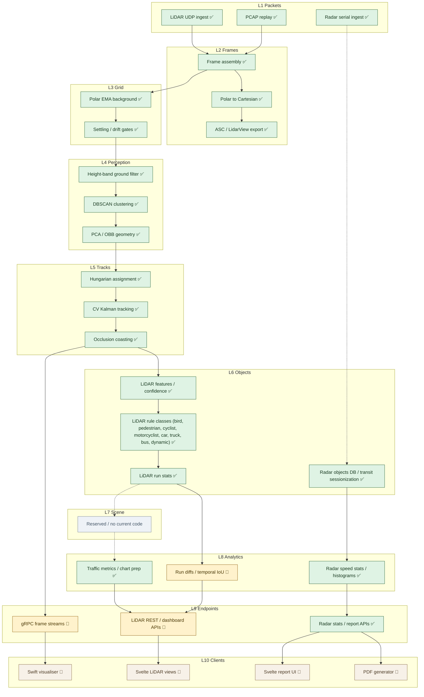

# LiDAR Data Layer Model (Ten Layers)

**Status:** Canonical reference — layer numbers are locked for codebase stability from v0.5.0 onwards.
**Last updated:** 2026-03-10

## Purpose

A single authoritative layer model for LiDAR data processing in velocity.report. The model defines ten layers — six implemented (L1–L6), one planned (L7), and three structurally present but being formalised (L8–L10). Layer numbers are permanent identifiers: once assigned, a layer number never changes meaning, even if the implementation evolves over years.

The design draws on established LiDAR/AV processing pipeline literature (see [§ Algorithm heritage](#algorithm-heritage-and-literature-alignment)) but is deliberately practical rather than academic. OSI is only a reference point; these layers match real code packages and real data flow.

## Stability guarantee

**Layer numbers L1–L10 are frozen from v0.5.0.** Future capabilities extend existing layers or occupy reserved slots — they never renumber established layers. This ensures package names (`l1packets/`, `l2frames/`, … `l7scene/`) remain stable across years of evolution.

## The ten layers

| Layer | Label          | Scope                                                                                    | Typical forms                                                                             | Status         |
| ----- | -------------- | ---------------------------------------------------------------------------------------- | ----------------------------------------------------------------------------------------- | -------------- |
| L1    | **Packets**    | Sensor-wire transport and capture                                                        | Hesai UDP payloads, PCAP packets, radar serial frames                                     | ✅ Implemented |
| L2    | **Frames**     | Time-coherent frame assembly and geometry exports                                        | `PointPolar`, `LiDARFrame`, Cartesian points, ASC/LidarView export                        | ✅ Implemented |
| L3    | **Grid**       | Background/foreground separation state                                                   | `BackgroundGrid`, ring/azimuth bins, foreground mask                                      | ✅ Implemented |
| L4    | **Perception** | Per-frame object primitives and measurements                                             | `WorldCluster`, `TrackObservation`, ground plane (`GroundSurface`), vector scene geometry | ✅ Implemented |
| L5    | **Tracks**     | Multi-frame identity and motion continuity                                               | `TrackedObject`, `TrackSet`                                                               | ✅ Implemented |
| L6    | **Objects**    | Semantic object interpretation and dataset mapping                                       | Local classes (`car`, `pedestrian`, `bird`, `other`), AV taxonomy mapping                 | ✅ Implemented |
| L7    | **Scene**      | Persistent canonical world model — accumulated geometry, priors, and multi-sensor fusion | `SceneFeature`, `CanonicalObject`, vector polygons, OSM priors, multi-sensor merged scene | 📋 Planned     |
| L8    | **Analytics**  | Canonical traffic metrics, run comparison, scoring                                       | `RunStatistics`, speed percentiles, temporal IoU, parameter diffs                         | 🔄 Partial     |
| L9    | **Endpoints**  | Server-side payload shaping, gRPC streams, dashboards, and report APIs                   | gRPC `FrameUpdate`, chart view-models, report/download payloads                           | 🔄 Partial     |
| L10   | **Clients**    | Downstream rendering consumers (documentation label — no Go package)                     | Browser (Svelte), native app (Swift/VeloVis), PDF generator (Python)                      | 📄 Doc-only    |

## Canonical L1-L10 Stack Reference

The table above is the canonical L1-L10 stack reference. This section remains
as the stable anchor for summaries that refer to the locked layer ordering.
The concept chart below is the primary visual reference.

## Segmented Concept Status Chart

This is the primary visual breakdown for the layer model. It shows only
current-code components in the repository today. L7 is kept as an explicit
empty slot so the canonical L1-L10 stack remains visually fixed even though
that layer has no runtime implementation yet.


```mermaid
flowchart TB
    classDef implemented fill:#dff3e4,stroke:#2f6b3b,color:#183a1f;
    classDef partial fill:#fff2cc,stroke:#9a6b16,color:#4d3600;
    classDef client fill:#f7f1e8,stroke:#8b6f47,color:#4e3b24;
    classDef gap fill:#eef2f7,stroke:#7b8794,color:#425466;

    subgraph L1["L1 Packets"]
        direction LR
        A11["LiDAR UDP ingest ✅"]
        A12["PCAP replay ✅"]
        R11["Radar serial ingest ✅"]
    end

    subgraph L2["L2 Frames"]
        direction LR
        A21["Frame assembly ✅"]
        A22["Polar to Cartesian ✅"]
        A23["ASC / LidarView export ✅"]
    end

    subgraph L3["L3 Grid"]
        direction LR
        A31["Polar EMA background ✅"]
        A32["Settling / drift gates ✅"]
    end

    subgraph L4["L4 Perception"]
        direction LR
        A41["Height-band ground filter ✅"]
        A42["DBSCAN clustering ✅"]
        A43["PCA / OBB geometry ✅"]
    end

    subgraph L5["L5 Tracks"]
        direction LR
        A51["Hungarian assignment ✅"]
        A52["CV Kalman tracking ✅"]
        A53["Occlusion coasting ✅"]
    end

    subgraph L6["L6 Objects"]
        direction LR
        A61["LiDAR features / confidence ✅"]
        A62["LiDAR rule classes (bird, pedestrian, cyclist, motorcyclist, car, truck, bus, dynamic) ✅"]
        A63["LiDAR run stats ✅"]
        R61["Radar objects DB / transit sessionization ✅"]
    end

    subgraph L7["L7 Scene"]
        direction LR
        A71["Reserved / no current code"]
    end

    subgraph L8["L8 Analytics"]
        direction LR
        A81["Traffic metrics / chart prep ✅"]
        A82["Run diffs / temporal IoU 🔄"]
        R81["Radar speed stats / histograms ✅"]
    end

    subgraph L9["L9 Endpoints"]
        direction LR
        A91["gRPC frame streams 🔄"]
        A92["LiDAR REST / dashboard APIs 🔄"]
        R91["Radar stats / report APIs ✅"]
    end

    subgraph L10["L10 Clients"]
        direction LR
        A101["Swift visualiser 📄"]
        A102["Svelte LiDAR views 📄"]
        R101["Svelte report UI 📄"]
        R102["PDF generator 📄"]
    end

    A11 --> A21
    A12 --> A21
    A21 --> A22
    A22 --> A23
    A21 --> A31
    A31 --> A32
    A32 --> A41
    A41 --> A42
    A42 --> A43
    A43 --> A51
    A51 --> A52
    A52 --> A53
    A53 --> A61
    A61 --> A62
    A62 --> A63
    A63 -.-> A71
    A71 -.-> A81
    A63 --> A82
    A53 --> A91
    A81 --> A92
    A82 --> A92
    A91 --> A101
    A92 --> A102

    R11 -.-> R61
    R61 --> R81
    R81 --> R91
    R91 --> R101
    R91 --> R102

    class A11,A12,R11,A21,A22,A23,A31,A32,A41,A42,A43,A51,A52,A53,A61,A62,A63,R61,A81,R81,R91 implemented;
    class A82,A91,A92 partial;
    class A71 gap;
    class A101,A102,R101,R102 client;
```

**Legend**

- Green `✅`: implemented in the current runtime.
- Amber `🔄`: current code exists, but the layer surface is still partial or evolving.
- Grey: reserved layer slot with no current runtime code.
- Beige `📄`: downstream/client surface rather than a core runtime layer package.
- Solid arrows: dominant current-code flow through that branch.
- Dashed arrows: layout/reference links through non-runtime layer gaps or branches that skip some runtime layers.

## Layered Concept and Literature Status

The ten-layer table above shows where layers live. The concept chart shows
which ideas within those layers are active. This table makes the
paper/concept mapping explicit.

| Layer(s) | Concept family | Representative papers / standards | Repo status |
| --- | --- | --- | --- |
| L1 | Packet-driver split | Velodyne HDL convention, ROS `velodyne`, Autoware `nebula` | ✅ Implemented |
| L2 | Range-image / sequential frame assembly | RangeNet++, SemanticKITTI temporal framing | ✅ Implemented |
| L3 | Single-component adaptive background model in polar space | Stauffer-Grimson GMM lineage, OctoMap as contrast | ✅ Implemented |
| L3 | Direct frame-stability / shake input into settling | Reflective sign and static-surface pose-anchor proposal | 🧪 Proposal |
| L4 | DBSCAN + PCA/OBB clustering | DBSCAN, PCL clustering, PCA | ✅ Implemented |
| L4 | Height-band ground removal | Simplified ground-filter family | ✅ Implemented |
| L4-L7 | Tile-plane / vector-scene geometry | Patchwork, ground-plane fitting, vector-scene planning | 📋 Proposed |
| L5 | CV Kalman + Hungarian tracking | Kalman, Hungarian, SORT, AB3DMOT | ✅ Implemented |
| L5 | CA / CTRV / IMM motion extensions | IMM / multi-model tracking literature | 📋 Proposed |
| L6 | Rule-based semantic interpretation | Local heuristic classifier | ✅ Implemented |
| L6 | AV taxonomy / 28-class mapping | SemanticKITTI, KITTI, nuScenes mappings | 🔄 Partial |
| L7 | Persistent scene, priors, fusion | HD-map / scene-accumulation literature, OSM priors | 📋 Planned |
| L8 | Run comparison, scorecards, evaluation | CLEAR MOT, KITTI-style comparison, temporal IoU | 🔄 Partial |
| L9-L10 | Endpoint shaping and client rendering | gRPC / dashboard / visualisation surface patterns | 🔄 Partial to active |

### Design rationale for ten layers

L1–L6 cover the single-sensor, single-frame-to-object pipeline that is standard in LiDAR processing literature. L7 introduces the critical missing concept: a **persistent world model** that accumulates evidence across frames, tracks, and sensors. L8–L10 handle what happens _after_ the processing pipeline produces results — analysis, server-side formatting, and client rendering.

The decision to place Scene at L7 (rather than above Analytics) reflects data flow: analytics (L8) needs the scene model to contextualise metrics (e.g. "speed at this road segment"), and endpoints (L9) render both scene geometry and analytics results.

## Artefact placement in this model

- Sensor packets → **L1 Packets**
- Frames and Cartesian representations → **L2 Frames**
- Background/foreground grid → **L3 Grid**
- Clusters and observations → **L4 Perception**
- Ground plane surface model → **L4 Perception** (non-point-based `GroundSurface` interface)
- Per-frame vector geometry extraction → **L4 Perception** (polygon features for ground, structures, volumes; see [vector-scene-map.md](vector-scene-map.md))
- Tracks → **L5 Tracks**
- Objects/classes → **L6 Objects**
- Canonical scene model (accumulated geometry, priors, multi-sensor merge) → **L7 Scene**
- OSM priors and external map data → **L7 Scene** (ingested as prior features, refined by observation)
- Run statistics, comparisons, percentiles → **L8 Analytics**
- gRPC streams, chart data, dashboard payloads → **L9 Endpoints**
- Browser, native app, PDF → **L10 Clients**
- VRLOG recordings span **L2–L6** (frame bundles, perception outputs, tracks, objects)
- LidarView exports primarily sit at **L2** (frame/geometry view)

## Visualiser

The macOS VelocityVisualiser renders each layer simultaneously in a single 3D Metal view, making the full pipeline visible at a glance. The screenshot below (kirk0.pcapng at 0:35) shows L3 foreground extraction, L4 DBSCAN clustering, and L5 track promotion all active at once:


### What each colour represents

| Visual element         | Colour                 | Layer         | Meaning                                                                                                                                                                                                                                     |
| ---------------------- | ---------------------- | ------------- | ------------------------------------------------------------------------------------------------------------------------------------------------------------------------------------------------------------------------------------------- |
| Background points      | **Grey-blue**          | L3 Grid       | Points classified as static scenery by the background model. The EMA-based grid learns per-cell range baselines; points within the closeness threshold are suppressed from further processing.                                              |
| Foreground points      | **Green**              | L3 Grid       | Points that diverge from the learned background — potential moving objects. These are the _only_ points passed to DBSCAN.                                                                                                                   |
| Ground points          | **Brown/tan**          | L4 Perception | Points classified as ground surface by the height-band filter (default band: −2.8 m to +1.5 m relative to sensor).                                                                                                                          |
| Cluster boxes          | **Cyan**               | L4 Perception | DBSCAN cluster bounding boxes. Each cyan box is a single-frame spatial grouping of foreground points (ε = 0.8 m, minPts = 5 by default). These are _observations_ — no identity or history yet. Oriented (OBB) when PCA provides a heading. |
| Cluster heading arrows | **Cyan**               | L4 Perception | PCA-derived heading from the cluster's oriented bounding box. Only rendered when OBB data is present.                                                                                                                                       |
| Tentative track boxes  | **Yellow**             | L5 Tracks     | A DBSCAN cluster that has been associated with a Kalman-filtered track but has not yet reached the `hits_to_confirm` threshold (default: 4 consecutive observations). The tracker is _watching_ this object but has not committed to it.    |
| Confirmed track boxes  | **Green**              | L5 Tracks     | A track that has accumulated enough consistent observations to be confirmed. These are the high-confidence moving objects — vehicles, pedestrians, cyclists. The Kalman filter provides smoothed position and velocity.                     |
| Deleted track boxes    | **Red**                | L5 Tracks     | A track that has exceeded `max_misses` (tentative) or `max_misses_confirmed` without a matching observation. Fades out over the grace period.                                                                                               |
| Trail lines            | **Green** (fading)     | L5 Tracks     | Historical position polyline for confirmed tracks. Alpha fades linearly from transparent (oldest) to opaque (newest), showing the track's recent trajectory.                                                                                |
| Heading arrows         | **Track state colour** | L5 Tracks     | Velocity-derived heading for tracks (green for confirmed, yellow for tentative). Prefers Kalman velocity heading over PCA/OBB heading.                                                                                                      |
| Track ID labels        | **White**              | L5 Tracks     | Short hex identifier (e.g. `4269`, `7cc0`) projected to screen coordinates above each track box.                                                                                                                                            |
| Class labels           | **Yellow**             | L6 Objects    | Classification label (e.g. `car`, `pedestrian`) shown below the track ID once the classifier has enough observations.                                                                                                                       |

### Pipeline flow — full ten-layer data flow

The core processing pipeline runs once per LiDAR frame (~10 Hz for Hesai Pandar40P). L7–L10 operate at lower frequencies or on-demand.

```
═══════════════════════════════════════════════════════════════════════════
 SENSOR TIER (per-sensor, real-time, ~10 Hz)
═══════════════════════════════════════════════════════════════════════════

L1  Packets ─── UDP payloads arrive from sensor (or PCAP replay)
 │               Hesai Pandar40P: 40-ring returns, ~700K pts/sec
 │               Radar: serial frames (OmniPreSense OPS243-C)
 │               Future: additional LiDAR/radar on separate ports
 │
L2  Frames ──── Frame assembly: polar points → time-coherent LiDARFrame
 │               40 rings × 1800 azimuth bins → single rotation
 │               Polar → Cartesian coordinate transform
 │               Timestamp alignment, frame sequencing
 │
L3  Grid ────── Background model: per-cell EMA range baseline
 │               Each point tested against learned background
 │  ├── within threshold ──→ background point (suppressed)
 │  └── outside threshold ─→ foreground point (passed on)
 │               Settling: 100 frames + 30s warmup before extraction
 │               Region identification, persistence to SQLite
 │
L4  Perception  Ground removal → voxel downsampling → DBSCAN clustering
 │               Each cluster → OBB with PCA heading
 │               Ground plane tiling → vector polygon extraction
 │               Per-frame, single-sensor observations only
 │
L5  Tracks ──── Hungarian assignment: clusters → Kalman-filtered tracks
 │  ├── matched + hits < threshold ──→ tentative track
 │  ├── matched + hits ≥ threshold ──→ confirmed track
 │  ├── unmatched cluster ───────────→ new tentative track
 │  └── unmatched track ─────────────→ miss counter → deletion
 │               Track lifecycle: tentative → confirmed → deleted
 │               Smoothed position, velocity, heading
 │
L6  Objects ─── Classification: feature accumulation → class label
                 car │ pedestrian │ cyclist │ bird │ other
                 AV taxonomy mapping (28-class compatibility)
                 Per-track quality scoring

═══════════════════════════════════════════════════════════════════════════
 SCENE TIER (multi-frame, multi-sensor, persistent)
═══════════════════════════════════════════════════════════════════════════

L7  Scene ───── Canonical world model
 │               Static geometry: ground polygons, structures, volumes
 │               Dynamic objects: canonical vehicles (merged tracks)
 │               Evidence accumulation across frames and sensors
 │               OSM/map priors: S3DB buildings, road geometry
 │               Multi-sensor fusion: unified coordinate frame
 │               Uncertainty bounds, edit history, provenance

═══════════════════════════════════════════════════════════════════════════
 CONSUMPTION TIER (on-demand, variable frequency)
═══════════════════════════════════════════════════════════════════════════

L8  Analytics ─ Traffic metrics, run comparison, scoring
 │               Speed percentiles, volume counts, temporal IoU
 │               Scene-contextualised statistics ("speed on Main St")
 │               Parameter sweep evaluation, run diffing
 │
L9  Endpoints ─ Server-side payload shaping
 │               gRPC FrameUpdate stream to VelocityVisualiser
 │               ECharts data, chart view-models, debug overlays
 │               Dashboard API responses
 │
L10 Clients ─── Downstream renderers (no Go package)
                 Browser: Svelte web frontend
                 Native: Swift/Metal VelocityVisualiser
                 Reports: Python PDF generator
```

### Simplified single-sensor flow (current implementation)

The current single-sensor, single-frame pipeline:

```
L1  UDP packets arrive from sensor (or PCAP replay)
     │
L2  Frame assembly: 40-ring polar points → time-coherent LiDARFrame
     │
L3  Background grid: each point tested against per-cell EMA baseline
     │  ├─ within threshold → grey-blue background point (suppressed)
     │  └─ outside threshold → green foreground point (passed on)
     │
L4  Height-band filter → voxel downsampling → DBSCAN clustering
     │  └─ each cluster → cyan box with OBB heading
     │
L5  Hungarian assignment: clusters matched to existing Kalman tracks
     │  ├─ matched + below hits_to_confirm → yellow tentative box
     │  ├─ matched + above hits_to_confirm → green confirmed box
     │  ├─ unmatched cluster → new tentative track (yellow)
     │  └─ unmatched track → increment miss counter (→ red/deleted)
     │
L6  Classification: confirmed tracks accumulate features → class label
```

### Background settling and the 30-second warmup

When a new data source starts (live sensor or PCAP replay), the L3 background grid must _settle_ before foreground extraction begins. During the settling period (default: **100 frames AND 30 seconds**, whichever is longer):

- All points are used to seed per-cell EMA range baselines
- The foreground mask is **suppressed** — no points reach DBSCAN
- The visualiser shows only grey-blue background points (no cyan/yellow/green boxes)

After settling completes, the grid identifies _regions_ and persists both grid cells and region data to SQLite. On subsequent replays of the same PCAP file, the grid restores from the database in ~10 frames, skipping the 30-second warmup entirely.

### Toggle buttons in the toolbar

The visualiser toolbar provides single-key toggles for each visual layer:

| Button | Key | Controls                                 |
| ------ | --- | ---------------------------------------- |
| **F**  | F   | Foreground points (green)                |
| **K**  | K   | Background points (grey-blue)            |
| **B**  | B   | Bounding boxes (all track/cluster boxes) |
| **C**  | C   | Cluster boxes (cyan, L4)                 |
| **T**  | T   | Track boxes (yellow/green/red, L5)       |
| **V**  | V   | Velocity vectors / heading arrows        |
| **L**  | L   | Labels (track ID + class)                |
| **G**  | G   | Ground grid overlay                      |

## Current repository alignment

| Layer         | Canonical package              | Key files                                                                                                                                                   | Status |
| ------------- | ------------------------------ | ----------------------------------------------------------------------------------------------------------------------------------------------------------- | ------ |
| L1 Packets    | `internal/lidar/l1packets/`    | Facade over `network/` (UDP/PCAP) and `parse/` (Pandar40P)                                                                                                  | ✅     |
| L2 Frames     | `internal/lidar/l2frames/`     | `frame_builder.go`, `export.go`, `geometry.go`                                                                                                              | ✅     |
| L3 Grid       | `internal/lidar/l3grid/`       | `background.go`, `background_persistence.go`, `background_export.go`, `background_drift.go`, `foreground.go`, `config.go`                                   | ✅     |
| L4 Perception | `internal/lidar/l4perception/` | `cluster.go`, `dbscan_clusterer.go`, `ground.go`, `voxel.go`, `obb.go`, ground plane (planned)                                                              | ✅     |
| L5 Tracks     | `internal/lidar/l5tracks/`     | `tracking.go`, `hungarian.go`, `tracker_interface.go`                                                                                                       | ✅     |
| L6 Objects    | `internal/lidar/l6objects/`    | `classification.go`, `features.go`, `quality.go`, `comparison.go`                                                                                           | ✅     |
| L7 Scene      | `internal/lidar/l7scene/`      | _To be created_ — canonical scene model, priors ingestion, multi-sensor merge                                                                               | 📋     |
| L8 Analytics  | `internal/lidar/l8analytics/`  | _Canonical package to be created — existing analytics logic currently in `l6objects/quality.go`, `storage/sqlite/analysis_run*.go`, `monitor/scene_api.go`_ | 🔄     |
| L9 Endpoints  | `internal/lidar/l9endpoints/`  | _Rename from `internal/lidar/visualiser/`_ — `adapter.go`, `frame_codec.go`, `grpc_server.go`, `publisher.go`                                               | 🔄     |
| L10 Clients   | _(no Go package)_              | `web/` (Svelte), `tools/visualiser-macos/` (Swift), `tools/pdf-generator/` (Python)                                                                         | 📄     |

Cross-cutting packages:

| Package                          | Purpose                                                                      |
| -------------------------------- | ---------------------------------------------------------------------------- |
| `internal/lidar/pipeline/`       | Orchestration (stage interfaces)                                             |
| `internal/lidar/storage/sqlite/` | DB repositories (scene, track, evaluation, sweep, analysis run stores)       |
| `internal/lidar/adapters/`       | Transport and IO boundaries                                                  |
| `internal/lidar/monitor/`        | Infrastructure monitoring (to be decomposed: analytics → L8, endpoints → L9) |
| `internal/lidar/sweep/`          | Parameter sweep and auto-tuning                                              |

Backward-compatible type aliases remain in the parent `internal/lidar/` package so existing callers continue to work.

### Layer dependency rule

Each layer package may only import from lower-numbered layers — never upward or sideways. For example: L2 may import L1 (for return types); L3 may import L1–L2; L4 may import L1–L3; and so on. Cross-cutting packages (`pipeline/`, `storage/`, `adapters/`) are exempt.

**Known violations:** Several L1–L3 files currently import types from L4 (`PointPolar`, `Point`, `SphericalToCartesian`). These are sensor-frame primitives that belong at L2. A migration plan is tracked in [lidar-layer-dependency-hygiene-plan.md](../../plans/lidar-layer-dependency-hygiene-plan.md).

---

## Algorithm heritage and literature alignment

Each layer's algorithms align with established research in LiDAR processing, 3D object detection, and multi-object tracking. This section maps velocity.report's implementation choices to the relevant literature, providing both justification and pointers for future contributors.

Use the references above as the fast visual index:

- the **ten-layer table** answers where a capability belongs;
- the **concept chart** answers which bodies of work are implemented, partial,
  planned, proposed, or merely contextual.

### L1 Packets — sensor transport

**Our approach:** Raw UDP packet capture from Hesai Pandar40P; PCAP file replay for offline analysis.

**Literature context:** Sensor-specific packet formats are proprietary but follow the pattern established by Velodyne's original HDL-64E protocol specification. The general approach of treating raw sensor data as an opaque transport layer — separate from frame assembly — is standard in both the ROS `velodyne_driver` / `velodyne_pointcloud` split and Autoware's `nebula` driver architecture.

| Reference                           | Relevance                                                                                    |
| ----------------------------------- | -------------------------------------------------------------------------------------------- |
| Velodyne HDL-64E User Manual (2007) | Established the UDP point-return packet convention used by most spinning LiDAR manufacturers |
| ROS `velodyne` package architecture | Canonical example of separating packet driver (L1) from pointcloud assembly (L2)             |
| Hesai Pandar40P User Manual v3.0    | Our specific sensor protocol — dual-return UDP at 10 Hz rotation                             |
| Autoware `nebula` driver (2023)     | Modern multi-vendor L1 abstraction supporting Hesai, Velodyne, Ouster, Robosense             |

### L2 Frames — point cloud assembly

**Our approach:** Assemble a complete 360° rotation into a time-coherent `LiDARFrame`; convert from polar (ring, azimuth, range) to Cartesian (x, y, z) coordinates. Export to ASC/LidarView formats.

**Literature context:** Frame assembly from individual laser returns is a solved problem but involves timing correction (motion compensation) for moving platforms. velocity.report's fixed-mount sensor simplifies this — no ego-motion compensation required.

| Reference                                                      | Relevance                                                                                                            |
| -------------------------------------------------------------- | -------------------------------------------------------------------------------------------------------------------- |
| Range image representation (Milioto et al., 2019 — RangeNet++) | Treating a LiDAR rotation as a 2D range image (rings × azimuth); our polar frame is equivalent                       |
| Behley et al. (2019) — **SemanticKITTI** (arXiv:1904.01416)    | Defined the standard for sequential LiDAR frame datasets; our frame-level data follows the same temporal conventions |
| VTK structured grid formats                                    | Our ASC/VTK export pathway follows ParaView interchange conventions                                                  |

### L3 Grid — background/foreground separation

**Our approach:** Exponential Moving Average (EMA) per polar-grid cell (40 rings × 1800 azimuth bins = 72,000 cells). Each cell tracks mean range and spread. Foreground points are those deviating beyond a distance-adaptive threshold from the learned baseline. Neighbour confirmation voting reduces noise. Settling period: 100 frames + 30 seconds.

**Literature context:** Background subtraction in point clouds parallels the well-studied problem in video surveillance. Our approach is most closely related to Gaussian Mixture Model (GMM) background subtraction, but simplified to a single-component EMA because the sensor is stationary and the scene is predominantly static.

| Reference                                                                             | Relevance                                                                                                                       |
| ------------------------------------------------------------------------------------- | ------------------------------------------------------------------------------------------------------------------------------- |
| Stauffer & Grimson (1999) — Adaptive background mixture models for real-time tracking | Foundation for statistical background models; our single-component EMA is a simplified variant                                  |
| Sack & Burgard (2004) — Background subtraction for mobile robots                      | Extended GMM to range data; validates the EMA-on-range approach for static scenes                                               |
| Pomerleau et al. (2014) — Long-term 3D map maintenance                                | Dynamic point removal from accumulated maps; related to our background settling and drift correction                            |
| Hornung et al. (2013) — **OctoMap** (doi:10.1007/s10514-012-9321-0)                   | Probabilistic 3D occupancy mapping; our polar grid is a sensor-native alternative that avoids Cartesian discretisation overhead |

**Design choice:** Polar-frame EMA over OctoMap/TSDF for background — lower latency, no pose dependence, and the sensor-centric grid naturally matches the measurement geometry. See [lidar-background-grid-standards.md](lidar-background-grid-standards.md) for the full comparison.

### L4 Perception — clustering and ground extraction

**Our approach:** Height-band ground removal, voxel downsampling, DBSCAN clustering (ε = 0.8 m, minPts = 5), PCA-based oriented bounding boxes (OBB). Ground surface modelled as tiled planes, evolving toward vector polygons.

**Literature context:** DBSCAN is the standard baseline for unsupervised LiDAR clustering in traffic scenarios. It appears in virtually every classical LiDAR pipeline (pre-deep-learning). Our ground removal via height-band filter is a simplified variant of the RANSAC-based approaches common in the literature.

| Reference                                                                                 | Relevance                                                                                                                                          |
| ----------------------------------------------------------------------------------------- | -------------------------------------------------------------------------------------------------------------------------------------------------- |
| Ester et al. (1996) — **DBSCAN** (KDD-96)                                                 | The original density-based clustering algorithm; our implementation follows the standard formulation with spatial indexing                         |
| Rusu & Cousins (2011) — **Point Cloud Library (PCL)**                                     | PCL's Euclidean cluster extraction is DBSCAN-equivalent; our voxel grid + DBSCAN mirrors PCL's `VoxelGrid` → `EuclideanClusterExtraction` pipeline |
| Bogoslavskyi & Stachniss (2017) — Fast range-image-based segmentation (IROS 2017)         | Efficient alternative to DBSCAN using range-image connectivity; future optimisation path                                                           |
| Zermas et al. (2017) — Fast segmentation of 3D point clouds for ground vehicles (IEEE IV) | Ground plane extraction via line fitting in polar slices; informs our height-band approach                                                         |
| Patchwork (Lim et al., 2021) — Ground segmentation (RA-L 2021)                            | Concentric zone model for ground estimation; more robust than our height-band filter but more complex; future upgrade path                         |
| Jolliffe (2002) — **PCA** (Principal Component Analysis)                                  | OBB fitting from eigenvectors of point covariance; standard approach used in our L4 heading estimation                                             |

**Vector scene map (L4 → L7):** Per-frame polygon extraction (ground, structure, volume features) begins at L4 but the accumulated, persistent scene model lives at L7. See [vector-scene-map.md](vector-scene-map.md) for the full specification.

### L5 Tracks — multi-object tracking

**Our approach:** 3D Kalman filter for state prediction; Hungarian (Munkres) algorithm for detection-to-track assignment; `hits_to_confirm` promotion policy (tentative → confirmed → deleted lifecycle).

**Literature context:** This is the standard "tracking-by-detection" paradigm. Our implementation closely follows the AB3DMOT baseline, which demonstrated that a simple Kalman + Hungarian pipeline achieves competitive MOT performance at very high frame rates.

| Reference                                                                  | Relevance                                                                                                                                 |
| -------------------------------------------------------------------------- | ----------------------------------------------------------------------------------------------------------------------------------------- |
| Kalman (1960) — A New Approach to Linear Filtering and Prediction Problems | Foundation of our state estimator; predict-update cycle for position and velocity                                                         |
| Kuhn (1955) — The Hungarian method for the assignment problem              | Optimal O(n³) assignment of detections to tracks; our `hungarian.go` implementation                                                       |
| Weng et al. (2020) — **AB3DMOT** (arXiv:2008.08063)                        | 3D Kalman + Hungarian baseline for LiDAR MOT at 207 Hz; validates our architectural choice                                                |
| Yin et al. (2021) — **CenterPoint** (arXiv:2006.11275, CVPR 2021)          | Centre-based 3D detection + tracking; greedy closest-point matching as a simpler alternative to Hungarian — potential future optimisation |
| Bewley et al. (2016) — **SORT** (arXiv:1602.00763)                         | Simple Online Realtime Tracking; 2D Kalman + Hungarian that AB3DMOT extends to 3D                                                         |
| Bernardin & Stiefelhagen (2008) — CLEAR MOT metrics                        | Standard MOT evaluation metrics (MOTA, MOTP); used in our L8 Analytics run comparisons                                                    |

**Design choice:** Classical Kalman + Hungarian over learned trackers (e.g. transformer-based) — deterministic, real-time on Raspberry Pi hardware, and fully interpretable. The architecture supports future drop-in replacement of the tracker implementation without changing layer boundaries.

### L6 Objects — semantic classification

**Our approach:** Rule-based feature accumulation from confirmed tracks; classification by dimensional/kinematic heuristics (size, speed profile, aspect ratio). Local classes: `car`, `pedestrian`, `cyclist`, `bird`, `other`. AV 28-class taxonomy mapping as an export concern.

**Literature context:** Our current classifier is heuristic rather than learned, occupying the same architectural slot as deep-learning detectors (PointPillars, CenterPoint) but with deterministic rules suited to our privacy-first, edge-compute constraints.

| Reference                                                           | Relevance                                                                                                             |
| ------------------------------------------------------------------- | --------------------------------------------------------------------------------------------------------------------- |
| Lang et al. (2019) — **PointPillars** (arXiv:1812.05784, CVPR 2019) | Fast pillar-based 3D detection at 62 Hz; represents the learned-detection alternative to our L4+L6 heuristic pipeline |
| nuScenes detection taxonomy (Caesar et al., 2020)                   | 23-class AV taxonomy; our L6 maps local classes to this (and Waymo 4-class) for evaluation compatibility              |
| KITTI 3D Object Detection Benchmark (Geiger et al., 2012)           | Standard evaluation benchmark; our L8 Analytics run-comparison metrics derive from KITTI conventions                  |
| Behley et al. (2019) — SemanticKITTI                                | 28-class point-wise semantic labels; our AV compatibility mapping targets this taxonomy                               |

---

## L7 Scene — architectural role

L7 introduces a **persistent, evidence-accumulated world model** that transcends individual frames, tracks, and sensors. It is the boundary between the per-sensor real-time pipeline (L1–L6) and the consumption layers (L8–L10).

**Scope:** Static geometry (ground polygons, structures, volumes), dynamic canonical objects (merged tracks → refined vehicle/pedestrian models), external priors (OSM, GeoJSON), and multi-sensor fusion into a single coherent scene.

**Key relationships:**

- L4 produces per-frame observations → L7 accumulates them into persistent geometry
- L5 tracks are ephemeral (one sensor, one visibility window) → L7 canonical objects are persistent across time and sensors
- L8 Analytics needs the scene model to contextualise metrics (e.g. "speed on this road segment")

**Design and implementation plan:** See [lidar-l7-scene-plan.md](../../plans/lidar-l7-scene-plan.md). Vector feature specification in [vector-scene-map.md](vector-scene-map.md).

---

## Multi-sensor architecture

L1–L6 remain per-sensor and sensor-local. Multi-sensor fusion happens exclusively at L7, where observations from all sensors merge into a single canonical scene. This keeps the real-time per-sensor pipeline simple and avoids premature coordinate transforms in the low-level layers.

| Layer        | Single-sensor (today)               | Multi-sensor (future)                                                                               |
| ------------ | ----------------------------------- | --------------------------------------------------------------------------------------------------- |
| L1–L6        | One pipeline instance per sensor    | Parallel instances, each in sensor-local coordinates                                                |
| **L7 Scene** | **Single-sensor accumulated scene** | **Merged scene: cross-sensor track association, unified coordinate frame, fused canonical objects** |
| L8–L10       | Single pipeline                     | Operate on the merged L7 scene                                                                      |

**Design details:** Cross-sensor track handoff, association strategies, and multi-modality considerations are documented in the [L7 Scene plan](../../plans/lidar-l7-scene-plan.md#2-multi-sensor-architecture).

---

## Long-term layer designation stability

### Frozen designations (v0.5.0 onwards)

The following layer numbers and names are **permanently assigned**. Implementation status will evolve, but the number-to-concept mapping never changes.

| Number | Name       | Concept (permanent)                  | Earliest code  | Notes                                        |
| ------ | ---------- | ------------------------------------ | -------------- | -------------------------------------------- |
| L1     | Packets    | Sensor transport, wire-level capture | v0.1.0         | One instance per physical sensor             |
| L2     | Frames     | Time-coherent point assembly         | v0.1.0         | Sensor-local coordinates                     |
| L3     | Grid       | Background/foreground separation     | v0.1.0         | Sensor-local polar grid                      |
| L4     | Perception | Single-frame geometric primitives    | v0.4.0         | Clusters, ground tiles, OBBs                 |
| L5     | Tracks     | Multi-frame identity continuity      | v0.4.0         | Kalman + Hungarian per sensor                |
| L6     | Objects    | Semantic classification              | v0.4.0         | Per-track class labels                       |
| L7     | Scene      | Persistent canonical world model     | v1.0 (planned) | Multi-frame, multi-sensor, priors            |
| L8     | Analytics  | Traffic metrics and evaluation       | v0.4.0         | Currently in `monitor/`; run comparison, IoU |
| L9     | Endpoints  | Server-side payload shaping          | v0.1.0         | `monitor/` dashboards; `visualiser/` gRPC    |
| L10    | Clients    | Downstream renderers                 | v0.1.0         | Web frontend shipped with first release      |

### Rules for future evolution

1. **Never renumber.** L7 is Scene forever. If a concept is retired, the layer number becomes "deprecated" rather than reassigned.

2. **Extend, don't insert.** If a new processing stage is needed between existing layers, it is modelled as a sub-stage (e.g. L4a, L4b) or absorbed into the adjacent layer — never by renumbering L5+ upward.

3. **Layer scope may broaden.** L4 Perception started as "DBSCAN clustering" and now includes ground plane extraction and vector geometry. This is broadening within the same concept (per-frame geometric primitives), not a layer change.

4. **Package names track layer numbers.** `l7scene/`, `l8analytics/`, `l9endpoints/` — the numeric prefix ensures filesystem ordering matches the data flow.

5. **Cross-cutting packages remain unnumbered.** `pipeline/`, `storage/`, `adapters/`, `sweep/`, `monitor/` serve multiple layers and carry no layer number.

### Potential future expansions (reserved concepts, no layer assigned)

These capabilities might emerge in future years. They would extend existing layers or occupy new advisory sub-layers, never displace L1–L10:

| Concept                                            | Likely home | Rationale                                                               |
| -------------------------------------------------- | ----------- | ----------------------------------------------------------------------- |
| Deep-learning detector (PointPillars, CenterPoint) | L4 or L6    | Replaces heuristic clustering/classification; same architectural slot   |
| SLAM / ego-motion (mobile sensor)                  | L2–L3       | Frame motion compensation and grid update in ego-moving frame           |
| Radar-LiDAR point-level fusion                     | L4          | Combined cluster formation from heterogeneous sensor types              |
| Predictive trajectory (motion forecasting)         | L5 or L7    | Extends track state with predicted future positions                     |
| Multi-intersection corridor analytics              | L8          | Aggregation across multiple L7 scene instances                          |
| Federated learning (edge-to-cloud)                 | L8          | Model updates from distributed deployments; no raw data leaves the edge |
| Real-time alerting / notification                  | L9          | Threshold-triggered events pushed to clients                            |

---

## AV compatibility note

This ten-layer model keeps traffic monitoring practical while preserving a clean upgrade path. AV 28-class compatibility remains an **L6 Objects** concern. HD-map-style scene reconstruction is an **L7 Scene** concern. Neither imposes AV-scale complexity on the real-time L1–L5 pipeline.

The layer boundaries are intentionally aligned with common AV pipeline decompositions (sensor → detection → tracking → prediction → planning) but stop before planning/control since velocity.report is an observation system, not a vehicle control system.

---

## References (consolidated)

### Foundational algorithms

- Ester, M., Kriegel, H.-P., Sander, J., & Xu, X. (1996). A density-based algorithm for discovering clusters in large spatial databases with noise. _KDD-96_.
- Kalman, R. E. (1960). A new approach to linear filtering and prediction problems. _Journal of Basic Engineering_, 82(1), 35–45.
- Kuhn, H. W. (1955). The Hungarian method for the assignment problem. _Naval Research Logistics Quarterly_, 2(1–2), 83–97.
- Jolliffe, I. T. (2002). _Principal Component Analysis_ (2nd ed.). Springer.
- Stauffer, C., & Grimson, W. E. L. (1999). Adaptive background mixture models for real-time tracking. _CVPR 1999_.

### LiDAR processing and detection

- Lang, A. H., Vora, S., Caesar, H., Zhou, L., Yang, J., & Beijbom, O. (2019). PointPillars: Fast encoders for object detection from point clouds. _CVPR 2019_. arXiv:1812.05784.
- Milioto, A., Vizzo, I., Behley, J., & Stachniss, C. (2019). RangeNet++: Fast and accurate LiDAR semantic segmentation. _IROS 2019_.
- Bogoslavskyi, I., & Stachniss, C. (2017). Fast range image-based segmentation of sparse 3D laser scans for online operation. _IROS 2017_.
- Zermas, D., Izzat, I., & Papanikolopoulos, N. (2017). Fast segmentation of 3D point clouds: A paradigm on LiDAR data for autonomous vehicle applications. _IEEE IV 2017_.
- Lim, H., Oh, M., & Myung, H. (2021). Patchwork: Concentric zone-based region-wise ground segmentation with tilted LiDAR. _RA-L 2021_.
- Rusu, R. B., & Cousins, S. (2011). 3D is here: Point Cloud Library (PCL). _ICRA 2011_.

### Tracking

- Bewley, A., Ge, Z., Ott, L., Ramos, F., & Upcroft, B. (2016). Simple online and realtime tracking. _ICIP 2016_. arXiv:1602.00763.
- Weng, X., Wang, J., Held, D., & Kitani, K. (2020). AB3DMOT: A baseline for 3D multi-object tracking and new evaluation metrics. _ECCVW 2020_. arXiv:2008.08063.
- Yin, T., Zhou, X., & Krähenbühl, P. (2021). Center-based 3D object detection and tracking. _CVPR 2021_. arXiv:2006.11275.
- Bernardin, K., & Stiefelhagen, R. (2008). Evaluating multiple object tracking performance: The CLEAR MOT metrics. _EURASIP JIVP_, 2008.

### Scene understanding and mapping

- Behley, J., Garbade, M., Milioto, A., Quenzel, J., Behnke, S., Stachniss, C., & Gall, J. (2019). SemanticKITTI: A dataset for semantic scene understanding of LiDAR sequences. _ICCV 2019_. arXiv:1904.01416.
- Hornung, A., Wurm, K. M., Bennewitz, M., Stachniss, C., & Burgard, W. (2013). OctoMap: An efficient probabilistic 3D mapping framework based on octrees. _Autonomous Robots_, 34(3). doi:10.1007/s10514-012-9321-0.
- Pomerleau, F., Krüsi, P., Colas, F., Furgale, P., & Siegwart, R. (2014). Long-term 3D map maintenance in dynamic environments. _ICRA 2014_.
- Pannen, D., Liebner, M., Hempel, W., & Stiller, C. (2020). How to keep HD maps for automated driving up to date. _ICRA 2020_.
- Caesar, H., et al. (2020). nuScenes: A multimodal dataset for autonomous driving. _CVPR 2020_.
- Geiger, A., Lenz, P., & Urtasun, R. (2012). Are we ready for autonomous driving? The KITTI vision benchmark suite. _CVPR 2012_.

### Multi-sensor fusion

- Bar-Shalom, Y., Willett, P. K., & Tian, X. (2011). _Tracking and Data Fusion_. YBS Publishing.
- Reid, D. B. (1979). An algorithm for tracking multiple targets. _IEEE Transactions on Automatic Control_, 24(6), 843–854.
- Sack, D., & Burgard, W. (2004). A comparison of methods for line extraction from range data. _IFAC Proceedings Volumes_, 37(8).

### Standards and datasets

- OpenStreetMap Simple 3D Buildings (S3DB) — wiki.openstreetmap.org/wiki/Simple_3D_buildings
- CityJSON specification v1.1 — cityjson.org
- Velodyne HDL-64E S2 User's Manual (2007)
- Hesai Pandar40P User Manual v3.0
