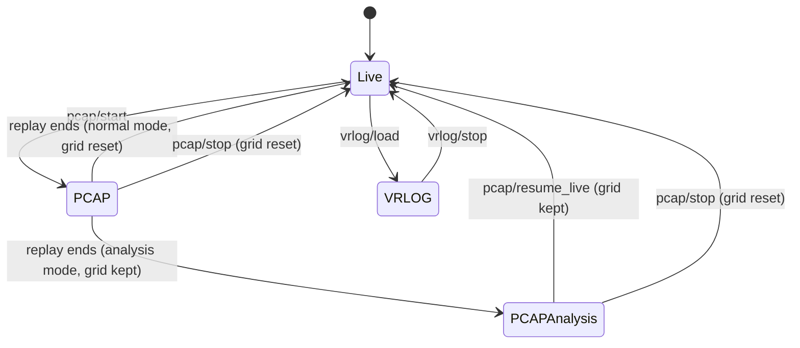

# Data source switching

- **Status:** Implemented
- **Canonical:** the pipeline state model in [`internal/lidar/server/pipeline_state.go`](../../../internal/lidar/server/pipeline_state.go)

The LiDAR server switches between live sensor input, PCAP replay, and VRLOG
replay at runtime over HTTP. There is no startup flag for the data source: the
server always boots live, and every transition happens through the API.

## The state model

What is driving the pipeline, and what is being captured from it, are answered
by a single value — `PipelineState` — held behind one lock in
[`internal/lidar/server`](../../../internal/lidar/server). Everything the status
surfaces report is derived from a single snapshot of it, so a status read can
never show a combination of fields that never existed together.

Two things that are easy to conflate are kept apart:

| Axis      | Field                        | Meaning                                                        |
| --------- | ---------------------------- | -------------------------------------------------------------- |
| Source    | `Source`                     | `live`, `pcap`, or `vrlog` — what is feeding the pipeline      |
| Retention | `GridPreserved`              | whether the background grid is being kept for inspection       |
| Activity  | `ReplayActive`               | whether a replay is running now, as opposed to having finished |
| Pass      | `Pass`                       | `settling` or `recording` during a two-pass replay             |
| Capture   | `Recording`, `RecordingPath` | whether a VRLOG is being written, and where                    |

`pcap_analysis` is **not** a source. It is a derived wire token meaning "a PCAP
produced this grid, the replay has finished, and the grid is retained" — a
source plus a retention flag plus an activity flag. Keeping it derived is what
lets resume-live report a live source with the grid still preserved, which the
older single enum could not express.

Seekability is likewise a capability, not a mode. A VRLOG replay happens to be
seekable and a PCAP replay happens not to be, but neither may be derived from
the other.

## Data source values

Reported as `data_source` by `GET /api/lidar/data_source` and `GET /api/lidar/status`:

| Value           | Meaning                                                 |
| --------------- | ------------------------------------------------------- |
| `live`          | live UDP ingest from the sensor                         |
| `pcap`          | PCAP replay, running or finished without grid retention |
| `pcap_analysis` | PCAP replay finished in analysis mode, grid retained    |
| `vrlog`         | replay of a recorded frame log to the visualiser        |

This vocabulary matches the source-mode set in
[metrics-registry.md](../../platform/architecture/metrics-registry.md) and the
`SourceMode` enum on the gRPC wire.

Note that `l1.data_source` in the tuning config uses the same three PCAP-side
tokens, but as _launch intent_ — an input, not runtime state. The two are
validated separately and should not be conflated.

## Endpoints

All are served on both the LiDAR port (`:8081`) and the main API (`:8080`).

| Endpoint                           | Purpose                                                                |
| ---------------------------------- | ---------------------------------------------------------------------- |
| `GET /api/lidar/data_source`       | Full state snapshot (see below)                                        |
| `GET /api/lidar/status`            | Server status including `data_source`, `pcap_file`, `pcap_in_progress` |
| `GET /api/lidar/playback/status`   | Playback mode plus replay position                                     |
| `POST /api/lidar/pcap/start`       | Start a PCAP replay (stops live ingest, resets the grid)               |
| `POST /api/lidar/pcap/stop`        | Cancel the replay, reset the grid, resume live                         |
| `POST /api/lidar/pcap/resume_live` | Resume live from analysis mode, **keeping** the grid                   |
| `POST /api/lidar/vrlog/load`       | Start a VRLOG replay (stops live ingest)                               |
| `POST /api/lidar/vrlog/stop`       | Stop the replay and resume live                                        |

### `GET /api/lidar/data_source`

```json
{
  "status": "ok",
  "data_source": "pcap",
  "pcap_file": "/data/pcaps/capture.pcapng",
  "pcap_in_progress": true,
  "analysis_mode": true,
  "last_run_id": "run-abc",
  "source_path": "/data/pcaps/capture.pcapng",
  "replay_active": true,
  "replay_pass": "settling",
  "replay_total_passes": 2,
  "grid_preserved": true,
  "live_listener_running": false,
  "recording": false,
  "recording_path": ""
}
```

`source_path` covers VRLOG replays, which `pcap_file` cannot. `pcap_in_progress`
is deliberately narrow — a PCAP source with a replay running, never a VRLOG
replay — because `Client.WaitForPCAPComplete` gates on it and the sweep runner
calls that once per parameter combination.

`?wait_for_done=true` long-polls until the active PCAP replay completes.

### `GET /api/lidar/playback/status`

Reports `mode` using the same four-value vocabulary, alongside `paused`, `rate`,
`seekable`, frame position, `replay_pass`, `replay_total_passes`, `recording`,
`recording_path`, and `recording_frames`.

Mode and recording come from the server's own state. Only the fast-moving replay
position (`paused`, `rate`, `current_frame`) is pulled from the streaming layer,
because Pause/Play/Seek/SetRate arrive as gRPC calls and never pass through HTTP.

## State transitions



`PCAPAnalysis` is the derived `pcap_analysis` token, not a distinct source.

## Ingest during replay

Both PCAP and VRLOG replay stop the live UDP listener for their duration, and
restart it on return to live. `live_listener_running` reports this, so "live
source" and "actually ingesting packets" can be told apart.

During a VRLOG replay the publisher also drops frames produced by the live
pipeline, so replayed frames are not interleaved with live ones on the gRPC
stream or written into an active recording.

## Concurrency

| Lock           | Guards                                                                          |
| -------------- | ------------------------------------------------------------------------------- |
| `dataSourceMu` | source transitions: listener start/stop, state reset, replay start/stop         |
| `stateMu`      | the `PipelineState` value only; never held across a call into another subsystem |
| `pcapMu`       | the replay cancellation handles                                                 |

Claiming the replay slot is a compare-and-set on the same lock that publishes the
state, so a second start request cannot race into a half-configured replay.

The rule for `stateMu` matters: `onRecordingStart` reaches `applyRecordingMetadata`,
which calls back into `Server.CurrentSource()`. Holding a state lock across that
path would deadlock.

## Related

- [PCAP analysis mode](pcap-analysis-mode.md) — analysis replays and the two-pass settling workflow
- [Metrics registry](../../platform/architecture/metrics-registry.md) — the canonical source-mode vocabulary
- [Visualiser proto contract](../../ui/visualiser/proto-contract.md) — how the mode reaches the macOS client
