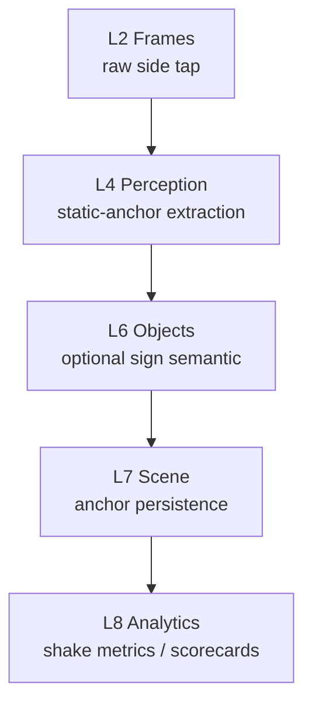
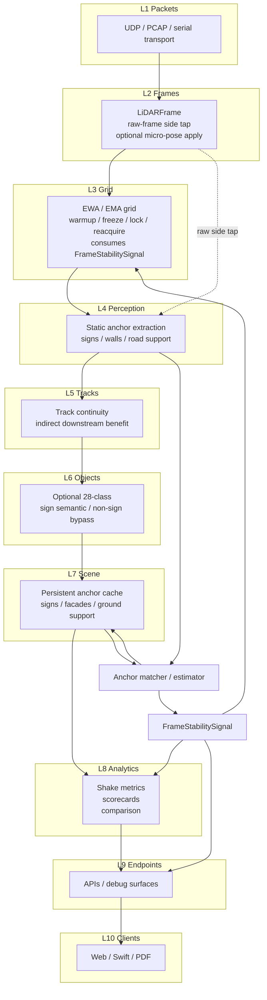
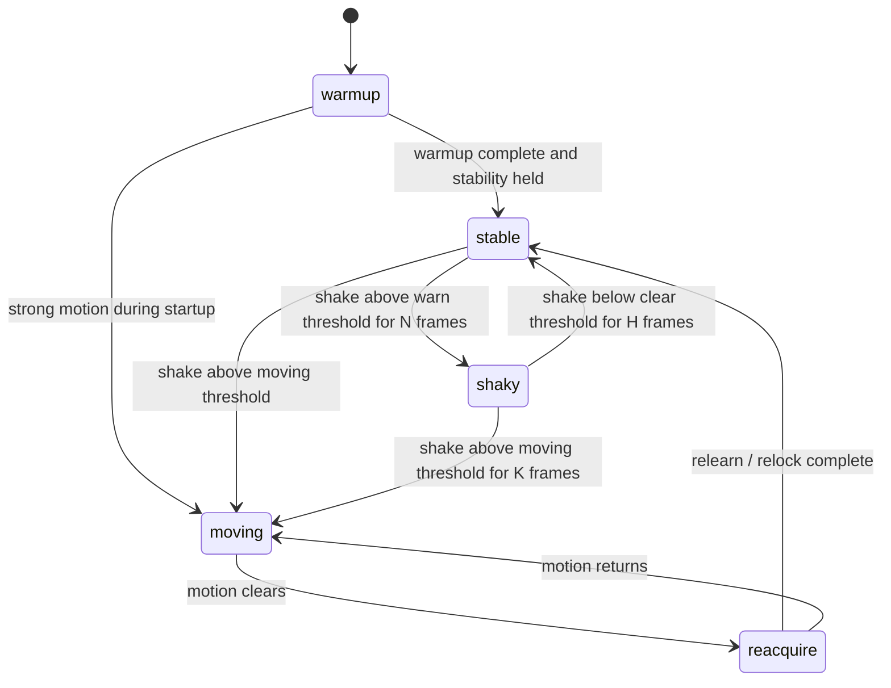
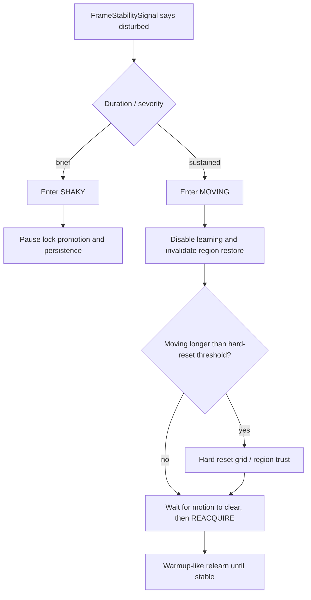

# Reflective Sign and Static Surface Pose Anchors for Static-Sensor Shake Estimation

- **Status:** Proposal Math (Not Active in Current Runtime)
- **Layers:** L2 Frames, L3 Grid, L4 Perception, L5 Tracks, L6 Objects, L7 Scene, L8 Analytics
- **Related:** [Clustering Maths](../clustering-maths.md), [Ground Plane and Vector-Scene Maths](20260221-ground-plane-vector-scene-maths.md), [`docs/lidar/architecture/vector-scene-map.md`](../../lidar/architecture/vector-scene-map.md), [`docs/plans/lidar-l7-scene-plan.md`](../../plans/lidar-l7-scene-plan.md), [`docs/plans/lidar-static-pose-alignment-plan.md`](../../plans/lidar-static-pose-alignment-plan.md), [`docs/data/HESAI_PACKET_FORMAT.md`](../../data/HESAI_PACKET_FORMAT.md)

## 1. Scope and Design Intent

This proposal uses highly reflective traffic signs as the preferred static scene
anchors, but extends to other persistent background surfaces when the scene has
few or no usable signs. The goal is threefold in stationary LiDAR deployments:

1. estimate small frame-to-frame pose perturbations caused by mast sway,
   mount vibration, thermal creep, or timestamp/transform noise;
2. turn those perturbations into explicit shake diagnostics, and optionally a
   small corrective pose update for downstream replay/runtime processing.
3. expose a cached runtime stability signal that lower layers can use to
   suspend learning, invalidate stale assumptions, and accelerate reset /
   reacquisition when the sensor is no longer behaving like a static frame.

The core observation is simple:

- many road signs produce unusually strong returns;
- they are expected to stay fixed in world coordinates;
- they are often approximately planar;
- even when slightly bent, they remain much more stable than vehicles,
  pedestrians, or foliage.

When sign anchors are missing, the next best references are other persistent
background surfaces:

- reflective roadside panels, barriers, and facades;
- large wall/building planes and facade corners;
- ground/road geometry as a support constraint for `z`, `roll`, and `pitch`.

So the intended design is an **anchor ladder**, not a sign-only detector. Signs
remain the highest-confidence anchors because they provide strong reflectivity
and bounded polygons, but the system should degrade into geometry-led
background anchors instead of giving up entirely.

This is **not** a full SLAM proposal and **not** a moving-sensor ego-motion
system. It is a static-sensor micro-alignment proposal for neighbourhood
monitoring.

## 2. Architectural Boundary and Runtime Control

The proposal keeps the existing ten-layer model intact, but it should be read
in two stages: a strict base case and a cache-backed reference case.

### 2.1 Base case: no cache to prior layers

This is the conservative architecture and should be treated as the default
proposal shape until evidence justifies anything stronger.

1. **L2 Frames**
   Provide a raw-frame side tap for static-anchor extraction.
2. **L4 Perception**
   Detect sign, facade, wall, and ground-support anchor candidates from the
   current frame using intensity, planarity, verticality, persistence, and
   occlusion cues.
3. **L6 Objects**
   If AV-style semantics are needed, a true sign candidate may map to the
   28-class `sign` taxonomy here. Non-sign anchors do not require an L6 label.
4. **L7 Scene**
   Persist the anchor as a static polygon, plane patch, edge, or support
   surface with uncertainty, provenance, and accumulated geometry.
5. **L8 Analytics**
   Publish shake amplitudes, anchor residuals, confidence trends, and
   before/after comparison metrics.

In the base case:

- the semantic "sign" label is an L6 object label;
- the persistent anchor used for alignment is an L7 scene feature;
- the shake summary is an L8 analytic;
- L3 and other earlier layers do **not** consume anchor-derived runtime state.

This preserves the strongest version of the layering guarantee: later layers
observe and score the runtime, but they do not feed decisions back into earlier
layers.

### 2.2 Reference case: cached runtime control signal

This is the stronger operational design, but it should be treated as a
reference extension rather than the assumed base architecture.

1. **L2 Frames**
   Still provide the raw-frame side tap, and may optionally consume accepted
   micro-pose corrections before downstream transforms.
2. **L3 Grid**
   Consume a cached per-frame stability signal to modulate warmup, freeze,
   lock, region restore, snapshot persistence, and reset/reacquire policy.
3. **L5 Tracks**
   May optionally consume the stability state for downstream trust/debug
   decisions. Track continuity also helps explain whether apparent motion is
   global frame shake or true object motion.
4. **L7 Scene / L8 Analytics**
   Continue to own anchor persistence, diagnostics, and scoring.

In the reference case, lower-layer consumers still read only a narrow cached
`FrameStabilitySignal`, not the full L7 anchor geometry. That is the intended
containment boundary if the cache is adopted at all.

## 3. Anchor Representation

For anchor `A_j`, maintain:

- anchor type `tau_j in {sign_polygon, reflective_patch, wall_plane, facade_corner, ground_support}`,
- support plane `Pi_j = (n_j, d_j)` with `n_j^T p = d_j`,
- optional 2D polygon / edge / line boundary `B_j` in the local plane coordinate system,
- centroid `c_j`,
- reflectivity summary `(mu_I, sigma_I)`,
- shape roughness / bend score `b_j`,
- covariance or confidence summary `Sigma_j`,
- observation count `N_j`,
- visibility / occlusion history `V_j`.

Recommended persistent representation:

1. primary form: **polygonal sign anchor** in L7 Scene;
2. fallback form: reflective planar patch if the surface is bent, partially
   occluded, or too sparse for a clean polygon;
3. geometry-led form: large wall/facade plane or facade corner anchor;
4. support-only form: ground/road patch or curb/edge support with restricted
   pose authority.

This proposal deliberately prefers polygonal or planar anchors over pure point
landmarks, because static roadside structures usually expose extended surfaces
whose plane, edge, and footprint are themselves useful for alignment and
export. Ground/road anchors are useful too, but they should not be trusted as
the sole basis for full 6-DOF correction.

## 4. Candidate Extraction from Reflectivity and Surface Shape

For frame `t`, let raw point set be `P_t = {p_i, I_i}` where `I_i in [0,255]`
is the LiDAR reflectivity/intensity.

### 4.1 Adaptive reflectivity gate

Start with a simple high threshold:

`I_i >= T_reflect_high`

where `T_reflect_high` is intentionally conservative.

A practical robust variant is:

`T_reflect_high = max(T_abs, Q_q(I_frame))`

where:

- `T_abs` is a fixed absolute threshold,
- `Q_q` is a high frame quantile (for example 0.98 or 0.99).

This preserves the user's desired "quite high" threshold while still allowing
site-specific adaptation when the whole frame is dimmer or brighter than usual.

#### Threshold ladder for sign-poor scenes

If the scene does not contain enough usable sign anchors, do not stop after the
first threshold. Relax the cutoff in a small number of controlled steps:

`T_reflect^(k) = max(T_abs^(k), Q_(q_k)(I_frame))`

with:

- `q_0 > q_1 > ... > q_K`,
- `T_abs^(0) > T_abs^(1) > ... > T_abs^(K)`,
- `K` kept small (for example 2-3 relaxations).

Operational rule:

1. start at the conservative sign threshold;
2. if anchor coverage stays below target for `H_eval` frames, lower the
   threshold one step;
3. once minimum redundancy is met, stop relaxing and hold that band with
   hysteresis;
4. if the floor threshold is reached and coverage is still poor, switch to
   geometry-first wall/building/ground-support search rather than continuing to
   lower the threshold indefinitely.

This gives the system a controlled way to move from "bright signs only" to
"stable background surfaces" without opening the door to every reflective
artifact in the scene.

#### Anchor ladder and fallback families

At each threshold band, search anchor families in this order:

1. sign polygons with strong reflectivity and bounded footprint;
2. reflective but non-semantic planar patches;
3. large persistent wall/building planes and facade corners;
4. ground/road support surfaces used only to stabilize `z`, `roll`, and
   `pitch`.

The anchor estimator should record which family produced the current solution.
That matters because a wall-plane-only solution is less observable than a
distributed sign set, and a road-only solution should be treated as partial
support, not full pose authority.

### 4.2 Local plane fit

For each connected high-intensity patch, compute centroid and covariance using
the same streaming/Welford-friendly approach already used elsewhere:

- `mu <- mean(p_i)`
- `Sigma <- covariance(p_i)`

Let eigenvalues be `lambda_1 >= lambda_2 >= lambda_3`.

Define planarity confidence:

`C_plane = clamp(1 - lambda_3 / (lambda_1 + lambda_2 + lambda_3 + eps), 0, 1)`

### 4.3 Vertical-surface preference

Traffic signs are usually near-vertical planes. If `z_hat` is the up-axis,
prefer normals whose vertical component is small:

`C_vert = 1 - |n · z_hat|`

This is a preference, not a hard law. Tilted signs, bent signs, and imperfect
mounting should down-weight confidence rather than force rejection.

### 4.4 Boundary extraction

Project points onto the best-fit plane and estimate polygon boundary `B` from:

1. convex hull of projected points, or
2. minimum-area rectangle / quadrilateral fit when the hull is noisy.

Store polygon area `A_poly` and perimeter `P_poly` as useful diagnostics.

### 4.5 Static persistence

A true anchor should recur in nearly the same world location across many frames.
For a matched candidate over window `W`, define:

`C_static = matched_frames / W`

and optionally a centroid stability score:

`C_pos = exp(-||mu_t - mu_bar||^2 / (2 * sigma_pos^2))`

### 4.6 Bent or imperfect anchors

Some signs and background surfaces are bent, warped, damaged, or partly
occluded by foliage. Do not force strict flatness. Instead compute a
bend/roughness residual such as:

`b = RMS(point_to_plane_distance)`

and inflate anchor uncertainty when `b` rises.

Decision policy:

1. if `C_plane` high and `b <= tau_bend`, promote to polygon anchor;
2. if reflectivity/static confidence is high but `b > tau_bend`, keep as a
   soft anchor with wider covariance;
3. if both planarity and persistence are weak, reject as non-anchor.

### 4.7 Candidate confidence

One simple combined confidence is:

`q_anchor = q_I * C_plane * C_vert * C_static`

where `q_I` is a normalised reflectivity confidence.

This multiplicative form is intentionally conservative: a candidate should not
become an anchor by intensity alone.

### 4.8 Occlusion-aware anchor eligibility

A truck blocking a sign for a few minutes should not mean the whole frame is
invalid. It should mean that anchor, or that local sector, is temporarily
unusable for pose estimation.

For each anchor maintain visibility state:

- `visible`
- `partially_occluded`
- `occluded`
- `missing`
- `retired`

Practical rule:

1. if a dynamic cluster overlaps the expected anchor ray corridor and returns
   from the anchor drop, mark the anchor `occluded`, not failed;
2. if only part of the surface remains visible, keep it with reduced weight;
3. exclude fully occluded anchors from the current pose fit, but retain them in
   cache for `H_occ_keep` frames;
4. retire only after sustained unexplained absence beyond `H_retire`.

This means one blocked sign removes one constraint set, not the whole scene.
The frame only loses anchor authority when redundancy drops below the minimum
needed for a stable estimate.

## 5. Pose Estimation Against Static Anchors

Let the frame-local micro-pose correction be small twist vector:

`xi_t = [tx, ty, tz, rx, ry, rz]^T`

where:

- `t*` are translations,
- `r*` are small-angle rotations.

For stationary roadside deployments, `rx`, `ry`, and `rz` are often more
important than large translations, but the full small rigid transform is kept
for completeness.

### 5.1 Small-angle transformed point

For observed point `p`, first-order rigid update is:

`p'(xi) ~= p + t + r x p`

where `r x p` is the cross-product rotation term.

### 5.2 Plane residual

For point `p_i` assigned to anchor `A_j`:

`r_plane(i,j) = n_j^T p'_i(xi) - d_j`

This penalizes motion orthogonal to the canonical anchor plane.

### 5.3 Polygon boundary residual

Project `p'_i(xi)` onto the anchor plane and measure in-plane distance to the
canonical polygon:

`r_poly(i,j) = dist_2D(proj_Pi_j(p'_i(xi)), B_j)`

This penalizes lateral drift within the anchor plane when a bounded polygon is
available.

### 5.4 Plane-only and support-anchor residuals

Not every anchor has a clean sign polygon.

- wall/building anchors may contribute plane residuals plus optional edge or
  corner residuals when a facade edge is stable;
- reflective patches may contribute plane residuals and coarse footprint
  residuals;
- road/ground anchors should contribute only low-weight support residuals for
  `z`, `roll`, and `pitch`.

Road support is particularly important in open scenes with no signs, but it is
degenerate for full pose: a single road plane cannot by itself constrain yaw or
in-plane translation strongly enough.

### 5.5 Robust objective

Estimate `xi_t` by minimising:

`J(xi_t) = sum_j sum_i w_ij * rho( lambda_plane_j * r_plane(i,j)^2 / sigma_plane_j^2 + lambda_poly_j * r_poly(i,j)^2 / sigma_poly_j^2 + lambda_edge_j * r_edge(i,j)^2 / sigma_edge_j^2 + lambda_ground_j * r_ground(i,j)^2 / sigma_ground_j^2 ) + xi_t^T Lambda^-1 xi_t`

where:

- `w_ij` is anchor/candidate confidence,
- `lambda_*` terms activate only the residual families supported by anchor type
  `tau_j`,
- `rho` is a robust loss (Huber or Tukey) to suppress partial occlusion,
  bent edges, and bad assignments,
- `Lambda` is a small-motion prior discouraging implausibly large corrections.

Solve with weighted Gauss-Newton or iteratively reweighted least squares.

### 5.6 Correction gating

Accept correction only if:

1. enough independent anchors are visible,
2. residual decreases materially after optimisation,
3. `||t|| <= tau_trans`,
4. `||r|| <= tau_rot`,
5. anchor coverage is not dominated by one tiny patch.

If gating fails, emit diagnostics but do not apply correction.

### 5.7 Minimum redundancy and observability

For runtime use, "enough anchors" should be explicit.

Recommended policy:

1. `K_visible >= 3` independent anchor groups for accepted pose correction;
2. `K_visible == 2` may still publish a stability signal, but should not apply
   geometry correction unless coverage is unusually strong;
3. `K_visible <= 1` is diagnostics-only and should never trigger a hard reset
   by anchor evidence alone.

Independence should mean more than raw count. Require diversity across:

- azimuth sectors,
- depth bands,
- surface normals / plane families.

A good practical guard is: do not trust three clusters on the same wall plane
as equivalent to three anchors spread across different parts of the scene.

## 6. Reference Extension: FrameStabilitySignal Cached Runtime Contract

The base case of this proposal stops at L7/L8 anchor persistence and
diagnostics. Everything in this section is the stronger reference design where
that evidence is cached and published back to earlier runtime layers.

The raw per-frame estimate `xi_t*` is noisy. Maintain filtered estimate:

`xi_hat_t = (1 - alpha) * xi_hat_(t-1) + alpha * xi_t*`

Decompose into low- and high-frequency components:

- `xi_low_t = LPF(xi_hat_t)`
- `xi_high_t = xi_hat_t - xi_low_t`

Interpretation:

1. `xi_low_t` tracks slow mount drift / creep;
2. `xi_high_t` tracks shake / vibration / transient noise.

If lower layers must consume this, the useful artifact is a cached,
hysteresis-aware runtime value:

`FrameStabilitySignal_t = {state, confidence, xi_hat_t, shake_trans_rms, shake_rot_rms, source_flags, suggested_action, hold_frames}`

Suggested states:

- `unknown`
- `stable`
- `shaky`
- `moving`
- `reacquire`

Why cache it:

1. one-frame spikes should not cause grid resets;
2. anchor visibility may drop briefly due to occlusion;
3. L3 needs sustained-state semantics, not raw optimiser output;
4. region restore and background persistence need a held decision with TTL,
   not a single-frame boolean.

Recommended analytics and runtime fields:

- translational shake RMS:
  `shake_trans_rms = RMS(||t_high||)`
- rotational shake RMS:
  `shake_rot_rms = RMS(||r_high||)`
- per-axis RMS (`roll`, `pitch`, `yaw`, `x`, `y`, `z`)
- anchor reprojection RMS before/after correction
- anchor dropout rate
- confidence-weighted anchor count by type
- active threshold band / fallback family

These metrics belong naturally in L8 Analytics, but the cached state itself is
also a runtime control signal for L3/L2.

### 6.1 Why the reference case pushes into L3

Today the grid already has indirect motion heuristics such as foreground-ratio
and locked-baseline drift checks. Those are useful fallbacks, but they are
downstream symptoms:

1. foreground ratio rises after the frame is already inconsistent with the
   settled background;
2. drift against locked baselines appears after cells have already been pushed
   off their old equilibrium.

Anchor-based shake is more direct. It says "the sensor moved" instead of "the
grid is behaving strangely."

### 6.2 Reference data path, anchored to the full L1-L10 stack

If the stability signal is meant to protect L3, anchor extraction cannot rely
only on post-L3 foreground outputs because static reflective surfaces are
exactly the sort of returns L3 may suppress as background.

So the intended data path is:

1. read raw L2 frame,
2. run static-anchor extraction in parallel with L3,
3. match against cached L7 anchors,
4. publish `FrameStabilitySignal`,
5. let L3 consume that signal before it commits to learning/restore actions.

## 7. Unification with EWA / Grid Signals

In the reference case, the cached anchor signal should not replace existing L3
EWA/EMA evidence. It should modulate it.

Existing L3 cell state already tracks:

- mean range `mu_c`,
- spread `s_c`,
- confidence `n_c`,
- freeze state,
- recent foreground pressure,
- locked baseline state.

These remain useful because they capture **cell-local** behaviour. The new
anchor signal is different: it is a **global frame-stability** estimate.

Anchor confidence should also carry its source mix. A frame supported by three
distributed sign or wall anchors should count differently from one supported
only by a weak road plane.

### 7.1 Separation of roles

Use the signals this way:

1. **Anchor signal**
   - primary detector of sensor shake / pose disturbance,
   - global, frame-level, direct physical interpretation.
2. **Foreground-ratio signal**
   - corroborating or fallback detector,
   - useful when anchors are not visible.
3. **Locked-baseline drift signal**
   - slower integrity check,
   - useful for detecting stale restored baselines or environmental change.

### 7.2 Fused movement score

Let:

- `M_anchor` come from rotational/translational shake relative to configured
  thresholds,
- `M_fg` come from foreground-ratio excess,
- `M_drift` come from drift-ratio excess.

Recommended fusion:

1. if anchor confidence is high:
   `M_frame = max(M_anchor, min(M_fg, M_drift))`
2. if anchor confidence is low, too occluded, or no anchors are visible:
   `M_frame = max(M_fg, M_drift)`

Interpretation:

- a strong anchor-based disturbance is enough on its own;
- grid-only evidence should be more conservative and ideally corroborated.

Define frame stability confidence:

`S_frame = 1 - M_frame`

### 7.3 How `S_frame` should affect EWA/EMA learning

Do not feed shake directly into cell means/spreads. Instead use it as a global
policy gate:

- learning-rate modulation:
  `alpha_eff = alpha_base * g_alpha(S_frame)`
- lock promotion enabled only when:
  `S_frame >= T_lock`
- snapshot persistence enabled only when:
  `state in {stable}`
- region restore enabled only when:
  `state in {stable, shaky}` and held stable long enough
- background learning disabled when:
  `state == moving`

This preserves the meaning of the EWA grid while making it stability-aware.

### 7.4 Why this is consistent with the settling direction

This matches the logic in the unified-settling proposal: one shared
observation-confidence/lifecycle substrate controls warmup, freeze, and
reacquire, while different model outputs remain distinct.

In that framing, the shake signal is a new input to the shared lifecycle
controller, not a replacement for the underlying L3 statistics.

### 7.5 Occlusion is not motion

Loss of anchor visibility should not by itself imply that the sensor moved.
Instead:

1. occlusion lowers anchor confidence and may remove one sector from the fit;
2. the system then leans more heavily on `M_fg` and `M_drift`;
3. only if the remaining evidence says the frame is disturbed should the state
   machine move toward `shaky` or `moving`.

This avoids turning "truck parked in front of sign" into a false global reset.

## 8. State Machine and Reset Lifecycle

The grid and regions should react differently to brief shake versus sustained
motion.

### 8.1 State meanings

| State       | Meaning                                  | Grid action                                                    | Region action                                                  |
| ----------- | ---------------------------------------- | -------------------------------------------------------------- | -------------------------------------------------------------- |
| `warmup`    | Initial or post-reset seeding            | Seed means/spreads, suppress FG output                         | Disable restore; do not trust prior regions yet                |
| `stable`    | Stationary frame with high confidence    | Normal learning, normal lock/lock updates                      | Normal restore / persistence                                   |
| `shaky`     | Static deployment, but disturbed         | Freeze lock promotion, reduce/pause learning, no snapshot save | Keep regions but lower confidence; do not commit new restores  |
| `moving`    | Sensor frame no longer stationary        | Disable learning; mark grid stale                              | Invalidate restored expectations; stop trusting scene restore  |
| `reacquire` | Motion stopped, rebuild stationary model | Accelerated relearn, re-enter warmup-like gating               | Rebuild/refresh regions, require held stability before restore |

### 8.2 Reset policy

Not every disturbance should hard-reset the grid.

Recommended policy:

1. **Short disturbance**
   - enter `shaky`,
   - do not reset,
   - pause lock advancement and persistence.
2. **Sustained disturbance**
   - enter `moving`,
   - disable learning and region restore immediately.
3. **Long enough disturbance**
   - perform hard invalidation:
     - clear lock assumptions,
     - bump background sequence,
     - discard restored-region trust,
     - re-enter `reacquire` / `warmup`.

### 8.3 Sector-level anchor loss

If an anchor is blocked by a truck, bus, or temporary work vehicle, only the
affected anchor sector should be removed from the current anchor fit. That does
not automatically invalidate the rest of the background grid or region model.

The right policy is:

1. keep the unaffected sectors operating normally;
2. mark the blocked anchor sector unavailable for pose estimation;
3. if redundancy remains above threshold, stay `stable` or `shaky`;
4. if redundancy collapses, fall back to grid-only movement evidence;
5. only reset when the fused evidence says the whole frame is no longer
   trustworthy.

### 8.4 Soft vs hard reset

Soft reset / reacquire:

- keep existing cells but stop trusting them,
- accelerate relearning,
- require held stability before lock/restore resume.

Hard reset:

- clear lock state and stale sequence assumptions,
- treat restored grid/regions as invalid,
- start a fresh warmup window.

Hard reset should require both:

1. strong `moving` confidence, and
2. sustained duration above a configurable threshold.

## 9. Expected Benefits

If the anchor model is good, the main gains should be:

1. lower apparent motion of truly static anchors, especially reflective signs;
2. reduced false foreground caused by frame-to-frame mount shake;
3. better stability of static geometry exports and scene accumulation;
4. cleaner diagnosis of whether noise comes from sensor shake, timing jitter,
   or actual scene change.
5. usable stability estimates in scenes with few signs but strong walls,
   facades, or road geometry.

The proposal is especially attractive because it leverages a scene element that
is already common in roadside deployments, but it also gives the system a
controlled fallback path into non-sign static structure rather than leaving
sign-poor scenes unsupported.

## 10. Proposed Runtime Contracts and Data Outputs

Minimum outputs:

1. `StaticAnchorObservation`
   - `anchor_type`
   - centroid
   - plane normal / offset
   - polygon boundary
   - reflectivity summary
   - visibility / occlusion state
   - confidence
2. `PoseAnchorEstimate`
   - raw `xi_t*`
   - filtered `xi_hat_t`
   - accepted / rejected flag
   - residual stats
3. `FrameStabilitySignal`
   - `state`
   - `confidence`
   - `hold_frames`
   - `suggested_action`
   - `source_flags` (`anchor`, `fg_ratio`, `drift`)
   - optional pose delta
4. `ShakeDiagnostics`
   - translational RMS
   - rotational RMS
   - per-anchor residuals
   - anchor count / coverage by type
   - active threshold band / fallback mode

The key runtime contract for lower layers is `FrameStabilitySignal`, not the
full anchor store.

## 11. Config Contract (Proposed)

Suggested future tuning keys:

- `static_anchor_enabled`
- `static_anchor_family_order`
- `static_anchor_intensity_abs_start`
- `static_anchor_intensity_abs_floor`
- `static_anchor_intensity_quantile_start`
- `static_anchor_intensity_quantile_floor`
- `static_anchor_intensity_relax_step_abs`
- `static_anchor_intensity_relax_step_quantile`
- `static_anchor_relax_eval_frames`
- `static_anchor_planarity_min`
- `static_anchor_verticality_min`
- `static_anchor_bend_rms_max`
- `static_anchor_sign_min_area_m2`
- `static_anchor_wall_min_area_m2`
- `static_anchor_ground_support_weight`
- `static_anchor_static_window_frames`
- `static_anchor_min_visible_groups`
- `static_anchor_min_azimuth_sectors`
- `static_anchor_min_depth_bands`
- `static_anchor_occlusion_keep_frames`
- `static_anchor_missing_retire_frames`
- `static_anchor_pose_gate_translation_m`
- `static_anchor_pose_gate_rotation_rad`
- `static_anchor_motion_prior_weight`
- `static_anchor_shake_warn_translation_m`
- `static_anchor_shake_warn_rotation_rad`
- `static_anchor_shake_move_translation_m`
- `static_anchor_shake_move_rotation_rad`
- `static_anchor_state_hold_frames`
- `static_anchor_hard_reset_hold_frames`
- `static_anchor_disable_learning_when_moving`
- `static_anchor_disable_restore_when_shaky`
- `static_anchor_apply_correction`

Suggested rollout policy:

1. diagnostics-only first,
2. sign-first threshold ladder second,
3. wall/building/ground fallback third,
4. runtime `FrameStabilitySignal` fourth,
5. offline replay correction fifth,
6. runtime correction only after replay scorecards are stable.

## 12. Evaluation Protocol

Validation should use fixed replay packs spanning:

1. bright-sign scenes,
2. sign-poor scenes with building/facade anchors,
3. open scenes where road/ground support is the only available fallback,
4. occlusion episodes where trucks or buses block one or more anchors for tens
   of seconds to minutes.

Primary scorecard:

1. static-anchor centroid jitter before/after correction,
2. static-anchor plane residual before/after correction,
3. frame-to-frame world jitter of nearby static structures,
4. false foreground rate around active anchor regions,
5. downstream track-jitter deltas for nearby moving traffic,
6. L3 reset/reacquire latency after induced shake,
7. false reset rate during heavy but valid traffic,
8. correction acceptance rate,
9. anchor false-positive rate (license plates, wet surfaces, retroreflective
   clutter),
10. time-to-first-usable-anchor in sign-poor scenes,
11. stability retention during deliberate anchor occlusion,
12. quality delta by anchor family (`sign`, `wall`, `ground_support`).

Required comparisons:

1. no anchor model,
2. fixed high-threshold sign-only model,
3. adaptive threshold sign model,
4. sign + wall/facade fallback model,
5. sign + wall/facade + ground-support model,
6. bent/occluded-anchor tolerant model with inflated covariance.

## 13. Limits and Non-Goals

This proposal does **not** attempt to:

1. replace the static-pose configuration system,
2. solve full ego-motion for a moving sensor,
3. rely on every sign being perfectly planar,
4. treat all high-intensity returns as signs,
5. make L8 responsible for scene geometry storage,
6. let L3 depend directly on L7 polygon objects,
7. pretend that a road plane alone provides full pose observability.

Known failure modes:

1. retroreflective clutter that is not a sign,
2. occluded or partially visible anchor surfaces,
3. large environmental changes (construction, moved sign, temporary signage),
4. frames with too few anchor points,
5. over-correction if one dominant bad anchor is trusted too much,
6. long blank walls that provide weak yaw observability,
7. open road scenes where ground-only support cannot resolve lateral drift.

## 14. Recommended Sequencing

1. **Phase A - Analytics first**
   Detect candidates, persist anchor observations, and publish shake metrics
   without changing runtime geometry or feeding state back to earlier layers.
2. **Phase B - Sign-first threshold ladder**
   Implement the adaptive high-to-mid intensity ladder and record which anchor
   family is active in each frame.
3. **Phase C - Occlusion and fallback anchors**
   Add wall/facade/ground-support families plus explicit occlusion handling and
   redundancy scorecards.
4. **Phase D - Layering decision gate**
   Compare the strict base case against the cache-backed reference case and
   decide whether the runtime back-edge is justified at all.
5. **Phase E - Runtime stability signal**
   Publish cached `FrameStabilitySignal` and let L3 consume it for
   warmup/freeze/reacquire/reset policy, without changing point coordinates.
6. **Phase F - Replay correction**
   Apply `xi_hat_t` during offline replay/export to measure benefit safely.
7. **Phase G - Runtime correction**
   Feed accepted micro-pose updates into the live transform path only if the
   replay scorecard shows a clear win and failure gating is strong.

This keeps the proposal aligned with the repo's metrics-first contract: use the
anchor ladder to explain and measure sensor shake first, then let lower layers
react to that instability, and only then earn the right to correct runtime
geometry.

## 15. Open Questions

1. **Is the cache worth the layering cost?**
   The strict base case keeps the one-direction layer guarantee intact: anchors
   live in L7/L8 and only produce diagnostics. The reference case adds a narrow
   cached back-edge (`FrameStabilitySignal`) into earlier runtime layers such as
   L3. What measured gain in false-reset reduction, reacquire latency, static
   jitter, or operational clarity would justify weakening the "later layers do
   not feed earlier layers" guarantee?
