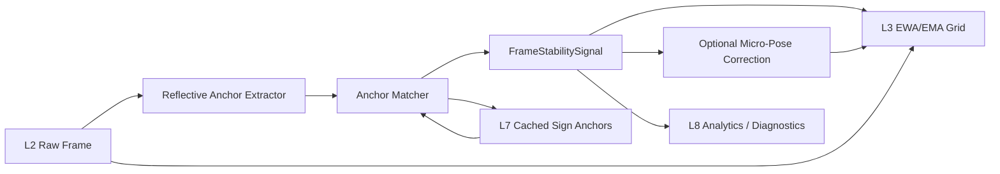
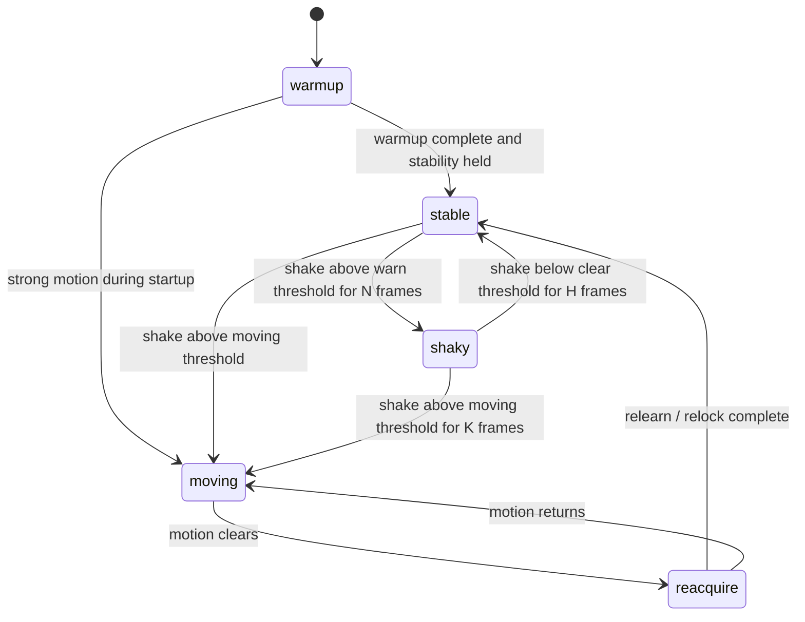
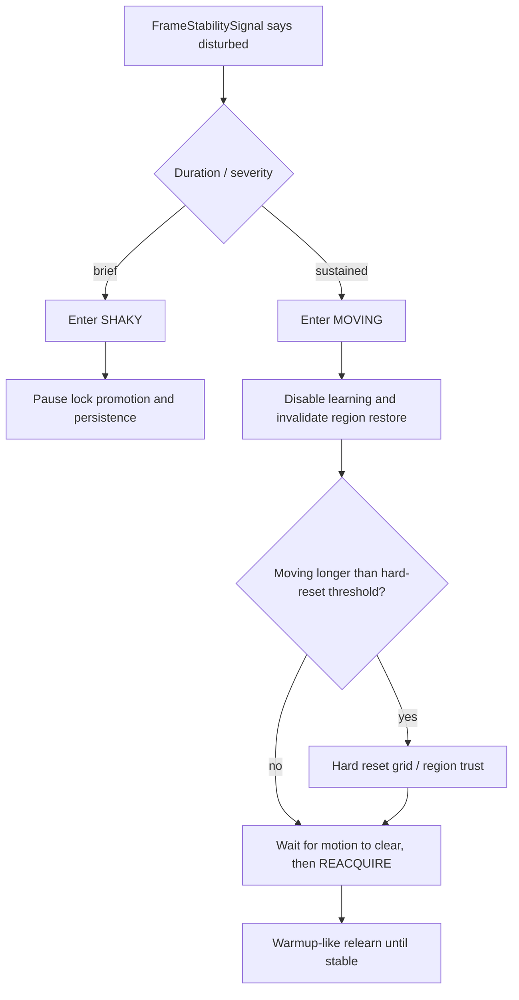

# Reflective Sign Pose Anchors for Static-Sensor Shake Estimation

**Status:** Proposal Math (Not Active in Current Runtime)
**Layers:** L2 Frames, L3 Grid, L4 Perception, L6 Objects, L7 Scene, L8 Analytics
**Related:** [Clustering Maths](../clustering-maths.md), [Ground Plane and Vector-Scene Maths](20260221-ground-plane-vector-scene-maths.md), [`docs/lidar/architecture/vector-scene-map.md`](../../lidar/architecture/vector-scene-map.md), [`docs/plans/lidar-l7-scene-plan.md`](../../plans/lidar-l7-scene-plan.md), [`docs/plans/lidar-static-pose-alignment-plan.md`](../../plans/lidar-static-pose-alignment-plan.md), [`docs/data/HESAI_PACKET_FORMAT.md`](../../data/HESAI_PACKET_FORMAT.md)

## 1. Scope and Design Intent

This proposal uses highly reflective traffic signs as static scene anchors for
three related goals in stationary LiDAR deployments:

1. estimate small frame-to-frame pose perturbations caused by mast sway,
   mount vibration, thermal creep, or timestamp/transform noise;
2. turn those perturbations into explicit shake diagnostics, and optionally a
   small corrective pose update for downstream replay/runtime processing.
3. expose a cached runtime stability signal that lower layers can use to
   suspend learning, invalidate stale assumptions, and accelerate reset /
   reacquisition when the sensor is no longer behaving like a static frame.

The core observation is simple:

- many road signs produce unusually strong returns;
- they are expected to stay fixed in world coordinates;
- they are often approximately planar;
- even when slightly bent, they remain much more stable than vehicles,
  pedestrians, or foliage.

This is **not** a full SLAM proposal and **not** a moving-sensor ego-motion
system. It is a static-sensor micro-alignment proposal for neighbourhood
monitoring.

## 2. Architectural Boundary and Runtime Control

The proposal keeps the existing ten-layer model intact.

1. **L2 Frames**
   Provide a raw-frame side tap for reflective-anchor extraction, and optionally
   consume accepted micro-pose corrections before downstream transforms.
2. **L3 Grid**
   Consume a cached per-frame stability signal to modulate warmup, freeze,
   lock, region restore, snapshot persistence, and reset/reacquire policy.
3. **L4 Perception**
   Detect reflective sign-anchor candidates from the current frame using
   intensity, planarity, verticality, and persistence cues.
4. **L6 Objects**
   If AV-style semantics are needed, the candidate may map to the 28-class
   `sign` taxonomy here. The semantic class remains an L6 concern.
5. **L7 Scene**
   Persist the sign as a static polygonal anchor with uncertainty, provenance,
   and accumulated geometry. The anchor itself belongs in L7, not L8.
6. **L8 Analytics**
   Publish shake amplitudes, anchor residuals, confidence trends, and
   before/after comparison metrics.

This resolves the layer question directly:

- the semantic "sign" label is an L6 object label;
- the persistent polygon used for alignment is an L7 scene feature;
- the shake summary is an L8 analytic;
- the lower-layer consumer should read only a narrow cached
  `FrameStabilitySignal`, not the full L7 anchor geometry.

That last point matters. If L3 must react quickly, it needs a low-bandwidth
runtime control signal, not a dependency on high-level scene storage.

## 3. Anchor Representation

For anchor `A_j`, maintain:

- support plane `Pi_j = (n_j, d_j)` with `n_j^T p = d_j`,
- 2D polygon boundary `B_j` in the local plane coordinate system,
- centroid `c_j`,
- reflectivity summary `(mu_I, sigma_I)`,
- shape roughness / bend score `b_j`,
- covariance or confidence summary `Sigma_j`,
- observation count `N_j`.

Recommended persistent representation:

1. primary form: **polygonal sign anchor** in L7 Scene;
2. fallback form: lower-confidence reflective cluster if the surface is bent,
   partially occluded, or too sparse for a clean polygon.

This proposal deliberately prefers a polygon anchor over a pure point landmark,
because signs are wide, planar surfaces whose boundary is itself useful for
alignment and export.

## 4. Candidate Extraction from Reflectivity and Surface Shape

For frame `t`, let raw point set be `P_t = {p_i, I_i}` where `I_i in [0,255]`
is the LiDAR reflectivity/intensity.

### 4.1 High-reflectivity gate

Start with a simple high threshold:

`I_i >= T_reflect_high`

where `T_reflect_high` is intentionally conservative.

A practical robust variant is:

`T_reflect_high = max(T_abs, Q_q(I_frame))`

where:

- `T_abs` is a fixed absolute threshold,
- `Q_q` is a high frame quantile (for example 0.98 or 0.99).

This preserves the user's desired "quite high" threshold while still allowing
site-specific adaptation when the whole frame is dimmer or brighter than usual.

### 4.2 Local plane fit

For each connected high-intensity patch, compute centroid and covariance using
the same streaming/Welford-friendly approach already used elsewhere:

- `mu <- mean(p_i)`
- `Sigma <- covariance(p_i)`

Let eigenvalues be `lambda_1 >= lambda_2 >= lambda_3`.

Define planarity confidence:

`C_plane = clamp(1 - lambda_3 / (lambda_1 + lambda_2 + lambda_3 + eps), 0, 1)`

### 4.3 Vertical-surface preference

Traffic signs are usually near-vertical planes. If `z_hat` is the up-axis,
prefer normals whose vertical component is small:

`C_vert = 1 - |n · z_hat|`

This is a preference, not a hard law. Tilted signs, bent signs, and imperfect
mounting should down-weight confidence rather than force rejection.

### 4.4 Boundary extraction

Project points onto the best-fit plane and estimate polygon boundary `B` from:

1. convex hull of projected points, or
2. minimum-area rectangle / quadrilateral fit when the hull is noisy.

Store polygon area `A_poly` and perimeter `P_poly` as useful diagnostics.

### 4.5 Static persistence

A true anchor should recur in nearly the same world location across many frames.
For a matched candidate over window `W`, define:

`C_static = matched_frames / W`

and optionally a centroid stability score:

`C_pos = exp(-||mu_t - mu_bar||^2 / (2 * sigma_pos^2))`

### 4.6 Bent or imperfect signs

Some signs are bent, warped, damaged, or partly occluded by foliage. Do not
force strict flatness. Instead compute a bend/roughness residual such as:

`b = RMS(point_to_plane_distance)`

and inflate anchor uncertainty when `b` rises.

Decision policy:

1. if `C_plane` high and `b <= tau_bend`, promote to polygon anchor;
2. if reflectivity/static confidence is high but `b > tau_bend`, keep as a
   soft anchor with wider covariance;
3. if both planarity and persistence are weak, reject as non-anchor.

### 4.7 Candidate confidence

One simple combined confidence is:

`q_anchor = q_I * C_plane * C_vert * C_static`

where `q_I` is a normalized reflectivity confidence.

This multiplicative form is intentionally conservative: a candidate should not
become an anchor by intensity alone.

## 5. Pose Estimation Against Static Anchors

Let the frame-local micro-pose correction be small twist vector:

`xi_t = [tx, ty, tz, rx, ry, rz]^T`

where:

- `t*` are translations,
- `r*` are small-angle rotations.

For stationary roadside deployments, `rx`, `ry`, and `rz` are often more
important than large translations, but the full small rigid transform is kept
for completeness.

### 5.1 Small-angle transformed point

For observed point `p`, first-order rigid update is:

`p'(xi) ~= p + t + r x p`

where `r x p` is the cross-product rotation term.

### 5.2 Plane residual

For point `p_i` assigned to anchor `A_j`:

`r_plane(i,j) = n_j^T p'_i(xi) - d_j`

This penalizes motion orthogonal to the canonical sign plane.

### 5.3 Polygon boundary residual

Project `p'_i(xi)` onto the anchor plane and measure in-plane distance to the
canonical polygon:

`r_poly(i,j) = dist_2D(proj_Pi_j(p'_i(xi)), B_j)`

This penalizes lateral drift within the sign plane.

### 5.4 Robust objective

Estimate `xi_t` by minimizing:

`J(xi_t) = sum_j sum_i w_ij * rho( r_plane(i,j)^2 / sigma_plane_j^2 + r_poly(i,j)^2 / sigma_poly_j^2 ) + xi_t^T Lambda^-1 xi_t`

where:

- `w_ij` is anchor/candidate confidence,
- `rho` is a robust loss (Huber or Tukey) to suppress partial occlusion,
  bent edges, and bad assignments,
- `Lambda` is a small-motion prior discouraging implausibly large corrections.

Solve with weighted Gauss-Newton or iteratively reweighted least squares.

### 5.5 Correction gating

Accept correction only if:

1. enough independent anchors are visible,
2. residual decreases materially after optimization,
3. `||t|| <= tau_trans`,
4. `||r|| <= tau_rot`,
5. anchor coverage is not dominated by one tiny patch.

If gating fails, emit diagnostics but do not apply correction.

## 6. FrameStabilitySignal: Cached Runtime Contract

The raw per-frame estimate `xi_t*` is noisy. Maintain filtered estimate:

`xi_hat_t = (1 - alpha) * xi_hat_(t-1) + alpha * xi_t*`

Decompose into low- and high-frequency components:

- `xi_low_t = LPF(xi_hat_t)`
- `xi_high_t = xi_hat_t - xi_low_t`

Interpretation:

1. `xi_low_t` tracks slow mount drift / creep;
2. `xi_high_t` tracks shake / vibration / transient noise.

If lower layers must consume this, the useful artifact is a cached,
hysteresis-aware runtime value:

`FrameStabilitySignal_t = {state, confidence, xi_hat_t, shake_trans_rms, shake_rot_rms, source_flags, suggested_action, hold_frames}`

Suggested states:

- `unknown`
- `stable`
- `shaky`
- `moving`
- `reacquire`

Why cache it:

1. one-frame spikes should not cause grid resets;
2. anchor visibility may drop briefly due to occlusion;
3. L3 needs sustained-state semantics, not raw optimizer output;
4. region restore and background persistence need a held decision with TTL,
   not a single-frame boolean.

Recommended analytics and runtime fields:

- translational shake RMS:
  `shake_trans_rms = RMS(||t_high||)`
- rotational shake RMS:
  `shake_rot_rms = RMS(||r_high||)`
- per-axis RMS (`roll`, `pitch`, `yaw`, `x`, `y`, `z`)
- anchor reprojection RMS before/after correction
- anchor dropout rate
- confidence-weighted sign count per frame

These metrics belong naturally in L8 Analytics, but the cached state itself is
also a runtime control signal for L3/L2.

### 6.1 Why L3 should not wait for symptoms

Today the grid already has indirect motion heuristics such as foreground-ratio
and locked-baseline drift checks. Those are useful fallbacks, but they are
downstream symptoms:

1. foreground ratio rises after the frame is already inconsistent with the
   settled background;
2. drift against locked baselines appears after cells have already been pushed
   off their old equilibrium.

Anchor-based shake is more direct. It says "the sensor moved" instead of "the
grid is behaving strangely."

### 6.2 Raw-frame side path

If the stability signal is meant to protect L3, anchor extraction cannot rely
only on post-L3 foreground outputs because static reflective signs are exactly
the sort of returns L3 may suppress as background.

So the intended data path is:

1. read raw L2 frame,
2. run reflective-anchor extraction in parallel with L3,
3. match against cached L7 anchors,
4. publish `FrameStabilitySignal`,
5. let L3 consume that signal before it commits to learning/restore actions.

## 7. Unification with EWA / Grid Signals

The anchor signal should not replace existing L3 EWA/EMA evidence. It should
modulate it.

Existing L3 cell state already tracks:

- mean range `mu_c`,
- spread `s_c`,
- confidence `n_c`,
- freeze state,
- recent foreground pressure,
- locked baseline state.

These remain useful because they capture **cell-local** behavior. The new
anchor signal is different: it is a **global frame-stability** estimate.

### 7.1 Separation of roles

Use the signals this way:

1. **Anchor signal**
   - primary detector of sensor shake / pose disturbance,
   - global, frame-level, direct physical interpretation.
2. **Foreground-ratio signal**
   - corroborating or fallback detector,
   - useful when anchors are not visible.
3. **Locked-baseline drift signal**
   - slower integrity check,
   - useful for detecting stale restored baselines or environmental change.

### 7.2 Fused movement score

Let:

- `M_anchor` come from rotational/translational shake relative to configured
  thresholds,
- `M_fg` come from foreground-ratio excess,
- `M_drift` come from drift-ratio excess.

Recommended fusion:

1. if anchor confidence is high:
   `M_frame = max(M_anchor, min(M_fg, M_drift))`
2. if anchor confidence is low or no anchors are visible:
   `M_frame = max(M_fg, M_drift)`

Interpretation:

- a strong anchor-based disturbance is enough on its own;
- grid-only evidence should be more conservative and ideally corroborated.

Define frame stability confidence:

`S_frame = 1 - M_frame`

### 7.3 How `S_frame` should affect EWA/EMA learning

Do not feed shake directly into cell means/spreads. Instead use it as a global
policy gate:

- learning-rate modulation:
  `alpha_eff = alpha_base * g_alpha(S_frame)`
- lock promotion enabled only when:
  `S_frame >= T_lock`
- snapshot persistence enabled only when:
  `state in {stable}`
- region restore enabled only when:
  `state in {stable, shaky}` and held stable long enough
- background learning disabled when:
  `state == moving`

This preserves the meaning of the EWA grid while making it stability-aware.

### 7.4 Why this is consistent with the settling direction

This matches the logic in the unified-settling proposal: one shared
observation-confidence/lifecycle substrate controls warmup, freeze, and
reacquire, while different model outputs remain distinct.

In that framing, the shake signal is a new input to the shared lifecycle
controller, not a replacement for the underlying L3 statistics.

## 8. State Machine and Reset Lifecycle

The grid and regions should react differently to brief shake versus sustained
motion.

### 8.1 State meanings

| State       | Meaning                                  | Grid action                                                    | Region action                                                  |
| ----------- | ---------------------------------------- | -------------------------------------------------------------- | -------------------------------------------------------------- |
| `warmup`    | Initial or post-reset seeding            | Seed means/spreads, suppress FG output                         | Disable restore; do not trust prior regions yet                |
| `stable`    | Stationary frame with high confidence    | Normal learning, normal lock/lock updates                      | Normal restore / persistence                                   |
| `shaky`     | Static deployment, but disturbed         | Freeze lock promotion, reduce/pause learning, no snapshot save | Keep regions but lower confidence; do not commit new restores  |
| `moving`    | Sensor frame no longer stationary        | Disable learning; mark grid stale                              | Invalidate restored expectations; stop trusting scene restore  |
| `reacquire` | Motion stopped, rebuild stationary model | Accelerated relearn, re-enter warmup-like gating               | Rebuild/refresh regions, require held stability before restore |

### 8.2 Reset policy

Not every disturbance should hard-reset the grid.

Recommended policy:

1. **Short disturbance**
   - enter `shaky`,
   - do not reset,
   - pause lock advancement and persistence.
2. **Sustained disturbance**
   - enter `moving`,
   - disable learning and region restore immediately.
3. **Long enough disturbance**
   - perform hard invalidation:
     - clear lock assumptions,
     - bump background sequence,
     - discard restored-region trust,
     - re-enter `reacquire` / `warmup`.

### 8.3 Soft vs hard reset

Soft reset / reacquire:

- keep existing cells but stop trusting them,
- accelerate relearning,
- require held stability before lock/restore resume.

Hard reset:

- clear lock state and stale sequence assumptions,
- treat restored grid/regions as invalid,
- start a fresh warmup window.

Hard reset should require both:

1. strong `moving` confidence, and
2. sustained duration above a configurable threshold.

## 9. Expected Benefits

If the anchor model is good, the main gains should be:

1. lower apparent motion of truly static reflective signs;
2. reduced false foreground caused by frame-to-frame mount shake;
3. better stability of static geometry exports and scene accumulation;
4. cleaner diagnosis of whether noise comes from sensor shake, timing jitter,
   or actual scene change.

The proposal is especially attractive because it leverages a scene element that
is already common in roadside deployments and strongly visible in intensity
data.

## 10. Proposed Runtime Contracts and Data Outputs

Minimum outputs:

1. `ReflectiveAnchorObservation`
   - centroid
   - plane normal / offset
   - polygon boundary
   - reflectivity summary
   - confidence
2. `PoseAnchorEstimate`
   - raw `xi_t*`
   - filtered `xi_hat_t`
   - accepted / rejected flag
   - residual stats
3. `FrameStabilitySignal`
   - `state`
   - `confidence`
   - `hold_frames`
   - `suggested_action`
   - `source_flags` (`anchor`, `fg_ratio`, `drift`)
   - optional pose delta
4. `ShakeDiagnostics`
   - translational RMS
   - rotational RMS
   - per-anchor residuals
   - anchor count / coverage

The key runtime contract for lower layers is `FrameStabilitySignal`, not the
full anchor store.

## 11. Config Contract (Proposed)

Suggested future tuning keys:

- `sign_anchor_enabled`
- `sign_anchor_intensity_abs_min`
- `sign_anchor_intensity_quantile`
- `sign_anchor_planarity_min`
- `sign_anchor_verticality_min`
- `sign_anchor_bend_rms_max`
- `sign_anchor_min_area_m2`
- `sign_anchor_max_area_m2`
- `sign_anchor_static_window_frames`
- `sign_anchor_pose_gate_translation_m`
- `sign_anchor_pose_gate_rotation_rad`
- `sign_anchor_motion_prior_weight`
- `sign_anchor_shake_warn_translation_m`
- `sign_anchor_shake_warn_rotation_rad`
- `sign_anchor_shake_move_translation_m`
- `sign_anchor_shake_move_rotation_rad`
- `sign_anchor_state_hold_frames`
- `sign_anchor_hard_reset_hold_frames`
- `sign_anchor_disable_learning_when_moving`
- `sign_anchor_disable_restore_when_shaky`
- `sign_anchor_apply_correction`

Suggested rollout policy:

1. diagnostics-only first,
2. runtime `FrameStabilitySignal` second,
3. offline replay correction third,
4. runtime correction only after replay scorecards are stable.

## 12. Evaluation Protocol

Validation should use fixed replay packs containing one or more bright static
signs visible for long enough to estimate stability.

Primary scorecard:

1. static-sign centroid jitter before/after correction,
2. static-sign plane residual before/after correction,
3. frame-to-frame world jitter of nearby static structures,
4. false foreground rate around static sign regions,
5. downstream track-jitter deltas for nearby moving traffic,
6. L3 reset/reacquire latency after induced shake,
7. false reset rate during heavy but valid traffic,
8. correction acceptance rate,
9. anchor false-positive rate (license plates, wet surfaces, retroreflective
   clutter).

Required comparisons:

1. no anchor model,
2. reflectivity-only anchor model,
3. reflectivity + planarity + persistence model,
4. bent-sign tolerant model with inflated covariance.

## 13. Limits and Non-Goals

This proposal does **not** attempt to:

1. replace the static-pose configuration system,
2. solve full ego-motion for a moving sensor,
3. rely on every sign being perfectly planar,
4. treat all high-intensity returns as signs,
5. make L8 responsible for scene geometry storage,
6. let L3 depend directly on L7 polygon objects.

Known failure modes:

1. retroreflective clutter that is not a sign,
2. occluded or partially visible sign surfaces,
3. large environmental changes (construction, moved sign, temporary signage),
4. frames with too few anchor points,
5. over-correction if one dominant bad anchor is trusted too much.

## 14. Recommended Sequencing

1. **Phase A - Analytics first**
   Detect candidates, persist anchor observations, and publish shake metrics
   without changing runtime geometry.
2. **Phase B - Runtime stability signal**
   Publish cached `FrameStabilitySignal` and let L3 consume it for
   warmup/freeze/reacquire/reset policy, without changing point coordinates.
3. **Phase C - Replay correction**
   Apply `xi_hat_t` during offline replay/export to measure benefit safely.
4. **Phase D - Runtime correction**
   Feed accepted micro-pose updates into the live transform path only if the
   replay scorecard shows a clear win and failure gating is strong.

This keeps the proposal aligned with the repo's metrics-first contract: use the
sign anchors to explain and measure sensor shake first, then let lower layers
react to that instability, and only then earn the right to correct runtime
geometry.
