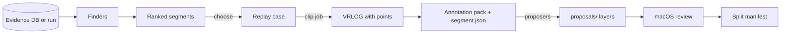

# Annotation segment finder: choosing, cutting and proposing clips

This plan turns "which minute should I label?" from a hand query into a tool: finders rank the
windows of a run or evidence database, one action cuts a clip and an annotation pack from a
chosen window, and the pack arrives with proposals already made.

- **Status:** The v0.5.2 finder, clip, proposal-layer and Segments-page flow is implemented, and
  windows are chosen by selectors defined in a versioned config file; membership-seeded proposals
  and the split manifest remain planned for v0.5.3
- **Layers:** L8 Analytics, L9 Endpoints, L10 Clients (web and macOS), storage
- **Target:** v0.5.2 for the finders, the one-step clip, kept proposals and the Svelte segments
  page, as track T1 of the
  [0.5.2 sprint plan](https://github.com/banshee-data/velocity.report/pull/612), because every
  0.5.2 gate waits on reviewed held-out packs and operator hours are the constraint;
  membership-seeded proposals and the split manifest follow in v0.5.3
- **Companion plans:** [Review workflow](lidar-review-workflow-plan.md), [Point annotation](lidar-point-annotation-and-object-dataset-plan.md), [Worker pool and results hub](lidar-worker-pool-and-results-hub-plan.md), [VRLOG observation format](lidar-vrlog-observation-format-plan.md), [Behaviour analytics](lidar-behaviour-analytics-plan.md)
- **Canonical:** [point-annotation-tool.md](../lidar/operations/point-annotation-tool.md)

## Motivation

The per-frame acceptance run, G-GEO-1, G-SMO-1 and the headway validation all need the same
thing: reviewed, held-out references for vehicles, across more than one site. kirk0 has 61
labelled objects of which 4 are reviewed; the three corpus sites have no pack at all
([per-frame evaluation](../lidar/operations/per-frame-evaluation.md#what-remains)). The labelling
tool is fast once a pack is open. Getting the right pack open is not.

Today an operator who wants to label following vehicles has to guess a minute, replay it from the
command line with the right warm-up, convert a UTC time to an offset into one of several capture
files by hand, export a pack with nanosecond bounds, open it in the macOS window and press
**Propose objects**, whose results are lost when the window closes. Choose the wrong minute and
the hour is spent labelling an empty road.

How much the choice matters: across all of kirk0, 13.5 of the 14.5 pair-seconds of vehicle
following fall in one 10 s window, about 48 to 57 s into the capture. Inside it the followers'
nearest leaders change 33 times, most likely because the car at the head of the line comes back
as three tracks. Those nine seconds are the most valuable in the capture for the tailgating work
and the split problem at once, and nothing pointed at them.

## Baseline before the v0.5.2 implementation

**Finding windows.** Two scripts, no product surface:

- `scripts/lidar-jump-candidates.py` ranks tracks by five-point lateral excursion from
  `lidar_track_observations` into a JSON review queue.
- `scripts/lidar-following-windows.py` (this plan's first delivery) ranks windows of an evidence
  database by vehicle-following pair-seconds, counts how often each follower's nearest leader
  changes (the split signal), and with `--site-index` and `--case` places every window in its
  capture file with the offset `pcap-replay --start-seconds` wants.

Other candidate sources already stored and unused for this purpose: `lidar_run_tracks`
(`is_split_candidate`, `is_merge_candidate`, `linked_track_ids`), `lidar_run_missed_regions`,
the following-interaction tables of migration 000051, and `lidar_capture_motion_periods`.

**Cutting a clip.** Two paths, neither joined up:

- CLI: `velocity lidar pcap-replay` with `--start-seconds`, `--duration-seconds`,
  `--warmup-seconds` and `--include-points` writes a VRLOG 0.5 recording, and with
  `--observations` a VRLOG 1.x container as well. `velocity lidar annotation-export` then cuts the
  pack, taking `--start-ns` and `--end-ns` in capture nanoseconds rather than seconds.
- Server: the **Captures** page makes a replay case (`lidar_replay_cases`: capture files,
  `pcap_start_secs`, `pcap_duration_secs`, site). `POST /api/lidar/scenes/{id}/replay` replays it
  and records a VRLOG by default, and `POST /api/lidar/runs/{id}/annotation-export` cuts a pack
  from the run's recording. No web page calls the export.

The publisher strips background before recording, so a server-recorded pack is `foreground_only`
with periodic background snapshots, which is what the labelling tool expects.

**Proposing.** The macOS `ObjectProposer` clusters the pack's own points on a 0.5 m plan grid,
finds persistent clutter, and chains the rest by footprint carry. It deliberately ignores the
run's clusters and tracks: a VRLOG 0.5 recording keeps cluster boxes, not which returns were in
them, and chaining by tracker identity would copy the tracker's fragmentation into the reference.
Proposals live in memory; only an accepted proposal is written, as `proposed`, and dismissals are
forgotten when the window closes. Go can write proposed records (`annotation.SaveSidecar` accepts
any status) but only a test fixture does.

**Recordings.** VRLOG 1.x (`proto/velocity_recording/v1/recording.proto`) stores per-cluster point
membership for every foreground-complete frame, and reserves ancillary record kinds (bit `0x8000`)
that older readers skip; none is defined. The annotation exporter reads only VRLOG 0.5.

**Jobs.** `internal/lidar/capjobs` runs claimed, cancellable, crash-requeued jobs from
`lidar_capture_jobs`, polled by the Captures page. The worker process declares a `vrlog_record` job
kind (`include_points`, `settle_first`) with no executor. The
[worker pool plan](lidar-worker-pool-and-results-hub-plan.md) specifies `/api/analysis/jobs` and
`/api/annotations/packs` on a hub.

## Findings

| Area             | Current state                                                         | Severity | Release view |
| ---------------- | --------------------------------------------------------------------- | -------- | ------------ |
| Choosing windows | By eye or a hand query; the best window can be nine seconds of eighty | High     | v0.5.2       |
| Time bookkeeping | UTC to capture file and offset to nanoseconds, by hand, across joins  | Medium   | v0.5.2       |
| Clip and pack    | Two commands (CLI) or two endpoints (server) with no link between     | Medium   | v0.5.2       |
| Proposals        | Recomputed per session; dismissals lost; L4 membership never used     | Medium   | v0.5.2       |
| Selection bias   | Windows chosen for tracker failure would flatter any candidate        | High     | v0.5.2       |
| Segment to split | Nothing records why a pack was cut or which split it belongs to       | Low      | v0.5.3       |
| Web surface      | Captures and replay cases exist; no finder, no cut action             | Medium   | v0.5.2       |

## Design / approach

### The flow



A **segment** is a window of one source with a finder's reason and score. Choosing one makes a
replay case, which already names capture files, start and duration: the plan adds no second way
to describe a window. A **clip job** replays the case with points and cuts the pack. Proposers
write layers into the pack. Review stays in the macOS tool.

### Finders

One Go package, `internal/lidar/segments`, with a small interface: a name, a version, its
parameters, and a function from a time-ordered series of `(identity, t, x, y, vx, vy)` to scored
windows. The series comes from `lidar_track_estimates` in an evidence database, or from a server
run: its `lidar_track_observations` if it stored any, and otherwise its VRLOG recording, because
an analysis replay writes no observations. The same finder serves all three.

| Finder              | Scores                                                          | Source                          |
| ------------------- | --------------------------------------------------------------- | ------------------------------- |
| `following`         | Vehicle-following pair-seconds, closest gap                     | Port of the script              |
| `leader_changes`    | A follower's nearest leader changing: split leaders and cut-ins | Same pass                       |
| `lateral_jump`      | Five-point lateral excursion                                    | Port of `lidar-jump-candidates` |
| `split_flags`       | Tracks already flagged as split or merge candidates             | `lidar_run_tracks`              |
| `encounters`        | Stored following encounters and their suppression reasons       | Migration 000051 tables         |
| `arm_disagreement`  | Frames where two estimate versions assign differently           | Two versions, one source        |
| `exposure` (random) | Vehicle presence alone, sampled uniformly                       | Any                             |

`arm_disagreement` is the sharpest for option work: label exactly where the identity options or a
smoother change the answer. `exposure` exists for the held-out rule below.

The script stays as the reference: the Go `following` finder must reproduce its JSON on kirk0
before the script is retired.

### Selectors: ranking as config

A finder measures windows; a **selector** decides which of them to offer, and in what order. The
selectors are defined in one versioned file,
[segment-selectors.defaults.json](../../config/segment-selectors.defaults.json), described in
[SELECTORS.md](../../config/SELECTORS.md). Each has a label and a category for the Segments page,
a finder at its parameters, one measure to rank by, largest or smallest first, and bounds a window
must meet. `close_following` is the first that is not a finder on its own: following within
15 m, ranked by seconds of it, at least two seconds.

Four decisions shape it:

1. **The file composes; the code computes.** A selector names a finder's pass and one of the
   measures that pass computes. It cannot compute anything new, so a selector never needs a
   migration or a release, and a new measure is a change to the code.
2. **Held-out eligibility is decided by code.** Only the standard `following`, `exposure` and
   `random` selectors, at their default parameters, choose held-out windows. The file cannot say
   otherwise, and a held-out request cannot carry parameters: `min_gap` 0 alone would turn
   following into a split detector.
3. **Identity is unchanged.** A window's ID does not name its selector. The six standard
   selectors return exactly what the finders did; a golden test pins every window, order and
   score, so no chosen window, case or pack moved.
4. **Every choice records its selector, as it ran.** Migration 000056 adds `selector_json` to
   the selection, held to the finder and the held-out rule by a CHECK, and the clip job writes it
   into the pack's `segment.json`.

### Held-out windows are not chosen by failure

A window chosen because the baseline tracker fails there flatters any candidate scored on it:
some of the failure was chance and will not recur, whatever changed. So the role is decided
before the window is:

- **Tuning** packs may be chosen by any finder, failure-seeking ones first.
- **Held-out** packs (Embarcadero, and any object-disjoint held-out split of another site) are
  chosen by `exposure` or `following`, stratified by capture, plus at least one uniformly random
  window per capture. They are labelled without tracker overlays.

The finder and its parameters are written into the pack's `segment.json`, so the evaluation can
report how its references were chosen.

### One-step clip

```bash
velocity lidar annotation-clip --pcap FILE[,FILE] --start-seconds S --duration-seconds D --output DIR
```

One command replays with a settled warm-up, records with points (and, when asked, a VRLOG 1.x
container), and cuts the pack over the whole clip, taking its bounds from the replay manifest
rather than from typed nanoseconds. A 20 s clip at 10 Hz fits the exporter's default of 200
samples. It writes `segment.json` beside the pack: finder, version,
parameters, score, the tracks involved and the peak time. The server's clip job is the same code,
registered as the `vrlog_record` worker kind that is declared and not yet executed, or as a
`capjobs` kind on a single host.

### Proposals: simplifications

The operator's hour goes on proposals, so this is where simplification pays.

**1. Propose once, when the pack is made, and keep it.** Proposals become immutable layers in the
pack, `proposals/<algorithm>@<version>.json`, in the sidecar's own schema with every record
`proposed`, as the
[review workflow](lidar-review-workflow-plan.md#one-unit-of-work-the-review-pack) already
specifies. The macOS window loads them instead of recomputing, and records dismissals in
the sidecar so they survive a restart. Recommended for v0.5.2.

**2. Autogenerate in the macOS app until the server can.** When a pack with no proposal layer is
opened, run `ObjectProposer` at once and write its output as `proposals/cluster_chain@1.json`. It
is the existing code and needs no server change; the only new behaviour is saving what it already
computes. Recommended now, and kept as the fallback for packs cut elsewhere.

**3. Seed from the clusterer's membership, not the tracker's identities.** VRLOG 1.x already
stores which returns each L4 cluster held. Teach the exporter to read a 1.x container, or add
member indices to the 0.5 `Cluster`, and each frame's clusters become exact candidate masks with
no re-clustering. Chaining across frames stays footprint carry. Tracker chains are offered only
as a separate, labelled hint layer (`tracker_chain`): where two tracker chains fall on one
footprint chain, the pack says "split here?" rather than silently choosing. Recommended for
v0.5.3.

**4. Open at the segment.** With `segment.json` the window opens on the peak sample, sorts
proposals by overlap with the segment's tracks, and puts the split candidates first. Small, and
it removes the scroll through a few hundred samples.

**5. Freeze the split from the packs.** The role is fixed when the pack is cut, so
`lidar-ground-truth-eval` can write the split manifest from the reviewed objects and the pack
roles instead of an operator writing JSON by hand.

### Why not a proposed-annotation list inside the VRLOG

It was considered and is not recommended. A VRLOG 1.x container is the immutable L4 evidence
log: sealed chunks, digests, a durable frontier, written at capture time. Proposals are derived,
versioned analysis that changes whenever a proposer does. Putting them in the log means either
rewriting sealed containers, which breaks the digests every pack binds to, or proposing at
capture time on the Pi, inside the path that must never wait. The ancillary record kind would
carry them, but the cost is paid in exactly the property the format exists for.

What the idea is after, the clusterer's grouping travelling with the points, is already in the
1.x frame record. Simplification 3 uses it without making a proposal a part of the evidence.

### API and Svelte surface

The web identifies datasets and queues work; it does not create, edit or grade truth, per the
[review workflow](lidar-review-workflow-plan.md#macos-is-the-instrument). The same endpoints serve
the macOS **Choose** step, so the web is never the only way in.

| Method | Path                                  | Purpose                                                    |
| ------ | ------------------------------------- | ---------------------------------------------------------- |
| `GET`  | `/api/lidar/segments/finders`         | Finder names, versions and parameters                      |
| `GET`  | `/api/lidar/segments?run_id=&finder=` | Ranked segments for a run or replay case, computed on read |
| `POST` | `/api/lidar/segments/{id}/case`       | Make a replay case from a segment, with its role           |
| `POST` | `/api/lidar/scenes/{id}/clip`         | Queue a clip job for a replay case                         |
| `GET`  | `/api/annotations/packs`              | Packs with source, role, and objects and masks reviewed    |

A new route, `/app/lidar/segments`, beside Captures and Replay cases:

- **Source and finder.** Pick a run or replay case and a finder; held-out sites offer only the
  permitted finders and hide tracker overlays.
- **Strip.** One row per capture, 10 s cells shaded by score, served as SVG by Go like the
  existing `/api/charts/*` endpoints.
- **Table.** Window, capture and offset, score, the finder's own columns (for `following`:
  pair-seconds, pairs, leaders, leader changes, closest gap) and status.
- **Preview.** Opens the tracks page's scene player on the window, from stored tracks; no points
  needed.
- **Actions.** Make case, cut clip, dismiss. Status runs candidate, case, clipping, packed,
  proposed, reviewed (from the sidecar), frozen (in a split). The
  [workflow UI plan](lidar-ui-workflow-plan.md#pack-status) carries this status to the
  candidates panel on Clips, counts it per clip, and splits "reviewed", now set at the first
  reviewed mask, into "in review" and "reviewed".
- **Open in macOS.** A link that names the pack; the macOS app resolves it through the hub. The
  web Tracks page's "Open in visualiser" uses the same URL scheme, with a run and frame in place
  of the pack.

Segments are computed on read and not stored until chosen. A segment's `{id}` is the digest of
its finder, version, parameters, source and window, so it can be named without being stored, and
a chosen segment becomes a replay case: no new table is needed for the first delivery. Dismissals
need one small table if they must be shared between operators.

### Open questions

1. **Does the web get the cut action?** The review workflow keeps the web to identifying
   datasets and says it builds nothing else there. Cutting a clip writes no truth, so this plan
   reads it as allowed, with the same endpoint behind the macOS **Choose** step. If that reading
   is wrong, the Svelte page keeps the finder, strip and preview, and the cut moves to macOS.
2. **How blind is blind?** Held-out packs are labelled without tracker overlays. The finder that
   chose the window still read tracker output, which is why held-out selection is limited to
   traffic measures and random windows.
3. **Where does `segment.json` live?** Beside the pack keeps the pack digest unchanged and lets a
   pack be re-exported identically. Inside the manifest would make the choice part of the pack's
   identity. This plan takes the first.

## Scope

### Item 1: following-window review queue

**Summary:** Rank windows by following and leader changes, placed in their capture files.

**Steps:**

1. `scripts/lidar-following-windows.py` and its tests
2. Usage in the [annotation tool guide](../lidar/operations/point-annotation-tool.md#choosing-what-to-cut)

**Milestone:** v0.5.2 (this plan's PR)

### Item 2: finders in Go

**Summary:** `internal/lidar/segments` with `following`, `leader_changes`, `lateral_jump`,
`split_flags` and `exposure`, and a `velocity lidar segments` command.

**Steps:**

1. Series readers for `lidar_track_estimates`, `lidar_track_observations` and a run's recording
2. Port `following` and `leader_changes`; parity with the script's JSON on kirk0
3. Port `lateral_jump`; parity with `lidar-jump-candidates.py`
4. `split_flags` and `exposure`; place windows through the replay case's capture files

**Milestone:** v0.5.2

### Item 3: one-step clip and segment record

**Summary:** `velocity lidar annotation-clip`, writing the pack and `segment.json` in one run.

**Steps:**

1. Reuse `replayeval.Run` and `annotation.Export`; bounds from the replay manifest
2. `segment.json` schema, written beside the pack, never inside its digest
3. Server clip job as the `vrlog_record` executor

**Milestone:** v0.5.2

### Item 4: persisted proposals and macOS autogeneration

**Summary:** Proposal layers in the pack, generated on first open, dismissals kept.

**Steps:**

1. Read and write `proposals/*.json` in Go and Swift, digest-bound to the pack
2. macOS: propose on open when no layer exists, save the layer, load layers thereafter
3. Persist dismissals in the sidecar
4. Open at the segment's peak sample; sort proposals by segment overlap

**Milestone:** v0.5.2

### Item 5: membership-seeded proposals

**Summary:** Exact L4 membership as candidate masks; tracker chains as a hint layer only.

**Steps:**

1. Exporter reads VRLOG 1.x, or the 0.5 `Cluster` gains member indices
2. `l4_membership@1` and `tracker_chain@1` layers
3. Measure review time per object against `cluster_chain@1` on the same pack

**Milestone:** v0.5.3

### Item 6: segments API and Svelte page

**Summary:** `/app/lidar/segments` over the endpoints above.

**Steps:**

1. Finder and segment endpoints; segment to replay case; clip job endpoint
2. Pack inventory with review counts from the sidecar
3. Svelte page with strip, table, preview, actions and held-out guard

**Milestone:** v0.5.2, as T1 of the sprint plan; the preview gains the Following distance layer
once that sprint step lands

### Item 7: split manifest from packs

**Summary:** Write the split manifest from pack roles and reviewed objects.

**Steps:**

1. Pack role recorded at cut time
2. `lidar-ground-truth-eval split --packs …` writes a manifest pinned to each sidecar revision

**Milestone:** v0.5.3

### Item 8: selectors as config

**Summary:** Segment selectors defined in a versioned JSON file, labelled and grouped on the page.

**Steps:**

1. Pin every finder's ranking in a golden test
2. Selector file, strict loader, `Rank`, and the held-out rule in code
3. Migration 000056: each selection records its selector; the clip job writes it to the pack
4. `GET /api/lidar/segments/selectors`, `selector=`, `--selector` and `--list-selectors`
5. The page's selector list, grouped by category

**Milestone:** v0.5.2

## Dependencies

- The annotation toolset (#579) and the per-frame harness (#598): the pack, the sidecar, the
  macOS window and the split manifest.
- Evidence databases for the corpus sites, from `make evidence-run`, for finders run offline.
- VRLOG 1.x (#604, #609) for Item 5.
- The worker pool hub for cross-host packs; a single-host `capjobs` kind suffices until then.

## Risks

| Risk                                                | Likelihood | Impact | Mitigation                                                             |
| --------------------------------------------------- | ---------- | ------ | ---------------------------------------------------------------------- |
| Failure-chosen held-out windows flatter candidates  | High       | High   | Role before window; exposure and random finders only for held-out      |
| Tracker-seeded proposals copy fragmentation         | Medium     | High   | L4 membership only; tracker chains as a separate hint layer            |
| Finder scores read as measurements                  | Medium     | Medium | Status `unreviewed_candidates_from_tracker_estimates` on every output  |
| Window placed in the wrong capture across joins     | Low        | Medium | Place through the replay case's own file list; tests at joins          |
| Proposal layers drift from the macOS implementation | Medium     | Low    | Algorithm and version in every layer; one implementation per algorithm |
| The web grows into a second labelling tool          | Low        | Medium | Web writes cases and jobs only; truth is written by the macOS tool     |

## Checklist

### Complete

- [x] Following-window review queue script with synthetic tests, verified on kirk0
- [x] Go finders and `velocity lidar segments` (`M`)
- [x] `velocity lidar annotation-clip` and `segment.json` (`S`)
- [x] Persisted proposal layers, macOS autogeneration on open, kept dismissals (`M`)
- [x] Segments API and `/app/lidar/segments` (`M`)
- [x] Selectors as config: a versioned file of labelled selectors, each choice recording its
      selector (`M`)

### Outstanding

- [ ] Membership-seeded proposals from VRLOG 1.x (`M`)
- [ ] Split manifest from pack roles (`S`)

### Deferred

- [ ] A guard that one window is not chosen for both tuning and held-out packs: role is part of a
      window's ID, so the same seconds can be chosen twice, once for each role
- [ ] Ranking by more than one measure: weights mix units, and need a rule for rounding first

- [ ] Proposal records inside VRLOG containers: rejected above; revisit only if proposals must
      be produced where no pack exists

### Accepted residuals (no action planned)

- Finder scores come from tracker output and inherit its errors. They choose what a person looks
  at; they are never a measurement.
