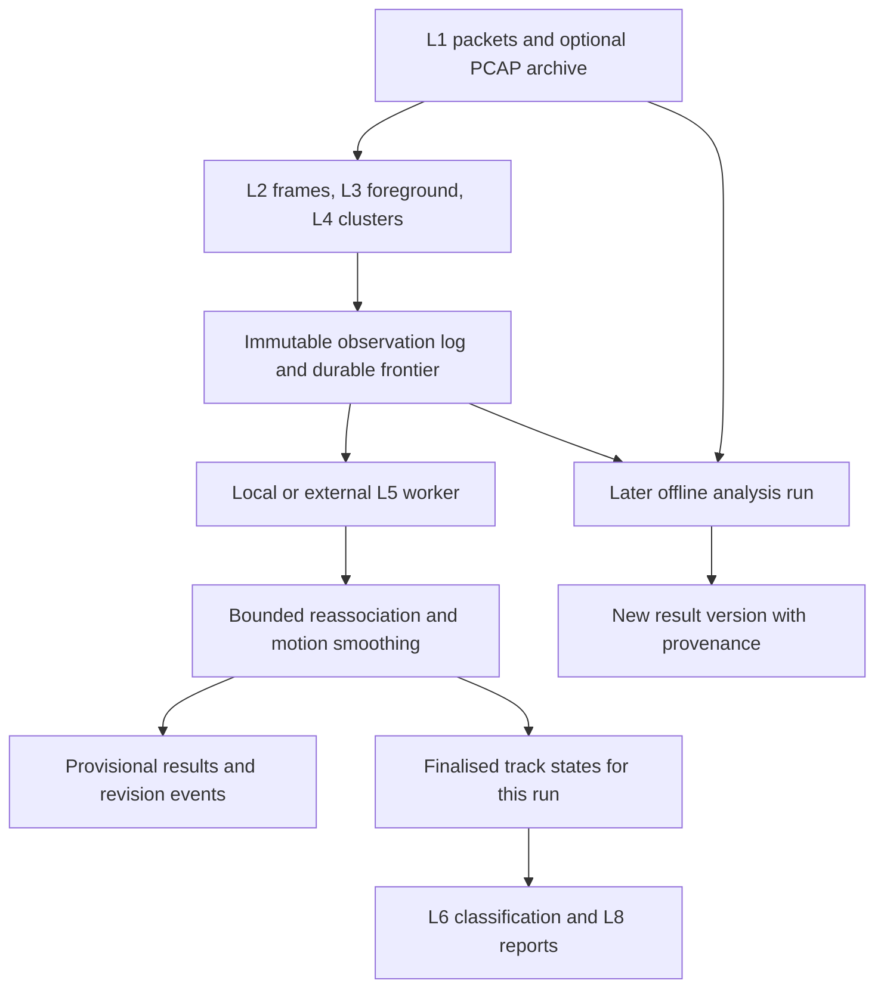

# Cluster observation log and asynchronous tracking

This plan evaluates separating durable LiDAR observations from revisable track estimates. It sets
out what that would buy in accuracy, what evidence must survive the split, and the consequences for
storage, queues, battery operation, and processing elsewhere.

- **Status:** Proposal and sizing study; no runtime changes implemented
- **Layers:** L1–L4 capture and perception; L5–L8 estimation and analytics; L9–L10 delivery
- **Canonical:** [LiDAR architecture](../lidar/architecture/LIDAR_ARCHITECTURE.md)
- **Related:** [Bodies in motion](lidar-bodies-in-motion-plan.md),
  [offline analysis](lidar-offline-analysis-tooling-plan.md),
  [performance measurement](lidar-performance-measurement-harness-plan.md)
- **Evidence baseline:** Repository commit `3c3b1472d`; source inspection, existing benchmark
  documentation, and manufacturer specifications

## Recommendation

Introduce an immutable **observation log after L4**, with an independently scheduled L5+ worker.
Keep cluster measurements and, for the accuracy development profile, their supporting foreground
points. Let the worker revise associations and motion estimates within a bounded interval, then
publish a versioned final result. Capture must continue when the worker stops.

Start with **one second of look-ahead**: 10 subsequent frames at 10 Hz or 20 at 20 Hz. Compare 0.5,
1, and 2 seconds against the present causal tracker before choosing a production default. Twenty
frames is a reasonable experimental upper setting at 10 Hz, not an excessive RAM demand. Its more
significant costs are delayed final results and extra association work.

Keep three deployment modes in scope: capture and estimate locally, capture and send observations
to a worker, and record PCAP for entirely offline processing. The last may be the better backpack
mode when battery life matters more than immediate results. The hardware decision should follow
measurements of capture energy and worst-scene processing cost.

The project gains a repeatable boundary between **what was observed** and **what we currently think
moved through it**. It also takes on a durable queue, result revisions, and explicit completeness
semantics. This is a substantial architecture change, not merely another goroutine.

### Integration on the state-estimation branch

Sprint 0.5.2.2 implements the minimum compatible slice on `dd/docs/state-est`; the
[state-estimation plan](lidar-state-estimation-plan.md#sprint-0522-integration-boundary) owns the
estimator and its acceptance order, while the
[shared VRLOG plan](lidar-vrlog-observation-format-plan.md) owns the canonical observation and
analysis streams. This proposal's one-second look-ahead is an experiment. The state plan's
three-frame fixed-lag comparator stays in the comparison set; select neither as a default before
held-out position, identity, manoeuvre and latency results exist.

Reuse the branch's immutable observation identities, SQLite replay oracle, bounded frame writer,
E1 geometry candidates and per-frame evaluator. Do not promote its capped JSON sample or combined
L4-plus-L5 transaction into the new capture contract: the accuracy profile needs complete
foreground membership and a durable L4 frontier independent of L5. The first worker keeps CV
dynamics, then adds bounded association and body-state revision. A smoother with fixed wrong
assignments is a comparator, not the final accuracy claim. Remote transport, alternative motion
models and deployment tuning follow measured benefit and cost; they are not prerequisites for the
first fixed-site following metric.

## 1. What exists, and where the split belongs

The repository's layer numbers are fixed: L3 separates background from foreground, L4 produces
clusters, and L5 tracks them. A worker consuming clusters starts at **L5**, although it may run a
new L4 interpretation over retained points. Rerunning L3 requires fuller input than cluster data.

| Current evidence                                                                                                                                                                                          | Consequence for this proposal                                                                                                               |
| --------------------------------------------------------------------------------------------------------------------------------------------------------------------------------------------------------- | ------------------------------------------------------------------------------------------------------------------------------------------- |
| [Tracking callback](../../internal/lidar/pipeline/tracking_pipeline.go) performs foreground extraction, filtering, DBSCAN, tracker update, classification, and per-frame SQL transactions in one callback | Extract the observation boundary before tracker update and persistence; scheduling independence alone does not change the estimator         |
| The `detect` profile stops before L5                                                                                                                                                                      | Useful starting boundary, but it does not create the proposed durable cluster stream                                                        |
| [Performance reference](../lidar/operations/performance-regression-testing.md) reports `detect` only 0.3% cheaper than `full` on an 83-second benchmark                                                   | This is historical benchmark evidence, not a measurement here or a battery result; do not promise major savings by removing today's tracker |
| [WorldCluster](../../internal/lidar/l4perception/types.go) carries centroid, dimensions, counts, OBB, and optional sample points                                                                          | OBB and sample points are explicitly in-memory fields; samples are not the complete evidence needed for repair                              |
| [Cluster insert](../../internal/lidar/storage/sqlite/track_store.go) stores summary fields; source search finds no production call to `InsertCluster`                                                     | An existing cluster table is not evidence that clusters are durably recorded today                                                          |
| [L5 association](../../internal/lidar/l5tracks/tracking_association.go) uses a constant-velocity Kalman model, Mahalanobis gates, Hungarian assignment, and velocity limits                               | These provide a baseline, not backward reassociation or a proof of physically valid trajectories                                            |
| Current persistence writes observations only for matched confirmed tracks                                                                                                                                 | Preserve the distinction between observed and predicted samples in the new contract                                                         |
| [Database setup](../../internal/db/db.go) uses WAL, `synchronous=NORMAL`, and a 30-second busy timeout                                                                                                    | The new capture guarantee needs an explicit durability contract; a long SQL wait cannot sit in a UDP capture path                           |
| [VRLOG recorder](../../internal/lidar/l9endpoints/recorder/recorder.go) uses versioned protobuf chunks and an index, downstream of presentation shaping                                                   | Reuse format experience, but audit retained evidence and crash recovery before treating VRLOG as an authoritative observation log           |

The existing [bodies-in-motion plan](lidar-bodies-in-motion-plan.md) covers richer motion models
and linking sparse detections. This proposal supplies the durable input and temporal revision
contract those ideas need. It does not make the planned L7 scene model a prerequisite for L5 work.

## 2. Accuracy: what can be guaranteed

Later observations can clarify which object a cluster belonged to and improve earlier position,
velocity, and shape estimates. They cannot reveal a vehicle that produced no retained evidence, or
prove that a plausible trajectory belongs to the right vehicle. Decoupling creates the time and
replay boundary for better inference; accuracy still has to be demonstrated.

### Motion and measurement are different things

Model the object's latent position, velocity, acceleration, heading, and uncertainty. Model a
cluster as a noisy, partially visible measurement of that object. A centroid may move from the
front to the rear of a vehicle as visibility changes without the vehicle making that movement. A
smoother that treats every centroid as the body centre can produce a neat but biased speed.

Begin with the existing constant-velocity model plus a backward smoother as an ablation baseline.
Then evaluate constant acceleration and turn-rate models, with robust measurement residuals. Only
add an interacting multiple-model estimator if it improves held-out results. Multiple models
increase filter work, but do not alone solve identity ambiguity or enforce hard constraints.

A fixed-lag smoother estimates recent states using subsequent observations. Fixed-lag methods
retain a limited history rather than repeatedly solving the whole recording; see the
[GTSAM fixed-lag documentation](https://borglab.github.io/gtsam/fixedlagsmoother/). Robust
smoothing can also treat outliers in observations and dynamics explicitly; the
[research paper by Farahmand, Giannakis, and Angelosante](https://arxiv.org/abs/1104.5286) is a
useful reference, not a claim that its results transfer to our traffic scenes.

### Separate guarantees from measured accuracy

| Promise                                                  | Mechanism and practical limit                                                                                                                                   |
| -------------------------------------------------------- | --------------------------------------------------------------------------------------------------------------------------------------------------------------- |
| No accepted track contains an out-of-envelope transition | A constrained estimator and an independent validator check every transition, including the boundary with previously finalised states                            |
| No invented measurement during an occlusion              | Mark states as observed, inferred, or unsupported; preserve observation links and uncertainty                                                                   |
| Recent associations can be corrected                     | Keep alternative assignments and rerun the affected window; do not merely smooth an already incorrect identity                                                  |
| One observation is not counted twice                     | Enforce exclusive measurement ownership, with explicit point partitions for a repaired merged cluster                                                           |
| Published results are reproducible                       | Immutable input, ordered frames, fixed configuration, deterministic tie-breaking, seeds, and versioned output; define numerical tolerances across architectures |
| Results are accurate to a stated tolerance               | Demonstrate this with independent reference measurements and uncertainty coverage on held-out scenes                                                            |

For intuition, a position prediction under bounded acceleration has a reachable radius proportional
to `0.5 × a_max × Δt²` around `p + v × Δt`. The acceptance test must also account for uncertain
initial velocity, measurement error, visible-surface shifts, turning, and the true elapsed time.
With `a_max = 10 m/s²`, that acceleration term is 5 cm over 0.1 seconds and 20 m over two seconds.
This illustrates why long gaps need uncertainty and identity evidence, not just a distance gate.

Use actual capture-time intervals across gaps. Numerical substeps may stabilise a long prediction,
but silently shortening elapsed time would invalidate the physical interpretation. A genuine clock
discontinuity or sensor relocation starts a new temporal or pose epoch.

Require consistent integrated position and velocity, finite states, valid covariance, and bounded
speed, acceleration, and turn behaviour over the represented trajectory. Testing frame endpoints
alone is insufficient if interpolation can overshoot between them. Validate the interpolation model
or use one whose entire interval satisfies the constraints. Soft penalties, ordinary Kalman
smoothing, and post-update velocity clipping do not establish these guarantees.

Physical envelopes must be broad, versioned, and appropriate to the uncertain object class. **A
speed limit is not a physical bound.** Road rules, expected lanes, and normal driver behaviour are
soft priors: the system must still measure speeding, sudden braking, and unusual manoeuvres. If no
feasible interpretation exists, flag the segment, retain alternatives, or leave a gap. Do not
silently clamp a measurement into an acceptable report.

Two physically plausible vehicles can still exchange identities. Report ambiguity when the evidence
cannot resolve it. A guarantee of model consistency is achievable; a guarantee of the true path
through every occlusion is not.

### Association within the window

Use spatial gating to form small groups of competing tracks and clusters. In an unambiguous group,
one assignment plus smoothing is sufficient. In an ambiguous group, retain a bounded set of
candidate assignments over time, including misses, births, fragment joins, and cluster splits.
Evaluate candidates against the motion model and retained geometry. Limit candidate count,
iterations, and time per group; record when those limits reduce the search.

A reasonable prototype starts with one candidate for clear groups and up to four for ambiguous
groups. Four is a resource setting to test, not an accuracy theorem. A Kalman or RTS backward pass
with fixed associations is the control experiment; it cannot repair a mistaken assignment by
itself. An unrestricted multi-hypothesis search is unsuitable as the default edge workload.

Example: frames 100–104 show two cars approaching an overlap; 105–108 contain one merged cluster;
109 separates them. The worker can revise the inferred states and associations at 105–108 while
leaving the recorded cluster unchanged. If only a centre and box survived, separating that merged
cluster geometrically may be impossible. Retaining points makes the repair testable.

## 3. Revision window, late data, and finality

Choose the statistical horizon in **capture time**, with a frame-count resource limit. Count
subsequent observations when describing look-ahead, so the meaning is unambiguous.

| Look-ahead intervals | At 10 Hz | At 20 Hz | Intended experiment                                  |
| -------------------- | -------- | -------- | ---------------------------------------------------- |
| 5                    | 0.5 s    | 0.25 s   | Low-latency control; brief visibility changes        |
| 10                   | 1 s      | 0.5 s    | Initial setting for 10 Hz capture                    |
| 20                   | 2 s      | 1 s      | Longer comparison at 10 Hz; initial setting at 20 Hz |

The implementation also needs a boundary anchor and temporary space for the arriving frame. Do not
confuse a budget of 20 stored frames with 20 complete future intervals for every state. Test a time
horizon and its derived frame cap together, including variable RPM and missing frames.

Three delays are independent:

1. **Transport lateness:** a captured frame arrives out of order or a chunk is delayed.
2. **Estimation look-ahead:** future observations clarify an earlier state.
3. **Worker backlog:** processing has not reached already recorded observations.

An occluded object reappearing is new evidence at a later capture time, not a late packet from the
occluded instant. Handle these cases separately. Maintain a contiguous input frontier whose earlier
frame sequences are either present or covered by explicit gap records. Advance a finalisation
watermark only through processed input with sufficient look-ahead. A transport timeout may declare
a gap; wall-clock passage alone must not pretend a missing chunk arrived.

For an otherwise current worker, final delivery delay is approximately look-ahead plus bounded
transport wait, batching, compute, and publication. Backlog adds to that delay. A one-second
smoother processing yesterday's recording still has one second of statistical look-ahead.

Publish provisional states with run, track, revision, capture timestamp, observation references,
uncertainty, and finality. A revision replaces a specified interval and includes identity lineage
when tracks are split or joined. Clients must not splice trails from different revisions into an
apparent jump. Final states must join the frozen boundary consistently; a conflicting later
interpretation becomes a new analysis version, not a silent rewrite of that boundary.

Use finalised results for reports by default. Whole-track classification and summary statistics may
remain pending until track closure, even when an earlier state interval is final. Compute
aggregates from canonical samples after revision; existing running totals cannot simply be updated
again without undoing their previous contribution. Retain user labels separately from temporary
hypotheses and provide lineage or review when identities change.

An occlusion longer than the horizon cannot be fully repaired in the same finalised run. Later
offline analysis may use longer windows or a full-recording pass and publish a new result version.
That provides another route for difficult scenes, with an explicit change in latency and compute.

Late input inside the open horizon triggers recomputation. Input beyond it creates a correction run
or an explicit unapplied-late-data record. At capture end, drain the durable input and worker, then
close the shorter remaining windows with an end-of-capture quality flag. Track separate captured,
durable, transferred, processed, finalised, and reported frontiers. EOF is not completion.

## 4. What the intermediate log must retain

Persist observations independently of provisional tracks. Give the log its own schema version and
retention policy. Store configuration once per segment or by immutable reference, rather than
repeating full configuration and sensor identifiers on every point.

| Record                     | Required information                                                                                                                                                     |
| -------------------------- | ------------------------------------------------------------------------------------------------------------------------------------------------------------------------ |
| Capture manifest           | Capture/session identity, sensor and site, clock source, calibration, pose identity and uncertainty, coordinate frame and units, code/configuration hashes               |
| Frame envelope             | Stable sequence and capture-time bounds, arrival time, point/cluster counts, completeness, packet loss, motion/settling state, crop/filter/subsampling information       |
| Cluster measurement        | Frame-local identity, centroid, OBB and heading ambiguity, shape/count descriptors, measurement uncertainty and quality, links to supporting points                      |
| Point payload when enabled | Coordinates in a declared local frame, acquisition-time offset, intensity, ring, cluster membership or unassigned status; additional return/quality fields when required |
| Explicit absence           | Valid empty frame, missing frame, unsettled background, suppressed processing, and failed computation remain distinguishable                                             |
| Segment footer/index       | Frame range, format/configuration references, checksums, offsets, and committed extent                                                                                   |

Geometric scatter of points is not automatically the covariance of the object-centre measurement.
Calibrate measurement uncertainty against range, view, visibility, and detection quality. Preserve
per-point timing for scan-motion correction: a rotating LiDAR frame is not an instantaneous image.
Record whether coordinates have already been deskewed and which trajectory or pose was used.

Keep these evidence choices explicit:

| Capture product                                                | Later work it supports                                                | Information already lost                                                                      |
| -------------------------------------------------------------- | --------------------------------------------------------------------- | --------------------------------------------------------------------------------------------- |
| Cluster summaries                                              | L5 reassociation and smoothing, classification from saved descriptors | Point-level split/merge repair, new shape features, recovery of discarded detections          |
| Clusters plus foreground points                                | L5 work and a new L4 interpretation of retained foreground            | Returns rejected by L3; usually cannot rebuild the background model or revise raw calibration |
| Foreground points before L4, optionally with proposed clusters | Move most L4 work offline; preserve unassigned and small returns      | Same L3 limitation; higher on-device serialisation volume may offset CPU savings              |
| Full PCAP plus calibration and capture/configuration metadata  | Rerun parsing, L2–L4, and tracking with changed algorithms            | Does not recover packets never captured or reference motion never measured                    |

For the richer profile, retain foreground **before destructive ground filtering, voxel reduction,
and the DBSCAN input cap**, plus their decisions and cluster membership mapping. Otherwise the
worker inherits those losses. The current default cap of 8,000 DBSCAN inputs is a compute setting,
not a safe universal bound on retained evidence. The new record must expose reduction explicitly.

For exact L3 replay, also retain the initial background state or sufficient preceding capture to
reconstruct it, together with the settling and motion decisions. Configuration alone does not
recreate a stateful background model halfway through a recording.

For an initial accuracy study, keep full PCAP on the fixed evaluation corpus and dual-record a
representative field sample. An optional rolling PCAP buffer can preserve difficult intervals, but
triggers need pre-event coverage and cannot guarantee retention of unrecognised failures. The point
log must not be declared a PCAP replacement until its losses have been quantified.

## 5. Storage model: bytes per minute and hour

These are **planning calculations, not measured file sizes**. The large benchmark captures in this
checkout are Git LFS pointers, so no representative capture or codec benchmark was run. All
MB/GB/TB below are decimal; MiB/GiB explicitly mean binary units. Rates describe one sensor.

The [Pandar40P manual, specification pages 14–16][pandar40p] lists 10/20 Hz operation, 720,000
valid points/s in single return, and 1,440,000 in dual return. Its data rates are 18.84 and 37.68
Mbit/s. Those imply 8.478 and 16.956 GB/h before allowing for capture-format details. Budget
roughly **9 GB/h single return or 18 GB/h dual return** for PCAP; verify the actual sensor mode and
capture container before sizing a field deployment.

[pandar40p]: https://www.hesaitech.com/wp-content/uploads/2025/04/Pandar40P_User_Manual_402-en-250410.pdf

### Explicit encoding assumptions

- 128 bytes of amortised frame envelope and index per frame.
- 256 bytes per compact cluster measurement, including uncertainty and provenance references.
- 20 bytes per retained point: XYZ float32 (12), relative time (4), intensity (1), ring (1), and
  frame-local membership (2). Extra return flags or fields may require 24 bytes or side arrays.
- 256 bytes per packed final track-state sample, including state, covariance, identity references,
  and quality. This is a proposed richer record, not the existing SQLite row layout.
- 10 frames/s, no compression, no replication, and no SQLite page/index/WAL overhead.

With `C` clusters/frame, `P` retained points/frame, `T` track states/frame, and frame rate `f`:

`cluster bytes/s = f × (128 + 256C)`

`cluster-and-point bytes/s = f × (128 + 256C + 20P)`

`packed track-state bytes/s = f × 256T`

Multiply bytes/s by `60 / 1,000,000` for MB/min or `3,600 / 1,000,000,000` for GB/h. Cluster counts
describe detections, not traffic throughput: one vehicle may occupy many frames or produce several
clusters, and clutter also produces clusters.

| Illustrative workload                            | C / frame | P / frame | T / frame | Cluster summaries MB/min; GB/h | Clusters + points MB/min; GB/h | Packed track states MB/min; GB/h |
| ------------------------------------------------ | --------: | --------: | --------: | -----------------------------: | -----------------------------: | -------------------------------: |
| Quiet                                            |         2 |       200 |         1 |                    0.38; 0.023 |                    2.78; 0.167 |                      0.15; 0.009 |
| Ordinary                                         |        15 |     3,000 |         8 |                    2.38; 0.143 |                   38.38; 2.303 |                      1.23; 0.074 |
| Busy                                             |        50 |     8,000 |        30 |                    7.76; 0.465 |                  103.76; 6.225 |                      4.61; 0.276 |
| Stress: dense foreground or disturbed background |       150 |    30,000 |        80 |                   23.12; 1.387 |                 383.12; 22.987 |                     12.29; 0.737 |
| Single-return PCAP planning rate                 |         — |         — |         — |                              — |                         150; 9 |                                — |
| Dual-return PCAP planning rate                   |         — |         — |         — |                              — |                        300; 18 |                                — |

The PCAP rows are raw-capture comparisons, not point-log products. Stress is a capacity scenario,
not a claim that the existing capped DBSCAN emits these counts. Retaining pre-cap evidence makes
this stress case possible even when current clustering processes fewer points.

At busy load, summaries are about 19 times smaller than single-return PCAP. The richer evidence log
is only about 1.45 times smaller, and about 23 times the packed track-state stream. Under ordinary
load it is about four times smaller than PCAP; under quiet load about 54 times smaller. In the
stress case the richer log exceeds even the dual-return PCAP budget.

This is possible because wire packets encode ranges compactly, while decoded points repeat XYZ and
timing. At 20 bytes/point, all 720,000 single-return points/s would consume **51.84 GB/h** before
envelopes and clusters. With 50 clusters/frame at 10 Hz, roughly 11,854 retained points/frame
already reach the 2.5 MB/s single-return PCAP budget. Compression and packed polar encodings may
move that boundary; do not book those savings before measuring them.

For 20 Hz, double table rates only if points and clusters **per frame** stay the same. The sensor's
single-return point rate is nominally fixed, so changing RPM commonly reduces points per rotation;
the point component need not double. Use measured per-second counts for each mode.

Final per-object summaries are much smaller still. At an illustrative 1 KB per completed track and
1,000 tracks/hour, they cost about 1 MB/hour. That is a different retention product from per-frame
trajectories. For the current SQLite observations, provisionally budget 300–600 bytes per matched
observation including indexes, then measure the actual schema: 30 matches/frame at 10 Hz would mean
roughly 0.324–0.648 GB/hour, plus track summaries and write amplification. Predicted states, richer
covariance, analysis copies, and labels change that total.

Evaluate compression ratios of 1:1, 2:1, and 3:1 as sensitivity cases, not promised results.
Compression also consumes CPU and energy. At busy load the eight-hour uncompressed evidence capture
is 49.8 GB; retaining single-return PCAP alongside it makes 121.8 GB before results, indexes,
backups, and spare space. An always-retained busy stream writes about 149 GB/day or 54.5 TB/year of
logical evidence, before storage-engine and SSD write amplification.

### Capacity and monetary cost

| Capture product            | Eight hours | Continuous hours in 4 TB with 20% reserved |
| -------------------------- | ----------: | -----------------------------------------: |
| Ordinary clusters + points |     18.4 GB |                     1,390 h, about 58 days |
| Busy clusters + points     |     49.8 GB |                       514 h, about 21 days |
| Stress clusters + points   |    183.9 GB |                      139 h, about 5.8 days |
| Single-return PCAP         |       72 GB |                       356 h, about 15 days |
| Dual-return PCAP           |      144 GB |                      178 h, about 7.4 days |

These are single-product capacity ceilings, not safe retention guarantees. Results, other files,
replicas, filesystem overhead, and incomplete segments consume the same budget. Track summaries can
be retained much longer than point evidence. Do not delete the sole observation copy merely because
one worker has processed it if future reruns remain a requirement.

Use `retained GB = GB/hour × capture hours/day × retention days × copies` for the purchase model.
Divide by the usable fraction of a disk to obtain required nominal capacity, then multiply by a
current local price per TB. Cellular cost is uploaded GB times the tariff plus the plan charge.
Those prices are deployment-specific; the volume model above is the decision input, not a quote.

## 6. RAM, scratch storage, and read/write time

### Put recent inference in RAM and durable evidence on disk

| Placement                                  | Benefit                                                                   | Cost and failure behaviour                                                                                     |
| ------------------------------------------ | ------------------------------------------------------------------------- | -------------------------------------------------------------------------------------------------------------- |
| RAM only                                   | Lowest latency; no disk reads for the window                              | Unsaved evidence disappears on power loss; cannot serve as the unattended capture guarantee                    |
| RAM window plus append-only SSD log        | Fast repeated inference and sequential durable writes                     | Recommended local-worker layout; benchmark flush tails and SSD endurance                                       |
| SSD scratch/cache plus HDD archive         | Keep inference and index activity away from HDD seeks; multi-TB retention | SSD is durable until archive verification; copying adds I/O, power, and deletion coordination                  |
| HDD append log plus RAM window             | Low-cost capacity; modest sequential capture rates                        | Competing readers, seeks, spin-up, vibration, and USB power must be measured; prefer SSD when carried or moved |
| PCAP-only capture, all inference elsewhere | Small capture software path; preserves most reprocessing freedom          | No immediate tracks, larger transfer than compact summaries, separate offline completion workflow              |

For 20 buffered observation frames, payload alone is approximately 0.093 MB quiet, 1.28 MB
ordinary, 3.46 MB busy, and 12.77 MB stress. Add the boundary anchor, arriving frame, decoded
objects, and solver memory. As an explicit allowance, 50 tracks × 20 states × 1–4 KB/state is 1–4
MB for one estimator history, or 4–16 MB for four fully copied candidates. Shared histories can
reduce this. Graph factors, matrix fill-in, and point geometry can increase it.

The current `WorldPoint` has three float64s, an `Intensity uint8`, a `time.Time`, and a string:
approximately 72 bytes per element on a conventional 64-bit Go layout, before backing strings and
additional arrays.
Twenty frames of 8,000 such points alone use about 11.5 MB. Packed wire size is not heap usage.
Allocate separate hard budgets for solver state, serialised handoff, and OS page cache. A 64–256
MiB solver allowance is a starting experiment, not an established minimum machine specification.

An independent 64 MiB serialised handoff buffer, if draining stops, holds about 105 seconds of
ordinary data, 39 seconds busy, or 10.5 seconds stress. Cap it by both bytes and age, for example
64 MiB and two seconds, whichever comes first. It should bridge scheduling and flush stalls, not
conceal a stopped disk. Do not rely on swapping the inference window to make RAM adequate.

### I/O work and transfer floors

Append each observation once. Keep the active inference window in RAM, and write final states once
when they leave it. On a cache hit the worker needs no physical reread of the just-written
observation. A worker catching up reads the log sequentially. Rewriting or rereading the full
20-frame window on each arrival can approach 20 times the logical I/O and should be avoided.
Checkpoint solver state periodically and keep replayable observations; every provisional revision
does not need a synchronous database commit.

If a busy stream writes 1.73 MB/s and a worker catches up at four times capture speed, its input
read rate is 6.92 MB/s. Add result writes, raw capture if enabled, compression, and archive copies.
Bandwidth is modest for many disks, but durable small writes and mixed seeks can still stall. Read
and write throughput figures alone do not establish a safe capture device.

| One hour of evidence, cold sequential read | At an assumed 100 MB/s | At an assumed 500 MB/s |
| ------------------------------------------ | ---------------------: | ---------------------: |
| Ordinary, 2.303 GB                         |                   23 s |                  4.6 s |
| Busy, 6.225 GB                             |                   62 s |                 12.5 s |
| Stress, 22.987 GB                          |                  230 s |                   46 s |
| Single-return PCAP, 9 GB                   |                   90 s |                   18 s |

These are arithmetic transfer floors for either one sequential read or one sequential write. They
are **not HDD/SSD benchmarks** and exclude flush, decode, inference, and contention. A cold read
followed by a rewrite on one device needs roughly twice the transferred bytes. CPU may dominate
offline processing even when data reads take seconds.

Prototype framed binary records in segments rotated at **10 capture seconds or 64 MiB**, whichever
comes first. Let local readers consume complete committed frame batches before segment closure;
otherwise a ten-second segment quietly becomes a ten-second delivery delay. Use independently
decodable batches and permit small committed batches for low-latency network delivery too.

Begin by testing a 250 ms group-commit interval and a separately tested per-frame durable mode. For
group commit, a loss bound of 250 ms only holds when flush finishes on schedule; include measured
flush overrun and stop claiming health if it cannot keep up. Data is durable only after the
required data, metadata, and directory synchronisation has completed and storage honours it.
Checksums detect corruption; they do not make unwritten bytes durable. On restart, recover valid
batches, discard or quarantine torn tails, and rebuild the catalogue from segment evidence.

### Is SQLite right?

**Yes for catalogues, worker checkpoints, labels, jobs, and canonical track results.** It is also a
credible first prototype for summary-only observations or one packed BLOB per frame/batch in a
dedicated database. It is less attractive as a row-per-point store or the shared destination for
continuous point ingestion and every speculative track rewrite.

SQLite WAL permits readers alongside a writer, but there is one writer per database and WAL
requires a local filesystem. Long read transactions can delay checkpoints. `synchronous=FULL` syncs
commits; WAL with `NORMAL` can lose recent commits after power failure. These properties are
documented in [SQLite's WAL reference](https://sqlite.org/wal.html). Use `FULL` for a SQLite-based
authoritative capture prototype, and benchmark it separately from the present rebuildable-results
policy.

Compare two implementations before freezing the format:

1. **Dedicated SQLite observation database:** packed frame/batch BLOBs, minimal time/sequence
   indexes, short batched transactions, one owner for writes, bounded reader transactions. Easiest
   atomic catalogue/payload relationship; measure file growth, WAL peaks, and checkpoints.
2. **Binary segments plus SQLite catalogue:** preferred long-term candidate for point evidence.
   Sequential payload, compression by batch, independent transfer/retry, simple retention by
   segment. More engineering for crash recovery and for keeping files and the catalogue consistent.

In the second design, commit and verify payload first, then index it. Recovery must discover
committed files missing from the catalogue and reject catalogue entries beyond the durable file
extent. The catalogue should be rebuildable; it is not the only record of the bytes captured.
Measure WAL and index amplification rather than assuming a universal SQLite multiplier.

Remote workers receive files or framed streams through an API and return results to the database
owner. Do not open a live SQLite WAL database over SMB/NFS. A central multi-writer fleet service
may later justify a server database; one sensor and a local worker do not require that change. This
distinction is consistent with
[SQLite's deployment guidance](https://www.sqlite.org/whentouse.html).

## 7. Busy streets, queues, and practical limits

Traffic changes worker load even when the LiDAR packet rate barely changes. Points, candidate
clusters, concurrent tracks, and ambiguous overlaps are separate workload variables. Quiet frames
still advance capture time and track ageing. A queue of stationary cars may be difficult despite
low vehicle throughput; foliage, rain, sensor movement, or unsettled background can be harder
still.

State estimation with fixed assignments roughly scales with tracks and window length for a fixed
state dimension. Pairwise association construction scales with clusters × tracks; dense Hungarian
assignment has cubic worst-case scaling in assignment size. Retaining unrestricted alternatives
over time can grow combinatorially. A fixed frame window alone therefore does not bound compute:
gate candidates, cap hypotheses, and measure unresolved ambiguity and timeouts. Sparse graph
methods can also develop dense marginal information; benchmark the actual solver.

In the table's ordinary and busy cases, candidate pairs before gating rise from 120 to 1,500: 12.5
times as many, while the track count rises only 3.75 times. The stress case has 12,000 pairs, 100
times ordinary. These are counts of possible comparisons, not predicted runtime multipliers. They
explain why worker demand can swing much more than stored bytes or traffic counts suggest.

Use the following sizing relation for a workload with measured service capacity:

`backlog growth = arrival frames/s − completed frames/s`

`time to drain = queued frames / (completed frames/s − arrival frames/s)`

The second relation only applies while service exceeds arrival. With changing frame complexity,
track backlog in estimated compute-seconds as well as bytes, frames, and oldest capture time.
Average service greater than average arrival is necessary, but correlated busy periods and thermal
throttling still determine the maximum lag.

Example: 10 Hz input, a worker managing only 5 frames/s for a ten-minute difficult interval, then
25 frames/s on subsequent easier input. The queue grows by 3,000 frames, representing five minutes
of capture; clearing it takes 200 seconds if the effective service rate for the queued work is
indeed 25 frames/s. Busy-format evidence for those 3,000 frames is about 519 MB. Do not infer this
recovery rate merely because the newly arriving scene is quiet: queued difficult frames still cost
what they cost.

Eight hours of entirely deferred processing take two hours on a worker measured at 4× real time. If
another equivalent stream is arriving meanwhile, eight hours of backlog need about 2 h 40 min to
drain at a net 3×. Such ratios must be measured with the chosen estimator and scene mix.

### Queue limits should be policy, not exhaustion

Set independent limits for capture handoff bytes, active solver state, durable unprocessed bytes,
oldest unprocessed age, and total retention. The 20-frame window is not a queue size.

An initial dedicated **256 GB unprocessed-data allowance** covers approximately 111 hours ordinary,
41 hours busy, or 11 hours stress with no worker. With single-return PCAP also written into that
same allowance, busy operation falls to about 16.8 hours. Add explicit room for results, temporary
files, and WAL elsewhere; this example is not a 256 GB physical disk recommendation.

Prototype these operating policies:

- Warn at 70% and seek a worker or transfer at 85% of the unprocessed allowance. In local-live
  mode, also warn when the provisional/final latency target is missed. Offline mode uses the
  capture session's promised retention deadline instead of pretending to be real time.
- Give capture CPU and I/O priority. Pause background exports, analysis reruns, and competing
  workers first. Multiple workers on the same hot device can reduce total throughput.
- At the configured hard limit, never silently overwrite unprocessed evidence. Stop the affected
  capture with a visible reason and reserved space for its final manifest/gap record, or continue a
  preconfigured lower-evidence mode with an explicit boundary and changed guarantees.
- Do not wait for a tracking worker or remote connection in the UDP receive path. UDP has no
  reliable upstream backpressure: once bounded local buffering and disk throughput are exhausted,
  loss or a deliberate capture stop is unavoidable. Log that loss and its time range.

A larger disk buys time during sustained overload; it does not make an unstable service rate
stable. Keep backlog capacity separate from the retained corpus: processing completion need not
release data if the evidence retention period has not expired.

## 8. Battery and hardware choices

Treat a backpack used to transport a sensor to a **stationary observation position** separately
from a sensor collecting data while walking. The latter requires ego-motion estimation, timing, and
scan compensation; a static L3 foreground model can otherwise classify much of the world as moving.
The repository's [moving-sensor architecture](lidar-motion-capture-architecture-plan.md) is future
work. An asynchronous tracker alone does not supply it.

| Mode                                                | Initial hardware envelope to test                                                       | Decision criterion                                                                                                                                                      |
| --------------------------------------------------- | --------------------------------------------------------------------------------------- | ----------------------------------------------------------------------------------------------------------------------------------------------------------------------- |
| Stationary edge capture through L4, local smoothing | Actively cooled Pi-class ARM board or low-power x86; 4–8 GB RAM; SSD for active writes  | L1–L4 capture tails fit 100 ms at 10 Hz or 50 ms at 20 Hz with headroom, while the worker sustains the scene mix without starvation                                     |
| L4 capture on battery, workstation inference later  | Same capture qualification; local worker disabled; SSD or tested stationary HDD archive | Retained evidence and daily transfer fit capacity; measure whether L4 compute and compression beat raw capture energy                                                   |
| L1 PCAP-only backpack recorder                      | Low-power SBC with adequate Ethernet/USB, reliable storage, and power management        | Capture at least the dual-return planning rate of 5 MB/s without loss under worst power/thermal conditions; 2–4 GB RAM is a test candidate, not a qualified requirement |
| External analysis workstation                       | 8–16 GB RAM to start, SSD scratch, scalable CPU                                         | Benchmark nonlinear inference and reruns; no GPU assumption for the proposed classical estimator                                                                        |

RAM capacity is unlikely to be the chief constraint for a one-second window. Capture CPU tails,
durable flush latency, thermal limits, and power delivery matter more. Removing today's L5 does not
remove background processing or DBSCAN. Conversely, richer future smoothing can be expensive enough
that keeping it off the capture device provides a substantial scheduling benefit.

For battery sizing, the manufacturer's manual above specifies **18 W typical for the sensor
alone**, excluding accessories. The following computer, disk, and modem figures are deliberately
assumed engineering budgets, not product specifications or measured modes:

| Illustrative system                | Sensor | Compute, storage, network | Total load | Runtime from 100 Wh at 85% usable delivery | Runtime from 200 Wh |
| ---------------------------------- | -----: | ------------------------: | ---------: | -----------------------------------------: | ------------------: |
| Raw recorder                       |   18 W |                       5 W |       23 W |                                      3.7 h |               7.4 h |
| L4 capture                         |   18 W |                      10 W |       28 W |                                      3.0 h |               6.1 h |
| L4 capture and richer local worker |   18 W |                      18 W |       36 W |                                      2.4 h |               4.7 h |

Use `runtime hours = battery Wh × usable fraction / measured average load W`. Eight hours at 28 W
and 85% delivery needs about **264 Wh nominal**. Add startup peaks, converter losses, temperature,
battery ageing, and reserve appropriate to the measured rig. Meter the entire system at the
battery, including sensor accessories and modem, rather than CPU utilisation alone.

Multi-TB capacity is practical at the data rates above, but a mechanical HDD needs tested power
delivery and suitable handling. Use RAM for the active window and sequential HDD writes; prefer SSD
for a rig that moves during recording. If an SSD stages to a sleeping HDD, measure whether batched
transfers actually reduce total energy. Cellular uploads may cost more energy than the tracking
work they avoid. Choose offline transfer when it gives the better measured duty cycle.

## 9. External workers over LAN or cellular

Offloading is feasible. Send immutable observations with capture timestamps, sequence ranges,
configuration identity, and checksums. Process one ordered stream per sensor/session. A worker does
not need to share the device's wall clock to estimate trajectories, but capture timing and
multi-sensor synchronisation must remain trustworthy.

| Input to worker            | Average link payload at 10 Hz | Upload for eight-hour capture |
| -------------------------- | ----------------------------: | ----------------------------: |
| Busy cluster summaries     |                   1.03 Mbit/s |                       3.72 GB |
| Ordinary clusters + points |                   5.12 Mbit/s |                       18.4 GB |
| Busy clusters + points     |                  13.83 Mbit/s |                       49.8 GB |
| Stress clusters + points   |                  51.08 Mbit/s |                      183.9 GB |
| Single-return PCAP budget  |                     20 Mbit/s |                         72 GB |
| Dual-return PCAP budget    |                     40 Mbit/s |                        144 GB |

### Gigabit LAN

At an **assumed measured application throughput of 100 MB/s**, an eight-hour backlog takes about
3.1 minutes ordinary, 8.3 minutes busy, 30.6 minutes stress, or 12 minutes for single-return PCAP.
At 80 MB/s, multiply these times by 1.25. These figures exclude concurrent capture, inference, and
disk limits. Gigabit's line-rate ceiling is 125 MB/s; actual end-to-end throughput must be
measured. The sensor's own 100BASE-TX connection and the recorder-to-worker gigabit link are
different links; provide the required switch or interfaces and test shared USB bandwidth.

LAN has ample bandwidth for the stated single-sensor live streams. A catch-up worker consuming
stress data at 20× would demand about 128 MB/s, above even gigabit's line-rate ceiling. Fast
offline inference may therefore favour moving the disk, faster networking, or worker-local files.

### Cellular

Use sustained **uplink** measurements, including outages, rather than an advertised download rate.
Reserve at least 30% of measured capacity in the first design: the busy point log needs about 19.8
Mbit/s sustained usable uplink when held to 70% utilisation; ordinary needs about 7.3, stress about
73, and busy summaries about 1.5. That utilisation margin is a planning choice.

A steady 10 Mbit/s uplink carries at most 1.25 MB/s before protocol costs. Against the busy 1.73
MB/s input it falls behind by at least 1.73 GB/hour. During a two-hour outage, the busy log
accumulates about 12.45 GB. At 20 Mbit/s on reconnection, ongoing busy capture leaves only about
0.77 MB/s of ideal spare capacity, so recovery takes at least 4.5 hours. Real overhead, retries,
and lower signal make it longer.

Summary-only offload is inexpensive in bandwidth but gives up much of the geometry repair benefit.
Prefer store-and-forward for rich evidence: summaries for remote health, selected evidence when
useful, and complete transfer on LAN when available. Continuous cellular offload can work at a
qualified site, but should never be required for capture continuity.

### Delivery and worker correctness

- Transfer committed, independently checksummed batches; resume at verified offsets after an
  outage. A receiver acknowledges **durable verified storage**, not merely receipt in RAM.
- Keep local evidence until the required remote acknowledgement and retention policy allow
  deletion. A processed acknowledgement is separate from a stored acknowledgement.
- Use at-least-once jobs with idempotent result keys. Include input hash/range, algorithm,
  configuration, and run identity; reject results from expired leases or superseded workers.
- Commit output and the corresponding processed/finalised checkpoint consistently. Recover by
  replay after a crash without duplicating observations, counts, or reports.
- Parallelise independent captures first. Time partitions within one capture need warm state,
  overlapping look-ahead, exclusive ownership of emitted intervals, and reconciled identity at
  boundaries. An overlap of 20 frames alone does not carry a long-lived track's prior state.
- Authenticate and encrypt transfers, restrict workers to authorised capture data, and apply
  retention to remote copies too. These observations remain spatial evidence about a place;
  offloading changes where the project's locally controlled data resides.

## 10. Evaluation and delivery plan

Deliver a measurable boundary before committing to the most elaborate estimator. Each phase should
produce a reviewable artefact and a decision about the next expense.

| Phase                        | Work and deliverable                                                                                                                                                                                   | Exit decision                                                                                                    |
| ---------------------------- | ------------------------------------------------------------------------------------------------------------------------------------------------------------------------------------------------------ | ---------------------------------------------------------------------------------------------------------------- |
| 1. Measure the boundary      | Representative quiet, ordinary, congested, turning, occluded, poor-weather, and disturbed-background captures; distributions of points/clusters/tracks; per-stage CPU, heap, disk bytes, battery watts | Choose evidence profiles and a measured capacity envelope; identify field hardware able to sustain L1–L4         |
| 2. Replayable observations   | Prototype summaries and rich evidence; compare SQLite BLOBs with binary segments; existing tracker consumes the recorded boundary                                                                      | Equivalent observations and baseline results within declared tolerances; restart, gaps, and hashes verified      |
| 3. Smoothing experiment      | Compare causal tracking, fixed-association smoothing, and bounded reassociation at 0.5/1/2 seconds; test motion models separately                                                                      | Retain the smallest horizon and model that improve accuracy without unacceptable identity or latency regressions |
| 4. Versioned results         | Provisional intervals, finality watermark, split/merge lineage, observed/inferred flags, corrected analytics, client revision handling                                                                 | No mixed-version trails, duplicate counts, silent revisions, or reports over unprocessed data                    |
| 5. Field and external worker | RAM/SSD/HDD modes, CPU/I/O isolation, LAN transfer, simulated cellular conditions, full battery sessions                                                                                               | Qualify specific hardware and publish measured queue, energy, loss, and recovery envelopes                       |
| 6. Retention decision        | Quantify failures recoverable only from PCAP; measure codec compression and total bytes including results                                                                                              | Decide whether and where rich observations can replace routine raw retention                                     |

Accuracy evaluation needs independently aligned reference trajectories or speed measurements; the
existing track output and a visually smooth trail are not ground truth. Use separate tuning and
held-out captures, and score per scenario, range, speed, visibility, and object type. Fix time
alignment before comparing speed. A stronger motion prior can lower jitter while worsening bias.

Record position/velocity error and bias, speed percentile error, detection recall, false tracks,
identity switches, fragmentation, false merges, recovery after occlusion, and uncertainty coverage.
Report inferred versus measured coverage, unresolved cases, constraint rejections, and how often
the candidate budget was exhausted. Measure performance and recall together so discarded difficult
frames cannot masquerade as either faster processing or more accurate results.

Set numerical accuracy acceptance thresholds after measuring reference quality and the baseline,
before tuning candidates. Require zero accepted violations of the declared physical envelope, but
publish rejected/unresolved fractions alongside that invariant. Prefer paired scene-level
comparisons and confidence intervals; an overall average can hide failures on the busiest street.

Resource qualification must include sustained and tail latency for L1–L4, serialise/flush, worker
service time, GC, queue age/bytes, end-to-end final delay, and full-system energy per capture hour.
Measure cold-disk, cache-hit, WAL/checkpoint, and simultaneous ingest/read/export cases. Exercise
disk full, power interruption, damaged tails, duplicate/out-of-order/missing frames, clock jumps,
end-of-capture, source changes, worker restart, long network outages, thermal throttling, and
sensor motion. Demonstrate that overload policy retains its stated guarantees.

This plan is validated as documentation and arithmetic only. It does not establish codec sizes,
compression ratios, track accuracy, device throughput, battery runtime, or production readiness.
