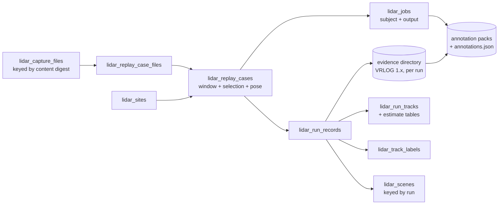

# LiDAR data model simplification: one word per lifecycle stage

- **Status:** Draft, for review. This plan proposes; it changes no code and no schema
- **Layers:** Cross-cutting (SQLite schema, Go stores and API, CLI, Svelte pages, macOS visualiser, docs)
- **Target:** v0.5.8 (layer cleanup + codebase hygiene) for the vocabulary, the renames and the schema merge; the two v0.6.6 publishing plans are amended so archive ingest does not add a third window table
- **Companion plans:** [lidar-replay-case-terminology-alignment-plan](lidar-replay-case-terminology-alignment-plan.md) (superseded by this plan), [lidar-captures-multi-file-cases-plan](lidar-captures-multi-file-cases-plan.md), [lidar-annotation-segment-finder-plan](lidar-annotation-segment-finder-plan.md), [lidar-vrlog-observation-format-plan](lidar-vrlog-observation-format-plan.md), [lidar-scene-catalogue-publishing-plan](lidar-scene-catalogue-publishing-plan.md), [archive-ingest-in-go-plan](archive-ingest-in-go-plan.md)
- **Canonical:** [LIDAR.md § Terminology](../lidar/LIDAR.md#terminology)

A review of the schema and product surfaces that carry LiDAR data from a sensor to a report,
proposing which nouns, tables and routes merge or go, what each change removes, and what is
lost by making it.

## Motivation

The data has a four-stage life. A **capture** arrives from a sensor or a live socket and is kept
for a while. It is processed into **evidence**: the clusters and retained points a VRLOG holds,
kept as long as retention policy allows. The evidence yields **tracks**, which are kept for good.
**Annotations** for training are placed on the evidence, not on the tracks, so that a track the
tracker split in two cannot split the reference it is judged against.

That story is told today with nine nouns, five of which mean more than one thing:

| Word        | Meanings in use today                                                                                                                                                                                               |
| ----------- | ------------------------------------------------------------------------------------------------------------------------------------------------------------------------------------------------------------------- |
| Scene       | A replay case (`/api/lidar/scenes`, `scene_store.go`, `SceneGetter`); a published recording (`lidar_scenes`, `/api/scenes`, `/scene`); the map of capture sites; the geometry L3 fingerprints; the planned L7 layer |
| Case        | A replay case: an authored window over capture files, the unit a run consumes                                                                                                                                       |
| Segment     | A replay case chosen by a finder (`lidar_segment_selections`, 1:1 with a case); a motion or static period in the catalogue plan (`lidar_capture_segments`); a 20-minute published tier                              |
| Capture     | A file; a session of files; a volume (root); the queue for every background job; a path column on a segment; free text on a published scene; the durable frontier of a VRLOG; a moving-sensor recording             |
| Replay      | A case; the act of running a case; VRLOG playback in the visualiser; three routes that stop the same thing                                                                                                          |
| File        | A capture file; a replay case file; the scalar `pcap_file` beside the file list; `pcap/files`, the older listing of the safe directory                                                                              |
| Annotation  | A track label in SQLite (`lidar_replay_annotations`, served as `/api/lidar/labels` with `label_id`); a reviewed point mask on disk (`annotations.json`); a pack; an export                                          |
| Observation | One cluster measurement; the VRLOG 1.x container (`--observations`); the evidence database (`observations.db`); the legacy JSON table (`lidar_observations`); a live track's per-frame row                          |
| Site        | A radar report site (`site`, integer id); a LiDAR capture site (`lidar_sites`, an S2 L16 token)                                                                                                                     |

Each meaning was reasonable when it was added. Together they mean that an operator reading the
navigation sees Captures, Replay Cases, Segments and Scene Map and cannot say which of them
holds the thing they labelled yesterday; that a contributor grepping for `scene` finds 600 Go
identifiers of which a minority concern geometry; and that the two v0.6.6 plans, drafted apart,
each add a window table and a scene table of their own. Without a decision the count goes up
with every feature.

## Current state

### Storage

The generated [schema](../../internal/db/schema.sql) holds 44 tables, 33 of them `lidar_`.
Grouped by the stage they serve:

| Stage      | Tables                                                                                                                                                                                             | Notes                                                                                                                                             |
| ---------- | -------------------------------------------------------------------------------------------------------------------------------------------------------------------------------------------------- | ------------------------------------------------------------------------------------------------------------------------------------------------- |
| Capture    | `lidar_capture_roots`, `lidar_capture_files`, `lidar_capture_sessions`, `lidar_capture_motion_periods`                                                                                             | Files are keyed by a hash of root path and relative path, so a moved volume gets new rows. Sessions and periods are re-derived on every scan      |
| Jobs       | `lidar_capture_jobs`, `lidar_segment_clip_jobs`                                                                                                                                                    | One generic queue named for captures (`kind` is `motion_pass` or `vrlog_record`) and one subject table for the clip kind                          |
| Window     | `lidar_replay_cases`, `lidar_replay_case_files`, `lidar_segment_selections`                                                                                                                        | A case still carries the scalar `pcap_file`, `pcap_start_secs`, `pcap_duration_secs` beside its ordered file list. A selection is 1:1 with a case |
| Run        | `lidar_run_records`, `lidar_run_configs`, `lidar_param_sets`, `lidar_run_tracks`, `lidar_run_missed_regions`, `lidar_replay_evaluations`                                                           | A run names its case, its VRLOG path and its source path                                                                                          |
| Live       | `lidar_tracks`, `lidar_track_observations`, `lidar_clusters`, `lidar_bg_snapshot`, `lidar_bg_regions`                                                                                              | `lidar_clusters` has an `InsertCluster` store method and no caller outside tests; `/api/lidar/clusters` reads it                                  |
| Evidence   | `lidar_observations`                                                                                                                                                                               | The legacy `reduced-cluster-sample` JSON profile. No replayed run has written it since August 2026                                                |
| Estimates  | `lidar_track_estimates`, `lidar_track_residuals`, `lidar_track_estimate_revisions`, `lidar_track_solid_bodies`, `lidar_interaction_events`, `lidar_interaction_instants`, `lidar_exposure_windows` | The long-term track record. Identity columns are repeated across the four estimate tables without a parent key                                    |
| Annotation | `lidar_replay_annotations`                                                                                                                                                                         | Track labels. Point annotations never enter SQLite: they live in a pack's `annotations.json` with its revisions                                   |
| Geography  | `lidar_sites`                                                                                                                                                                                      | Text L16 token. Distinct from the radar `site` table's integer id                                                                                 |
| Published  | `lidar_scenes`                                                                                                                                                                                     | Names its source as free text (`source_capture`) and its site as the radar integer id. Its capture window clips the headway aggregates            |
| Other      | `lidar_tuning_sweeps`, `lidar_migration_rejects`                                                                                                                                                   |                                                                                                                                                   |

Migration 020 created a `lidar_scenes` table that migration 031 renamed to `lidar_replay_cases`.
Migration 039 then created a new `lidar_scenes` for published recordings. The word was renamed
away from one concept and immediately given to another, and the code rename that 031 was meant
to lead never happened: the [terminology plan](lidar-replay-case-terminology-alignment-plan.md)
has stood at "Planned for v0.5.8" since v0.5.0.

On disk there are five artefact families:

| Artefact                     | Layout                                                                 | Written by                                                                | Lifetime                           |
| ---------------------------- | ---------------------------------------------------------------------- | ------------------------------------------------------------------------- | ---------------------------------- |
| Capture file                 | PCAP on a configured root                                              | The capture tool, in ~5-minute rolls                                      | Operator-managed archive           |
| VRLOG 0.5 recording          | `header.json`, `index.bin`, `frames/chunk_NNNN.pb`                     | The recorder during a run; `lidar_run_records.vrlog_path` names it        | Until the run is deleted           |
| VRLOG 1.x evidence container | `manifest`, `chunks/`, `generations/`, `current`                       | `pcap-replay --observations DIR`; `--lidar-observation-dir` (default off) | Retention-bounded (VRLOG plan § 6) |
| Evidence database            | `observations.db` under the evidence directory                         | `lidar-state-estimation-baseline -evidence-dir`; read by the finders      | Per experiment                     |
| Annotation pack              | `pack/` (points, samples, manifest, background) and `annotations.json` | `annotation-export`, `annotation-clip`, the clip job                      | Durable; keyed by digest           |
| Web scene export             | `header.json`, `index.json`, `frames/chunk_NNNN.ndjson.gz`             | `velocity scene export`; indexed by `lidar_scenes`                        | Regenerable                        |

### Surfaces

The LiDAR navigation shows seven pages: Lidar Tracks, Captures, Replay Cases, Segments, Scene
Map, Lidar Runs, Lidar Sweeps. A separate `/scene` route edits published scenes and is not in
the navigation.

The routes that touch the concepts under review, grouped by the noun in the path:

| Path family                                                                                                                         | What it serves                                                                |
| ----------------------------------------------------------------------------------------------------------------------------------- | ----------------------------------------------------------------------------- |
| `/api/lidar/scenes[/{id}/replay,clip,location,evaluations]`                                                                         | Replay cases. The handlers are `handleScenes`, the store methods `ListScenes` |
| `/api/lidar/segments[/finders,selectors,strip,/{id}/case]`                                                                          | Rank windows of a run and make a replay case from one                         |
| `/api/annotations/packs`                                                                                                            | List annotation packs by scanning the packs directory. Outside `/api/lidar/`  |
| `/api/lidar/capture/{roots,scan,sessions,files,session/label,motion-pass,periods,jobs,jobs/cancel}`                                 | The capture index and the job queue                                           |
| `/api/lidar/scene-map`, `/api/lidar/sites/{token}`                                                                                  | Capture sites grouped by S2 cell; a site's canonical pose                     |
| `/api/lidar/labels[/export,/{id}]`                                                                                                  | Track labels, persisted in `lidar_replay_annotations`                         |
| `/api/lidar/runs/{id}[/label,flags,annotation-export]`                                                                              | Runs, their tracks and the pack cut from their VRLOG                          |
| `/api/lidar/pcap/{start,stop,resume_live,files}`, `/api/lidar/replay/stop`, `/api/lidar/vrlog/{load,stop}`, `/api/lidar/playback/*` | Replay control. Three stop paths share one handler                            |
| `/api/scenes[/{id}[/headway]]`                                                                                                      | Published scenes, on the platform API                                         |
| `/api/lidar/tracks`, `/api/lidar/clusters`, `/api/lidar/observations`                                                               | Live tracks; a table with no writer; the legacy evidence table                |

The CLI carries the same words: `velocity lidar pcap-replay --observations DIR --replay-case-id`,
`velocity lidar observations verify|inspect|compare|recover`, `velocity lidar segments`,
`velocity lidar annotation-clip`, `velocity lidar annotation-export`, `velocity scene export`,
and the server flags `--lidar-pcap-dir`, `--lidar-capture-root`, `--lidar-vrlog-dir`,
`--lidar-observation-dir`, `--lidar-annotation-dir`.

The macOS visualiser calls only `/api/lidar/runs/*` and `/api/lidar/labels*`. The web client
calls `/lidar/scenes` at nine sites, `/lidar/segments` at two, and `/scenes` for published scenes.

### Measured facts

| Fact                                                                               | Value                | Source                                                      |
| ---------------------------------------------------------------------------------- | -------------------- | ----------------------------------------------------------- |
| Replay cases whose `source_period_id` names a period that no longer exists         | 24 of 31             | [data model review](../../data/structures/SCHEMA-REVIEW.md) |
| Replay case files that name a `capture_file_id`                                    | 0 of 117             | Same                                                        |
| Replay cases whose first ordered file differs from `pcap_file`                     | 0                    | Same                                                        |
| Completed runs since August 2026 that stored `lidar_observations` rows             | 0 of 67              | Same                                                        |
| Callers of `InsertCluster` outside tests                                           | 0                    | `grep -rn "\.InsertCluster(" --include=*.go`                |
| `scene` substrings in non-test Go under `server`, `storage/sqlite`, `sweep`, `cmd` | about 600            | Upper bound; includes the geometric uses that stay          |
| `scene` substrings in the web source                                               | about 640            | Upper bound; includes the scene player and published scenes |
| Stop routes sharing `handleReplayStop`                                             | 3                    | [routes.go](../../internal/lidar/server/routes.go)          |
| Selection rows per replay case                                                     | at most 1 (`UNIQUE`) | Migration 055                                               |

## Findings

| Area                         | Current state                                                                                                                                                                                | Severity | Release view                                    |
| ---------------------------- | -------------------------------------------------------------------------------------------------------------------------------------------------------------------------------------------- | -------- | ----------------------------------------------- |
| "Scene" means five things    | The API, store and web use it for replay cases; the platform uses it for published recordings; a page uses it for the site map; L3 and L7 use it for geometry                                | High     | v0.5.8: finish the rename; reserve the word     |
| Segment duplicates case      | `lidar_segment_selections` is 1:1 with `lidar_replay_cases` and adds only how the window was chosen. Two IDs, two tables, two pages for one thing                                            | High     | v0.5.8: fold into the case                      |
| Case repeats its file        | `pcap_file`, `pcap_start_secs`, `pcap_duration_secs` sit beside the ordered file table; `session_id` and `source_period_id` are advisory and mostly orphaned                                 | Medium   | v0.5.8: drop; was already due                   |
| Capture identity is a path   | `capture_file_id` is derived from the root path; a moved volume gets new rows, the held-out guard compares paths, and no case file has ever linked to the index                              | Medium   | v0.5.8: content digest as identity              |
| Two job tables, one queue    | `lidar_capture_jobs` serves every kind and borrowed its `session_id` for clips; `lidar_segment_clip_jobs` exists to give one kind a subject                                                  | Medium   | v0.5.8: one queue with a subject                |
| Annotation and label collide | Track labels persist in a table called annotations, served by an API called labels with a `label_id`; point annotations are on disk under `/api/annotations`, outside the LiDAR namespace    | Medium   | v0.5.8: label for tracks, annotation for points |
| Evidence has three homes     | The VRLOG 1.x container, `observations.db` and the legacy `lidar_observations` table all hold L4 evidence; the table is dead for replayed runs and `lidar_clusters` has no writer at all     | Medium   | v0.5.8: one container, two tables dropped       |
| Replay control is spread     | Start, stop and load live under `pcap`, `replay`, `vrlog` and `playback`; three stop paths                                                                                                   | Low      | v0.5.8: one family, aliases removed             |
| Published scene is unlinked  | `lidar_scenes` names its source as free text and its site by the radar integer id; nothing ties it to the run it exported or the case that run consumed                                      | Medium   | v0.6.6: key it to a run                         |
| Drafts add a third window    | The catalogue plan proposes `lidar_capture_files` (a second table by that name), `lidar_capture_segments` and `lidar_scene_exports`; the periods, cases and scenes tables already hold these | High     | Now: amend the drafts                           |
| Two site identities          | `site` (integer) and `lidar_sites` (L16 token) both mean "where"; `lidar_scenes` and `lidar_replay_cases` each point at a different one                                                      | Medium   | Deferred: needs its own audit                   |

## Design / approach

### Principle

One noun per lifecycle stage. A window is an attribute of the thing that owns it, not a noun of
its own. Identity is content, never a path. "Scene" is geometry inside the pipeline and the
public product on the website, and nothing in between.

### Target vocabulary

| Stage     | Noun            | Definition                                                                                                                                 | Stored as                                                                                         | Lifetime          | Replaces                                                                                      |
| --------- | --------------- | ------------------------------------------------------------------------------------------------------------------------------------------ | ------------------------------------------------------------------------------------------------- | ----------------- | --------------------------------------------------------------------------------------------- |
| Raw       | **Capture**     | An immutable file of packets from one sensor. A **capture session** is the run of files whose extents abut. A **volume** is where they sit | PCAP on a volume; `lidar_capture_files`, `lidar_capture_sessions`, `lidar_capture_motion_periods` | Operator-managed  | "root" in operator-facing text; `pcap/files`                                                  |
| Selected  | **Replay case** | An authored window over a capture session: its ordered files, its bounds, where the sensor stood, and, when a finder chose it, how         | `lidar_replay_cases`, `lidar_replay_case_files`                                                   | Durable metadata  | Segment, selection, scene (as case), the scalar `pcap_file`                                   |
| Processed | **Run**         | One pass of the pipeline over a replay case or a live socket, at one configuration                                                         | `lidar_run_records`                                                                               | Durable metadata  | Recording, as a synonym for run                                                               |
| Evidence  | **Evidence**    | The L4 clusters and retained foreground points a run produced, in the VRLOG 1.x container. An **observation** is one record in it          | The evidence directory, named by the run                                                          | Retention-bounded | Observations (as a container name), `observations.db`, `lidar_observations`, `lidar_clusters` |
| Result    | **Track**       | What the run made of the evidence: run tracks, estimates, bodies, interactions                                                             | `lidar_run_tracks` and the estimate tables                                                        | Long-term         | No change                                                                                     |
| Reference | **Annotation**  | A reviewed object mask over a pack cut from a run's evidence. A **label** is a person's verdict on a run track                             | Pack sidecar on disk; `lidar_track_labels`                                                        | Durable           | `lidar_replay_annotations`; `/api/annotations` outside the namespace                          |
| Published | **Scene**       | A recording published to the website, with a place and a time, derived from one run                                                        | `lidar_scenes` keyed to a run                                                                     | Regenerable       | `source_capture` free text; `lidar_scene_exports`                                             |
| Where     | **Site**        | An L16 cell: a junction and its approaches, with a canonical pose                                                                          | `lidar_sites`                                                                                     | Durable           | "Scene map" as a page name                                                                    |
| Work      | **Job**         | Background work over any subject: a motion pass over a session, a clip of a case                                                           | `lidar_jobs`                                                                                      | Until finished    | `lidar_capture_jobs`, `lidar_segment_clip_jobs`, `vrlog_record` as a kind name                |

"Replay case" stays as the noun for the authored window. It is what the schema, the navigation,
the S2 types (`SiteCase`, `CaseLocation`) and every operator document have said since v0.5.0.
The alternative, "clip", was considered and rejected: it already names the 30-second published
tier, the job that cuts a pack, and the CLI command that does so. Renaming the noun a third time
is the churn this plan exists to stop. What changes is that "scene" stops being a synonym for
it and "segment" stops being a subtype of it.

### Merge and drop register

| #   | Change                                                                                                                                                                                                                                                                                                                                                                                                                    | Kind   | What it removes                                                               |
| --- | ------------------------------------------------------------------------------------------------------------------------------------------------------------------------------------------------------------------------------------------------------------------------------------------------------------------------------------------------------------------------------------------------------------------------- | ------ | ----------------------------------------------------------------------------- |
| 1   | `/api/lidar/scenes` becomes `/api/lidar/replay-cases`; `scene_store.go`, `scene_api.go`, `handleScenes`, `ListScenes`, `SceneGetter`, `HINTScene`, `scenes` response keys and the web's `scene` locals become replay case names                                                                                                                                                                                           | Rename | One meaning of "scene". About 600 Go and 640 web identifiers, upper bound     |
| 2   | `lidar_segment_selections` folds into `lidar_replay_cases` as nullable `selection_json`, `selector_json`, and the generated `role`, `finder`, `finder_version`, `window_start_ns`, `window_end_ns`; the segment ID becomes the case ID                                                                                                                                                                                    | Merge  | One table, one identifier, one 1:1 join, the `segment` noun                   |
| 3   | The Segments page folds into Replay Cases as "New case from a run": choose a run and a selector, read the strip and the ranked windows, make a case, queue its clip. `/api/lidar/segments/*` becomes `/api/lidar/replay-cases/candidates[/strip]` and `/api/lidar/replay-cases/selectors`                                                                                                                                 | Merge  | One navigation item, one route family                                         |
| 4   | `pcap_file`, `pcap_start_secs`, `pcap_duration_secs`, `session_id`, `source_period_id` leave `lidar_replay_cases`. The window is `window_start_ns` and `window_end_ns` in capture time; the files are the ordered file table; the session is derived from the files on read                                                                                                                                               | Drop   | Five columns and the invariant that two writers had to keep them in step      |
| 5   | A capture file's identity is its content digest, computed during the probe that already reads every byte. `lidar_replay_case_files.capture_file_id` becomes a foreign key that is cleared, not refused, when the file is forgotten; the selection's `capture` names the digest, not a path                                                                                                                                | Merge  | Path-derived identity; SCHEMA-REVIEW findings 5, 8 and 9 in one move          |
| 6   | `lidar_capture_jobs` becomes `lidar_jobs` with `subject_kind`, `subject_id`, `output_path` and `output_digest`; `lidar_segment_clip_jobs` is dropped; the `vrlog_record` kind is named `clip`. `/api/lidar/capture/jobs` becomes `/api/lidar/jobs`                                                                                                                                                                        | Merge  | One table, the borrowed `session_id`, the second reading of "capture"         |
| 7   | `lidar_replay_annotations` becomes `lidar_track_labels`; `/api/lidar/labels` keeps its shape with `label_id`. `/api/annotations/packs` becomes `/api/lidar/annotation-packs`. "Annotation" then means a point mask only                                                                                                                                                                                                   | Rename | The label/annotation collision, one route outside the namespace               |
| 8   | The VRLOG 1.x container is the evidence store. `--observations DIR` becomes `--evidence DIR`, `--lidar-observation-dir` becomes `--lidar-evidence-dir`, `observations.db` becomes `evidence.db`, `velocity lidar observations` becomes `velocity lidar evidence`; "observation" names one record. `lidar_observations` and `lidar_clusters` are dropped; `/api/lidar/clusters` and `/api/lidar/observations` go with them | Drop   | Two tables, two routes with nothing behind them, one meaning of "observation" |
| 9   | `/api/lidar/pcap/stop` and `/api/lidar/vrlog/stop` are removed after one release as aliases; `/api/lidar/pcap/start` and `/api/lidar/vrlog/load` become `/api/lidar/replay/start` taking a replay case, a PCAP path or a VRLOG path; `/api/lidar/pcap/files` is retired in favour of `/api/lidar/capture/files`                                                                                                           | Merge  | Two aliases, one legacy listing, "pcap" and "vrlog" as route nouns            |
| 10  | `lidar_scenes.source_capture` becomes `run_id`, a foreign key; the capture window and the sensor position are read through the run's case, not stored again. The site link waits on the site decision below                                                                                                                                                                                                               | Merge  | Free-text provenance, a second copy of the window                             |
| 11  | The Scene Map page and `/api/lidar/scene-map` become Capture sites and `/api/lidar/sites`                                                                                                                                                                                                                                                                                                                                 | Rename | One meaning of "scene"                                                        |
| 12  | The catalogue and archive-ingest plans are amended: no `lidar_capture_segments` (periods exist), no `lidar_scene_exports` (scenes exist, keyed to runs), no second `lidar_capture_files`; `capture_id` there means the digest of #5                                                                                                                                                                                       | Amend  | Three tables before they are built                                            |

### What is lost

Each change costs something. These are the costs, so the review can weigh them:

- **A breaking API rename (#1, #3, #6, #9, #11).** Every web call to `/lidar/scenes`,
  `/lidar/segments`, `/lidar/capture/jobs` and `/lidar/scene-map` changes. The macOS visualiser
  is not affected: it calls runs and labels only. Sweep integration, integration tests and the
  legacy dashboard's 292 tests must move together, and the v0.5.8 release notes must say so. A
  one-release alias window is offered for the stop routes only; the case routes change in one
  step, because keeping both would leave "scene" in the API for another year.
- **Conditional constraints (#2).** Today a selection row cannot exist with malformed JSON or a
  held-out window from a failure-seeking finder. Once the columns live on the case they must be
  nullable, so every `CHECK` becomes `selection_json IS NULL OR ...`. A case made by hand has
  no selection, which is correct, but the schema can no longer say that a case made by the
  finder page must have one; the API keeps that rule.
- **Motion-period provenance (#4).** `source_period_id` is dropped. It is already lost for 24 of
  31 cases, and periods are re-derived, so nothing durable can point at one. A case that wants
  to say why it exists says so in `selection_json` or its description.
- **Cases for unindexed files (#5).** Content identity means a file has to be probed before a
  case can name it by identity. The path stays as the fallback in `lidar_replay_case_files`, so
  a case can still be made before the probe runs and is linked when it does. What is lost is
  the idea that the index is optional: it becomes the safe-directory boundary in fact as well
  as in name.
- **Rows in dropped tables (#8).** `lidar_observations` has held nothing from a replayed run
  since August. Any live rows in a development database are set aside in
  `lidar_migration_rejects` by the migration, never deleted, so a later export to a container
  remains possible. `lidar_clusters` has no writer, so it holds only what an older build left.
- **Live cluster persistence (#8).** With `lidar_clusters` gone, live L4 clusters persist only
  when `--lidar-evidence-dir` is set, which is off by default until the Pi and power-loss
  evidence in the VRLOG plan exists. Nothing reads the table today, so nothing changes in
  practice, but the option to turn it back on goes away.
- **CLI flag and command names (#8).** `--observations`, `velocity lidar observations` and the
  `-evidence-dir` tool flags are in runbooks and Make targets. Old spellings are accepted as
  hidden aliases for one release and print the new name.
- **The word "scene" survives twice.** Geometry inside the pipeline (`SceneSignature`, L7) and
  the published recording on the website keep it. The two audiences never meet, and the public
  word cannot change without changing the product. What the plan removes is every internal use
  between them.
- **A migration with data movement (#2, #4, #5, #6, #8, #10).** One migration, 000057, rebuilds
  five tables. It follows the 000055 pattern: verdicts in a temporary table, rejects kept whole,
  a down migration that restores every row. That is a day of careful SQL and a test that
  accounts for every row, and it is the one part of this plan that cannot be shipped in pieces.

### What does not change, and why

- `lidar_tracks` and `lidar_run_tracks` stay separate. The
  [consolidation decision](../lidar/architecture/track-storage-consolidation.md) holds: different
  lifetimes, different keys, no join between them.
- The VRLOG 0.5 recording and the 1.x evidence container stay two layouts. One is the
  visualiser's display stream, the other is evidence; each reader refuses the other by magic.
  The plan names them "recording" and "evidence" and does not merge them.
- The radar `site` table stays. Reconciling it with `lidar_sites` is a separate audit
  (SCHEMA-REVIEW watchlist); this plan only stops adding new references to the integer id.
- The estimate tables keep their repeated identity columns. The watchlist item on a shared parent
  key is real but independent, and touching four evidence tables in the same migration as the
  case rebuild would make the migration unreviewable.
- Public URLs on the website (`/scenes/soma1`) do not change.

### Target shape

After the register is applied the LiDAR schema has 29 tables instead of 33, the case table
has 19 columns instead of 20 while carrying what two tables held, the LiDAR navigation has six
pages instead of seven, four route families become two, and each of the nine words in the
motivation table has one meaning, except "scene", which has two for two audiences.

## Scope

### Item 1: vocabulary

**Summary:** Publish the target vocabulary where contributors look, and mark the older plan
superseded.

**Steps:**

1. Replace the `Scene` row in [LIDAR.md § Terminology](../lidar/LIDAR.md#terminology) and the
   [tuning guide glossary](../lidar/operations/tuning-guide.md#glossary) with the table above:
   both still define a scene as a collection of ground-truth labels, which has not been true
   since migration 031.
2. Add the vocabulary to [DATA_STRUCTURES.md](../../data/structures/DATA_STRUCTURES.md) so the
   storage view and the domain view name the same things.
3. Mark [lidar-replay-case-terminology-alignment-plan](lidar-replay-case-terminology-alignment-plan.md)
   superseded, pointing here. Its rename batches are Item 2.

**Milestone:** this PR for the plan and the supersession; v0.5.8 for the hub updates.

### Item 2: finish the scene to replay case rename (#1, #11)

**Summary:** Execute the three code batches of the superseded plan, with the API path change,
and rename the site map.

**Steps:**

1. Go store and API: file names, method names, request types, response keys, error strings.
2. Sweep: `SceneGetter`, `HINTScene`, `SceneStoreSaver` and the wiring in `internal/cmd`.
3. Web: `api.ts` functions and locals, the Replay Cases, Runs and Tracks pages, the dashboard
   tests.
4. `/api/lidar/scene-map` to `/api/lidar/sites`; the page title to Capture sites.
5. Docs sweep for "scene" where it means a replay case, leaving geometry alone.

**Milestone:** v0.5.8.

### Item 3: one job queue with a subject (#6)

**Summary:** Generalise the queue so every kind names what it works on and what it produced.

**Steps:**

1. Migration: rename to `lidar_jobs`; add `subject_kind`, `subject_id`, `output_path`,
   `output_digest`; move the clip rows' pack link in; drop `lidar_segment_clip_jobs`; rename
   the kind to `clip`. The pack path and digest `CHECK`s from 000055 apply when the kind is
   `clip`.
2. Store and worker: the clip worker reads its case through `subject_id`; the relink on start-up
   reads `output_path`.
3. Route: `/api/lidar/jobs`, `/api/lidar/jobs/cancel`; the Captures page keeps its job strip.

**Milestone:** v0.5.8.

### Item 4: migration 000057, the case rebuild (#2, #4, #5, #8)

**Summary:** One migration that gives a replay case its selection, drops its scalar file
columns, gives a capture file a content identity, and drops the two dead evidence tables.

**Steps:**

1. Audit first, as 000055 did: count cases with and without a selection, files with and without
   a probe, rows in `lidar_observations` and `lidar_clusters`, on the development database.
2. `lidar_capture_files`: add `sha256`, filled by the probe; re-key rows on it; keep
   `root_id` and `rel_path` as where the file was last seen.
3. `lidar_replay_cases`: add the selection columns as nullable with conditional `CHECK`s; copy
   each selection in by its case; set `window_start_ns` and `window_end_ns` from the selection
   where one exists and from `pcap_start_secs` plus the first file's packet time otherwise;
   drop the five columns.
4. `lidar_replay_case_files.capture_file_id`: foreign key, `ON DELETE SET NULL`; fill it by
   matching `pcap_file` against the index.
5. Drop `lidar_observations` and `lidar_clusters`, setting any rows aside in
   `lidar_migration_rejects`.
6. Down migration restores every table and row; a Go test builds a database at 000056, writes
   the rows a real database could hold, migrates, and accounts for each.
7. The held-out guard and its index move to `(role, finder, capture_sha256)`; the query-plan
   test follows.

**Milestone:** v0.5.8.

### Item 5: replay control (#9)

**Summary:** One route family for starting and stopping any replay.

**Steps:**

1. `POST /api/lidar/replay/start` accepts `{replay_case_id}`, `{pcap_path}` or `{vrlog_path}`
   and routes to the existing internals.
2. `pcap/stop` and `vrlog/stop` log a deprecation for one release, then go.
3. `pcap/files` is removed; the Captures page and the visualiser's file picker already read the
   index.

**Milestone:** v0.5.8.

### Item 6: the Segments page becomes a step in Replay Cases (#3)

**Summary:** One page owns cases; finding a window is how one is made from a run.

**Steps:**

1. Move the run picker, selector picker, score strip and ranked windows into a "New case from
   a run" panel on the Replay Cases page. The held-out rule, blind preview and selector-digest
   check move unchanged.
2. Routes: `/api/lidar/replay-cases/selectors`, `/api/lidar/replay-cases/candidates` and
   `/candidates/strip`; `POST /api/lidar/replay-cases` accepts a candidate ID.
3. The Replay Cases list shows the selection columns (role, finder, pack status) it now owns.
4. Remove the Segments navigation item and route.

**Milestone:** v0.5.8.

### Item 7: evidence vocabulary and label table (#7, #8)

**Summary:** Rename what is left so each word has one meaning.

**Steps:**

1. Migration: `lidar_replay_annotations` to `lidar_track_labels`. The label API keeps its shape.
2. `/api/annotations/packs` to `/api/lidar/annotation-packs`.
3. CLI: `velocity lidar evidence` with `observations` as a hidden alias; `--evidence` on
   `pcap-replay`; `--lidar-evidence-dir` on the server; `evidence.db` in the baseline tool and
   the Make targets that name it.
4. Docs: the VRLOG plan, the architecture page's evidence tap section and the runbooks use
   "evidence" for the container and "observation" for a record.

**Milestone:** v0.5.8.

### Item 8: published scenes keyed to runs, drafts amended (#10, #12)

**Summary:** A published scene names the run it came from; the v0.6.6 plans build on the tables
that exist.

**Steps:**

1. Amend the catalogue plan's § 3 and the archive-ingest plan: periods are
   `lidar_capture_motion_periods`, exports are rows in `lidar_scenes`, captures are identified
   by the digest of Item 4, and no new table by an existing name.
2. Migration, in v0.6.6: `lidar_scenes.run_id` foreign key; `source_capture` dropped once every
   published scene has a run; the headway window read through the run's case.

**Milestone:** the amendments with Item 1; the migration in v0.6.6.

## Dependencies

- Item 4 depends on Item 3 landing first, or on the two migrations being one, because the clip
  job's pack link moves in Item 3 and the case ID it points at changes meaning in Item 4.
- Item 6 depends on Item 2: the candidates routes are under the renamed path.
- Item 8's migration depends on the site decision in the SCHEMA-REVIEW watchlist; until then a
  published scene keeps its radar `site_id`.
- The VRLOG plan's Pi and power-loss gates are not a dependency. Item 7 renames the evidence
  directory; it does not turn live capture on.
- The
  [multi-file cases plan](lidar-captures-multi-file-cases-plan.md#accepted-residuals-no-action-planned)
  scheduled the `pcap_file` retirement for v0.6.6 with an external-consumer check; Item 4 brings
  it forward, so that check happens in v0.5.8.

## Risks

| Risk                                                            | Likelihood | Impact | Mitigation                                                                                                                       |
| --------------------------------------------------------------- | ---------- | ------ | -------------------------------------------------------------------------------------------------------------------------------- |
| The rename touches 1,200 identifiers and something is missed    | Medium     | Medium | Rename by package with `gopls`, run the dashboard and API test suites per batch, and grep for `scene` in error strings last      |
| Migration 000057 refuses rows a field database holds            | Low        | High   | Audit before writing, the rejects table for every refused row, a down migration that restores all of them, a row-accounting test |
| An external client still calls `/api/lidar/scenes`              | Low        | Medium | The visualiser does not; the release note names the change; there is no alias, by design                                         |
| Content digests make the first scan of a large volume slow      | Medium     | Low    | The probe already reads every byte; the digest adds a hash to the same pass, and the scan is a background job                    |
| The Segments panel inside Replay Cases becomes too dense to use | Medium     | Medium | Keep the panel collapsed until "New case from a run" is chosen; keep the strip and preview as they are                           |
| "Evidence" collides with the `LIDAR_EVIDENCE_DIR` Make variable | Low        | Low    | It does not: that variable already means what this plan means                                                                    |
| The public word "scene" keeps confusing contributors            | Medium     | Low    | The vocabulary table says who uses it; the code has no internal use left to confuse it with                                      |

## Checklist

### Complete

- [x] Review of the 33 LiDAR tables, the route table, the navigation, the CLI and the five
      on-disk artefact families, with the facts above measured against the checkout

### Outstanding

- [ ] Item 1: vocabulary in the hub docs; supersede the terminology plan (`S`)
- [ ] Item 2: scene to replay case rename across Go, sweep and web; site map rename (`M`)
- [ ] Item 3: one job queue with a subject (`M`)
- [ ] Item 4: migration 000057 and its row-accounting test (`M`)
- [ ] Item 5: replay control routes (`S`)
- [ ] Item 6: Segments folded into Replay Cases (`M`)
- [ ] Item 7: evidence and label vocabulary (`M`)
- [ ] Item 8: catalogue and archive-ingest plans amended; published scene keyed to a run
      (`S` docs, `M` code)

### Deferred

- [ ] Reconcile `site` and `lidar_sites`: needs the audit the
      [data model review](../../data/structures/SCHEMA-REVIEW.md#wider-schema-watchlist) asks for
- [ ] A shared parent key for the four estimate tables: same watchlist, separate migration
- [ ] Making live evidence capture the default: waits on the Pi and power-loss gates in the
      [VRLOG plan](lidar-vrlog-observation-format-plan.md)

### Accepted residuals (no action planned)

- [ ] "Scene" keeps two meanings, geometry and the published recording, for two audiences that
      do not share a codebase path
- [ ] The VRLOG 0.5 recording and the 1.x evidence container remain two layouts under one
      extension; the readers refuse each other by magic, and the plan names them apart
- [ ] `lidar_tracks` and `lidar_run_tracks` stay two tables, per the consolidation decision
