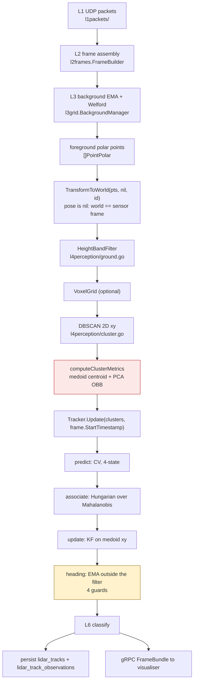
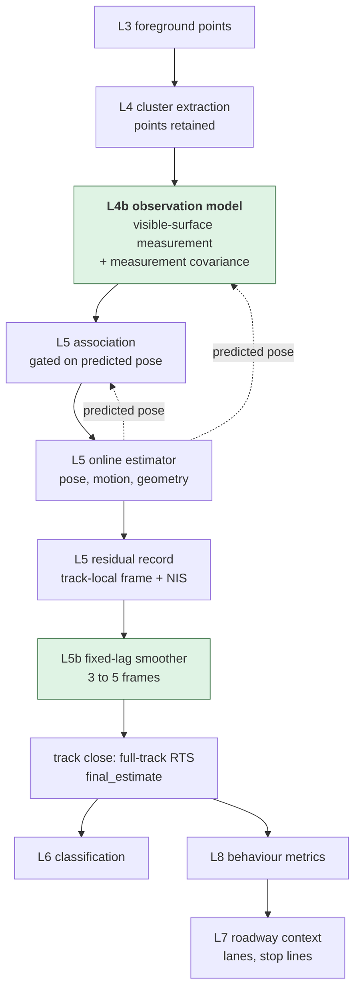

# LiDAR state estimation plan

- **Status:** Draft (investigation)
- **Layers:** L4 Perception, L5 Tracks, L6 Objects, L9 Endpoints, storage
- **Target:** v0.5.x through v0.7.x; the observation model lands first, the estimator follows behind measurable gates
- **Consumed by:** [lidar-behaviour-analytics-plan](lidar-behaviour-analytics-plan.md) (Phases 6 and 7; every behaviour metric depends on the final trajectory this plan produces)
- **Companion plans:** [lidar-shape-descriptors-plan](lidar-shape-descriptors-plan.md), [lidar-test-corpus-plan](lidar-test-corpus-plan.md), [lidar-l7-scene-plan](lidar-l7-scene-plan.md), [lidar-visualiser-trails-and-uncertainty-visualisation-plan](lidar-visualiser-trails-and-uncertainty-visualisation-plan.md), [lidar-static-pose-alignment-plan](lidar-static-pose-alignment-plan.md)
- **Canonical maths:** [data/maths/tracking-maths.md](../../data/maths/tracking-maths.md), [data/maths/proposals/20260222-geometry-coherent-tracking.md](../../data/maths/proposals/20260222-geometry-coherent-tracking.md)

> **Scope split.** This plan owns the path from raw points to a trustworthy
> physical trajectory: observation model, estimator, uncertainty, geometry,
> smoothing, persistence, and the evidence surface for abnormal motion. It owns
> Phases 0 to 5 and Phase 8. What is then _measured about road-user behaviour_
> using that trajectory, Phases 6 and 7, lives in
> [lidar-behaviour-analytics-plan](lidar-behaviour-analytics-plan.md). Phase
> numbering is shared across the two documents so cross-references survive.

## Executive summary

The reported failure is a vehicle whose bounding box steps roughly one metre
sideways for a few frames and then returns. The investigation reproduced that
failure exactly, using production clustering code and a **noise-free** synthetic
sensor observing a **rigid vehicle travelling in a perfectly straight line at
constant speed**.

That result reframes the whole problem. The lateral jump is not measurement
noise, not occlusion artefact, and not a motion-model deficiency. It is a
deterministic property of what the pipeline currently calls a position
measurement: `WorldCluster.CentroidX/Y` is the **medoid**, an actual LiDAR
return chosen as the cluster point nearest the arithmetic mean
([cluster.go:432](../../internal/lidar/l4perception/cluster.go)). A medoid can
only ever sit on a visible surface of the vehicle, so it carries a
viewpoint-dependent offset of up to half the vehicle's width or length, and it
hops discretely between faces as visibility changes.

The consequence for sequencing is direct and it contradicts the current
recommendation in [pipeline-review-open-questions Q5](../../data/maths/pipeline-review-open-questions.md),
which puts a constant-acceleration state extension and then an IMM at the front
of the queue. **No estimator improvement applied to the current measurement can
fix the reported problem.** A Kalman filter assumes zero-mean white measurement
noise. This error is neither zero-mean nor white: it is a bias that is a smooth
function of viewing geometry and stays correlated over tens of frames. CV, CA,
CTRA, UKF and IMM all inherit it identically.

The first increment is therefore an **observation model**, not an estimator.

|                                       | Mean lateral error vs truth | Max frame-to-frame hop |
| ------------------------------------- | --------------------------- | ---------------------- |
| Medoid centroid (today's measurement) | 0.676 m                     | 0.680 m                |
| OBB centre                            | 0.279 m                     | 0.565 m                |
| Near-edge anchor plus dimension prior | **0.035 m**                 | **0.370 m**            |

Method and caveats in [Section 3](#3-evidence-what-the-measurement-actually-is).
The near-edge measurement is exact outside occlusion: its entire 0.035 m mean
error comes from the three frames affected by the injected occluder, and the
0.370 m hop is the exit from that event. That is the correct place for a large
residual: visible, attributable, and reportable rather than silently absorbed.

## 1. Current architecture

### 1.1 Pipeline as built



The red node is where the reported defect originates. The amber node is where
orientation is maintained outside the estimator that owns the rest of the state.

### 1.2 Component inventory

| Concern                | Location                                                                                                                      | Key symbol                                                   |
| ---------------------- | ----------------------------------------------------------------------------------------------------------------------------- | ------------------------------------------------------------ |
| Background subtraction | [l3grid/background.go](../../internal/lidar/l3grid/background.go), [foreground.go](../../internal/lidar/l3grid/foreground.go) | `BackgroundManager`, EMA plus Welford variance               |
| Clustering             | [l4perception/cluster.go:268](../../internal/lidar/l4perception/cluster.go)                                                   | `DBSCAN`, 2D xy, `SpatialIndex` grid                         |
| Cluster metrics        | [l4perception/cluster.go:432](../../internal/lidar/l4perception/cluster.go)                                                   | `computeClusterMetrics`                                      |
| Bounding box           | [l4perception/obb.go:26](../../internal/lidar/l4perception/obb.go)                                                            | `EstimateOBBFromCluster`, PCA on xy                          |
| Heading smoothing      | [l4perception/obb.go](../../internal/lidar/l4perception/obb.go)                                                               | `SmoothOBBHeading`, EMA with wrap handling                   |
| Track creation         | [l5tracks/tracking.go](../../internal/lidar/l5tracks/tracking.go)                                                             | `Tracker.initTrack`                                          |
| Association            | [l5tracks/tracking_association.go](../../internal/lidar/l5tracks/tracking_association.go)                                     | `associate`, `mahalanobisDistanceSquared`, `HungarianAssign` |
| Prediction             | [l5tracks/tracking_association.go](../../internal/lidar/l5tracks/tracking_association.go)                                     | `predict`, constant velocity                                 |
| Update                 | [l5tracks/tracking_update.go](../../internal/lidar/l5tracks/tracking_update.go)                                               | `update`                                                     |
| Lifecycle              | [l5tracks/tracking.go](../../internal/lidar/l5tracks/tracking.go)                                                             | tentative to confirmed to deleted, hits and misses           |
| Classification         | [l6objects/classification.go](../../internal/lidar/l6objects/classification.go)                                               | `TrackClassifier`                                            |
| Quality                | [l6objects/quality.go](../../internal/lidar/l6objects/quality.go)                                                             | `ComputeTrackQualityMetrics`                                 |
| Persistence            | [storage/sqlite/track_store.go](../../internal/lidar/storage/sqlite/track_store.go)                                           | `InsertTrack`, `InsertTrackObservation`                      |
| Composition            | [pipeline/tracking_pipeline.go](../../internal/lidar/pipeline/tracking_pipeline.go)                                           | `NewFrameCallback`                                           |
| Debug capture          | [debug/collector.go](../../internal/lidar/debug/collector.go)                                                                 | `DebugFrame`, innovations, gating ellipses                   |
| Offline evaluation     | [adapters/ground_truth.go](../../internal/lidar/adapters/ground_truth.go)                                                     | `GroundTruthEvaluator`, temporal IoU only                    |
| Estimator selection    | [config/tuning.go](../../internal/config/tuning.go)                                                                           | `L5Config.Engine`, registry                                  |

### 1.3 State of the current tracker

`TrackedObject` ([tracking.go:17](../../internal/lidar/l5tracks/tracking.go))
carries a four-element Kalman state `[x, y, vx, vy]` with a 4x4 covariance `P`,
plus about thirty further fields that are running aggregates, quality counters
and rendering hints. The measurement is `H = [I2 | 0]` on the medoid, with a
single scalar `MeasurementNoise` (`0.05`, so sigma is about 0.22 m) applied
isotropically at every range and point count.

### 1.4 Direct answers to the inspection questions

| Question                                   | Finding                                                                                                                                                                                                                                                                                                                                                                                              |
| ------------------------------------------ | ---------------------------------------------------------------------------------------------------------------------------------------------------------------------------------------------------------------------------------------------------------------------------------------------------------------------------------------------------------------------------------------------------- |
| Where are raw observations retained?       | Nowhere. `lidar_clusters` exists but `InsertCluster` has no caller and the table holds **0 rows**. `WorldCluster.SamplePoints` is declared and never assigned outside tests. Cluster member points are discarded inside `computeClusterMetrics`.                                                                                                                                                     |
| Can a track's historical state be revised? | No. `History` is append-only `[]TrackPoint` capped at 200 entries, and rows in `lidar_track_observations` are written once per frame with `INSERT OR REPLACE`. There is no versioning, no estimator identity, and no re-run path.                                                                                                                                                                    |
| What timestamps are used?                  | `Tracker.Update` receives a single `frame.StartTimestamp` for **all** clusters in the frame. Per-cluster capture time is computed as `points[0].Timestamp` and stored in `WorldCluster.TSUnixNanos`, then discarded. Per-point time exists in `PointPolar.Timestamp`. A 10 Hz spin means up to 100 ms of unmodelled intra-frame time offset, which is about 1.3 m of along-track position at 13 m/s. |
| What coordinate systems?                   | One. `TransformToWorld(foregroundPoints, nil, sensorID)` at [tracking_pipeline.go:469](../../internal/lidar/pipeline/tracking_pipeline.go) passes a **nil pose**, so the identity transform applies and the "world frame" is the sensor frame. The `Pose` type and a pose table design exist and are unused by the live pipeline.                                                                    |
| Is orientation available?                  | Yes, but outside the estimator. `OBBHeadingRad` is a per-frame PCA axis passed through velocity or displacement disambiguation, three rejection guards, and an EMA with alpha 0.08. It is not part of the state vector, has no covariance, and cannot be predicted forward.                                                                                                                          |
| Per-frame or whole-track dimensions?       | Both, inconsistently. `OBBLength/Width/Height` are instantaneous; `BoundingBoxLengthAvg/WidthAvg/HeightAvg` are running means over the track. Neither is a dimension estimate with uncertainty, and the running mean is contaminated by partially observed frames.                                                                                                                                   |
| What confidence information exists?        | Track-level only: `ObjectConfidence`, `QualityScore`, alignment and jitter aggregates, merge and split flags. Nothing per frame. `P` exists in memory and reaches the visualiser but is never persisted.                                                                                                                                                                                             |
| What point data survives clustering?       | Only `PointsCount`, `HeightP95`, `IntensityMean`. Everything geometric is gone by the time the tracker sees a cluster.                                                                                                                                                                                                                                                                               |

### 1.5 Measured facts from the production database

Sample: `sensor_data.db`, 55,315 tracks and 3,526,860 observations.

| Fact                                                                                                                           | Value                                                                 |
| ------------------------------------------------------------------------------------------------------------------------------ | --------------------------------------------------------------------- |
| Lateral residual against a local five-point straight-line fit, moving tracks (max speed at least 6 m/s), p50 / p95 / p99 / max | 0.021 / 0.150 / 0.316 / 2.43 m                                        |
| Moving tracks with at least one excursion above 0.5 m                                                                          | **11.3 %** (33 of 293)                                                |
| Near-stationary tracks with the same excursion                                                                                 | 1.4 % (4 of 288)                                                      |
| Observation interval for moving tracks: fraction at one sensor period (100 ms)                                                 | **43.6 %**                                                            |
| Remaining intervals                                                                                                            | 20.7 % at 200 ms, 19.9 % at 300 ms, 11.7 % at 400 ms, 1.3 % at 500 ms |
| Tracks above 10 m/s with at least 25 observations                                                                              | 108 of 26,732                                                         |
| `occlusion_count`, `max_occlusion_frames` in `lidar_tracks`                                                                    | all zero                                                              |
| `track_duration_secs`, `spatial_coverage`, `noise_point_ratio`                                                                 | all null                                                              |
| `lidar_track_observations` storage                                                                                             | 569 MB for 3.53 M rows, 161 bytes per row                             |

Two of these deserve emphasis.

First, the residual numbers above are measured on the **already filtered**
output. The Kalman posterior is what is persisted, so the raw measurement
excursions are larger than the table shows.

Second, a moving track is associated to a cluster on only about 44 % of sensor
frames. The effective observation rate for a moving vehicle is roughly 5 Hz, not
the sensor's 10 Hz. That single number constrains everything downstream:
acceleration observability, jerk feasibility, smoothing lag, and the value of
any multiple-model estimator. It also means detection and association, not the
motion model, are the current bottleneck on trajectory quality.

### 1.6 Defects found while reading

| Defect                                                                                                    | Evidence                                                                                                                                 | Consequence                                                                                                                                                                     |
| --------------------------------------------------------------------------------------------------------- | ---------------------------------------------------------------------------------------------------------------------------------------- | ------------------------------------------------------------------------------------------------------------------------------------------------------------------------------- |
| `lidar_track_observations` stores the **estimate**, not the observation, under a name that says otherwise | [tracking_pipeline.go:650](../../internal/lidar/pipeline/tracking_pipeline.go) writes `track.X`, `track.Y`, `track.VX`, `track.VY`       | The observation is unrecoverable after the fact, so no estimator can ever be re-run or compared offline                                                                         |
| Three fields in that row are lifetime aggregates, contradicting the comment above them                    | `SpeedMps: track.AvgSpeedMps`, `HeightP95: track.HeightP95Max`, `IntensityMean: track.IntensityMeanAvg`                                  | Per-frame speed is not recoverable from the table at all                                                                                                                        |
| `InsertTrack` writes only the 15 `TrackMeasurement` columns                                               | [track_store.go:92](../../internal/lidar/storage/sqlite/track_store.go)                                                                  | Six quality columns in `lidar_tracks` are permanently zero or null                                                                                                              |
| The visualiser drops the observation for every tracked object                                             | `adaptUnassociatedClusters` at [adapter.go:222](../../internal/lidar/l9endpoints/adapter.go) skips clusters with a non-empty association | It is currently impossible to see observation against estimate in the visualiser, which is precisely the view needed to tune this work                                          |
| The debug collector is never wired                                                                        | [tracking_pipeline.go](../../internal/lidar/pipeline/tracking_pipeline.go) calls `AdaptFrame(..., nil)`                                  | Innovation, gating and prediction capture exist in code and in the proto, and produce nothing at runtime                                                                        |
| Per-cluster capture time is computed and thrown away                                                      | `WorldCluster.TSUnixNanos` set in `computeClusterMetrics`, unused by `Tracker.Update`                                                    | Intra-frame timing error is unmodelled; objects near the azimuth wrap take a full frame period of apparent along-track displacement                                             |
| `lidar_run_tracks` has no per-frame rows                                                                  | migration 000011                                                                                                                         | Offline comparison between estimator versions can only compare track-level summaries by temporal IoU. `TrackMatchResult.SpatialDistance` is documented as "not yet implemented" |

## 2. Problems, ranked

| #   | Problem                                                           | Root cause                                                                                                                                                                                               | Severity                                                                                 |
| --- | ----------------------------------------------------------------- | -------------------------------------------------------------------------------------------------------------------------------------------------------------------------------------------------------- | ---------------------------------------------------------------------------------------- |
| P1  | Lateral position steps of up to about 1 m on straight-line travel | The measurement is a visible-surface point, not an object centre. Bias up to `W/2` laterally and `L/2` longitudinally, switching discretely between faces                                                | **Critical**: this is the reported defect                                                |
| P2  | Systematic along-track drift across a pass                        | The medoid slides from the front of the visible face to the rear as the aspect angle sweeps, producing a signed position error that reverses at closest approach and reads as decelerate-then-accelerate | **Critical**: corrupts the speed product                                                 |
| P3  | Observations are not retained                                     | `lidar_clusters` empty, cluster points discarded, observation table holds the estimate                                                                                                                   | **Critical**: blocks every offline comparison this plan depends on                       |
| P4  | Association misses about 56 % of frames on moving tracks          | Under investigation; candidates are gating against a biased prediction, cluster fragmentation, and frame throttling                                                                                      | **High**: halves the effective sample rate                                               |
| P5  | Orientation is estimated outside the estimator                    | EMA plus three guards, no covariance, cannot be predicted                                                                                                                                                | **High**: blocks any geometric observation model, which needs a predicted heading        |
| P6  | Measurement noise is one isotropic scalar                         | `MeasurementNoise = 0.05` for all ranges, point counts and aspects                                                                                                                                       | **High**: gating and gain are wrong at both ends of the range envelope                   |
| P7  | Dimensions are running means over partially observed frames       | `BoundingBoxLengthAvg` and siblings                                                                                                                                                                      | **Medium**: biases classification and blocks a dimension prior                           |
| P8  | No per-frame residual record                                      | Debug collector unwired, nothing persisted                                                                                                                                                               | **Medium**: no way to distinguish a bad measurement from a real manoeuvre after the fact |
| P9  | Single frame timestamp for all clusters                           | `Tracker.Update(clusters, frame.StartTimestamp)`                                                                                                                                                         | **Medium**: up to 100 ms of unmodelled time offset, azimuth-dependent                    |
| P10 | Sensor frame is the only frame                                    | nil pose                                                                                                                                                                                                 | **Medium**: blocks lane and stop-line work entirely                                      |

P1 and P2 are the same defect seen along two axes. P3 is the one that gates the
work: until observations are retained, no decision gate in this plan can be
evaluated on real data.

## 3. Evidence: what the measurement actually is

### 3.1 Method

A synthetic Hesai Pandar40P was modelled: 0.2 degree azimuth steps, fourteen
elevation rings spanning the dense band, sensor at the origin 3 m above the road.
A 4.5 x 1.8 x 1.5 m box vehicle travels in a dead-straight line at exactly
12.0 m/s past the sensor at 5 m lateral offset, sampled every 100 ms. Returns are
generated only on faces the sensor can see, by slab intersection. Frames 18 to 20
have a 1.2 degree azimuth wedge deleted to model a foreground occluder.

**There is no measurement noise of any kind**: no range error, no intensity
model, no background-subtraction error, no dropped returns beyond the injected
wedge. The points are then passed to the production `l4perception.DBSCAN` and
the production `EstimateOBBFromCluster`.

The prototype lives in the session scratchpad and should be promoted into
`internal/lidar/l4perception` as the seed of the synthetic corpus in
[Section 16](#16-evaluation-corpus). Caveats: the vehicle is a box, the road is
flat, there is no ground return and no second object. These simplifications all
make the result _conservative_, because each of them would add error to the
production path rather than remove it.

### 3.2 Result

Lateral offset of each candidate measurement from the true vehicle centre,
selected frames of a 40-frame pass:

| frame | truth x | points | medoid dy  | OBB centre dy |
| ----- | ------- | ------ | ---------- | ------------- |
| 0     | -24.0   | 96     | -0.231     | -0.632        |
| 2     | -21.6   | 132    | **-0.900** | -0.409        |
| 5     | -18.0   | 169    | **-0.238** | -0.615        |
| 6     | -16.8   | 181    | **-0.900** | -0.359        |
| 8     | -14.4   | 216    | **-0.366** | -0.042        |
| 9     | -13.2   | 231    | **-0.900** | -0.223        |
| 13    | -8.4    | 394    | -0.900     | -0.153        |
| 19    | -1.2    | 248    | 0.069      | -0.182        |
| 26    | 7.2     | 368    | -0.900     | -0.333        |

Maximum frame-to-frame excursion from the constant-velocity path: **1.119 m for
the medoid**, 0.575 m for the OBB centre.

### 3.3 Reading the result

The medoid sits at exactly -0.900 m whenever the near side face dominates the
point set, which is `W/2` for a 1.8 m vehicle. It jumps to roughly -0.24 m when
enough of an end face appears to pull the arithmetic mean forward, because the
nearest actual return then lies on that end face instead. The hop is about
0.67 m, it happens between adjacent frames, it reverses, and **nothing physical
moved**.

Three conclusions follow, and each of them changes a decision later in this plan.

**Filtering cannot fix it.** The error is deterministic given viewing geometry
and correlated over tens of frames. It violates the zero-mean white-noise
assumption that gives the Kalman filter its optimality. Every estimator in the
comparison matrix inherits it unchanged.

**Point count does not predict it.** Frame 13 has the most points in the pass,
394, and carries the full -0.900 m bias. Frame 19 has 248 points and is nearly
unbiased. The intuition in the brief, that six points at long range deserve less
authority than hundreds nearby, is correct about _variance_ and wrong about
_bias_. An uncertainty model built on point count and range alone will happily
assign high confidence to the most biased observations in the dataset. This is
the single most important constraint on [Section 8](#8-uncertainty-matrix).

**The fix is a measurement definition.** Three candidates were tested against the
same frames:

| Candidate                                              | Mean absolute lateral error | Max hop     |
| ------------------------------------------------------ | --------------------------- | ----------- |
| Medoid centroid                                        | 0.676 m                     | 0.680 m     |
| OBB centre                                             | 0.279 m                     | 0.565 m     |
| Nearest OBB corner, reconstructed with true dimensions | 0.202 m                     | 1.398 m     |
| Nearest corner with temporal identity selection        | 0.337 m                     | 0.675 m     |
| **Near-edge percentile plus dimension prior**          | **0.035 m**                 | **0.370 m** |

The corner results are the useful negative. Corner anchoring reduces mean bias
but makes the worst hop worse, because the identity of the nearest corner flips
mid-pass. Adding temporal identity selection fixes the flip and still does not
beat the OBB centre, because the _observed box extents_ are themselves wrong
when only part of the vehicle is visible, so reconstructing from a corner
inherits that error.

What works is measuring only the surface that is actually observed. The near
face of the vehicle is densely and reliably sampled. The far face is not
observed at all and must come from a prior. Taking the 5th percentile of the
cluster's lateral coordinate as the near-edge position and pushing outward by
`W/2` from the dimension estimate gives 0.035 m mean error over the pass.

The distribution of that error matters more than its mean. On 37 of the 40
frames the error is 0.000 m to three decimal places. All of it lives in the
three frames the occluder touches, where it reaches 0.671 m before returning.
The measurement does not degrade gracefully into a slightly worse estimate: it
is exact when the near face is visible and it fails visibly when it is not,
which is the behaviour that makes an uncertainty model and a residual record
worth having.

That is the minimum useful geometric representation, and it is far short of a
vehicle CAD model.

## 4. Target architecture

### 4.1 Stage boundaries

The architecture proposed in the brief is close to right. One boundary moves and
one stage is added.



The new stage is **L4b, the observation model**. It sits between clustering and
association, and it is the piece that is missing today. It converts a set of
cluster points into a measurement of a defined physical quantity, together with
the covariance of that measurement, given the estimator's current belief about
the object's pose and dimensions.

That dependency, drawn dashed, is the one structural change the brief did not
anticipate: **the observation model needs feedback from the estimator.** You
cannot decide which face of a vehicle you are looking at without a prior on
where the vehicle is and which way it points. This is not a layering violation
so long as the flow is explicit: L4b consumes a read-only `PosePrior` published
by L5 for the previous frame, and never mutates track state.

The same prior improves association, which settles the brief's question about
where state estimation, association and classification interact. A prediction
unbiased by half a vehicle width is a better gate centre, and P4, the 56 % frame
miss rate, is partly a gating problem.
Expect association to improve as a side effect of fixing the measurement, and
measure it.

### 4.2 What stays where

| Concern                                            | Layer         | Rationale                                                        |
| -------------------------------------------------- | ------------- | ---------------------------------------------------------------- |
| Raw points, cluster membership                     | L4            | Already the owner; needs retention, see companion plan           |
| Visible-surface extraction, measurement covariance | **L4b (new)** | Needs points and sensor geometry, neither of which belongs in L5 |
| Association                                        | L5            | Unchanged in position, improved input                            |
| Online filter, geometry state                      | L5            | Unchanged in position                                            |
| Residual computation and record                    | L5            | Only the filter knows the innovation covariance                  |
| Fixed-lag smoothing                                | **L5b (new)** | Needs a bounded history buffer; separable and testable alone     |
| Full-track smoothing                               | L8, offline   | Runs at track close or on demand over stored observations        |
| Behaviour metrics                                  | L8            | Consumes the final estimate, never the online one                |
| Lane and stop-line context                         | L7            | Already reserved in the architecture chart                       |

`L5h Motion extensions` is already an explicit gap node in the
[architecture concept chart](../../ARCHITECTURE.md), fed from `L5bg`. This work
fills it.

### 4.3 Estimator selection is already plumbed

`config/tuning.defaults.json` sets `l5.engine = "cv_kf_v1"`, and the engine
registry in [config/tuning.go](../../internal/config/tuning.go) already declares
`imm_cv_ca_v2` and `imm_cv_ca_rts_eval_v2` with fields for transition
probabilities, acceleration process noise and an RTS window. Those are schema
stubs with no defaults block and no implementation. New estimators slot in here.
No new selection mechanism is needed.

## 5. Observation versus estimated state

### 5.1 The rule

An **observation** is anything computable from one frame's points without
reference to track history. An **estimated quantity** is anything that requires
the prior. Applying that rule to today's code produces an uncomfortable result:
`OBBHeadingRad` is neither. It is an EMA over frames, guarded by three
heuristics, stored on the track, and consumed as though it were a measurement.
Per-frame `OBBLength` and `OBBWidth` are observations, but of _visible extent_,
not of vehicle dimensions, and the code treats them as the latter.

### 5.2 Proposed Go types

```go
package l5tracks // or a new l4bobserve package; see Section 4.1

// VisibleFace records which faces of the object the sensor could see this
// frame. Derived from the sign of the dot product between each face normal
// (under the predicted heading) and the sensor bearing, and confirmed by
// point support on that face.
type VisibleFace uint8

const (
    FaceNearSide VisibleFace = 1 << iota // lateral face towards the sensor
    FaceFarSide                          // lateral face away (rarely observed)
    FaceLeading                          // end face in the direction of travel
    FaceTrailing                         // end face behind
)

// EdgeMeasurement is a measurement of one observed face plane, expressed as a
// signed offset along the face normal in the track-local frame.
type EdgeMeasurement struct {
    Face      VisibleFace
    Offset    float64 // metres from track origin along the face normal
    Sigma     float64 // 1-sigma uncertainty of Offset
    Support   int     // points contributing
    Truncated bool    // face extent clipped by the cluster boundary
}

// Observation is everything one frame says about one detection. It is written
// once, never revised, and is the unit of replay.
type Observation struct {
    ObservationID int64
    SensorID      string
    FrameID       string
    ClusterID     int64

    // Timing. CaptureUnixNanos is the cluster's own capture time, not the
    // frame start: see defect P9.
    CaptureUnixNanos int64
    FrameUnixNanos   int64

    // Raw cluster geometry, unmodified from L4.
    MedoidX, MedoidY, MedoidZ float64
    OBB                       l4perception.OrientedBoundingBox

    // Derived surface measurements, the actual filter input.
    Edges []EdgeMeasurement

    // Observation quality inputs.
    PointCount        int
    RangeMetres       float64 // sensor to cluster nearest point
    BearingRad        float64
    AspectRad         float64 // angle between sensor bearing and predicted heading
    PointDensity      float64 // points per square metre of visible surface
    AngularExtentRad  float64
    VisibleFaces      VisibleFace
    NearestNeighbourM float64 // distance to the nearest other cluster
    Fragmented        bool
    GroundClipped     bool

    // Measurement covariance in the SENSOR frame (radial, tangential), before
    // rotation into the track frame. Diagonal is sufficient here; the
    // correlation is introduced by the rotation.
    SigmaRadial     float64
    SigmaTangential float64
}

// EstimatedState is the estimator's belief. Produced at least once per frame
// per live track, and revised by smoothing.
type EstimatedState struct {
    TrackID      string
    TSUnixNanos  int64
    Stage        EstimateStage // online | fixed_lag | final
    EstimatorID  string        // e.g. "cv_kf_v2"
    ParamHash    string        // tuning hash, for reproducibility

    // Pose and motion. See Section 5.3 for why this parameterisation.
    X, Y, Z    float64
    HeadingRad float64
    SpeedMps   float64
    AccelMps2  float64 // longitudinal, vehicle frame
    YawRateRps float64

    // Upper triangle of the 6x6 covariance, row-major, 21 elements.
    Cov [21]float64

    // Geometry belief, maintained separately from motion.
    Length, Width, Height          float64
    SigmaLength, SigmaWidth, SigmaHeight float64
    DimensionObsCount              int

    // Multiple-model diagnostics. Empty for single-model estimators.
    ModelProbabilities map[string]float64

    // Validity. See Section 12.
    ModelValid    bool
    ModelWarnings []string
}

// Residuals ties one Observation to one EstimatedState. Written per frame.
type Residuals struct {
    TrackID          string
    ObservationID    int64
    TSUnixNanos      int64
    EstimatorID      string

    // Innovation in the TRACK-LOCAL frame, which is the frame a human can
    // reason about. Longitudinal is along heading, lateral is across it.
    LongitudinalM float64
    LateralM      float64
    VerticalM     float64
    HeadingRad    float64

    // Geometry residuals, per observed face.
    LengthM, WidthM, HeightM float64

    // Statistical consistency.
    NIS            float64 // normalised innovation squared
    MahalanobisD   float64
    InnovationCovDet float64

    // Decision record: what the estimator did about this observation and why.
    Disposition   Disposition // accepted | downweighted | excluded | model_invalid
    WeightApplied float64     // 1.0 for full acceptance
    Reason        string
}
```

Three interfaces make the alternatives in the matrices swappable and separately
testable:

```go
// MotionModel is one hypothesis about how state evolves. CV, CA, CTRV, CTRA
// each implement this; IMM composes several.
type MotionModel interface {
    Name() string
    Predict(s *EstimatedState, dt float64) error
    ProcessNoise(dt float64) [21]float64
}

// MeasurementModel maps a belief to an expected observation and back.
// This is where the visible-surface logic lives.
type MeasurementModel interface {
    Name() string
    // Expect predicts what the sensor should see given the belief.
    Expect(s *EstimatedState, sensorOrigin [3]float64) ExpectedObservation
    // Innovate returns the residual and its covariance for a real observation.
    Innovate(s *EstimatedState, o *Observation) (residual []float64, R [][]float64, err error)
}

// UncertaintyModel produces measurement covariance from observation features.
// Fixed, range-dependent and learned variants all implement this.
type UncertaintyModel interface {
    Name() string
    Covariance(o *Observation) (sigmaRadial, sigmaTangential float64)
}
```

`TrackedObject` keeps its identity, lifecycle and aggregate fields. The Kalman
fields `X, Y, VX, VY, P` are replaced by an embedded `EstimatedState` and a
bounded `[]EstimatedState` smoothing buffer. The `TrackerInterface` gains
`GetObservations(trackID)` and `GetResiduals(trackID)`; nothing is removed, so
the visualiser and sweep paths keep working through the transition.

### 5.3 Choosing the state parameterisation

The brief asks whether to use Cartesian velocity, speed and heading, or
vehicle-frame accelerations. The answer is driven by the observation model, not
by filter convenience.

**Heading must be in the state.** The visible-surface measurement in Section 3.3
is only definable relative to the object's orientation: you cannot say "near
lateral face" without knowing which way the vehicle points. Today heading is an
EMA maintained outside the filter, with no covariance and no prediction. Any
geometric observation model requires a _predicted_ heading with an uncertainty,
so heading moves into the state vector. This alone rules out the plain
`[x, y, vx, vy]` and `[x, y, vx, vy, ax, ay]` parameterisations as end states.

**Speed and heading beat Cartesian velocity here.** Three reasons. The
behaviour metrics in Section 13 want longitudinal and lateral acceleration in
the vehicle frame, which is a rotation away from `(ax, ay)` and immediate from
`(a, v·omega)`. Process noise is physically meaningful: a vehicle's uncertainty
grows differently along its heading than across it, and a diagonal `Q` in polar
form expresses that, while a diagonal `Q` in Cartesian form does not. And the
90-degree heading ambiguity that currently needs three guards becomes a
constrained state with a covariance rather than a heuristic.

**Numerically, the cost is real and manageable.** Speed-heading form is
nonlinear, so the filter becomes an EKF or UKF. Heading needs wrap handling at
every operation. Near zero speed the heading is unobservable and the Jacobian is
ill-conditioned, which is exactly the regime of the 5,982 near-stationary tracks
in the database. Mitigations: freeze heading below a speed threshold, which the
config already anticipates with `low_speed_heading_freeze_mps` in the
`imm_cv_ca_v2` block; and use a UKF rather than an EKF if conditioning proves
troublesome, since at six states the sigma-point cost is trivial on this
workload.

**Observability with this sensor.** At an effective 5 Hz with a corrected
measurement of roughly 0.05 m accuracy:

| Quantity                  | Observable?                               | Note                                                                             |
| ------------------------- | ----------------------------------------- | -------------------------------------------------------------------------------- |
| Position                  | Yes, strongly                             | Directly measured once the bias is removed                                       |
| Speed                     | Yes                                       | Two frames at 0.2 s and 0.05 m give about 0.35 m/s per-pair noise, well filtered |
| Heading                   | Yes when moving, weakly below about 1 m/s | Two independent sources: velocity direction and observed face geometry           |
| Longitudinal acceleration | Marginally, needs about 1 s of support    | Three-frame differencing noise is roughly 1.8 m/s² at 0.2 s spacing              |
| Yaw rate                  | Weakly                                    | Needs either sustained turning or a well-observed long face                      |
| Yaw acceleration          | **No**                                    | Do not put it in the state                                                       |
| Length, width             | Yes over a track, no per frame            | Accumulate with uncertainty; never per-frame                                     |
| Height                    | Yes, poorly                               | Sparse vertical sampling; useful for classification, not for pose                |

**Recommendation.** Define the persisted state schema as the full six-element
`[x, y, psi, v, a, omega]` with the 6x6 covariance from the start, so the
storage layer never churns. Pin `a` and `omega` to zero in the first production
estimator. Turn them on behind the gates in Section 7.

## 6. Shared evaluation criteria

Every matrix below scores against the same criteria, so that choices in one area
can be compared against choices in another. Scale: `++` strong, `+` adequate,
`o` neutral, `-` weak, `--` disqualifying for this project.

| Key | Criterion                                                      |
| --- | -------------------------------------------------------------- |
| C1  | Solves the lateral-jump regression (P1, P2)                    |
| C2  | Observable with Pandar40P at an effective 5 Hz                 |
| C3  | Robust to partial occlusion                                    |
| C4  | Responsive to genuine acceleration, braking, turning and crash |
| C5  | Represents uncertainty honestly                                |
| C6  | Residuals are explainable to a person                          |
| C7  | CPU cost on Raspberry Pi 4                                     |
| C8  | Storage cost                                                   |
| C9  | Implementation complexity in Go                                |
| C10 | Numerical stability                                            |
| C11 | Compatible with current association and lifecycle code         |
| C12 | Supports revising historical estimates                         |
| C13 | Reproducible across estimator versions                         |
| C14 | Testable and visualisable                                      |
| C15 | Migration risk                                                 |

**Budget context for C7.** The CI baseline
([perf/baseline/baseline-kirk0-ci.json](../../internal/lidar/perf/baseline/baseline-kirk0-ci.json))
records 5.04 ms mean and 7.81 ms p99 for the whole frame callback on 4-core
amd64. The stage breakdown fields in that file are zero, so the tracker's share
is not currently measured: **populating them is a Phase 0 task.** Assume a Pi 4
is three to five times slower, giving roughly 15 to 25 ms per frame against a
100 ms budget at 10 Hz. The tracker is a small part of that; clustering and
background subtraction dominate. Estimator changes at 100 tracks are unlikely to
be the constraint, and the plan should stop guessing and measure.

## 7. Estimator matrix

The brief's list mixes two independent choices. **Motion model** is a hypothesis
about how state evolves. **Filter algorithm** is how a nonlinear model is
propagated. CV and CA are linear and need no EKF or UKF. CTRV and CTRA are
nonlinear and need one or the other. Separating them makes the decision tractable.

### 7.1 Motion models

| Model                                 | State    | C1   | C2   | C4   | C6   | C7   | C9   | C10  | Verdict                                                                      |
| ------------------------------------- | -------- | ---- | ---- | ---- | ---- | ---- | ---- | ---- | ---------------------------------------------------------------------------- |
| Constant velocity (today)             | 4        | `--` | `++` | `-`  | `++` | `++` | `++` | `++` | Retain as the baseline and as an IMM mode                                    |
| Constant acceleration                 | 6        | `--` | `+`  | `+`  | `+`  | `++` | `++` | `+`  | Strict superset of CV; second increment                                      |
| Constant turn rate, constant velocity | 5        | `--` | `o`  | `+`  | `+`  | `+`  | `+`  | `o`  | Turning only; weak yaw-rate observability at 5 Hz                            |
| Constant turn rate and acceleration   | 6        | `--` | `-`  | `++` | `o`  | `+`  | `o`  | `-`  | Most expressive single model, least observable here                          |
| Stationary                            | 2        | `--` | `++` | `--` | `++` | `++` | `++` | `++` | Only useful inside an IMM; 5,982 near-stationary tracks make it worth having |
| Interacting multiple model            | per-mode | `--` | `+`  | `++` | `+`  | `+`  | `-`  | `o`  | Right end state, wrong starting point                                        |

Every row scores `--` on C1. That is the point of the matrix. **No motion model
solves the reported defect**, because the defect is in the measurement.

The IMM row deserves its `+` on C6 rather than a minus. Mode probabilities are
genuinely explainable output: "the constant-acceleration mode carried 0.82 of
the weight during braking" is a sentence a person can check. The complexity cost
is in mixing, mode-conditioned covariances, and the interaction with gating,
which is where IMM implementations usually go wrong.

### 7.2 Filter algorithms

| Algorithm            | Needed for              | C7 (100 tracks) | C10  | C9   | Note                                                                                              |
| -------------------- | ----------------------- | --------------- | ---- | ---- | ------------------------------------------------------------------------------------------------- |
| Linear KF            | CV, CA                  | Under 0.05 ms   | `++` | `++` | What exists today                                                                                 |
| Extended KF          | CTRV, CTRA, polar state | Under 0.15 ms   | `o`  | `+`  | Jacobians near zero speed are the risk                                                            |
| Unscented KF         | same                    | Under 1 ms      | `+`  | `o`  | Thirteen sigma points at six states; needs a Cholesky, and a stable one                           |
| Fixed-lag RTS        | any                     | Under 0.5 ms    | `+`  | `+`  | Backward pass over a bounded buffer                                                               |
| Factor graph / batch | any                     | 10 to 100 ms    | `+`  | `--` | No maintained pure-Go sparse solver; a cgo dependency contradicts the static-binary build in D-26 |

The factor-graph row is disqualified on C9 and C15 rather than on merit. Batch
trajectory optimisation is the right tool for offline re-estimation over a whole
track, and it would handle the corner-identity ambiguity in Section 3.3
elegantly. It is not worth a new native dependency in a project that ships a
fully static ARM64 binary. Revisit only if full-track RTS proves insufficient
and a pure-Go sparse Cholesky becomes available.

### 7.3 Recommendation and gate

**First implementation:** keep the linear constant-velocity Kalman filter.
Change only its input, from the medoid to the visible-surface measurement, and
change its measurement covariance from a scalar to the anisotropic model in
Section 8. Add heading to the state as a constrained element updated from the
geometric measurement, so that the observation model has a predicted orientation
to work with, but keep `a` and `omega` pinned to zero.

Doing anything more in the first increment would confound the experiment. If the
estimator and the measurement change together, a regression cannot be
attributed.

**Alternatives to prototype in parallel, offline only:** CA, and IMM over
{stationary, CV, CA}. Both run against stored observations, neither ships.

**Decision gate G-EST-1, from CV to CA.** Requires all of:

1. Phase 2 residuals are persisted for at least 5,000 confirmed moving tracks.
2. The NIS distribution for CV shows over-dispersion that is **correlated with
   acceleration** rather than with range, aspect angle or point count. The
   discriminator is a partial correlation: NIS against a smoothed acceleration
   estimate, controlling for the geometry covariates.
3. Longitudinal residuals show a run-length signature, at least three
   consecutive same-sign residuals above 1-sigma, in over 5 % of moving tracks.
4. CA offline reduces p99 longitudinal residual by at least 20 % with no more
   than a 5 % increase in p99 lateral residual.

**Decision gate G-EST-2, from single model to IMM.** Requires G-EST-1 passed
plus:

1. CA offline shows over-dispersed NIS during _constant-speed_ segments, that is,
   the acceleration state is absorbing noise when there is no acceleration.
2. IMM offline improves worst-case per-track position error by at least 15 %
   against CA on the decision-gate partition.
3. Mode probabilities are stable, meaning fewer than 2 mode flips per second on
   constant-speed segments.
4. Added per-frame CPU measured on Pi 4 hardware is under 2 ms at 100 tracks.

**Decision gate G-EST-3, to a nonlinear turning model.** Requires evidence that
turning is a material failure mode at the deployed sites, specifically that
turning segments account for over 10 % of track-frames and show residuals at
least twice the straight-line baseline. The current sites are low speed with few
tracks above 10 m/s, so this may never fire. Note that
[Q5 of the pipeline review](../../data/maths/pipeline-review-open-questions.md)
argues turning belongs to L7 corridor constraints rather than L5, and this plan
does not disturb that conclusion.

## 8. Uncertainty matrix

Section 3.3 established the constraint that governs this whole area: **point
count and range predict variance, not bias**. Any uncertainty model that ignores
viewing geometry will assign the highest confidence to the most biased
observations. A model that gets this wrong is worse than the current fixed
scalar, because it will actively pull the estimate towards the bias.

| Strategy                                             | C1   | C3   | C5   | C6   | C7   | C9   | Note                                                                                      |
| ---------------------------------------------------- | ---- | ---- | ---- | ---- | ---- | ---- | ----------------------------------------------------------------------------------------- |
| Fixed scalar (today)                                 | `--` | `--` | `--` | `+`  | `++` | `++` | Wrong at both ends of the range envelope                                                  |
| Range-dependent, isotropic                           | `-`  | `-`  | `o`  | `+`  | `++` | `++` | Cheap, captures the dominant variance term, ignores anisotropy                            |
| **Range-dependent, anisotropic in the sensor frame** | `o`  | `+`  | `+`  | `++` | `++` | `+`  | Radial and tangential errors differ by an order of magnitude; this is physics, not tuning |
| Point-count and density weighting                    | `-`  | `o`  | `o`  | `+`  | `++` | `++` | Valid for variance; must not be the whole model                                           |
| Visibility and occlusion aware                       | `+`  | `++` | `++` | `+`  | `+`  | `o`  | Requires the visible-face code from L4b                                                   |
| Empirical, learned from labelled recordings          | `o`  | `+`  | `++` | `-`  | `++` | `-`  | Best calibration, worst explainability, needs the corpus first                            |
| Robust residual weighting (Huber and similar)        | `o`  | `+`  | `o`  | `+`  | `++` | `+`  | A complement, not a substitute; see Section 12                                            |
| Full correlated measurement covariance               | `+`  | `+`  | `++` | `o`  | `+`  | `o`  | Falls out for free once the sensor-frame model is rotated into the track frame            |

### 8.1 Recommended model

Compute `R` in the **sensor frame**, where the error structure is diagonal and
physically interpretable, then rotate into the track frame, which produces the
correlated off-diagonal terms automatically.

```
sigma_radial²    = sigma_range² + (d_surface · tan(theta_incidence))²
sigma_tangential² = (r · delta_az)² / 12  +  r² · delta_az² / N_eff  +  sigma_edge²
```

| Term                               | Meaning                                                                   | Source available today                                  |
| ---------------------------------- | ------------------------------------------------------------------------- | ------------------------------------------------------- |
| `sigma_range`                      | Pandar40P range accuracy, about 0.02 m                                    | Datasheet constant                                      |
| `d_surface · tan(theta_incidence)` | Grazing-incidence range spread across the beam footprint                  | Needs `AspectRad`, available from the predicted heading |
| `(r · delta_az)² / 12`             | Quantisation of a 0.2 degree azimuth step: 0.10 m at 30 m, 0.17 m at 50 m | `RangeMetres`                                           |
| `r² · delta_az² / N_eff`           | Averaging gain from multiple returns on the same face                     | `PointCount` restricted to the face                     |
| `sigma_edge`                       | Edge-localisation penalty when a face is truncated or occluded            | `EdgeMeasurement.Truncated`, `VisibleFaces`             |

The critical addition, and the one that distinguishes this from a conventional
range-dependent model, is a **bias term that is not folded into `R`**. Systematic
bias must be _corrected_ by the observation model, not inflated away. Where the
correction cannot be made, because too few faces are visible to disambiguate,
the observation is marked and its dimension-derived component is excluded rather
than downweighted. Inflating `R` to cover a known bias is the mistake that makes
uncertainty models untrustworthy.

### 8.2 Minimum observation fields before uncertainty can be adaptive

`RangeMetres`, `PointCount`, `VisibleFaces`, `AspectRad`, `PointDensity`,
`NearestNeighbourM`. All are derivable from data already present at L4, and none
require retaining full point clouds. `EdgeMeasurement.Support` and `Truncated`
require the near-edge extraction from Section 9. Cluster fragmentation requires
the `Fragmented` flag, which can be derived from the existing merge and split
heuristics in `Tracker.Update`.

### 8.3 Decision gate G-UNC-1 and validation

Adaptive uncertainty ships only when all of the following hold on the
decision-gate partition:

| Check                                                     | Threshold                                               |
| --------------------------------------------------------- | ------------------------------------------------------- |
| NIS mean over all accepted observations                   | Within `[0.7, 1.4]` times the state dimension           |
| NIS chi-squared goodness of fit                           | Not rejected at p = 0.01                                |
| NIS mean stratified by range decile                       | No decile outside `[0.5, 2.0]` times the overall mean   |
| NIS mean stratified by point-count decile                 | Same bound                                              |
| NIS mean stratified by aspect-angle octant                | Same bound. **This is the check the naive model fails** |
| Genuine manoeuvres falsely gated                          | Under 1 % on the labelled manoeuvre set                 |
| Frames to recover after a synthetic occlusion of 5 frames | Under 3                                                 |

The stratified checks matter more than the aggregate. A model can hit a perfect
aggregate NIS while being badly wrong at both ends of the range envelope, with
the errors cancelling.

## 9. Geometry matrix

| Strategy                                       | C1   | C3   | C5   | C7   | C9   | C15  | Note                                                                         |
| ---------------------------------------------- | ---- | ---- | ---- | ---- | ---- | ---- | ---------------------------------------------------------------------------- |
| Filter the observed centroid (today)           | `--` | `--` | `-`  | `++` | `++` | `++` | Measured at 0.676 m mean bias, 1.119 m max hop                               |
| Filter the OBB centre instead                  | `-`  | `-`  | `-`  | `++` | `++` | `++` | 0.279 m / 0.575 m. A cheap partial win, but still a visible-surface artefact |
| Oriented box with accumulated dimensions       | `o`  | `+`  | `+`  | `++` | `+`  | `+`  | Fixes shape instability; does not fix position bias on its own               |
| Nearest-corner anchor                          | `-`  | `o`  | `o`  | `++` | `+`  | `+`  | Measured worse than the OBB centre on max hop: corner identity flips         |
| Corner anchor plus temporal identity           | `o`  | `+`  | `+`  | `++` | `o`  | `+`  | Measured 0.337 m / 0.675 m. Fixes the flip, inherits observed-extent error   |
| **Near-edge measurement plus dimension prior** | `++` | `++` | `++` | `+`  | `+`  | `o`  | Measured **0.035 m / 0.370 m**. Recommended                                  |
| Point-to-model residual against a box          | `++` | `++` | `++` | `o`  | `-`  | `-`  | Strictly better, needs retained points every frame and an iterative fit      |
| Convex hull or surface residual                | `+`  | `+`  | `+`  | `-`  | `--` | `--` | Cost and complexity unjustified at this sensor resolution                    |

Rows one to five and the recommended row carry measured numbers from
Section 3.3, not estimates. The last two rows are judged, not measured.

### 9.1 Recommended representation

The minimum useful geometric representation is:

```
pose:       (x, y, psi) with covariance
dimensions: (L, W, H) with per-dimension sigma and an observation count
anchor:     which faces were visible this frame, and the measured offset of each
```

The measurement passed to the filter is not a point. It is a set of
`EdgeMeasurement` values, one per observed face, each a signed offset along that
face's normal. The filter's job is to reconcile them with the predicted pose and
the dimension prior. A frame in which only the near lateral face is visible
constrains lateral position and nothing else, and the measurement model should
say so by producing a one-dimensional measurement rather than a two-dimensional
one with a fudged covariance.

This is what makes the approach robust to occlusion: **the number of measurement
dimensions varies with what was actually observed.** That is the property the
current pipeline lacks, and the reason a partially occluded vehicle currently
drags the estimate sideways.

### 9.2 Dimension accumulation

Dimensions must never come from a running mean over per-frame extents, because
partially observed frames bias the mean downward. Use a per-dimension estimate
updated only from frames where that dimension's face pair is fully observed
(both `FaceLeading` and `FaceTrailing` for length, both lateral faces for width),
with an upper-envelope prior: the observed extent is a _lower bound_ on the true
dimension, so the update should be asymmetric. A robust high quantile of the
observed extents over the track, weighted by visibility completeness, is
adequate and is far simpler than a full Bayesian shape filter. The Bayesian
treatment is fully worked out in
[the geometry-coherent proposal](../../data/maths/proposals/20260222-geometry-coherent-tracking.md)
and should be adopted if the quantile approach proves insufficient.

### 9.3 Decision gate G-GEO-1

Centroid filtering is declared insufficient, and the near-edge model ships, when
on the decision-gate partition:

1. p99 lateral residual against a locally fitted straight line falls by at least
   50 % versus the current baseline of 0.316 m for moving tracks.
2. The fraction of moving tracks with any excursion above 0.5 m falls from
   11.3 % to under 4 %.
3. No regression above 5 % in detection rate or fragmentation as measured by
   `GroundTruthEvaluator`.
4. On the labelled manoeuvre set, genuine lateral movement of over 0.5 m, meaning
   real lane changes, is still reported with at least 90 % of its true magnitude.
   **This criterion is what stops the fix from becoming a smoother.**

Progression from the near-edge model to point-to-model residuals requires the
retained-points work from
[lidar-shape-descriptors-plan](lidar-shape-descriptors-plan.md) to have shipped,
plus evidence that residual lateral error above 0.1 m persists and is
attributable to edge localisation rather than to the dimension prior.

## 10. Smoothing matrix

| Strategy                           | Latency        | C1   | C4   | C12  | C7   | C9   | Note                                                                           |
| ---------------------------------- | -------------- | ---- | ---- | ---- | ---- | ---- | ------------------------------------------------------------------------------ |
| Online filtering only (today)      | 0              | `-`  | `+`  | `--` | `++` | `++` | Required for association and the live visualiser; insufficient for reports     |
| Fixed-lag smoothing, 3 to 5 frames | 300 to 500 ms  | `+`  | `+`  | `+`  | `+`  | `+`  | Resolves occlusion-induced excursions after the fact                           |
| Full-track RTS at track close      | Track lifetime | `+`  | `++` | `++` | `+`  | `+`  | Best final trajectory; already anticipated by `rts_smoothing_window` in config |
| Batch / factor graph               | Offline        | `++` | `++` | `++` | `--` | `--` | Disqualified on dependency grounds, see 7.2                                    |

### 10.1 Recommendation

Produce **both** outputs, and never conflate them.

| Output      | Consumer                                        | Latency                | Revisable                        |
| ----------- | ----------------------------------------------- | ---------------------- | -------------------------------- |
| `online`    | Association, gRPC visualiser, live API          | 0 frames               | No                               |
| `fixed_lag` | Persisted per-frame estimate, behaviour metrics | 3 frames, about 300 ms | Once, when the lag window closes |
| `final`     | Reports, PDF output, public analysis            | Track close            | Yes, on re-estimation            |

The three are distinguished by `EstimatedState.Stage`. A report that quotes a
speed must quote the `final` value, and the API must be able to say which stage
a number came from. Reports built on the online estimate would be quoting a
number the system itself no longer believes.

The 300 ms window is chosen from the data, not from convention. At an effective
5 Hz observation rate, three frames is 600 ms of wall time and typically two or
three actual observations. The occlusion excursion measured in Section 3.2
spanned three frames. A shorter window would not span it; a much longer one
delays the persisted record without adding information, because the smoother's
gain decays quickly past the correlation time of the process noise.

### 10.2 Decision gate G-SMO-1

Fixed-lag smoothing ships when:

1. The online estimator is already at gate G-GEO-1, so smoothing is not being
   used to paper over a measurement defect.
2. On the decision-gate partition, fixed-lag reduces p99 lateral residual by at
   least a further 20 % over online.
3. **On the abnormal-motion set, the smoothed trajectory preserves at least 85 %
   of the peak measured deceleration and at least 85 % of the peak yaw rate.**
   A smoother that flattens a hard braking event has failed, whatever it does to
   the aggregate metrics.
4. Persisted revision is bounded and recorded: the maximum position change
   between the online and fixed-lag stage is logged per frame, and the p99 of
   that change is under 0.3 m. Larger revisions are permitted but must be
   flagged, not silently applied.

## 11. Persistence matrix

Current footprint: `lidar_track_observations` is 569 MB for 3.53 M rows, 161
bytes per row, on a Raspberry Pi with a 64 GB card.

| Strategy                                                      | C8   | C12  | C13  | C6   | Query cost | Note                                                                |
| ------------------------------------------------------------- | ---- | ---- | ---- | ---- | ---------- | ------------------------------------------------------------------- |
| Store every derived frame, everything                         | `--` | `++` | `++` | `++` | `-`        | Roughly triples the table; unnecessary                              |
| Store only finalised tracks                                   | `++` | `--` | `--` | `--` | `++`       | What the summary tables do today; blocks all of this work           |
| Reduced-rate derived states                                   | `+`  | `-`  | `o`  | `-`  | `+`        | Loses exactly the single-frame excursions this plan exists to study |
| Store reconstructable data only                               | `++` | `+`  | `++` | `o`  | `o`        | Requires deterministic replay, which requires the raw observation   |
| **Compact per-frame record plus optional detailed artifacts** | `+`  | `++` | `++` | `++` | `+`        | Recommended                                                         |

### 11.1 Recommended schema shape

Three tables, with a clear ownership rule: **observations are immutable,
estimates are versioned, residuals join them.**

| Table                   | Content                                                                                                                                 | Lifecycle                                                                   |
| ----------------------- | --------------------------------------------------------------------------------------------------------------------------------------- | --------------------------------------------------------------------------- |
| `lidar_observations`    | One row per cluster per frame. Raw geometry, edge measurements, quality covariates, sensor-frame sigmas. Never updated.                 | Retained on a rolling window; the unit of replay                            |
| `lidar_track_estimates` | One row per track per frame per `(estimator_id, stage)`. Pose, motion, covariance upper triangle, geometry belief, model probabilities. | Written online, updated once at fixed-lag close, rewritten on re-estimation |
| `lidar_track_residuals` | One row per observation per estimate. Track-local residuals, NIS, disposition, weight, reason.                                          | Follows the estimate                                                        |

Estimated cost: the observation row is comparable to today's 161 bytes; the
estimate row with a 21-element covariance is roughly 300 bytes; the residual row
is roughly 120 bytes. At the observed production rate this is a **three to four
times increase** on the LiDAR track storage, which is currently about 1.1 GB of
the 15.8 GB database, so roughly plus 2 to 3 GB over a comparable period. That is
affordable on a 64 GB card **only with retention policy**, so the policy is part
of the schema, not an afterthought:

| Data                                                              | Retention                                                                       |
| ----------------------------------------------------------------- | ------------------------------------------------------------------------------- |
| Observations                                                      | 30 days rolling, plus indefinitely for any track in a labelled corpus partition |
| Online estimates                                                  | 7 days; they are reproducible from observations                                 |
| Fixed-lag and final estimates                                     | Indefinite                                                                      |
| Residuals                                                         | 30 days, plus indefinitely for corpus tracks                                    |
| Detailed artifacts, retained point sets and per-face point counts | Analysis runs only, never the live path                                         |

`lidar_track_observations` is retained unchanged during the transition and
deprecated once the new tables carry the same information, so nothing that reads
it breaks mid-migration. Its misleading contents, described in Section 1.6, are
documented rather than silently corrected, because 3.5 M existing rows have
already been interpreted as observations by anything that consumed them.

### 11.2 Reproducibility

Every estimate row carries `estimator_id` and `param_hash`. The VRLOG header
already records a `tuning_hash`, so the convention exists. A re-estimation run
writes new estimate and residual rows against the same immutable observations
with a new `estimator_id`, and comparison between estimator versions becomes a
join rather than a re-run of the whole pipeline. **This is what makes the
decision gates in this plan evaluable at all**, and it is why P3 gates
everything else.

### 11.3 Decision gate G-PER-1

The observation table ships before any estimator change. Specifically, Phase 1
does not begin until observations for at least one full week of live operation
plus the full kirk0 replay are stored and a round-trip test passes: replaying
stored observations through the current tracker reproduces the current
`lidar_track_observations` output to within floating-point tolerance.

## 12. Abnormal motion and crash preservation

The requirement is not a crash classifier. It is that the architecture must not
make crashes invisible, and must retain enough evidence for a later classifier.

### 12.1 The failure mode to avoid

Every mechanism in this plan that improves normal-driving accuracy is a
mechanism that can suppress abnormal motion: gating rejects surprising
measurements, dimension priors resist geometry change, smoothing flattens peaks,
robust weighting discounts outliers. Applied naively, a tracker tuned for smooth
trajectories will render a collision as a mild wobble.

Three invariants prevent that.

**Invariant 1: observations are never discarded.** Gating decides whether an
observation _updates the state_. It never decides whether the observation is
_recorded_. Every observation is written with its `Disposition` and `Reason`, so
a rejected measurement remains in evidence and is queryable. A future crash
analysis can look at exactly the observations the estimator refused.

**Invariant 2: rejection is a track-level event, not a per-frame one.** A single
surprising observation is a measurement anomaly. A run of them is a physical
event. The estimator distinguishes these with two channels running in parallel:

| Channel                             | Detects                  | Mechanism                                                                               |
| ----------------------------------- | ------------------------ | --------------------------------------------------------------------------------------- |
| Per-frame NIS gate                  | Single-frame anomaly     | `NIS > chi2(dim, 0.99)` downweights, does not exclude                                   |
| Signed CUSUM on normalised residual | Sustained model mismatch | Accumulates signed residual per axis; fires when the cumulative sum exceeds a threshold |

The CUSUM is the answer to the brief's question about telling a one-frame
anomaly from a sustained behaviour change. A measurement anomaly produces a
large residual that reverses on the next frame, so the signed sum returns
towards zero. A real manoeuvre produces same-sign residuals that accumulate. The
sensor artefact in Section 3.2 reverses. Real braking does not.

**Invariant 3: the model can declare itself invalid.** When the CUSUM fires on
multiple axes at once, or geometry residuals exceed the dimension prior by a
large margin, or the anchor identity becomes unresolvable across consecutive
frames, the estimator sets `ModelValid = false` and switches to a degraded mode:
process noise inflated by an order of magnitude, dimension prior frozen rather
than updated, geometric measurement replaced by the raw cluster centroid. The
track is kept, the transition is timestamped, and everything is logged. This is
the transition from "measurement inconsistent with the model" to "the model may
no longer describe this object".

### 12.2 Evidence preserved for later classifiers

| Indicator                                     | Available from                                               | Phase     |
| --------------------------------------------- | ------------------------------------------------------------ | --------- |
| Extreme residuals with direction and duration | `lidar_track_residuals`                                      | 2         |
| Abrupt yaw change                             | Heading state and its covariance                             | 3         |
| Extreme lateral acceleration                  | `v · omega` from the state                                   | 3         |
| Rapid speed change                            | Acceleration state, or the smoothed differential             | 3         |
| Persistent geometry change                    | Dimension belief with sigma, plus per-frame observed extents | 4         |
| Point-cloud shape change                      | Shape descriptors from the companion plan                    | Companion |
| Track fragmentation and re-association        | Lifecycle events plus `LinkedTrackID`                        | 0         |
| `ModelValid` transitions with reasons         | `EstimatedState.ModelWarnings`                               | 3         |

No crash classifier is built. The `ModelValid = false` transition is precisely
the hook a classifier would later attach to, and every metric it would need is
persisted by Phase 4.

## 13. What the trajectory must support downstream

Behaviour analytics is specified in
[lidar-behaviour-analytics-plan](lidar-behaviour-analytics-plan.md). This
section states only the contract that plan depends on, so that a change here is
visibly a change to its foundations.

### 13.1 The contract

| Guarantee                                                                  | Why behaviour analytics needs it                                                                                                                                  |
| -------------------------------------------------------------------------- | ----------------------------------------------------------------------------------------------------------------------------------------------------------------- |
| Metrics read `EstimatedState` at `stage = final`, never `online`           | The online estimate is optimised for association and the live view, and is revised afterwards. A report built on it quotes a number the system no longer believes |
| Every state carries its covariance and its `estimator_id`                  | Uncertainty must propagate into every derived metric, and a metric must be reproducible against the estimator version that produced it                            |
| Heading and yaw rate are estimator states with covariance                  | Lateral acceleration, curvature and conflict geometry are undefined without an orientation that has an uncertainty                                                |
| Object extents are a track-level belief with sigma, not a per-frame extent | Passing clearance and bumper-to-bumper gap are measured between object _surfaces_, so they inherit dimension uncertainty directly                                 |
| Observations remain queryable alongside estimates                          | An interaction metric that looks implausible must be traceable back to what the sensor actually saw                                                               |
| A metric is unavailable rather than approximate when observability fails   | Stated in full in the behaviour plan's suppression rules                                                                                                          |

### 13.2 Jerk is mostly not observable, and the numbers say so

This conclusion is load-bearing for the behaviour plan and belongs here, with
the sampling-rate evidence that produced it.

Computing jerk by finite differencing positions amplifies measurement noise by
`1/dt³`. With an effective observation interval of 0.2 s and a corrected
measurement sigma of 0.05 m, a four-point third difference gives:

```
sigma_jerk = sigma_x · sqrt(20) / dt³ = 0.05 · 4.47 / 0.008 ≈ 28 m/s³
```

Normal driving jerk is 1 to 5 m/s³. Hard braking onset is around 10 m/s³.
**The noise is three to thirty times the signal.** Differencing the current
medoid measurement, with its 0.2 m-scale excursions, is worse by another factor
of four.

Two consequences, both non-negotiable.

First, jerk is a **smoothed-estimator output only**. It comes from differentiating
the acceleration state of the fixed-lag or final estimate, never from position
differences.

Second, jerk carries an **explicit bandwidth**. Reducing the noise to a usable
1 m/s³ needs roughly a 1 second effective smoothing window, which means events
shorter than about 1 second are not resolvable at this sample rate. Every
reported jerk figure must state its window, and the API must refuse to report
jerk for tracks with fewer observations than the window requires. Reporting a
"maximum jerk" without a bandwidth is reporting a property of the filter.

This also means improving P4, the 56 % frame miss rate, has more leverage on
behaviour metrics than any estimator upgrade. Doubling the observation rate
halves the smoothing window needed for the same noise floor.

### 13.3 Lane keeping without a map

A genuine interim exists, and it belongs to this plan because it needs no
roadway context: accumulate the density of final trajectories over weeks,
extract modal paths by lane direction, and express lateral offset relative to
that empirical path.

It must be labelled honestly. "Deviation from the path most vehicles take" is not
"deviation from the lane centre". They differ systematically wherever drivers
consistently favour one side, and reporting the former as the latter would be a
data-integrity failure of the kind this project exists to avoid. Weaving,
measured as the variance of a vehicle's lateral offset about its own smoothed
path, needs no external reference at all and is honest today.

The behaviour plan carries the further, and sharper, warning that neither
quantity is the Standard Deviation of Lateral Position as that term is used in
the driving-impairment literature.

## 14. Coordinate frames

The tracker currently has one frame. `TransformToWorld(foregroundPoints, nil,
sensorID)` passes a nil pose, so sensor and world coincide.

| Frame                      | Needed for                                                               | Status                                                                                                  |
| -------------------------- | ------------------------------------------------------------------------ | ------------------------------------------------------------------------------------------------------- |
| Sensor polar               | Measurement covariance, angular resolution                               | Available in `PointPolar`                                                                               |
| Sensor Cartesian           | Everything today                                                         | Current working frame                                                                                   |
| Site / world ENU           | Multi-sensor fusion, map alignment, stop lines                           | `Pose` type exists, unused; see [lidar-static-pose-alignment-plan](lidar-static-pose-alignment-plan.md) |
| Vehicle-local              | Edge measurements, longitudinal and lateral residuals, behaviour metrics | **Introduced by this plan**                                                                             |
| Lane-local Frenet `(s, d)` | Lane keeping, stop compliance                                            | L7, deferred                                                                                            |

The vehicle-local frame is required now, because the edge measurement and the
residual decomposition are both defined in it. It costs one rotation by the
estimated heading and needs no calibration.

The site frame is **not** required now, and this plan should not block on it. A
single static sensor can do everything through Phase 6 in sensor coordinates.
Introduce the site frame when a second sensor or a map arrives, and note that
doing so is a pure relabelling of a rigid transform, so nothing in this design
changes.

Frenet is deferred to L7 with the rest of the roadway context. Adopting it early
would encode scene knowledge at L5, which
[Q5 of the pipeline review](../../data/maths/pipeline-review-open-questions.md)
argues against, and this plan agrees.

## 15. Cross-cutting first-implementation decision table

The smallest coherent first implementation, stated so that scope creep is
visible when it happens.

| Dimension                       | Decision                                                                                                                                                                                                                                                                                                                                                                                                                                                                                                                                                                                            |
| ------------------------------- | --------------------------------------------------------------------------------------------------------------------------------------------------------------------------------------------------------------------------------------------------------------------------------------------------------------------------------------------------------------------------------------------------------------------------------------------------------------------------------------------------------------------------------------------------------------------------------------------------- |
| **Required inputs**             | Cluster member points, retained through L4 (dependency on [lidar-shape-descriptors-plan](lidar-shape-descriptors-plan.md) Phase 1); per-cluster capture timestamp, already computed and currently discarded; predicted pose from the previous frame                                                                                                                                                                                                                                                                                                                                                 |
| **New types**                   | `Observation`, `EdgeMeasurement`, `VisibleFace`, `EstimatedState`, `Residuals`, `Disposition`; interfaces `MotionModel`, `MeasurementModel`, `UncertaintyModel`                                                                                                                                                                                                                                                                                                                                                                                                                                     |
| **Estimator scope**             | Linear CV Kalman filter, unchanged algorithm. State extended to include heading with covariance. Acceleration and yaw rate present in the schema, pinned to zero                                                                                                                                                                                                                                                                                                                                                                                                                                    |
| **Uncertainty scope**           | Anisotropic sensor-frame `R` from range, azimuth quantisation, effective point count on the measured face, and edge truncation. No learned component. No bias inflation                                                                                                                                                                                                                                                                                                                                                                                                                             |
| **Geometry scope**              | Near-edge measurement per visible face, plus a dimension estimate accumulated with an asymmetric upper-envelope update. No point-to-model fitting, no hull                                                                                                                                                                                                                                                                                                                                                                                                                                          |
| **Smoothing scope**             | None. Online only                                                                                                                                                                                                                                                                                                                                                                                                                                                                                                                                                                                   |
| **Persistence scope**           | `lidar_observations` and `lidar_track_residuals` created and written. `lidar_track_estimates` created, written at `stage = online` only                                                                                                                                                                                                                                                                                                                                                                                                                                                             |
| **Realtime / offline boundary** | Online: measurement, association, filter, residual computation. Offline: everything else, including all candidate estimator prototypes                                                                                                                                                                                                                                                                                                                                                                                                                                                              |
| **Excluded**                    | IMM, CA, CTRV, CTRA, UKF, factor graphs, smoothing of any kind, behaviour metrics, jerk, lane and stop context, crash classification, learned uncertainty, site frame, multi-sensor                                                                                                                                                                                                                                                                                                                                                                                                                 |
| **Acceptance tests**            | Gate G-GEO-1 in full: p99 lateral residual down at least 50 %, excursion rate from 11.3 % to under 4 %, no detection or fragmentation regression above 5 %, genuine lane changes preserved at at least 90 % magnitude. Plus: round-trip replay determinism, and added frame time under 3 ms on Pi 4                                                                                                                                                                                                                                                                                                 |
| **Invalidating conditions**     | The design is wrong, and should be reconsidered rather than patched, if: (a) the near-edge measurement fails to beat the OBB centre on real kirk0 data despite winning on synthetic data, which would mean real clusters lack a clean near face; (b) predicted heading proves too unreliable to select the visible face, making the observation model circular; (c) P4 turns out to be a clustering failure rather than a gating failure, in which case L4 is the correct place to spend the next increment; (d) retained points prove unaffordable in memory on a Pi 4 at realistic cluster counts |

**The ordering principle**: a component enters the first implementation only
when its dependencies exist and its acceptance criteria can be measured. IMM is
excluded not because it is wrong but because the evidence needed to choose its
modes does not yet exist. Once residuals are persisted, that evidence arrives
as a by-product.

## 16. Evaluation corpus

### 16.1 What exists

| Asset                                                  | Content                                                                | Reusable                                                                                   |
| ------------------------------------------------------ | ---------------------------------------------------------------------- | ------------------------------------------------------------------------------------------ |
| `internal/lidar/perf/pcap/kirk0.pcapng`                | 200 MB, the reference recording, port 2369                             | Yes: the primary real-data source                                                          |
| `internal/lidar/perf/pcap/lidar_20Hz.pcapng`           | 100 MB, degenerate, one frame                                          | No                                                                                         |
| VRLOG recordings                                       | Post-pipeline `FrameBundle` snapshots                                  | Diagnostics only: they record rendered output, so the estimator cannot be re-run from them |
| `lidar_run_tracks` with `user_label`, `quality_label`  | Human labels including `jitter_velocity`, `truncated`, `disconnected`  | Yes: the seed of the labelled partition                                                    |
| `GroundTruthEvaluator`                                 | Hungarian matching on temporal IoU                                     | Partially: track-level only, no spatial comparison                                         |
| `lidar-test-corpus-plan`                               | A proposed five-PCAP corpus                                            | Yes: this plan depends on it                                                               |
| `/Volumes/lidar/lidar/seg/soma{0,1,2,3}-static-0.pcap` | 38 min of sensor-stationary capture across four placements, 2025-12-06 | **Yes: the real-data validation set for the measurement comparison, see 16.5**             |

The VRLOG limitation is worth stating plainly, because it looks like a solution
and is not. Replaying a VRLOG replays _decisions already made_. Comparing
estimators requires replaying _observations_, which is exactly why the
observation table in Section 11 is the gating dependency. Once it exists, an
estimator comparison is a query, not a pipeline run.

### 16.2 Required coverage

| Case                                    | Source                                                                       | Priority                                      |
| --------------------------------------- | ---------------------------------------------------------------------------- | --------------------------------------------- |
| Ordinary straight-line vehicles         | kirk0, abundant                                                              | Have                                          |
| Near-stationary vehicles                | kirk0, 5,982 tracks                                                          | Have                                          |
| Distant vehicles                        | kirk0, stratify by range                                                     | Have                                          |
| Bounding-box lateral jumps              | 33 identified moving tracks with excursions over 0.5 m                       | **Have, and this is the regression set**      |
| Partial occlusion and fragmentation     | Synthetic, controllable; plus labelled `truncated` and `disconnected` tracks | Mixed                                         |
| Acceleration and braking                | Sparse: only 108 tracks above 10 m/s                                         | **Gap**: needs a higher-speed site            |
| Turning and lane changes                | Not present at the current site                                              | **Gap**: corpus plan dependency               |
| Viewpoint diversity for the same defect | soma0-3: four sensor placements, four aspect-angle distributions             | **Have, and it is the right axis, see 16.5**  |
| Overlapping vehicles, merge and split   | `is_merge_candidate` and `is_split_candidate` flags exist                    | Partial                                       |
| Pedestrians misassociated with vehicles | Labelled classes exist                                                       | Partial                                       |
| Erratic or evasive motion               | None                                                                         | **Gap**: synthetic only, and label it as such |

### 16.3 Synthetic generation

The prototype in Section 3.1 is the seed. Promote it to
`internal/lidar/l4perception/synthscene` with:

- physically defined trajectories: constant velocity, constant acceleration,
  braking to a stop, lane change, turn, spin, and an impact discontinuity;
- a parametric sensor model: azimuth resolution, ring elevations, range noise,
  dropout rate;
- controllable occluders and injected outliers;
- ground truth written alongside, so position, velocity and acceleration error
  are directly computable, which is impossible on real data.

The rule from the brief holds and is worth restating: define the physics and
inject controlled noise, rather than hand-writing expected values. A test that
asserts a hand-computed number tests the implementation against itself.

### 16.4 Partitioning

| Partition           | Content                                                                          | Rule                                                                                                                         |
| ------------------- | -------------------------------------------------------------------------------- | ---------------------------------------------------------------------------------------------------------------------------- |
| Development         | 60 % of kirk0 by time, plus all synthetic                                        | Free to tune against                                                                                                         |
| Decision gate       | 20 % of kirk0, plus the second corpus site when it exists                        | Gates only, no tuning; re-run on every gate evaluation                                                                       |
| Held-out regression | 20 % of kirk0, plus the 33 identified jump tracks, plus every labelled manoeuvre | **Touched only to confirm a shipped change.** Any tuning against this partition invalidates it, and the partition is rebuilt |

Partition by time, not by track, so that a scene's background state does not
leak across partitions.

### 16.5 Experiment E1: lateral-error validation on the soma static captures

This is the concrete form of open question Q1, and it is the experiment that
decides whether Phase 2 proceeds as designed.

#### What the recordings are

Four sensor-stationary segments cut by `velocity lidar pcap-split`, all from the
same sensor on 2025-12-06 between 12:23 and 14:16 local time. **`static` here
means the sensor was stationary, not that the scene was empty**: `StaticLabel`
in [pcapsplit/timeline.go](../../internal/lidar/pcapsplit/timeline.go) marks
periods during which the platform did not move. Traffic is present throughout.
The `motion` siblings are the sensor being carried between placements, and are
not useful here.

| File (`/Volumes/lidar/lidar/seg/`) | Duration      | Frames (10 Hz) | Packets       | Size         |
| ---------------------------------- | ------------- | -------------- | ------------- | ------------ |
| `soma0-static-0.pcap`              | 1 m 51 s      | ~1,110         | 151,085       | 191 MB       |
| `soma1-static-0.pcap`              | 11 m 03 s     | ~6,630         | 1,193,182     | 1,507 MB     |
| `soma2-static-0.pcap`              | 1 m 09 s      | ~690           | 75,878        | 96 MB        |
| `soma3-static-0.pcap`              | 23 m 58 s     | ~14,384        | 2,589,001     | 3,269 MB     |
| **Total**                          | **38 m 01 s** | **~22,810**    | **4,009,146** | **5,062 MB** |

Verified as Hesai Pandar40P: 1266-byte UDP payloads, `192.168.100.202:10000 →
192.168.100.151:2369`, 10.0 Hz with RPM 593 to 606. Same wire format and port as
`kirk0.pcapng`, so the existing L1 path ingests them unchanged. Foreground
fractions for the parent captures are 0.8 %, 1.4 %, 1.8 % and 1.0 %; only
soma1's figure is a pure static-segment measurement, because soma1 has no motion
segment at all.

#### Why this is the right dataset for this specific question

The hypothesis in Section 3 is not "the measurement is noisy". It is that the
medoid's error is a **deterministic function of aspect angle**, the angle
between the sensor bearing and the vehicle's heading. Four sensor placements
give four different aspect-angle distributions over comparable traffic with the
same sensor and the same afternoon's conditions. That is precisely the axis
along which the hypothesis predicts the error varies, and it is the axis
`kirk0` cannot probe, being a single placement. With one viewpoint you cannot
separate "the medoid is biased by geometry" from "this particular geometry is
unlucky".

#### What it cannot validate

Say this plainly, because the temptation to over-claim is real. One sensor, one
day, one two-hour window, one neighbourhood, one road class, dry conditions.
These captures give **viewpoint diversity and nothing else**. They therefore
address open question Q9 only partially: they test whether the defect
generalises across placements, not whether tuning generalises across sites,
seasons, weather or sensor units. The five-PCAP corpus in
[lidar-test-corpus-plan](lidar-test-corpus-plan.md) remains necessary.

There is also **no ground truth**. No instrumented probe vehicle, no survey, no
external reference trajectory. Absolute position error is not measurable on this
data at all. Every test below is therefore designed to need no truth.

#### The four ground-truth-free tests

**E1.1 Conditional-mean-by-aspect (the decisive test).** For every observation
of a confirmed moving track, compute all five candidate measurements from
Section 9 against a robust path fitted over a window of at least 2 s, and bin
the signed lateral offset by aspect angle. Random error has a conditional mean
of zero in every bin. A geometric bias does not. The hypothesis predicts the
medoid's conditional mean approaches ±W/2 in bins where one face dominates and
passes through zero where two faces are equally weighted, **repeatably across
different vehicles in the same bin**. This is sharp and falsifiable, and it
survives the circularity objection below because a conditional mean conditioned
on a covariate the fit does not use cannot be manufactured by the fit.

**E1.2 Straight-segment residual spectrum.** For track segments with estimated
curvature below a threshold, measure each candidate's lateral residual about a
robust straight-line fit, reproducing on real data the comparison Section 3.3
ran on synthetic data. Weakness: partially circular, since the fit uses the
measurement under test. Mitigation: fit over a long window so a slowly varying
bias partially averages out, and report the residual autocorrelation rather than
only its magnitude. White residuals mean noise; correlated residuals with
aspect-locked structure mean bias.

**E1.3 Cross-measurement disagreement.** Compute the pairwise differences
between the five candidates for the same cluster. This needs no fit and no truth
whatsoever. Under the hypothesis those differences are structured and
aspect-dependent; under the null they are unstructured. This is the cheapest
test and should run first, as a smoke test before the expensive ones.

**E1.4 Stationary-object noise floor.** Clusters whose true velocity is zero,
which appear during background settling and after drift, have a known answer:
they did not move. Their measurement spread at a _fixed_ aspect angle isolates
each candidate's variance from its bias, giving the noise floor that the
uncertainty model in Section 8 must reproduce. This is the one place in the
whole plan where real data supplies an exact expected value.

#### Protocol and dependencies

1. **Prerequisite: Phase 1.** The near-edge measurement cannot be computed
   without retained cluster points and per-cluster capture times. E1 is the
   reason Phase 1 precedes Phase 2 rather than running alongside it.
2. **Harness.** Extend `lidar-bench`
   ([cmd/lidar/bench.go](../../internal/cmd/lidar/bench.go)) with an
   observation-dump mode; it already replays an arbitrary PCAP through L1 to L6
   with auto port detection and is the `make test-perf` gate. The alternative is
   the server's `/api/lidar/pcap/start` in analysis mode with `-lidar-pcap-dir`
   pointed at the volume, which additionally records an analysis run.
3. **Settling budget is a real constraint.** `pcap-split` used a 60 s settling
   duration, and L3 needs its own warmup. soma2 is 69 s long and soma0 is 111 s,
   so after warmup each may yield well under a minute of usable frames. Run
   `velocity lidar settling-eval` per file and publish the usable-frame count
   **before** committing to the partition below.
4. **Storage.** 5 GB on an external volume; the repo cannot vendor it. Add a
   manifest with SHA-256 per file plus the split parameters, so a result is
   attributable to an exact input.

#### Partition assignment

Honouring the rule that tuning and evaluation never share a recording:

| Recording                          | Partition              | Rationale                                                                       |
| ---------------------------------- | ---------------------- | ------------------------------------------------------------------------------- |
| `soma1-static-0`                   | Development and tuning | 11 minutes, fully static, no motion segment to complicate settling              |
| `soma3-static-0`                   | Decision gate          | The largest at 24 minutes; re-run on every gate evaluation, never tuned against |
| `soma0-static-0`, `soma2-static-0` | Held-out regression    | Short, which suits a partition touched only to confirm a shipped change         |

Cross-check the assignment against the settling-eval output from step 3: if
soma0 or soma2 yields too few usable frames to be a meaningful regression set,
promote a time-partitioned tail of soma3 instead rather than weakening the rule.

#### Acceptance criteria

E1 feeds gate G-GEO-1 and adds two conditions of its own.

| Criterion                                   | Threshold                                                                                                                                                                     |
| ------------------------------------------- | ----------------------------------------------------------------------------------------------------------------------------------------------------------------------------- |
| E1.3 runs and shows structured disagreement | Pairwise medoid-versus-near-edge difference has a non-zero conditional mean by aspect bin, p < 0.01                                                                           |
| E1.1 confirms the mechanism                 | Medoid conditional mean by aspect bin is non-zero in at least three bins and its magnitude reaches at least 0.3 m; near-edge conditional mean stays within 0.1 m in every bin |
| E1.1 replicates across placements           | The aspect-conditioned bias curve agrees in sign and approximate magnitude across all four recordings                                                                         |
| E1.2 improvement                            | Near-edge p99 lateral residual is at least 50 % below medoid on the decision-gate recording                                                                                   |
| E1.4 noise floor                            | Stationary-cluster spread is consistent with the Section 8 uncertainty model within a factor of two across range deciles                                                      |

**A negative result is a real outcome, not a failure of the experiment.** If
E1.1 shows no aspect-conditioned bias on real clusters, the synthetic model is
unrepresentative, and Section 15's first invalidating condition has fired: real
clusters lack a clean near face, and the increment should be reconsidered rather
than patched. Record that outcome with the same weight as a positive one.

## 17. Metrics for evaluating the estimator

Reported for every candidate at every gate, aggregate and worst-case, and
stratified by range decile, point-count decile, aspect octant and manoeuvre type.

| Metric                                  | Definition                                                                                      | Direction                   |
| --------------------------------------- | ----------------------------------------------------------------------------------------------- | --------------------------- |
| Lateral residual against local line fit | p50, p95, p99, max, per track and pooled                                                        | Lower                       |
| Excursion rate                          | Fraction of tracks with any lateral excursion over 0.5 m                                        | Lower                       |
| Position error                          | Against synthetic ground truth only                                                             | Lower                       |
| Velocity and acceleration error         | Against synthetic ground truth only                                                             | Lower                       |
| NIS distribution                        | Mean, chi-squared fit, and stratified means                                                     | Towards the state dimension |
| Innovation whiteness                    | Lag-1 autocorrelation of normalised innovation                                                  | Towards zero                |
| Track fragmentation                     | Pipeline tracks per ground-truth track                                                          | Lower, floor at 1.0         |
| Detection rate                          | `GroundTruthEvaluator`                                                                          | Higher                      |
| Observation association rate            | Fraction of sensor frames where a live track is matched. **Currently 43.6 % for moving tracks** | Higher                      |
| False manoeuvre rejection               | Fraction of labelled genuine manoeuvres whose peak magnitude is attenuated by over 15 %         | Lower                       |
| Occlusion recovery                      | Frames to return within 1-sigma after a synthetic occlusion                                     | Lower                       |
| Lateral acceleration plausibility       | Fraction of frames exceeding 8 m/s², which is beyond dry-road adhesion                          | Lower, but never zero       |
| Frame time                              | Mean and p99 for the tracking stage specifically, on Pi 4                                       | Lower                       |
| Parameter sensitivity                   | Change in each headline metric for a ±20 % change in each parameter                             | Lower                       |

### 17.1 On smoothness

Smoothness is not a goal and must not appear as a headline metric. An estimator
that renders every crash as a smooth arc scores perfectly on smoothness and is
useless. Smoothness enters only as a **paired** measurement: residual reduction
on the straight-line regression set, reported alongside manoeuvre-magnitude
preservation on the manoeuvre set. A candidate must win the first without losing
the second. The `false manoeuvre rejection` row is the counterweight, and every
gate in this plan includes it for that reason.

## 18. Diagnostics and visualisation

### 18.1 Extend, do not rebuild

Substantial infrastructure exists and is unwired rather than absent.

| Asset                                                                  | State                                                 | Action                                                                        |
| ---------------------------------------------------------------------- | ----------------------------------------------------- | ----------------------------------------------------------------------------- |
| `debug.DebugCollector` with innovations, gating ellipses, predictions  | Implemented, never enabled: the pipeline passes `nil` | **Wire it.** Phase 0, one line plus a config flag                             |
| Proto `DebugOverlaySet` with association candidates, gating, residuals | Defined, never populated                              | Populate from the collector                                                   |
| `Track.covariance_4x4` in the FrameBundle                              | Populated and streamed                                | Extend to the 6-state upper triangle                                          |
| `adaptUnassociatedClusters`                                            | **Drops the observation for every tracked object**    | Change to emit both, tagged, so observation and estimate are visible together |
| macOS visualiser                                                       | Renders point clouds, boxes, trails                   | Add the overlays below                                                        |
| `lidar-visualiser-trails-and-uncertainty-visualisation-plan`           | Proposed, covers uncertainty cones                    | Adopt as the delivery vehicle                                                 |

The `adaptUnassociatedClusters` change is small and it is a prerequisite for all
tuning work. Today it is impossible to see the observation and the estimate for
the same object at the same time, which is the single most important view for
this project.

### 18.2 Minimum harness before tuning begins

Two tools, and neither is optional.

**A per-track inspector.** Given a track ID, plot against time: observed and
estimated position; the uncertainty envelope; observed boxes against estimated
pose; speed, acceleration, yaw and yaw rate; longitudinal and lateral residual;
NIS with its gate threshold; measurement confidence; visible-face code; and mode
probabilities when they exist. The reference sentence in the brief must be
mechanically producible from this view: _the observation placed the vehicle
0.91 m further left than predicted; because it contained 8 returns and had high
estimated lateral uncertainty, it had little influence._ Every number in that
sentence is a field in `Observation` or `Residuals`, which is the design
constraint those structs were written to satisfy.

**A side-by-side comparator.** Two or more `estimator_id` values over the same
observations, on the same axes, with a metric table. Because estimates are keyed
by `(track, frame, estimator_id, stage)`, this is a join. This tool is what
makes the decision gates evaluable, and it should be built in Phase 2 rather
than deferred, because every gate from G-EST-1 onward depends on it.

### 18.3 Delivery surface

The macOS visualiser is the right home for live inspection. For the comparator,
a static HTML export from an analysis run is enough and avoids Swift work on the
critical path: the existing SVG chart endpoints at `/api/charts/*` already
establish the pattern.

## 19. Incremental roadmap

The brief's phase order is broadly right, with one change: **instrumentation and
the observation model must swap places with the simple state estimate.** There
is no point standing up `Observation` and `EstimatedState` types before the
measurement they carry is correct, and no point tuning an estimator whose input
is biased.

| Phase | Goal                                              | Gate to enter          |
| ----- | ------------------------------------------------- | ---------------------- |
| 0     | Instrumentation and measurement of the status quo | None                   |
| 1     | Observation model and observation persistence     | G-PER-1                |
| 2     | Corrected measurement into the existing filter    | G-GEO-1                |
| 3     | Adaptive uncertainty and residual statistics      | G-UNC-1                |
| 4     | Motion model extension                            | G-EST-1                |
| 5     | Smoothing                                         | G-SMO-1                |
| 6     | Behaviour analytics → behaviour plan              | G-SMO-1 passed         |
| 7     | Roadway context → behaviour plan                  | Site frame and map, L7 |
| 8     | Abnormal-motion evidence surface                  | Phase 4 complete       |

### Phase 0: instrumentation

**Goal.** Measure the current failure precisely, and make the existing debug
infrastructure produce data.

**Files.** `pipeline/tracking_pipeline.go` (wire the debug collector, populate
the stage timing fields), `l9endpoints/adapter.go` (emit associated clusters),
`l5tracks/tracking_metrics.go` (residual and NIS accumulators),
`perf/baseline` (per-stage timings).

**Tests.** Golden replay of kirk0 with the collector enabled produces a stable
residual distribution. Stage timings are non-zero.

**Migration.** None.

**Cost.** Debug collection is off by default; when on, expect 5 to 10 % frame
time.

**Risks.** Low. Mostly enabling code that already exists.

**Acceptance.** Baseline published for: lateral residual distribution by speed
band, association rate by speed band, per-stage frame time on Pi 4, and the 33
regression tracks extracted into the held-out partition.

**Gate to Phase 1.** Baseline reproducible across two runs to within 2 %.

### Phase 1: observation model and persistence

**Goal.** A correct, immutable, replayable record of what the sensor saw.

**Files.** New `internal/lidar/l4bobserve/`; `l4perception/cluster.go` for point
retention and per-cluster timestamps; new `storage/sqlite/observation_store.go`;
migration for `lidar_observations`.

**Types.** `Observation`, `EdgeMeasurement`, `VisibleFace`, `UncertaintyModel`
with a fixed-covariance implementation only.

**Tests.** Synthetic scenes with known geometry assert edge offsets to within
0.02 m. Round-trip: stored observations replayed through the current tracker
reproduce today's output.

**Migration.** Additive. `lidar_track_observations` untouched.

**Cost.** Retained points are the memory risk: bound the retained set per cluster
rather than keeping everything, per the companion plan's bounded-sample design.

**Risks.** Point retention memory on a 4 GB Pi. Mitigation: bounded sample, and
measure before enabling by default.

**Acceptance.** G-PER-1.

### Phase 2: corrected measurement

**Goal.** Fix P1 and P2. This is the increment that pays for the plan.

**Files.** `l5tracks/tracking_update.go`, `tracking_association.go`; new
`l5tracks/measurement_model.go`; `l5tracks/tracking.go` for the heading state.

**Types.** `MeasurementModel` with a near-edge implementation; `EstimatedState`
with heading; `Residuals`; the geometry belief.

**Tests.** The synthetic pass from Section 3 as a regression test with an
asserted bound. The 33 real jump tracks as a regression set. A lane-change
synthetic asserting magnitude preservation.

**Migration.** `lidar_track_estimates` and `lidar_track_residuals` created.

**Cost.** Edge extraction is O(points per cluster), already paid by clustering.
Expect well under 1 ms.

**Risks.** Circular dependency between predicted heading and face selection
during track initialisation. Mitigation: fall back to the medoid measurement for
the first `HitsToConfirm` frames, and record which measurement was used.

**Acceptance.** G-GEO-1 in full.

### Phase 3: adaptive uncertainty and residual statistics

**Goal.** Stop treating every observation as equally trustworthy, with evidence.

**Files.** `l4bobserve/uncertainty.go`; `l5tracks` gating; `l8analytics` for NIS
aggregation.

**Tests.** NIS calibration on synthetic data with known injected noise. Stratified
calibration checks as tabulated in Section 8.3.

**Cost.** Negligible.

**Risks.** A miscalibrated model is worse than a fixed one. Mitigation: the
stratified gates, and ship behind a config flag with the fixed model retained.

**Acceptance.** G-UNC-1.

### Phase 4: motion model extension

**Goal.** Handle acceleration and, if the evidence supports it, turning.

**Files.** `l5tracks/motion_model.go`; new engine blocks in `internal/config`;
`config/tuning.defaults.json` gains an `imm_cv_ca_v2` defaults block.

**Tests.** Synthetic braking and turning trajectories with ground truth. Mode
probability stability assertions.

**Risks.** IMM tuning is genuinely hard, and a badly tuned IMM is worse than CV.
Mitigation: CA ships first and alone; IMM only at G-EST-2.

**Acceptance.** G-EST-1, then G-EST-2.

### Phase 5: smoothing

**Goal.** A final trajectory distinct from the live one.

**Files.** New `l5tracks/smoother.go`; `EstimateStage` plumbing; persistence
update path.

**Tests.** Fixed-lag output converges to full-track RTS in the interior of a
track. Manoeuvre magnitude preservation on the abnormal set.

**Cost.** Bounded buffer, roughly 84 KB at 100 tracks and a 5-frame window.

**Risks.** Reports and the live view disagreeing, and users noticing without
explanation. Mitigation: the API states the stage explicitly, and the UI labels
it.

**Acceptance.** G-SMO-1.

### Phases 6 and 7: behaviour analytics and roadway context

Owned by [lidar-behaviour-analytics-plan](lidar-behaviour-analytics-plan.md),
which splits them into 6A single-track kinematics, 6B pairwise interactions,
6C empirical-path behaviour, and 7 roadway-context metrics. Both are gated on
G-SMO-1 from this plan: behaviour metrics read the `final` estimate, so they
cannot begin before smoothing produces one.

Phase 7 additionally requires the site frame and a map, per
[lidar-l7-scene-plan](lidar-l7-scene-plan.md). The empirical path prior from
Section 13.3 needs neither and can ship inside Phase 6C.

### Phase 8: abnormal-motion evidence surface

**Goal.** Expose, query and visualise the evidence catalogued in Section 12.2.
No classifier.

**Acceptance.** Given a track with an injected synthetic impact discontinuity,
the stored record is sufficient for a human to identify the frame of impact and
distinguish it from a measurement anomaly.

## 20. Answers to the specific questions

**1. What should be the canonical state representation for a vehicle?**
Pose and motion in polar form, `[x, y, psi, v, a, omega]` with a 6x6 covariance,
plus a **separately maintained** geometry belief `{L, W, H}` each with its own
sigma and observation count, plus the visible-face code for the current frame.
Persist the full six-element layout from the start so storage does not churn;
pin `a` and `omega` to zero in the first estimator. Heading must be in the state
rather than an EMA beside it, because the observation model needs a predicted,
uncertainty-bearing orientation to decide which face it is looking at.

**2. What is an observation versus an estimated quantity?**
An observation is computable from one frame's points with no reference to track
history. Everything else is estimated. By that rule, today's `OBBHeadingRad` is
neither, and per-frame `OBBLength` and `OBBWidth` are observations of _visible
extent_, not of vehicle dimensions, though the code treats them as the latter.
Observations become immutable rows; estimates are versioned by
`(estimator_id, stage)`.

**3. Which motion estimator should we implement first?**
The one already running. Keep the linear constant-velocity Kalman filter and
change its input. The measured evidence says the reported defect has no
motion-model cause, so changing both at once would make the result
unattributable.

**4. One model or an IMM?**
IMM over {stationary, CV, CA} is the right end state, and the config schema
already anticipates it with `imm_cv_ca_v2`. It is the wrong starting point,
because the evidence needed to choose and tune its modes does not exist yet.
Gates G-EST-1 and G-EST-2 define what evidence would justify it. Note that
5,982 near-stationary tracks in the database make a stationary mode more
valuable here than the usual CV-plus-CA pairing.

**5. How should measurement uncertainty be derived?**
Anisotropically, in the sensor frame, then rotated into the track frame. Radial
sigma from range accuracy plus a grazing-incidence term; tangential sigma from
azimuth quantisation scaled by range, divided by the effective point count on
the measured face, plus an edge-truncation penalty. The essential caveat, and
this contradicts the intuition in the brief: **point count predicts variance,
not bias.** In the experiment the 394-point frame carried the full 0.9 m bias
and the 248-point frame carried almost none. Bias must be corrected by the
observation model, never inflated away inside `R`.

**6. How should we handle changing bounding boxes under partial occlusion?**
Stop using the box as a position measurement. Measure the position of each
_observed face_, and let the number of measurement dimensions vary with what was
actually visible. Take dimensions from a track-lifetime prior updated only from
frames where the relevant face pair was fully observed, with an asymmetric
upper-envelope update because an observed extent is a lower bound. Measured
result: 0.676 m mean bias down to 0.035 m.

**7. What per-frame residuals should we persist?**
Innovation decomposed into the track-local frame, meaning longitudinal, lateral,
vertical and heading, because those are the axes a person can reason about;
per-face geometry residuals; NIS and Mahalanobis distance; the innovation
covariance determinant; and the decision record, meaning disposition, applied
weight and reason. World-frame `dx, dy` residuals are almost useless for
diagnosis, since a 0.9 m error means something entirely different along the
vehicle than across it.

**8. How do we determine when an observation is an outlier?**
Two channels. Per-frame NIS against the chi-squared quantile for the measurement
dimension, which **downweights and never excludes**. And a signed CUSUM per axis
on the normalised residual, which detects sustained mismatch. Hard Euclidean
gating, as in today's `MaxPositionJumpMetres`, is retained only as a
numerical-safety backstop, not as an outlier test.

**9. How do we avoid rejecting genuine emergency behaviour as noise?**
The CUSUM is exactly this discriminator. A measurement anomaly produces a large
residual that reverses on the next frame, so the signed sum returns towards
zero. A real manoeuvre produces same-sign residuals that accumulate. Beyond
that: observations are always recorded regardless of disposition; the estimator
can declare `ModelValid = false` and enter a degraded high-process-noise mode
rather than losing the object; and every gate in this plan pairs a residual-
reduction criterion with a manoeuvre-preservation criterion, so no change can
ship by smoothing away real motion.

**10. Online, fixed-lag, full-track, or a combination?**
All three, distinguished by `EstimatedState.Stage` and never conflated. Online
for association and the live view. Fixed-lag at three frames, roughly 300 ms,
for the persisted per-frame record and behaviour metrics. Full-track RTS at
track close for reports and public analysis. A report must quote the `final`
value and the API must be able to say which stage a number came from.

**11. What additional data is necessary for lane keeping?**
Lane geometry: centreline, width and direction, in a frame shared with the
tracker. That means a site frame, which does not exist because the pose is nil,
plus a map source. The honest interim needs neither: accumulate the modal path
from weeks of final trajectories and report deviation from it, labelled as
"deviation from the dominant path" and never as lane offset. Weaving, measured
against a vehicle's own smoothed path, is available today with no external
reference. The full lane-keeping feature set, and why the roadside window
cannot support the literature's SDLP, are in
[lidar-behaviour-analytics-plan](lidar-behaviour-analytics-plan.md).

**12. What additional data is necessary for stop-sign compliance?**
A site frame, and a stop-line annotation in that frame. Minimum speed, stop
duration and stop location relative to the sensor are computable now. Distance
from the stop line, and therefore the rolling-versus-full-stop distinction that
actually matters, are not computable at all without both. The stop-behaviour
feature set is specified in
[lidar-behaviour-analytics-plan](lidar-behaviour-analytics-plan.md).

**13. At what stage should acceleration and jerk be calculated?**
Acceleration as an estimator state, at Phase 4, not as a post-hoc difference.
Jerk only from the smoothed acceleration of the fixed-lag or final estimate, at
Phase 6. Never from position differences at any stage.

**14. How can we calculate jerk without mostly measuring LiDAR noise?**
You largely cannot, at the current sample rate, and the plan should say so.
Four-point differencing at 0.2 s spacing with a 0.05 m measurement gives roughly
28 m/s³ of noise against a 1 to 5 m/s³ signal. Getting to a usable 1 m/s³ needs
roughly a 1 second smoothing window, which means sub-second jerk events are not
resolvable. Therefore: jerk comes from the smoothed acceleration state, every
reported figure carries its bandwidth, and the API refuses to report jerk for
tracks shorter than the window. Raising the 43.6 % association rate would buy
more here than any estimator change.

**15. What changes to the current Go interfaces are required?**
Three new interfaces, `MotionModel`, `MeasurementModel` and `UncertaintyModel`,
so the matrix alternatives are swappable and separately testable. New value
types `Observation`, `EdgeMeasurement`, `EstimatedState` and `Residuals`.
`TrackedObject` keeps its identity, lifecycle and aggregates, but the Kalman
fields `X, Y, VX, VY, P` are replaced by an embedded `EstimatedState` plus a
bounded smoothing buffer. `TrackerInterface` gains observation and residual
accessors and loses nothing, so the visualiser, sweep and analysis paths keep
working through the transition. `WorldCluster` needs retained points and its
already-computed `TSUnixNanos` actually used.

**16. How much CPU and memory overhead should we expect?**
Small, and dominated by things other than the filter. Edge extraction is
O(points per cluster) and shares work clustering already does. A 6-state filter
is 216 multiply-accumulates per covariance step against 64 today: microseconds
at 100 tracks. A 5-frame smoothing buffer is roughly 84 KB at 100 tracks. An IMM
over three modes roughly triples the filter cost, still well under 1 ms. The
real costs are point retention memory on a 4 GB Pi, and storage. Against a frame
budget of 15 to 25 ms on a Pi 4, a 3 ms allowance for the whole change is
comfortable. That said, the per-stage timing fields in the perf baseline are
currently zero, so this is arithmetic rather than measurement: **populating them
is a Phase 0 deliverable precisely so this answer can be replaced with data.**

**17. Which pieces should remain offline?**
Online: measurement, association, filtering, residual computation, and the
fixed-lag stage. Offline: full-track smoothing, all behaviour metrics, jerk,
every candidate estimator prototype, re-estimation over stored observations,
uncertainty calibration, and all crash and anomaly analysis. The rule is that
anything requiring more than a few hundred milliseconds of hindsight, or more
than one pass, is offline.

**18. What is the smallest useful first implementation?**
Retain cluster points and per-cluster timestamps. Add the near-edge measurement
with a dimension prior and put heading in the state. Persist observations,
estimates and residuals with an estimator identity. Keep the CV filter, keep the
association logic, keep the lifecycle. Ship nothing else. That is the full
content of Section 15, and it targets exactly the reported defect: a measured
0.676 m mean lateral bias and 1.119 m worst-case hop, on a vehicle driving
perfectly straight.

## 21. Open questions and experiments needed

| #   | Question                                                                                                                                         | Experiment                                                                                                                                                       | Blocks                                                              |
| --- | ------------------------------------------------------------------------------------------------------------------------------------------------ | ---------------------------------------------------------------------------------------------------------------------------------------------------------------- | ------------------------------------------------------------------- |
| Q1  | Does the near-edge measurement win on **real** clusters, or does real-world noise destroy the clean near face that the synthetic model provides? | **Experiment E1, Section 16.5**: the four soma static captures give four sensor placements; four ground-truth-free tests, decisively the aspect-conditioned mean | Phase 2. **The single highest-value experiment in this plan**       |
| Q2  | Why is the association rate only 43.6 % for moving tracks?                                                                                       | Instrument association failures by cause: no cluster produced, cluster outside the gate, cluster lost to a competing track, frame throttled                      | Phase 2 scope, and possibly a redirect of the whole increment to L4 |
| Q3  | How much of the residual is intra-frame timing rather than geometry?                                                                             | Re-run the tracker using `WorldCluster.TSUnixNanos` instead of `frame.StartTimestamp`; measure the residual change, especially near the azimuth wrap             | Phase 1; possibly a very cheap partial win                          |
| Q4  | Is predicted heading reliable enough to select the visible face during track initialisation?                                                     | Measure heading error against synthetic ground truth over the first ten frames of a track                                                                        | Phase 2 fallback design                                             |
| Q5  | What is the real memory cost of point retention on a Pi 4 at peak cluster counts?                                                                | Instrument peak retained bytes across a full kirk0 replay at production DBSCAN parameters                                                                        | Phase 1                                                             |
| Q6  | Does the dimension prior converge fast enough to be useful on short tracks?                                                                      | Distribution of frames to reach a stable length estimate, by class and range                                                                                     | Phase 2                                                             |
| Q7  | Is acceleration observable at all at the effective 5 Hz rate, or does the CA state just absorb noise?                                            | Offline CA against synthetic braking with known ground truth, swept over sample rate                                                                             | G-EST-1                                                             |
| Q8  | Are the 33 identified jump tracks all the same phenomenon?                                                                                       | Manual review against the per-track inspector, classified by cause                                                                                               | Phase 0                                                             |
| Q9  | Does kirk0 overfit? The site has 108 tracks above 10 m/s out of 26,732                                                                           | Partly answered by the soma captures: four viewpoints, but one site, one day, one road class. Acceleration, braking and turning conclusions stay provisional     | G-EST-1, G-EST-3, Phase 6                                           |
| Q10 | Should the OBB centre replace the medoid as an immediate stopgap?                                                                                | It measured 0.279 m against 0.676 m mean bias: a two-and-a-half-fold improvement for a one-line change. Evaluate on real data as part of Q1                      | Possible Phase 0.5                                                  |

Q10 deserves attention out of proportion to its size. If it survives contact
with real data, it is a substantial improvement available immediately, and it
would buy time for the rest of the plan to be done properly rather than under
pressure.

## Checklist

### Outstanding

- [ ] Phase 0: wire the debug collector; populate per-stage timings; publish the baseline
- [ ] Phase 0: extract the 33 jump tracks into the held-out partition
- [ ] Experiment E1 on the soma static captures (Section 16.5), starting with the cheap E1.3 smoke test
- [ ] Run `velocity lidar settling-eval` on all four soma files and publish usable-frame counts before fixing the partition
- [ ] Write the soma manifest: SHA-256 per file plus split parameters
- [ ] Experiment Q3, cluster timestamps, cheap and possibly high value
- [ ] Promote the synthetic scene prototype into `internal/lidar/l4perception/synthscene`
- [ ] Change `adaptUnassociatedClusters` to emit observation and estimate together
- [ ] Fix the three lifetime-aggregate fields written into `lidar_track_observations`
- [ ] Decide Q10: OBB centre as an immediate stopgap

### Deferred

- [ ] IMM, pending G-EST-2
- [ ] Nonlinear turning models, pending G-EST-3 and a corpus site that turns
- [ ] Factor-graph batch estimation, pending a pure-Go sparse solver
- [ ] Site frame and L7 roadway context
- [ ] Crash classification, deliberately out of scope
- [ ] Behaviour analytics, Phases 6 and 7, split into [lidar-behaviour-analytics-plan](lidar-behaviour-analytics-plan.md)

### Accepted residuals

- Five rows in `lidar_track_observations` carry pre-2020 timestamps from an early
  clock fault. Negligible against 3.53 M rows; see
  [lidar-clock-abstraction-and-time-domain-model-plan](lidar-clock-abstraction-and-time-domain-model-plan.md)
- Height remains poorly observed and is used for classification only, never for pose
- Far-side vehicle faces are never observed by a single sensor and always come
  from the prior. This is a property of monostatic LiDAR, not a defect
