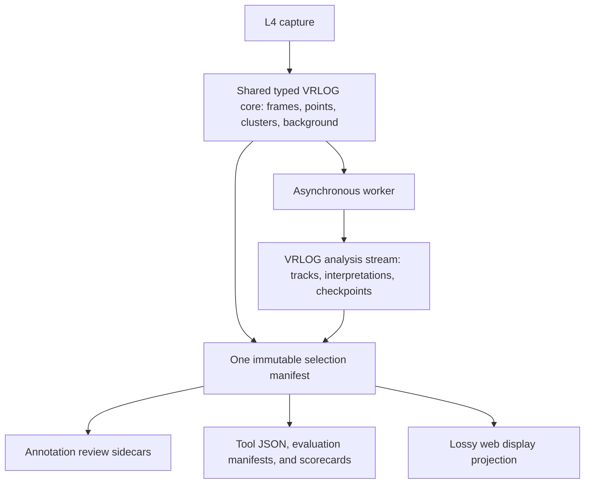

# Shared VRLOG storage for capture, annotation, and evaluation

This plan brings LiDAR observation capture, annotation packs, and evaluation evidence onto one
VRLOG data model, with binary storage and JSON projections. It defines what geometry must survive,
when readers may trust it, and how asynchronous estimates and reviewed labels remain distinct.

- **Status:** Proposed design; no format or runtime changes implemented
- **Layers:** L2 provenance, L3 retention boundary, L4 evidence, L5 estimation, L9 playback
- **Canonical:** [LiDAR architecture](../lidar/architecture/LIDAR_ARCHITECTURE.md)
- **Related:** [Asynchronous tracking proposal][async-plan], [state estimation][state-plan],
  [lossless persistence batching][batching-plan],
  [point annotation and object datasets](lidar-point-annotation-and-object-dataset-plan.md)
- **Evidence baseline:** Checkout `5330da30ef21062d0bc917a60b6b1cd13167527e`; linked proposals use
  pinned, unmerged revisions and are not claims about this checkout's runtime

## 1. Decision and scope

Capture owns an ordered, immutable L4 observation stream. An independently scheduled worker owns
association, visible-face interpretation, body dimensions, pose, and trajectory. The worker jointly
fits these quantities over bounded look-back and look-ahead intervals; it must be able to revise
associations and point ownership, not merely smooth centres assigned by the causal tracker.

Use **one canonical VRLOG data model and reader**, with typed protobuf payloads for frames, points,
clusters, tracks, background, and provenance. The new observation profile specifies which evidence
must be present; it is not a fourth independent geometry format. Its storage envelope is
independent of the visualiser's `FrameBundle`, while capture evidence and revisable analysis occupy
separate streams. Packs select from that common model, and JSON delivery projects it for a named
purpose.

Reuse identities and contracts from the observation-store work. New binary captures and analysis
runs use VRLOG streams as their authority; SQLite supplies rebuildable catalogues/result views and
transactional operational bookkeeping. Annotation and tool-oriented selections share the same point
domain and codec. Human review sidecars remain a separate, revisable authority for labels.

The design choices below are proposed implementation commitments, not delivered features.

| Choice                                                                             | Reason and limit                                                                                             |
| ---------------------------------------------------------------------------------- | ------------------------------------------------------------------------------------------------------------ |
| Freeze and append every L4 frame before L5 work                                    | Capture continues when estimation stops; display subscriptions and track acceptance cannot remove evidence.  |
| Retain complete point membership for the declared profile                          | Merged and split clusters can be reconsidered without changing the original extraction.                      |
| Share points and selection identity across recording, annotation, and tool exports | Avoid competing geometry authorities while supporting local references and portable subsets.                 |
| Preserve source precision before seeking compression savings                       | Current `WorldPoint` coordinates are float64; the visualiser's float32 arrays cannot reproduce them exactly. |
| Publish only durable, whole-frame batches to live workers                          | A readable byte is not necessarily a recoverable observation.                                                |
| Separate immutable input from revisable inference                                  | Unseen surfaces, point ownership, and motion hypotheses remain estimates with explicit provenance.           |
| Begin with simple motion inside joint estimation                                   | Constant velocity is a useful comparator; richer dynamics must show a measured benefit.                      |
| Keep accumulated shape belief across window advances                               | Seeing one face repeatedly does not make the unseen face measured, nor justify forgetting earlier views.     |

This increment changes capture, encoding, recovery, and scheduling. It is separate from the
existing lossless-only SQLite batching proposal. It does not choose a production estimator, prove
vehicle dimensions, replace PCAP for L1–L3 experiments, or establish a publication/privacy
guarantee.

### Sprint 0.5.2.2 boundary on `dd/docs/state-est`

The first consumer is an offline, independently scheduled L5 worker on committed observations from
known PCAP captures. Reuse `l4bobserve` identities and the existing SQLite frame-batch path as a
fidelity oracle. Define and encode source-ordered L4 frames, explicit empty/gap states, full
foreground membership, acquisition lineage, profile capabilities and commit frontiers before that
worker reads a batch. A reduced legacy JSON observation must remain readable, but must fail a
request for the complete accuracy profile. The worker writes a separate, versioned analysis stream;
it never changes capture evidence. A portable or live producer then uses this same contract, after
its latency, power-loss and backlog evidence is measured.

This is the shared source for the state plan's capture-time CV, face-aware measurement, bounded
reassociation and fixed-lag comparisons. The existing combined L4-plus-L5 SQLite transaction is
not the new writer: waiting for L5 would defeat the split. Keep its semantic checks and migration
reader; do not add another authoritative payload copy or change the old record in place.
Annotation-pack consolidation, web projections, remote transport, compression tuning and Pi
default enablement are follow-ons. None may redefine point identity or quietly lower the declared
accuracy profile. Desktop estimator acceptance does not claim the target-hardware G-OBS-CRASH or
G-OBS-PI gates have passed.

## 2. What exists and what must change

| Inspected source                                                                                                 | Existing behaviour                                                                                                      | Consequence                                                                                         |
| ---------------------------------------------------------------------------------------------------------------- | ----------------------------------------------------------------------------------------------------------------------- | --------------------------------------------------------------------------------------------------- |
| [Recorder](../../internal/lidar/l9endpoints/recorder/recorder.go)                                                | Format `0.5`, length-prefixed protobuf chunks; header and in-memory seek index written at `Close()`                     | Reuse the binary/chunk approach, but introduce incremental commits, integrity checks, and recovery. |
| Recorder provenance                                                                                              | Source type, exact configuration identities and hashes, recorder build, and configuration build are already represented | Extend this provenance; do not introduce a second incompatible configuration identity.              |
| [Visualiser protocol](../../proto/velocity_visualiser/v1/visualiser.proto)                                       | Float32 XYZ, intensity, classification, and decimation metadata; optional cluster sample points                         | No stable cluster membership, per-return timing, or complete acquisition identity contract.         |
| [Storage codec](../../internal/lidar/l9endpoints/recorder/proto_codec.go)                                        | Cluster conversion omits `sample_points`, `height_p95`, and `intensity_mean`                                            | Current comments about a lossless round trip do not establish complete evidence preservation.       |
| [Adapter](../../internal/lidar/l9endpoints/adapter.go)                                                           | Emits only clusters unassociated with tracks; may emit foreground-only points                                           | The capture tap must precede display filtering and be independent of L5 identity.                   |
| [Publisher](../../internal/lidar/l9endpoints/publisher.go)                                                       | May strip background before recording; recording depends on publisher execution                                         | Evidence recording must not depend on client delivery or replay's ownership of the display stream.  |
| [Point types](../../internal/lidar/l2frames/types.go) and [L4 types](../../internal/lidar/l4perception/types.go) | L2 carries float64 geometry, acquisition times, channels, and packet hints; L4 world points have a smaller field set    | Carry acquisition lineage alongside L4 points before fields disappear.                              |

The [state-estimation branch][state-plan] has `l4bobserve` immutable snapshots and a SQLite
observation store. Its snapshot contract caps retained/sample points at 1,024; its store uses JSON.
The [batching plan][batching-plan] preserves that existing contract in one L4-plus-L5 frame
transaction and leaves automatic resume out of scope. Empty batches do not provide a durable record
of every sensor frame. None of this is the continuous binary capture contract proposed here.

Consolidate rather than maintain two competing definitions of an observation:

1. Extend the track-independent domain contract with frame records, source ordinals, retention
   profiles, and membership. Keep the source, calibration, extractor, and configuration identities.
2. Add a versioned binary representation of that contract. Keep the existing JSON reader and its
   fidelity oracle for the old schema; a transcoder must preserve values and declare absent fields.
3. Commit L4 evidence without waiting for L5. Replace the combined transaction boundary only for
   the new asynchronous path; preserve the earlier batching work's equivalence checks.
4. Index committed binary observations in SQLite by immutable references. Catalogue rebuilds may
   lag capture, and must not create another authoritative copy of each point payload.
5. Adapt old corpus readers and new binary readers to the same estimator input contract, rejecting
   missing capabilities when an experiment requires them.

The current replayer reads `header.json` and `index.bin` without a sufficient profile rejection
contract. Merely changing the version string is unsafe: protobuf can accept a different message
with overlapping field numbers. Section 7 specifies a distinct layout and tested rejection.

### Existing packs and JSON exports

The access patterns differ, but they do not require separate definitions of a point or frame.

| Existing artefact                                                | Inspected contract                                                                                                                                                              | Consolidation direction                                                                                                             |
| ---------------------------------------------------------------- | ------------------------------------------------------------------------------------------------------------------------------------------------------------------------------- | ----------------------------------------------------------------------------------------------------------------------------------- |
| [Annotation pack](../../internal/lidar/annotation/pack.go)       | Schema v1 `manifest.json`, `samples.json`, and `points.bin`; float32 XYZ, uint8 intensity/classification, sample-local indices, byte hashes                                     | Evolve the pack manifest into an immutable selection over the common evidence model; retain the v1 reader.                          |
| [Annotation sidecar](../../internal/lidar/annotation/sidecar.go) | Independent human object IDs, arbitrary point/uncertain masks, visibility/completeness, review status, pose assertions, and revision history                                    | Retain this distinct human-review domain, bound to the selection digest. Labels never become fields mutated inside capture records. |
| [Web scene export](../../internal/scene/export.go)               | Derived JSON header/index and compressed NDJSON; stride/caps, coordinate rounding, relative times, dropped nonmonotonic frames, and remapped track IDs                          | Keep a declared lossy display projection from the shared reader. It is neither estimator input nor ground truth.                    |
| [State-estimation evidence tool][evidence-tool]                  | SQLite `observations.db` containing JSON observation payloads and linked estimate/residual rows, alongside replay manifests, tracking baselines, VRLOG, and summary/oracle JSON | Import the three record families into common typed streams; retain manifests, scores, and ordered semantic comparison.              |

The current annotation exporter selects point-bearing frames, not clusters with durable parent
point IDs. Its background context has separate hashes outside the labelable pack digest, and uses
source order to choose the active snapshot. The scene export's source digest covers header/index,
whereas annotation provenance covers the source header and frame chunks. Preserve those legacy
digest meanings and label the digest domain/version; identical-looking hash strings are not proof
of equivalent source coverage.

The tuning evidence directory is a corpus bundle, not another opaque point codec. A sampled legacy
corpus at `/Volumes/lidar/lidar/state-estimation-marina-first-20260912` uses `record_json`
observations and a configured 256-point retained sample. That retention limit survives migration:
neither its SQLite container nor the domain's 1,024-point ceiling makes it complete foreground
evidence.

A second inspected corpus, `state-estimation-phase01-24site-20260917/3rd-folsom-observations.db`,
has populated observation/estimate/residual records but empty background snapshot/region tables.
Its manifests declare a 256-point retained-sample cap, no visualiser points, and unknown writer
build identity. These are schema/content inspections, not a fresh corpus integrity or oracle
validation; the pinned #559 source explains the contract without establishing the historical
artefact's exact build.

| Existing evidence family                                                     | Common VRLOG record mapping                                                                                                                                       |
| ---------------------------------------------------------------------------- | ----------------------------------------------------------------------------------------------------------------------------------------------------------------- |
| `lidar_observations`                                                         | Immutable cluster/point evidence, source/calibration/frame identity, original summaries, and supported plane/edge primitives; preserve the legacy sampled domain. |
| `lidar_track_estimates`                                                      | Analysis-run track/state records with observation links, estimator/model/parameter identities, measurement time, covariance, and stage.                           |
| `lidar_track_residuals`                                                      | Interpretation/residual records containing prediction, measurement, innovation, normalised innovation squared, geometry/covariance, and disposition.              |
| Replay manifest, baseline, scorecard, and [evidence oracle][evidence-oracle] | Versioned JSON audit products referring to shared input/run digests; keep ordered table/frame counts, source-PCAP manifest hash, and legacy comparison rules.     |

Preserve the original SQLite corpus as an archive. Transcoding must compare every represented field
and linkage against its existing semantic oracle, which excludes insertion time and SQLite page
layout. New binary/JSON semantic digests have an explicit version and field mapping; they must not
claim byte equality with the old `record_json` serialisation. Missing empty frames and source point
lineage remain missing unless independently recovered from the original source.

## 3. Evidence and identity contracts

### 3.1 Session, frame, and observation identities

Do not derive identity from timestamp and cluster number alone. Timestamps can repeat, clocks can
reset, and the same capture can be extracted using different parameters.

| Scope      | Required fields and meaning                                                                                                                                                                  |
| ---------- | -------------------------------------------------------------------------------------------------------------------------------------------------------------------------------------------- |
| Capture    | Random durable capture UUID allocated before ingestion; sensor identity; source type; parent capture/import identity; source creation context.                                               |
| Source     | Live source session or PCAP content manifest identity; PCAP byte hashes when available; decoder version and source ordering. A live capture's later content digest supplements its UUID.     |
| Extraction | Extraction UUID, exact code/build and configuration hashes, decoder/calibration identities, retention profile, algorithm versions, schema and required capabilities.                         |
| Epoch      | Sensor/clock epoch, time basis and conversion uncertainty, sensor placement/pose epoch, validity interval. Clock resets and relocations create explicit boundaries.                          |
| Frame      | Capture and extraction identities, sensor/epoch, monotonically assigned source-frame sequence, capture start/end, receive/append times, rotation identity when supplied, status, and counts. |
| Point      | Frame identity plus retained-array index; a separate original source ordinal, and packet/block/channel/return locator where available. Coincident coordinates remain distinct points.        |
| Cluster    | Frame identity plus extractor-local cluster ordinal; immutable membership and extractor summaries. A cluster ID never implies a persistent vehicle.                                          |
| Analysis   | New run identity plus input manifest/commit range, estimator and observation-model versions, parameters, priors, random seeds, and numerical execution policy.                               |

Source ordinals are assigned before filtering and never recycled within the frame. Carry them
through copies, transforms, ground rejection, and clustering. A voxel representative is a derived
point with a contributor map, not a raw return silently given another return's identity. Cross-run
reattachment uses capture and acquisition lineage; coordinate equality alone is not a general
identity guarantee. Existing annotation packs retain their original identity scheme.

Source sequence orders capture; timestamps describe physical time. Store sensor time, converted
capture time, and clock mapping separately when conversion occurs. Missing time quality is unknown,
not perfect synchronisation. Multi-sensor fusion requires explicit alignment uncertainty and cannot
be inferred from matching wall-clock values.

### 3.2 Retained points and cluster membership

Choose `foreground-complete` as the accuracy-development profile: preserve all L3-labelled
foreground returns before destructive ground/height filtering, voxel reduction, or per-cluster
caps. This requires an earlier point-buffer tap, even though the completed frame commits after L4.
Until that tap exists, name the actual narrower boundary and fail a request for the richer profile.

The frame contains one ordered retained-point domain. A cluster refers to indices in that domain;
points not selected by the extractor have an explicit unassigned status and rejection reason where
known. An empty cluster set can therefore accompany non-empty evidence.

| Component           | Required representation                                                                                                                                                                  |
| ------------------- | ---------------------------------------------------------------------------------------------------------------------------------------------------------------------------------------- |
| Coordinates         | Packed float64 arrays for the authoritative retained geometry, with identical lengths and original order. Preserve float32 summaries at their original precision.                        |
| Acquisition         | Signed 64-bit nanosecond offsets from a declared frame time; intensity in its native scale; channel/ring, return type/index, packet/block provenance, and validity masks when supported. |
| Membership          | Sorted, unique retained-point indices per extractor cluster, or an equivalent lossless partition encoding; unassigned indices complete the domain.                                       |
| Filtering lineage   | Original ordinals, stage/reason masks, before/after counts, deterministic selection parameters/seeds, and contributor maps for aggregate points.                                         |
| Cluster summary     | Original centroid, AABB/OBB, counts, height/intensity descriptors, extractor method/configuration, and heading-axis ambiguity. Summaries are observations, not corrected body centres.   |
| Optional primitives | Track-independent planes/edges with support-point indices, fit method, residuals, and degeneracy/quality metadata. Recomputable caches cannot replace supporting points.                 |

The chosen initial extractor membership is an exclusive partition plus unassigned points. If a
future extractor emits overlapping candidates, it needs an advertised capability and a separate
candidate-membership relation; it cannot violate the partition implicitly. Later per-point vehicle
ownership belongs to analysis results, with alternatives or unresolved ownership explicitly named.

Array length, index range, duplicate membership, counts, time bounds, finite coordinates, and
required-field presence are validated before acceptance. Invalid source returns are explicitly
counted or represented with validity flags; converting them to zeros would invent measurements.
Define absence independently of scalar zero: ring zero or an intensity of zero may be valid data.

### 3.3 Frames with little or no evidence

| State             | Interpretation                                                                                                   |
| ----------------- | ---------------------------------------------------------------------------------------------------------------- |
| Observed, empty   | Processing completed; no points/clusters in the declared domain.                                                 |
| Observed, partial | Some returns survived, with known or unknown packet loss explicitly reported.                                    |
| Missing           | A source sequence or interval was lost; include bounds and certainty, without inventing exact missing rotations. |
| Unsettled         | Background was not ready; any retained data and excluded stages remain stated.                                   |
| Suppressed        | A named policy/profile deliberately skipped computation or retention.                                            |
| Failed            | Extraction or storage admission failed; include stage, affected extent, and recoverability.                      |

Completeness, processing disposition, and payload availability are separate fields: an unsettled
frame can also have packet loss. Store packet sequence gaps, decoder errors, queue overruns, sensor
RPM/cadence, background epoch/settling state, and per-stage input/output/rejection counts. Never
turn an unknown count into zero. An interval gap record covers known bounds when individual frame
IDs cannot be recovered. Readers must not treat a gap as evidence that the road was empty.

### 3.4 Geometry, calibration, and motion compensation

Each frame references immutable calibration, extrinsics, sensor pose, ground reference, and clock
mapping objects. Embed these objects or package verified local content-addressed copies; a mutable
database row or external path alone cannot reproduce the geometry.

| Reference           | Required contract                                                                                                                                                         |
| ------------------- | ------------------------------------------------------------------------------------------------------------------------------------------------------------------------- |
| Coordinate frame    | Axis directions, handedness, origin, units, transform direction, and frame identity; local metres and radians are the analysis convention.                                |
| Calibration         | Sensor model/serial, channel angle/range/firetime corrections, version/content hash, validity, and calibration uncertainty or explicit unknown status.                    |
| Extrinsics and pose | Full transform, time dependence/interpolation method, pose epoch, and covariance parameterisation including relevant correlations. Static placement is explicitly static. |
| Ground reference    | Plane/surface model, coordinate frame, supported region, validity, uncertainty, and derivation. A grade prior is not a measured vehicle face.                             |
| Deskew              | None, sensor-motion-only, or object-dependent; reference time, algorithm/configuration, inputs, and raw/corrected array relationship.                                     |
| Original geometry   | Preserve the chosen canonical L4 coordinates exactly, plus pre-deskew sensor coordinates or original polar returns when reversibility is advertised.                      |

Reapplying a transform is not guaranteed to reproduce float64 coordinate bits. Exact L4 replay
therefore retains the actual L4 input coordinates. A reversibility capability additionally retains
the original representation and transform inputs; it must not promise inversion from rounded
corrected coordinates. Range/angle recalibration needs original polar values or PCAP and is a
separate capability from replaying the retained Cartesian geometry.

Object-dependent compensation uses a hypothesised trajectory. Store it as an interpretation linked
to the original returns, never as the sole immutable evidence. A sensor-motion correction can be
part of capture only with its provenance and pre-correction evidence retained for the rich profile.
Missing timing or calibration limits the available estimator; it cannot be repaired by confident
metadata defaults.

## 4. Binary format and durable publication

### 4.1 Container and payload

Use one new major VRLOG container version and magic, with explicit stream kind and capability
profile. A full capture requires an observation stream; an analysis run or portable selection may
reference parent committed observations without claiming to be a complete capture. All use the same
container reader. The layout has an immutable manifest, metadata objects, sealed protobuf chunks,
per-chunk indexes, commit generations, and a small current-generation pointer. A final summary is
optional; a clean `Close()` is not needed to read committed observations.

Reuse protobuf tooling and common container utilities, not visualisation payload semantics. Define
a shared recording-domain protobuf package with reserved retired field numbers and explicit schema
and capability versions. Frame/point/cluster evidence, background context, resumable grid state,
and versioned track/interpretation results have distinct record kinds in that common schema. They
share references and codec, not mutability or completeness claims. Extend the
[protobuf generation targets](../../Makefile) and compatibility fixtures when implemented.

A display adapter derives existing visualiser messages from this model. A recorded display
`BackgroundSnapshot` is a point-cloud view of background; it is not a complete resumable L3 grid.
If a grid checkpoint is present, name its state schema, code compatibility, content hash, and
configuration. Do not advertise the resumable-grid capability from display points alone.

Existing [L3 persistence](../../internal/lidar/l3grid/background_persistence.go) uses gob with gzip
for grid cells and [snapshot metadata](../../internal/lidar/l3grid/types.go) plus region JSON.
Migrate these into typed background/grid/region records by field-value equivalence, preserving
range/spread, counts, update/freeze times, foreground/locked-baseline state, parameters, ring
elevations, region membership, variance, and settling/source provenance. A resumable checkpoint
also needs all relevant algorithm state and a proven continuation test; successful decoding of
cells alone is insufficient.

Provide a schema-derived JSON mapping for tools that need inspectable records. It uses the same
entity names, IDs, presence rules, units, and capabilities, with decimal strings for 64-bit integer
times/IDs and round-trippable float values. Binary storage remains the authority; bounded JSON
exports are views with input digests, not a second independently maintained schema. Keep the
current rounded scene JSON under its separate display profile. Domain-specific scorecards and human
review provenance remain sidecars rather than arbitrary fields forced into point records.

| Structure         | Contract                                                                                                                                                                               |
| ----------------- | -------------------------------------------------------------------------------------------------------------------------------------------------------------------------------------- |
| Manifest          | Magic, major/minor container version, profile, schema/capability set, capture identity, profile limits, exact provenance, and metadata-object digests; durable before frame admission. |
| Record envelope   | Fixed magic/type, bounded length, frame/source identity, sequence, codec identifier, stored/uncompressed lengths, and CRC32C over envelope and payload.                                |
| Frame payload     | Protobuf frame evidence, with point arrays and membership; frame completeness is atomic. Unknown required capabilities or mandatory record types reject processing.                    |
| Chunk             | Ordered whole frames/gap records; chunk ordinal, frame/time bounds, byte length, record count, and SHA-256 digest. No cross-chunk protobuf state or compression dictionary dependency. |
| Index             | Frame sequence and capture time to chunk, 64-bit offset/length, metadata epoch, and record kind; sealed per chunk, bounded in memory, rebuildable from validated records.              |
| Commit generation | Previous-generation digest, ordered new chunk/index digests, contiguous covered source extent, metadata dependencies, and cumulative counts. Gaps are part of coverage.                |

Start without compression. Add only lossless, independently decodable blocks after the fidelity and
hardware gates pass; compression ratio is a measurement to collect. A checksum detects corruption,
not hostile tampering. Content hashes identify exact stored bytes; do not assume protobuf bytes are
canonical across languages or versions. A separate versioned semantic digest defines field order,
presence, array order, and IEEE float bits for cross-codec fidelity checks.

Provisional test limits are an 8 MiB target chunk, a 64 MiB maximum encoded frame, and a 128 MiB
hard uncompressed chunk bound. Rotate before adding a frame that would exceed the hard bound; never
truncate a large frame to fit. Reject an over-limit frame explicitly and mark capture incomplete.
Bound protobuf recursion, repeated-field counts, indexes, metadata sizes, and decompression output
before allocation. Final limits depend on dense-scene measurements, not these convenient numbers.

### 4.2 Synchronous capture and the durable frontier

The L4 callback freezes an owned frame and synchronously appends it through one ordered writer
before accepting the next frame. It never waits for tracking, a display client, or a remote worker.
The writer may batch durability work; successful append means **accepted**, not **durable**.

Use group commit as the first measured policy, with a provisional 100 ms maximum open-batch age or
the byte threshold above, whichever is reached first. A strict mode can wait for each frame's
durable commit. Record the policy and measured synchronisation latency in the capture manifest.
Neither policy allows an unbounded queue behind the writer.

For each generation, the single writer:

1. Finishes whole-frame records, writes checksums and the index, and closes the logical batch.
2. Synchronises chunk/index and new metadata contents, publishes their immutable names by atomic
   same-filesystem rename, and synchronises the containing directories.
3. Writes and synchronises the generation manifest referencing those durable objects, then
   publishes it and synchronises its directory.
4. Atomically replaces the current-generation pointer and synchronises its directory. Only after
   all required calls succeed does it acknowledge and announce the durable frontier.

Live readers receive this post-synchronisation frontier from the capture service or its local
reader API. Merely seeing a renamed pointer does not prove the final directory sync has completed.
Filesystem-only offline readers enter through recovery/validation, not an assumed live tail. Remote
readers require verified objects and the corresponding committed generation before advancing.

Declare the possible crash-loss interval as the bounded upstream queue age, open-batch age, and
commit deadline together; report its byte/frame bounds as well. The 100 ms test setting alone is
not a 100 ms power-loss guarantee. If synchronisation stalls beyond the declared bound, enter
capture failure and stop acknowledging new accepted evidence. Already accepted, uncommitted frames
remain at risk. State separately what the tested filesystem and storage device honour on power
loss; a successful `write`, `Close`, or `fsync` is not a universal hardware promise.

### 4.3 Recovery, incremental reads, and seeking

On reopen, validate manifest/profile, metadata dependencies, generation chain, index bounds, and
record/chunk checksums. The last complete validated generation defines the usable prefix. A torn
pointer can fall back to a validated predecessor. A complete later generation may be recovered and
durably promoted with an explicit recovery record; it cannot appear twice because an
acknowledgement was lost. Uncommitted tails are quarantined, not quietly offered to workers as
observations.

Corruption within a committed prefix fails normal analysis with its affected range. An explicit
salvage run may omit it and add gap records in a new manifest; it must retain the original artefact
and cannot claim the same complete input identity. Rebuildable indexes cannot override a failed
chunk digest. Recovery never rewrites already committed evidence.

Readers consume immutable generations in order and keep a bounded chunk cache. A filesystem wakeup
is a hint to refresh the generation, not evidence of a complete frame. Seeking first resolves frame
sequence, epoch, and required metadata; timestamps alone are ambiguous across clock resets. A range
request includes predecessor metadata and worker warm-up/checkpoint requirements. Playback can show
a selected frame directly; trajectory estimation cannot silently start with an empty prior there.

### 4.4 Backpressure and overload

Budget the bounded packet/frame ingress buffers separately from the synchronous L4 writer. A paused
PCAP reader can be backpressured. A live UDP sensor cannot reliably be paused: storage stalls may
cause receive loss even when the application waits correctly. Record packet/queue loss where known,
stop claiming complete capture, and emit a gap or terminal failure at the next writable
opportunity.

On disk-full, I/O error, or exhausted reserve, stop evidence admission and expose capture failure.
Reserve a small bounded metadata budget for failure markers, but do not promise that a failed disk
can store its own obituary. Recovery marks an unclosed session incomplete and its tail extent
unknown when no marker survived. Dropping visual updates is permitted; silently dropping admitted
evidence, silently reducing fidelity, or deleting unread chunks is not.

Worker backlog does not block capture until the declared storage budget is reached. Report
captured, accepted, durable, transferred, processed, and finalised extents separately. Remote
acknowledgement must identify verified durable chunks; it is not permission to delete local
evidence unless the retention policy also allows it.

## 5. Joint estimates, revisions, and restart

The worker explains the retained points using persistent body geometry, pose, and a plausible
trajectory. Current visibility and motion prediction jointly constrain the estimate. Repeated views
of one side cannot independently establish vehicle width; store which dimensions are observed,
inferred from earlier evidence, or supplied by priors.

| Result record        | Required information                                                                                                                                                                |
| -------------------- | ----------------------------------------------------------------------------------------------------------------------------------------------------------------------------------- |
| Interpretation       | Input frame/point/cluster references, candidate body identity, visible-surface hypothesis, corrected measurement, residual, uncertainty, and method.                                |
| Association revision | Run/revision identity, replaced interval, cluster and per-point ownership, unresolved/alternative assignments, and split/merge lineage.                                             |
| Body state           | Physical reference point definition, pose, velocity and optional dynamics, dimensions/orientation hypotheses, joint uncertainty or declared approximation, and observability flags. |
| Trajectory           | Capture-time knots, interpolation model and validity, observation/prediction/unsupported status, uncertainty, and physical-consistency validation disposition.                      |
| Shape belief         | Supporting evidence references and viewpoint coverage, prior/catalogue identity where used, shape parameter uncertainty, and evidence already assimilated.                          |
| Quality              | Missing-input and reduced-look-ahead flags, search/resource limits reached, ambiguity, rejected evidence, and calibration/clock/ground uncertainty.                                 |

Exclusive point ownership applies within a selected hypothesis. Alternatives may reuse evidence
only as explicitly separate hypotheses; they cannot be counted as independent measurements or
double-counted in reports. Cluster split/merge repair creates a new interpretation of original
point indices. No operation edits the recorded cluster's membership or assigns a vehicle identity
back into capture evidence.

Choose the statistical window in capture time, with separate frame, point, candidate, and memory
caps. Start the experiment with one second of look-ahead and compare 0.5, 1, and 2 seconds as in
the [async proposal][async-plan]. Carry a boundary state and persistent shape belief beyond the
window. Marginalised information must retain the correlations needed by the chosen estimator, or
declare the approximation; replaying the window must not assimilate its observations a second time.

Advance finality only through processed, contiguous committed coverage with the required future
interval. Explicit gaps resolve input coverage but reduce information; wall-clock passage does not
manufacture future evidence. Freeze states only after checking consistency with the preceding
finalised boundary. A new revision atomically replaces a named interval, so clients cannot assemble
a trail from incompatible versions. Track closure and report finality can lag state finality.

Input arriving beyond the finalised boundary creates a correction run linked to its parent. At
end-of-capture, drain committed input, flag the shortened remaining future window, commit output,
and then mark the run complete. Capture EOF, worker completion, and report completion are distinct.

### Checkpoint transaction and idempotence

Commit an analysis generation containing its typed result records, replaced interval, input cursor,
finality watermark, and checkpoint reference. Apply the same durable-object-then-generation
protocol as capture, in a separate run namespace. The generation is the logical output/checkpoint
transaction: readers see all of it or its predecessor. A large checkpoint is a versioned
content-addressed blob made durable before the generation references it; unused blobs are removable
orphans.

SQLite applies catalogue/result-view/cursor updates in one transaction after that generation
commits. A crash before or during indexing replays the canonical generation into SQLite
idempotently. A database row cannot publish an uncommitted result or advance finality beyond the
VRLOG generation. This keeps one result authority without making capture wait for a database
transaction.

The checkpoint includes active identities/hypotheses, shape cache and lineage, window references,
boundary/marginalisation state, uncertainty and required correlations, model/prior/configuration
identities, random state, counters, and output generation. Store the schema/implementation identity
needed to restore it. A collection of final positions is not a sufficient estimator checkpoint.

Resume only from a compatible checkpoint whose input digests still match. Replay already committed
input with deterministic result keys; an identical duplicate can acknowledge previous success,
whereas the same identity with different bytes is a conflict. Evidence itself has the same rule for
transport retries, rather than an overwrite operation. This is a new resume contract, not a silent
relaxation of the older observation store's duplicate-ID error.

If the checkpoint is absent or incompatible, start a new run from sufficient earlier evidence or
the capture beginning. Mark any shortened warm-up and prior loss. Do not claim equivalence to a
continuous run until the restart comparison passes. Bound retained hypotheses and shape-cache size;
eviction is recorded because it can change later inference.

## 6. Retention, range access, and storage cost

| Profile                | Retained boundary and permitted claims                                                                                                                                                             |
| ---------------------- | -------------------------------------------------------------------------------------------------------------------------------------------------------------------------------------------------- |
| `foreground-complete`  | All L3 foreground before subsequent destructive filtering, original membership lineage, timing, and rich geometry references. Reproduces retained geometry and supports new L4/L5 interpretations. |
| `foreground-reduced`   | Declared ground/voxel/cap/precision reductions with exact selection lineage and loss counts. Useful for constrained operation; cannot claim full evidence equivalence.                             |
| `legacy-visualisation` | Existing VRLOG payload as found. Playback remains valid; missing membership, precision, or timing remains unavailable.                                                                             |
| Full-input companion   | PCAP plus decoder/calibration configuration and sufficient L3 warm-up/background state. Required for reproducible experiments upstream of the retained boundary.                                   |

Lossless compression preserves the selected profile. Quantisation, point caps, or dropped channels
create a reduced profile even if the container codec itself is lossless. A full foreground profile
still excludes returns L3 called background. An occasional display background snapshot is not
necessarily a complete L3 replay checkpoint; retain the required initial state or warm-up PCAP.

An illustrative lower-level payload budget is 32 bytes per point: 24 for XYZ float64 and 8 for a
time offset. Allowing another assumed 16 bytes for intensity, source ordinal, membership, and
acquisition fields gives **48 bytes per point**, excluding protocol overhead, cluster summaries,
metadata, indexes, original/corrected duplicates, and output history. This is arithmetic, not a
measured protobuf size or a promised compression ratio.

At an assumed 2,000 retained points per frame and 10 Hz, that payload is 0.96 MB/s, approximately
3.46 GB/hour or 82.94 GB/day in decimal units. At 20,000 points per frame it is ten times larger.
Dimension disk, transfer, and memory budgets using measured worst-scene distributions, not only the
average. A one-second future horizon also needs history, arriving frames, candidate hypotheses,
shape belief, and decoder buffers; raw window bytes alone are not peak worker memory.

Chunk/time indexes support range reads without loading the whole capture. Deduplicate immutable
calibration/configuration objects by content hash. Retain observations until active consumer
leases, checkpoints, evaluation holds, and the declared raw-evidence policy permit deletion.
Reserve storage for pending chunks and metadata. Garbage collection must never remove dependencies
of a live checkpoint or export; a later inability to reanalyse deleted data remains visible in run
provenance.

Retention is local and bounded by policy. Keep raw evidence, labels, and published reports under
separate retention/export rules. Keeping richer geometry for accuracy work is not approval to
publish it, retain it indefinitely, or link vehicle identities across independent captures.

## 7. Shared selections, annotation, and compatibility

### 7.1 One selection manifest, the same point codec

Make the next annotation pack an immutable **selection of the common VRLOG model**, not another
point-file specification. The same selection can be used by labelling tools, analysis tools, or
agents. A manifest identifies an ordered frame/point domain, detector proposals, optional analysis
run/revision references, immutable background/calibration context, and completeness/retention
limits.

| Selection field   | Meaning                                                                                                                                                  |
| ----------------- | -------------------------------------------------------------------------------------------------------------------------------------------------------- |
| Parent            | Capture/extraction and evidence-root identity, committed range, required capabilities, and original digest algorithms.                                   |
| Domain            | Ordered parent frame IDs and selected parent point IDs; deterministic local sample/index mapping; any excluded intervals and selection rule.             |
| Context           | Immutable background/grid/calibration references with their own digests and validity/source-order rules; clearly separate labelable points from context. |
| Proposals/results | Original cluster IDs and memberships, or explicitly selected analysis run/revisions. These are suggested groupings, not reference object identities.     |
| Identity          | Versioned digest of the logical selection, point values, parent references, and required context, independent of file locations.                         |
| Storage           | Verified parent chunk locations or materialised subset locations using the same point/evidence codec, with byte lengths and content hashes.              |

For local work, resolve the selection directly against retained source chunks and pin them with a
retention lease: no duplicate point file is needed. For portable/offline work, materialise the same
selection using the shared codec and include its metadata dependencies. Only storage locations and
physical byte digests change; parent point IDs and the logical label domain remain stable. This is
one manifest with two storage choices, not two new pack formats.

A subset payload is explicitly a selection, never a newly complete source frame under an old frame
ID. Its local point index maps exactly to the parent retained-point index and source ordinal.
Repacking cannot mint replacement parent IDs, silently renumber masks, or claim discarded context
was inspected. Lossless materialisation preserves selected values; a lossy projection has a new
identity and cannot inherit reviewed masks without an explicit validated transfer.

Individual-cluster extraction selects original membership as a proposal and includes neighbouring
points, unassigned foreground, and nearby frames as declared context. A reviewer can select part of
a cluster, join fragments, separate merged vehicles, reject contamination, or label a missed
object. An entire detector cluster is never the only permitted label unit. Exhaustive
negative-region claims require an explicitly reviewed domain; a sparse object crop cannot establish
them.

Keep the existing sidecar's object identities, proposed/reviewed/rejected states, uncertain
indices, visibility, completeness, revision history, and optimistic concurrency. Bind it to the
immutable selection identity. Pose/extent assertions keep their own review and uncertainty,
separately from observed-return masks. A reviewed visible mask does not prove the unseen centre or
far face.

The ordinary web scene JSON remains a lossy projection. If a future web labelling client needs
exact points, it uses the shared reader/selection and point map; do not invent an additional web
annotation geometry format. Preview point indices and remapped display track IDs are not label IDs.

### 7.2 Compatibility and migration

Use the common new VRLOG root magic and filenames for observation, analysis, and selection content,
without legacy `header.json`, `index.bin`, or `FrameBundle` chunk placement at that root. Legacy
readers must fail opening it. Do not provide a deceptive compatibility header: a profile/version
field alone is insufficient protection against older code. Test supported old readers explicitly,
including protobuf's unknown-field cases.

New readers dispatch by root magic, major version, stream kind/profile, and required capabilities.
Optional additive fields may be ignored only when the requested operation does not depend on them.
Unknown major versions, record kinds necessary for continuity, or precision contracts fail with an
actionable message. Keep the shared transport envelope independent of protobuf package and display
schema.

Existing VRLOGs and #559 JSON corpora remain readable under their original contracts. Conversion
copies only available evidence, preserves original identities through a mapping, and declares the
legacy retention boundary. It cannot manufacture per-point time, membership, missing clusters,
source precision, or empty-frame records. Re-extract PCAP for a richer corpus when available.

Keep annotation v1 packs and sidecars intact. Lift masks only after validating an exact
source-index mapping and all mask/review semantics; never guess membership using XYZ, which may
coincide or have been rounded. If no exact source mapping is available, the v1 pack remains its own
valid legacy domain. Do not silently promote it to richer capture evidence. Preserve the old
background digest boundary rather than retroactively changing existing pack identities.

Extend the shared [Go fixture](../../internal/lidar/annotation/swift_fixture_test.go) and
[Swift fixture](../../tools/visualiser-macos/VelocityVisualiserTests/AnnotationPackTests.swift) to
cover legacy digests, the samples-JSON trailing-newline rule, new parent IDs, materialised and
referenced views, arbitrary masks, and unchanged review status. Existing raw annotations remain
available throughout migration. Update the existing
[VRLOG checker](../../cmd/tools/vrlog-check/main.go) for new container/profile validation.

Provide an explicit derived visualisation export for old clients. Its manifest names the parent
observation digest and losses. Store it separately from the authoritative observation root; it is a
compatibility view, not another evidence format. Do not write both canonical JSON and canonical
protobuf indefinitely. Phase 1 compares them on shared supported fields before new binary capture
becomes authoritative for the selected profile.

## 8. Evidence gates and delivery

No runtime gate below has been passed by writing this design. Assign a named implementation owner
for each role before work starts and keep hardware results separate from unit or desktop results.

| Gate         | Evidence required                                                                                                                                                                                                                                                                                                                |
| ------------ | -------------------------------------------------------------------------------------------------------------------------------------------------------------------------------------------------------------------------------------------------------------------------------------------------------------------------------- |
| G-OBS-FID    | Exact round-trip source values, float bits, presence, ordering, identities, membership, summaries, and provenance; coincident points and boundary indices included. Compare direct L4 input with decoded binary, and old JSON only within its declared capability overlap.                                                       |
| G-OBS-REP    | Fixed replay identities and ordered input reproduce exact evidence fields. Independent captures/runs retain distinct IDs; compare a declared semantic projection excluding only enumerated ephemeral run metadata. Cross-platform estimator results use predeclared tolerances, never storage-precision loss.                    |
| G-OBS-GEO    | Controlled geometry and held-out PCAP cases compare direct L4, binary replay, reduced profiles, and full PCAP re-extraction. Measure pose/speed/shape error, identity switches, ambiguity, uncertainty coverage, and jitter separately.                                                                                          |
| G-OBS-TIME   | Empty, partial, dropped, unsettled, suppressed, and failed frames; duplicate times, variable cadence, clock resets, calibration/pose changes, seek, and end-of-capture preserve time and completeness semantics.                                                                                                                 |
| G-OBS-REV    | Split/merged clusters, occlusion beyond the horizon, provisional reassociation, final-boundary conflicts, late input, shape carry-over, and point ownership do not rewrite evidence or double-count observations.                                                                                                                |
| G-OBS-CRASH  | Inject truncation, corruption, reordered generations, missing metadata, oversized lengths, and crashes at every publication step. Power-loss tests verify the declared hardware loss bound; a killed process alone is insufficient.                                                                                              |
| G-OBS-QUEUE  | Slow/paused readers, retries, stale cursors, concurrent seeking, writer stalls, remote range fetch, and retention leases expose only committed whole frames and neither skip nor duplicate input.                                                                                                                                |
| G-OBS-RESUME | Crash before/after output transaction and checkpoint publication; resume matches uninterrupted output under the declared numerical policy, with no repeated evidence assimilation or partial revision.                                                                                                                           |
| G-OBS-PI     | On target Raspberry Pi and storage hardware, measure sustained/worst-scene write rate, p95/p99/max append and sync latency, input loss, queue age, memory, CPU, energy, disk growth, and backlog recovery. Include thermal throttling and disk-full behaviour.                                                                   |
| G-OBS-COMPAT | Old logs replay; old readers reject the observation root; unknown required capabilities and reduced evidence are refused when the experiment requires more. Index rebuilds preserve the same usable range.                                                                                                                       |
| G-OBS-PACK   | Referenced and materialised selections expose identical parent IDs, exact values, masks, context, and review state in Go and Swift. Test subsets, coincident points, mixed legacy digests, stale sidecars, missing source chunks, split/merge labels, and explicit failed transfers. Display JSON cannot pass as exact evidence. |

The geometry benchmark includes one-sided views with unobservable width, face changes without true
acceleration, real braking/turning, two vehicles joining one cluster, split detections,
moving-sensor timing, and ground-grade changes. Compare simple joint motion, fixed-association
smoothing, and richer dynamics with the same evidence. Reviewed masks judge visible membership and
association; physical centre, unseen extent, and absolute speed need independent reference
measurements or controlled synthetic truth. A smoother trail alone does not establish greater
accuracy.

| Phase                       | Delivery and exit                                                                                                                                                                                                                                                                                    |
| --------------------------- | ---------------------------------------------------------------------------------------------------------------------------------------------------------------------------------------------------------------------------------------------------------------------------------------------------- |
| 0. Freeze the contract      | Map #559 domain fields, #582 scheduling semantics, annotation packs/sidecars, and tool/web projections into one model and capability matrix; freeze fixtures, fidelity targets, limits, and hardware thresholds. No default changes.                                                                 |
| 1. Codec and offline reader | Implement the shared typed payload/envelope, identity mapping, metadata packing, and range index. Pass G-OBS-FID, G-OBS-REP input checks, and G-OBS-COMPAT. Selection-manifest migration and G-OBS-PACK follow the first worker.                                                                     |
| 2. Capture and durable tail | Add the pre-display L4 tap, pre-reduction point lineage, ordered writer, commit generations, recovery, and explicit failure accounting. Pass G-OBS-TIME and G-OBS-QUEUE; test process-crash paths now. Full G-OBS-CRASH includes target-hardware power-loss evidence before live default enablement. |
| 3. Worker and restart       | Use committed observations for joint interpretation with a simple motion comparator; add revisions, persistent shape belief, output/checkpoint transactions, and correction runs. Pass G-OBS-REV and G-OBS-RESUME.                                                                                   |
| 4. Accuracy comparison      | Compare direct L4, binary replay and reduced profiles on held-out geometry, association and uncertainty evidence. Pass G-OBS-GEO before promoting the worker's final physical trajectories.                                                                                                          |
| 5. Measured deployment      | Publish target-hardware performance and power-loss results. Pass G-OBS-PI and full G-OBS-CRASH before selecting live defaults or removing any evaluation PCAP dependency.                                                                                                                            |
| 6. Consolidate and operate  | Migrate shared readers, document recovery/retention, and remove duplicate authoritative write paths. Update canonical architecture and planning registers once delivery is evidenced.                                                                                                                |

### Open choices and who resolves them

| Choice                                              | Proposed experiment owner         | Decision criterion                                                                                                                    |
| --------------------------------------------------- | --------------------------------- | ------------------------------------------------------------------------------------------------------------------------------------- |
| Group-commit interval and strict mode default       | Capture/storage maintainer        | Choose from measured Pi latency/energy/loss-window results against an agreed acceptable crash-loss bound.                             |
| Chunk/frame limits and lossless compression         | Storage/performance maintainer    | Bound peak memory and decode time on dense scenes; preserve exact fidelity and meet sustained throughput with measured headroom.      |
| Required raw/polar companion fields                 | Geometry/calibration maintainer   | Compare timing, deskew, and recalibration experiments; advertise only capabilities the recorded fields can reproduce.                 |
| Window, shape representation, and motion complexity | State-estimation maintainer       | Held-out accuracy and uncertainty improvements justify added latency, search cost, and checkpoint state; report failures by scene.    |
| Device disk budget and retention/export rules       | Deployment/product maintainer     | Meet the deployment's recording duration and local-data policy without deleting active dependencies or silently reducing evidence.    |
| Consolidation order with #559/#582                  | LiDAR maintainer                  | One domain contract and authority per capture; legacy evidence/replay gates remain intact across the selected merge order.            |
| Annotation/tool migration order                     | Labelling and capture maintainers | Shared reader/selection parity and exact ID/mask transfer pass before replacing legacy writers; web display remains explicitly lossy. |

These are role assignments for planning, not claims that a person has accepted implementation work.
Set numerical promotion thresholds before experiments; do not select them after seeing the results.

### Delivery checklist

- [x] Inspect current VRLOG path and distinguish existing provenance from missing evidence.
- [x] Reconcile the proposed binary capture with unmerged observation-store and async plans.
- [x] Specify fidelity, timing, durability, revisions, retention, compatibility, and failure gates.
- [x] Align annotation selections and web projections around one evidence model and point identity.
- [ ] Agree implementation owners, acceptance thresholds, and the first deployment's loss budget.
- [ ] Deliver phases 1–3 with the corresponding fidelity and recovery evidence.
- [ ] Publish PCAP/direct-L4 comparisons and target Raspberry Pi results.
- [ ] Select production defaults and update canonical documentation from delivered behaviour.

[async-plan]: https://github.com/banshee-data/velocity.report/blob/9b2014b90d069380c75402c8fcdeb24a96a77801/docs/plans/lidar-cluster-observation-log-and-async-tracking-plan.md
[state-plan]: https://github.com/banshee-data/velocity.report/blob/9e69f1f7c6f9fe493075b8c4a0d28fa13426b9dd/docs/plans/lidar-state-estimation-plan.md
[batching-plan]: https://github.com/banshee-data/velocity.report/blob/9e69f1f7c6f9fe493075b8c4a0d28fa13426b9dd/docs/plans/lidar-lossless-observation-persistence-batching-plan.md
[evidence-tool]: https://github.com/banshee-data/velocity.report/blob/9e69f1f7c6f9fe493075b8c4a0d28fa13426b9dd/cmd/tools/lidar-state-estimation-baseline/main.go
[evidence-oracle]: https://github.com/banshee-data/velocity.report/blob/9e69f1f7c6f9fe493075b8c4a0d28fa13426b9dd/internal/lidar/storage/sqlite/evidence_oracle.go
