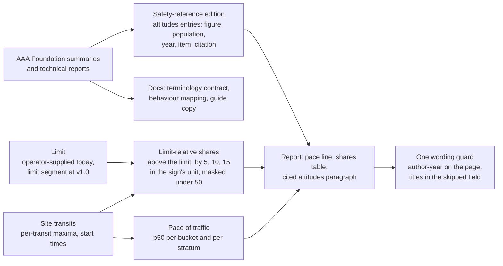

# Public attitudes to speeding and aggressive driving in reports plan

How velocity.report should use two AAA Foundation for Traffic Safety studies, _Attitudes Towards
Speeding_ (2026) and _Aggressive Driving and Road Rage_ (2025): which of their findings a speed
report can cite, which of their terms the project can adopt, which behaviours the sensor can and
cannot observe, and where the two vocabularies collide. The studies measure what people say and
believe; the sensor measures what passes. The plan keeps the two apart on every page and uses each
to explain the other in the docs.

Both report summaries were read in full. The technical reports, the AAA Foundation site and the
AAA newsroom were not reachable from the review environment, so every figure that is not in a
summary comes from press coverage and is marked **Confirm**.

- **Status:** Proposed; no code written
- **Layers:** Cross-cutting (PDF report copy and `data.json`, wording guard, safety-reference edition, L8 behaviour benchmarks, documentation)
- **Target:** v0.5.10 for the shared wording guard, the percentile copy, the pace-of-traffic line, the limit-relative shares against the operator-supplied limit, and the attitudes entries in the safety-reference edition; v1.0 for shares per limit segment and schedule; research notes deferred
- **Companion plans:** [crash data and published risk models](platform-crash-data-integration-plan.md), [behaviour analytics](lidar-behaviour-analytics-plan.md), [posted speed limits](posted-speed-limits-plan.md), [traffic description language](data-traffic-description-language-plan.md), [platform vocabulary](platform-vocabulary-and-data-model-plan.md)
- **Related:** [human crash baselines analysis](../platform/operations/human-crash-baselines-analysis-2026-10.md), [percentile aggregation semantics](../radar/architecture/percentile-aggregation-semantics.md), [identifiability analysis](../platform/architecture/identifiability-analysis.md), [editorial role](../../.github/knowledge/role-editorial.md), [TENETS](../../TENETS.md)
- **Canonical:** [PDF reporting](../platform/operations/pdf-reporting.md)

## Motivation

A speed report prints p85 against a limit and leaves the reader to decide what the gap means. The
attitudes study has now measured how the American public decides: a common social threshold for
speeding sits about 10 mph over the posted limit, enforcement is expected to begin at 10 to 12 mph
over, and 49% of the people asked agreed that driving with the flow of traffic is safer than
obeying the limit. A report that prints p85 of 33 mph in a 25 mph zone is read by half its readers
as normal, by a fifth as evidence the limit is wrong, and by a traffic engineer as the number that
sets limits. The report can meet all three where they stand: print the pace of traffic beside the
limit, print the share of passages above the threshold the public itself uses, and cite where that
threshold comes from.

The aggressive-driving study defines the behaviours the public calls aggressive, grouped into
seven themes. Most of them are gestures, sounds and confrontations a radar or LiDAR cannot see, by
design. Two of them, driving well above the flow of traffic and following too closely, are what the
sensor measures or plans to measure, and the study gives the public's own words for them. The
project can use those words for what it observes without adopting the study's verdicts, because
its wording guard already refuses every verdict word the study is built on.

The consequence of inaction is small and specific: the percentile section keeps calling p98 a view
into "top speeders" and "high-risk driving patterns", two labels on people the sensor never sees;
"survey" keeps meaning a deployment in this repository and a questionnaire in the sources it will
cite; and the one finding that answers the most common objection to a speed report, that everyone
drives with the flow, stays uncited while the flow itself goes unprinted.

## Current state

- **Report copy.** `aggregation-and-percentiles()` in
  [sections.typ](../../internal/report/typst/templates/sections.typ) says p98 gives "a more robust
  view into trends among top speeders" and "clearer insight into high-risk driving patterns". The
  crash-data plan replaces the kinetic-energy paragraph beside it and leaves this one.
- **Speed limit.** A unitless per-request integer, `ReportConfig.SpeedLimit`, default 25, printed
  beside a free-text note. The [posted speed limits plan](posted-speed-limits-plan.md) returns a
  signed limit per road segment at v1.0.
- **Percentiles.** p50, p85 and p98 over per-transit maximum speeds, per
  [percentile aggregation semantics](../radar/architecture/percentile-aggregation-semantics.md).
  Nothing is printed relative to the limit, and nothing is printed relative to the traffic around
  a passage.
- **Direction.** The transit worker reads `ABS(speed)`, so a radar transit has no direction. A
  pace of same-direction traffic is a LiDAR quantity until that changes.
- **Wording guard.** `headway.VerdictPattern` in
  [wording.go](../../internal/report/headway/wording.go) refuses twelve stems: `tailgat`,
  `aggress`, `driver`, `risk`, `score`, `verdict`, `unsafe`, `danger`, `violat`, `offend`,
  `propensity`, `profil`. The API tests in `internal/api/server_scenes_headway_test.go` keep a
  second list of eight (`tailgat|risk|driver|score|unsafe|danger|aggressi|verdict`). Neither
  contains `speeder`.
- **Behaviour plan.** [Section 8.1](lidar-behaviour-analytics-plan.md#81-speed-behaviour)
  specifies `speed_over_limit`, `speeding_exposure_{5,10,15}` and `speed_relative_to_stream`, the
  last defined as speed less the median speed of contemporaneous same-direction traffic. None is
  implemented. Following gap and net time gap (8.3) are built with descriptive bands at 2.0, 1.5
  and 1.0 s, kind `no_established_threshold`. Lane changes and cut-ins (8.8), stop behaviour (8.11)
  and induced evasive response (8.12) are deferred.
- **Traffic description language.** The [TDL plan](data-traffic-description-language-plan.md)
  defines the token `speeding` as `speed.max_mph > posted_limit` and gives the example
  "percentage of vehicles speeding on weekdays".
- **Vocabulary.** V12 in the [vocabulary plan](platform-vocabulary-and-data-model-plan.md) defines
  a **survey** as one deployment's measurement over a period. Both studies call their
  questionnaire a survey.
- **Editorial stance.** The [editorial role](../../.github/knowledge/role-editorial.md) says the
  product is "a tool for community empowerment, not for enforcement or surveillance". Terry's
  brief names "a resident worried about speeding traffic" as a reader never to mock.
- **Temporal strata.** The crash-data plan's Item 2a prints counts and percentiles in the day,
  night, weekday and weekend cells. The shares this plan adds fit the same table.
- **References.** `data/maths/references.bib` has no AAA Foundation entry. The crash-data plan
  cites one AAA Foundation paper, Tefft 2013, for the impact-speed curve.

## Findings

### The two studies

| Study                                                                                                                                                     | Method                                                                                                                                                                                                     | What it measures                                                                                           | What it is not                                                                                   |
| --------------------------------------------------------------------------------------------------------------------------------------------------------- | ---------------------------------------------------------------------------------------------------------------------------------------------------------------------------------------------------------- | ---------------------------------------------------------------------------------------------------------- | ------------------------------------------------------------------------------------------------ |
| Steinbach, McDonough, Hungund, Kasha and Bai, _Attitudes Towards Speeding: Insights from Focus Groups and a National Survey of U.S. Drivers_, August 2026 | A literature review; eight focus groups with 58 people who drive; a questionnaire to a nationally representative sample of over 16,000; latent class analysis of the attitude items; state-level estimates | How people define speeding, which speeds they accept, why they speed, and what they support doing about it | A measurement of any speed. Part 4, a driving-simulator study, is a separate forthcoming report  |
| Steinbach, Kasha, Svancara and Parker, _Aggressive Driving and Road Rage_, September 2025                                                                 | A literature review and expert discussions; eight focus groups with 53 people who admitted to aggressive driving or road rage; a questionnaire to a probability-based panel of 3,020 aged 16 and over      | Which behaviours people call aggressive, how often they report doing them, and what predicts doing them    | An observation of any behaviour. Every prevalence figure is self-reported over the previous year |

### Attitudes toward speeding: what the summary states

Read from the report summary, pages 1 to 3.

- Speed limits were generally viewed as appropriate, but strict compliance was not viewed as
  necessary. Most would choose limits only slightly above current expectations; about one in five
  favoured limits at least 10% above expected levels.
- Without a posted limit to refer to, people judge whether another vehicle is speeding by two
  criteria: whether it keeps pace with surrounding traffic, and whether its operator appears able
  to handle it safely in the conditions.
- A common social threshold for speeding emerged around 10 mph over the posted limit, seen as
  acceptable and unlikely to be enforced. Depending on the roadway, speeds up to 25 mph over the
  limit were acceptable in some circumstances.
- The flow of traffic acts as a social norm. Driving slower than surrounding traffic was often
  seen as the problem. 49% agreed with "It's safer for me to drive with the flow of traffic than
  obey the speed limit".
- Perceived enforcement strongly shaped speed choice, with enforcement expected to begin 10 to
  12 mph over the limit, depending on roadway type.
- Speeding was linked to autonomy and personal freedom, to the satisfaction of controlling a
  vehicle and feeling competent, and to relieving the monotony of modern vehicles and roads.
- Speed choice was described as a continual negotiation between the moral, the socially
  acceptable and the personally satisfying, justified by forms of moral disengagement: minimising
  consequences, arguing that speeding is safer than the limit, shifting responsibility to
  conditions or other road users, and distinguishing safe from dangerous speeding.
- Less than half supported infrastructure-based countermeasures, although these were broadly seen
  as effective. Nearly three in four supported automated enforcement in areas with a high
  potential for speed-related crashes. 88% supported increased police presence in such areas, the
  highest of any measure.
- Acceptance of intelligent speed assistance in one's own vehicle ranged from nearly a quarter to
  more than half, falling with invasiveness from an alert through an overridable limiter to a
  non-overridable one; acceptance for other people's vehicles was higher for younger, older,
  professional and previously offending groups.
- Latent class analysis found five mindsets: Strict Compliance Advocates (21%), Safety Focused
  Realists (14%), Principled Pragmatists (26%), Tolerant but Non-Compliant (23%) and
  Autonomy-First (16%). The study concludes that one-size-fits-all speed management is unlikely
  to be optimal.
- The summary cites NHTSA's estimate that almost 30% of motor-vehicle fatalities in 2023 were
  speeding-related, and the AAA Foundation's Traffic Safety Culture Index finding that speeding is
  the most commonly reported risky behaviour and, for many, the only one.

### Aggressive driving and road rage: what the summary states

Read from the report summary, pages 1 and 2.

- Previous AAA Foundation work found that in 2014 more than 78% reported at least one aggressive
  behaviour in the past year.
- The literature review places the contributing factors at three levels: individual (knowledge,
  skills, attitudes), relational (family, friends, social networks) and community (the built and
  social environment).
- Focus groups produced seven themes of behaviour considered aggressive: putting others at risk,
  getting ahead, stealing space, controlling other road users' behaviour, expressions of
  displeasure, provoking reactions, and violence.
- Anger and frustration dominate the literature; participants also described anxiety, fear and
  pleasure. Most felt able to cope with anger unless "triggered".
- Reported motivations: reaching a destination faster, perceived threats to safety, claiming
  control over a chaotic environment, educating others, retaliating, and punishing.
- The questionnaire measured 21 behaviours. 96% reported at least one in the previous year. Trying
  to get ahead (92%) and putting others at risk (92%) were the most prevalent themes; 11% reported
  violent behaviours.
- Higher engagement among younger and male respondents; many associations with how people feel
  about their vehicle; valuing road etiquette and manners was protective.
- The most salient predictor of high engagement was "aggressive driving culture": the extent to
  which other people in one's area drive aggressively.

### Figures from press coverage

Every row is **Confirm** against the technical report. Where a press figure disagrees with a
summary, the summary stands.

| Figure                                                                                                                                                                                                                                              | Reported by                                                                   |
| --------------------------------------------------------------------------------------------------------------------------------------------------------------------------------------------------------------------------------------------------- | ----------------------------------------------------------------------------- |
| Three in ten agreed that no one actually drives the speed limit                                                                                                                                                                                     | [AAA newsroom release][aaa-speed-release]                                     |
| Most common reasons for speeding: getting around slower vehicles (31%), reaching a destination faster (25%)                                                                                                                                         | AAA newsroom release                                                          |
| Reasons to slow down: avoiding a ticket (79%), avoiding a crash (72%), bad weather (60%)                                                                                                                                                            | Press summaries of the release                                                |
| More than nine in ten believed speed humps effective; fewer than half wanted them in their own neighbourhood                                                                                                                                        | AAA newsroom release                                                          |
| 87% supported increased police presence where crashes have happened; 88% where they could                                                                                                                                                           | AAA newsroom release                                                          |
| About half (51%) wanted an advisory alert in their own vehicle; 82% supported requiring a limiter for people with serious speeding records                                                                                                          | Press summaries; consistent with the summary's "more than half" for the alert |
| Speeding was not considered to begin until about 10 mph over on residential roads, arterials and rural highways; danger not until 44 mph on residential roads, 85 mph on urban highways, 88 mph on rural highways                                   | [CBS Detroit][cbs-detroit]                                                    |
| California: 54% agreed keeping up with traffic is safer, against 49% nationally; Nevada 51%                                                                                                                                                         | AAA regional releases                                                         |
| The technical report runs to 196 pages and links a separate state-level estimates document                                                                                                                                                          | [AAA Foundation research page][aaafts-speed]                                  |
| Top five reported behaviours: speeding up as a light turns from yellow to red (82%); using the right lane to pass (68%); honking at another road user's behaviour (66%); glaring (65%); driving 15 mph faster than the normal flow of traffic (58%) | [AAA Northeast][aaa-ne]                                                       |
| Since 2016: cutting off up 67%, honking in anger up 47%, tailgating down 24%, yelling down 17%                                                                                                                                                      | [ConsumerAffairs][consumeraffairs]                                            |
| Sample reported as 3,045 (Forbes) against the summary's 3,020                                                                                                                                                                                       | The summary stands                                                            |
| A separate 2025 AAA Foundation telephone survey: 37% reported exceeding the limit by 10 mph on a residential street                                                                                                                                 | [IIHS speed page][iihs]                                                       |

### What the evidence establishes and does not

| Question a report reader asks                                | What the studies establish                                                                                                                                                     | What they do not establish                                                                                                                                             |
| ------------------------------------------------------------ | ------------------------------------------------------------------------------------------------------------------------------------------------------------------------------ | ---------------------------------------------------------------------------------------------------------------------------------------------------------------------- |
| Where does the public draw the line for speeding?            | A social threshold near 10 mph over the posted limit in the US, roadway-dependent, with enforcement expected from 10 to 12 mph over: a cited bin edge for a report             | Any harm at that speed. The harm curves in the crash-data plan answer that, and a bin edge is never a safety threshold                                                 |
| Why is this report's p85 read as normal?                     | 49% hold that the flow is safer than the limit, and keeping pace is the public's first criterion for judging a speed: the reason to print the pace of traffic beside the limit | Anything about the people who passed this site. The finding is about a national population's beliefs                                                                   |
| Which "aggressive" behaviours can a roadside sensor observe? | A public vocabulary for two measurable behaviours: driving well above the flow, and following too closely. The rest are gestures, sounds and confrontations                    | A classification of any passage. Prevalence is self-reported per person per year; the sensor counts passages per period                                                |
| What do people support doing about speeding?                 | Support figures for infrastructure, cameras, police presence and in-vehicle assistance, with the gap between believed effectiveness and support for one's own street           | What any community should ask for. The report takes no position on countermeasures, and the before-and-after comparison is the product's contribution to that question |

### What the sensor can observe of the public's vocabulary

The summary names the seven themes and the press names several of the 21 behaviours; the full
list is **Confirm**. The mapping is to the behaviour plan's feature matrix, which owns every
definition.

| Behaviour as the public names it                                                                 | Theme                                           | Sensor       | Behaviour plan feature                                                                  | Status                                                                  |
| ------------------------------------------------------------------------------------------------ | ----------------------------------------------- | ------------ | --------------------------------------------------------------------------------------- | ----------------------------------------------------------------------- |
| Driving 15 mph faster than the normal flow of traffic                                            | Getting ahead                                   | Radar, LiDAR | `speed_relative_to_stream` (8.1); the pace of traffic and the share above it, this plan | Specified, unbuilt                                                      |
| Speeding                                                                                         | Putting others at risk                          | Radar, LiDAR | `speed_over_limit`, `speeding_exposure_{5,10,15}` (8.1); the limit-relative shares      | Waits on the posted limit; operator-supplied limit until then           |
| Tailgating, following too closely                                                                | Putting others at risk, controlling others      | LiDAR        | Following gap and net time gap (8.3)                                                    | Built, gated on G-SMO-1                                                 |
| Cutting off, weaving, changing lanes without signalling                                          | Getting ahead, stealing space                   | LiDAR        | Lane changes, merges and cut-ins (8.8)                                                  | Deferred: lane geometry and a completeness gate                         |
| Using the right lane to pass                                                                     | Getting ahead                                   | LiDAR        | 8.8                                                                                     | Deferred                                                                |
| Speeding up as a light turns, running a red                                                      | Getting ahead                                   | LiDAR        | Stop behaviour (8.11)                                                                   | Deferred: stop-line geometry; the signal state is never observed        |
| Brake-checking                                                                                   | Controlling others, provoking                   | LiDAR        | Induced evasive response (8.12)                                                         | Deferred: estimation plan Phase 8                                       |
| Blocking a merge, taking a space                                                                 | Stealing space                                  | LiDAR        | Yielding behaviour (8.10)                                                               | Later                                                                   |
| Honking, glaring, gesturing, yelling, flashing lights, confronting, bumping, leaving the vehicle | Expressions of displeasure, provoking, violence | None         | None                                                                                    | Unobservable by design: no camera, no microphone, no identity (Tenet 1) |

Three consequences follow.

1. **The sensor sees passages, not people.** 58% of respondents say they drove 15 mph above the
   flow at least once in a year. A site that sees 2% of passages 15 mph above the pace is not
   contradicting that, and a site that sees 20% is not confirming it. One figure is persons per
   year, self-reported; the other is passages per period, observed. The two are never printed side
   by side as a check on each other. The only legitimate comparison is the shape of a multi-site
   distribution, and that is a research note.
2. **"Aggressive driving culture" is a community-level variable** in the study, measured by asking
   people what others in their area do. At one street, the observed distribution of passages
   above the pace and of close following is the nearest observable thing. The docs may say so.
   No page names a culture, an index or a level of aggression, and the guard refuses the stem.
3. **The protective and predictive factors are out of reach.** Etiquette, feelings about one's
   vehicle, age and sex are properties of people. The sensor has none of them and, by Tenet 1, no
   means of acquiring them.

### Terminology: what transfers and what does not

| Term in the studies                                                                                         | In docs and plans                                                                                 | On a report page or in `data.json`                                                    | Reason                                                                                                                               |
| ----------------------------------------------------------------------------------------------------------- | ------------------------------------------------------------------------------------------------- | ------------------------------------------------------------------------------------- | ------------------------------------------------------------------------------------------------------------------------------------ |
| Speeding                                                                                                    | Yes, as the public's word                                                                         | "Above the posted limit", with the limit, its unit and its provenance                 | "Speeding" alone is a judgement without a limit. The TDL token `speeding` keeps its definition, maximum speed above the posted limit |
| Social threshold, 10 mph over                                                                               | Yes                                                                                               | A bin edge, "10 mph or more above the limit", with the citation in prose              | A questionnaire finding about acceptance, not a safety threshold                                                                     |
| Flow of traffic, keeping pace                                                                               | Yes                                                                                               | "Pace of traffic", a measured median                                                  | The one term that names a quantity the sensor measures directly                                                                      |
| Enforcement threshold, 10 to 12 mph over                                                                    | Yes                                                                                               | Never                                                                                 | The report takes no position on enforcement                                                                                          |
| Driver mindsets; the five class names                                                                       | Yes, as the study's classes of respondents                                                        | Never                                                                                 | Classes of people from attitude items; the sensor has no people, and `driver` fails the guard                                        |
| Aggressive driving, road rage                                                                               | Yes, attributed to the studies                                                                    | Never                                                                                 | Verdict words; `aggress` fails the guard and `rage` should                                                                           |
| Aggressive driving culture                                                                                  | Yes, as above                                                                                     | Never                                                                                 | A community variable measured by asking; the observed distribution is reported as a distribution                                     |
| Putting others at risk, and the other six themes                                                            | Yes, attributed                                                                                   | Never                                                                                 | `risk` fails the guard; a theme is a label                                                                                           |
| Safe speeding, dangerous speeding                                                                           | Only as the study's description of moral disengagement                                            | Never                                                                                 | `danger` and `unsafe` fail the guard; the distinction is the one the study identifies as a justification                             |
| Countermeasures: infrastructure-based, automated enforcement, police presence, intelligent speed assistance | Yes, in a guide, neutrally, with the project's stance stated                                      | Never                                                                                 | Editorial stance; the before-and-after comparison is the product's answer to "did it work"                                           |
| Survey                                                                                                      | "Questionnaire" or "attitudes questionnaire" for theirs; "speed survey" for ours when both appear | "Survey" keeps the V12 meaning                                                        | V12 defines a survey as a deployment's measurement                                                                                   |
| Violation, offender, non-compliant                                                                          | Only when quoting                                                                                 | Never                                                                                 | `violat` and `offend` fail the guard; "non-compliant" labels a person                                                                |
| Compliance                                                                                                  | Yes                                                                                               | As the behaviour plan's `legal` kind prints it: the speed and the limit, not the word | The measurement is the two numbers                                                                                                   |
| Top speeders, high-risk driving patterns (ours, today)                                                      | Remove                                                                                            | Remove                                                                                | Labels on people; `speeder` joins the guard                                                                                          |

### The wording guard and the sources' own titles

Both titles fail the guard as written: _Attitudes Towards Speeding: Insights from Focus Groups and
a National Survey of U.S. Drivers_ contains `Driver`, and _Aggressive Driving and Road Rage_
contains `Aggress`, and so does the name of the series both appear in. The crash-data plan met
the same problem with a table title and settled it: a page cites author and year, the full title
lives in the edition field the guard skips, and a test proves the citation renders. The same rule
applies here, and it is a reason to keep one stem list rather than two.

### What a speed survey gives back

1. **The pace against the limit, by road type.** The attitudes study reports that acceptance is
   roadway-dependent and that keeping pace is the public's first criterion, without measuring what
   the pace is. Pooled across sites, the distribution of p50 less the posted limit by road type is
   that measurement, and it says whether the social threshold describes where the flow actually
   sits on residential streets. A research note in `data/explore/`, after the posted limits plan
   gives sites a limit.
2. **A shoulder in the upper tail.** If speed choice is calibrated to an expected enforcement
   threshold of 10 to 12 mph over, the upper tail of a site's speed distribution should fall more
   steeply past that point than a smooth tail would. A site distribution with enough transits can
   test for that shoulder. It is a hypothesis for a research note, not a report feature, and
   finding it would say nothing about any passage.
3. **Night against day.** The crash-data plan's strata already split the week the way the crash
   literature does. The share above the social threshold by stratum is the observed side of a
   belief the studies record and cannot measure.

What a survey cannot give back: any attitude, any motivation, any mindset, any self-report, and
any count of a behaviour the sensor cannot see. The studies' prevalence figures are not a
calibration target for the sensor, and the sensor's shares are not a check on the questionnaire.

## Design / approach

### Terminology contract

Five rules, applied to every page, API payload, guide and plan this work touches.

1. A page describes passages and distributions. It never names a person, a class of person, a
   trait, a culture or a mindset. The guard enforces the stems; the rule covers the rest.
2. Every figure from a study is an attitude or a self-report, labelled as such, with its
   population, year and citation. No such figure is printed beside an observed share as a
   comparison.
3. "Pace of traffic" is the median of per-transit maximum speeds over a stated window and
   population. "Above the limit" always carries the limit, its unit and its provenance. "Speeding"
   stays a docs word and a TDL token.
4. "Survey" means a deployment's measurement. The studies' instruments are questionnaires.
5. The report takes no position on enforcement or countermeasures. The guide may report what the
   public supports, with the project's stance beside it.

### The pace of traffic

The pace is p50 over per-transit maximum speeds, the statistic the report already computes per
rollup bucket and over the period. The line prints the period pace beside the limit, in the sign's
unit, with the limit's provenance: "Pace of traffic 31 mph; posted limit 25 mph
(operator-supplied)".

A passage's distance above the pace is its maximum speed less the p50 of the transits that started
in the same clock hour, in the site's zone. The window is fixed at one hour and is independent of
the chart grouping, which the operator chooses from 15 minutes to 28 days: a 28-day bucket holds
no contemporaneous traffic. An hour with fewer transits than the chart's `LowSampleThreshold` (50)
gives its passages no distance, and they leave both the numerator and the denominator of the
share. The share of transits 10 mph or more above the pace is printed with its N. The per-transit
distance is computed for the share and never stored, served or exported: a passage's position
against its neighbours is one step from a label on it.

Radar transits have no direction, so the radar pace mixes both directions and the line says so.
The behaviour plan's `speed_relative_to_stream` is the same-direction LiDAR quantity; when the
transit worker keeps direction, the radar pace follows the same definition and the caveat goes.

### Limit-relative shares

For the period and for each of the crash-data plan's four strata, the share of transits at or
below the limit, and the cumulative shares above it by 5, 10 and 15 mph where the sign is in mph,
matching the behaviour plan's `speeding_exposure_{5,10,15}` edges so there is one set of edges in the
project. The quantities differ and are named apart: `speeding_exposure_*` is free-flow time on a
LiDAR passage; a share here is a fraction of transits by maximum speed. Each cell carries its N
and is masked under 50 transits, the stratum table's rule, and the identifiability analysis's
small-cell rule applies to the complement. The boundary-hour filter applies to every cell exactly
as it does to the headline numbers, the crash-data plan's Item 2a rule. The pace and the shares use
the same speed expression as the headline percentiles, cosine correction included: a mount angle of
20° understates an uncorrected speed by 6%, and a share against a limit is the figure whose reading
that understatement changes.

The comparison is with the limit, so the benchmark kind is `legal`, with the limit's jurisdiction
and effective date once the posted limits plan supplies them. The 10 mph edge is a reporting
choice, and the edition records why it was chosen and what it cites. A bin edge is not a
`research_threshold`; the behaviour plan's `no_established_threshold` carries no citation, so the
provenance of the edge lives in the edition entry and the prose, not on the benchmark.

Edges are in the sign's unit. The 10 mph figure is a finding about the United States. A site whose
limit is signed in km/h, or in a jurisdiction with no cited edges, prints the share above the limit
and nothing finer until the edition carries an entry for it.

### Attitudes entries in the safety-reference edition

The crash-data plan's pinned edition gains a `surveys` group, one edition rather than two, with the
same provenance fields: each entry carries the figure, the population and its size, the instrument
year, a paraphrase of the item, the citation with its full title in the field the guard skips, and
the date the source was read. The entries printed are the ones the pace line and the shares need:

- 49% agreed that driving with the flow of traffic is safer than obeying the limit.
- A common social threshold for speeding of about 10 mph over the posted limit.
- Enforcement expected to begin at 10 to 12 mph over, kept in the edition and not printed.
- About one in five favoured limits at least 10% above expected levels.

The mindsets, the countermeasure support figures and every aggressive-driving prevalence figure
stay out of the edition. They have no report surface.

### The cited attitudes paragraph

It replaces the "top speeders" paragraph and passes the guard. A draft:

> Half the public reads a speed against the traffic around it rather than the sign. In a national
> questionnaire of more than 16,000 U.S. motorists, 49% agreed that keeping pace with traffic is
> safer than obeying the limit, and the common social threshold for calling a speed excessive sat
> about 10 mph over the posted limit (Steinbach et al. 2026). This report prints the pace of
> traffic beside the limit, and the share of passages 10 mph or more above the limit, so a reader
> can see where this street's pace sits against both. The threshold is where acceptance ends,
> not where harm begins; the harm figures are in the section above, with their sources.

The paragraph is driven from `data.json` and the edition, so the figures and the edition identifier
render from data rather than template text.

### One wording guard

`internal/api`'s `verdictWords` becomes `headway.VerdictPattern`, so the headway report, its field
run, the charts and the API scan one list. The list gains `speeder` and a word-bounded `\brage\b`:
the bare stem would refuse "average", "coverage" and "storage", words a served payload can
legitimately hold. `reckless`, `careless` and `mindset` are candidates for the behaviour plan's
owner. `compliant` is an open question below. The citation test from the crash-data plan covers the
new paragraph and the shares table.

The guard is a test over template-driven text, `data.json` and the edition's strings. Operator-
entered fields, the site description, the surveyor and the speed-limit note, are the operator's
words: they are not scanned, and the report prints them marked as operator-supplied.

### Documentation surfaces

- A guide section for people reading a report: why half of readers will call the pace normal,
  what the 10 mph band means and does not mean, and what the public says it supports, printed
  neutrally with the project's stance. Target `public_html/src/guides/reports.md`, a guide the
  index does not yet have.
- A one-line entry in the behaviour plan's Section 8.1 pointing at the shares and the pace, and in
  the vocabulary plan's next round for **pace** and **questionnaire**.
- `references.bib` entries `Steinbach2025` and `Steinbach2026`.

### Boundaries

No classification of a passage or a person by any study's categories. No "aggressive" on a page.
No culture, index or level. No self-reported prevalence printed beside an observed share. No
enforcement threshold on a page. No countermeasure recommendation in a report. No band finer than
the limit for a unit or jurisdiction the edition has no cited edges for. No claim that a share
above the social threshold is a share above a harm threshold.

## Scope

### Item 1: read the technical reports and record what they say

**Summary:** Replace every **Confirm** figure with the report's own, and record the rights.

**Steps:**

1. The attitudes report: the questionnaire's wording for the flow-of-traffic item, the
   speed-limit preference items and how "expected levels" was elicited, the social threshold by
   roadway type with the figures CBS Detroit attributes to it, the countermeasure and ISA support
   figures by configuration, the latent class method and the items that define each class, the
   state-level estimates method, and the stated limitations.
2. The aggressive-driving report: the 21 behaviours with their prevalence and theme assignment,
   the aggressive driving culture items, the 2014 and 2016 comparison method, and the sample size
   the report states.
3. The AAA Foundation's terms for citing and reproducing figures from its reports.
4. Add both sources to `data/maths/references.bib` and a dated verified-sources table to this
   plan.

**Acceptance:** no **Confirm** mark remains in this plan, and the rights row states what may be
reproduced.

**Milestone:** v0.5.10, before Item 3b

### Item 2: one wording guard and the percentile copy

**Summary:** One stem list across the headway report and the API, with `speeder` and a
word-bounded `rage`, and the percentile paragraph rewritten without labels on people.

**Steps:**

1. `verdictWords` in `internal/api` replaced by `headway.VerdictPattern`; the catch-the-words test
   extended to the new stems and to both source titles, which must be refused, and to "average"
   and "coverage", which must pass.
2. The percentile paragraph in `sections.typ` rewritten to describe what p98 measures, with the
   cited attitudes paragraph of Item 3 taking the explanatory role.
3. A guard test over the full rendered report's `data.json` and text, as the headway report's
   `TestNoVerdictLanguage` does, since the speed report has none today.

**Milestone:** v0.5.10

### Item 3a: the pace line and the limit-relative shares

**Summary:** Print the pace of traffic and the limit-relative shares per period and stratum
against the operator-supplied limit, with no external data.

**Steps:**

1. The pace per hour and per period in `data.json`, each transit's distance above its hour's pace
   computed and not stored, and the share 10 mph or more above the pace with its N.
2. The shares table per period and per stratum, edges from the edition for the sign's unit, masked
   under 50, the boundary-hour filter applied as to the headline numbers, the limit's provenance
   printed as operator-supplied, and the direction caveat for radar.
3. The same speed expression as the headline percentiles, cosine correction included, proved by a
   test on a site with a mount angle.
4. Tests: the Friday 18:00 stratum boundary shared with the crash-data plan's Item 2a; an hour
   under 50 transits, whose passages leave the pace share; a limit in km/h, which prints the share
   above the limit only; a site with no limit, which prints no shares and no pace-against-limit
   line; the guard over the table.

**Acceptance:** a report at a site with a limit prints the pace line and the shares table, a report
without one prints neither, and the headline numbers do not change.

**Milestone:** v0.5.10; the period-level table depends on nothing, the stratum rows on the
crash-data plan's Item 2a

### Item 3b: the attitudes entries and the cited paragraph

**Summary:** The `surveys` group in the safety-reference edition and the paragraph that cites it.

**Steps:**

1. The `surveys` group with the four entries, validated like the edition's other groups:
   citation, population, year, the item's paraphrase, and the title in the skipped field.
2. The paragraph, driven from `data.json` and the edition, with the sample described as the
   report describes it: Item 1 confirms the population definition behind "motorists".
3. Tests: the guard over the paragraph; both source titles refused and the author-year citation
   rendered; the "acceptance ends, not where harm begins" sentence printed.

**Acceptance:** the paragraph renders from the edition with its identifier, and no figure in it
exists outside the edition.

**Milestone:** v0.5.10, after Item 1 and after the crash-data plan's Item 2 ships the edition

### Item 4: guide and plan cross-references

**Summary:** The guide section, the behaviour and vocabulary plan entries.

**Acceptance:** the guide section is linked from the guide index; the behaviour plan's Section 8.1
and the vocabulary plan's next round name the pace and the questionnaire; `references.bib` carries
both entries.

**Milestone:** v0.5.10, after Item 1

### Item 5: shares per limit segment and schedule

**Summary:** When the posted limits plan gives each transit a limit segment, with its unit,
jurisdiction and schedule, the shares split at limit changes and the operator-supplied caveat
goes; a school-zone schedule gives the shares during active hours.

**Milestone:** v1.0, after the posted speed limits plan and D-16

## Dependencies

- The crash-data plan's Item 2 for the edition package and Item 2a for the strata the shares are
  printed in.
- The [posted speed limits plan](posted-speed-limits-plan.md) for any share that is more than
  operator-supplied, and the [schedules design](../radar/architecture/speed-limit-schedules.md)
  for school-zone hours.
- The transit source's cosine correction. The PDF's transit statistics are queried without the
  cosine join while the page prints the corrected note, an open task; a share against a limit does
  not print until the pace and the shares use the corrected speed.
- The transit worker keeping direction, for a same-direction pace on radar.
- The behaviour plan's owner for the guard stems beyond `speeder` and `rage`, and for the LiDAR
  `speed_relative_to_stream`, which this plan does not build.
- Item 1's reading of the technical reports before Item 3b prints a figure.

## Risks

| Risk                                                                                   | Likelihood | Impact | Mitigation                                                                                                                                                              |
| -------------------------------------------------------------------------------------- | ---------- | ------ | ----------------------------------------------------------------------------------------------------------------------------------------------------------------------- |
| The 10 mph band is read as a harm threshold                                            | High       | High   | The paragraph says where acceptance ends is not where harm begins; a test checks the sentence; the harm paragraph in the crash-data plan sits above it with its sources |
| A self-reported prevalence is printed beside an observed share                         | Medium     | High   | No prevalence figure enters the edition; the terminology contract's rule 2; review of every `surveys` entry against it                                                  |
| The guard refuses the citation                                                         | High       | Low    | Author and year on the page, the title in the skipped field, and a test that both titles are refused and the citation renders                                           |
| A reviewer wants the mindsets as a segmentation of a street's traffic                  | Medium     | Medium | The sensor has no people; the boundary is stated; `driver` and `mindset` in the guard make the label unprintable                                                        |
| The radar pace mixes directions and is read as one stream                              | High       | Low    | The caveat prints until the worker keeps direction; the LiDAR definition is same-direction                                                                              |
| Press figures are wrong                                                                | Medium     | Medium | Item 1 first; nothing from the press table reaches the edition                                                                                                          |
| The report is read as recommending cameras or police presence                          | Low        | High   | Nothing about countermeasures on a page; the guide states the project's stance beside any support figure                                                                |
| A km/h site gets US bin edges                                                          | Medium     | Medium | Edges are an edition entry per unit and jurisdiction; without one, only the share above the limit prints                                                                |
| "Survey" is read as the questionnaire in a plan, or as the deployment in a citation    | Medium     | Low    | The contract's rule 4; the style pass can flag "national survey" without "questionnaire" nearby                                                                         |
| One site's shares are quoted as the national figure's local value                      | Medium     | Medium | The pace line and the shares carry the site and period; the paragraph names the population the 49% describes                                                            |
| The bare stem `rage` refuses "average", "coverage" and "storage"                       | High       | Medium | A word-bounded `\brage\b`, and a test that those words pass                                                                                                             |
| Uncorrected transit speeds at an angled mount understate every share against the limit | High       | High   | The shares use the headline speed expression; the cosine task is a dependency; a test on an angled site                                                                 |
| The pace window follows the chart grouping and loses contemporaneity                   | Medium     | Medium | A fixed one-hour window independent of the grouping; passages in thin hours leave the share                                                                             |
| The guard refuses an operator's own note                                               | Medium     | Low    | Operator-entered fields are not scanned; the report marks them operator-supplied                                                                                        |

## Open questions

- Does `compliant` join the guard? It would block "compliant" as a label on a passage while leaving
  "compliance" for the `legal` kind's name. Decided by the behaviour plan's owner with the other
  candidate stems.
- Which edges for km/h jurisdictions, and is an enforcement guideline such as the UK's "10% plus
  2 mph" a legitimate cited edge when the report takes no position on enforcement? The alternative
  is the share above the limit only until an attitudes source for that jurisdiction exists.
- Is 50 the right floor for an hour's pace? A median of 20 values is steadier than an 85th
  percentile of 20, so the hour floor may sit lower than the chart's; [Q24](../../data/QUESTIONS.md)
  asks the same of p85, and the floor follows its answer.
- Decision to record on acceptance, in `DECISIONS.md`: the report takes no position on
  enforcement or countermeasures. The guide and every later surface inherit it, so it belongs in
  the register rather than in one plan.
- Should the radar pace line wait for direction, or print mixed-direction with the caveat? The
  plan prints with the caveat.
- Does the `surveys` group sit in `internal/report/safetyref` with the harm and rate entries, or
  does the package take a wider name? One edition either way.
- Can a percentage from an AAA Foundation report be reproduced with citation under its terms?
  Item 1 reads them.
- The behaviour plan's 8.3 bands were chosen without the aggressive-driving study; its
  self-reported tailgating decline since 2016 is not evidence about a band. Should 8.3's prose
  say so, to stop the comparison being made later?

## Sources checked

Checked on October 9, 2026. Both summaries were read in full from the uploaded PDFs. The technical
reports could not be fetched: `aaafoundation.org`, `newsroom.aaa.com` and `content.presspage.com`
were unreachable from the review environment, and the proxy refused the direct downloads.
**Confirm** marks a claim whose primary document was not read.

| Source                                                                | What was read or found                                                                                                                                    | Status                   |
| --------------------------------------------------------------------- | --------------------------------------------------------------------------------------------------------------------------------------------------------- | ------------------------ |
| Attitudes Towards Speeding, report summary, August 2026               | Three pages: introduction, method, every key finding and the five-mindset table                                                                           | Read                     |
| [Attitudes Towards Speeding, technical report][aaafts-speed-pdf]      | 196 pages per the research page; state-level estimates in a separate document; Part 4 simulator report forthcoming                                        | **Confirm**; not fetched |
| Aggressive Driving and Road Rage, report summary, September 2025      | Two pages: introduction, methodology, every key finding                                                                                                   | Read                     |
| [Aggressive Driving and Road Rage, technical report][aaafts-aggr-pdf] | The 21 behaviours, their prevalence and the 2016 comparison are in it and not in the summary                                                              | **Confirm**; not fetched |
| [AAA newsroom release, August 18, 2026][aaa-speed-release]            | Three in ten on "no one drives the limit"; reasons for speeding; speed humps believed effective by more than nine in ten; 87% and 88% for police presence | **Confirm**; via search  |
| [AAA newsroom release, September 2025][aaa-aggr-release]              | 96% any behaviour; 11% violent; behaviours contagious                                                                                                     | **Confirm**; via search  |
| [AAA Northeast][aaa-ne]                                               | The top five behaviours with percentages                                                                                                                  | **Confirm**; via search  |
| [ConsumerAffairs][consumeraffairs]                                    | The four changes since 2016                                                                                                                               | **Confirm**; via search  |
| [CBS Detroit][cbs-detroit]                                            | The 10 mph threshold by roadway type and the 44, 85 and 88 mph danger thresholds                                                                          | **Confirm**; via search  |
| [IIHS speed topic page][iihs]                                         | A 2025 AAA Foundation telephone survey: 37% exceeded the limit by 10 mph on a residential street                                                          | **Confirm**; via search  |
| [AAA Foundation research page, attitudes][aaafts-speed]               | Lists the report, the summary and the state-level estimates                                                                                               | **Confirm**; via search  |
| [AAA Foundation research page, aggressive driving][aaafts-aggr]       | Lists the report and the summary                                                                                                                          | **Confirm**; via search  |

[aaafts-speed-pdf]: https://aaafoundation.org/wp-content/uploads/2026/08/202608_AAAFTS-Attitudes-towards-Speeding.pdf
[aaafts-aggr-pdf]: https://aaafoundation.org/wp-content/uploads/2026/01/202509-AAAFTS-Aggressive-Driving.pdf
[aaafts-speed]: https://aaafoundation.org/research/attitudes-toward-speeding-insights-from-focus-groups-and-a-national-survey-of-u-s-drivers/
[aaafts-aggr]: https://aaafoundation.org/research/aggressive-driving-and-road-rage-2/
[aaa-speed-release]: https://newsroom.aaa.com/2026/08/new-research-finds-most-drivers-think-speeding-is-normal-putting-everyone-at-risk/
[aaa-aggr-release]: https://newsroom.aaa.com/2025/09/study-finds-almost-all-drivers-experience-road-rage-but-it-can-be-stopped/
[aaa-ne]: https://magazine.northeast.aaa.com/daily/newsroom/aaa-study-finds-96-of-drivers-admit-to-driving-aggressively/
[consumeraffairs]: https://www.consumeraffairs.com/news/new-aaa-study-finds-nearly-all-drivers-engage-in-road-rage-092325.html
[cbs-detroit]: https://www.cbsnews.com/detroit/news/aaa-study-driving-say-speeding-normal/
[iihs]: https://www.iihs.org/topics/speed

## Checklist

### Complete

- [x] Both report summaries read and recorded; press figures tabled with their status
- [x] The 21-behaviour vocabulary mapped to the behaviour plan's feature matrix and to what the sensor cannot see
- [x] Terminology contract: what transfers to docs, what reaches a page, and the V12 collision

### Outstanding

- [ ] Item 1: technical reports read, every **Confirm** replaced, rights recorded, `references.bib` entries (`S`)
- [ ] Item 2: one wording guard with `speeder` and a word-bounded `rage`, the percentile copy rewritten, a guard test over the speed report (`S`)
- [ ] Item 3a: pace line and limit-relative shares per period and stratum, with the cosine-corrected speed expression, tests (`M`)
- [ ] Item 3b: `surveys` group in the edition and the cited attitudes paragraph, tests (`S`)
- [ ] Item 4: guide section and plan cross-references (`S`)

### Deferred

- [ ] Item 5: shares per limit segment and schedule, tracked by [posted-speed-limits-plan](posted-speed-limits-plan.md)
- [ ] Research note: the pace against the posted limit by road type across sites, in `data/explore/`, after the posted limits plan (`S`)
- [ ] Research note: a shoulder in the upper tail at 10 to 12 mph over the limit as an enforcement-expectation signature, in `data/explore/` (`S`)
- [ ] LiDAR `speed_relative_to_stream`, tracked by the [behaviour analytics plan](lidar-behaviour-analytics-plan.md)

### Accepted residuals (no action planned)

- [ ] Mindset classification of a street's traffic: not possible, the sensor has no people
- [ ] Honking, gestures, confrontation and the other unobservable behaviours: not observable by design
- [ ] Countermeasure recommendations in a report: outside the product's stance
- [ ] Self-reported prevalence as a calibration target for observed shares: different populations and units
