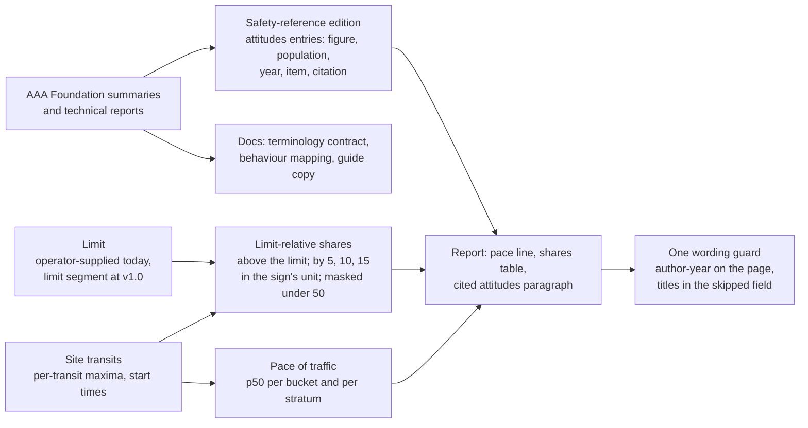

# Public attitudes to speeding and aggressive driving in reports plan

How velocity.report should use two AAA Foundation for Traffic Safety studies, _Attitudes Towards
Speeding_ (2026) and _Aggressive Driving and Road Rage_ (2025): which of their findings a speed
report can cite, which of their terms the project can adopt, which behaviours the sensor can and
cannot observe, and where the two vocabularies collide. The studies measure what people say and
believe; the sensor measures what passes. The plan keeps the two apart on every page and uses each
to explain the other in the docs.

Both report summaries were read in full, and the technical reports were read from text extractions
the owner supplied: the attitudes report through the start of its attitudinal-group profiles (its
methods, every focus-group result, the questionnaire's design, and Tables 9 to 12 and Figures 4 to
15 of the national results), and the aggressive-driving report's front matter, definitions and
frameworks only. A figure that neither a summary nor an extraction carries is marked **Confirm**.

- **Status:** Proposed; no code written
- **Layers:** Cross-cutting (PDF report copy and `data.json`, wording guard, safety-reference edition, L8 behaviour benchmarks, documentation)
- **Target:** v0.5.10 for the shared wording guard, the percentile copy, the pace-of-traffic line, the limit-relative shares against the operator-supplied limit, and the attitudes entries in the safety-reference edition; v1.0 for shares per limit segment and schedule; research notes deferred
- **Companion plans:** [crash data and published risk models](platform-crash-data-integration-plan.md), [behaviour analytics](lidar-behaviour-analytics-plan.md), [posted speed limits](posted-speed-limits-plan.md), [traffic description language](data-traffic-description-language-plan.md), [platform vocabulary](platform-vocabulary-and-data-model-plan.md)
- **Related:** [human crash baselines analysis](../platform/operations/human-crash-baselines-analysis-2026-10.md), [percentile aggregation semantics](../radar/architecture/percentile-aggregation-semantics.md), [identifiability analysis](../platform/architecture/identifiability-analysis.md), [editorial role](../../.github/knowledge/role-editorial.md), [research briefing, January 2025 to October 2026](../lidar/operations/brief/research-briefing-2025-01-to-2026-10.md), [TENETS](../../TENETS.md)
- **Canonical:** [PDF reporting](../platform/operations/pdf-reporting.md)

## Motivation

A speed report prints p85 against a limit and leaves the reader to decide what the gap means. The
attitudes study has now measured how the American public decides: a common social threshold for
speeding sits about 10 mph over the posted limit, enforcement is expected to begin at 10 to 12 mph
over, and 49% of the people asked agreed that driving with the flow of traffic is safer than
obeying the limit. A report that prints p85 of 33 mph in a 25 mph zone is read by half its readers
as normal, by a fifth as evidence the limit is wrong, and by a traffic engineer as the number that
sets limits. The report can meet all three where they stand: print the pace of traffic beside the
limit, print the share of passages above the threshold the public itself uses, and cite where that
threshold comes from.

The aggressive-driving study defines the behaviours the public calls aggressive, grouped into
seven themes. Most of them are gestures, sounds and confrontations a radar or LiDAR cannot see, by
design. Two of them, driving well above the flow of traffic and following too closely, are what the
sensor measures or plans to measure, and the study gives the public's own words for them. The
project can use those words for what it observes without adopting the study's verdicts, because
its wording guard already refuses every verdict word the study is built on.

The consequence of inaction is small and specific: the percentile section keeps calling p98 a view
into "top speeders" and "high-risk driving patterns", two labels on people the sensor never sees;
"survey" keeps meaning a deployment in this repository and a questionnaire in the sources it will
cite; and the one finding that answers the most common objection to a speed report, that everyone
drives with the flow, stays uncited while the flow itself goes unprinted.

## Current state

- **Report copy.** `aggregation-and-percentiles()` in
  [sections.typ](../../internal/report/typst/templates/sections.typ) says p98 gives "a more robust
  view into trends among top speeders" and "clearer insight into high-risk driving patterns". The
  crash-data plan replaces the kinetic-energy paragraph beside it and leaves this one.
- **Speed limit.** A unitless per-request integer, `ReportConfig.SpeedLimit`, default 25, printed
  beside a free-text note. The [posted speed limits plan](posted-speed-limits-plan.md) returns a
  signed limit per road segment at v1.0.
- **Percentiles.** p50, p85 and p98 over per-transit maximum speeds, per
  [percentile aggregation semantics](../radar/architecture/percentile-aggregation-semantics.md).
  Nothing is printed relative to the limit, and nothing is printed relative to the traffic around
  a passage.
- **Direction.** The transit worker reads `ABS(speed)`, so a radar transit has no direction. A
  pace of same-direction traffic is a LiDAR quantity until that changes.
- **Wording guard.** `headway.VerdictPattern` in
  [wording.go](../../internal/report/headway/wording.go) refuses twelve stems: `tailgat`,
  `aggress`, `driver`, `risk`, `score`, `verdict`, `unsafe`, `danger`, `violat`, `offend`,
  `propensity`, `profil`. The API tests in `internal/api/server_scenes_headway_test.go` keep a
  second list of eight (`tailgat|risk|driver|score|unsafe|danger|aggressi|verdict`). Neither
  contains `speeder`.
- **Behaviour plan.** [Section 8.1](lidar-behaviour-analytics-plan.md#81-speed-behaviour)
  specifies `speed_over_limit`, `speeding_exposure_{5,10,15}` and `speed_relative_to_stream`, the
  last defined as speed less the median speed of contemporaneous same-direction traffic. None is
  implemented. Following gap and net time gap (8.3) are built with descriptive bands at 2.0, 1.5
  and 1.0 s, kind `no_established_threshold`. Lane changes and cut-ins (8.8), stop behaviour (8.11)
  and induced evasive response (8.12) are deferred.
- **Traffic description language.** The [TDL plan](data-traffic-description-language-plan.md)
  defines the token `speeding` as `speed.max_mph > posted_limit` and gives the example
  "percentage of vehicles speeding on weekdays".
- **Vocabulary.** V12 in the [vocabulary plan](platform-vocabulary-and-data-model-plan.md) defines
  a **survey** as one deployment's measurement over a period. Both studies call their
  questionnaire a survey.
- **Editorial stance.** The [editorial role](../../.github/knowledge/role-editorial.md) says the
  product is "a tool for community empowerment, not for enforcement or surveillance". Terry's
  brief names "a resident worried about speeding traffic" as a reader never to mock.
- **Temporal strata.** The crash-data plan's Item 2a prints counts and percentiles in the day,
  night, weekday and weekend cells. The shares this plan adds fit the same table.
- **References.** `data/maths/references.bib` has no AAA Foundation entry. The crash-data plan
  cites one AAA Foundation paper, Tefft 2013, for the impact-speed curve.

## Findings

### The two studies

| Study                                                                                                                                                     | Method                                                                                                                                                                                                                                                                                                                                                                                                                                                                                                                                                                | What it measures                                                                                                                                                                                                        | What it is not                                                                                   |
| --------------------------------------------------------------------------------------------------------------------------------------------------------- | --------------------------------------------------------------------------------------------------------------------------------------------------------------------------------------------------------------------------------------------------------------------------------------------------------------------------------------------------------------------------------------------------------------------------------------------------------------------------------------------------------------------------------------------------------------------- | ----------------------------------------------------------------------------------------------------------------------------------------------------------------------------------------------------------------------- | ------------------------------------------------------------------------------------------------ |
| Steinbach, McDonough, Hungund, Kasha and Bai, _Attitudes Towards Speeding: Insights from Focus Groups and a National Survey of U.S. Drivers_, August 2026 | A literature review of 102 papers; eight online focus groups with 58 people from 30 states, February to March 2025, judging point-of-view video vignettes; a questionnaire to 16,598 people aged 16 and over who had driven in the past 30 days, 11,560 from NORC's probability-based AmeriSpeak panel and 5,038 from a non-probability panel for state estimates, fielded December 8, 2025 to January 12, 2026, weighted by NORC's TrueNorth method to a margin of error of ±1.08% with a design effect of 2.0; latent class analysis over seven attitude dimensions | How people define speeding by road type, which limits they expect and would set, how they rank its risk against other behaviours, why they speed and refrain, how they justify it, and what they support doing about it | A measurement of any speed. Part 4, a driving-simulator study, is a separate forthcoming report  |
| Steinbach, Kasha, Svancara and Parker, _Aggressive Driving and Road Rage_, September 2025                                                                 | A literature review of 620 articles from 2013 to 2023 and a five-member expert panel; eight focus groups with 53 people who admitted to aggressive driving or road rage; a questionnaire to a probability-based panel of 3,020 aged 16 and over, per the summary (the extraction lacks the method section)                                                                                                                                                                                                                                                            | Which behaviours people call aggressive, how often they report doing them, and what predicts doing them                                                                                                                 | An observation of any behaviour. Every prevalence figure is self-reported over the previous year |

### Attitudes towards speeding: what the report states

From the summary and the technical report's text; figure and table numbers are the report's own.

**How speeding is defined.** Shown a road with its limit and asked how fast a vehicle must go to be
speeding, respondents' means were 33 mph on a 25 mph residential street, 45 on a 35 mph arterial,
80 on a 70 mph rural highway and 78 on a 70 mph urban highway (Figure 4). The means at which they
expected police to act were 35, 47, 81 and 80, and the means they called dangerous were 44, 56,
88 and 85. The cumulative curve matters more than the means (Figure 5): on the residential street,
40% call 30 mph speeding, 85% call 35 mph speeding, and nearly all call 45 mph speeding; on the
arterial, about a quarter call 40 speeding and 72% call 45 speeding; on the highways, 34% call 75
speeding and 94% call 85 (rural) or 80 (urban) speeding. The report notes that 35 in a 25 "is often
used by road safety professionals as a reference threshold". For its own classification of
respondents it defines speeding as 10 mph over the expected limit on residential roads and
arterials and 15 mph over on highways (Figure 8's method).

**Speed limit credibility.** Before seeing a limit, respondents expected 25.8 mph on the
residential street and would set 26.2; on the arterial, 45.8 and 47.9; the gap was largest on
rural highways, 4 mph (Figure 6). Those who would set a limit at least 10% above what they expected
were 24% on residential roads, 33% on arterials, 28% on rural and 21% on urban highways. The focus
groups found limits generally credible, with "25 means 30" as the shared reading and 5 over "like
nothing".

**Technical and acceptable speeding.** Every focus group separated technical speeding, any speed
above the posted limit even by 1 mph, from acceptable speeding, set by situation and company. The
most common upper bound of acceptable was 10 mph over, read as an unofficial margin of tolerance
that police themselves drive within; up to 25 over was acceptable to some on open roads, in
emergencies, or "when there's nobody watching". Judging the vignettes without a sign, participants
used the flow of traffic first, then external markers, following distance, lane keeping,
curvature, grade and visibility, weather, and the presence of pedestrians, cyclists and crosswalks.

**Risk.** 74% said they often or always see vehicles much faster than the flow on highways and 45%
see residential speeding that often (Table 9). 55% were very or extremely concerned by residential
speeding, below impaired, distracted and drowsy driving; 56% thought a residential speeder unlikely
to be stopped. By the report's risk score, 16% rated residential speeding more dangerous than the
other behaviours and 9% less; for highway speeding the figures were 6% and 24% (Figure 7).

**Behaviour and situations.** 21% reported never speeding on any road type, 34% rarely, 30%
sometimes and 15% frequently (Figure 8). People were more likely to speed with no traffic (52%),
on a long trip (45%) and on a familiar road (45%), and less likely in rain (84%), on an unfamiliar
road (76%) and in the dark (73%) (Figure 9).

**Motivations.** To speed, often or always: getting around slow vehicles (31%), reaching the
destination faster (25%), not holding up traffic (21%), not annoying others (15%), the way the
road is built (13%), the car's design (6%) (Figure 10). To refrain: a ticket (79%), a crash (72%),
bad weather (60%), too much traffic (46%), insurance premiums (35%), travel cost (8%) (Figure 11).
13% always stop themselves exceeding the limit, 34% often, 39% sometimes, 10% rarely, 4% never.

**Moral disengagement** (Table 10, a bespoke scale from the focus groups). Agreement: "if people
want to drive the speed limit, they shouldn't be in the left lane" 59%; "it's safer for me to
drive with the flow of traffic than obey the speed limit" 49%, mean 3.3 of 5; "going a little bit
over the speed limit isn't really speeding" 49%; "no one actually drives the speed limit" 30%;
"roads were designed with the expectation that people will drive faster" 11%, with 56%
disagreeing. 10% scored low on the scale, 47% moderate and 43% high.

**Countermeasures** (Table 11, affect own speed, affect others, support in own neighbourhood,
where crashes have happened, where they could): increased police presence 85, 86, 79, 87, 88;
automated cameras 80, 73, 59, 71, 73; electronic warning signs 74, 63, 41, 43, 44; speed humps 91,
86, 37, 43, 43; rumble strips 62, 54, 35, 40, 40; roundabouts 82, 78, 35, 39, 40. 62% thought
police presence exists to make roads safer and 33% to raise revenue; for cameras 48% and 46%.
87% take some action to avoid enforcement and 42% warn others; the most common action is
adjusting speed to match the surrounding vehicles (58%), then cruise control (43%), apps (27%) and
routes that avoid cameras (16%) (Figures 12 and 13). In the focus groups, feedback signs drew
apathy, doubts about the displayed speed, and the sense of being "on the record".

**Intelligent speed assistance** (Table 12): an advisory alert would affect 58% of respondents'
own speed and 51% want one in their next car; an overridable limiter 62% and 35%; a
non-overridable limiter 61% and 23%. 40% want an overridable limiter in other people's cars but
not their own (Figure 15), most of all for people with a record of impaired driving or serious
speeding offences (Figure 14).

**Mindsets.** Five latent classes over seven dimensions, each with its own speeding threshold:
Strict Compliance Advocates (21%, low thresholds), Safety-Focused Realists (14%, high thresholds),
Principled Pragmatists (26%, moderate or high), Tolerant but Non-Compliant (23%, high) and
Autonomy-First (16%, high). The report concludes that one-size-fits-all speed management is
unlikely to be optimal. The group profiles, the Discussion and the appendices are not in the
extraction.

**Literature the report cites.** NHTSA's 2022 to 2023 national survey: only about a third think
limits should always be enforced by police, 63% think more cameras a good idea; Peterson and
Gaugler 2021: up to about 10 mph over is seen as typical and safe; NHTSA's 2013 latent classes:
non-speeders 39%, sometimes 44%, speeders 17%. The report observes that definitions of speeding in
the literature are "threshold based or derived from sensor-based driving data" and that virtually
no study asks what people themselves count as speeding.

**Limitations the report states.** A non-probability supplement for state estimates; self-report,
with likely under-reporting; no coverage of people who read neither English nor Spanish; and
highway images that may have pulled the expected and preferred highway limits below the real ones.

### Aggressive driving and road rage: what the report states

From the summary and the extracted parts of the technical report: its front matter, Part 1 and a
few figure captions. Parts 2 and 3 are not in the extraction.

- The definition the study adopts, from Finley et al. 2023 and the AAA Foundation's own 2022
  wording: any unsafe driving behaviour performed deliberately, with ill intention or disregard
  for safety, that impacts others. The expert panel debated speeding under it and
  concluded that speeding on an empty open road is not aggressive, while deliberately speeding
  around others with disregard for their safety is.
- Road rage is behaviour intended to cause physical, psychological or emotional harm; the panel
  proposed "violent driving" for the hostile end of the continuum, because the public and road
  safety practitioners do not separate it from aggressive driving.
- The literature review placed contributing factors at three levels of a socio-ecological model:
  individual, relational and community, the last including the built environment. The frameworks
  it surveyed are about aggression, emotion, and goal attainment or control.
- Previous AAA Foundation work found that in 2014 more than 78% reported at least one aggressive
  behaviour in the past year.
- Focus groups produced seven themes: putting others at risk, getting ahead, stealing space,
  controlling other road users' behaviour, expressions of displeasure, provoking reactions, and
  violence. Participants described anxiety, fear and pleasure as well as anger.
- Reported emotions while driving: annoyed or frustrated 72%, anxious 49%, angry 48%, calm 37%,
  empowered 17% (Figure 5). 80% drive less aggressively in rain; 18% more in rush hour and 16% more
  in unexpected traffic (Figure 8). 56% see sports cars drive aggressively always or often
  (Figure 9).
- The questionnaire measured 21 behaviours. 96% reported at least one in the previous year; trying
  to get ahead (92%) and putting others at risk (92%) were the most prevalent themes; 11% reported
  violent behaviours. Higher engagement among younger and male respondents; valuing road etiquette
  was protective; the most salient predictor was "aggressive driving culture", how much other
  people in one's area drive aggressively.
- Both reports carry the same rights statement: free to copy in whole or part and distribute at no
  charge with credit to the Foundation; not to be resold or used for commercial purposes without
  its permission.

### Figures still to confirm

What neither summary nor extraction carries. The press figures the plan first relied on are kept
only where nothing better exists.

| Figure                                                                                                               | Where it is                                                  | Reported by                                                                                                                                                                                                               |
| -------------------------------------------------------------------------------------------------------------------- | ------------------------------------------------------------ | ------------------------------------------------------------------------------------------------------------------------------------------------------------------------------------------------------------------------- |
| The 21 behaviours with their prevalence and theme, and the sample and weighting                                      | Aggressive-driving report, Part 3 and Figure 3               | Press: top five as speeding up at a yellow light (82%), using the right lane to pass (68%), honking at another road user (66%), glaring (65%), driving 15 mph faster than the normal flow (58%) ([AAA Northeast][aaa-ne]) |
| Changes since 2016: cutting off up 67%, honking up 47%, tailgating down 24%, yelling down 17%                        | Aggressive-driving report, Part 3                            | [ConsumerAffairs][consumeraffairs]                                                                                                                                                                                        |
| The attitudinal-group profiles, the Discussion's countermeasure synthesis (Figure 16) and the state-level estimates  | Attitudes report, Appendix D and the separate state document | Not read                                                                                                                                                                                                                  |
| A 2025 AAA Foundation telephone survey: 37% exceeded the limit by 10 mph on a residential street in the past 30 days | A different study                                            | [IIHS speed page][iihs]                                                                                                                                                                                                   |

### What the technical reports add

Seven things the summaries did not carry, each with a consequence for the design.

1. **A curve, not an edge.** The public's threshold is a distribution by road type (Figure 5). On
   a 25 mph residential street, 5 over is speeding to 40% and 10 over to 85%; on a 35 mph arterial,
   5 over to a quarter and 10 over to 72%. The edition holds the curve's points per road type, and
   the shares table's bands gain a cited reading: the share of respondents who would call each band
   speeding.
2. **The report's own edge matches the plan's.** It counts a self-reported speed as speeding at
   10 mph over on residential roads and arterials and 15 over on highways. The plan's 5, 10 and 15
   edges were chosen to match the behaviour plan; they now also match the source.
3. **Road type is an input.** The curve, the mean threshold and the edge all depend on it, and
   the site has no road class. The operator states it beside the limit.
4. **Three thresholds, one printable.** The means for speeding, for police action and for danger
   (33, 35 and 44 on a 25 mph street) are a finding worth the docs; only the first reaches a page,
   because the second is enforcement and the third fails the guard.
5. **The public's instrument is the pace.** 58% avoid enforcement by matching the vehicles around
   them, and matching the flow was the first criterion in every vignette. The pace line prints the
   quantity the public already uses.
6. **The sensor is read as a feedback sign.** 74% say an electronic sign would change their own
   speed, 41% want one on their street, and the focus groups doubted the displayed speed and felt
   watched. A radar on a pole invites the same reading, so the guide says what this one is not: no
   display, no record of any vehicle, and the calibration printed on the report.
7. **"Aggressive" is defined by intent.** Deliberately, with ill intention or disregard, and
   impacting others: three of the four clauses are mental states. That is the whole case for never
   printing the word, stated in the source's own terms.

Two hypotheses for the research notes also arrive: 73% say they speed less in the dark and 52%
more when there is no traffic, which the night stratum and the opportunity denominator observe
directly.

### What the evidence establishes and does not

| Question a report reader asks                                | What the studies establish                                                                                                                                                                                                                                                     | What they do not establish                                                                                                                                             |
| ------------------------------------------------------------ | ------------------------------------------------------------------------------------------------------------------------------------------------------------------------------------------------------------------------------------------------------------------------------ | ---------------------------------------------------------------------------------------------------------------------------------------------------------------------- |
| Where does the public draw the line for speeding?            | A curve by road type: on a 25 mph residential street, 40% of respondents call 30 mph speeding and 85% call 35 mph speeding; the report's own measure is 10 mph over on residential streets and arterials and 15 on highways: cited bin edges, and a cited reading of each band | Any harm at those speeds. The harm curves in the crash-data plan answer that, and a bin edge is never a safety threshold                                               |
| Why is this report's p85 read as normal?                     | 49% hold that the flow is safer than the limit, 49% that a little over is not really speeding, and matching the flow is the first criterion for judging a speed and the most common way to avoid enforcement: the reason to print the pace of traffic beside the limit         | Anything about the people who passed this site. The findings are about a national population's beliefs                                                                 |
| Which "aggressive" behaviours can a roadside sensor observe? | A public vocabulary for two measurable behaviours, driving well above the flow and following too closely, and a definition whose load-bearing clauses are intent                                                                                                               | A classification of any passage. Prevalence is self-reported per person per year; the sensor counts passages per period                                                |
| What do people support doing about speeding?                 | Support by countermeasure and by place, the gap between believed effect and support on one's own street, and the split on whether cameras exist for safety or revenue                                                                                                          | What any community should ask for. The report takes no position on countermeasures, and the before-and-after comparison is the product's contribution to that question |

### What the sensor can observe of the public's vocabulary

The summary names the seven themes and the press names several of the 21 behaviours; the full
list is **Confirm**. The mapping is to the behaviour plan's feature matrix, which owns every
definition.

| Behaviour as the public names it                                                                 | Theme                                           | Sensor       | Behaviour plan feature                                                                  | Status                                                                  |
| ------------------------------------------------------------------------------------------------ | ----------------------------------------------- | ------------ | --------------------------------------------------------------------------------------- | ----------------------------------------------------------------------- |
| Driving 15 mph faster than the normal flow of traffic                                            | Getting ahead                                   | Radar, LiDAR | `speed_relative_to_stream` (8.1); the pace of traffic and the share above it, this plan | Specified, unbuilt                                                      |
| Speeding                                                                                         | Putting others at risk                          | Radar, LiDAR | `speed_over_limit`, `speeding_exposure_{5,10,15}` (8.1); the limit-relative shares      | Waits on the posted limit; operator-supplied limit until then           |
| Tailgating, following too closely                                                                | Putting others at risk, controlling others      | LiDAR        | Following gap and net time gap (8.3)                                                    | Built, gated on G-SMO-1                                                 |
| Cutting off, weaving, changing lanes without signalling                                          | Getting ahead, stealing space                   | LiDAR        | Lane changes, merges and cut-ins (8.8)                                                  | Deferred: lane geometry and a completeness gate                         |
| Using the right lane to pass                                                                     | Getting ahead                                   | LiDAR        | 8.8                                                                                     | Deferred                                                                |
| Speeding up as a light turns, running a red                                                      | Getting ahead                                   | LiDAR        | Stop behaviour (8.11)                                                                   | Deferred: stop-line geometry; the signal state is never observed        |
| Brake-checking                                                                                   | Controlling others, provoking                   | LiDAR        | Induced evasive response (8.12)                                                         | Deferred: estimation plan Phase 8                                       |
| Blocking a merge, taking a space                                                                 | Stealing space                                  | LiDAR        | Yielding behaviour (8.10)                                                               | Later                                                                   |
| Honking, glaring, gesturing, yelling, flashing lights, confronting, bumping, leaving the vehicle | Expressions of displeasure, provoking, violence | None         | None                                                                                    | Unobservable by design: no camera, no microphone, no identity (Tenet 1) |

Three consequences follow.

1. **The sensor sees passages, not people.** 58% of respondents say they drove 15 mph above the
   flow at least once in a year. A site that sees 2% of passages 15 mph above the pace is not
   contradicting that, and a site that sees 20% is not confirming it. One figure is persons per
   year, self-reported; the other is passages per period, observed. The two are never printed side
   by side as a check on each other. The only legitimate comparison is the shape of a multi-site
   distribution, and that is a research note.
2. **"Aggressive driving culture" is a community-level variable** in the study, measured by asking
   people what others in their area do. At one street, the observed distribution of passages
   above the pace and of close following is the nearest observable thing. The docs may say so.
   No page names a culture, an index or a level of aggression, and the guard refuses the stem.
3. **The protective and predictive factors are out of reach.** Etiquette, feelings about one's
   vehicle, age and sex are properties of people. The sensor has none of them and, by Tenet 1, no
   means of acquiring them.

The attitudes report's vignettes add how people judge a speed when there is no sign to read: the
flow and external markers first, then following distance (one participant counting seconds as
driver's education taught), lane keeping (swerving read as speeding), curvature, grade and
visibility, weather, and the presence of pedestrians, cyclists and crosswalks. Three of those are
the sensor's: the pace (8.1), the following gap (8.3) and, once lane geometry exists, lane keeping
(8.7); the vulnerable-road-user criteria are the 8.9 and 8.10 interactions. Weather and visibility
are context the site does not record.

### Terminology: what transfers and what does not

| Term in the studies                                                                                         | In docs and plans                                                                                 | On a report page or in `data.json`                                                                                      | Reason                                                                                                                               |
| ----------------------------------------------------------------------------------------------------------- | ------------------------------------------------------------------------------------------------- | ----------------------------------------------------------------------------------------------------------------------- | ------------------------------------------------------------------------------------------------------------------------------------ |
| Speeding                                                                                                    | Yes, as the public's word                                                                         | "Above the posted limit", with the limit, its unit and its provenance                                                   | "Speeding" alone is a judgement without a limit. The TDL token `speeding` keeps its definition, maximum speed above the posted limit |
| Social threshold, 10 mph over                                                                               | Yes                                                                                               | A bin edge, "10 mph or more above the limit", with the citation in prose                                                | A questionnaire finding about acceptance, not a safety threshold                                                                     |
| Flow of traffic, keeping pace                                                                               | Yes                                                                                               | "Pace of traffic", a measured median                                                                                    | The one term that names a quantity the sensor measures directly                                                                      |
| Enforcement threshold, 10 to 12 mph over                                                                    | Yes                                                                                               | Never                                                                                                                   | The report takes no position on enforcement                                                                                          |
| Driver mindsets; the five class names                                                                       | Yes, as the study's classes of respondents                                                        | Never                                                                                                                   | Classes of people from attitude items; the sensor has no people, and `driver` fails the guard                                        |
| Aggressive driving, road rage                                                                               | Yes, attributed to the studies                                                                    | Never                                                                                                                   | Verdict words; `aggress` fails the guard and `rage` should                                                                           |
| Aggressive driving culture                                                                                  | Yes, as above                                                                                     | Never                                                                                                                   | A community variable measured by asking; the observed distribution is reported as a distribution                                     |
| Putting others at risk, and the other six themes                                                            | Yes, attributed                                                                                   | Never                                                                                                                   | `risk` fails the guard; a theme is a label                                                                                           |
| Safe speeding, dangerous speeding                                                                           | Only as the study's description of moral disengagement                                            | Never                                                                                                                   | `danger` and `unsafe` fail the guard; the distinction is the one the study identifies as a justification                             |
| Countermeasures: infrastructure-based, automated enforcement, police presence, intelligent speed assistance | Yes, in a guide, neutrally, with the project's stance stated                                      | Never                                                                                                                   | Editorial stance; the before-and-after comparison is the product's answer to "did it work"                                           |
| Survey                                                                                                      | "Questionnaire" or "attitudes questionnaire" for theirs; "speed survey" for ours when both appear | "Survey" keeps the V12 meaning                                                                                          | V12 defines a survey as a deployment's measurement                                                                                   |
| Violation, offender, non-compliant                                                                          | Only when quoting                                                                                 | Never                                                                                                                   | `violat` and `offend` fail the guard; "non-compliant" labels a person                                                                |
| Compliance                                                                                                  | Yes                                                                                               | As the behaviour plan's `legal` kind prints it: the speed and the limit, not the word                                   | The measurement is the two numbers                                                                                                   |
| Top speeders, high-risk driving patterns (ours, today)                                                      | Remove                                                                                            | Remove                                                                                                                  | Labels on people; `speeder` joins the guard                                                                                          |
| Technical speeding, acceptable speeding                                                                     | Yes: the focus groups' own pair                                                                   | "Above the posted limit" for the first; the bands, with the share of respondents who call each speeding, for the second | The report's distinction between the law and the norm; the page prints both without a verdict on either                              |
| Speed limit credibility; expected and preferred limits                                                      | Yes                                                                                               | Never                                                                                                                   | A property of respondents' beliefs about limits, not of a street                                                                     |
| Non-speeder, rare, sometimes and frequent speeder                                                           | Only as the report's classes                                                                      | Never                                                                                                                   | Classes of people; `speeder` joins the guard                                                                                         |
| Speed feedback sign, electronic warning sign                                                                | Yes, in the guide, to say what the sensor is not                                                  | Never                                                                                                                   | A feedback sign shows each vehicle its speed; this sensor shows nothing and records no vehicle                                       |

### The wording guard and the sources' own titles

Both titles fail the guard as written: _Attitudes Towards Speeding: Insights from Focus Groups and
a National Survey of U.S. Drivers_ contains `Driver`, and _Aggressive Driving and Road Rage_
contains `Aggress`, and so does the name of the series both appear in. The crash-data plan met
the same problem with a table title and settled it: a page cites author and year, the full title
lives in the edition field the guard skips, and a test proves the citation renders. The same rule
applies here, and it is a reason to keep one stem list rather than two.

### What a speed survey gives back

1. **The pace against the limit, by road type.** The attitudes study reports that acceptance is
   roadway-dependent and that keeping pace is the public's first criterion, without measuring what
   the pace is. Pooled across sites, the distribution of p50 less the posted limit by road type is
   that measurement, and it says whether the social threshold describes where the flow actually
   sits on residential streets. A research note in `data/explore/`, after the posted limits plan
   gives sites a limit.
2. **A shoulder in the upper tail.** If speed choice is calibrated to an expected enforcement
   threshold of 10 to 12 mph over, the upper tail of a site's speed distribution should fall more
   steeply past that point than a smooth tail would. A site distribution with enough transits can
   test for that shoulder. It is a hypothesis for a research note, not a report feature, and
   finding it would say nothing about any passage.
3. **Night against day.** The crash-data plan's strata already split the week the way the crash
   literature does. The share above the social threshold by stratum is the observed side of a
   belief the studies record and cannot measure.

What a survey cannot give back: any attitude, any motivation, any mindset, any self-report, and
any count of a behaviour the sensor cannot see. The studies' prevalence figures are not a
calibration target for the sensor, and the sensor's shares are not a check on the questionnaire.

## Design / approach

### Terminology contract

Five rules, applied to every page, API payload, guide and plan this work touches.

1. A page describes passages and distributions. It never names a person, a class of person, a
   trait, a culture or a mindset. The guard enforces the stems; the rule covers the rest.
2. Every figure from a study is an attitude or a self-report, labelled as such, with its
   population, year and citation. No such figure is printed beside an observed share as a
   comparison.
3. "Pace of traffic" is the median of per-transit maximum speeds over a stated window and
   population. "Above the limit" always carries the limit, its unit and its provenance. "Speeding"
   stays a docs word and a TDL token.
4. "Survey" means a deployment's measurement. The studies' instruments are questionnaires.
5. The report takes no position on enforcement or countermeasures. The guide may report what the
   public supports, with the project's stance beside it.

### The pace of traffic

The pace is p50 over per-transit maximum speeds, the statistic the report already computes per
rollup bucket and over the period. The line prints the period pace beside the limit, in the sign's
unit, with the limit's provenance: "Pace of traffic 31 mph; posted limit 25 mph
(operator-supplied)".

A passage's distance above the pace is its maximum speed less the p50 of the transits that started
in the same clock hour, in the site's zone. The window is fixed at one hour and is independent of
the chart grouping, which the operator chooses from 15 minutes to 28 days: a 28-day bucket holds
no contemporaneous traffic. An hour with fewer transits than the chart's `LowSampleThreshold` (50)
gives its passages no distance, and they leave both the numerator and the denominator of the
share. The share of transits 10 mph or more above the pace is printed with its N. The per-transit
distance is computed for the share and never stored, served or exported: a passage's position
against its neighbours is one step from a label on it.

Radar transits have no direction, so the radar pace mixes both directions and the line says so.
The behaviour plan's `speed_relative_to_stream` is the same-direction LiDAR quantity; when the
transit worker keeps direction, the radar pace follows the same definition and the caveat goes.

### Limit-relative shares

For the period and for each of the crash-data plan's four strata, the share of transits at or below
the limit, and the cumulative shares above it by 5, 10 and 15 mph where the sign is in mph. The
edges are the report's own: it counts a self-reported speed as speeding at 10 mph over on
residential streets and arterials and 15 over on highways, and on a 25 mph residential street 40%
of its respondents call 5 over speeding and 85% call 10 over speeding (Figures 5 and 8). They also
match the behaviour plan's `speeding_exposure_{5,10,15}` edges, so there is one set of edges in the
project. The quantities differ and are named apart: `speeding_exposure_*` is free-flow time on a
LiDAR passage; a share here is a fraction of transits by maximum speed. Each cell carries its N and
is masked under 50 transits, the stratum table's rule, and the identifiability analysis's
small-cell rule applies to the complement. The boundary-hour filter applies to every cell exactly
as it does to the headline numbers, the crash-data plan's Item 2a rule. The pace and the shares use
the same speed expression as the headline percentiles, cosine correction included: a mount angle of
20° understates an uncorrected speed by 6%, and a share against a limit is the figure whose reading
that understatement changes.

The curve the paragraph cites and the edge it names depend on the site's road type, residential,
arterial or highway, which the site does not record. The operator states it beside the limit, in
the report configuration today and on the site after the vocabulary plan's sites merge, and the
report prints it as operator-stated. Without one, the table prints its bands and the paragraph
cites the flow finding alone.

The comparison is with the limit, so the benchmark kind is `legal`, with the limit's jurisdiction
and effective date once the posted limits plan supplies them. The 10 mph edge is a reporting
choice, and the edition records why it was chosen and what it cites. A bin edge is not a
`research_threshold`; the behaviour plan's `no_established_threshold` carries no citation, so the
provenance of the edge lives in the edition entry and the prose, not on the benchmark.

Edges are in the sign's unit. The curve and the edges are findings about the United States. A site
whose limit is signed in km/h, or in a jurisdiction with no cited edges, prints the share above the
limit and nothing finer until the edition carries an entry for it.

### Attitudes entries in the safety-reference edition

The crash-data plan's pinned edition gains a `surveys` group, one edition rather than two, with the
same provenance fields: each entry carries the figure, the population and its size, the instrument
and fieldwork dates, a paraphrase of the item, the report's figure or table number, the citation
with its full title in the field the guard skips, and the date the source was read. The entries
the pace line and the shares need:

- 49% agreed that it is safer to drive with the flow of traffic than obey the speed limit
  (Table 10; mean 3.3 on a five-point scale).
- The curve of respondents who call a speed speeding, by road type (Figure 5): residential
  25 mph, 40% at 30, 85% at 35, nearly all at 45; arterial 35 mph, about 25% at 40, 72% at 45,
  nearly all at 60; rural highway 70 mph, 34% at 75, 94% at 85; urban highway 70 mph, 34% at 75,
  94% at 80.
- The mean speeds respondents called speeding by road type (Figure 4): 33, 45, 80 and 78 mph
  against limits of 25, 35, 70 and 70.
- The report's own definition of speeding for classifying respondents: 10 mph over the expected
  limit on residential roads and arterials, 15 on highways, which is the provenance of the shares'
  edges.
- Expected and preferred residential limits, 25.8 and 26.2 mph, and the 24% who would set a
  residential limit at least 10% above what they expected (Figure 6).
- Kept in the edition and never printed, for the docs: the mean speeds at which respondents
  expected police to act (35, 47, 81 and 80) and the speeds they called dangerous (44, 56, 88 and
  85).

The mindsets, the countermeasure and ISA support figures, the moral-disengagement items beyond the
flow item, and every aggressive-driving figure stay out of the edition. They have no report
surface.

### The cited attitudes paragraph

It replaces the "top speeders" paragraph and passes the guard. A draft for a residential site:

> Half the public reads a speed against the traffic around it rather than the sign. In a national
> questionnaire of 16,598 people who had driven in the previous month, 49% agreed that keeping
> pace with traffic is safer than obeying the limit (Steinbach et al. 2026). Asked where speeding
> begins on a 25 mph residential street, 40% said 30 mph and 85% said 35 mph, and the report's
> own measure of speeding on such a street is 10 mph over. This report prints the pace of traffic
> beside the limit, and the share of passages 5, 10 and 15 mph above it, so a reader can see where
> this street's pace sits against both. Those thresholds are where acceptance ends, not where harm
> begins; the harm figures are in the section above, with their sources.

The third sentence is chosen by the stated road type and omitted without one. The paragraph is
driven from `data.json` and the edition, so the figures and the edition identifier render from data
rather than template text.

### One wording guard

`internal/api`'s `verdictWords` becomes `headway.VerdictPattern`, so the headway report, its field
run, the charts and the API scan one list. The list gains `speeder` and a word-bounded `\brage\b`:
the bare stem would refuse "average", "coverage" and "storage", words a served payload can
legitimately hold. `reckless`, `careless` and `mindset` are candidates for the behaviour plan's
owner. `compliant` is an open question below. The citation test from the crash-data plan covers the
new paragraph and the shares table.

The guard is a test over template-driven text, `data.json` and the edition's strings. Operator-
entered fields, the site description, the surveyor and the speed-limit note, are the operator's
words: they are not scanned, and the report prints them marked as operator-supplied.

### Documentation surfaces

- A guide section for people reading a report: why half of readers will call the pace normal;
  what the bands mean and do not mean, with the curve; what the public says it supports, printed
  neutrally with the project's stance; and what the sensor is not. It is not a speed feedback
  sign, which 74% say would change their own speed and 41% want on their street, and whose
  displayed speeds the focus groups doubted and felt put them "on the record"; and it is not a
  camera. The sensor shows nothing, records no vehicle, and prints its calibration provenance on
  the report. Target `public_html/src/guides/reports.md`, a guide the index does not yet have.
- A one-line entry in the behaviour plan's Section 8.1 pointing at the shares and the pace, and in
  the vocabulary plan's next round for **pace**, **questionnaire** and **road type**.
- `references.bib` entries `Steinbach2025` and `Steinbach2026`.

### Boundaries

No classification of a passage or a person by any study's categories. No "aggressive" on a page.
No culture, index or level. No self-reported prevalence printed beside an observed share. No
enforcement threshold on a page. No countermeasure recommendation in a report. No band finer than
the limit for a unit or jurisdiction the edition has no cited edges for. No claim that a share
above the social threshold is a share above a harm threshold.

## Scope

### Item 1: read the rest of the technical reports and record the rights

**Summary:** Replace the remaining **Confirm** figures from the parts of the reports the
extractions did not carry, and settle the rights.

**Steps:**

1. The aggressive-driving report's Parts 2 and 3: the 21 behaviours with their prevalence and
   theme, the sample and weighting, the 2014 and 2016 comparison method, and the aggressive
   driving culture items; the wording of the "15 mph faster than the normal flow" item, which
   decides the pace-above edge.
2. The attitudes report's attitudinal-group profiles (Appendix Tables D3 to D7), the LCA
   variables (Appendix E), the Discussion's countermeasure synthesis (Figure 16), and the
   state-level document.
3. Rights: both reports permit copying with credit and bar resale or commercial use without the
   Foundation's permission. Settle whether this project's use is non-commercial, the same question
   the crash-data plan asks of CC BY-NC-ND 4.0, and record the answer in both plans.
4. Add both sources to `data/maths/references.bib` and a dated verified-sources table to this
   plan.

**Acceptance:** no **Confirm** mark remains in this plan, and the rights row states what may be
reproduced.

**Milestone:** v0.5.10, before Item 3b

### Item 2: one wording guard and the percentile copy

**Summary:** One stem list across the headway report and the API, with `speeder` and a
word-bounded `rage`, and the percentile paragraph rewritten without labels on people.

**Steps:**

1. `verdictWords` in `internal/api` replaced by `headway.VerdictPattern`; the catch-the-words test
   extended to the new stems and to both source titles, which must be refused, and to "average"
   and "coverage", which must pass.
2. The percentile paragraph in `sections.typ` rewritten to describe what p98 measures, with the
   cited attitudes paragraph of Item 3 taking the explanatory role, and one clause saying that p85
   is a statistic of operating speeds and not a rule for setting limits; the operator guide carries
   the ITE and MUTCD citations ([D-28][d28]).
3. A guard test over the full rendered report's `data.json` and text, as the headway report's
   `TestNoVerdictLanguage` does, since the speed report has none today.

**Milestone:** v0.5.10

### Item 3a: the pace line and the limit-relative shares

**Summary:** Print the pace of traffic and the limit-relative shares per period and stratum
against the operator-supplied limit, with no external data.

**Steps:**

1. The pace per hour and per period in `data.json`, each transit's distance above its hour's pace
   computed and not stored, and the share 10 mph or more above the pace with its N.
2. The shares table per period and per stratum, edges from the edition for the sign's unit, masked
   under 50, the boundary-hour filter applied as to the headline numbers, the limit's provenance
   printed as operator-supplied, and the direction caveat for radar.
3. An operator-stated road type, residential, arterial or highway, in the report configuration
   beside the limit, printed with it and absent by default.
4. The same speed expression as the headline percentiles, cosine correction included, proved by a
   test on a site with a mount angle.
5. Tests: the Friday 18:00 stratum boundary shared with the crash-data plan's Item 2a; an hour
   under 50 transits, whose passages leave the pace share; a limit in km/h, which prints the share
   above the limit only; a site with no limit, which prints no shares and no pace-against-limit
   line; the guard over the table.

**Acceptance:** a report at a site with a limit prints the pace line and the shares table, a report
without one prints neither, and the headline numbers do not change.

**Milestone:** v0.5.10; the period-level table depends on nothing, the stratum rows on the
crash-data plan's Item 2a

### Item 3b: the attitudes entries and the cited paragraph

**Summary:** The `surveys` group in the safety-reference edition and the paragraph that cites it.

**Steps:**

1. The `surveys` group with the entries the design lists, the flow item, the curve and the mean
   thresholds by road type, the self-report edges and the credibility figures, each validated like
   the edition's other groups: citation, population, fieldwork dates, figure or table, the item's
   paraphrase, and the title in the skipped field. The Traffic Safety Culture Index is the series
   source for the speeding items, one entry per edition year, with the one-off study as the
   explanatory source; the observed shares of Campolettano et al. 2025 are cited in the guide
   only ([D-28][d28]).
2. The paragraph, driven from `data.json` and the edition, its road-type sentence chosen by the
   stated road type and omitted without one, and its population described as the report describes
   it: people who had driven in the previous month.
3. Tests: the guard over the paragraph; both source titles refused and the author-year citation
   rendered; the "acceptance ends, not where harm begins" sentence printed; the police and danger
   thresholds present in the edition and absent from every rendered page.

**Acceptance:** the paragraph renders from the edition with its identifier, and no figure in it
exists outside the edition.

**Milestone:** v0.5.10, after Item 1 and after the crash-data plan's Item 2 ships the edition

### Item 4: guide and plan cross-references

**Summary:** The guide section, including what the sensor is not, and the behaviour and vocabulary
plan entries.

**Acceptance:** the guide section is linked from the guide index; the behaviour plan's Section 8.1
and the vocabulary plan's next round name the pace, the questionnaire and the road type;
`references.bib` carries both entries.

**Milestone:** v0.5.10, after Item 1

### Item 5: shares per limit segment and schedule

**Summary:** When the posted limits plan gives each transit a limit segment, with its unit,
jurisdiction and schedule, the shares split at limit changes and the operator-supplied caveat
goes; a school-zone schedule gives the shares during active hours.

**Milestone:** v1.0, after the posted speed limits plan and D-16

## Dependencies

- The crash-data plan's Item 2 for the edition package and Item 2a for the strata the shares are
  printed in.
- The [posted speed limits plan](posted-speed-limits-plan.md) for any share that is more than
  operator-supplied, and the [schedules design](../radar/architecture/speed-limit-schedules.md)
  for school-zone hours.
- A stated road type, residential, arterial or highway, for the curve the paragraph cites and the
  edge it names: in the report configuration until the vocabulary plan's sites merge gives it a
  home on the site.
- The transit source's cosine correction. The PDF's transit statistics are queried without the
  cosine join while the page prints the corrected note, an open task; a share against a limit does
  not print until the pace and the shares use the corrected speed.
- The transit worker keeping direction, for a same-direction pace on radar.
- The behaviour plan's owner for the guard stems beyond `speeder` and `rage`, and for the LiDAR
  `speed_relative_to_stream`, which this plan does not build.
- Item 1's reading of the reports' remaining parts before Item 3b prints a figure.

## Risks

| Risk                                                                                            | Likelihood | Impact | Mitigation                                                                                                                                                              |
| ----------------------------------------------------------------------------------------------- | ---------- | ------ | ----------------------------------------------------------------------------------------------------------------------------------------------------------------------- |
| The 10 mph band is read as a harm threshold                                                     | High       | High   | The paragraph says where acceptance ends is not where harm begins; a test checks the sentence; the harm paragraph in the crash-data plan sits above it with its sources |
| A self-reported prevalence is printed beside an observed share                                  | Medium     | High   | No prevalence figure enters the edition; the terminology contract's rule 2; review of every `surveys` entry against it                                                  |
| The guard refuses the citation                                                                  | High       | Low    | Author and year on the page, the title in the skipped field, and a test that both titles are refused and the citation renders                                           |
| A reviewer wants the mindsets as a segmentation of a street's traffic                           | Medium     | Medium | The sensor has no people; the boundary is stated; `driver` and `mindset` in the guard make the label unprintable                                                        |
| The radar pace mixes directions and is read as one stream                                       | High       | Low    | The caveat prints until the worker keeps direction; the LiDAR definition is same-direction                                                                              |
| Press figures are wrong                                                                         | Medium     | Medium | Item 1 first; nothing from the press table reaches the edition                                                                                                          |
| The report is read as recommending cameras or police presence                                   | Low        | High   | Nothing about countermeasures on a page; the guide states the project's stance beside any support figure                                                                |
| A km/h site gets US bin edges                                                                   | Medium     | Medium | Edges are an edition entry per unit and jurisdiction; without one, only the share above the limit prints                                                                |
| "Survey" is read as the questionnaire in a plan, or as the deployment in a citation             | Medium     | Low    | The contract's rule 4; the style pass can flag "national survey" without "questionnaire" nearby                                                                         |
| One site's shares are quoted as the national figure's local value                               | Medium     | Medium | The pace line and the shares carry the site and period; the paragraph names the population the 49% describes                                                            |
| The bare stem `rage` refuses "average", "coverage" and "storage"                                | High       | Medium | A word-bounded `\brage\b`, and a test that those words pass                                                                                                             |
| Uncorrected transit speeds at an angled mount understate every share against the limit          | High       | High   | The shares use the headline speed expression; the cosine task is a dependency; a test on an angled site                                                                 |
| The pace window follows the chart grouping and loses contemporaneity                            | Medium     | Medium | A fixed one-hour window independent of the grouping; passages in thin hours leave the share                                                                             |
| The guard refuses an operator's own note                                                        | Medium     | Low    | Operator-entered fields are not scanned; the report marks them operator-supplied                                                                                        |
| The site's road type is stated wrong, and an arterial's curve is cited for a residential street | Medium     | Medium | The road type prints beside the limit as operator-stated; without one the paragraph cites the flow finding only                                                         |
| The curve is read as the share of passages that are speeding                                    | Medium     | Medium | The paragraph says the curve is the share of respondents who would call that speed speeding, in a sentence apart from the passages' shares                              |

## Open questions

- Does `compliant` join the guard? It would block "compliant" as a label on a passage while leaving
  "compliance" for the `legal` kind's name. Decided by the behaviour plan's owner with the other
  candidate stems.
- Which edges for km/h jurisdictions, and is an enforcement guideline such as the UK's "10% plus
  2 mph" a legitimate cited edge when the report takes no position on enforcement? The alternative
  is the share above the limit only until an attitudes source for that jurisdiction exists.
- Where does road type live, and which of the report's four types does a site take? The report's
  residential image is a 25 mph street; a 30 or 35 mph collector sits between its residential and
  arterial curves, and the report has no curve for it.
- Does the share above the pace use 10 mph or 15? The aggressive-driving item is "15 mph faster
  than the normal flow of traffic" (press; **Confirm**), the only pace-relative threshold either
  study names. The plan prints 10 until the item's wording is read.
- The report's definition of speeding is measured from the limit respondents expected, not the
  posted one; a site uses the posted limit. Does the paragraph say so, or is the difference small
  enough on a 25 mph street (expected 25.8) to leave to the docs?
- Is 50 the right floor for an hour's pace? A median of 20 values is steadier than an 85th
  percentile of 20, so the hour floor may sit lower than the chart's;
  [Q24](../../data/QUESTIONS.md) asks the same of p85, and the floor follows its answer.
- Should the radar pace line wait for direction, or print mixed-direction with the caveat? The
  plan prints with the caveat.
- Does the `surveys` group sit in `internal/report/safetyref` with the harm and rate entries, or
  does the package take a wider name? One edition either way.
- Does the guide show the danger and police thresholds (44 and 35 on a 25 mph street) at all,
  given that the guard keeps both off every page? The docs are not a page, so the plan says yes,
  labelled as what respondents said.
- 84% say they speed less in rain and 73% less in the dark; the site records no weather. Does a
  report ever take a weather record, or does the stratum table say only that the site cannot tell
  a wet night from a dry one? Out of this plan's scope; logged for the crash-data plan's strata.
- Reproduction is settled in part: both reports permit copying with credit and bar commercial use
  without permission. Whether this project's use is commercial is the open half, shared with the
  crash-data plan's CC BY-NC-ND question, and Item 1 records one answer in both plans.
- The behaviour plan's 8.3 bands were chosen without the aggressive-driving study; its
  self-reported tailgating decline since 2016 is not evidence about a band. Should 8.3's prose
  say so, to stop the comparison being made later?
- Decision to record on acceptance, in `DECISIONS.md`: the report takes no position on
  enforcement or countermeasures. The guide and every later surface inherit it, so it belongs in
  the register rather than in one plan.
- Does the annual Traffic Safety Culture Index, on a constant questionnaire since 2008, enter the
  edition's attitudes entries beside the one-off attitudes study? A series is what any
  before-and-after reading of attitudes would need, and the one-off study has no before. Raised by
  the [October 2026 briefing][rb-2026-10]. **Answered** by [D-28][d28]: yes, as the series
  source for the speeding items, one entry per edition year, with the one-off study as the
  explanatory source.
- Do Campolettano, Kusano and Victor's observed shares above the limit in San Francisco and
  Phoenix enter the pace line as an `external_distribution` comparator, with the mobile population
  and the two cities stated, or only as context in the guide? Raised by the same briefing.
  **Answered** by [D-28][d28]: guide only; nothing on the report page.
- Does the percentile paragraph cite ITE's position and the MUTCD edition on what the 85th
  percentile is used for, so that a printed p85 is never read as the limit-setting rule? Raised
  by the same briefing. **Answered** by [D-28][d28]: one clause on the page, that p85 is
  a statistic of operating speeds and not a rule for setting limits; the citations in the guide.

## Sources checked

Checked on October 9, 2026. Both summaries were read in full from the uploaded PDFs; the technical
reports were read from text extractions the owner supplied, in which figures are placeholders and
the numbers in a figure come from its extracted axis labels. The AAA Foundation site, the AAA
newsroom and their mirrors were unreachable from the review environment. **Confirm** marks a claim
whose primary text was not read.

| Source                                                                        | What was read or found                                                                                                                                                                                                                                                                                                                                                                                                                                                                                                          | Status                    |
| ----------------------------------------------------------------------------- | ------------------------------------------------------------------------------------------------------------------------------------------------------------------------------------------------------------------------------------------------------------------------------------------------------------------------------------------------------------------------------------------------------------------------------------------------------------------------------------------------------------------------------- | ------------------------- |
| Attitudes Towards Speeding, report summary, August 2026                       | Three pages: introduction, method, every key finding and the five-mindset table                                                                                                                                                                                                                                                                                                                                                                                                                                                 | Read                      |
| [Attitudes Towards Speeding, technical report][aaafts-speed-pdf]              | Front matter, Part 1, all of Part 2, Part 3's questionnaire design, method, weighting, limitations and results through the start of the attitudinal-group profiles: Tables 9 to 12 and Figures 4 to 15; the group profiles, Discussion, Conclusions and appendices not extracted                                                                                                                                                                                                                                                | Read in part              |
| Aggressive Driving and Road Rage, report summary, September 2025              | Two pages: introduction, methodology, every key finding                                                                                                                                                                                                                                                                                                                                                                                                                                                                         | Read                      |
| [Aggressive Driving and Road Rage, technical report][aaafts-aggr-pdf]         | Front matter, the rights statement, Part 1's definitions and frameworks, and figure captions for Figures 5, 8 and 9; Parts 2 and 3 not extracted                                                                                                                                                                                                                                                                                                                                                                                | Read in part              |
| [AAA newsroom release, August 18, 2026][aaa-speed-release]                    | Figures since confirmed against Tables 10 and 11 and Figures 10 and 11                                                                                                                                                                                                                                                                                                                                                                                                                                                          | Superseded                |
| [AAA newsroom release, September 2025][aaa-aggr-release]                      | 96% any behaviour; 11% violent; behaviours contagious; matches the summary                                                                                                                                                                                                                                                                                                                                                                                                                                                      | Superseded                |
| [AAA Northeast][aaa-ne]                                                       | The top five behaviours with percentages                                                                                                                                                                                                                                                                                                                                                                                                                                                                                        | **Confirm**; via search   |
| [ConsumerAffairs][consumeraffairs]                                            | The four changes since 2016                                                                                                                                                                                                                                                                                                                                                                                                                                                                                                     | **Confirm**; via search   |
| [CBS Detroit][cbs-detroit]                                                    | The 44, 85 and 88 mph danger thresholds; confirmed against Figure 4                                                                                                                                                                                                                                                                                                                                                                                                                                                             | Superseded                |
| [IIHS speed topic page][iihs]                                                 | A 2025 AAA Foundation survey: 37% exceeded the limit by 10 mph on a residential street in the past 30 days. The figure is the 2025 Traffic Safety Culture Index's, a web panel and not a telephone survey, per the [October 2026 briefing][rb-2026-10]                                                                                                                                                                                                                                                                          | Checked against the index |
| [AAA Foundation research page, attitudes][aaafts-speed]                       | Lists the report, the summary and the state-level estimates                                                                                                                                                                                                                                                                                                                                                                                                                                                                     | **Confirm**; via search   |
| [AAA Foundation research page, aggressive driving][aaafts-aggr]               | Lists the report and the summary                                                                                                                                                                                                                                                                                                                                                                                                                                                                                                | **Confirm**; via search   |
| [AAA Foundation, 2025 Traffic Safety Culture Index][tsci-2025]                | Zhang and Steinbach, June 2026; a probability web panel of 2,699 licensed drivers, July 31 to August 13, 2025: 61% rate 10 mph over on a residential street very or extremely dangerous and 48% rate 15 over on a freeway so; 37% and 48% report doing each at least once in 30 days; speeding has the lowest social disapproval of every behaviour asked; 47% support cameras for more than 10 over on residential streets; the same copying terms as the two studies; read in part by the [October 2026 briefing][rb-2026-10] | Read in part              |
| [NHTSA, 2022-2023 National Survey of Speeding Attitudes and Behaviors][nssab] | DOT HS 813 594, December 2024, 5,680 respondents by web and mail; 87% agree everyone should obey the limit because it is the law and 85% call more than 20 mph over unacceptable; the series the AAA report cites                                                                                                                                                                                                                                                                                                               | **Confirm**; To fetch     |
| [NHTSA, Speeding: 2024 Data][nhtsa-813823]                                    | DOT HS 813 823, July 2026: a speeding-related crash is one where a driver was charged with a speeding offence or an officer recorded racing, too fast for conditions or exceeding the limit; 11,288 fatalities, 29% of the total, 28% of fatal crashes; the primary behind the "nearly 30%" the cited paragraph quotes, and an officer attribution, never a share of passages; read in full                                                                                                                                     | Read                      |
| [Campolettano, Kusano and Victor 2025, TIP][campolettano-tip]                 | Observed shares above the posted limit on surface streets in San Francisco and Phoenix from a million free-flow traversals seen by a ride-hailing fleet: 33% to 49%, p85 3.6 to 7.2 mph over; a mobile-sensor population and the only observed comparator for Item 3a's shares                                                                                                                                                                                                                                                  | **Confirm**               |
| [ITE, Setting Speed Limits][ite-ssl]                                          | The 85th percentile describes existing operating behaviour, is one input and does not by itself set the posted speed; the national MUTCD is the 11th Edition with Revision 1, December 2025; the sentence Item 2's percentile paragraph lacks                                                                                                                                                                                                                                                                                   | Read                      |

[aaafts-speed-pdf]: https://aaafoundation.org/wp-content/uploads/2026/08/202608_AAAFTS-Attitudes-towards-Speeding.pdf
[aaafts-aggr-pdf]: https://aaafoundation.org/wp-content/uploads/2026/01/202509-AAAFTS-Aggressive-Driving.pdf
[aaafts-speed]: https://aaafoundation.org/research/attitudes-toward-speeding-insights-from-focus-groups-and-a-national-survey-of-u-s-drivers/
[aaafts-aggr]: https://aaafoundation.org/research/aggressive-driving-and-road-rage-2/
[aaa-speed-release]: https://newsroom.aaa.com/2026/08/new-research-finds-most-drivers-think-speeding-is-normal-putting-everyone-at-risk/
[aaa-aggr-release]: https://newsroom.aaa.com/2025/09/study-finds-almost-all-drivers-experience-road-rage-but-it-can-be-stopped/
[aaa-ne]: https://magazine.northeast.aaa.com/daily/newsroom/aaa-study-finds-96-of-drivers-admit-to-driving-aggressively/
[consumeraffairs]: https://www.consumeraffairs.com/news/new-aaa-study-finds-nearly-all-drivers-engage-in-road-rage-092325.html
[cbs-detroit]: https://www.cbsnews.com/detroit/news/aaa-study-driving-say-speeding-normal/
[iihs]: https://www.iihs.org/topics/speed
[tsci-2025]: https://aaafoundation.org/wp-content/uploads/2026/05/202606-AAAFTS-2025-TSCI.pdf
[nssab]: https://rosap.ntl.bts.gov/view/dot/78928
[nhtsa-813823]: https://crashstats.nhtsa.dot.gov/Api/Public/ViewPublication/813823
[campolettano-tip]: https://waymo.com/research/potential-safety-benefits-associated-with-speed-limit-compliance-in-san/
[ite-ssl]: https://www.ite.org/technical-resources/topics/speed-management-for-safety/setting-speed-limits/
[rb-2026-10]: ../lidar/operations/brief/research-briefing-2025-01-to-2026-10.md

## Checklist

### Complete

- [x] Both report summaries read and recorded; press figures tabled with their status
- [x] Technical reports read from the owner's extractions: the attitudes report's methods and results through its attitudinal groups, the aggressive-driving report's definitions; press figures replaced where the text carries the number
- [x] The behaviour vocabulary mapped to the behaviour plan's feature matrix and to what the sensor cannot see
- [x] Terminology contract: what transfers to docs, what reaches a page, and the V12 collision

### Outstanding

- [ ] Item 1: the reports' unextracted parts read, every **Confirm** replaced, rights settled, `references.bib` entries (`S`)
- [ ] Item 2: one wording guard with `speeder` and a word-bounded `rage`, the percentile copy rewritten, a guard test over the speed report (`S`)
- [ ] Item 3a: pace line and limit-relative shares per period and stratum, the operator-stated road type, the cosine-corrected speed expression, tests (`M`)
- [ ] Item 3b: `surveys` group in the edition and the cited attitudes paragraph, tests (`S`)
- [ ] Item 4: guide section and plan cross-references (`S`)

### Deferred

- [ ] Item 5: shares per limit segment and schedule, tracked by [posted-speed-limits-plan](posted-speed-limits-plan.md)
- [ ] Research note: the pace against the posted limit by road type across sites, in `data/explore/`, after the posted limits plan (`S`)
- [ ] Research note: a shoulder in the upper tail at 10 to 12 mph over the limit as an enforcement-expectation signature, in `data/explore/` (`S`)
- [ ] LiDAR `speed_relative_to_stream`, tracked by the [behaviour analytics plan](lidar-behaviour-analytics-plan.md)

### Accepted residuals (no action planned)

- [ ] Mindset classification of a street's traffic: not possible, the sensor has no people
- [ ] Honking, gestures, confrontation and the other unobservable behaviours: not observable by design
- [ ] Countermeasure recommendations in a report: outside the product's stance
- [ ] Self-reported prevalence as a calibration target for observed shares: different populations and units
      [d28]: ../DECISIONS.md#d-28--research-briefing-decisions-october-2026
