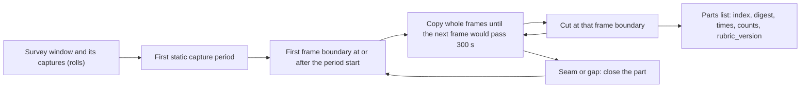

# Survey capture export: parted captures for Hugging Face

- **Status:** Draft, with open questions. This document proposes the nouns and the rubric and changes no code; the rubric is proposed, not measured, and its items are sequenced after the questions
- **Layers:** L1 captures and the capture index; publishing (surveys, the Hugging Face dataset)
- **Target:** v0.6.6, with surveys (Item 15 of the vocabulary plan); the open questions are
  answered first, by measurement on the existing corpus, before a cutter is written
- **Companion plans:** [platform-vocabulary-and-data-model-plan](platform-vocabulary-and-data-model-plan.md) (V1 capture, V12 survey, V28 privacy, V36 the export), [lidar-captures-multi-file-cases-plan](lidar-captures-multi-file-cases-plan.md), [lidar-route-capture-plan](lidar-route-capture-plan.md), [lidar-scene-catalogue-publishing-plan](lidar-scene-catalogue-publishing-plan.md), [archive-ingest-in-go-plan](archive-ingest-in-go-plan.md), [lidar-cluster-observation-log-and-async-tracking-plan](lidar-cluster-observation-log-and-async-tracking-plan.md)
- **Canonical:** [PLATFORM.md](../platform/PLATFORM.md)

What the raw tier of a published survey is called, how it is cut into files a person can
download and a reader can parse without the file before it, and the questions that must be
answered on the corpus before the cutter is written.

## Motivation

The [Hugging Face layout](../../tools/s2-archive/huggingface-dataset-layout.md) publishes one
PCAPNG per survey under `raw/lidar/<stem>.pcapng`. That was fine for the first release: 24 static
captures of a few minutes each, about 68 GiB in all. It stops being fine when a survey is a route.
A bike ride of several hours at the Pandar40P's planning rate, roughly 9 GB per hour single
return or 18 GB dual return per the
[async tracking plan § 5](lidar-cluster-observation-log-and-async-tracking-plan.md#5-storage-model-bytes-per-minute-and-hour),
is a single file of tens of gigabytes. It cannot be uploaded with a resume, downloaded in part,
or verified without reading all of it, and a consumer who wants ten minutes of it must fetch
the lot.

The file starts are also arbitrary. Today's static export "begins at the indexed static
interval", which is a time, not a frame boundary, so the first rotation in every file is partial
and every consumer trims it differently. A dependable rubric is needed: a rule a reader can rely
on for where a part begins, what it contains and how it joins the next, stated once and versioned.

Under the vocabulary, a static file of packets is a **capture** (V1). The export therefore cuts a
survey into captures of a fixed nominal length, called **parts**, and a survey's raw tier is its
**capture export**: an ordered list of parts with digests. The consequence of not doing this is
that route surveys are never published, or are published as files nobody can use.

## Current state

| Fact                                                                                                                                                                                                               | Source                                                                                                                                                   |
| ------------------------------------------------------------------------------------------------------------------------------------------------------------------------------------------------------------------ | -------------------------------------------------------------------------------------------------------------------------------------------------------- |
| One `raw/lidar/<stem>.pcapng` per survey, `raw_path` and `duration_seconds` in a one-entry-per-capture manifest; 24 files, about 68 GiB; the export begins at the indexed static interval, not at a frame boundary | [huggingface-dataset-layout.md](../../tools/s2-archive/huggingface-dataset-layout.md)                                                                    |
| The web survey export already uses `part-*` and frame chunks under `derived/scenes/<stem>_vrlog/` as its own scaling device                                                                                        | Same                                                                                                                                                     |
| The capture tool rolls files at about five minutes of wall time; a roll boundary falls anywhere inside a rotation                                                                                                  | Vocabulary plan § Current state, on disk                                                                                                                 |
| `capseq` derives capture sequences from abutting rolls and grades each seam; a clip may span rolls                                                                                                                 | [capseq.go](../../internal/lidar/capseq/capseq.go), [multi-file cases plan](lidar-captures-multi-file-cases-plan.md)                                     |
| A frame boundary is an azimuth wrap: the previous azimuth above 350° and the current below 10°, or a backwards jump of more than 180°, accepted only with enough azimuth coverage; a time-based mode also exists   | [frame_builder.go](../../internal/lidar/l2frames/frame_builder.go) `shouldStartNewFrame`                                                                 |
| Static and motion stretches of a sequence are `capture_periods` (today `lidar_capture_motion_periods`), classified by `pcap-split`'s motion classifier over a 60-second window                                     | [classifier.go](../../internal/lidar/pcapsplit/classifier.go)                                                                                            |
| Hesai packets carry an optional UDP sequence number in the tail; the foreground forwarder sorts by it; the frame builder consumes packets in file order                                                            | [extract.go](../../internal/lidar/l1packets/parse/extract.go), [foreground_forwarder.go](../../internal/lidar/l1packets/network/foreground_forwarder.go) |
| A probed capture records `first_packet_ns`, `last_packet_ns`, `packet_count`, `udp_port`; the content digest is added by Item 3 of the vocabulary plan                                                             | [capture_store.go](../../internal/lidar/storage/sqlite/capture_store.go)                                                                                 |
| At the manual's rates a 300-second part is about 0.7 GB single return or 1.4 GB dual return before container framing; 20 Hz changes points per rotation, not the packet rate                                       | Async tracking plan § 5                                                                                                                                  |
| A route survey's trajectory never leaves the device; a published route survey carries only aggregates on road segments                                                                                             | Vocabulary plan V28                                                                                                                                      |

## Findings

| Area                | Current state                                                                                                                   | Severity | Release view                      |
| ------------------- | ------------------------------------------------------------------------------------------------------------------------------- | -------- | --------------------------------- |
| One file per survey | A route survey is one file of tens of gigabytes; no resume, no partial download, no per-part verification                       | High     | v0.6.6: parts                     |
| Arbitrary start     | The export starts at a time, so the first rotation is partial and each consumer trims differently                               | Medium   | v0.6.6: start at a frame boundary |
| Rolls are not parts | Five-minute wall-time rolls cut inside a rotation; a part cut at frame boundaries cannot simply be a roll                       | Medium   | Open question Q10                 |
| Stragglers          | A packet of frame N can follow the first packet of frame N+1 in the file; cutting by file order puts it in the next part        | High     | Open question Q1                  |
| Route privacy       | The points of a moving sensor encode the operator's path; V28 forbids publishing a trajectory, and says nothing about raw parts | High     | Open question Q8; decide first    |
| No rubric version   | Nothing records how a file was cut, so a re-cut cannot be compared and a consumer cannot know the rule                          | Medium   | v0.6.6: `rubric_version`          |

## Design

### Nouns

| Noun               | Definition                                                                                                                                 | Decision  |
| ------------------ | ------------------------------------------------------------------------------------------------------------------------------------------ | --------- |
| **capture export** | A survey's raw tier: an ordered list of parts, with a parts list in the manifest                                                           | V36       |
| **part**           | One file of a capture export; a capture under V1, holding about 300 s of whole frames, cut at frame boundaries, identified by its digest   | V36       |
| **parts list**     | The manifest entry's `parts` array: index, path, digest, size, first and last packet time, frame and packet counts, and the seam before it | V36       |
| **rubric**         | The versioned cutting rule below; `rubric_version` is recorded in the manifest                                                             | this plan |
| **stem**           | `<timestamp>_<s2-l13-display>_<site-slug>`, as the layout defines it; unchanged                                                            | layout    |

### The rubric, as proposed

1. **Start.** The first part begins at the first frame boundary, by the L2 rule, at or after the
   start of the survey's first static capture period. A route survey begins at the first frame
   boundary at or after the survey's start. Packets before that boundary are not exported.
2. **Whole frames.** A part holds whole frames and nothing else. It ends before the frame whose
   start would carry the part past 300 seconds of capture time from its first packet; the next
   part begins at that frame boundary. No frame is split. The last part may be short.
3. **Contiguity.** A capture seam that `capseq` grades as a gap, or a run of missing frames
   longer than one rotation, closes the part; the next part starts at the next frame boundary
   and the parts list records the seam. A part is therefore one contiguous run of frames.
4. **Bytes as captured.** Packet bytes and their capture timestamps are copied as they are. The
   cutter never re-times, re-orders or drops a packet inside a part; Q1 decides what happens to
   a straggler at a boundary.
5. **Names.** `raw/lidar/<stem>/part-NNNN.pcapng`, four digits from `0001`. The manifest entry's
   `raw_path` becomes the directory; `duration_seconds` is the sum over the parts; the `parts`
   array carries `index`, `path`, `sha256`, `bytes`, `first_packet_ns`, `last_packet_ns`,
   `frame_count`, `packet_count`, `seam_before` and `rubric_version`.
6. **Idempotence.** Cutting the same source under the same rubric version yields byte-identical
   parts; a re-cut is verified by digest equality, not by inspection.
7. **Where it runs.** A `capture_export` job on a workstation with the capture volume mounted,
   never on the device; it needs staging space equal to the survey's size. This is the
   proposal Q9 tests; if Q9 chooses streaming, Item 2 changes with it.
8. **Verification.** Every part replays alone through L1 and L2 and its frame count equals the
   parts list; the parts concatenated replay frame for frame equal to the source over the
   exported window, compared by a per-frame digest.

### Sizes at the planning rate

| Mode          | Bytes per second | 300 s part | Parts in an 8-hour route | Notes                                                    |
| ------------- | ---------------: | ---------: | -----------------------: | -------------------------------------------------------- |
| Single return |          2.36 MB |     0.7 GB |                       96 | Manual rate 18.84 Mbit/s; container framing not included |
| Dual return   |          4.71 MB |     1.4 GB |                       96 | Manual rate 37.68 Mbit/s                                 |

These are the async tracking plan's planning figures, not measured file sizes; Q3 measures them.

### Privacy

A part is packets: ranges and intensities, no image, no plate, no PII by architecture. A static
survey's parts describe a place, as the published static captures already do. A route survey's
parts describe a place that moves with the operator, which is the operator's path in another
form. V28 forbids publishing the trajectory; it does not yet say whether raw parts of a route
survey may be published at all. That is Q8, and it is decided before any route part is uploaded.

## Open questions

Each question names what is unknown, the options, and what settles it. None is settled here.

| #   | Question                                                                                                                                                                                                                                                                                                                                                                                                                                                  | Options                                                                                                                                                                                                                  | Settled by                                                                                                                                                                  |
| --- | --------------------------------------------------------------------------------------------------------------------------------------------------------------------------------------------------------------------------------------------------------------------------------------------------------------------------------------------------------------------------------------------------------------------------------------------------------- | ------------------------------------------------------------------------------------------------------------------------------------------------------------------------------------------------------------------------ | --------------------------------------------------------------------------------------------------------------------------------------------------------------------------- |
| Q1  | **Stragglers across a boundary.** A packet of frame N can be written after the first packet of frame N+1 when UDP delivery reorders. Cut by file order, it lands in part k+1, where the frame builder sees an azimuth step backwards; a step of more than 180° is read as a wrap and starts a false frame. Cut by frame membership, the straggler moves into part k and the file order changes relative to the source. Does either matter, and how often? | (a) cut by file order and let L2 tolerate it; (b) assign packets to parts by UDP sequence or azimuth and move stragglers; (c) cut only at a boundary whose next K packets are monotonic, else wait for the next boundary | Count stragglers at every candidate boundary in the 24-capture corpus; replay each part alone and compare its frame count to the whole; the count of false frames under (a) |
| Q2  | **Where a survey starts.** Is the first static capture period the right anchor for a static survey, given the 60-second motion window? Does a route survey start at the survey's declared start or at the first frame after the sensor reaches its rotation speed?                                                                                                                                                                                        | period start; period start plus a settle margin; first frame at nominal RPM                                                                                                                                              | The `capture_periods` rows of the corpus against a hand check of the first ten frames of each                                                                               |
| Q3  | **300 seconds or a byte cap.** Capture time makes parts comparable across modes; a byte cap makes uploads predictable. Dual return and 20 Hz change the bytes per part.                                                                                                                                                                                                                                                                                   | 300 s of capture time; a byte cap near 1 GB; 300 s with a byte cap as a ceiling                                                                                                                                          | Measured part sizes at 10 and 20 Hz, single and dual return, on the corpus                                                                                                  |
| Q4  | **Directory or suffix.** `raw/lidar/<stem>/part-NNNN.pcapng` keeps `raw/lidar/` listable; `raw/lidar/<stem>.part-NNNN.pcapng` keeps one flat directory as the layout has today.                                                                                                                                                                                                                                                                           | directory per survey; suffix                                                                                                                                                                                             | A decision, with the layout document amended either way                                                                                                                     |
| Q5  | **Container.** Keep the source container (pcapng today) or normalise to one; does a part carry its own interface and section header blocks so it opens alone?                                                                                                                                                                                                                                                                                             | copy the source container; always write pcapng with a fresh section header per part                                                                                                                                      | Each part opens alone in the L1 reader and in a third-party tool                                                                                                            |
| Q6  | **Settling.** A reader replaying part k alone has no background history. Evidence extraction does not need it; the L3 background does, for a settle window. Does the parts list state the settle requirement, or does each part carry a background snapshot reference?                                                                                                                                                                                    | state the settle window in the manifest; publish the survey's `background.json.gz` beside the parts                                                                                                                      | The survey export already publishes a background tier; a decision on whether the raw tier references it                                                                     |
| Q7  | **Hugging Face limits.** Per-file and per-repository limits, Git LFS behaviour and the resume story change over time; nothing here asserts a number.                                                                                                                                                                                                                                                                                                      | verify at implementation; size parts under the current per-file limit with margin                                                                                                                                        | The published limits at implementation time, recorded in the layout document                                                                                                |
| Q8  | **Route privacy.** Raw parts of a route survey encode the operator's path. V28 forbids the trajectory file; does it forbid the parts?                                                                                                                                                                                                                                                                                                                     | route parts stay a private archive tier and only aggregates are published; route parts are published with a delay and a coarse start; route parts are published as they are                                              | A privacy decision recorded in V28 before any route part is uploaded; Malory's review                                                                                       |
| Q9  | **Where the cutter runs and stages.** A workstation with the volume mounted needs staging space equal to the survey; a device cannot afford it.                                                                                                                                                                                                                                                                                                           | workstation job; stream parts straight to the upload without staging                                                                                                                                                     | The disk and time of cutting the largest survey in the corpus                                                                                                               |
| Q10 | **Should rolls be parts?** If the capture tool rolled at frame boundaries under the same rubric, an export would be a copy and the seams would be known at capture time. That changes a tool that runs on the device.                                                                                                                                                                                                                                     | leave rolls as they are and cut at export; make the roll rule the rubric                                                                                                                                                 | The straggler count from Q1 and the cost of a frame-aware roll on the device                                                                                                |

## Scope

### Item 1: measurements and decisions (`S`)

**Summary:** Answer Q1 to Q5 on the existing corpus before any cutter exists.

**Steps:**

1. A script over the 24 captures: candidate boundaries per the L2 rule, stragglers at each,
   part sizes at 300 s, and the first-frame check of Q2.
2. Decisions for Q1 to Q5 recorded in this plan; Q8 put to a privacy review.

**Acceptance:** each of Q1 to Q5 has a written decision and the measurement that made it: Q1
the straggler count per candidate boundary and the false-frame count when each part replays
alone, over all 24 captures; Q2 the `capture_periods` start against a hand check of the first
ten frames of each capture; Q3 the measured bytes per 300 s part at 10 and 20 Hz, single and
dual return; Q4 a decision with the layout document amended; Q5 every part opening alone in the
L1 reader and in one third-party tool. The measurements need no survey row: they run on the
existing static captures, so this item can start before surveys exist.

**Milestone:** v0.6.6

### Item 2: the cutter (`M`)

**Summary:** `velocity survey export --tier captures` cuts a survey into parts under the rubric,
as a workstation job (the answer to Q9 that rule 7 proposes; a streaming answer reshapes this
item).

**Steps:**

1. A `capture_export` job kind on `jobs`; the cutter reads the survey's captures through
   `capseq`, applies the rubric, writes parts and the parts list with `rubric_version`.
2. Verification per rule 8, run by the job before it reports success.
3. Each part indexed as a capture (`captures.kind = pcap`) with its digest when the export
   volume is scanned.

**Acceptance:** a re-cut of the same survey is digest-identical; every part replays alone; the
concatenation replays equal to the source over the window.

**Milestone:** v0.6.6

### Item 3: manifest and upload (`M`)

**Summary:** The layout document and the manifest carry parts; uploads resume per part.

**Steps:**

1. `huggingface-dataset-layout.md` amended for `raw/lidar/<stem>/part-NNNN.pcapng` and the
   `parts` array; the 24 existing files re-cut under the rubric or listed as one part each with
   `rubric_version` null.
2. Upload per part with a digest check after upload; a failed part is retried alone.

**Acceptance:** the dataset card lists parts; a consumer downloads one part and replays it.

**Milestone:** v0.6.6

## Dependencies

- Surveys and their stems: Item 15 of the vocabulary plan, which itself follows Item 14 (sites
  and deployments). Item 1 here does not wait for them: it measures the existing static
  captures. Items 2 and 3 do.
- Captures with digests and the `jobs` columns: Item 3 of the vocabulary plan.
- The privacy decision of Q8, before any route part is uploaded; it is recorded in
  `docs/DECISIONS.md` when made, and V28 is amended to say what it decides.

## Risks

| Risk                                                     | Likelihood | Impact | Mitigation                                                                                                                                         |
| -------------------------------------------------------- | ---------- | ------ | -------------------------------------------------------------------------------------------------------------------------------------------------- |
| Stragglers make parts replay differently from the source | Medium     | High   | Q1 measured first; rule 8 verification refuses a part whose frames differ                                                                          |
| A route part publishes the operator's path               | Medium     | High   | Q8 decided before upload; route parts default to the private tier                                                                                  |
| Re-cutting the existing release breaks published links   | Low        | Medium | The existing files stay as one-part exports until the re-cut is accepted                                                                           |
| Hugging Face limits change under the rubric              | Medium     | Low    | Sizes carry margin; limits are verified and recorded at implementation                                                                             |
| The three items are a chain and Item 1 overruns          | Medium     | Medium | Item 1 starts now on the static corpus; if Q1 finds many stragglers, Items 2 and 3 move to v0.6.7 rather than cut under a rule that is not settled |

## Checklist

### Outstanding

- [ ] Item 1: measurements and decisions (`S`)
- [ ] Item 2: the cutter (`M`)
- [ ] Item 3: manifest and upload (`M`)

### Open questions

- [ ] Q1 stragglers across a boundary
- [ ] Q2 where a survey starts
- [ ] Q3 300 seconds or a byte cap
- [ ] Q4 directory or suffix
- [ ] Q5 container
- [ ] Q6 settling
- [ ] Q7 Hugging Face limits
- [ ] Q8 route privacy
- [ ] Q9 where the cutter runs and stages
- [ ] Q10 should rolls be parts
