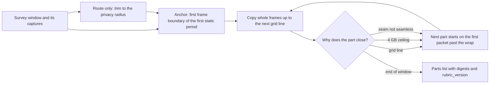

# Survey capture export: parted captures for Hugging Face

- **Status:** Draft. One decision round (2026-09-29) settled every open question but Q10, which waits on Item 1's measurements; the plan changes no code
- **Layers:** L1 captures and the capture index; publishing (surveys, the Hugging Face dataset)
- **Target:** v0.6.6, with surveys (Item 15 of the vocabulary plan); Item 1 measures the corpus
  to confirm the rubric before the cutter is written
- **Companion plans:** [platform-vocabulary-and-data-model-plan](platform-vocabulary-and-data-model-plan.md) (V1 capture, V12 survey, V28 privacy, V36 the export), [lidar-captures-multi-file-cases-plan](lidar-captures-multi-file-cases-plan.md), [lidar-route-capture-plan](lidar-route-capture-plan.md), [lidar-scene-catalogue-publishing-plan](lidar-scene-catalogue-publishing-plan.md), [archive-ingest-in-go-plan](archive-ingest-in-go-plan.md), [lidar-cluster-observation-log-and-async-tracking-plan](lidar-cluster-observation-log-and-async-tracking-plan.md)
- **Canonical:** [PLATFORM.md](../platform/PLATFORM.md)

What the raw tier of a published survey is called, how it is cut into files a person can
download and a reader can parse without the file before it, and what the operator may publish
from a route.

## Motivation

The [Hugging Face layout](../../tools/s2-archive/huggingface-dataset-layout.md) publishes one
PCAPNG per survey under `raw/lidar/<stem>.pcapng`. That was fine for the first release: 24 static
captures of a few minutes each, about 68 GiB in all. It stops being fine when a survey is a route.
A bike ride of several hours at the Pandar40P's planning rate, roughly 9 GB per hour single
return or 18 GB dual return per the
[async tracking plan § 5](lidar-cluster-observation-log-and-async-tracking-plan.md#5-storage-model-bytes-per-minute-and-hour),
is a single file of tens of gigabytes. It cannot be uploaded with a resume, downloaded in part,
or verified without reading all of it, and a consumer who wants ten minutes of it must fetch
the lot.

The file starts are also arbitrary. Today's static export "begins at the indexed static
interval", which is a time, not a frame boundary, so the first rotation in every file is partial
and every consumer trims it differently. A dependable rubric is needed: a rule a reader can rely
on for where a part begins, what it contains and how it joins the next, stated once and versioned.

Under the vocabulary, a static file of packets is a **capture** (V1). The export therefore cuts a
survey into captures on a fixed grid, called **parts**, and a survey's raw tier is its **capture
export**: an ordered list of parts with digests. The consequence of not doing this is that route
surveys are never published, or are published as files nobody can use.

## Current state

| Fact                                                                                                                                                                                                                                                                                                                            | Source                                                                                                                                                   |
| ------------------------------------------------------------------------------------------------------------------------------------------------------------------------------------------------------------------------------------------------------------------------------------------------------------------------------- | -------------------------------------------------------------------------------------------------------------------------------------------------------- |
| One `raw/lidar/<stem>.pcapng` per survey, `raw_path` and `duration_seconds` in a one-entry-per-capture manifest; 24 files, about 68 GiB; the export begins at the indexed static interval, not at a frame boundary                                                                                                              | [huggingface-dataset-layout.md](../../tools/s2-archive/huggingface-dataset-layout.md)                                                                    |
| The web survey export already uses `part-*` and frame chunks under `derived/scenes/<stem>_vrlog/` as its own scaling device                                                                                                                                                                                                     | Same                                                                                                                                                     |
| The capture tool rolls files at about five minutes of wall time; a roll boundary falls anywhere inside a rotation                                                                                                                                                                                                               | Vocabulary plan § Current state, on disk                                                                                                                 |
| `capseq` derives capture sequences from abutting rolls and grades each seam; a clip may span rolls                                                                                                                                                                                                                              | [capseq.go](../../internal/lidar/capseq/capseq.go), [multi-file cases plan](lidar-captures-multi-file-cases-plan.md)                                     |
| A frame boundary is an azimuth wrap: the previous azimuth above 350° and the current below 10°, or a backwards jump of more than 180°, accepted only when the frame in progress has more than `min_frame_points` points and an azimuth span of at least 340°; a time-based mode also exists; the builder never reorders packets | [frame_builder.go](../../internal/lidar/l2frames/frame_builder.go) `shouldStartNewFrame`                                                                 |
| The frame builder decides boundaries point by point, so a boundary falls inside a UDP packet; a packet holds 10 blocks spanning about 1° to 2°, and a file can only be cut between packets                                                                                                                                      | [frame_builder.go](../../internal/lidar/l2frames/frame_builder.go) `AddPointsPolar`, [extract.go](../../internal/lidar/l1packets/parse/extract.go)       |
| At end of file the builder flushes the partial rotation and marks it incomplete (`SpinComplete` false, under 340° or 10,000 points) rather than dropping it                                                                                                                                                                     | [frame_builder_cleanup.go](../../internal/lidar/l2frames/frame_builder_cleanup.go) `FlushPendingFrames`, `finalizeFrame`                                 |
| `capseq` grades a seam between rolls as `seamless` (10 ms or less), `acceptable` (1 s or less), `broken` or `overlap`; L2 drops the revolution that straddles any join that is not seamless                                                                                                                                     | [capseq.go](../../internal/lidar/capseq/capseq.go), [frame_builder_cleanup.go](../../internal/lidar/l2frames/frame_builder_cleanup.go)                   |
| Static and motion stretches of a sequence are `capture_periods` (today `lidar_capture_motion_periods`), classified by `pcap-split`'s motion classifier over a 60-second window                                                                                                                                                  | [classifier.go](../../internal/lidar/pcapsplit/classifier.go)                                                                                            |
| L1 opens captures with libpcap's offline reader, which reads both classic pcap and pcapng                                                                                                                                                                                                                                       | [pcap_realtime.go](../../internal/lidar/l1packets/network/pcap_realtime.go) `pcap.OpenOffline`                                                           |
| Hesai packets carry an optional UDP sequence number in the tail; the foreground forwarder sorts by it; the frame builder consumes packets in file order                                                                                                                                                                         | [extract.go](../../internal/lidar/l1packets/parse/extract.go), [foreground_forwarder.go](../../internal/lidar/l1packets/network/foreground_forwarder.go) |
| A probed capture records `first_packet_ns`, `last_packet_ns`, `packet_count`, `udp_port`; the content digest is added by Item 3 of the vocabulary plan, and the earliest and latest packet and a count of backward clock steps by the data model review (D-27)                                                                  | [capture_store.go](../../internal/lidar/storage/sqlite/capture_store.go)                                                                                 |
| At the manual's rates a 300-second part is about 0.7 GB single return or 1.4 GB dual return before container framing; 20 Hz changes points per rotation, not the packet rate                                                                                                                                                    | Async tracking plan § 5                                                                                                                                  |
| Hugging Face recommends splitting files above 20 GB. This is the operator's figure; the site was not reachable from the review environment                                                                                                                                                                                      | Decision round, 2026-09-29                                                                                                                               |
| A route survey's trajectory never leaves the device; a published route survey carries only aggregates on road segments, and its raw parts only by opt-in with trimmed ends                                                                                                                                                      | Vocabulary plan V28                                                                                                                                      |

## Findings

| Area                | Current state                                                                                                                                                                      | Severity | Release view                                   |
| ------------------- | ---------------------------------------------------------------------------------------------------------------------------------------------------------------------------------- | -------- | ---------------------------------------------- |
| One file per survey | A route survey is one file of tens of gigabytes; no resume, no partial download, no per-part verification                                                                          | High     | v0.6.6: parts                                  |
| Arbitrary start     | The export starts at a time, so the first rotation is partial and each consumer trims differently                                                                                  | Medium   | v0.6.6: an anchor at a frame boundary          |
| Rolls are not parts | Five-minute wall-time rolls cut inside a rotation; a part cut at frame boundaries cannot simply be a roll                                                                          | Medium   | Open: Q10, after Item 1's measurements         |
| Stragglers          | A packet of frame N can follow the first packet of frame N+1 in the file; the builder never reorders, so it joins frame N+1 and widens its span, in a part and in the source alike | Medium   | Decided: measured in Item 1; an L2 fix if any  |
| Route privacy       | The points of a moving sensor encode the operator's path                                                                                                                           | High     | Decided: opt-in per survey, ends trimmed (V28) |
| No rubric version   | Nothing records how a file was cut, so a re-cut cannot be compared and a consumer cannot know the rule                                                                             | Medium   | v0.6.6: `rubric_version`                       |

## Design

### Nouns

| Noun               | Definition                                                                                                                                                           | Decision  |
| ------------------ | -------------------------------------------------------------------------------------------------------------------------------------------------------------------- | --------- |
| **capture export** | A survey's raw tier: an ordered list of parts, with a parts list in the manifest                                                                                     | V36       |
| **part**           | One file of a capture export; a capture under V1, holding the whole frames between two grid lines, cut between packets at frame boundaries, identified by its digest | V36       |
| **anchor**         | The frame boundary where a capture export begins; the grid is counted from it                                                                                        | this plan |
| **grid**           | Capture-time lines at anchor + n × 300 s; a part ends at the first frame boundary at or after its grid line                                                          | this plan |
| **ceiling**        | 4 GB: a part also closes at the last frame boundary before it would pass this size                                                                                   | this plan |
| **privacy radius** | The distance around a route's start and end inside which nothing is exported; 500 m by default                                                                       | V28       |
| **parts list**     | The manifest entry's `parts` array                                                                                                                                   | V36       |
| **rubric**         | The versioned cutting rule below; `rubric_version` is recorded in the manifest and in each part's section comment                                                    | this plan |
| **stem**           | `<timestamp>_<s2-l13-display>_<site-slug>`, as the layout defines it; unchanged                                                                                      | layout    |

### The rubric, version 1

1. **Anchor.** A static survey's capture export begins at the first frame boundary, by the L2
   rule, at or after the classified start of its first static capture period, with no settle
   margin (rule 8 states settling instead). A route survey's begins at the first frame boundary
   at full rotation speed after the later of the survey's declared start and the moment the
   route leaves the privacy radius (rule 9). Packets before the anchor are not exported. The L2
   rule only fires with a frame in progress of 340° and more than `min_frame_points` points, so
   the cutter primes the frame builder from one rotation before the anchor.
2. **Cut between packets.** A frame boundary falls inside a packet. The part that is closing keeps
   the packet containing the wrap; the next part begins with the first packet wholly past it.
   The closing part's last rotation therefore completes inside its own last packet and never
   depends on the end-of-file flush; the fragment after the wrap, under one packet, is flushed
   and marked incomplete. The next part's first rotation lacks at most one packet of arc, far
   above the 340° gate. The parts concatenated equal the source over the window, byte for byte.
3. **Grid.** Part n ends at the first frame boundary at or after anchor + n × 300 s of capture
   time. Boundaries are predictable from the anchor alone. A part closed early by a seam or the
   ceiling is followed by one that still ends on the next grid line. The last part may be short.
4. **Ceiling.** A part also closes at the last frame boundary before its size would pass 4 GB.
   That fits a single-layer DVD and stays under FAT32's per-file limit of 4 GiB less one byte.
   At the Pandar40P's planning rates a part is 0.7 GB to 1.4 GB, so the ceiling binds only for
   a sensor with a much higher data rate; Hugging Face's recommended 20 GB split is further off
   still.
5. **Contiguity.** A capture seam that `capseq` grades as anything but `seamless`, or a run of
   missing frames longer than one rotation, closes the part; the next part starts at the next
   frame boundary and ends on the grid. `acceptable` is not enough, because L2 drops the
   revolution that straddles any join that is not seamless. A backward clock step inside a
   capture, which the probe counts in `backward_steps` (D-27), closes the part the same way.
6. **Bytes as captured.** Packet bytes and their capture timestamps are copied as they are. The
   cutter never re-times, re-orders or drops a packet, and a straggler stays where the capture
   wrote it. Item 1 counts the false frames stragglers cause; a non-zero count files an L2
   change that measures coverage as swept arc, not max minus min.
7. **Container.** Every part is pcapng, whatever the source, with its own section header and
   interface description copied from the source (link type, snap length, timestamp
   resolution), so it opens alone in libpcap and in third-party tools. A section comment carries
   the stem, the part index, the anchor in capture-time nanoseconds, the grid length and
   `rubric_version`, written deterministically.
8. **Settling.** Parts carry no pre-roll. The manifest entry states `settle_seconds`, the L3
   settle time of the tuning config the survey was processed with, and `background_path`, the
   survey's published background snapshot. A consumer who needs a warm background replays the
   previous part first. A route survey makes no background claim: both fields are null.
9. **Route privacy.** A route survey's parts are published only when the operator opts in for
   that survey. The window is trimmed: it starts after the route leaves the privacy radius
   around its start and ends at the last frame boundary before the route enters the radius
   around its end, 500 m by default and never smaller. The cutter finds those points locally
   from the trajectory, which is never exported; the manifest records the radius and neither
   trimmed position. A static survey has no trim.
10. **Names.** `raw/lidar/<stem>/<stem>_part-NNNN.pcapng`, four digits from `0001`. The stem in
    the file name keeps a downloaded part self-identifying. The manifest entry's `raw_path`
    becomes the directory; `duration_seconds` is the sum over the parts; the `parts` array
    carries `index`, `path`, `sha256`, `bytes`, `first_packet_ns`, `last_packet_ns`,
    `frame_count` (complete rotations), `packet_count`, `closed_by` (`grid`, `ceiling`, `seam`
    or `end`) and `seam_before`, and the entry carries `anchor_ns`, `grid_seconds`,
    `rubric_version`, `settle_seconds`, `background_path` and, for a route, `privacy_radius_m`.
11. **Idempotence.** Cutting the same source under the same rubric version yields byte-identical
    parts; a re-cut is verified by digest equality, not by inspection.
12. **Where it runs.** A `capture_export` job on a workstation with the capture volume mounted,
    never on the device. It cuts every part to an export directory and verifies it; upload is a
    separate, resumable step per part with a remote digest check. Staging equals the survey's
    size: about 72 GB for an eight-hour single-return route.
13. **Verification.** Every part replays alone through L1 and L2 and its complete-rotation count
    equals `frame_count`; its first rotation covers at least 340°; the parts concatenated replay
    frame for frame equal to the source over the window, compared by a per-frame digest.

### Sizes at the planning rate

| Mode          | Bytes per second | 300 s part | Parts in an 8-hour route | Notes                                                    |
| ------------- | ---------------: | ---------: | -----------------------: | -------------------------------------------------------- |
| Single return |          2.36 MB |     0.7 GB |                       96 | Manual rate 18.84 Mbit/s; container framing not included |
| Dual return   |          4.71 MB |     1.4 GB |                       96 | Manual rate 37.68 Mbit/s                                 |
| Ceiling       |                  |       4 GB |                          | Binds only above about 13 MB/s, nearly three times dual  |

These are the async tracking plan's planning figures, not measured file sizes; Item 1 measures
them.

### Privacy

A part is packets: ranges and intensities, no image, no plate, no PII by architecture. A static
survey's parts describe a place, as the published static captures already do. A route survey's
parts describe a place that moves with the operator, which is the operator's path in another
form. Rule 9 and the amended V28 decide what may leave: nothing without the operator's opt-in
for that survey, and never the stretch within the privacy radius of where the route starts and
ends, which is where a ride most often begins at home. The middle of an opted-in route is
published as the operator chose; the points there can be used to reconstruct the path, and the
dataset card says so.

## Decisions

Settled in one round with the operator on 2026-09-29. Each row names what Item 1 still
measures to confirm it.

| #   | Question                                                           | Decision                                                                                                                              | Still to measure                                                  |
| --- | ------------------------------------------------------------------ | ------------------------------------------------------------------------------------------------------------------------------------- | ----------------------------------------------------------------- |
| Q1  | Stragglers across a boundary                                       | The cutter never reorders. Item 1 counts false short frames; a non-zero count files an L2 change to measure coverage as swept arc     | Large-jump completions under 10,000 points, in source and parts   |
| Q2  | Where a survey starts                                              | The start of the first static capture period, with no settle margin; a route at full rotation speed after the privacy-radius trim     | The classified start against the first ten frames of each capture |
| Q3  | 300 seconds or a byte cap                                          | 300 s on a grid from the anchor, with a 4 GB ceiling                                                                                  | Bytes per part at 10 and 20 Hz, single and dual return            |
| Q4  | Directory or suffix                                                | `raw/lidar/<stem>/<stem>_part-NNNN.pcapng`                                                                                            | None                                                              |
| Q5  | Container                                                          | pcapng for every part, headers copied from the source, a deterministic section comment                                                | Each part opens alone in libpcap and one third-party tool         |
| Q6  | Settling                                                           | No pre-roll; the manifest states `settle_seconds` and links the survey's background snapshot; routes make no claim                    | None                                                              |
| Q7  | Hugging Face limits                                                | The 4 GB ceiling sits far below the recommended 20 GB split; the limits are rechecked and recorded with their date at upload (Item 3) | The limits on the day of the first upload                         |
| Q8  | Route privacy                                                      | Opt-in per survey; the window trimmed to outside a 500 m privacy radius at both ends; V28 amended                                     | None; a privacy review of the trim in Item 2                      |
| Q9  | Where the cutter runs and stages                                   | A workstation job cuts to disk and verifies; upload is a separate, resumable step per part                                            | Time and disk to cut the largest survey                           |
| Q10 | Should rolls be parts                                              | Open: decided after Item 1                                                                                                            | Seam grades and straggler counts across the corpus                |
| Q11 | Which part keeps the packet that holds the wrap (added this round) | The closing part; the next part starts on the first packet wholly past the wrap                                                       | Every part's first rotation covers at least 340°                  |
| Q12 | The 24 files already published (added this round)                  | Re-cut under the rubric; the originals stay outside the dataset root until the re-cut is accepted                                     | None                                                              |

## Open questions

| #   | Question                                                                                                                                                                                                                                                      | Options                                                                                               | Settled by                                                                                  |
| --- | ------------------------------------------------------------------------------------------------------------------------------------------------------------------------------------------------------------------------------------------------------------- | ----------------------------------------------------------------------------------------------------- | ------------------------------------------------------------------------------------------- |
| Q10 | **Should rolls be parts?** If the capture tool rolled at frame boundaries on the same grid, an export would be a copy and the seams would be known at capture time. That changes software that runs on the device, and it ties capture to one rubric version. | leave rolls as they are and cut at export; make the capture tool roll on the grid at frame boundaries | Item 1's seam grades and straggler counts, and the cost of a frame-aware roll on the device |

## Scope

### Item 1: measure the corpus against the rubric (`S`)

**Summary:** Confirm rubric version 1 on the existing corpus before any cutter exists, and
settle Q10.

**Steps:**

1. A script over the 24 static captures that applies rules 1 to 5 without writing files:
   anchors, grid boundaries, the packet holding each wrap, seam grades, backward clock steps,
   bytes per part, and large-jump frame completions under 10,000 points in the source and in each would-be part.
2. The results recorded in this plan; an L2 backlog item filed if the false-frame count is not
   zero; Q10 decided from the seam grades and straggler counts.

**Acceptance:** the plan records, over all 24 captures: the false-frame count in source and
parts, and whether they differ; the classified anchor against the first ten frames of each
capture; the bytes per part at every mode present in the corpus, each under the ceiling; that
every would-be part's first rotation covers at least 340°; and a written decision on Q10. The
measurements need no survey row, so this item can start before surveys exist.

**Milestone:** v0.6.6

### Item 2: the cutter (`M`)

**Summary:** `velocity survey export --tier captures` cuts a survey into parts under rubric
version 1, as a workstation job.

**Steps:**

1. A `capture_export` job kind on `jobs`; the cutter reads the survey's captures through
   `capseq`, applies rules 1 to 11 and writes parts, section comments and the parts list.
2. For a route survey: refuse without the operator's opt-in; trim the window to the privacy
   radius from the local trajectory; write the radius and nothing else about the trim.
3. Verification per rule 13, run by the job before it reports success.
4. Each part indexed as a capture (`captures.kind = pcap`) with its digest when the export
   volume is scanned.

**Acceptance:** a re-cut of the same survey is digest-identical; every part replays alone and
its first rotation covers at least 340°; the concatenation replays equal to the source over the
window; a route survey without opt-in yields no parts; with opt-in, no exported frame was
captured within the privacy radius of the route's start or end, checked against the trajectory
locally; a privacy review of the trim passes.

**Milestone:** v0.6.6

### Item 3: manifest, layout and upload (`M`)

**Summary:** The layout document and the manifest carry parts; the published 24 files are
re-cut; uploads resume per part.

**Steps:**

1. `huggingface-dataset-layout.md` amended for `raw/lidar/<stem>/<stem>_part-NNNN.pcapng`, the
   entry fields of rule 10, and the Hugging Face limits checked on the day of the first upload,
   with that date.
2. The 24 published static surveys re-cut under the rubric; their original files kept outside
   the dataset root until the re-cut is accepted, then retired.
3. Upload per part with a remote digest check; a failed part is retried alone.

**Acceptance:** the dataset card lists parts and states the route privacy rule; a consumer
downloads one part and replays it alone; every published survey has a `rubric_version`.

**Milestone:** v0.6.6

## Dependencies

- Surveys and their stems: Item 15 of the vocabulary plan, which itself follows Item 14 (sites
  and deployments). Item 1 here does not wait for them: it measures the existing static
  captures. Items 2 and 3 do.
- Captures with digests and the `jobs` columns: Item 3 of the vocabulary plan.
- A route survey's trajectory, for the privacy trim: the
  [route capture plan](lidar-route-capture-plan.md). Until it exists, route surveys are not
  exported.
- The route privacy decision is recorded in `docs/DECISIONS.md` beside D-27, in Item 1 of the
  vocabulary plan; V28 already says what it decides.

## Risks

| Risk                                                   | Likelihood | Impact | Mitigation                                                                                                                                           |
| ------------------------------------------------------ | ---------- | ------ | ---------------------------------------------------------------------------------------------------------------------------------------------------- |
| Stragglers make false frames in parts and source alike | Medium     | Medium | Item 1 counts them; a non-zero count becomes an L2 item (coverage as swept arc), since rule 13 cannot see a fault the source shares                  |
| A route part reveals where the operator lives          | Medium     | High   | Opt-in per survey; the privacy radius at both ends, never below 500 m; the trajectory never exported; a privacy review of the trim in Item 2         |
| A route passes a private place in its middle           | Low        | Medium | The operator may widen the radius or not opt in; the dataset card states that an opted-in route's middle can be reconstructed                        |
| Re-cutting the existing release breaks published links | High       | Low    | The paths change under the new names either way; the originals stay outside the root until the re-cut is accepted, and the card lists the move       |
| Hugging Face limits change                             | Low        | Low    | The 4 GB ceiling is a fifth of the recommended split; limits are rechecked with their date at upload                                                 |
| The three items are a chain and Item 1 overruns        | Medium     | Medium | Item 1 starts now on the static corpus; if it finds many stragglers, Items 2 and 3 move to v0.6.7 rather than cut under a rule that is not confirmed |

## Checklist

### Complete

- [x] Decision round: Q1 to Q9, Q11 and Q12 settled with the operator (2026-09-29)

### Outstanding

- [ ] Item 1: measure the corpus against the rubric (`S`)
- [ ] Item 2: the cutter (`M`)
- [ ] Item 3: manifest, layout and upload (`M`)

### Open questions

- [ ] Q10 should rolls be parts (after Item 1)
