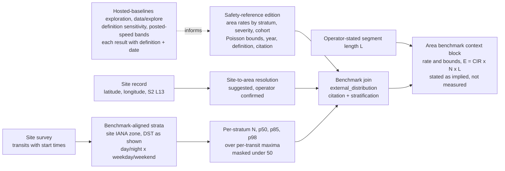

# Human crash baselines: Waymo's sober and status-quo benchmarks and Valgo's tool, October 2026

- **Status:** Analysis complete. No code written and no dataset ingested. Its five sequenced edits were folded into the crash-data integration plan on October 8, 2026, which links here with the PDF reporting doc and the devlog; it answers two of the plan's open questions by arithmetic.
- **Scope:** Scanlon, Kusano, McMurry, Campolettano, and Victor, "Reconstructing Sober Driving Baselines: Strategy for Evaluating Automated Driving Systems Beyond the Status Quo" (accepted, Journal of Safety Research; 39-page preprint) and "High-resolution urban fatal crash rate benchmarks for automated driving system assessment" (Traffic Injury Prevention, published online July 16, 2026, CC BY-NC-ND 4.0), both read in full from the PDFs; Valgo's `humanbaselines` Python client README as published on PyPI (version 0.4.0). The valgo.ai, humanbaselines.com, and docs.humanbaselines.com pages were refused by the review environment's egress policy. Review date October 8, 2026, repository HEAD `44cd982`.
- **Layers:** Cross-cutting: L8 analytics percentiles, PDF report, site model, importer tooling.
- **Related:** [crash-data integration plan](../../plans/platform-crash-data-integration-plan.md), [PDF reporting](pdf-reporting.md), [behaviour analytics plan](../../plans/lidar-behaviour-analytics-plan.md), [identifiability analysis](../architecture/identifiability-analysis.md), [percentile aggregation semantics](../../radar/architecture/percentile-aggregation-semantics.md), [posted speed limits plan](../../plans/posted-speed-limits-plan.md), [TENETS](../../../TENETS.md).

Two Waymo papers and one commercial tool now publish human crash involvement rates per vehicle-mile
for US urban areas, stratified by road type, time of day, day of week, severity, and crash type,
with Poisson intervals and open definitions. The sober paper goes one step further and removes
alcohol exposure by back-calculation. velocity.report measures speed and volume at a point on one
street and today prints no rate, no exposure, and no day-night split. This report reads the three
sources, re-derives their algebra, works the exposure arithmetic for a residential and an arterial
site, and says what the product should take from them, in what order, under the rules the
crash-data integration plan already sets.

The short version: these sources supply the first denominator the plan has seen, and a site can
supply the two things the papers lack, local temporal exposure and a measured speed covariate. A
site cannot supply a crash rate, and the arithmetic in Finding 6 shows that no window length
changes that.

## Answer

- The three sources share one ontology: a crash involvement rate, involvements divided by vehicle-miles travelled, at (urban area or county) x (road type) x (temporal stratum) x (severity) x (crash type), with an exact Poisson interval on the count and the vehicle-miles treated as known. The sober benchmark is the same rate with alcohol exposure removed by exposure reconstruction. Valgo is a hosted, key-authenticated service that computes the status-quo rate for a region under a user-chosen methodological definition and reports N, D_miles, rate, and bounds.
- The sober paper's algebra checks out. Equation 8 and Equation 11 follow from Equations 1 to 7, the fatal and police-reported phases are mutually consistent, and the fractional reduction from status quo to sober is f(RR-1)/(1+f(RR-1)), which reproduces the paper's 23% fatal and 6% to 11% police-reported figures from its own Table 3 and Table 4 averages (24.1% and 7.8%).
- The uncertainty does not sit where the skeleton of this review expected. For fatal rates the composite relative risk RR_fatal (95% interval 5.03 to 16.8) moves the impaired-VMT fraction f by a factor of three but moves the percent reduction only from 21.7% to 25.5%, because the reduction is pinned near the observed alcohol share P. For police-reported rates, f and RR_PR enter as a product and the paper's own interval on the sober rate, 4.01 to 4.82 against a status quo of 4.88 incidents per million miles, spans a reduction of 1.2% to 17.8%. The "6% to 11%" the paper headlines is the spread of county point estimates, not an uncertainty.
- The night-to-day ratios in both papers (sober 3.1x weekday, 3.8x weekend; status quo 6.2x weekend night against weekday day) rest on INRIX probe data distributing FHWA vehicle-miles across four temporal strata, which the fatal-rate paper itself lists as its least validated input. A velocity.report site observes that temporal share directly, with no length needed, on the local and collector streets INRIX covers worst.
- One site cannot validate or refute an area rate. A residential site at 1,500 transits a day over 0.1 mile accrues 54,750 vehicle-miles a year: 0.27 expected police-reported involvements at the status-quo rate and one expected fatal involvement in about 1,300 years. Three in four such sites see no police-reported involvement in a year under the published rate, and a year of zero excludes only rates above 67 per million miles, fourteen times the status quo. Separating the status-quo and sober police-reported rates at an arterial site of 15,000 a day over half a mile takes about 78 years of counts. The area rate is the only defensible prior for a site; the site's contribution to this literature is exposure and speed, never crashes.
- For the crash-data integration plan this is a fourth source family: exposure-normalised area involvement rates with intervals. It belongs in the pinned safety-reference edition (Item 2) as a table keyed by area, road type, temporal stratum, severity, cohort, crash year, and source edition, entering a report as an `external_distribution` benchmark with citation and stratification. It needs a site-to-area resolution and a new report block, "area benchmark context", that prints what the area rate implies for the surveyed segment's volume and a stated length, labelled as implied and not measured. Nothing in the plan's boundaries, its before-and-after model, or its site crash-context record changes.
- velocity.report should add benchmark-aligned temporal strata to the report first (S, v0.5.10, no external data), then the area-rate table from the fatal-rate paper's supplemental data once Item 1 clears its CC BY-NC-ND reading (M), then site-to-area resolution and the context block after the sites merge (M, v0.6.8), and keep two research notes in `data/explore/`: what Valgo's definition-selectable baselines add beside the edition, and the multi-site temporal exposure and speed-by-stratum comparison.
- Valgo's service answers a question the edition does not: the same rate under a definition the caller chooses, returned with its bounds, count, and vehicle-miles. Its posture of reporting the spread across definitions maps onto the plan's rule to say what the evidence does not establish: a report quotes a rate with its definition, never one number without it. The open papers are the edition's source; a workstation exploration, each result kept with its full definition and retrieval date, is where the service's value beside the edition is measured, with its terms of use read first.

## The question

Can the Waymo sober and status-quo human benchmarks, and Valgo's hosted version of them, be
incorporated into velocity.report under the crash-data integration plan; how does that plan have
to change; and what can a speed survey at one site add to, validate in, or extend these datasets?
Underneath that: is the papers' mathematics sound, where does their uncertainty live, and what
does a count at one site establish about an area rate?

## What the sources are

### The sober-baseline paper (Scanlon et al., Journal of Safety Research, accepted)

The paper builds an "expectations-based" benchmark by removing alcohol-impaired driving from the
status-quo crash involvement rate, for the 50 most populous 2020 Census urban areas, in four
temporal strata (Table 2): daytime 06:00 to 17:59, nighttime 18:00 to 05:59, weekday Monday
06:00 to Friday 17:59, weekend Friday 18:00 to Monday 05:59. Vehicle type is in-transport
passenger vehicles under 49 CFR 565.15 (GVWR at or below 10,000 lb); road type is all roads
combined. Four cohorts (Table 1): status quo (any BAC), sober (BAC = 0), any alcohol (BAC at or
above 0.01), sub-threshold (below 0.08), and legally impaired (at or above 0.08).

Phase 1 (fatal) takes P_i, the proportion of fatal-crash-involved drivers in the impaired
subgroup, from FARS 2021 to 2023 with the MIPER ten-fold BAC imputation; a composite relative
risk RR_fatal from Voas et al. 2012 risk curves integrated over the 2013 to 2014 National Roadside
Survey BAC distribution, stratified day and night with age, gender, and survey weights; solves
Equation 8 for f_i, the fraction of vehicle-miles driven impaired; and applies f_i to the
status-quo vehicle-miles of the fatal-rate paper to get sober and impaired fatal rates (Equations
9 and 10). Phase 2 (police-reported) carries f_i to the county, refits Lacey et al. 2016 Model 1
(Virginia Beach, 10,221 drivers, conditional logistic regression adjusted for age and gender)
from the raw NHTSA data to obtain RR_PR with a covariance matrix, and scales the status-quo
police-reported rate of the SAE paper (Scanlon et al. 2026c) by Equations 11 and 12. Uncertainty
is a 1,000-iteration Monte Carlo over NRS resampling, Lacey coefficients from a multivariate
normal, Voas coefficients from independent normals, and Poisson crash counts with exact
chi-squared limits (Section 2.7). P_i uses three years; rates use 2023 only.

Results (Table 3): RR any alcohol versus sober, police-reported 2.80 (1.95, 4.20), fatal 8.55
(5.03, 16.8); legally impaired versus sub-threshold, police-reported 8.10 (4.96, 13.2), fatal
30.5 (16.6, 64.9). Table 4, averaged over the 50 areas for 2023, is reproduced here because the
report will quote it:

| Measure (Table 4)                   | Weekday day       | Weekday night      | Weekend day       | Weekend night      | All                |
| ----------------------------------- | ----------------- | ------------------ | ----------------- | ------------------ | ------------------ |
| P_i,fatal any alcohol               | 10.7%             | 33.3%              | 16.3%             | 40.9%              | 27.1% (23.8, 30.5) |
| f_i any alcohol                     | 1.4% (0.6, 2.7)   | 5.7% (2.7, 10.0)   | 2.3% (0.9, 4.9)   | 7.7% (3.8, 13.1)   | 4.2% (2.1, 7.1)    |
| f_i legally impaired                | 0.3% (0.1, 0.7)   | 1.2% (0.5, 2.4)    | 0.5% (0.2, 1.2)   | 1.7% (0.8, 3.3)    | 0.9% (0.4, 1.8)    |
| Fatal CIR status quo, IP100MM       | 0.71 (0.55, 0.91) | 2.73 (2.10, 3.51)  | 0.88 (0.58, 1.31) | 4.38 (3.46, 5.50)  | 1.42 (1.25, 1.62)  |
| Fatal CIR sober, IP100MM            | 0.65 (0.50, 0.83) | 1.99 (1.48, 2.64)  | 0.76 (0.50, 1.13) | 2.89 (2.18, 3.79)  | 1.10 (0.95, 1.27)  |
| Fatal CIR any alcohol, IP100MM      | 5.00 (2.58, 11.2) | 15.2 (8.68, 31.1)  | 6.12 (2.98, 14.3) | 23.2 (13.7, 46.5)  | 8.85 (5.30, 17.6)  |
| Fatal CIR legally impaired, IP100MM | 17.8 (8.28, 43.6) | 56.5 (29.0, 128.9) | 21.6 (9.62, 55.8) | 86.7 (45.9, 193.5) | 32.42 (17.5, 70.7) |

IP100MM is incidents per 100 million miles. The Table 4 intervals are the mean of the per-area
lower and upper bounds, which the caption states; they describe a typical single area's interval,
not the uncertainty of the 50-area average, which is far narrower. A report must quote a single
area's rate with that area's interval, never the 50-area average with the averaged bounds.

Police-reported (Tables 5 and 6, 15 counties with ADS deployments): any-alcohol share of
involvements 12.0% (2.5, 26.1) and of vehicle-miles 4.7% (2.4, 7.7); status quo 4.88 (4.84,
4.93) incidents per million miles (IPMM), sober 4.51 (4.01, 4.82), sub-threshold 4.56 (4.07,
4.84), any alcohol 12.66 (9.06, 18.6), legally impaired 36.9 (23.2, 58.7). Figure 5 shows county
reductions of 6% (DeKalb, Clayton, Fulton) to 11% (Bexar, Harris, Travis). The paper validates its
reconstruction against the NRS: 0.3% of weekday-day and 1.7% of weekend-night vehicle-miles
legally impaired, against 0.4% and 1.5% observed (Section 4.1). Per-area values appear only in
Figures 2 to 5 and A1; there is no downloadable table in the preprint.

### The status-quo base paper (Scanlon et al., Traffic Injury Prevention, 2026)

The fatal-rate paper defines three metrics (Equations 1 to 3): PFR, fatalities per vehicle-mile
for a population; FCIR, fleet fatal crash involvements per fleet vehicle-mile; and FOFR, fleet
occupant fatalities per fleet vehicle-mile. FCIR is the headline because it matches outcome and
exposure units for a fleet, which is RAVE Checklist recommendation 1C. Data are 2023 only: FARS
for crashes; FHWA HM-71 (vehicle-miles by urban area and functional class, the ground-truth
totals), FHWA VM-4 (passenger-vehicle share by state, averaged for multi-state areas), and INRIX
annualised average daily traffic per road segment for a typical week in 15-minute periods, joined
to OpenStreetMap motorway tags, to distribute the FHWA totals across the four temporal strata.
Segments without INRIX data are excluded from the temporal weighting under the assumption that
they share the covered segments' temporal distribution. Unknown road type (under 1%) and vehicle
type (2%) are imputed proportionally. Intervals are exact Poisson via chi-squared quantiles.

Results (Table 1): national FCIR 1.57 IP100MM; top-50 median 1.01, quartiles 0.90 and 1.19,
maximum 2.79, minimum 0.47. Memphis 4.12 against Boston 0.55, a 7.5x range. Freeway average 0.81
(0.25 to 2.00), surface street 1.87 (0.62 to 5.21), a 2.3x ratio. Table 2 by road type and
stratum: freeway weekday day 0.34, weekend day 0.43, weekday night 1.66, weekend night 2.74;
surface weekday day 0.98, weekend day 1.23, weekday night 3.51, weekend night 5.57; all roads
0.71, 0.88, 2.73, 4.38, so weekend night is 6.2x weekday day. The weekend-night to weekday-day
ratio ranges from 2.5x (Cincinnati) to 10.2x (San Francisco Bay Area). Surface-street share of
vehicle-miles ranges from 38% (San Francisco Bay Area) to 75% (Tampa). Vulnerable road users are
about 32% of surface-street and 14% of freeway fatal involvements; pedestrians are the top
surface-street type in 46% of areas. The Results section opens: "All of the results generated for
this study are available as supplemental data materials for download." Whether the supplement
includes the temporal vehicle-mile fractions, as distinct from the rates, is unconfirmed; the
review environment did not reach it.

The discussion proposes Poisson regression as data accumulate, naming speeding, VRU presence,
density, land use, and vehicle mix as covariates, and lists as limitations the INRIX motorway
versus FHWA freeway definition, INRIX being a model from a small probe share, low-volume segments
lacking INRIX data, and vehicle-miles always being an estimate with unquantified variance.

### Valgo Human Crash Baselines

What is confirmed from the README (Apache-2.0 client, Valgorithmic, Inc. d.b.a. Valgo): a REST
API at `https://humanbaselines.com/v1/*`, key-authenticated with `X-API-Key`; a Python client
whose typed models are generated from the server's OpenAPI schema, with `GET /v1/filters` as the
authoritative list of valid values and defaults and `/v1/regions` as a live, growing list. Three
modes: `geofence` (a region's rate), `route` (interstate segment ids), and `depot` (two lat/lon
points); route and depot count Class-8 combination trucks. A region is a county (`travis`), a
county group (`sf` is San Francisco, San Mateo, and Santa Clara), a municipality (`boston`,
`cambridge`, `worcester`), or a corridor (`interstates`). A result carries `rate`, `rate_low`,
`rate_high`, `N`, `D_miles`, and `cells`. The README example, region `travis`, outcome
`police_reported`, ego vehicle cars and light trucks, returns 4.055 (4.0, 4.1) with N 24,617,
D 6.07e9 miles, and 1,795 cells; the unit is therefore crashed vehicles per million vehicle-miles,
the same as the sober paper's IPMM. Filters include `outcome`, `ego_vehicle`, `road_type`
(geofence only), `weather`, `crash_year` (region defaults differ: Boston and Florida default to
2023), `in_transport` (default drops parked vehicles), `desk_reports` (default exclude; only
Chicago marks the channel), `posted_speed` and `posted_speed_max` (5 mph bands from `le15` to
`s65`, applied to crashes and miles alike, implemented only for `sf` and `vegas`, a no-op
elsewhere), `under_reporting` (the README shows `with_config(under_reporting="adjusted")`), and
`ci_method="fay_feuer"` for route and depot. Airbag outcomes are unavailable in Massachusetts,
DC, Iowa, and Denver; Tokyo lacks police-reported and `ka`. The README calls the filter set "a
methodological definition - what counts as a crash and what you're baselining against";
`save_config()` writes a JSON snapshot to "check into a repo, share, diff"; `changes()` lists
deviations from defaults.

What rests only on search summaries and needs confirmation against the page before citation:

| Claim                                                                                                               | Source                                    | Status      |
| ------------------------------------------------------------------------------------------------------------------- | ----------------------------------------- | ----------- |
| Valgo "independently recreated Waymo's human baselines, extended them to more cities and trucking routes"           | valgo.ai announcement                     | **Confirm** |
| Results reported as a specification curve (Simonsohn, Simmons, and Nelson 2020) rather than one number              | valgo.ai announcement                     | **Confirm** |
| Lineage: Scanlon et al. 2026 SAE, Kusano et al. 2025 TIP, Chen et al. 2025 TRR                                      | valgo.ai announcement                     | **Confirm** |
| Data: state DOT crash records (Texas CRIS, California SWITRS/CCRS, Arizona, Nevada), FHWA HPMS, NOAA, OpenStreetMap | humanbaselines.com                        | **Confirm** |
| Under-reporting adjustment uses Blincoe et al. 2023 multipliers (about 2.48 PDO, 1.47 non-fatal injury, 1.00 fatal) | humanbaselines.com                        | **Confirm** |
| Homepage example: SF Bay Area 2022, all vehicles, roads, and weather, 2.34 per million vehicle-miles (2.32, 2.36)   | humanbaselines.com                        | **Confirm** |
| Terms of use                                                                                                        | not reachable from the review environment | **Unread**  |

## Findings

### 1. One ontology, three instances

All three sources compute the same object:

```text
CIR(stratum) = involvements(stratum) / vehicle-miles(stratum)

stratum = (area) x (road type) x (temporal group) x (severity) x (crash type)
area    = 2020 Census urban area with FHWA adjustment (fatal-rate paper, sober Phase 1)
        | county (sober Phase 2, SAE paper) | Valgo region (county, county group, municipality)
```

The numerator is a count of vehicles involved, not crashes and not fatalities: a crash with four
passenger vehicles contributes four involvements. The denominator is an estimate the sources treat
as exact when they form intervals. The sober benchmark divides both numerator and denominator into
unimpaired and impaired parts and reports the unimpaired quotient. Valgo exposes the definition
axes as filters and, if the search summaries are right, reports the spread across them. Nothing
in any of the three is a model of a street; the finest geography is a county or an urban area,
and the finest road class is freeway against surface street or a posted-speed band in two regions.

### 2. The exposure reconstruction algebra is correct

From Equations 3 to 7, with P = P_i and f = f_i:

```text
RR = CIR_i / CIR_u = (C_i / VMT_i) / (C_u / VMT_u) = (C_i / C_u) x (VMT_u / VMT_i)
   = [P / (1 - P)] x [(1 - f) / f]

RR f (1 - P) = P (1 - f)
f (RR - RR P + P) = P
f = P / (RR - P (RR - 1))                                           [Equation 8]
```

From Equations 1, 2, 5, 6, and 7:

```text
C_total = C_u + C_i = CIR_u VMT_u + RR CIR_u VMT_i
        = CIR_u VMT_total [(1 - f) + RR f] = CIR_u VMT_total [1 + f (RR - 1)]
CIR_u   = C_total / (VMT_total [1 + f (RR - 1)]) = CIR_total / [1 + f (RR - 1)]    [Equation 11]
```

Phase 1 uses Equation 9, CIR_u = C_u / (VMT_total (1 - f)) with C_u observed from FARS, while
Phase 2 uses Equation 11 with no observed split. The two agree exactly: substituting Equation 8
gives (1 - P)/(1 - f) = 1/[1 + f(RR - 1)], so the fatal and police-reported phases are the same
model with different inputs, not two models. The fractional reduction from status quo to sober is

```text
r = 1 - CIR_u / CIR_total = f (RR - 1) / [1 + f (RR - 1)] = (P - f) / (1 - f)
```

Checked against the paper's averages: fatal, f = 4.2% and RR = 8.55 give r = 24.1% (the paper
reports 23%, and 23.2% as the average of per-area percent differences in Figure 3; the gap is the
ratio of averages against the average of ratios). Police-reported, f = 4.7% and RR = 2.80 give r =
7.8% (Table 6 gives 1 - 4.51/4.88 = 7.6%; Figure 5 spans 6% to 11% by county). Both reproduce.

One sign to correct. Section 4.3 says P_i is "a slight underestimate" of the percent reduction.
From r = (P - f)/(1 - f), P - r = f(1 - P)/(1 - f) > 0 whenever 0 < f < P, so relative to the
status-quo base P overstates the reduction, by 0.7 percentage points for the legally impaired
cohort (P = 22.2%, f = 0.9%, r = 21.5%). The practical advice in Section 6 stands; a report that
quotes P_i as the reduction should say "at most".

### 3. Where the uncertainty lives

Partial derivatives of Equation 8, with D = RR(1 - P) + P:

```text
df/dP  =  RR / D^2             elasticity (P/f) df/dP   =  RR / D          =  1.31
df/dRR = -P (1 - P) / D^2      elasticity (RR/f) df/dRR = -RR (1 - P) / D  = -0.96
dr/df  = -(1 - P) / (1 - f)^2  at fixed P        (elasticities at P = 27.1%, RR = 8.55)
```

So f is almost inversely proportional to RR and slightly more than proportional to P. At the
all-strata P = 27.1%, the RR_fatal interval 5.03 to 16.8 moves f from 6.9% to 2.2%, a factor of
three, but moves the reduction r only from 21.7% to 25.5%, because r = P - f(1 - P)/(1 - f) and f
is small. For the fatal phase the dominant uncertainty in the percent reduction is the Poisson
uncertainty in P itself (23.8% to 30.5% on the all-strata average, wider still per stratum per
area, which is why the paper pooled three years and shows in Appendix C that Salt Lake City's
weekend-day f interval narrows from 0.0% to 17.8% to 0.5% to 6.1%). RR_fatal dominates the
impaired-VMT fraction, which matters for the paper's municipal-monitoring application but not for
the benchmark reduction.

For the police-reported phase the picture inverts. The reduction is r_PR = f(RR_PR - 1)/[1 +
f(RR_PR - 1)] with f carried from Phase 1 (2.4% to 7.7%) and RR_PR from the Lacey refit (1.95 to
4.20). Each factor alone spans r_PR from about 4% to 13%; the joint corners span 2.2% to 19.8%; the
paper's Monte Carlo gives the sober rate 4.51 (4.01, 4.82) against 4.88, a reduction of 1.2% to
17.8%. The "6% to 11%" of the abstract is the spread of county point estimates. A report quoting
the police-reported sober benchmark must print the interval, and the interval is wide.

Geographic variation of the sober reduction is a reparameterisation of P_i. One national RR is
applied to every area; the area's own input is its FARS alcohol share. Houston's 32% and
Minneapolis's 13.5% differ because their P_i differ, not because the risk curve does. The absolute
sober rate inherits the unmodelled vehicle-miles uncertainty through Equation 9's denominator,
even though the percent reduction cancels it, exactly as Section 4.4 states.

### 4. The Poisson interval the repository must adopt

Both papers, and Valgo's README example, form intervals the same way: the count n is Poisson and
the exact 95% limits are

```text
lower = chi2(0.025; 2n) / 2       upper = chi2(0.975; 2n + 2) / 2
n = 0:  (0.00, 3.69)    n = 1: (0.025, 5.57)    n = 13: (6.92, 22.23)    n = 100: (81.4, 121.6)
```

divided by the exposure, which is treated as exact. Valgo's Travis example reproduces twice over:
N / D_miles = 24,617 / 6.07e9 is 4.055 per million, the printed rate, and N = 24,617 gives a 95%
half-width of 1.25% of the point, so 4.055 x (1 -+ 0.0125) = (4.005, 4.106), which prints as
(4.0, 4.1). D_miles therefore enters Valgo's interval as a constant, the same
convention as the papers. This is the interval velocity.report must use for any crash count it
ever prints, including the counts in the site crash-context record, and the convention must be
stated beside the number: Poisson on the count, exposure as given.

### 5. Temporal strata the site can align with

Both papers use the same four strata, and so does the NHTSA convention they cite: day 06:00 to
17:59, night 18:00 to 05:59, weekday Monday 06:00 to Friday 17:59, weekend Friday 18:00 to
Monday 05:59. FARS records local clock time; INRIX's typical week is local 15-minute periods. A
site therefore aligns by assigning each transit to a stratum from its `transit_start_unix`
converted to the site's IANA zone, which `site_reports.timezone` already carries, with daylight
saving applied as the clock showed it. The weekend begins Friday at 18:00, not Saturday at
midnight, and that is the boundary to copy.

velocity.report has no such cut today: only time-bucketed series at 15-minute to 28-day groups and
a two-period comparison. [Q35](../../../data/QUESTIONS.md) asks for "per-site distribution of
passes by time of day and day of week" for a privacy reason; the same distribution serves here.
Within a stratum the rule from
[percentile aggregation semantics](../../radar/architecture/percentile-aggregation-semantics.md)
applies unchanged: p50, p85, and p98 are computed over per-transit maximum speeds inside the
stratum and never averaged across strata, and the chart masking threshold of 50 transits applies
per stratum. The boundary-hour filter must either apply identically to the stratum counts or be
printed as a difference, since the hours it drops fall inside the night stratum.

### 6. Exposure arithmetic: what a site count can and cannot say

A site observes N transits in a stratum at a point. The benchmarks are per vehicle-mile. On a
segment of length L that the site represents, vehicle-miles are N x L, where L is an operator
fact about the segment, not a measurement; transits are undirected (the worker reads absolute
speed), so N x L is two-way vehicle-miles, matching the area denominators. The expected number of
involvements implied by an area rate is

```text
E[C] = CIR x N x L
```

| Site        | Transits/day | L                | Vehicle-miles/yr | PR status quo 4.88 IPMM | PR sober 4.51 IPMM | Fatal status quo 1.42 IP100MM | Fatal sober 1.10 IP100MM     |
| ----------- | ------------ | ---------------- | ---------------- | ----------------------- | ------------------ | ----------------------------- | ---------------------------- |
| Residential | 1,500        | 0.1 mi (0.16 km) | 54,750           | 0.27/yr                 | 0.25/yr            | 0.00078/yr (one in 1,290 yr)  | 0.00060/yr (one in 1,660 yr) |
| Arterial    | 15,000       | 0.5 mi (0.8 km)  | 2,737,500        | 13.4/yr                 | 12.3/yr            | 0.039/yr (one in 26 yr)       | 0.030/yr (one in 33 yr)      |

For the weekend-night stratum the multiplier is the site's own observed count in that stratum. As
an illustration only, if a tenth of the arterial's transits fall there, the stratum accrues
273,750 vehicle-miles a year and the Table 4 rates 4.38 (status quo) and 2.89 (sober) IP100MM
imply 0.012 and 0.0079 fatal involvements a year, one in 83 and one in 126 years. The residential
site at the same share implies one in about 4,200 years.

Power. To separate the status-quo from the sober police-reported rate at one-sided 5% and 80%
power needs about (1.645 + 0.842)^2 x mean / difference^2 years of counts: 78 years at the
arterial (13.4 against 12.3 a year) and about 3,900 years at the residential site (0.27 against
0.25). Separating the fatal rates at the arterial takes about 2,800 years. What one year does
establish: an arterial that observes 13 police-reported involvements has the exact interval (6.92,
22.23), which is (2.5, 8.1) IPMM over 2.74 million vehicle-miles; it excludes a rate of 1.5 or
12, and nothing between. A residential site that observes zero in a year has the interval (0,
3.69), which is (0, 67) IPMM, fourteen times the status quo; and under the status-quo rate the
probability of observing zero is exp(-0.27) = 0.77, so three in four such sites see nothing and
have learnt nothing. The plan's open question, what window a quiet residential site needs before
counts are printed, has an arithmetic answer: at 0.27 expected police-reported involvements a
year, a count of ten takes 37 years, and no window a product will see turns a residential count
into a rate with a useful interval. The record prints the count, the window, and the interval; the
area rate is the prior; the sentence "this is what the area rate implies for this segment's
volume, not a measurement at this site" is the whole of what a site can say about its own rate.

### 7. Valgo's definition sensitivity, from the one number it publishes

The README's Travis police-reported rate is 4.055 IPMM under Valgo's default definition. The sober
paper's Figure 5 shows Travis status quo at about 3.3 IPMM for 2023 under the SAE paper's
definition (read from the bar; the crash year and filters behind the README number are not stated).
If the two describe the same county and year, the definition moves the rate by about a fifth,
which is the point the specification-curve posture makes: outcome tier, in-transport handling,
desk reports, under-reporting adjustment, and vehicle class are each a choice, and a rate without
its definition is not comparable with anything. This is also why the Benchmark contract's
`Stratification` string is not enough on its own for a Valgo-sourced rate: the full effective
definition is the provenance.

## Alignment with the crash-data integration plan

The plan has three source families: impact-speed harm curves, speed-change crash models, and
jurisdiction crash records with designation layers, under the rule "never a rate without a
denominator, never a score". These sources are a fourth family, and the first with a denominator:

| Question                                                                                               | Source family                                                                                                                                                                                                                      | Establishes                                                                                                                                                                                                               | Does not establish                                                                                                                                                           |
| ------------------------------------------------------------------------------------------------------ | ---------------------------------------------------------------------------------------------------------------------------------------------------------------------------------------------------------------------------------- | ------------------------------------------------------------------------------------------------------------------------------------------------------------------------------------------------------------------------- | ---------------------------------------------------------------------------------------------------------------------------------------------------------------------------- |
| What involvement rate does this area's traffic have, by stratum, and what would it be without alcohol? | Exposure-normalised area involvement rates with Poisson intervals: fatal-rate paper (FCIR, 50 urban areas), sober paper (sober and impaired cohorts), SAE paper (police-reported, counties), Valgo (hosted, definition-selectable) | The rate per vehicle-mile for the area, road type, stratum, severity, and cohort, in a stated year under a stated definition, with the count's interval; the expected involvements implied for a stated volume and length | Anything at one street; a measured rate at the site; the site's crash history (the context record does that); any causal link from the site's speeds; impairment at the site |

Where it lands in the plan:

- **Safety-reference edition (Item 2).** The edition gains a table of area rates keyed by (area, road type, temporal stratum, severity, cohort status quo or sober, crash year, source edition), each with rate, lower, upper, count, vehicle-miles, unit, and definition. The fatal-rate paper's supplemental data is the first content once Item 1's rights reading clears it; the sober paper's per-area values wait for publication with data, since the preprint has them only in figures. Each row enters a report as an `external_distribution` benchmark with its citation and stratification; the contract in `l8behaviour.Benchmark` already requires the citation for that kind, so no new kind is needed for a rate. The `published_model` kind the plan proposes remains for curves. One gap for the behaviour plan's owner: `Benchmark` carries one `Threshold` and no interval, so the bounds live in the edition entry the `Citation` names, and the report prints them from there.
- **Site-to-area resolution.** The site's latitude and longitude resolve to a 2020 Census urban area or county, operator-confirmed exactly as the crash-context join is, carrying the site's S2 L13 token. The resolution is a suggestion from a coarse covering pinned in the edition, or an operator-entered area id from the edition's list, never a geocoder call; the test that asserts no geocoder stays green.
- **A new report block, "area benchmark context".** The area's status-quo and sober rates by stratum with their intervals, the crash year and definition, the expected involvements implied for the surveyed segment at the site's stratum volumes and an operator-stated length, and the sentence that this is what the area rate implies and not a measurement at the site. Absent when the site has no confirmed area or no stated length.
- **Wording guard.** "Risk", "unsafe", "score", and "driver" never reach the page. The papers' own vocabulary is "crash involvement rate" and "cohort"; the block says "status-quo cohort" and "sober cohort", not "sober drivers". The guard's `VerdictPattern` matches `driver` and `risk` anywhere in a served payload, so citation strings must be rendered from a field the guard skips or the titles chosen so they pass; the TIP and JSR titles pass as written, Table 3's "Relative-Risk" does not.
- **Rights table (Item 1)** gains these rows:

| Source                                                       | Terms                                                  | What this permits                                                                                                                                                                 | Status                        |
| ------------------------------------------------------------ | ------------------------------------------------------ | --------------------------------------------------------------------------------------------------------------------------------------------------------------------------------- | ----------------------------- |
| Fatal-rate paper, TIP 2026, and its supplement               | CC BY-NC-ND 4.0, stated on the article                 | Citation and reproduction with attribution; whether an embedded subset table is a "derivative", and whether this project's use is non-commercial, are the two questions to settle | **Confirm**                   |
| Sober paper, JSR, accepted                                   | Not stated in the preprint                             | Citation of the preprint; values only in figures until published                                                                                                                  | **Confirm on publication**    |
| SAE paper, Scanlon et al. 2026c (police-reported status quo) | Not read                                               | Citation only                                                                                                                                                                     | **Confirm**                   |
| FARS                                                         | US public domain                                       | Anything                                                                                                                                                                          | Checked (plan)                |
| FHWA HM-71, VM-4                                             | US government publication                              | Anything; confirm no third-party component                                                                                                                                        | **Confirm**                   |
| INRIX                                                        | Proprietary                                            | Nothing; only the aggregates the papers publish are citable                                                                                                                       | Checked (paper states source) |
| Valgo API                                                    | Terms of use not reachable from the review environment | Citation of the client and its README; an exploration result, with its definition, once the terms are read                                                                        | **Unread**                    |

What the plan does not need to change: its boundaries (no runtime network, no score, no per-track
geography, no crash records in the binary) hold; Item 3 stays on Elvik and Nilsson, because a
night-to-day crash ratio is a stratified rate and not a before-and-after model; and the site
crash-context record keeps counts as counts. The area rate is a separate record because its
denominator is the area's vehicle-miles, not the site's. On the plan's other open question, the
context row attaches to the site's area, which a quick-build does not move, while the counts stay
where the plan puts them.

## What a speed survey adds to these datasets

1. **Temporal exposure validation.** The fatal-rate paper distributes FHWA vehicle-miles across the four strata with INRIX probe data, excludes low-volume segments, and assumes they share the covered segments' distribution. A site's hourly counts are a direct observation of the temporal share of traffic on precisely the local and collector streets INRIX covers worst, and the share needs no length, since L cancels. Pooled over many residential sites in one urban area, the observed stratum shares against the published fractions is a chi-squared goodness-of-fit on four cells, or a ratio test per stratum. Honest framing: it tests the paper's stated assumption for excluded segments, not the area total, and only if the supplement contains the fractions. This is a research note in `data/explore/`, not a product feature.
2. **Speed as the residual nighttime covariate.** The sober paper names speeding among the factors that keep sober night rates 3.1 to 3.9 times day rates and cannot measure it; the fatal-rate paper proposes Poisson regression with speeding as a covariate. A site measures the night-to-day shift in p50, p85, p98, and, once the posted limits plan lands, the share of transits above the limit, by stratum. The product can publish the observed covariate the papers lack. Two cautions: a free-flow speed rise at night is partly a volume effect, which the behaviour plan's opportunity normalisation addresses; and one site is one street, so the covariate the regression wants is a distribution across sites, not a value.
3. **Posted-speed stratum matching.** Valgo's `posted_speed` bands, in `sf` and `vegas` only, give a rate for roads posted like the site's; the posted limits plan gives the site a limit at v1.0. The site then cites the benchmark for its posted band rather than the area average, where that band exists.
4. **Local and collector exposure where FHWA VM-4 and INRIX are thinnest.** Transit counts on residential streets are exactly the volumes the public denominators estimate worst.

What a survey cannot add: anything about impairment (the sensor sees no driver, by Tenet 1); a
crash count; or a surrogate-to-crash calibration, already out of scope in the plan and in the
state-estimation plan's Section 12. The Friday and Saturday 01:00 to 03:00 window the sober paper
cites as peak impaired exposure (3.3% legally impaired, from the NRS) is a stratum in which the
site reports speed distributions and nothing else; it is never impairment detection.

## How to incorporate the datasets



**Benchmark-aligned temporal strata.** A report cut with exactly the papers' boundaries, in the
site's zone, producing per-stratum counts and percentiles in `data.json` and one table in the
PDF. No external data, no new table, no change to the headline numbers.

**The edition.** The area-rate table in `internal/report/safetyref`, year-marked, with the date
each source was read and a digest; a correction is a new edition. The fatal-rate paper's
supplement is the first source; the sober paper's values follow when published with data. Every
row names its unit (IP100MM for fatal, IPMM for police-reported; the report converts and prints
the unit) and its definition.

**Site-to-area resolution and the context block.** After the sites merge in the vocabulary plan
gives coordinates a provenance. The resolution writes an operator-confirmed area id on the site;
the block renders from the edition and the site's stratum counts; a site with no area, no length,
or no stratum above the masking threshold gets no block.

**A hosted-baselines exploration.** Tenets 1, 4, and 7 and the plan's boundary keep a runtime
call out of the product, and the report's rates come from the pinned edition. What Valgo's service
adds is measured in `data/explore/` with the Python client, under the
[Python policy](python-venv.md): how far an area rate moves under matched definitions, which a
report then names beside the rate; rates by posted-speed band where the service offers them, which
the posted limits plan would let a site cite; and regions, corridors, and years the open papers do
not cover. Each result is kept with its full definition JSON (what the client's `save_config`
writes) and its retrieval date, and the under-reporting adjustment, where chosen, is recorded with
its multiplier source. Nothing from the exploration reaches a report; what it shows to be useful
returns to the plan as a proposal, with the service's terms of use read first.

**Proposed plan edits, in the plan's style:**

| Edit                                                                                                               | Plan item      | Size | Milestone                                        | Depends on                          |
| ------------------------------------------------------------------------------------------------------------------ | -------------- | ---- | ------------------------------------------------ | ----------------------------------- |
| (i) Benchmark-aligned temporal strata in the report and `data.json`, no external data                              | new Item 2a    | S    | v0.5.10                                          | nothing                             |
| (ii) Area-rate table in the safety-reference edition from the TIP supplement                                       | extends Item 2 | M    | v0.5.10 if Item 1 clears the rights, else v0.6.8 | Item 1                              |
| (iii) Site-to-area resolution and the area benchmark context block                                                 | extends Item 4 | M    | v0.6.8                                           | sites merge (vocabulary plan), (ii) |
| (iv) Research note: what hosted, definition-selectable baselines add beside the edition, `data/explore/`           | none           | S    | none                                             | terms of use read                   |
| (v) Research note: multi-site temporal exposure and speed by stratum against the published strata, `data/explore/` | none           | S    | none                                             | (i) at several sites                |

Open questions this answers: window length, by the arithmetic in Finding 6 (no window makes a
residential site's count a rate; print count, window, interval, and the area prior); and the
context row's home, since the area rate attaches to the site's area and the counts stay on the
site as the plan has them.

## Limitations

Of the sources, as a mathematician reads them:

- **Mixed vintages.** NRS 2013 to 2014, Voas 2006 to 2007 (built on the 2007 NRS), Lacey 2010 to 2012, rates 2023. The paper says each showed consistent magnitudes against prior studies of the same design; that is consistency, not currency.
- **One geography transported nationally.** RR_PR is Virginia Beach, non-freeway, refit and then applied to fifteen counties in four states; one RR_fatal is applied to fifty urban areas. All geographic variation in the sober reduction is therefore in P_i.
- **Imputed BAC.** FARS BAC is MIPER-imputed; Section 4.4 says low-BAC drivers were likely untested, so some "sober" involvements carried alcohol. The direction is to understate the reduction.
- **INRIX exclusions.** Low-volume segments are excluded from the temporal weighting and assumed to share the covered distribution; INRIX is a model from a small probe share; the motorway tag is not the FHWA freeway definition. The night-to-day ratios, which are the papers' most quotable result, rest on this input.
- **Vehicle-miles uncertainty is unmodelled.** The absolute rates, and every expected-involvement figure in Finding 6, inherit it. The percent reductions do not.
- **The sober cohort still shares the road.** Section 5 says so: the sober rate is depressed relative to a road with no drinking drivers, more at night.
- **Table 4 intervals are averaged bounds**, a typical area's interval and not the average's.
- **Three-year P_i against one-year rates** smooths trends; the paper names the alternative.
- **Valgo.** Reporting the spread across definitions is the right answer to the garden of forking paths. A hosted service answers for the data it serves on the retrieval date, so an exploration records the date and the definition with every result. Its pages and terms of use were not reachable from the review environment, and the posted-speed filter exists in two regions.
- **None of these sources says anything about a residential street**, which is where this product lives. The finest geography is a county; the finest road class is surface street.

What they get right, and the repository should copy: stratified rates with exact Poisson
intervals; published definitions with every axis named; open data where it exists; a stated
metric, FCIR, with its unit, and the reason it was chosen over fatalities; the RAVE checklist's
matching of outcome and exposure units; a limitations section that names the least validated
input; and, in the sober paper, an algebra simple enough to re-derive on one page.

Of this analysis: the Valgo pages were not read, so every page claim is marked; the fatal-rate
paper's supplement was not opened, so whether the temporal fractions are in it is unknown; the
Figure 5 Travis reading is from a bar chart; the exposure table uses invented but typical site
volumes and lengths, and the stratum share of a tenth is an illustration the sensor replaces with
its own count; the power figures use the normal approximation to the Poisson difference and are
correct to the nearest decade of years, which is all they need to be.

## Recommendation

Adopt the four-family framing and the five edits in the order given. Build (i) now: it needs no
external data, answers Q35's evidence request, and makes every later join possible. Read the TIP
licence and open the supplement as part of Item 1 before (ii). Measure what Valgo's service adds in
`data/explore/` once its terms of use are read, and bring the findings back as a proposal. Print,
with every area rate, its interval, its year, its definition, and the sentence that it is what the
area implies and not what the site measured. Never print a site rate.

## Provenance

- Sober paper: the 39-page preprint PDF, read in full on October 8, 2026; equations from pages 10 and 11, Table 3 and Table 4 from pages 16 and 17, Tables 5 and 6 from page 22, Section 4.4 from pages 27 and 28, Appendix C from page 39.
- Fatal-rate paper: the 13-page published PDF, DOI 10.1080/15389588.2026.2684002, read in full the same day; Table 1 and the confidence-interval method from page 4, Table 2 from page 6, limitations from page 10. The licence line is on page 1 of the article.
- Valgo: the `humanbaselines` README from PyPI, version 0.4.0, dated October 1, 2026; versions 0.1.0 (June 17, 2026) onward exist. No Valgo web page was read.
- Repository: HEAD `44cd982` on branch `claude/laughing-curie-2l2rl5`; the crash-data integration plan, the behaviour plan sections 1, 5, and 6, `internal/lidar/l8behaviour/result.go` (the `Benchmark` type and its `Validate`), the percentile aggregation semantics, `site_reports.timezone` in `internal/db/schema.sql`, and Q35 in `data/QUESTIONS.md`.
- Every number in this report is either quoted from a paper table or equation named beside it, computed here from those quotes by the formulas shown, or marked as read from a figure or as an illustration.
